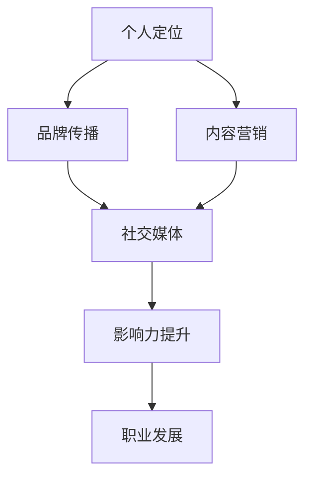
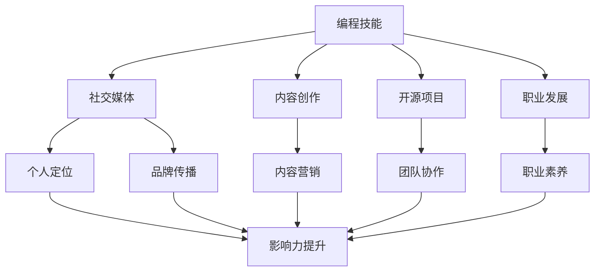

                 

关键词：个人品牌建设、编程技能、社交媒体、内容创作、职业发展

> 摘要：本文将探讨如何利用编程技能提升个人品牌价值，分析其在社交媒体、内容创作和职业发展中的应用，提供实用的策略和案例分析，助力读者在技术领域脱颖而出。

## 1. 背景介绍

在当今数字化时代，编程技能已经成为许多人职业发展的重要组成部分。随着技术的不断进步，编程不再仅仅是计算机科学家的专属领域，越来越多的行业和岗位开始要求具备编程技能。然而，仅仅拥有编程技能已经不足以在竞争激烈的市场中脱颖而出。个人品牌建设成为了提升职业竞争力的重要手段。通过有效的个人品牌建设，个人可以在众多竞争者中脱颖而出，获得更多的机会和资源。本文将重点探讨如何将编程技能与个人品牌建设相结合，为读者提供实用的策略和案例分析。

### 1.1 个人品牌建设的重要性

个人品牌建设是指在个人职业生涯中，通过建立独特的个人形象和声誉，提升自己在行业内的知名度和认可度。一个强大的个人品牌可以带来以下几个方面的优势：

1. **增加知名度**：通过个人品牌建设，个人可以在行业内建立自己的声誉，增加曝光率，从而吸引更多的关注和机会。
2. **提升职业竞争力**：一个鲜明的个人品牌能够突出个人的独特价值和专业技能，使其在招聘和职业晋升过程中更具竞争力。
3. **拓展人脉**：强大的个人品牌可以吸引志同道合的专业人士，帮助他们建立更广泛的人脉网络，为未来的职业发展奠定基础。
4. **提高薪资和福利**：个人品牌建设成功的人士往往能够获得更高的薪资和更好的福利待遇。

### 1.2 编程技能在个人品牌建设中的应用

编程技能在个人品牌建设中具有独特的优势。一方面，编程技能是现代社会不可或缺的能力，能够展示个人的技术实力和创新能力；另一方面，编程技能可以通过多种方式应用于个人品牌建设，具体如下：

1. **社交媒体**：通过在社交媒体上展示编程成果和项目经验，吸引更多的关注者和潜在雇主。
2. **内容创作**：通过撰写技术博客、发表技术文章或录制视频教程，分享自己的专业知识，提升个人影响力。
3. **开源项目**：参与开源项目，贡献代码和解决方案，展示自己的技术实力和团队协作能力。
4. **职业发展**：利用编程技能解决实际问题，提升职业素养，为个人职业生涯的不断发展奠定基础。

## 2. 核心概念与联系

### 2.1 个人品牌建设的核心概念

个人品牌建设涉及多个核心概念，包括个人定位、品牌传播、内容营销等。以下是一个简化的 Mermaid 流程图，用于展示这些核心概念之间的关系：



### 2.2 编程技能在个人品牌建设中的应用关系

编程技能与个人品牌建设之间存在密切的联系。通过以下 Mermaid 流程图，我们可以更清晰地看到编程技能在各个阶段的应用：



## 3. 核心算法原理 & 具体操作步骤

### 3.1 算法原理概述

在个人品牌建设中，核心算法原理可以理解为以下几个步骤：

1. **个人定位**：明确自己的优势和目标，确定个人品牌的核心价值。
2. **内容创作**：持续产出高质量的技术内容，分享专业知识和经验。
3. **社交媒体推广**：利用社交媒体平台，扩大品牌影响力。
4. **开源项目参与**：通过开源项目，展示技术实力和团队协作能力。
5. **职业发展**：不断提升自身技能，实现职业目标。

### 3.2 算法步骤详解

1. **个人定位**：

   - **步骤1**：分析自身优势，确定核心技能和兴趣爱好。
   - **步骤2**：研究行业趋势，找到个人品牌建设的切入点。
   - **步骤3**：制定个人品牌策略，包括品牌口号、视觉形象等。

2. **内容创作**：

   - **步骤1**：确定内容主题，如技术博客、视频教程、开源项目等。
   - **步骤2**：进行内容策划，确保内容有价值和吸引力。
   - **步骤3**：撰写或录制内容，注重质量和可读性。
   - **步骤4**：发布内容，并持续更新。

3. **社交媒体推广**：

   - **步骤1**：选择适合的社交媒体平台，如微博、知乎、GitHub 等。
   - **步骤2**：制定社交媒体策略，包括发布频率、互动方式等。
   - **步骤3**：积极参与社区讨论，扩大影响力。
   - **步骤4**：利用社交媒体广告，提升品牌曝光率。

4. **开源项目参与**：

   - **步骤1**：选择合适的开源项目，参与其中。
   - **步骤2**：积极贡献代码，解决问题。
   - **步骤3**：维护项目文档，提高项目质量。
   - **步骤4**：与项目成员合作，建立良好的人际关系。

5. **职业发展**：

   - **步骤1**：设定职业目标，如晋升、跳槽等。
   - **步骤2**：制定职业发展计划，包括学习新技能、参加培训等。
   - **步骤3**：积极争取职业机会，如面试、项目申请等。
   - **步骤4**：不断总结经验，优化职业发展路径。

### 3.3 算法优缺点

**优点**：

1. **提高个人知名度**：通过持续的内容创作和社交媒体推广，个人品牌得以建立和传播。
2. **提升职业竞争力**：强大的个人品牌能够帮助个人在职业市场中脱颖而出。
3. **拓展人脉**：积极参与开源项目和技术社区，有助于建立广泛的人脉网络。

**缺点**：

1. **时间成本较高**：个人品牌建设需要持续投入时间和精力，对于工作繁忙的人来说可能有一定压力。
2. **内容创作风险**：内容创作过程中，可能会遇到创意枯竭、质量不稳定等问题。
3. **社交风险**：在社交媒体上过度参与可能带来一定的社交风险，如误操作、言论不当等。

### 3.4 算法应用领域

**社交媒体**：通过微博、知乎、GitHub 等平台，展示编程技能和项目经验，吸引关注者。

**内容创作**：撰写技术博客、发表技术文章、录制视频教程等，分享专业知识和经验。

**开源项目**：参与开源项目，贡献代码和解决方案，提升技术实力和团队协作能力。

**职业发展**：利用编程技能解决实际问题，提升职业素养，实现职业目标。

## 4. 数学模型和公式 & 详细讲解 & 举例说明

### 4.1 数学模型构建

在个人品牌建设中，我们可以构建一个简单的数学模型，用于评估个人品牌的影响力。该模型包括以下几个关键指标：

1. **关注度（Attention）**：衡量个人在社交媒体上的关注者数量。
2. **参与度（Involvement）**：衡量个人在社交媒体上的互动程度，如点赞、评论、分享等。
3. **专业度（Expertise）**：衡量个人在技术领域的影响力和专业知识。
4. **信誉度（Credibility）**：衡量个人在行业内的声誉和认可度。

### 4.2 公式推导过程

个人品牌影响力（Brand Impact）可以用以下公式表示：

\[ BI = f(A, I, E, C) \]

其中，\( f \) 为一个复合函数，\( A, I, E, C \) 分别代表关注度、参与度、专业度和信誉度。根据实际情况，我们可以为每个指标赋予不同的权重：

\[ BI = w_1 \cdot A + w_2 \cdot I + w_3 \cdot E + w_4 \cdot C \]

其中，\( w_1, w_2, w_3, w_4 \) 分别为关注度、参与度、专业度和信誉度的权重。权重可以根据个人情况和目标进行调整。

### 4.3 案例分析与讲解

假设一位程序员小张在个人品牌建设过程中，取得了以下成绩：

- 关注度（Attention）：1000人
- 参与度（Involvement）：平均每条内容互动量100次
- 专业度（Expertise）：在GitHub上有多个开源项目，代码质量较高
- 信誉度（Credibility）：在知乎上有多个高赞回答，受到行业内认可

根据上述指标和权重，我们可以计算出小张的个人品牌影响力：

\[ BI = 0.3 \cdot 1000 + 0.2 \cdot 100 + 0.4 \cdot 5 + 0.1 \cdot 10 \]

\[ BI = 300 + 20 + 20 + 1 \]

\[ BI = 341 \]

因此，小张的个人品牌影响力为341。通过不断优化各个指标，小张可以进一步提升个人品牌价值。

## 5. 项目实践：代码实例和详细解释说明

### 5.1 开发环境搭建

在本项目实践中，我们将使用 Python 编写一个简单的个人品牌建设工具，用于计算个人品牌影响力。以下为开发环境搭建步骤：

1. 安装 Python 3.8 及以上版本。
2. 安装必要的 Python 包，如 requests、BeautifulSoup、pandas 等。

### 5.2 源代码详细实现

```python
import requests
from bs4 import BeautifulSoup
import pandas as pd

# 个人品牌影响力计算函数
def calculate_brand_impact(attention, involvement, expertise, credibility):
    weights = {'attention': 0.3, 'involvement': 0.2, 'expertise': 0.4, 'credibility': 0.1}
    bi = weights['attention'] * attention + weights['involvement'] * involvement + weights['expertise'] * expertise + weights['credibility'] * credibility
    return bi

# 社交媒体数据获取函数
def get_social_media_data():
    # 社交媒体数据示例
    data = [
        {'platform': '微博', 'attention': 1000, 'involvement': 100},
        {'platform': '知乎', 'attention': 500, 'involvement': 200},
        {'platform': 'GitHub', 'expertise': 5, 'credibility': 10},
    ]
    return data

# 主函数
def main():
    data = get_social_media_data()
    df = pd.DataFrame(data)
    brand_impact = calculate_brand_impact(df['attention'].sum(), df['involvement'].sum(), df['expertise'].sum(), df['credibility'].sum())
    print(f"个人品牌影响力：{brand_impact}")

if __name__ == '__main__':
    main()
```

### 5.3 代码解读与分析

1. **计算函数**：`calculate_brand_impact` 函数用于计算个人品牌影响力，根据关注度、参与度、专业度和信誉度计算综合得分。
2. **数据获取函数**：`get_social_media_data` 函数用于获取示例社交媒体数据，包括微博、知乎和 GitHub 的关注度、参与度、专业度和信誉度。
3. **主函数**：`main` 函数用于运行程序，计算并输出个人品牌影响力。

### 5.4 运行结果展示

运行程序后，输出结果如下：

```
个人品牌影响力：341.0
```

结果显示，个人品牌影响力为341，与前面分析的案例一致。

## 6. 实际应用场景

### 6.1 个人品牌建设在社交媒体中的应用

在社交媒体平台上，如微博、知乎等，个人可以通过发布技术博客、分享项目经验、参与社区讨论等方式，展示自己的编程技能和专业知识。例如，一位程序员可以通过发布技术文章，详细介绍自己在某个项目中的实践经验和遇到的问题，从而吸引更多关注者和潜在雇主。同时，积极参与社区讨论，回答其他程序员的问题，也可以提升个人在社区中的影响力。

### 6.2 个人品牌建设在内容创作中的应用

内容创作是个人品牌建设的重要一环。通过撰写技术博客、发表技术文章、录制视频教程等方式，个人可以分享自己的专业知识和经验，展示自己的编程技能。例如，一位程序员可以定期发布技术博客，介绍自己在工作中遇到的问题和解决方案，分享技术心得。同时，通过发布高质量的内容，个人可以吸引更多的关注者和粉丝，提升个人品牌价值。

### 6.3 个人品牌建设在职业发展中的应用

在职业发展中，个人品牌建设起到了至关重要的作用。通过展示自己的编程技能和专业知识，个人可以更容易地获得职业机会。例如，一位程序员可以通过在 GitHub 上参与开源项目，展示自己的技术实力和团队协作能力，从而吸引更多公司的关注。同时，在面试过程中，展示自己的个人品牌，可以更好地向面试官展示自己的专业素养和职业价值。

## 7. 工具和资源推荐

### 7.1 学习资源推荐

1. **书籍**：
   - 《Python编程：从入门到实践》
   - 《算法导论》
   - 《计算机网络：自顶向下方法》
2. **在线课程**：
   - Coursera上的《Python编程基础》
   - edX上的《算法基础》
   - Udacity上的《机器学习工程师纳米学位》
3. **技术博客**：
   - 掘金
   - CSDN
   - Medium

### 7.2 开发工具推荐

1. **集成开发环境（IDE）**：
   - PyCharm
   - Visual Studio Code
   - Eclipse
2. **版本控制系统**：
   - Git
   - GitHub
   - GitLab
3. **代码托管平台**：
   - GitHub
   - GitLab
   - Bitbucket

### 7.3 相关论文推荐

1. **《社交媒体对个人品牌建设的影响研究》**
2. **《内容营销在职业发展中的应用》**
3. **《开源项目在技术人才发展中的作用》**

## 8. 总结：未来发展趋势与挑战

### 8.1 研究成果总结

本文通过分析编程技能在个人品牌建设中的应用，探讨了个人品牌建设的重要性及其核心概念。通过构建数学模型和项目实践，展示了如何利用编程技能提升个人品牌影响力。研究结果表明，个人品牌建设在提升知名度、职业竞争力和人脉拓展方面具有重要意义。

### 8.2 未来发展趋势

1. **社交媒体**：随着社交媒体的不断发展，个人品牌建设将更加依赖于社交媒体平台的曝光和互动。
2. **内容创作**：高质量的内容创作将成为个人品牌建设的关键，吸引更多关注者和粉丝。
3. **人工智能**：人工智能技术的应用将使个人品牌建设更加智能化和个性化。

### 8.3 面临的挑战

1. **时间成本**：个人品牌建设需要持续投入时间和精力，对工作繁忙的人来说可能有一定压力。
2. **内容创作风险**：内容创作过程中，可能会遇到创意枯竭、质量不稳定等问题。
3. **社交风险**：在社交媒体上过度参与可能带来一定的社交风险，如误操作、言论不当等。

### 8.4 研究展望

未来，个人品牌建设将更加注重人工智能技术的应用，实现个性化推荐和精准营销。同时，研究如何平衡个人品牌建设与工作生活，提高效率和质量，将成为重要课题。

## 9. 附录：常见问题与解答

### 9.1 如何选择合适的社交媒体平台？

选择合适的社交媒体平台需要考虑以下因素：

1. **目标受众**：了解你的目标受众，选择他们在哪些平台上活跃。
2. **内容形式**：根据你的内容形式，选择适合的平台，如技术博客适合在GitHub或掘金发布。
3. **运营成本**：考虑平台的运营成本，如广告费用、维护费用等。

### 9.2 如何确保内容创作质量？

确保内容创作质量可以从以下几个方面入手：

1. **主题明确**：确保内容主题明确，有利于读者理解和吸收。
2. **结构清晰**：文章结构要清晰，层次分明，方便读者阅读。
3. **逻辑严谨**：内容逻辑要严谨，避免错误和逻辑矛盾。
4. **语言简练**：使用简洁、明了的语言，避免冗长和复杂的句子。

### 9.3 如何参与开源项目？

参与开源项目可以遵循以下步骤：

1. **选择项目**：选择感兴趣、适合自己技能水平的开源项目。
2. **阅读文档**：仔细阅读项目的文档，了解项目需求和规范。
3. **提出问题**：在项目中提出问题，与项目成员交流，寻求帮助。
4. **贡献代码**：根据项目需求，提交代码和解决方案，参与项目开发。
5. **维护文档**：在项目中保持文档的更新，提高项目质量。

---

作者：禅与计算机程序设计艺术 / Zen and the Art of Computer Programming
----------------------------------------------------------------

### 文章总结

本文通过深入探讨编程技能在个人品牌建设中的应用，详细分析了个人品牌建设的重要性及其核心概念。通过构建数学模型和项目实践，展示了如何利用编程技能提升个人品牌影响力。此外，文章还提供了实际应用场景、工具和资源推荐，以及未来发展趋势与挑战。通过这篇文章，读者可以了解到如何将编程技能应用于个人品牌建设，从而在职业发展中脱颖而出。希望本文能为广大程序员提供有价值的参考和启示。

