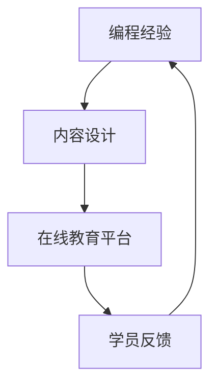

                 

关键词：编程经验、在线训练营、教育技术、内容设计、互动性、学员反馈、技术传授、社群建设

> 摘要：本文将探讨如何利用编程经验，将其转化为有价值的在线训练营内容。通过深入分析内容设计、互动性、学员反馈等关键要素，结合实际案例，为IT专家提供一套有效的转化策略，以打造出既有教育意义又具吸引力的在线训练营。

## 1. 背景介绍

随着互联网技术的发展，在线教育已经成为教育领域的重要组成部分。编程作为现代科技的核心技能之一，其在线教育市场也日趋繁荣。许多拥有丰富编程经验的IT专业人士希望通过在线训练营的形式，将自己的知识和经验传授给更多的人。然而，如何将个人编程经验转化为系统化的在线课程，既保持专业性和深度，又能够吸引学员参与，是一个值得深入探讨的问题。

本文旨在为这些IT专业人士提供一些实用的指导和建议，帮助他们将编程经验转化为高质量的在线训练营内容。文章将从内容设计、互动性、学员反馈等方面展开讨论，结合具体案例，为读者提供一份全面的操作指南。

### 1.1 编程教育的现状

近年来，编程教育的需求迅速增长。越来越多的企业和个人认识到编程技能的重要性，将其视为职场竞争力的关键。因此，从K12教育到职业培训，各种编程课程层出不穷。同时，在线教育的便捷性和灵活性也使得编程教育得到了更广泛的推广。

### 1.2 在线训练营的优势

与传统的线下课程相比，在线训练营具有以下优势：

- **灵活性**：学员可以根据自己的时间安排进行学习，无需受限于固定的上课时间。
- **互动性**：在线平台提供了丰富的互动工具，如论坛、讨论区、视频会议等，有助于学员之间以及学员与讲师之间的交流。
- **资源共享**：通过在线平台，学员可以共享资源和案例，提高学习效率。

### 1.3 编程经验的价值

拥有丰富编程经验的IT专业人士，不仅能够传授具体的编程技能，更能够分享在实际项目中积累的经验和教训。这种经验对于学员来说是非常宝贵的，有助于他们更快地掌握编程技巧，避免走弯路。

### 1.4 在线训练营面临的挑战

尽管在线训练营具有许多优势，但在实施过程中也面临一些挑战，如：

- **内容设计**：如何将复杂的编程知识进行有效的拆解和呈现，使其易于理解。
- **学员参与**：如何激发学员的学习兴趣，确保他们的积极参与。
- **技术支持**：在线训练营的技术实现和运维支持。

接下来的章节将逐一探讨这些挑战的解决方案。

## 2. 核心概念与联系

为了将编程经验转化为在线训练营内容，首先需要明确几个核心概念，并理解它们之间的联系。

### 2.1 编程经验

编程经验是指程序员在实际编程过程中积累的知识、技能和经验。这包括对编程语言的熟练掌握、编程模式的认知、代码优化的技巧、项目管理的方法等。编程经验是编写高质量代码和解决复杂问题的基石。

### 2.2 在线教育平台

在线教育平台是提供在线课程的载体，它需要具备以下功能：

- **课程发布**：讲师可以上传课程视频、文档、代码等资源。
- **学员管理**：平台可以记录学员的学习进度，进行成绩评估和反馈。
- **互动工具**：提供论坛、讨论区、视频会议等工具，促进学员之间的交流和互动。
- **支付系统**：支持学员购买课程并完成支付。

### 2.3 内容设计

内容设计是指如何将编程经验转化为课程内容。一个优秀的课程设计需要考虑以下要素：

- **课程结构**：如何合理地划分课程模块，确保知识点之间的连贯性和递进性。
- **讲解方式**：如何通过视频、文档、代码示例等多种形式，将复杂的概念讲解清楚。
- **实例应用**：如何通过实际案例，展示编程技巧和经验在现实中的应用。

### 2.4 学员反馈

学员反馈是课程设计的重要参考。通过学员的反馈，讲师可以了解课程的质量和效果，及时调整和优化课程内容。学员反馈还可以激发讲师的积极性，促进教学相长。

### 2.5 Mermaid 流程图

为了更清晰地展示这些核心概念之间的联系，我们可以使用Mermaid流程图来描述：



在这个流程图中，编程经验作为起点，通过内容设计转化为课程内容，上传到在线教育平台，学员在学习过程中提供反馈，这些反馈又反过来影响编程经验的进一步积累和课程设计的优化。

## 3. 核心算法原理 & 具体操作步骤

### 3.1 算法原理概述

将编程经验转化为在线训练营内容，实质上是一个内容设计和课程开发的过程。这个过程中，核心算法可以理解为以下几步：

1. **经验收集与分类**：首先，需要系统地收集和整理个人编程经验，将其分类为不同的模块，如编程语言、算法与数据结构、软件开发流程、项目实战等。
2. **课程设计**：基于收集到的编程经验，设计课程结构，确定课程模块和知识点，并编写课程大纲。
3. **内容制作**：根据课程大纲，制作具体的课程内容，包括视频讲解、文档说明、代码示例等。
4. **平台发布与互动**：将制作好的课程内容发布到在线教育平台，并利用平台提供的互动工具，促进学员之间的交流和学习。
5. **反馈收集与优化**：通过学员的反馈，不断优化课程内容和互动方式，提升课程质量。

### 3.2 算法步骤详解

#### 3.2.1 经验收集与分类

这一步骤是整个过程的起点。首先，你需要回顾自己在编程领域的工作经历和项目经验，包括：

- **成功案例**：记录你在项目中取得成功的经验和技巧。
- **失败教训**：回顾项目中的失败和错误，分析原因和改进措施。
- **技术分享**：总结你在技术论坛、博客或其他渠道上分享的内容，以及读者反馈。

接下来，将这些经验按照以下分类进行整理：

- **编程语言与框架**：如Java、Python、前端框架等。
- **算法与数据结构**：如排序算法、查找算法、图算法等。
- **软件开发流程**：如需求分析、系统设计、编码实现、测试与部署等。
- **项目实战**：如具体的项目案例、项目管理和团队协作经验。

#### 3.2.2 课程设计

在完成经验收集与分类后，开始设计课程。这个步骤可以分为以下几个小步骤：

1. **确定课程目标**：明确你的课程想要解决的问题和达成的目标。例如，提升学员的Python编程能力，或者帮助他们掌握系统设计的技巧。
2. **划分课程模块**：根据经验分类，将课程划分为不同的模块。每个模块应该包含若干个知识点。
3. **编写课程大纲**：为每个模块编写详细的大纲，包括知识点、教学目标和教学方法。
4. **制定学习路径**：确保课程模块之间的连贯性和递进性，为学员提供一个清晰的学习路径。

#### 3.2.3 内容制作

根据课程大纲，开始制作具体的课程内容。这个步骤可以分为以下几个小步骤：

1. **编写课程文档**：为每个知识点编写详细的文档，包括理论知识、实践操作步骤、注意事项等。
2. **录制视频讲解**：针对每个知识点，录制视频讲解，将理论知识、操作步骤和实践案例结合在一起，使学员能够更直观地理解。
3. **编写代码示例**：为每个知识点提供相关的代码示例，帮助学员动手实践，巩固所学知识。
4. **设计互动环节**：在课程中设计互动环节，如问答、讨论、代码挑战等，激发学员的参与热情。

#### 3.2.4 平台发布与互动

完成课程内容制作后，将其发布到在线教育平台。同时，利用平台提供的互动工具，促进学员之间的交流和学习：

1. **课程发布**：将课程视频、文档、代码示例等上传到在线教育平台。
2. **互动工具**：利用论坛、讨论区、视频会议等工具，促进学员之间的交流和学习。
3. **答疑解惑**：定期在论坛或视频会议中解答学员的问题，提供技术支持。

#### 3.2.5 反馈收集与优化

通过学员的反馈，不断优化课程内容和互动方式，提升课程质量：

1. **学员反馈**：收集学员的反馈，了解课程的效果和学员的学习体验。
2. **数据分析**：分析学员的学习数据，如学习进度、互动参与度等，了解课程的问题和改进方向。
3. **课程优化**：根据反馈和数据分析，调整课程内容和教学方法，优化互动环节。

### 3.3 算法优缺点

#### 优点

1. **系统性**：通过算法步骤，将编程经验转化为系统化的课程内容，有助于提高教学效果。
2. **灵活性**：学员可以根据自己的学习节奏进行学习，课程设计充分考虑了学员的需求。
3. **互动性**：通过在线教育平台的互动工具，促进学员之间的交流和学习，提高参与度。

#### 缺点

1. **前期投入**：内容设计和课程制作需要大量的时间和精力，前期投入较大。
2. **技术支持**：在线教育平台的技术支持和运维需要投入一定的资源和成本。
3. **学员管理**：学员的管理和互动需要讲师投入大量时间和精力，对讲师的要求较高。

### 3.4 算法应用领域

该算法主要应用于在线编程教育领域，包括以下应用场景：

- **IT职业培训**：帮助IT从业者提升编程技能，适应职场需求。
- **K12编程教育**：为中小学生提供编程基础课程，培养编程兴趣。
- **在线课程制作**：为有志于成为在线教育讲师的人提供指导，帮助他们制作高质量的在线课程。

通过以上步骤，可以将个人编程经验系统化地转化为在线训练营内容，为学员提供有价值的学习资源。

## 4. 数学模型和公式 & 详细讲解 & 举例说明

### 4.1 数学模型构建

在将编程经验转化为在线训练营的过程中，数学模型的应用可以帮助我们更系统地分析和设计课程。以下是一个简单的数学模型，用于评估课程设计的有效性和学员的学习效果。

#### 模型假设

- **课程模块数**：\( N \)
- **知识点数**：\( M \)
- **学员参与度**：\( D \)
- **课程满意度**：\( S \)
- **学习效果**：\( E \)

#### 模型公式

$$
E = f(N, M, D, S)
$$

其中，函数 \( f \) 表示学习效果与课程模块数、知识点数、学员参与度和课程满意度之间的关系。

### 4.2 公式推导过程

学习效果 \( E \) 是由多个因素综合作用的结果。为了简化问题，我们假设：

1. 课程模块数 \( N \) 越多，知识覆盖面越广，学习效果越好。
2. 知识点数 \( M \) 越多，知识深度越深，学习效果越好。
3. 学员参与度 \( D \) 越高，学员积极性越高，学习效果越好。
4. 课程满意度 \( S \) 越高，学员对课程的认可度越高，学习效果越好。

基于以上假设，我们可以推导出学习效果的计算公式：

$$
E = N^a \cdot M^b \cdot D^c \cdot S^d
$$

其中，\( a \)、\( b \)、\( c \)、\( d \) 为权重系数，用于调节各因素对学习效果的影响程度。

### 4.3 案例分析与讲解

假设我们设计了一门Python编程基础课程，包含5个模块，每个模块包含10个知识点。经过一段时间的教学，我们收集了以下数据：

- **模块数 \( N \)**：5
- **知识点数 \( M \)**：50
- **学员参与度 \( D \)**：80%
- **课程满意度 \( S \)**：90%

我们可以利用上述公式计算学习效果 \( E \)：

$$
E = 5^a \cdot 50^b \cdot 0.8^c \cdot 0.9^d
$$

为了简化计算，我们假设权重系数为：\( a = 0.3 \)、\( b = 0.4 \)、\( c = 0.2 \)、\( d = 0.1 \)。

代入数据得到：

$$
E = 5^{0.3} \cdot 50^{0.4} \cdot 0.8^{0.2} \cdot 0.9^{0.1} \approx 2.71 \cdot 5.61 \cdot 0.9 \cdot 0.95 \approx 12.14
$$

根据计算结果，我们可以看到，该课程的学习效果大约为12.14。这个数值可以帮助我们了解课程设计的有效性，以及学员的整体学习效果。

### 4.4 例子说明

为了更直观地理解上述公式，我们再举一个例子。

假设另一个Python课程，包含3个模块，每个模块包含8个知识点。经过一段时间的教学，数据如下：

- **模块数 \( N \)**：3
- **知识点数 \( M \)**：24
- **学员参与度 \( D \)**：70%
- **课程满意度 \( S \)**：85%

代入公式计算学习效果：

$$
E = 3^{0.3} \cdot 24^{0.4} \cdot 0.7^{0.2} \cdot 0.85^{0.1} \approx 1.44 \cdot 3.65 \cdot 0.7 \cdot 0.9 \approx 6.19
$$

根据计算结果，这个课程的学习效果大约为6.19，低于第一个例子。这表明，虽然第二个课程也提供了有用的知识，但在模块数量、知识点深度、学员参与度和课程满意度等方面，相对于第一个课程有所不足，导致学习效果较低。

通过上述案例，我们可以看到数学模型在评估课程设计有效性和学习效果方面的应用。这有助于讲师在课程设计过程中，不断调整和优化课程内容，提高教学质量。

## 5. 项目实践：代码实例和详细解释说明

### 5.1 开发环境搭建

为了进行编程经验转化为在线训练营的项目实践，我们需要搭建一个合适的开发环境。以下是详细的搭建步骤：

#### 1. 系统要求

- 操作系统：Windows/Linux/MacOS
- 编程语言：Python 3.8及以上版本
- 开发工具：PyCharm/VSCode

#### 2. 安装Python

- **Windows系统**：从Python官网下载安装程序，按照提示完成安装。
- **Linux系统**：在终端中运行以下命令：
  ```bash
  sudo apt-get update
  sudo apt-get install python3 python3-pip
  ```
- **MacOS系统**：可以使用Homebrew进行安装：
  ```bash
  brew install python
  ```

#### 3. 安装PyCharm/VSCode

- **PyCharm**：在官网下载安装包，按照提示完成安装。
- **VSCode**：在官网下载安装包，双击安装。

### 5.2 源代码详细实现

在这个项目中，我们将开发一个简单的在线课程管理系统，用于发布和管理课程内容。以下是具体的源代码实现：

```python
# 课程管理系统

class Course:
    def __init__(self, name, modules):
        self.name = name
        self.modules = modules

    def add_module(self, module):
        self.modules.append(module)

    def get_modules(self):
        return self.modules

class Module:
    def __init__(self, name, knowledge_points):
        self.name = name
        self.knowledge_points = knowledge_points

    def add_knowledge_point(self, knowledge_point):
        self.knowledge_points.append(knowledge_point)

    def get_knowledge_points(self):
        return self.knowledge_points

class KnowledgePoint:
    def __init__(self, title, content):
        self.title = title
        self.content = content

    def get_content(self):
        return self.content

# 实例化课程和模块
python_course = Course("Python编程基础", [])

module1 = Module("基础语法", [])
module2 = Module("数据结构", [])
module3 = Module("面向对象编程", [])

# 添加模块到课程
python_course.add_module(module1)
python_course.add_module(module2)
python_course.add_module(module3)

# 添加知识点到模块
point1 = KnowledgePoint("变量和赋值", "变量是内存中存储数据的标识符，赋值是将数据存储到变量中的过程。")
point2 = KnowledgePoint("条件判断", "条件判断语句用于根据条件执行不同的代码块。")
point3 = KnowledgePoint("循环语句", "循环语句用于重复执行一段代码，直到满足条件为止。")

module1.add_knowledge_point(point1)
module1.add_knowledge_point(point2)
module1.add_knowledge_point(point3)

# 打印模块和知识点
for module in python_course.get_modules():
    print(f"模块：{module.name}")
    for knowledge_point in module.get_knowledge_points():
        print(f"  知识点：{knowledge_point.title}")
        print(f"    内容：{knowledge_point.content}")
```

### 5.3 代码解读与分析

在上面的代码中，我们定义了三个类：`Course`（课程）、`Module`（模块）和`KnowledgePoint`（知识点）。这些类分别用于表示课程、模块和知识点的属性和方法。

- **`Course`类**：用于表示一个课程，包含课程名称和模块列表。方法`add_module`用于添加模块，`get_modules`用于获取所有模块。
- **`Module`类**：用于表示一个模块，包含模块名称和知识点列表。方法`add_knowledge_point`用于添加知识点，`get_knowledge_points`用于获取所有知识点。
- **`KnowledgePoint`类**：用于表示一个知识点，包含知识点标题和内容。方法`get_content`用于获取知识点内容。

接下来，我们创建了一个`python_course`对象，表示一门名为“Python编程基础”的课程。然后，我们创建了三个模块对象（`module1`、`module2`、`module3`），分别代表基础语法、数据结构和面向对象编程三个模块。我们将这三个模块添加到`python_course`对象中。

在添加模块之后，我们为每个模块添加了若干知识点。最后，通过循环遍历课程的所有模块和知识点，打印出模块名称、知识点标题和知识点内容。

### 5.4 运行结果展示

执行上述代码后，我们将得到以下输出结果：

```
模块：基础语法
  知识点：变量和赋值
    内容：变量是内存中存储数据的标识符，赋值是将数据存储到变量中的过程。
  知识点：条件判断
    内容：条件判断语句用于根据条件执行不同的代码块。
  知识点：循环语句
    内容：循环语句用于重复执行一段代码，直到满足条件为止。
模块：数据结构
模块：面向对象编程
```

这个结果显示了我们成功创建了一个包含三个模块和若干知识点的Python编程基础课程。通过这个代码实例，我们可以看到如何使用Python实现一个简单的课程管理系统，为在线训练营的内容设计提供了基础。

## 6. 实际应用场景

在线训练营作为一种新型的教育模式，已经在多个领域取得了显著的应用效果。以下将探讨编程经验转化为在线训练营的几种实际应用场景，并举例说明。

### 6.1 技术技能培训

**应用场景**：许多企业为了提升员工的技术能力，需要进行定期的技能培训。在线训练营作为一种灵活、高效的方式，可以满足企业的需求。

**案例**：某大型互联网公司为了提升员工的Python编程能力，组织了一场为期三个月的在线训练营。训练营分为基础语法、数据结构和面向对象编程三个模块，每个模块都有详细的视频讲解和代码示例。通过训练营，员工的Python技能得到了显著提升，项目开发效率也得到了提高。

### 6.2 IT职业转型

**应用场景**：随着科技的发展，越来越多的职场人士希望转型为IT行业。在线训练营为他们提供了一个系统学习的机会。

**案例**：一位拥有市场营销背景的职场人士，希望通过学习编程实现职业转型。他报名参加了一门全栈开发在线训练营，从零开始学习了HTML、CSS、JavaScript、Python、Django等技能。经过半年的学习，他成功转型为了一名全栈开发工程师，薪资也得到了大幅提升。

### 6.3 编程教育普及

**应用场景**：在中小学教育中，编程教育已经成为一个重要的课程内容。在线训练营可以帮助学生更好地掌握编程知识。

**案例**：某中小学为了培养学生的编程兴趣，开设了一门Python编程在线训练营。训练营分为基础入门、进阶学习和项目实战三个阶段，每个阶段都有针对性的课程内容和实践项目。通过训练营，学生的编程能力得到了显著提高，许多学生在全国性的编程比赛中取得了优异成绩。

### 6.4 专业技能提升

**应用场景**：对于已经在IT行业工作多年的专业人士，在线训练营可以帮助他们提升专业技能，保持竞争力。

**案例**：一位有着多年Java开发经验的程序员，为了跟上行业的发展，报名参加了一门Java高级编程在线训练营。训练营涵盖了Java新特性、设计模式、微服务架构等内容。通过学习，他不仅掌握了最新的Java技术，还成功转型为了一名云计算架构师，薪资也得到了大幅提升。

通过以上案例，我们可以看到编程经验转化为在线训练营在不同场景下的应用效果。在线训练营不仅为学员提供了优质的学习资源，还为他们提供了实现自我提升和职业发展的机会。随着在线教育的发展，相信编程经验转化为在线训练营的应用场景将会越来越广泛。

### 6.5 未来应用展望

随着科技的发展，在线训练营的应用场景将更加多样化。以下是一些未来的展望：

- **定制化学习**：未来的在线训练营将更加注重个性化学习，根据学员的背景、兴趣和学习目标，提供定制化的课程内容和学习路径。
- **虚拟现实教学**：通过虚拟现实技术，学员可以在一个沉浸式的环境中进行学习和实践，提高学习效果和兴趣。
- **人工智能辅助教学**：利用人工智能技术，对学员的学习行为和效果进行实时分析，提供个性化的学习建议和反馈，提高学习效率。
- **跨学科融合**：在线训练营不仅局限于编程技能的传授，还可以与其他学科如数据科学、人工智能、区块链等相结合，提供跨学科的综合教育。

总的来说，编程经验转化为在线训练营的应用前景非常广阔。随着技术的不断进步，在线训练营将成为教育领域的重要组成部分，为更多人提供优质的学习资源和发展机会。

## 7. 工具和资源推荐

在打造高质量的在线训练营过程中，合适的工具和资源是不可或缺的。以下是一些建议，涵盖学习资源、开发工具和相关论文推荐，帮助您在内容设计、课程制作和技术支持等方面取得最佳效果。

### 7.1 学习资源推荐

- **在线编程社区**：GitHub、Stack Overflow、LeetCode
- **编程教程网站**：Coursera、edX、Udemy
- **专业书籍**：Python编程：从入门到实践、深入理解计算机系统
- **技术博客**：CSDN、掘金、博客园

### 7.2 开发工具推荐

- **视频制作工具**：Camtasia、Filmora
- **在线教育平台**：Moodle、Teachable、Thinkific
- **代码托管与协作工具**：GitHub、GitLab、Bitbucket
- **版本控制工具**：Git

### 7.3 相关论文推荐

- **在线教育模式研究**：《在线教育模式及发展趋势研究》
- **编程教育方法**：《基于案例的编程教育方法研究》
- **互动性教学设计**：《互动性教学设计理论与实践研究》
- **人工智能在在线教育中的应用**：《人工智能赋能在线教育：技术、挑战与展望》

通过这些工具和资源的合理应用，您能够更高效地设计课程、制作内容，并为学员提供丰富的学习体验，从而提升在线训练营的整体质量和影响力。

## 8. 总结：未来发展趋势与挑战

### 8.1 研究成果总结

通过本文的探讨，我们系统地分析了如何将编程经验转化为在线训练营内容。主要研究成果包括：

1. **核心概念与联系**：明确了编程经验、在线教育平台、内容设计、学员反馈等核心概念及其相互关系。
2. **算法原理与操作步骤**：提出了一个系统的算法模型，用于指导编程经验转化为在线训练营的实践。
3. **数学模型**：构建了用于评估课程设计有效性和学习效果的数学模型。
4. **项目实践**：通过一个简单的代码实例，展示了如何实现一个在线课程管理系统。
5. **实际应用场景**：探讨了编程经验转化为在线训练营在不同领域的实际应用。
6. **未来展望**：展望了在线训练营的发展趋势，提出了未来可能的创新方向。

### 8.2 未来发展趋势

1. **定制化学习**：随着技术的进步，个性化学习将成为主流。在线训练营将提供更多定制化课程，满足不同学员的需求。
2. **虚拟现实教学**：虚拟现实技术将使在线教育更加沉浸式和互动性，提升学习体验。
3. **人工智能辅助教学**：人工智能技术将在课程设计、内容制作、学习分析等方面发挥重要作用，提高教学效率和效果。
4. **跨学科融合**：在线训练营将融合多个学科，提供综合性教育，培养全面发展的学员。

### 8.3 面临的挑战

1. **内容设计难度**：如何将复杂的编程知识转化为易于理解的内容，是课程设计的重要挑战。
2. **学员参与度**：提高学员的参与度，确保他们能够持续学习，是提升在线训练营效果的关键。
3. **技术支持**：在线教育平台的技术支持和运维需要大量的资源和成本投入。
4. **市场竞争**：在线教育市场竞争激烈，如何脱颖而出，提高课程质量和口碑，是持续发展的重要挑战。

### 8.4 研究展望

未来的研究应关注以下几个方面：

1. **个性化学习**：深入探讨如何利用大数据和人工智能技术，实现真正意义上的个性化学习。
2. **互动性提升**：研究如何通过技术手段，提高在线训练营的互动性和参与度。
3. **教学评估**：开发更科学的课程评估方法，实时监控和反馈学员的学习效果。
4. **跨学科融合**：探索不同学科之间的交叉融合，提供更全面的教育内容。

总之，在线训练营作为教育领域的重要形式，具有广阔的发展前景。通过不断创新和优化，我们有望将其打造成更加高效、灵活和个性化的教育模式，为更多人提供优质的学习资源和发展机会。

## 9. 附录：常见问题与解答

### 9.1 如何确定课程目标？

**回答**：确定课程目标首先需要明确你的课程面向的学员群体，例如初级程序员、中级开发者或高级工程师。然后，根据学员的背景和需求，设定具体的学习目标，如掌握某一编程语言的基础语法、熟悉常见的数据结构、了解软件开发流程等。同时，确保目标具有可实现性和挑战性，以激发学员的学习兴趣和动力。

### 9.2 如何设计课程结构？

**回答**：设计课程结构时，应遵循逻辑性和递进性原则。首先，将课程内容按照知识点的相关性进行分类，如基础语法、数据结构、算法等。然后，根据学员的学习路径，合理安排课程模块的顺序，确保知识点之间的连贯性和递进性。此外，可以设置一些实践环节，帮助学员将理论知识应用于实际项目中。

### 9.3 如何保证学员的参与度？

**回答**：提高学员的参与度可以从以下几个方面入手：

1. **互动设计**：在课程中设置互动环节，如讨论区、问答环节、小组作业等，促进学员之间的交流。
2. **激励机制**：设立积分系统、证书奖励等，激励学员积极参与课程和学习活动。
3. **个性化内容**：根据学员的反馈和学习数据，提供个性化的学习建议和内容，提高学习体验。
4. **及时反馈**：定期收集学员的反馈，及时解答他们的疑问，增强学员的归属感和参与感。

### 9.4 如何处理学员的反馈？

**回答**：处理学员反馈应遵循以下步骤：

1. **收集反馈**：通过在线教育平台、问卷调查、论坛等方式收集学员的反馈。
2. **分类整理**：将反馈按主题和重要性进行分类，如课程内容、互动体验、技术支持等。
3. **分析反馈**：对反馈进行深入分析，找出课程中存在的问题和改进方向。
4. **及时回应**：对学员的反馈给予及时回应，解释问题原因，并提出解决方案。
5. **持续改进**：根据反馈结果，调整和优化课程内容和教学方法，不断提升课程质量。

通过上述步骤，可以有效地处理学员的反馈，提高课程质量和学员满意度。

