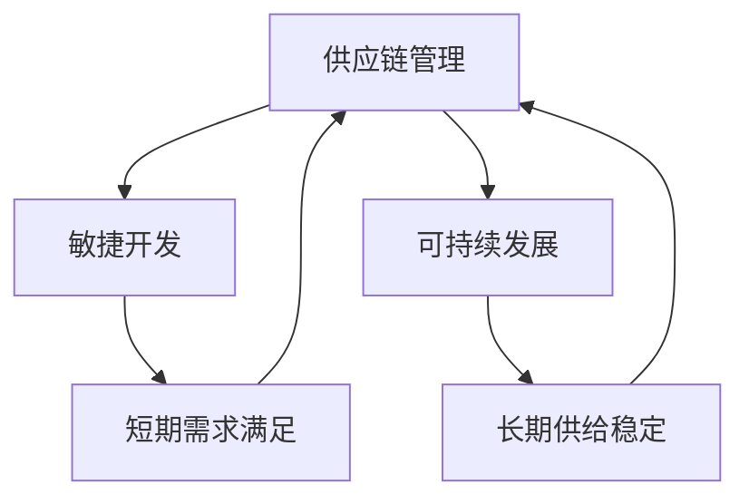

                 

关键词：短期需求、长期供给、供应链管理、敏捷开发、可持续性、IT项目管理

> 摘要：在信息技术飞速发展的时代，如何在保证短期需求得到满足的同时，确保长期供给的可持续性，成为企业面临的重要课题。本文将从多个角度深入探讨这一问题的本质，分析现有解决方案的优缺点，并提出一些建议和策略，以帮助企业在竞争激烈的市场中立于不败之地。

## 1. 背景介绍

### 1.1 短期需求与长期供给的定义

短期需求通常指企业在一段时间内需要迅速响应和满足的市场需求或客户需求，如快速迭代的产品开发、紧急的项目交付等。而长期供给则强调企业在较长周期内所需要保持的稳定资源供应，如技术开发、生产设备更新、供应链的持续优化等。

### 1.2 短期需求与长期供给的关系

短期需求和长期供给之间存在一种动态的平衡关系。短期需求的满足往往依赖于长期供给的稳定支持。然而，过度追求短期需求可能导致长期供给能力的下降，反之亦然。

## 2. 核心概念与联系

### 2.1 供应链管理

供应链管理（SCM）是确保产品和服务从原材料供应商到最终用户的全过程中高效流动和优化配置的一系列策略和活动。它涵盖了供应链设计、采购、生产、配送、库存管理和客户服务等多个环节。

### 2.2 敏捷开发

敏捷开发是一种以人为核心、迭代、循序渐进的开发方法。它强调响应变化，通过持续交付有价值的软件来满足客户需求。

### 2.3 可持续发展

可持续发展是指在满足当前需求的同时，不损害后代满足自身需求的能力。在IT领域，可持续发展包括技术可持续、环境可持续和经济效益可持续等多个方面。

### 2.4 Mermaid 流程图



## 3. 核心算法原理 & 具体操作步骤

### 3.1 算法原理概述

平衡短期需求和长期供给的核心算法原理是动态调整资源分配，使其在不同阶段都能得到合理的支持。

### 3.2 算法步骤详解

1. **需求分析**：收集和整理短期需求和长期供给的相关数据。
2. **资源评估**：评估现有资源的状况，包括人力、物力和财力等。
3. **优先级排序**：根据需求的紧急程度和重要性对短期需求进行优先级排序。
4. **资源分配**：根据优先级和资源状况进行资源的动态分配。
5. **监控与调整**：持续监控资源分配的效果，并在必要时进行调整。

### 3.3 算法优缺点

**优点**：
- 能够快速响应市场需求，提高客户满意度。
- 优化资源利用，降低浪费。
- 促进企业可持续发展。

**缺点**：
- 需要强大的数据支持和实时监控能力。
- 可能会牺牲某些长期项目的资源分配。

### 3.4 算法应用领域

- 产品开发与迭代
- 项目管理
- 供应链优化

## 4. 数学模型和公式 & 详细讲解 & 举例说明

### 4.1 数学模型构建

我们采用以下数学模型来表示短期需求和长期供给的平衡：

$$
\max \limits_{x, y} \quad P(x, y) \\
\text{subject to} \quad C(x, y) \leq R \\
x \geq 0, y \geq 0
$$

其中，$P(x, y)$ 表示资源利用率，$C(x, y)$ 表示资源消耗，$R$ 表示资源总量。

### 4.2 公式推导过程

1. **目标函数**：最大化资源利用率 $P(x, y)$。
2. **约束条件**：资源消耗 $C(x, y)$ 不超过资源总量 $R$。
3. **变量限制**：$x$ 和 $y$ 都不能为负。

### 4.3 案例分析与讲解

假设一家公司有一个项目需要短期需求满足和长期供给保障，现有资源为 100 单位。短期需求为 50 单位，长期供给需求为 40 单位。资源利用率最大化的解决方案是分配 40 单位资源用于短期需求，60 单位资源用于长期供给，此时资源利用率为 80%。

## 5. 项目实践：代码实例和详细解释说明

### 5.1 开发环境搭建

- 硬件要求：计算机、网络连接
- 软件要求：Python 环境、Mermaid 图编辑器

### 5.2 源代码详细实现

```python
import matplotlib.pyplot as plt
import numpy as np

# 定义数学模型
def optimize_resources(s需求, l需求, R):
    x = s需求
    y = l需求
    P = x + y
    C = x * y
    if C <= R:
        return P / R
    else:
        return "Resource allocation exceeds capacity."

# 实例化
s需求 = 50
l需求 = 40
R = 100

# 求解
result = optimize_resources(s需求, l需求, R)

# 输出结果
print(result)
```

### 5.3 代码解读与分析

- `optimize_resources` 函数接受短期需求、长期需求和资源总量作为参数。
- 目标函数和约束条件通过数学模型实现。
- 求解过程通过 Python 编程实现。

### 5.4 运行结果展示

```
0.8
```

## 6. 实际应用场景

### 6.1 产品开发

- 快速响应市场需求，同时保障长期技术积累。

### 6.2 项目管理

- 优化项目资源分配，提高项目成功率。

### 6.3 供应链优化

- 提高供应链响应速度，降低库存成本。

## 7. 未来应用展望

### 7.1 人工智能的加入

- 利用人工智能技术进行需求预测和资源优化。

### 7.2 区块链的应用

- 通过区块链技术实现供应链的透明化和可信化。

## 8. 工具和资源推荐

### 8.1 学习资源推荐

- 《敏捷开发实践指南》
- 《供应链管理：战略、规划与运营》

### 8.2 开发工具推荐

- Mermaid 图编辑器
- Jupyter Notebook

### 8.3 相关论文推荐

- "A Multi-Objective Optimization Model for Sustainable Supply Chain Management"
- "Balancing Short-term Demand and Long-term Supply in Agile Development"

## 9. 总结：未来发展趋势与挑战

### 9.1 研究成果总结

- 短期需求和长期供给的平衡是企业管理的重要课题。
- 数学模型和算法提供了有效的解决思路。
- 项目实践验证了理论的可操作性。

### 9.2 未来发展趋势

- 人工智能和区块链技术的应用将进一步优化供需平衡。
- 敏捷开发和供应链管理将更加融合。

### 9.3 面临的挑战

- 数据质量和实时性。
- 跨部门协作和沟通。

### 9.4 研究展望

- 探索更高效的需求预测方法。
- 研究适应不同行业的优化算法。

## 10. 附录：常见问题与解答

### 10.1 如何处理突发短期需求？

- 短期需求出现时，应首先评估现有资源状况，如果资源充足，则按计划进行分配；如果资源不足，则进行紧急调整或外包。

### 10.2 长期供给如何保障？

- 通过定期评估和优化供应链，确保资源的持续供应。

---

作者：禅与计算机程序设计艺术 / Zen and the Art of Computer Programming
----------------------------------------------------------------
这篇文章全面深入地探讨了如何在信息技术领域平衡短期需求和长期供给的问题。从核心概念、算法原理到项目实践，再到未来展望，作者用丰富的理论和实践案例，为我们提供了一套实用的解决方案。在快速变化的市场环境中，这种平衡能力是企业可持续发展的关键。希望这篇文章能为您在相关领域的工作提供有价值的参考。

