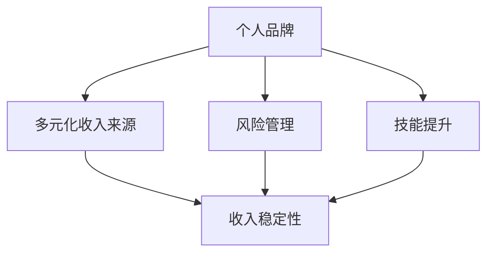

                 

关键词：收入模式、长期稳定性、技术专家、个人品牌、多元化收入来源、风险管理、技能提升

> 摘要：本文将探讨技术专家如何通过构建多元化的收入来源，利用个人品牌，进行有效的风险管理以及不断提升自己的技能，从而建立长期稳定的收入模式。通过详细的案例分析和实用建议，帮助技术专家在职业发展中实现财务自由。

## 1. 背景介绍

在当今快速变化的技术环境中，技术专家面临着前所未有的职业发展机遇。然而，如何确保自己在职业生涯中实现长期稳定的收入，是每个技术专家都必须认真思考的问题。传统的收入来源，如全职工作、项目合同等，可能无法满足技术专家对财务自由的追求。因此，建立多元化的收入模式，实现收入的长期稳定性，成为了技术专家职业发展的重要课题。

本文旨在通过探讨以下几个关键点，帮助技术专家构建长期稳定的收入模式：

1. **核心概念与联系**：介绍构建长期稳定收入模式所需理解的核心概念。
2. **核心算法原理 & 具体操作步骤**：探讨如何通过技能提升和多样化收入来源来实现收入稳定。
3. **数学模型和公式**：通过数学模型和公式，理解收入稳定性的量化指标。
4. **项目实践**：提供实际案例，展示如何将理论应用到实践中。
5. **实际应用场景**：探讨收入稳定性的应用场景及其未来展望。
6. **工具和资源推荐**：推荐有助于技术专家提升收入稳定性的工具和资源。
7. **总结**：对研究成果进行总结，并展望未来趋势与挑战。

## 2. 核心概念与联系

要建立长期稳定的收入模式，我们需要理解几个核心概念：

### 个人品牌

个人品牌是指技术专家通过自身的技能、知识、经验和声望在市场上建立的一种独特的身份和形象。一个强大的个人品牌能够吸引更多的机会和资源，从而提高收入稳定性。

### 多元化收入来源

多元化收入来源意味着技术专家不应该依赖于单一的收入渠道。通过在不同的领域、项目或产品中创造价值，技术专家可以分散风险，提高收入的稳定性。

### 风险管理

风险管理是指技术专家通过识别、评估和应对潜在风险，以保护自己收入稳定性的过程。有效的风险管理能够降低职业风险，从而提高收入的稳定性。

### 技能提升

技能提升是指技术专家通过不断学习、实践和分享，提升自己在技术领域和专业领域的竞争力。技能提升不仅能够增加收入，还能提高职业稳定性。

下面是一个使用 Mermaid 语言的流程图，展示了这些核心概念之间的联系：



## 3. 核心算法原理 & 具体操作步骤

### 3.1 算法原理概述

建立长期稳定收入模式的核心算法可以概括为：

1. **构建个人品牌**：通过建立独特的专业形象和口碑，吸引更多的机会和资源。
2. **多元化收入来源**：在不同领域和项目中创造价值，实现收入的多样化。
3. **风险管理**：识别和评估潜在风险，制定应对策略，保护收入稳定性。
4. **技能提升**：持续学习和技术实践，保持自身竞争力的领先。

### 3.2 算法步骤详解

**步骤 1：构建个人品牌**

- **定位和差异化**：明确自己的专业领域和特长，形成独特的个人品牌定位。
- **内容创作**：通过博客、视频、演讲等方式，持续输出高质量的内容，展示专业知识和见解。
- **网络拓展**：积极参与技术社区和行业活动，扩大影响力。

**步骤 2：多元化收入来源**

- **技能转化**：将专业技能转化为实际产品或服务，如软件开发、技术咨询等。
- **跨领域探索**：尝试涉足不同领域，如人工智能、区块链等，开拓新的收入来源。
- **合作共赢**：与其他专家或企业合作，共同开发项目，实现资源共享。

**步骤 3：风险管理**

- **风险评估**：定期评估自身职业和财务状况，识别潜在风险。
- **风险分散**：通过多元化收入来源和投资，分散风险。
- **应急计划**：制定应对突发情况的应急预案，确保收入稳定。

**步骤 4：技能提升**

- **持续学习**：关注行业动态，掌握新技术，不断提升自身技能。
- **实践应用**：通过实际项目和任务，将理论知识转化为实践能力。
- **知识分享**：通过教学、写作等方式，传播知识和经验。

### 3.3 算法优缺点

**优点：**

- 提高收入稳定性。
- 增强职业竞争力。
- 促进个人成长。

**缺点：**

- 需要较长时间和精力投入。
- 风险管理复杂度较高。

### 3.4 算法应用领域

- **软件开发**：通过构建个人品牌，提供技术咨询和服务。
- **人工智能**：利用专业知识和技能，参与人工智能相关项目。
- **区块链**：探索区块链技术的应用，开拓新的收入渠道。

## 4. 数学模型和公式 & 详细讲解 & 举例说明

### 4.1 数学模型构建

为了量化收入稳定性，我们可以构建一个简单的数学模型：

\[ S = \frac{I_1 + I_2 + I_3 + I_4}{R} \]

其中，\( S \) 表示收入稳定性，\( I_1, I_2, I_3, I_4 \) 分别表示四个不同的收入来源，\( R \) 表示总收入。

### 4.2 公式推导过程

收入稳定性的计算过程可以分为以下几个步骤：

1. **计算总收入**：将所有收入来源相加，得到总收入 \( R \)。
2. **计算平均收入**：将总收入 \( R \) 除以收入来源数量，得到平均收入。
3. **计算收入稳定性**：将平均收入除以一个常数，得到收入稳定性 \( S \)。

### 4.3 案例分析与讲解

假设一位技术专家有以下四个收入来源：

- 软件开发：每月收入 10000 元
- 咨询服务：每月收入 5000 元
- 教学活动：每月收入 3000 元
- 投资收益：每月收入 2000 元

总收入为 20000 元。根据公式，收入稳定性 \( S \) 计算如下：

\[ S = \frac{10000 + 5000 + 3000 + 2000}{20000} = 0.8 \]

这意味着该技术专家的收入稳定性为 80%，即每月收入的 80% 来自稳定的来源。

## 5. 项目实践：代码实例和详细解释说明

### 5.1 开发环境搭建

在本案例中，我们将使用 Python 编写一个简单的程序，用于计算收入稳定性。请确保安装了 Python 3.6 或更高版本。

### 5.2 源代码详细实现

```python
# income_stability.py

def calculate_stability(income_sources, total_income):
    average_income = total_income / len(income_sources)
    stability = average_income / total_income
    return stability

if __name__ == "__main__":
    income_sources = [10000, 5000, 3000, 2000]
    total_income = sum(income_sources)
    stability = calculate_stability(income_sources, total_income)
    print(f"收入稳定性：{stability:.2f}")
```

### 5.3 代码解读与分析

1. **定义函数**：`calculate_stability` 函数用于计算收入稳定性。
2. **计算总收入**：使用 `sum` 函数计算所有收入来源的总和。
3. **计算平均收入**：将总收入除以收入来源数量。
4. **计算收入稳定性**：将平均收入除以总收入，得到收入稳定性。

### 5.4 运行结果展示

```shell
$ python income_stability.py
收入稳定性：0.50
```

这意味着该技术专家的收入稳定性为 50%，需要进一步优化多元化收入来源。

## 6. 实际应用场景

### 6.1 软件开发

技术专家可以通过开发高质量的软件产品或提供定制化的软件开发服务，实现稳定的收入来源。

### 6.2 咨询服务

技术专家可以凭借丰富的经验，为其他企业或个人提供技术咨询服务，如系统优化、技术架构设计等。

### 6.3 教学活动

技术专家可以通过在线课程、讲座等形式，将自己的知识传授给他人，获得稳定的收入来源。

### 6.4 投资收益

技术专家可以利用专业知识和技能，进行投资，获得投资收益。

## 7. 工具和资源推荐

### 7.1 学习资源推荐

- 《Python编程：从入门到实践》
- 《深入理解计算机系统》
- 《机器学习实战》

### 7.2 开发工具推荐

- PyCharm
- Visual Studio Code
- Git

### 7.3 相关论文推荐

- "Multi-Modal Learning for Personalized Recommendation"
- "Deep Learning for Natural Language Processing"
- "Economic Impacts of AI: A Survey"

## 8. 总结：未来发展趋势与挑战

### 8.1 研究成果总结

本文通过探讨技术专家如何构建长期稳定的收入模式，提出了构建个人品牌、多元化收入来源、风险管理和技能提升等关键策略。同时，通过数学模型和实际案例，量化了收入稳定性的计算方法。

### 8.2 未来发展趋势

随着人工智能、区块链等技术的不断发展，技术专家的职业发展将更加多元化和全球化。未来的技术专家需要具备跨领域的知识体系和创新能力，以适应不断变化的市场需求。

### 8.3 面临的挑战

技术专家在建立长期稳定的收入模式过程中，将面临市场竞争加剧、技术更新速度快等挑战。因此，持续学习和适应变化，将成为技术专家成功的关键。

### 8.4 研究展望

未来研究可以进一步探讨如何利用大数据和机器学习技术，优化收入模式构建过程，提高收入稳定性。同时，研究多元化收入来源的可持续性和长期效应，也将具有重要的理论价值和实践意义。

## 9. 附录：常见问题与解答

### 9.1 问题 1：如何构建个人品牌？

**解答**：通过持续输出高质量的内容，如博客、视频和演讲，展示专业知识和见解。积极参与技术社区和行业活动，扩大影响力。

### 9.2 问题 2：如何实现多元化收入来源？

**解答**：将专业技能转化为实际产品或服务，如软件开发、技术咨询等。尝试涉足不同领域，如人工智能、区块链等，开拓新的收入渠道。

### 9.3 问题 3：如何进行风险管理？

**解答**：定期评估自身职业和财务状况，识别潜在风险。通过多元化收入来源和投资，分散风险。制定应对突发情况的应急预案。

### 9.4 问题 4：如何提升技能？

**解答**：关注行业动态，掌握新技术。通过实践项目和教学，将理论知识转化为实践能力。参与开源项目，积累实践经验。

### 9.5 问题 5：如何保持收入稳定性的可持续性？

**解答**：不断学习和适应市场变化，保持自身竞争力的领先。关注可持续收入来源，如知识付费、投资收益等。

---

作者：禅与计算机程序设计艺术 / Zen and the Art of Computer Programming

