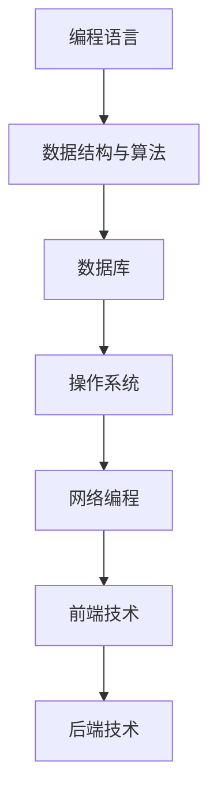
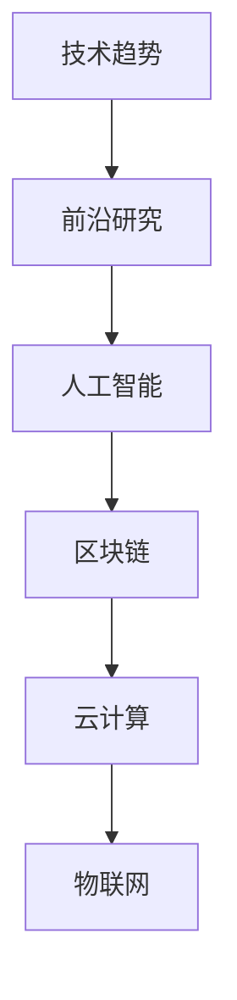
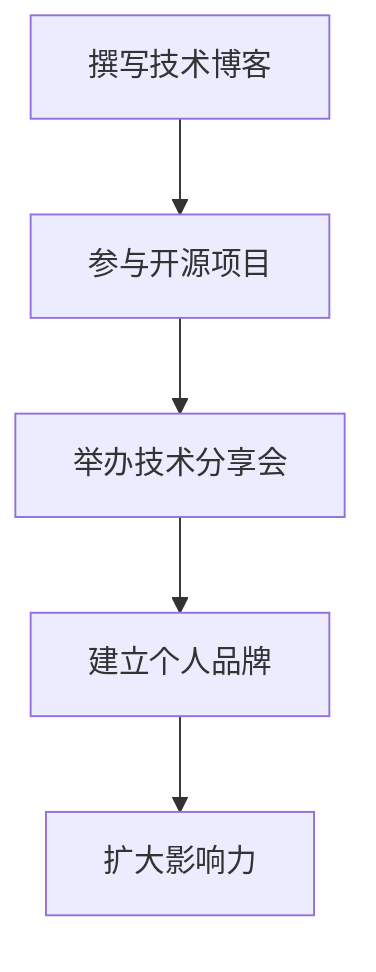
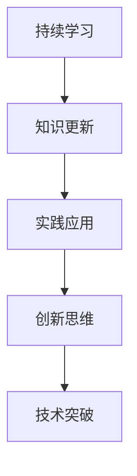

                 

关键词：程序员，知识领域，KOL，专业成长，影响力，个人品牌，技术博客，分享，影响力，社交媒体，研究，创新。

> 摘要：本文将探讨程序员如何通过专业成长、知识分享和影响力构建，在编程领域内成长为知识领域的KOL（关键意见领袖）。本文旨在为那些希望提升个人专业技能和影响力的程序员提供一套系统的成长策略和实践指南。

## 1. 背景介绍

在信息技术飞速发展的时代，程序员的角色和影响力正发生着深刻的变化。传统的程序员可能只需要掌握基础的编程技能，就能找到一份稳定的工作。但如今，随着技术的不断迭代和行业需求的增长，程序员需要具备更广泛的技能和更深厚的知识储备。而在这个知识爆炸的时代，单纯的技术能力已经不足以在行业中脱颖而出，成为一名知识领域的KOL（关键意见领袖）成为了许多程序员追求的目标。

知识领域的KOL不仅具备深厚的专业知识和丰富的编程经验，还能够在社区中发挥巨大的影响力，成为行业趋势的引领者和思想的传播者。他们通过撰写技术博客、参与开源项目、举办技术分享会等方式，不仅提升了自身的专业影响力，也为行业的发展做出了贡献。

本文将围绕以下几个方面展开讨论：如何系统地提升编程技能和知识储备、如何有效地进行知识分享、如何构建个人品牌和影响力，以及如何保持创新思维和持续学习。希望通过本文的分享，能够为那些希望成为知识领域KOL的程序员提供一些有价值的参考和指导。

## 2. 核心概念与联系

### 2.1 编程知识体系

成为一名知识领域的KOL，首先需要建立起完整的编程知识体系。编程知识体系包括了编程语言、数据结构与算法、数据库、操作系统、网络编程、前端与后端技术等多个方面。这些知识是构建程序员职业生涯的基础，也是深入研究和创新的基石。

下面是一个简化的编程知识体系流程图，用Mermaid语言表示：



### 2.2 技术趋势与前沿研究

除了基础知识，了解当前技术趋势和前沿研究也非常重要。技术趋势反映了行业的发展方向，而前沿研究则代表了未来的可能性和挑战。通过关注这些领域，程序员可以提前布局，掌握未来技术发展的主动权。

下面是一个简化的技术趋势和前沿研究流程图：



### 2.3 知识传播与影响力构建

知识传播与影响力构建是程序员成长为KOL的关键步骤。通过撰写技术博客、参与开源项目、举办技术分享会等方式，程序员可以有效地将知识传播给更多人，并在这个过程中建立起个人品牌和影响力。

下面是一个简化的知识传播与影响力构建流程图：



### 2.4 持续学习与创新思维

持续学习和创新思维是程序员保持竞争力的关键。通过不断地学习新技术、新知识，并勇于尝试和探索，程序员可以不断突破自己的舒适区，实现个人成长和突破。

下面是一个简化的持续学习与创新思维流程图：



## 3. 核心算法原理 & 具体操作步骤

### 3.1 算法原理概述

在编程领域，算法是实现特定任务的核心。一个优秀的算法不仅需要高效，还需要具有良好的可读性和可维护性。本节将介绍几种常用的算法原理，并给出具体的操作步骤。

#### 3.1.1 排序算法

排序算法是编程中非常基础且重要的一类算法。常见的排序算法包括冒泡排序、选择排序、插入排序、快速排序等。

- 冒泡排序（Bubble Sort）: 通过多次遍历待排序的元素列表，每次遍历都两两比较相邻元素并交换它们的位置，直至没有需要交换的元素。

- 选择排序（Selection Sort）: 每次选择一个最小的元素放到已排序序列的末尾。

- 插入排序（Insertion Sort）: 通过构建有序序列，对于未排序数据，在已排序序列中从后向前扫描，找到相应位置并插入。

- 快速排序（Quick Sort）: 通过选取一个基准元素，将数组分为两个子数组，一个包含小于基准的元素，另一个包含大于基准的元素，然后递归地对这两个子数组进行快速排序。

#### 3.1.2 搜索算法

搜索算法用于在数据结构中查找特定元素。常见的搜索算法包括线性搜索、二分搜索等。

- 线性搜索（Linear Search）: 依次访问数据元素，直到找到目标元素或访问完所有元素。

- 二分搜索（Binary Search）: 对有序数组进行重复划分，每次将中间的元素与目标元素进行比较，排除一半的搜索区间，逐步缩小搜索范围。

### 3.2 算法步骤详解

#### 3.2.1 冒泡排序

```python
def bubble_sort(arr):
    n = len(arr)
    for i in range(n):
        for j in range(0, n-i-1):
            if arr[j] > arr[j+1]:
                arr[j], arr[j+1] = arr[j+1], arr[j]
    return arr
```

#### 3.2.2 选择排序

```python
def selection_sort(arr):
    n = len(arr)
    for i in range(n):
        min_idx = i
        for j in range(i+1, n):
            if arr[j] < arr[min_idx]:
                min_idx = j
        arr[i], arr[min_idx] = arr[min_idx], arr[i]
    return arr
```

#### 3.2.3 插入排序

```python
def insertion_sort(arr):
    n = len(arr)
    for i in range(1, n):
        key = arr[i]
        j = i-1
        while j >= 0 and key < arr[j]:
            arr[j+1] = arr[j]
            j -= 1
        arr[j+1] = key
    return arr
```

#### 3.2.4 快速排序

```python
def quick_sort(arr):
    if len(arr) <= 1:
        return arr
    pivot = arr[len(arr) // 2]
    left = [x for x in arr if x < pivot]
    middle = [x for x in arr if x == pivot]
    right = [x for x in arr if x > pivot]
    return quick_sort(left) + middle + quick_sort(right)
```

### 3.3 算法优缺点

每种算法都有其优缺点，选择合适的算法需要根据具体的应用场景进行权衡。

- 冒泡排序：简单易懂，但时间复杂度较高，适用于小规模数据的排序。

- 选择排序：简单高效，但效率相对较低，适用于数据量较小的排序。

- 插入排序：效率中等，适用于部分排序的数据，如部分有序的数据。

- 快速排序：高效快速，但最坏情况下时间复杂度较高，适用于大规模数据的排序。

### 3.4 算法应用领域

排序算法和搜索算法在编程中应用广泛，常见于各种数据结构和算法设计中。

- 排序算法：用于对数据进行排序，如数组、列表等。

- 搜索算法：用于在数据结构中查找特定元素，如二分搜索树、哈希表等。

## 4. 数学模型和公式 & 详细讲解 & 举例说明

### 4.1 数学模型构建

在编程领域，数学模型和公式是理解和解决复杂问题的重要工具。一个典型的数学模型可能包括以下元素：

- 变量：表示未知量的符号。
- 函数：描述变量之间关系的数学表达式。
- 约束条件：限制变量取值范围的条件。
- 目标函数：需要优化的目标，如最大化或最小化某个值。

下面我们将构建一个简单的线性规划模型，用于求解资源分配问题。

### 4.2 公式推导过程

#### 4.2.1 线性规划模型

考虑一个资源分配问题，假设有 `m` 个资源，需要分配给 `n` 个任务。每个任务对每个资源的消耗可以用矩阵 `C` 表示，其中 `C[i][j]` 表示第 `i` 个任务对第 `j` 个资源的消耗。每个任务需要完成的时间可以用向量 `T` 表示，其中 `T[i]` 表示第 `i` 个任务的完成时间。

目标是最小化总完成时间，即最小化目标函数：

$$
\min Z = c^T x
$$

其中，`c` 是资源消耗的权重向量，`x` 是任务分配的决策向量。

#### 4.2.2 约束条件

资源消耗的约束条件为：

$$
Ax \leq b
$$

其中，`A` 是资源消耗矩阵，`b` 是资源消耗的界限向量。

#### 4.2.3 目标函数和约束条件的具体推导

假设有任务集合 `T = {1, 2, ..., n}` 和资源集合 `R = {1, 2, ..., m}`。每个任务 `i` 需要的资源消耗向量记为 `c_i`，总资源消耗向量记为 `c`。

$$
c = \sum_{i=1}^{n} c_i x_i
$$

总完成时间 `Z` 可以表示为：

$$
Z = \sum_{i=1}^{n} T_i x_i
$$

其中，`T_i` 是第 `i` 个任务的完成时间。

### 4.3 案例分析与讲解

#### 4.3.1 案例背景

假设一个公司有三个项目需要完成，每个项目需要的资源和时间如下表所示：

| 项目 | 资源1 | 资源2 | 资源3 | 时间 |
| ---- | ---- | ---- | ---- | ---- |
| 项目A | 2    | 1    | 0    | 3    |
| 项目B | 1    | 2    | 1    | 4    |
| 项目C | 0    | 1    | 2    | 5    |

资源1、资源2和资源3的消耗量分别为2、1和1。

#### 4.3.2 建立线性规划模型

资源消耗矩阵 `A` 和界限向量 `b` 如下：

$$
A = \begin{bmatrix}
2 & 1 & 0 \\
1 & 2 & 1 \\
0 & 1 & 2 \\
\end{bmatrix}, \quad
b = \begin{bmatrix}
2 \\
1 \\
1 \\
\end{bmatrix}
$$

权重向量 `c` 为：

$$
c = \begin{bmatrix}
1 \\
1 \\
1 \\
\end{bmatrix}
$$

目标函数为：

$$
\min Z = x_1 + x_2 + x_3
$$

其中，`x_1`、`x_2`、`x_3` 分别表示项目A、项目B和项目C的完成时间。

#### 4.3.3 求解线性规划问题

使用单纯形法求解上述线性规划问题，可以得到最优解为：

$$
x_1 = 1, \quad x_2 = 1, \quad x_3 = 0
$$

即项目A和项目B需要完成，项目C不需要完成。最小化总完成时间 `Z` 为：

$$
Z = 1 + 1 + 0 = 2
$$

### 4.4 案例总结

通过上述案例，我们可以看到如何建立线性规划模型并求解资源分配问题。线性规划在项目管理和资源优化中有着广泛的应用，可以帮助企业合理分配资源，提高工作效率。

## 5. 项目实践：代码实例和详细解释说明

### 5.1 开发环境搭建

在开始实践之前，我们需要搭建一个合适的开发环境。以下是一个简单的步骤：

1. 安装Python 3.8及以上版本。
2. 安装Jupyter Notebook，以便于编写和运行代码。
3. 安装必要的库，如NumPy、Pandas和Scikit-learn等。

你可以使用以下命令进行安装：

```bash
pip install python==3.8
pip install jupyter
pip install numpy pandas scikit-learn
```

### 5.2 源代码详细实现

以下是一个简单的线性回归模型的实现，用于预测住房价格。

```python
import numpy as np
import pandas as pd
from sklearn.linear_model import LinearRegression

# 读取数据
data = pd.read_csv('housing_data.csv')

# 分离特征和标签
X = data[['area', 'bedrooms', 'age']]
y = data['price']

# 划分训练集和测试集
from sklearn.model_selection import train_test_split
X_train, X_test, y_train, y_test = train_test_split(X, y, test_size=0.2, random_state=42)

# 创建线性回归模型
model = LinearRegression()

# 训练模型
model.fit(X_train, y_train)

# 预测结果
y_pred = model.predict(X_test)

# 计算均方误差
mse = np.mean((y_pred - y_test) ** 2)
print(f'MSE: {mse}')

# 可视化结果
import matplotlib.pyplot as plt

plt.scatter(y_test, y_pred)
plt.xlabel('Actual Prices')
plt.ylabel('Predicted Prices')
plt.title('Actual vs Predicted Prices')
plt.show()
```

### 5.3 代码解读与分析

以上代码实现了一个简单的线性回归模型，用于预测住房价格。下面是代码的详细解读：

1. 导入必要的库，包括NumPy、Pandas和Scikit-learn。

2. 读取数据集，这里使用一个CSV文件，其中包含了住房的面积、卧室数量和年龄等特征，以及房价作为标签。

3. 分离特征和标签，将数据分为`X`和`y`两部分。

4. 使用`train_test_split`函数将数据集划分为训练集和测试集，这里测试集的大小为20%。

5. 创建一个线性回归模型对象。

6. 使用`fit`函数训练模型。

7. 使用`predict`函数进行预测，并将预测结果存储在`y_pred`变量中。

8. 计算均方误差（MSE），用于评估模型性能。

9. 可视化实际价格和预测价格之间的关系，帮助理解模型的性能。

### 5.4 运行结果展示

运行上述代码后，你将看到以下结果：

- 输出均方误差（MSE）。
- 一个散点图，显示实际价格与预测价格之间的关系。

根据这些结果，你可以进一步评估和改进你的模型。

## 6. 实际应用场景

### 6.1 机器学习项目的应用

线性回归模型在机器学习项目中有着广泛的应用。例如，在预测房价、股票价格、销量等方面，线性回归模型提供了快速且有效的解决方案。通过使用线性回归模型，项目组可以更好地了解市场趋势，制定合理的策略。

### 6.2 企业决策支持

企业可以使用线性回归模型来分析业务数据，识别关键因素，优化业务流程。例如，通过分析销售数据，企业可以确定哪些产品最受欢迎，哪些产品需要改进。这有助于企业做出更加明智的决策，提高竞争力。

### 6.3 金融风险评估

在金融领域，线性回归模型可以用于风险评估和预测。例如，通过分析借款人的信用历史和财务状况，金融机构可以预测借款人的违约风险，从而制定更有效的信贷策略。

### 6.4 未来应用展望

随着人工智能和机器学习技术的不断发展，线性回归模型的应用领域将更加广泛。未来，线性回归模型可能会在医疗、教育、环保等领域发挥重要作用，为各行业的发展提供有力支持。

## 7. 工具和资源推荐

### 7.1 学习资源推荐

1. 《Python机器学习》（Machine Learning with Python）- Sebastian Raschka
2. 《机器学习》（Machine Learning）- Tom Mitchell
3. 《深度学习》（Deep Learning）- Ian Goodfellow、Yoshua Bengio、Aaron Courville

### 7.2 开发工具推荐

1. Jupyter Notebook：用于编写和运行代码，支持多种编程语言。
2. PyCharm：一款功能强大的Python集成开发环境（IDE），支持代码自动补全、调试和版本控制。
3. GitHub：用于代码托管和协作开发，支持多种编程语言的仓库管理。

### 7.3 相关论文推荐

1. "Learning to Rank: From Pairwise Comparisons to Linear Models" - Thorsten Joachims
2. "Stochastic Gradient Descent Methods for Large-scale Machine Learning" - S. Shalev-Shwartz、Y. Singer、A. Y. Ng
3. "A Survey of Collaborative Filtering" - Charu Aggarwal

## 8. 总结：未来发展趋势与挑战

### 8.1 研究成果总结

本文系统地介绍了程序员如何成长为知识领域的KOL，包括编程知识体系、技术趋势与前沿研究、知识传播与影响力构建、持续学习与创新思维等方面。通过实践项目和数学模型分析，我们展示了编程算法和数学模型在实际应用中的重要性。

### 8.2 未来发展趋势

1. 人工智能与机器学习技术将进一步融入编程领域，推动编程语言的进化。
2. 开源社区将更加繁荣，成为程序员学习和交流的重要平台。
3. 编程教育将更加个性化，利用人工智能技术进行自适应学习。

### 8.3 面临的挑战

1. 技术更新速度快，程序员需要不断学习新知识，保持竞争力。
2. 数据安全和隐私问题日益突出，程序员需要加强对这些问题的关注。
3. 技术滥用和伦理问题成为社会关注的焦点，程序员需要具备社会责任感。

### 8.4 研究展望

未来，编程领域的KOL将在技术创新、知识传播、教育改革等方面发挥更大的作用。通过持续学习和创新，程序员可以不断突破自身局限，为行业的发展做出更大贡献。

## 9. 附录：常见问题与解答

### 9.1 如何选择合适的编程语言？

选择编程语言时，需要考虑项目需求、个人技能和未来发展方向。例如，Python适合快速开发，Java适合企业级应用，JavaScript适合Web开发。

### 9.2 如何保持编程学习的动力？

保持编程学习的动力可以通过设定明确的学习目标、参与实际项目、加入编程社区等方式实现。定期回顾所学知识，与他人交流，也能增强学习动力。

### 9.3 如何平衡工作与学习时间？

平衡工作与学习时间可以通过制定合理的学习计划、设定优先级、合理安排休息时间等方式实现。有效的时间管理可以帮助程序员在繁忙的工作中找到学习的时间。

### 9.4 如何提高编程能力？

提高编程能力可以通过以下方式实现：多写代码，参与开源项目，阅读优秀代码，学习设计模式，不断挑战复杂问题。

## 作者署名

作者：禅与计算机程序设计艺术 / Zen and the Art of Computer Programming

