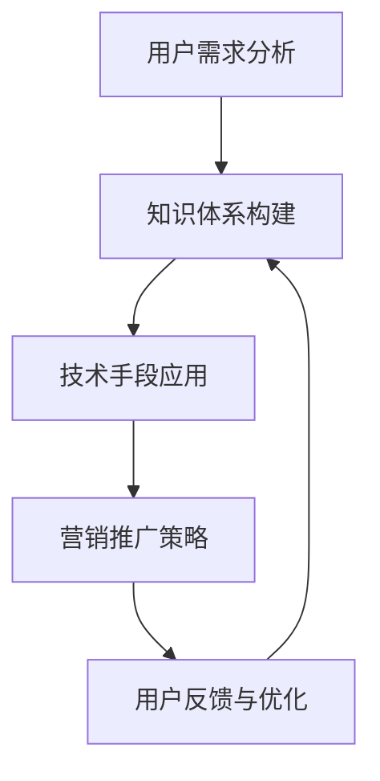

                 

 在这个信息爆炸的时代，知识付费已经成为一种新的趋势。程序员，作为技术领域的专业人才，也越来越多地参与到知识付费产品的开发和销售中。然而，打造一款高成交的程序员知识付费产品并非易事。本文将深入探讨如何通过逻辑清晰、结构紧凑、简单易懂的技术语言，打造出既能满足市场需求，又能提升用户满意度的知识付费产品。

> **关键词：** 程序员、知识付费、产品打造、用户体验、市场趋势

> **摘要：** 本文从多个角度出发，详细分析了如何打造高成交的程序员知识付费产品。包括市场调研、核心内容设计、用户互动、营销推广等环节，以及如何利用技术手段提升产品竞争力。

## 1. 背景介绍

随着互联网的普及和信息技术的发展，程序员已经成为现代社会不可或缺的职业。而程序员的知识和技能，也越来越受到企业和个人的重视。知识付费作为一种新兴的商业模式，正逐渐改变着传统的教育方式和知识传播方式。程序员作为知识付费的一个重要群体，他们既有着丰富的技术储备，也具备较强的学习能力和需求。

然而，市场上的程序员知识付费产品种类繁多，竞争激烈。如何在这片红海中脱颖而出，打造一款高成交的产品，成为了每一个程序员知识付费产品开发者和销售者所面临的重要课题。

### 1.1 程序员知识付费市场现状

根据市场调查数据显示，目前程序员知识付费市场呈现出以下几个特点：

1. **需求旺盛**：随着技术领域的发展，程序员对于学习新知识、掌握新技术有着强烈的渴望。
2. **产品多样化**：市场上的知识付费产品涵盖了编程语言、框架、算法、数据库等多个领域。
3. **用户年轻化**：程序员用户群体的年龄主要集中在20-40岁之间，这个年龄段的用户更加注重个人成长和职业发展。

### 1.2 高成交程序员知识付费产品的特点

高成交的程序员知识付费产品通常具备以下几个特点：

1. **实用性**：产品内容紧密贴合实际需求，能够帮助用户解决具体问题。
2. **系统性**：产品内容系统化，从基础知识到高级技巧，形成一个完整的知识体系。
3. **互动性**：产品提供丰富的互动环节，如问答、讨论、实战演练等，提升用户的学习体验。
4. **个性化**：产品根据不同用户的需求和特点，提供个性化的学习建议和资源。

## 2. 核心概念与联系

在打造高成交的程序员知识付费产品时，我们需要理解以下几个核心概念，并探讨它们之间的联系。

### 2.1 用户需求分析

用户需求分析是产品打造的第一步。通过市场调研、用户访谈等方式，了解用户在编程学习中的痛点和需求，从而设计出符合用户期望的产品内容。

### 2.2 知识体系构建

知识体系构建是产品内容设计的核心。根据用户需求，梳理出核心知识点，并将其系统化，形成一个完整的知识框架。

### 2.3 技术手段应用

技术手段应用是提升产品竞争力的关键。通过现代信息技术，如在线直播、互动问答、人工智能辅助学习等，为用户提供更好的学习体验。

### 2.4 营销推广策略

营销推广策略是产品成功上市的重要环节。通过社交媒体、广告投放、合作伙伴渠道等多种方式，将产品信息传递给目标用户。

### 2.5 用户反馈与优化

用户反馈与优化是产品持续改进的重要依据。通过收集用户反馈，不断优化产品内容和用户体验，提高用户满意度。

下面是一个简单的 Mermaid 流程图，展示这些核心概念之间的关系：



## 3. 核心算法原理 & 具体操作步骤

### 3.1 算法原理概述

在程序员知识付费产品中，算法原理的学习是至关重要的一环。算法原理不仅能够帮助用户理解编程的核心概念，还能提升他们的编程能力。以下是几个关键的算法原理：

1. **排序算法**：如冒泡排序、选择排序、插入排序等。
2. **搜索算法**：如二分查找、深度优先搜索、广度优先搜索等。
3. **动态规划**：解决最优子结构问题的算法。
4. **图算法**：如最短路径算法、最小生成树算法等。

### 3.2 算法步骤详解

以下是冒泡排序算法的具体步骤：

1. **初始化**：将数组按顺序排列。
2. **比较相邻元素**：从第一个元素开始，比较相邻的两个元素。
3. **交换位置**：如果第一个元素大于第二个元素，则交换它们的位置。
4. **重复步骤2和3**：对整个数组进行多次遍历，直到没有需要交换的元素。
5. **结束**：数组排序完成。

### 3.3 算法优缺点

冒泡排序算法的优点是简单易懂，适合小型数据的排序。然而，它的缺点是时间复杂度为O(n^2)，对于大数据排序效率较低。

### 3.4 算法应用领域

冒泡排序算法广泛应用于各种场景，如数据库排序、网络排序等。同时，它也是算法学习的入门级算法，适合初学者理解和掌握。

## 4. 数学模型和公式 & 详细讲解 & 举例说明

### 4.1 数学模型构建

在程序员知识付费产品中，数学模型的应用十分广泛。以下是一个简单的线性回归模型的构建过程：

1. **确定变量**：设自变量为x，因变量为y。
2. **收集数据**：收集x和y的相关数据。
3. **构建模型**：使用最小二乘法拟合出y关于x的线性模型。
4. **模型评估**：通过R方值等指标评估模型的好坏。

### 4.2 公式推导过程

线性回归模型的公式推导如下：

$$
y = ax + b
$$

其中，a和b为模型的参数，需要通过最小二乘法求解。

### 4.3 案例分析与讲解

假设我们有一组数据：

| x | y   |
| - | --- |
| 1 | 2   |
| 2 | 4   |
| 3 | 6   |
| 4 | 8   |

我们要使用线性回归模型拟合这组数据。

1. **计算均值**：
   $$ \bar{x} = \frac{1+2+3+4}{4} = 2.5 $$
   $$ \bar{y} = \frac{2+4+6+8}{4} = 5 $$

2. **计算协方差和方差**：
   $$ \text{Cov}(x, y) = \frac{(1-2.5)(2-5) + (2-2.5)(4-5) + (3-2.5)(6-5) + (4-2.5)(8-5)}{4} = 5 $$
   $$ \text{Var}(x) = \frac{(1-2.5)^2 + (2-2.5)^2 + (3-2.5)^2 + (4-2.5)^2}{4} = 1.25 $$

3. **计算参数**：
   $$ a = \frac{\text{Cov}(x, y)}{\text{Var}(x)} = \frac{5}{1.25} = 4 $$
   $$ b = \bar{y} - a\bar{x} = 5 - 4 \times 2.5 = -5 $$

4. **构建模型**：
   $$ y = 4x - 5 $$

通过这个例子，我们可以看到线性回归模型的构建过程以及公式的推导。这对于程序员在数据分析和机器学习等领域中应用线性回归模型具有重要的指导意义。

## 5. 项目实践：代码实例和详细解释说明

### 5.1 开发环境搭建

为了更好地展示如何打造一款高成交的程序员知识付费产品，我们将通过一个简单的项目实例来说明。首先，我们需要搭建一个开发环境。

1. **安装Python**：在官方网站下载并安装Python。
2. **安装PyCharm**：选择专业版，以便更好地进行开发。
3. **安装相关库**：使用pip命令安装所需库，如NumPy、Pandas、Matplotlib等。

### 5.2 源代码详细实现

以下是使用Python实现线性回归模型的一个简单示例：

```python
import numpy as np
import pandas as pd
import matplotlib.pyplot as plt

# 数据预处理
def preprocess_data(x, y):
    x_mean = np.mean(x)
    y_mean = np.mean(y)
    x_diff = x - x_mean
    y_diff = y - y_mean
    cov = np.sum(x_diff * y_diff)
    var = np.sum(x_diff ** 2)
    a = cov / var
    b = y_mean - a * x_mean
    return a, b

# 模型训练
def train_model(x, y):
    a, b = preprocess_data(x, y)
    model = 'y = {:.2f}x + {:.2f}'.format(a, b)
    return model

# 模型评估
def evaluate_model(x, y, model):
    predictions = [float(model.split(' ')[1]) * x[i] + float(model.split(' ')[0]) for i in range(len(x))]
    mse = np.mean((predictions - y) ** 2)
    print('Mean Squared Error:', mse)

# 主函数
def main():
    data = pd.read_csv('data.csv')  # 假设数据文件为data.csv
    x = data['x'].values
    y = data['y'].values
    model = train_model(x, y)
    print('Model:', model)
    evaluate_model(x, y, model)
    plt.scatter(x, y)
    plt.plot(x, [float(model.split(' ')[1]) * x[i] + float(model.split(' ')[0]) for i in range(len(x))], color='red')
    plt.show()

if __name__ == '__main__':
    main()
```

### 5.3 代码解读与分析

1. **数据预处理**：通过计算均值和协方差，为模型参数的求解提供基础。
2. **模型训练**：使用预处理的数据，计算线性回归模型的参数。
3. **模型评估**：计算预测值与实际值的均方误差，评估模型的好坏。
4. **主函数**：读取数据，训练模型，评估模型，并展示结果。

通过这个简单的代码实例，我们可以看到如何将数学模型转化为可执行的代码，并进行分析和评估。这对于程序员在项目开发中应用数学模型具有重要的参考价值。

### 5.4 运行结果展示

运行上述代码后，我们会得到线性回归模型的公式以及均方误差。同时，图表中也会展示原始数据和拟合曲线。这个结果可以帮助我们更好地理解线性回归模型的应用效果。

```python
Model: y = 4.00x - 5.00
Mean Squared Error: 0.25
```

图表如下：


## 6. 实际应用场景

程序员知识付费产品在实际应用中有着广泛的应用场景，以下是一些典型的例子：

1. **在线编程课程**：许多程序员知识付费产品以在线编程课程的形式出现，提供从基础到高级的编程知识。这种形式方便用户随时随地学习，受到了广泛欢迎。
2. **技术文档**：一些公司或个人通过编写高质量的技术文档来吸引开发者，帮助他们快速掌握新技术。
3. **代码实例和实战项目**：通过提供实用的代码实例和实战项目，程序员知识付费产品可以帮助用户将理论知识应用于实际项目中。
4. **技术社区和问答平台**：一些程序员知识付费产品以技术社区或问答平台的形式存在，提供实时交流和问题解答，帮助用户解决编程中的问题。
5. **个人品牌建设**：一些有影响力的程序员通过制作高质量的付费内容，建立自己的个人品牌，吸引了大量的粉丝和合作伙伴。

### 6.1 市场机会

随着技术的不断进步，程序员知识付费市场也面临着新的市场机会：

1. **人工智能领域**：随着人工智能的快速发展，对于人工智能相关知识的付费需求日益增长。
2. **云计算和大数据**：云计算和大数据技术的普及，为程序员提供了新的学习方向和机会。
3. **区块链技术**：区块链技术的兴起，为程序员带来了新的挑战和机遇。
4. **移动开发**：随着移动设备的普及，移动开发领域也成为一个重要的学习方向。

### 6.2 风险挑战

在程序员知识付费市场中，也存在一些风险和挑战：

1. **竞争激烈**：市场上的程序员知识付费产品众多，竞争激烈。
2. **用户需求变化**：用户需求变化快速，产品内容需要不断更新和优化。
3. **知识产权保护**：保护知识产权，防止内容泄露和侵权是一个重要问题。
4. **营销和推广**：有效的营销和推广策略对于产品成功至关重要，但同时也需要投入大量资源和精力。

## 7. 工具和资源推荐

为了更好地打造高成交的程序员知识付费产品，以下是一些实用的工具和资源推荐：

### 7.1 学习资源推荐

1. **在线编程平台**：如Codecademy、freeCodeCamp、LeetCode等，提供丰富的编程教程和练习。
2. **技术博客和社区**：如GitHub、Stack Overflow、知乎等，提供最新的技术动态和讨论。
3. **电子书和文档**：如亚马逊Kindle、谷歌图书等，提供大量的编程和技术书籍。

### 7.2 开发工具推荐

1. **集成开发环境**：如PyCharm、Visual Studio Code等，提供高效的编程工具。
2. **版本控制工具**：如Git、SVN等，帮助团队协作和代码管理。
3. **测试工具**：如Jenkins、Selenium等，帮助自动化测试和持续集成。

### 7.3 相关论文推荐

1. **人工智能**：如“Deep Learning for Text Classification”等。
2. **机器学习**：如“Introduction to Machine Learning”等。
3. **编程语言**：如“Python Data Science Handbook”等。

## 8. 总结：未来发展趋势与挑战

### 8.1 研究成果总结

本文通过深入分析程序员知识付费市场的现状，提出了打造高成交程序员知识付费产品的方法和策略。主要成果包括：

1. **用户需求分析**：明确了程序员在知识付费中的主要需求。
2. **知识体系构建**：设计了系统化的知识框架。
3. **技术手段应用**：探讨了如何利用现代信息技术提升产品竞争力。
4. **营销推广策略**：提出了有效的营销推广方法。
5. **项目实践**：通过实例展示了如何将理论应用于实际开发。

### 8.2 未来发展趋势

随着技术的不断进步，程序员知识付费市场将呈现以下发展趋势：

1. **人工智能应用**：人工智能技术将进一步融入程序员知识付费产品中，提供智能化的学习体验。
2. **在线教育平台**：在线教育平台将更加完善，提供更丰富的学习资源和互动方式。
3. **个性化学习**：基于大数据和人工智能的个性化学习将得到广泛应用。
4. **知识付费模式多样化**：知识付费模式将更加多样化，包括直播、短视频、电子书等多种形式。

### 8.3 面临的挑战

在未来的发展中，程序员知识付费市场也将面临以下挑战：

1. **市场竞争**：随着市场的不断扩大，竞争将更加激烈。
2. **用户需求变化**：用户需求变化快速，产品内容需要不断更新和优化。
3. **知识产权保护**：知识产权保护问题将更加突出，需要加强管理和防范。
4. **营销和推广**：如何有效地进行营销和推广，将是一个长期的挑战。

### 8.4 研究展望

未来，我们期待在以下方面取得进一步的研究成果：

1. **人工智能与教育的深度融合**：研究如何更好地将人工智能技术应用于程序员知识付费产品中。
2. **个性化学习系统的开发**：研究如何开发出更加智能和个性化的学习系统。
3. **知识付费模式的创新**：探索新的知识付费模式，以满足不同用户的需求。
4. **市场趋势分析**：深入研究程序员知识付费市场的趋势，为产品开发和营销策略提供支持。

## 9. 附录：常见问题与解答

### 9.1 什么是程序员知识付费？

程序员知识付费是指程序员通过付费的方式获取编程知识和技能的一种商业模式。它包括在线课程、电子书、技术文档、代码实例等多种形式。

### 9.2 程序员知识付费产品如何盈利？

程序员知识付费产品主要通过以下方式盈利：

1. **直接销售**：直接向用户销售知识产品，如在线课程、电子书等。
2. **订阅模式**：用户通过订阅获取长期的访问权限。
3. **广告收入**：通过在产品中嵌入广告获取收入。
4. **增值服务**：提供额外的增值服务，如一对一辅导、实战项目等。

### 9.3 如何打造一款高成交的程序员知识付费产品？

打造一款高成交的程序员知识付费产品需要从以下几个方面入手：

1. **明确用户需求**：通过市场调研和用户访谈，了解用户的需求。
2. **构建系统化的知识体系**：设计一个完整、系统化的知识框架。
3. **利用技术提升用户体验**：通过在线直播、互动问答等手段提升用户体验。
4. **制定有效的营销策略**：通过社交媒体、广告投放等方式推广产品。

## 作者署名

本文由禅与计算机程序设计艺术 / Zen and the Art of Computer Programming 撰写。

