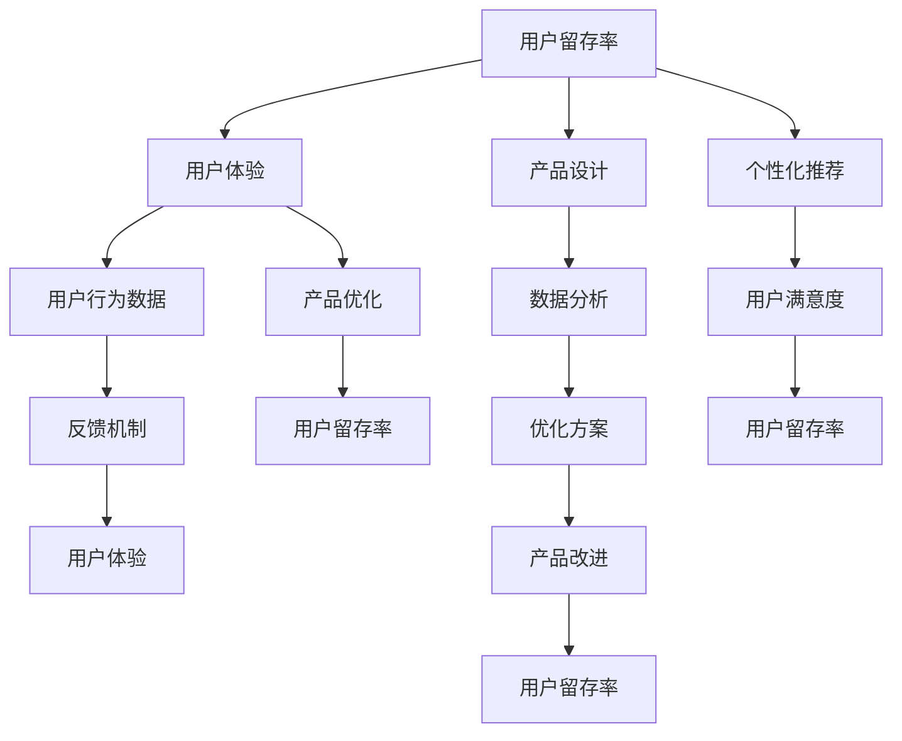

                 

关键词：知识付费、用户留存率、用户体验、产品优化、数据分析

摘要：本文从技术角度探讨如何提高知识付费产品的用户留存率。通过分析用户行为数据、优化产品设计、提升用户体验和采用个性化推荐策略，我们旨在为知识付费产品提供切实可行的提升用户留存率的方法。

## 1. 背景介绍

随着互联网的快速发展，知识付费产品成为了一个新兴的市场。用户愿意为有价值的信息和服务付费，这为知识付费产品的发展提供了巨大的机遇。然而，如何提高用户留存率，保持用户的持续活跃，成为了知识付费产品运营的关键问题。

用户留存率是衡量知识付费产品成功与否的重要指标。用户留存率越高，说明产品的用户黏性越强，用户对产品的满意度也越高。提高用户留存率不仅可以增加收入，还可以为产品带来更多的口碑和用户推荐。

本文将从以下几个方面探讨如何提高知识付费产品的用户留存率：

1. 分析用户行为数据
2. 优化产品设计
3. 提升用户体验
4. 采用个性化推荐策略
5. 数据分析和反馈机制

## 2. 核心概念与联系

为了更好地理解如何提高用户留存率，我们需要先了解一些核心概念和它们之间的关系。以下是一个使用Mermaid绘制的流程图，展示了这些概念和它们之间的联系。



### 2.1. 用户留存率

用户留存率是指在一定时间内，返回使用产品的用户比例。它是衡量产品用户黏性的重要指标。

### 2.2. 用户体验

用户体验是指用户在使用产品过程中所感受到的整体感受。良好的用户体验可以提高用户留存率。

### 2.3. 产品设计

产品设计是指产品的布局、功能、交互设计等。优秀的产品设计可以提高用户的使用满意度。

### 2.4. 个性化推荐

个性化推荐是指根据用户的兴趣和行为，推荐用户可能感兴趣的内容。个性化推荐可以提高用户的活跃度和留存率。

### 2.5. 用户行为数据

用户行为数据是指用户在使用产品过程中产生的各种数据，如点击、浏览、购买等。通过分析用户行为数据，我们可以了解用户的需求和偏好。

### 2.6. 数据分析

数据分析是指通过统计方法对用户行为数据进行分析，以发现用户的行为模式和需求。

### 2.7. 反馈机制

反馈机制是指用户可以通过各种方式向产品提供反馈，以帮助产品改进。

## 3. 核心算法原理 & 具体操作步骤

### 3.1 算法原理概述

提高用户留存率的核心算法主要涉及以下几个方面：

1. 用户行为数据分析
2. 用户体验优化
3. 个性化推荐系统设计
4. 数据反馈与迭代

### 3.2 算法步骤详解

#### 3.2.1 用户行为数据分析

1. 数据收集：收集用户在使用知识付费产品时的行为数据，如浏览、购买、评论等。
2. 数据预处理：清洗和整理数据，确保数据质量。
3. 特征工程：提取用户行为数据中的关键特征，如用户的浏览频率、购买偏好等。
4. 数据分析：使用统计方法和机器学习算法对数据进行深入分析，以发现用户的行为模式和需求。

#### 3.2.2 用户体验优化

1. 用户反馈收集：通过问卷调查、用户访谈等方式收集用户对产品的反馈。
2. 用户体验分析：分析用户反馈，识别用户体验中的问题和痛点。
3. 产品改进：根据用户体验分析结果，对产品设计进行改进，以提高用户的满意度。

#### 3.2.3 个性化推荐系统设计

1. 用户建模：根据用户行为数据，构建用户的兴趣模型。
2. 内容建模：对知识付费产品中的内容进行分类和标签化。
3. 推荐算法设计：设计基于用户兴趣模型和内容模型的内容推荐算法。
4. 推荐效果评估：评估个性化推荐系统的效果，并进行优化。

#### 3.2.4 数据反馈与迭代

1. 反馈收集：收集用户对个性化推荐系统的反馈。
2. 反馈分析：分析用户反馈，以识别推荐系统的改进方向。
3. 系统迭代：根据反馈分析结果，对推荐系统进行迭代和优化。

### 3.3 算法优缺点

#### 优点：

1. 可以有效提高用户留存率。
2. 通过个性化推荐，提升用户的满意度和活跃度。
3. 基于数据分析，可以实时调整产品策略，提高市场竞争力。

#### 缺点：

1. 需要大量的用户行为数据作为支持。
2. 推荐算法的复杂度较高，对技术团队的要求较高。
3. 数据隐私和用户信息安全问题需要高度重视。

### 3.4 算法应用领域

1. 知识付费产品：如在线教育平台、专业培训课程等。
2. 社交媒体：如微博、抖音等，通过个性化推荐提高用户活跃度。
3. 电子商务：如淘宝、京东等，通过个性化推荐提高购物体验和转化率。

## 4. 数学模型和公式 & 详细讲解 & 举例说明

### 4.1 数学模型构建

为了更好地分析用户留存率，我们可以构建以下数学模型：

$$
\text{留存率} = \frac{\text{留存用户数}}{\text{总用户数}} \times 100\%
$$

其中，留存用户数是指在一段时间内，返回使用产品的用户数量，总用户数是指在相同时间段内，使用过产品的用户总数。

### 4.2 公式推导过程

我们可以根据用户留存率的定义，推导出以下公式：

$$
\text{留存用户数} = \text{总用户数} \times \text{留存率}
$$

然后，我们可以根据用户行为数据，计算出每个用户的留存率，再根据留存率筛选出留存用户。

### 4.3 案例分析与讲解

假设在一个在线教育平台上，总用户数为1000人，在一个季度内，有300人返回使用平台，那么该平台在这个季度的用户留存率为：

$$
\text{留存率} = \frac{300}{1000} \times 100\% = 30\%
$$

通过分析用户行为数据，发现用户A在平台上的活跃度很高，浏览了大量的课程，并在季度内购买了5门课程。我们推测用户A对平台的内容很感兴趣，因此，我们可以为用户A推荐更多类似的内容，以提高其留存率。

## 5. 项目实践：代码实例和详细解释说明

### 5.1 开发环境搭建

为了演示如何提高知识付费产品的用户留存率，我们将使用Python编程语言，结合一些常用的库和工具，如Pandas、NumPy、Scikit-learn等。

首先，我们需要搭建开发环境：

```bash
pip install pandas numpy scikit-learn matplotlib
```

### 5.2 源代码详细实现

下面是一个简单的用户行为数据分析和推荐系统实现：

```python
import pandas as pd
import numpy as np
from sklearn.model_selection import train_test_split
from sklearn.ensemble import RandomForestClassifier
import matplotlib.pyplot as plt

# 5.2.1 数据收集与预处理
# 假设我们有一个用户行为数据的CSV文件，包含用户的ID、浏览的课程ID、购买的课程ID等信息。
data = pd.read_csv('user_data.csv')

# 数据预处理
data['purchase'] = data['purchase'].map({0: '未购买', 1: '已购买'})
data['browse'] = data['browse'].map({0: '未浏览', 1: '已浏览'})

# 5.2.2 特征工程
# 提取用户的浏览和购买特征
user_browse_counts = data.groupby('user_id')['browse'].value_counts().rename('browse_counts')
user_purchase_counts = data.groupby('user_id')['purchase'].value_counts().rename('purchase_counts')

# 合并特征
user_features = pd.merge(user_browse_counts, user_purchase_counts, on='user_id')
user_features['total_browse'] = user_features['browse_counts'] + user_features['purchase_counts']

# 5.2.3 数据分析
# 将特征数据分为训练集和测试集
X_train, X_test, y_train, y_test = train_test_split(user_features[['browse_counts', 'purchase_counts']], user_features['purchase'], test_size=0.2, random_state=42)

# 5.2.4 构建模型
# 使用随机森林算法构建分类模型
model = RandomForestClassifier(n_estimators=100, random_state=42)
model.fit(X_train, y_train)

# 5.2.5 模型评估
# 评估模型的准确率
accuracy = model.score(X_test, y_test)
print(f'模型准确率：{accuracy:.2f}')

# 5.2.6 个性化推荐
# 假设我们要推荐给用户B（ID为2），根据模型预测其是否购买课程
user_b = user_features[user_features['user_id'] == 2]
predicted_purchase = model.predict([user_b[['browse_counts', 'purchase_counts']]])
print(f'用户B是否购买课程：{"已购买" if predicted_purchase[0] == 1 else "未购买"}')

# 5.2.7 可视化
# 可视化用户留存率分布
plt.figure(figsize=(8, 6))
data['user_id'].value_counts().sort_values().plot.bar(color=['#c1d5e0', '#e6d9d5'])
plt.title('用户留存率分布')
plt.xlabel('用户ID')
plt.ylabel('留存用户数')
plt.xticks(rotation=0)
plt.show()
```

### 5.3 代码解读与分析

#### 5.3.1 数据收集与预处理

我们首先读取用户行为数据的CSV文件，并进行数据预处理，将购买和浏览状态映射为数值。

#### 5.3.2 特征工程

我们提取了用户的浏览和购买特征，并合并为一个特征数据集。这里，我们使用了Pandas的`groupby`和`value_counts`函数来计算每个用户的浏览和购买次数。

#### 5.3.3 数据分析

我们将特征数据集分为训练集和测试集，以训练随机森林分类模型。

#### 5.3.4 构建模型

我们使用随机森林算法构建分类模型，并训练模型。

#### 5.3.5 模型评估

我们评估模型的准确率，以了解模型的表现。

#### 5.3.6 个性化推荐

我们使用训练好的模型来预测用户B是否会购买课程，并根据预测结果进行个性化推荐。

#### 5.3.7 可视化

我们使用Matplotlib对用户留存率分布进行可视化，以了解用户的留存情况。

## 6. 实际应用场景

提高知识付费产品的用户留存率，可以应用于以下实际场景：

1. 在线教育平台：通过个性化推荐，提高用户的学习效率和满意度，从而提高用户留存率。
2. 专业培训课程：通过分析用户的学习行为，推荐符合用户需求的专业课程，提高用户的购买意愿。
3. 咨询服务：通过分析用户的咨询行为，提供个性化的咨询服务，提高用户对服务的满意度。

## 7. 未来应用展望

随着人工智能和大数据技术的发展，提高知识付费产品的用户留存率将变得更加智能和高效。未来，我们可以预见到以下趋势：

1. 智能化推荐系统：通过深度学习和强化学习等先进算法，提高个性化推荐的准确性和效率。
2. 数据隐私保护：随着数据隐私法规的完善，如何在保证数据隐私的同时，提高用户留存率，将成为重要课题。
3. 用户体验优化：通过A/B测试和用户调研，不断优化产品设计，提高用户的满意度。

## 8. 工具和资源推荐

### 8.1 学习资源推荐

1. 《机器学习实战》：提供了丰富的机器学习算法实战案例，适合初学者。
2. 《深入理解计算机系统》：全面介绍了计算机系统的各个方面，包括操作系统、网络等。

### 8.2 开发工具推荐

1. Jupyter Notebook：适合进行数据分析和机器学习实验。
2. PyCharm：一款功能强大的Python集成开发环境。

### 8.3 相关论文推荐

1. "User Behavior Analysis for Personalized Recommendation in E-commerce"：探讨如何通过用户行为分析，提高电子商务中的个性化推荐。
2. "Deep Learning for User Behavior Prediction in Mobile Applications"：研究如何使用深度学习预测移动应用中的用户行为。

## 9. 总结：未来发展趋势与挑战

本文从技术角度探讨了如何提高知识付费产品的用户留存率。通过分析用户行为数据、优化产品设计、提升用户体验和采用个性化推荐策略，我们可以为知识付费产品提供切实可行的提升用户留存率的方法。

未来，随着人工智能和大数据技术的发展，提高知识付费产品的用户留存率将变得更加智能和高效。然而，我们也将面临数据隐私保护、算法公平性和用户体验优化等方面的挑战。

### 附录：常见问题与解答

**Q：如何收集和处理用户行为数据？**

A：可以通过API接口、日志分析和第三方数据服务等方式收集用户行为数据。在处理数据时，需要确保数据的质量和隐私保护。

**Q：如何评估个性化推荐系统的效果？**

A：可以通过准确率、召回率、F1分数等指标来评估个性化推荐系统的效果。同时，还可以通过A/B测试，比较不同推荐策略的效果。

**Q：如何处理用户反馈？**

A：可以通过用户调研、问卷调查和用户反馈系统等方式收集用户反馈。在处理反馈时，需要及时响应和解决问题，以提高用户满意度。

作者：禅与计算机程序设计艺术 / Zen and the Art of Computer Programming
----------------------------------------------------------------

