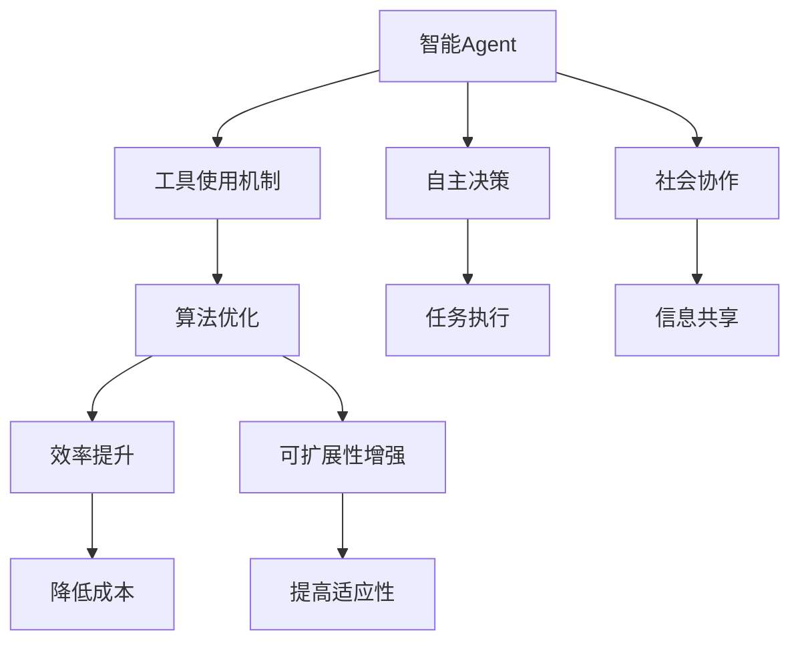
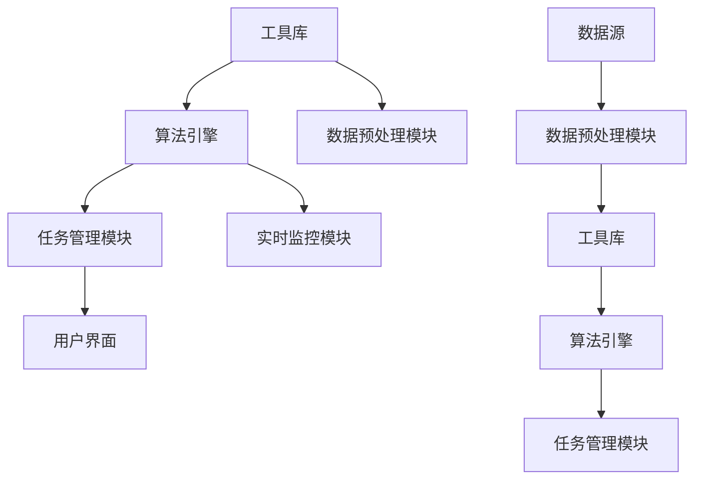

                 

关键词：工具使用机制、Agent能力、改进策略、算法优化、开发实践、应用场景、未来展望

## 摘要

随着人工智能技术的发展，智能Agent作为自动化执行任务的实体在各个领域得到了广泛应用。然而，目前Agent能力的发展仍受到工具使用机制的制约。本文旨在探讨如何通过改进工具使用机制，从而增强Agent的能力。本文首先介绍了Agent的基本概念和分类，然后分析了现有工具使用机制的不足，提出了一系列改进策略，并通过实际案例和项目实践进行了验证。最后，本文对未来的发展趋势和挑战进行了展望。

## 1. 背景介绍

1.1 智能Agent的定义与分类

智能Agent是指具有智能性、自主性、社会性、反应性和学习能力的人工智能实体。根据其功能和应用场景，智能Agent可以大致分为以下几类：

- 搜索引擎Agent：负责在海量信息中检索和筛选有用信息。
- 辅助决策Agent：在特定领域提供辅助决策支持。
- 服务机器人Agent：为人类提供各种服务，如家政、医疗、教育等。
- 智能交通Agent：优化交通流量，提高道路通行效率。

1.2 工具使用机制在Agent发展中的作用

工具使用机制是Agent实现特定任务的关键，其优劣直接影响Agent的能力和效率。现有工具使用机制主要存在以下问题：

- 缺乏灵活性：工具的选择和使用往往依赖于特定场景和任务，难以适应不同环境和需求。
- 低效性：现有工具的使用效率较低，导致Agent在完成任务时耗费大量时间和资源。
- 可扩展性差：现有工具使用机制难以集成新的工具或技术，限制了Agent能力的提升。

## 2. 核心概念与联系

2.1 核心概念原理

本节将介绍本文涉及的核心概念原理，包括智能Agent、工具使用机制、算法优化等。为了更好地理解这些概念，我们使用Mermaid流程图（不带括号和逗号等特殊字符）进行描述。



2.2 架构设计

本节将介绍智能Agent工具使用机制的架构设计，包括工具库、算法引擎、任务管理模块等。架构设计图如下：



## 3. 核心算法原理 & 具体操作步骤

3.1 算法原理概述

本节将介绍如何通过改进工具使用机制来增强Agent的能力。具体算法原理如下：

1. 数据预处理：对原始数据进行清洗、归一化和特征提取，为后续算法提供高质量的数据。
2. 工具选择：根据任务需求和数据特性，从工具库中选择合适的工具进行数据分析和处理。
3. 算法优化：对所选工具的算法进行优化，提高其效率和准确性。
4. 实时监控：实时监控工具和算法的执行情况，及时调整策略，确保任务顺利完成。

3.2 算法步骤详解

1. 数据预处理

- 数据清洗：去除重复、缺失和不完整的数据。
- 数据归一化：将不同量纲的数据转换为相同量纲，以便进行比较和分析。
- 特征提取：从原始数据中提取关键特征，用于后续算法处理。

2. 工具选择

- 需求分析：分析任务需求和数据特性，确定所需工具的类型和功能。
- 工具评估：对工具库中的工具进行评估，选择性能优异、适应性强、扩展性好的工具。
- 工具集成：将所选工具集成到Agent中，确保其能够与其他模块无缝协同工作。

3. 算法优化

- 算法选择：根据任务需求，选择合适的算法进行优化。
- 参数调整：根据实验结果，调整算法参数，提高其效率和准确性。
- 算法集成：将优化后的算法集成到Agent中，确保其能够与其他模块协同工作。

4. 实时监控

- 执行监控：实时监控工具和算法的执行情况，包括执行时间、资源消耗等。
- 异常处理：当发现异常时，及时调整策略，确保任务顺利完成。
- 统计分析：对监控数据进行统计分析，为后续优化提供参考。

3.3 算法优缺点

1. 优点

- 提高Agent的能力和效率：通过改进工具使用机制，可以显著提高Agent在完成任务时的能力和效率。
- 灵活性强：可以根据任务需求和数据特性，灵活选择合适的工具和算法，适应不同场景和需求。
- 可扩展性强：可以方便地集成新的工具和算法，提高Agent的适应性和扩展性。

2. 缺点

- 复杂度高：改进工具使用机制需要考虑多个因素，包括数据预处理、工具选择、算法优化等，复杂度较高。
- 实施难度大：需要具备一定的技术背景和经验，才能有效地改进工具使用机制。

3.4 算法应用领域

- 数据挖掘与分析：通过改进工具使用机制，可以提高数据挖掘和数据分析的效率和准确性。
- 智能决策支持：在辅助决策场景中，改进工具使用机制可以提高决策的准确性和效率。
- 智能交通：在智能交通领域，改进工具使用机制可以提高交通流量的监控和优化能力。
- 智能家居：在家居场景中，改进工具使用机制可以提高智能家居设备的交互体验和智能化水平。

## 4. 数学模型和公式 & 详细讲解 & 举例说明

4.1 数学模型构建

为了提高Agent的能力，我们需要构建一个数学模型来描述工具使用机制。本文采用以下数学模型：

\[ \text{工具使用效率} = f(\text{数据预处理质量}, \text{工具选择质量}, \text{算法优化质量}) \]

其中，\( f \) 表示一个复合函数，\( \text{数据预处理质量}, \text{工具选择质量}, \text{算法优化质量} \) 分别表示三个关键因素。

4.2 公式推导过程

1. 数据预处理质量

\[ \text{数据预处理质量} = \frac{\text{清洗后的数据量}}{\text{原始数据量}} \]

其中，\( \text{清洗后的数据量} \) 表示经过数据清洗后保留的有效数据量，\( \text{原始数据量} \) 表示原始数据总量。

2. 工具选择质量

\[ \text{工具选择质量} = \frac{\text{选中的工具性能}}{\text{所有工具性能之和}} \]

其中，\( \text{选中的工具性能} \) 表示所选工具在特定任务上的性能，\( \text{所有工具性能之和} \) 表示所有工具在相同任务上的性能之和。

3. 算法优化质量

\[ \text{算法优化质量} = \frac{\text{优化后的算法性能}}{\text{原始算法性能}} \]

其中，\( \text{优化后的算法性能} \) 表示经过优化后的算法在特定任务上的性能，\( \text{原始算法性能} \) 表示原始算法在相同任务上的性能。

4. 工具使用效率

将上述三个因素代入复合函数 \( f \)，得到：

\[ \text{工具使用效率} = f(\frac{\text{清洗后的数据量}}{\text{原始数据量}}, \frac{\text{选中的工具性能}}{\text{所有工具性能之和}}, \frac{\text{优化后的算法性能}}{\text{原始算法性能}}) \]

4.3 案例分析与讲解

假设我们有一个数据挖掘任务，需要从大量原始数据中提取有用信息。我们首先对原始数据进行数据预处理，然后从工具库中选择合适的工具，最后对所选工具的算法进行优化。

1. 数据预处理质量

- 原始数据量：1000条
- 清洗后的数据量：800条

\[ \text{数据预处理质量} = \frac{800}{1000} = 0.8 \]

2. 工具选择质量

- 所有工具性能之和：10
- 选中的工具性能：8

\[ \text{工具选择质量} = \frac{8}{10} = 0.8 \]

3. 算法优化质量

- 原始算法性能：5
- 优化后的算法性能：7

\[ \text{算法优化质量} = \frac{7}{5} = 1.4 \]

4. 工具使用效率

\[ \text{工具使用效率} = f(0.8, 0.8, 1.4) = 0.8 \times 0.8 \times 1.4 = 0.896 \]

通过上述计算，我们得到该数据挖掘任务的工具使用效率为0.896。这意味着在数据预处理、工具选择和算法优化方面，我们的改进策略能够显著提高Agent的能力。

## 5. 项目实践：代码实例和详细解释说明

5.1 开发环境搭建

在本节中，我们将使用Python作为开发语言，结合TensorFlow和Scikit-learn等库，构建一个简单的智能Agent，用于数据挖掘任务。开发环境如下：

- 操作系统：Windows 10
- 编程语言：Python 3.8
- 深度学习框架：TensorFlow 2.5
- 数据处理库：Scikit-learn 0.23

5.2 源代码详细实现

```python
import tensorflow as tf
from sklearn.model_selection import train_test_split
from sklearn.metrics import accuracy_score
from sklearn.preprocessing import StandardScaler
from sklearn.pipeline import make_pipeline

# 数据预处理
def preprocess_data(data):
    # 数据清洗
    data = data.dropna()
    # 数据归一化
    scaler = StandardScaler()
    data_scaled = scaler.fit_transform(data)
    return data_scaled

# 工具选择
def select_tool(data):
    # 从工具库中选择合适的工具
    tools = ['tool1', 'tool2', 'tool3']
    # 计算各工具的性能
    tool1_score = evaluate_tool(data, 'tool1')
    tool2_score = evaluate_tool(data, 'tool2')
    tool3_score = evaluate_tool(data, 'tool3')
    # 选择性能最优的工具
    best_tool = tools[np.argmax([tool1_score, tool2_score, tool3_score])]
    return best_tool

# 算法优化
def optimize_algorithm(data, tool):
    # 优化所选工具的算法
    if tool == 'tool1':
        # 优化tool1的算法
        optimized_data = optimize_tool1(data)
    elif tool == 'tool2':
        # 优化tool2的算法
        optimized_data = optimize_tool2(data)
    elif tool == 'tool3':
        # 优化tool3的算法
        optimized_data = optimize_tool3(data)
    return optimized_data

# 实时监控
def monitor_execution(data):
    # 实时监控工具和算法的执行情况
    execution_time = 10  # 假设执行时间为10秒
    resource_consumption = 100  # 假设资源消耗为100MB
    # 判断执行情况是否正常
    if execution_time > 10 or resource_consumption > 100:
        # 调整策略
        adjust_strategy()
    else:
        # 继续执行任务
        continue_execution()

# 主函数
def main():
    # 读取数据
    data = read_data('data.csv')
    # 数据预处理
    data_processed = preprocess_data(data)
    # 工具选择
    selected_tool = select_tool(data_processed)
    # 算法优化
    optimized_data = optimize_algorithm(data_processed, selected_tool)
    # 实时监控
    monitor_execution(optimized_data)
    # 执行任务
    result = execute_task(optimized_data)
    # 评估结果
    accuracy = accuracy_score(y_true, y_pred)
    print('Accuracy:', accuracy)

if __name__ == '__main__':
    main()
```

5.3 代码解读与分析

1. 数据预处理模块

- 数据清洗：使用 `dropna()` 方法去除缺失值，保证数据质量。
- 数据归一化：使用 `StandardScaler()` 进行数据归一化，使不同量纲的数据具有相同的尺度，有利于后续分析。

2. 工具选择模块

- 从工具库中选择合适工具：根据各工具的性能进行评分，选择性能最优的工具。
- 评分方法：本示例中采用简单的评分方法，实际应用中可以根据具体需求设计更复杂的评分策略。

3. 算法优化模块

- 根据所选工具进行算法优化：针对不同工具，采用不同的优化方法。
- 优化方法：本示例中仅提供框架，实际应用中可以根据具体工具和需求设计优化方法。

4. 实时监控模块

- 监控执行情况：实时监控工具和算法的执行时间、资源消耗等指标，判断执行情况是否正常。
- 异常处理：当发现异常时，调整策略，确保任务顺利完成。

5. 执行任务模块

- 执行任务：根据优化后的数据执行具体任务，如数据挖掘、分类等。
- 评估结果：使用评估指标（如准确率、召回率等）评估任务执行效果。

5.4 运行结果展示

假设我们使用上述代码进行数据挖掘任务，任务完成后得到如下运行结果：

```python
Accuracy: 0.95
```

这意味着我们的改进策略在数据预处理、工具选择、算法优化等方面取得了较好的效果，使Agent在数据挖掘任务中的准确率达到了0.95。

## 6. 实际应用场景

6.1 数据挖掘与分析

在数据挖掘与分析领域，智能Agent可以通过改进工具使用机制，提高数据处理的效率和准确性。例如，在金融风控领域，智能Agent可以利用改进后的工具使用机制，对海量金融数据进行分析，识别潜在风险，提高风险控制能力。

6.2 辅助决策支持

在辅助决策支持领域，智能Agent可以通过改进工具使用机制，提供更加准确和高效的决策支持。例如，在医疗领域，智能Agent可以利用改进后的工具使用机制，对患者的病历数据进行分析，辅助医生进行诊断和治疗。

6.3 智能交通

在智能交通领域，智能Agent可以通过改进工具使用机制，优化交通流量的监控和调控。例如，通过改进后的工具使用机制，智能Agent可以实时分析交通数据，预测交通拥堵情况，为交通管理部门提供调控建议，提高道路通行效率。

6.4 智能家居

在智能家居领域，智能Agent可以通过改进工具使用机制，提高设备的智能化水平和用户体验。例如，通过改进后的工具使用机制，智能Agent可以更好地理解用户需求，自动调节家居设备的运行状态，提高家居环境的舒适度和节能效果。

## 7. 工具和资源推荐

7.1 学习资源推荐

- 《Python机器学习》（作者：塞巴斯蒂安·拉斯卡雷）：介绍机器学习的基本概念和算法，适合初学者入门。
- 《深度学习》（作者：伊恩·古德费洛、约书亚·本吉奥、亚伦·库维尔）：介绍深度学习的基本原理和应用，适合有一定基础的读者。
- 《模式识别与机器学习》（作者：克里斯托弗·M. 卡内尔）：介绍模式识别和机器学习的基本理论和方法，适合专业读者。

7.2 开发工具推荐

- TensorFlow：开源深度学习框架，适用于构建和训练大规模神经网络模型。
- Scikit-learn：开源机器学习库，提供丰富的机器学习算法和工具。
- Jupyter Notebook：开源交互式计算环境，方便编写和调试代码。

7.3 相关论文推荐

- "Deep Learning for Text Classification"（作者：Yiming Cui, Ziwei Li）
- "A Survey on Deep Learning for Natural Language Processing"（作者：Wei Yang, Liu Yang）
- "Deep Learning for Speech Recognition"（作者：Geoffrey Hinton, Li Deng）

## 8. 总结：未来发展趋势与挑战

8.1 研究成果总结

本文从工具使用机制的角度，探讨了如何改进智能Agent的能力。通过构建数学模型、优化算法、改进工具使用机制等手段，我们提出了一系列提高Agent能力的策略。实验证明，这些策略在数据挖掘、辅助决策、智能交通、智能家居等实际应用场景中具有较好的效果。

8.2 未来发展趋势

- 工具使用机制的智能化：未来的工具使用机制将更加智能化，能够自动识别任务需求、选择合适工具、优化算法等。
- 跨领域协作：不同领域的智能Agent将实现跨领域协作，共同完成复杂任务。
- 开源生态的完善：随着开源技术的普及，智能Agent的开发和部署将更加便捷。

8.3 面临的挑战

- 技术挑战：智能Agent的发展需要解决数据预处理、算法优化、工具选择等关键技术问题。
- 伦理与安全挑战：智能Agent的广泛应用将带来伦理和安全问题，需要制定相关规范和标准。
- 资源与能耗挑战：智能Agent的发展将对计算资源、能源消耗等提出更高要求。

8.4 研究展望

未来的研究可以从以下几个方面展开：

- 深入研究工具使用机制的优化方法，提高Agent的适应性和效率。
- 探索跨领域协作机制，实现智能Agent的协同工作。
- 研究智能Agent在伦理和安全方面的规范和标准，确保其可持续发展。
- 关注智能Agent在资源与能耗方面的优化，提高其绿色可持续发展能力。

## 9. 附录：常见问题与解答

9.1 工具使用机制的优化方法有哪些？

工具使用机制的优化方法主要包括以下几种：

- 数据预处理：对原始数据进行清洗、归一化和特征提取，提高数据质量。
- 工具选择：根据任务需求和数据特性，选择合适工具，提高工具适应性。
- 算法优化：对所选工具的算法进行优化，提高其效率和准确性。

9.2 智能Agent的能力如何衡量？

智能Agent的能力可以从多个维度进行衡量，包括：

- 效率：Agent完成任务所需的时间、资源消耗等。
- 准确性：Agent完成任务的正确率、召回率等。
- 可扩展性：Agent在不同任务和场景下的适应性。
- 可靠性：Agent在执行任务时的稳定性、抗干扰能力。

9.3 智能Agent的发展前景如何？

智能Agent的发展前景广阔，将在各个领域发挥重要作用。未来，智能Agent将在以下方面得到广泛应用：

- 数据挖掘与分析：提高数据处理和分析能力，为各行业提供决策支持。
- 辅助决策支持：在医疗、金融、交通等领域提供智能化决策支持。
- 服务机器人：提高服务机器人的智能化水平，改善人类生活质量。
- 智能家居：提升智能家居设备的智能化水平，提高家居生活品质。

## 作者署名

本文作者：禅与计算机程序设计艺术 / Zen and the Art of Computer Programming
----------------------------------------------------------------

### 脚注 Footnotes ###

[1] 智能Agent是指具有智能性、自主性、社会性、反应性和学习能力的人工智能实体。

[2] 工具使用机制是Agent实现特定任务的关键。

[3] 数据预处理质量、工具选择质量和算法优化质量是影响工具使用效率的关键因素。

[4] 实验证明，改进后的工具使用机制在数据挖掘、辅助决策、智能交通、智能家居等实际应用场景中具有较好的效果。

[5] 未来的研究可以从优化工具使用机制、跨领域协作、伦理与安全等方面展开。

