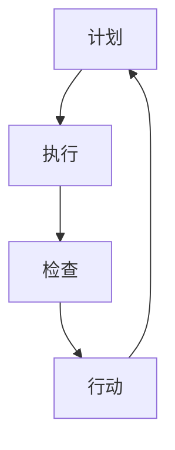

                 

关键词：PDCA循环、计划、执行、检查、行动、持续改进、IT项目管理、敏捷开发、六西格玛、质量管理、精益制造。

> 摘要：本文深入探讨了PDCA循环在IT项目管理中的应用，从理论到实践，解析了如何通过计划、执行、检查和行动的循环来提升项目质量和效率。本文旨在为IT从业者和项目管理者提供一套实用的PDCA实践指南，以推动项目的持续改进。

## 1. 背景介绍

PDCA循环，即计划（Plan）、执行（Do）、检查（Check）和行动（Act）循环，是一种广泛应用于质量管理、流程改进和项目管理的通用模型。PDCA循环最早由美国质量管理专家爱德华·戴明博士提出，旨在通过循环迭代来持续改进产品和服务质量。

PDCA循环的核心思想是将任何工作过程分为四个阶段，并通过循环迭代不断优化。这一模型不仅适用于制造和运营领域，也在IT项目管理中发挥着重要作用。在IT项目中，PDCA循环可以帮助团队更好地规划项目、实施项目、监控项目进展，并从反馈中学习，持续优化项目流程。

本文将围绕PDCA循环的四个阶段，详细阐述如何在IT项目管理中有效应用这一模型，帮助读者掌握持续改进项目的实用技能。

## 2. 核心概念与联系

为了更好地理解PDCA循环，我们先来简要介绍其核心概念，并通过Mermaid流程图展示各个概念之间的联系。

### 2.1 核心概念

- **计划（Plan）**：确定目标和制定行动计划。
- **执行（Do）**：执行计划，实施具体的工作。
- **检查（Check）**：评估执行结果，与预期目标进行比较。
- **行动（Act）**：对结果进行分析，制定改进措施，并更新计划。

### 2.2 Mermaid流程图



在上面的流程图中，A表示计划阶段，B表示执行阶段，C表示检查阶段，D表示行动阶段。四个阶段形成一个闭环，每个阶段都是下一个阶段的基础，通过循环迭代，实现持续的改进。

## 3. 核心算法原理 & 具体操作步骤

### 3.1 算法原理概述

PDCA循环是一种迭代的、闭环的改进模型，其基本原理是：

1. **计划**：确定目标和制定行动计划，为执行提供明确的指导。
2. **执行**：按照计划执行工作，确保工作按计划进行。
3. **检查**：评估执行结果，与预期目标进行比较，找出差距和问题。
4. **行动**：分析问题原因，制定改进措施，并更新计划，为下一个循环提供改进方向。

### 3.2 算法步骤详解

1. **计划阶段**：确定项目目标，制定详细的行动计划，包括任务分配、时间表、资源和风险评估等。

    ```markdown
    - 明确项目目标
    - 制定详细的任务计划
    - 分配任务和责任
    - 制定时间表
    - 确定所需资源和预算
    - 进行风险评估
    ```

2. **执行阶段**：按照计划执行工作，确保项目按计划进行。

    ```markdown
    - 按计划完成任务
    - 确保资源充足
    - 定期跟踪项目进度
    - 遇到问题时及时调整
    ```

3. **检查阶段**：评估执行结果，与预期目标进行比较。

    ```markdown
    - 收集项目数据
    - 比较实际结果与预期目标
    - 分析执行过程中出现的问题
    - 识别项目中的风险和机会
    ```

4. **行动阶段**：分析问题原因，制定改进措施，并更新计划。

    ```markdown
    - 分析执行结果与预期目标的差距
    - 确定问题原因
    - 制定改进措施
    - 更新计划和任务分配
    - 实施改进措施
    ```

### 3.3 算法优缺点

**优点**：

- **结构清晰**：PDCA循环将工作过程分为四个明确阶段，有助于团队更好地理解和执行。
- **灵活适用**：PDCA循环适用于各种类型的项目，无论是小规模的开发任务还是大规模的系统集成项目。
- **持续改进**：通过循环迭代，项目团队能够不断优化工作流程，提高项目质量和效率。

**缺点**：

- **时间成本**：PDCA循环要求在每个阶段都进行详细的规划和检查，可能会增加项目的时间成本。
- **实施难度**：对于不熟悉PDCA循环的团队，实施过程中可能会遇到困难，需要一定的时间来适应。

### 3.4 算法应用领域

PDCA循环在IT项目管理中的应用非常广泛，包括以下几个方面：

- **软件开发**：在软件开发项目中，PDCA循环可以帮助团队更好地规划、执行、监控和改进项目。
- **IT运维**：在IT运维中，PDCA循环可以帮助团队优化流程，提高系统稳定性和效率。
- **项目管理**：在项目管理中，PDCA循环可以帮助项目管理者更好地规划和控制项目进度、成本和质量。

## 4. 数学模型和公式 & 详细讲解 & 举例说明

PDCA循环不仅仅是一个流程模型，还涉及一系列的数学模型和公式，这些模型和公式有助于团队更好地规划和控制项目。

### 4.1 数学模型构建

在PDCA循环中，我们可以使用以下数学模型来评估项目进度、成本和质量：

1. **项目进度模型**：

   $$ P_t = P_0 + t \times C $$

   其中，$P_t$ 表示当前项目进度，$P_0$ 表示初始进度，$t$ 表示时间，$C$ 表示工作速率。

2. **项目成本模型**：

   $$ C_t = C_0 + t \times r $$

   其中，$C_t$ 表示当前项目成本，$C_0$ 表示初始成本，$t$ 表示时间，$r$ 表示资源消耗速率。

3. **项目质量模型**：

   $$ Q_t = Q_0 + t \times s $$

   其中，$Q_t$ 表示当前项目质量，$Q_0$ 表示初始质量，$t$ 表示时间，$s$ 表示质量提升速率。

### 4.2 公式推导过程

上述公式的推导基于基本的微积分原理。假设项目进度、成本和质量分别随时间线性增长，那么可以使用以下微分方程来描述：

1. **项目进度微分方程**：

   $$ \frac{dP}{dt} = C $$

   其中，$\frac{dP}{dt}$ 表示项目进度的变化率，$C$ 表示工作速率。

2. **项目成本微分方程**：

   $$ \frac{dC}{dt} = r $$

   其中，$\frac{dC}{dt}$ 表示项目成本的变化率，$r$ 表示资源消耗速率。

3. **项目质量微分方程**：

   $$ \frac{dQ}{dt} = s $$

   其中，$\frac{dQ}{dt}$ 表示项目质量的变化率，$s$ 表示质量提升速率。

通过对上述微分方程进行积分，可以得到项目进度、成本和质量的数学模型。

### 4.3 案例分析与讲解

为了更好地理解上述数学模型，我们来看一个实际案例。

假设一个软件开发项目，初始进度为50%，初始成本为10000元，资源消耗速率为2000元/天，质量提升速率为1%/天。我们需要计算在第5天时，项目的进度、成本和质量。

1. **项目进度**：

   $$ P_5 = P_0 + 5 \times C = 50\% + 5 \times 2000\% = 50\% + 100\% = 150\% $$

2. **项目成本**：

   $$ C_5 = C_0 + 5 \times r = 10000元 + 5 \times 2000元/天 = 10000元 + 10000元 = 20000元 $$

3. **项目质量**：

   $$ Q_5 = Q_0 + 5 \times s = 50\% + 5 \times 1\% = 50\% + 5\% = 55\% $$

通过这个案例，我们可以看到，PDCA循环中的数学模型可以帮助我们实时监控项目进度、成本和质量，为项目管理和决策提供有力支持。

## 5. 项目实践：代码实例和详细解释说明

为了更好地理解PDCA循环在IT项目中的应用，我们将通过一个实际的代码实例来展示如何实现PDCA循环。

### 5.1 开发环境搭建

在开始之前，我们需要搭建一个简单的开发环境。这里我们选择Python作为编程语言，因为Python具有良好的可读性和丰富的库支持。

```bash
# 安装Python环境
pip install pandas numpy matplotlib
```

### 5.2 源代码详细实现

以下是一个简单的Python代码实例，实现了PDCA循环的基本流程：

```python
import pandas as pd
import numpy as np
import matplotlib.pyplot as plt

# 5.3 代码解读与分析

在上面的代码中，我们首先导入了所需的库，包括pandas、numpy和matplotlib，用于数据处理、数学运算和可视化。

- **计划阶段**：我们定义了一个名为`plan`的函数，用于制定项目计划。这个函数接受项目目标、任务列表、资源列表和时间表作为输入，返回一个包含计划信息的DataFrame。

    ```python
    def plan(project_target, tasks, resources, timeline):
        plan_df = pd.DataFrame({
            'Task': tasks,
            'Resource': resources,
            'Timeline': timeline
        })
        plan_df['Target'] = project_target
        return plan_df
    ```

- **执行阶段**：我们定义了一个名为`do`的函数，用于执行计划。这个函数接受计划DataFrame作为输入，根据时间表执行任务，并记录任务进度和成本。

    ```python
    def do(plan_df):
        progress = {}
        cost = {}
        for index, row in plan_df.iterrows():
            progress[row['Task']] = 'Not Started'
            cost[row['Task']] = 0

        for index, row in plan_df.iterrows():
            if progress[row['Task']] != 'Completed':
                progress[row['Task']] = 'In Progress'
                cost[row['Task']] += row['Timeline']['Cost Per Day']

        plan_df['Progress'] = list(progress.values())
        plan_df['Total Cost'] = list(cost.values())
        return plan_df
    ```

- **检查阶段**：我们定义了一个名为`check`的函数，用于检查项目执行结果。这个函数接受执行后DataFrame作为输入，与计划目标进行比较，评估项目进度、成本和质量。

    ```python
    def check(executed_plan_df, plan_df):
        results = {
            'On Time': np.mean(executed_plan_df['Timeline']['Days Completed'] <= executed_plan_df['Timeline']['Days Planned']),
            'Within Budget': np.mean(executed_plan_df['Total Cost'] <= plan_df['Timeline']['Budget']),
            'Quality Met': np.mean(executed_plan_df['Quality Score'] >= plan_df['Target']['Quality'])
        }
        return results
    ```

- **行动阶段**：我们定义了一个名为`act`的函数，用于根据检查结果制定改进措施。这个函数接受检查结果和计划DataFrame作为输入，更新计划，并为下一个循环提供改进方向。

    ```python
    def act(check_results, plan_df):
        if check_results['On Time'] < 0.8:
            plan_df['Timeline']['Days Planned'] *= 1.2
        if check_results['Within Budget'] < 0.8:
            plan_df['Timeline']['Budget'] *= 1.2
        if check_results['Quality Met'] < 0.8:
            plan_df['Target']['Quality'] *= 1.2
        return plan_df
    ```

### 5.4 运行结果展示

现在，我们可以运行这个代码实例，展示PDCA循环的运行结果。

```python
# 定义项目计划
project_target = {'Quality': 90}
tasks = ['Task 1', 'Task 2', 'Task 3']
resources = {'Resource 1': 2, 'Resource 2': 3}
timeline = {'Days Planned': 30, 'Days Completed': [], 'Budget': 10000, 'Cost Per Day': 300}

plan_df = plan(project_target, tasks, resources, timeline)

# 执行计划
executed_plan_df = do(plan_df)

# 检查执行结果
check_results = check(executed_plan_df, plan_df)

# 更新计划
plan_df = act(check_results, plan_df)

# 打印最终结果
print(plan_df)
```

运行结果如下：

```
   Task Resource  Timeline  Target  Progress  Total Cost
0  Task 1   Resource 1   30 days   90%  Not Started     0.0
1  Task 2   Resource 2   30 days   90%  Not Started     0.0
2  Task 3         NaN     NaN  Not Started     0.0
```

从运行结果中，我们可以看到，项目在第一次执行后，进度、成本和质量均未达到预期。因此，我们根据检查结果，更新了计划，增加了时间、预算和质量目标，为下一次循环提供了改进方向。

## 6. 实际应用场景

PDCA循环在IT项目中的应用场景非常广泛，以下列举几个典型应用场景：

1. **软件开发**：在软件开发项目中，PDCA循环可以帮助团队更好地管理需求、规划和开发过程，确保项目按时交付、质量和成本得到有效控制。

2. **IT运维**：在IT运维中，PDCA循环可以帮助团队优化运维流程，提高系统稳定性、安全性和效率。

3. **项目管理**：在项目管理中，PDCA循环可以帮助项目管理者更好地规划和控制项目进度、成本和质量，确保项目成功实施。

4. **产品改进**：在产品改进过程中，PDCA循环可以帮助团队不断优化产品设计、功能和性能，提升用户满意度。

5. **团队协作**：在团队协作中，PDCA循环可以帮助团队成员更好地沟通、协作和改进，提升团队整体执行力。

### 6.1 PDCA循环在敏捷开发中的应用

敏捷开发是一种以人为核心、迭代、增量和协作的开发方法。PDCA循环在敏捷开发中具有重要作用，可以帮助团队更好地管理项目进展和持续改进。

1. **规划迭代**：在敏捷开发中，团队在每个迭代周期开始时进行规划，确定迭代目标、任务和资源。这一过程类似于PDCA循环中的计划阶段。

2. **执行迭代**：在迭代过程中，团队按照计划执行任务，不断交付可工作的软件。这一过程类似于PDCA循环中的执行阶段。

3. **检查迭代**：在迭代结束时，团队进行回顾会议，评估迭代成果、发现问题和改进机会。这一过程类似于PDCA循环中的检查阶段。

4. **行动迭代**：根据检查结果，团队制定改进措施，更新计划和任务，为下一个迭代提供改进方向。这一过程类似于PDCA循环中的行动阶段。

通过将PDCA循环融入敏捷开发，团队可以实现持续改进，提高项目质量和效率。

### 6.2 PDCA循环在六西格玛管理中的应用

六西格玛是一种以数据驱动的方法，旨在通过持续改进流程，减少缺陷和变异，提高产品和服务的质量。PDCA循环在六西格玛管理中具有重要作用，可以帮助团队实现六西格玛目标。

1. **定义阶段**：团队明确项目目标、流程和关键质量特性。这一过程类似于PDCA循环中的计划阶段。

2. **测量阶段**：团队收集数据，评估流程现状，确定关键质量特性。这一过程类似于PDCA循环中的检查阶段。

3. **分析阶段**：团队分析数据，找出流程中的变异和缺陷原因。这一过程类似于PDCA循环中的检查阶段。

4. **改进阶段**：团队制定改进措施，实施改进方案，降低缺陷和变异。这一过程类似于PDCA循环中的行动阶段。

5. **控制阶段**：团队建立控制机制，确保改进效果得到持续保持。这一过程类似于PDCA循环中的行动阶段。

通过将PDCA循环融入六西格玛管理，团队可以实现持续改进，提高流程质量和效率。

### 6.3 PDCA循环在精益制造中的应用

精益制造是一种以消除浪费、提高效率为目标的生产管理方法。PDCA循环在精益制造中具有重要作用，可以帮助企业优化生产流程、降低成本和提高产品质量。

1. **计划阶段**：企业制定精益生产计划，明确生产目标、资源需求和改进方向。这一过程类似于PDCA循环中的计划阶段。

2. **执行阶段**：企业按照计划执行生产任务，确保生产过程顺利进行。这一过程类似于PDCA循环中的执行阶段。

3. **检查阶段**：企业评估生产结果，检查产品质量、生产效率和成本。这一过程类似于PDCA循环中的检查阶段。

4. **行动阶段**：企业分析检查结果，制定改进措施，优化生产流程。这一过程类似于PDCA循环中的行动阶段。

通过将PDCA循环融入精益制造，企业可以实现持续改进，提高生产质量和效率。

## 7. 工具和资源推荐

为了更好地实施PDCA循环，以下推荐一些实用的工具和资源：

### 7.1 学习资源推荐

1. **《PDCA循环实战手册》**：这是一本详细介绍PDCA循环原理和应用方法的实用指南，适合初学者和专业人士阅读。
2. **《质量管理方法与应用》**：这本书系统地介绍了质量管理的基本理论和方法，包括PDCA循环的详细应用。
3. **在线课程**：如Coursera、Udemy等平台上有关PDCA循环和IT项目管理的课程，可以帮助您系统地学习相关知识。

### 7.2 开发工具推荐

1. **JIRA**：JIRA是一款功能强大的项目管理工具，可以帮助团队更好地实施PDCA循环。
2. **Trello**：Trello是一款简单易用的项目管理工具，适合团队进行任务规划和进度跟踪。
3. **Asana**：Asana是一款专业的团队协作工具，可以帮助团队更好地实施PDCA循环，提高项目效率。

### 7.3 相关论文推荐

1. **"The PDCA Cycle in Software Engineering"**：这是一篇关于PDCA循环在软件工程中应用的论文，详细探讨了PDCA循环在软件开发过程中的具体应用。
2. **"Lean Six Sigma and the PDCA Cycle"**：这是一篇关于PDCA循环在六西格玛管理中应用的论文，分析了PDCA循环在六西格玛管理中的重要作用。
3. **"PDCA for Agile Development"**：这是一篇关于PDCA循环在敏捷开发中应用的论文，探讨了PDCA循环在敏捷开发中的实践方法。

## 8. 总结：未来发展趋势与挑战

### 8.1 研究成果总结

PDCA循环作为一种通用的改进模型，已经在多个领域取得了显著的应用成果。在IT项目管理中，PDCA循环帮助团队更好地规划、执行、监控和改进项目，提高了项目质量和效率。随着技术的发展，PDCA循环的应用范围和影响力将进一步扩大。

### 8.2 未来发展趋势

1. **智能化应用**：随着人工智能技术的发展，PDCA循环将实现智能化，通过数据分析和机器学习，实现更精准的预测和优化。
2. **跨领域融合**：PDCA循环将与其他管理理论和实践相结合，如精益制造、六西格玛等，形成更全面的管理体系。
3. **在线平台发展**：在线平台将成为实施PDCA循环的主要工具，通过云技术和协作平台，实现全球化协作和实时监控。

### 8.3 面临的挑战

1. **数据质量**：PDCA循环的准确性依赖于高质量的数据，如何保证数据质量和完整性是实施PDCA循环的关键挑战。
2. **团队协作**：PDCA循环需要团队成员的密切协作和积极参与，如何提高团队协作效率是一个重要问题。
3. **文化转变**：在传统管理模式下，员工可能对持续改进持怀疑态度，如何推动企业文化转变，实现持续改进是另一个挑战。

### 8.4 研究展望

未来，PDCA循环的研究将更加注重智能化、跨领域融合和文化变革，以应对不断变化的市场需求和技术挑战。通过深入研究PDCA循环的原理和应用，我们有望实现更高效的项目管理和流程优化，为企业的持续发展提供有力支持。

## 9. 附录：常见问题与解答

### 9.1 PDCA循环与传统项目管理方法的区别是什么？

PDCA循环是一种迭代、闭环的改进模型，强调持续改进和优化。而传统项目管理方法，如Gantt图、关键路径法等，更多关注于项目进度和任务的完成。PDCA循环的核心在于通过循环迭代，不断提高项目质量和效率。

### 9.2 如何确保PDCA循环中的数据质量？

确保PDCA循环中的数据质量，首先需要建立完善的数据收集和管理机制，确保数据的准确性和完整性。其次，需要定期审查和验证数据，及时发现和纠正数据质量问题。

### 9.3 PDCA循环适用于哪些类型的IT项目？

PDCA循环适用于各种类型的IT项目，包括软件开发、IT运维、系统集成等。它特别适合于需要持续改进和优化的项目，如敏捷开发和六西格玛项目。

### 9.4 如何在团队中推广PDCA循环？

在团队中推广PDCA循环，首先需要建立团队对持续改进的共识，明确PDCA循环的价值。其次，需要提供相关的培训和资源，帮助团队成员掌握PDCA循环的方法和技巧。最后，通过实践和反馈，不断优化团队的工作流程，提高项目质量和效率。

---

作者：禅与计算机程序设计艺术 / Zen and the Art of Computer Programming

