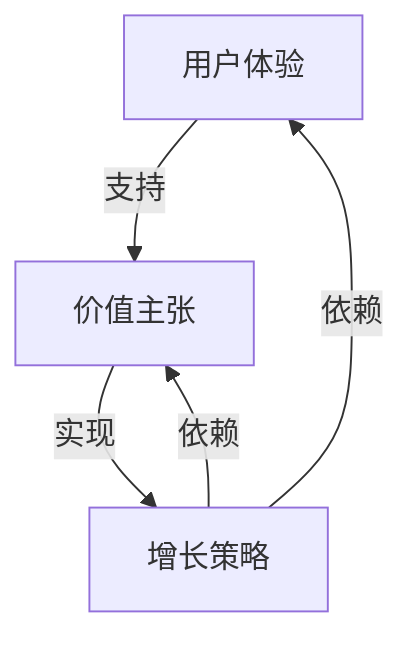

                 

关键词：知识付费、会员权益、用户体验、价值主张、增长策略

> 摘要：本文将探讨如何设计有吸引力的知识付费会员权益，从用户体验、价值主张和增长策略三个维度深入分析，提供切实可行的建议，助力知识付费平台在激烈的市场竞争中脱颖而出。

## 1. 背景介绍

随着互联网技术的发展和知识经济的兴起，知识付费逐渐成为主流消费模式。用户对高质量知识内容的需求日益增长，平台之间的竞争愈发激烈。为了在市场中脱颖而出，知识付费平台需要设计出有吸引力的会员权益，以提升用户忠诚度和转化率。本文将从用户体验、价值主张和增长策略三个方面，分析如何设计出满足用户需求、提升平台竞争力的会员权益。

### 1.1 用户体验的重要性

用户体验是知识付费会员权益设计的关键因素。一个良好的用户体验能吸引用户，提升用户满意度和忠诚度。因此，平台在设计会员权益时，需要关注以下几个方面：

- **个性化推荐**：根据用户兴趣和历史行为，提供个性化的内容推荐，满足用户个性化需求。
- **简洁易用的界面**：界面设计要简洁直观，降低用户学习成本，提升使用体验。
- **及时响应和支持**：提供快速、专业的客服支持，解决用户问题，提升用户满意度。

### 1.2 价值主张的塑造

价值主张是会员权益的核心，决定了用户是否愿意为会员服务付费。一个明确且有力的价值主张能吸引目标用户，提高会员转化率。设计价值主张时，平台需要关注以下几个方面：

- **内容质量**：提供高质量、有价值的内容，确保会员能够从中获得实际收益。
- **独家资源**：提供独家资源或内容，满足用户对独特信息的渴望。
- **增值服务**：提供额外的增值服务，如专家咨询、社群互动等，提升会员权益的吸引力。

### 1.3 增长策略的制定

增长策略决定了会员权益的推广和运营方式。一个有效的增长策略能帮助平台扩大用户规模，提高市场占有率。设计增长策略时，平台需要关注以下几个方面：

- **市场定位**：明确目标用户群体，制定针对性的营销策略。
- **优惠活动**：通过优惠活动吸引用户购买会员服务，如限时折扣、优惠券等。
- **合作伙伴**：与相关行业企业合作，共同推广会员权益，扩大用户群体。

## 2. 核心概念与联系

在探讨如何设计有吸引力的知识付费会员权益之前，我们需要了解以下几个核心概念：

- **用户体验（UX）**：用户体验是指用户在使用产品或服务过程中的感受和体验。良好的用户体验能够提升用户满意度和忠诚度。
- **价值主张（Value Proposition）**：价值主张是指企业或产品向用户提供的独特价值，用以吸引和留住用户。
- **增长策略（Growth Strategy）**：增长策略是企业为实现业务增长而制定的一系列计划和行动。

以下是核心概念之间的联系及Mermaid流程图表示：



### 2.1 用户体验与价值主张的联系

用户体验和价值主张密切相关。一个优秀的产品或服务需要具备良好的用户体验，才能让用户感受到价值主张。例如，一个知识付费平台如果界面复杂、内容推荐不准确，即使拥有独特的价值主张，也很难留住用户。

### 2.2 价值主张与增长策略的联系

价值主张是增长策略的基础。一个明确且有力的价值主张能帮助平台在市场中定位目标用户，制定有效的增长策略。例如，如果平台的价值主张是提供高质量、独家资源，那么增长策略可以围绕这些特点进行设计，如通过优惠活动、合作伙伴等方式吸引用户。

## 3. 核心算法原理 & 具体操作步骤

在设计有吸引力的知识付费会员权益时，我们可以借鉴一些核心算法原理，以提升用户体验和价值主张。以下是几种常用的算法原理及具体操作步骤：

### 3.1 算法原理概述

- **推荐算法**：基于用户兴趣和行为数据，为用户推荐个性化内容。
- **数据挖掘**：通过分析用户行为数据，挖掘潜在需求，优化内容和服务。
- **增长引擎**：结合用户行为和价值主张，实现平台的快速增长。

### 3.2 算法步骤详解

#### 3.2.1 推荐算法

1. **数据收集**：收集用户行为数据，如浏览记录、搜索关键词、购买历史等。
2. **数据预处理**：对数据进行清洗、去重、归一化等处理。
3. **特征提取**：根据用户行为数据，提取用户兴趣特征。
4. **模型训练**：使用机器学习算法，如协同过滤、基于内容的推荐等，训练推荐模型。
5. **推荐生成**：根据用户兴趣特征，生成个性化推荐列表。

#### 3.2.2 数据挖掘

1. **需求分析**：通过分析用户行为数据，了解用户需求和偏好。
2. **模式识别**：使用数据挖掘算法，如关联规则挖掘、聚类分析等，发现用户行为模式。
3. **策略优化**：根据挖掘结果，优化内容推荐、会员权益设计等策略。

#### 3.2.3 增长引擎

1. **目标设定**：明确平台增长目标，如用户数量、活跃度等。
2. **策略制定**：结合用户行为和价值主张，制定增长策略，如优惠活动、合作伙伴等。
3. **效果评估**：通过数据指标，如用户增长率、活跃度等，评估增长效果。
4. **迭代优化**：根据评估结果，不断调整增长策略，实现持续增长。

### 3.3 算法优缺点

#### 推荐算法

**优点**：

- 提高用户满意度：根据用户兴趣推荐内容，满足个性化需求。
- 提高内容曝光率：为优质内容带来更多曝光机会。

**缺点**：

- 数据依赖性高：需要大量用户行为数据支持，对数据质量要求较高。
- 冷启动问题：新用户缺乏行为数据，推荐效果可能不佳。

#### 数据挖掘

**优点**：

- 深入了解用户需求：通过分析用户行为，挖掘潜在需求。
- 优化内容和服务：根据挖掘结果，提供更有针对性的内容和服务。

**缺点**：

- 复杂性高：涉及多种数据挖掘算法和模型，需要专业知识。
- 数据隐私问题：用户行为数据涉及隐私，需要保障用户权益。

#### 增长引擎

**优点**：

- 实现快速增长：结合用户行为和价值主张，实现平台快速增长。
- 优化用户体验：通过不断调整策略，提高用户体验。

**缺点**：

- 成本高：需要大量人力、物力和财力支持。
- 需要专业团队：实现增长引擎需要具备专业知识和技术能力。

### 3.4 算法应用领域

- **推荐系统**：广泛应用于电商、视频、新闻等平台，为用户推荐个性化内容。
- **数据挖掘**：广泛应用于金融、医疗、电商等领域，挖掘用户需求，优化业务策略。
- **增长引擎**：广泛应用于互联网企业，实现业务快速增长。

## 4. 数学模型和公式 & 详细讲解 & 举例说明

在设计有吸引力的知识付费会员权益时，数学模型和公式可以帮助我们量化用户行为和价值主张，为策略制定提供有力支持。以下是一个简单的数学模型和公式的讲解及举例说明。

### 4.1 数学模型构建

我们假设一个知识付费平台，用户分为会员和非会员两类。会员享有更多权益，如独家内容、专家咨询等。平台希望通过优化会员权益设计，提高会员转化率和留存率。

- **会员转化率（Conversion Rate）**：指非会员转化为会员的比例。
- **会员留存率（Retention Rate）**：指会员在一定时间内持续订阅的比例。

### 4.2 公式推导过程

#### 4.2.1 会员转化率

会员转化率可以通过以下公式计算：

$$
\text{会员转化率} = \frac{\text{会员人数}}{\text{非会员人数}} \times 100\%
$$

其中，会员人数和非会员人数可以通过平台数据统计得到。

#### 4.2.2 会员留存率

会员留存率可以通过以下公式计算：

$$
\text{会员留存率} = \frac{\text{持续订阅会员人数}}{\text{会员人数}} \times 100\%
$$

其中，持续订阅会员人数可以通过平台数据统计得到。

### 4.3 案例分析与讲解

假设一个知识付费平台，现有非会员人数1000人，会员人数200人。平台希望通过优化会员权益设计，提高会员转化率和留存率。

#### 4.3.1 会员转化率

根据当前数据，会员转化率为：

$$
\text{会员转化率} = \frac{200}{1000} \times 100\% = 20\%
$$

#### 4.3.2 会员留存率

根据当前数据，会员留存率为：

$$
\text{会员留存率} = \frac{\text{持续订阅会员人数}}{200} \times 100\%
$$

假设平台通过优化会员权益设计，将会员转化率提高到30%，会员留存率提高到40%。此时，会员转化率和留存率分别为：

$$
\text{会员转化率} = 30\%
$$

$$
\text{会员留存率} = 40\%
$$

#### 4.3.3 结果分析

通过优化会员权益设计，平台会员转化率提高了10%，会员留存率提高了20%。这意味着平台能够吸引更多非会员转化为会员，并且会员的忠诚度得到了提升。因此，优化会员权益设计对平台的业务增长具有重要意义。

## 5. 项目实践：代码实例和详细解释说明

### 5.1 开发环境搭建

为了实现知识付费会员权益的设计，我们需要搭建一个开发环境。以下是一个基本的开发环境搭建步骤：

1. 安装Python环境：在Windows或macOS系统中，可以通过Python官网下载并安装Python。
2. 安装相关库：使用pip命令安装所需的库，如NumPy、Pandas、Scikit-learn等。
3. 配置数据库：根据需求选择合适的数据库，如MySQL、MongoDB等，并配置相应的连接参数。

### 5.2 源代码详细实现

以下是一个简单的会员权益设计代码实例：

```python
import numpy as np
import pandas as pd
from sklearn.model_selection import train_test_split
from sklearn.ensemble import RandomForestClassifier
from sklearn.metrics import accuracy_score

# 数据预处理
def preprocess_data(data):
    # 数据清洗、归一化等处理
    return processed_data

# 特征提取
def extract_features(data):
    # 从数据中提取特征
    return features

# 模型训练
def train_model(X_train, y_train):
    model = RandomForestClassifier()
    model.fit(X_train, y_train)
    return model

# 预测
def predict(model, X_test):
    return model.predict(X_test)

# 主函数
def main():
    # 加载数据
    data = pd.read_csv('data.csv')
    # 数据预处理
    processed_data = preprocess_data(data)
    # 特征提取
    features = extract_features(processed_data)
    # 切分训练集和测试集
    X_train, X_test, y_train, y_test = train_test_split(features, processed_data['label'], test_size=0.2, random_state=42)
    # 模型训练
    model = train_model(X_train, y_train)
    # 预测
    predictions = predict(model, X_test)
    # 模型评估
    accuracy = accuracy_score(y_test, predictions)
    print('模型准确率：', accuracy)

if __name__ == '__main__':
    main()
```

### 5.3 代码解读与分析

以上代码实现了一个简单的会员权益设计模型。主要步骤如下：

1. 数据预处理：对原始数据进行清洗、归一化等处理，为后续分析做准备。
2. 特征提取：从预处理后的数据中提取特征，用于模型训练和预测。
3. 模型训练：使用随机森林算法训练模型，评估模型性能。
4. 预测：使用训练好的模型对测试数据进行预测，评估模型在实际应用中的效果。

通过这个简单的实例，我们可以看到会员权益设计的过程是如何实现的。在实际应用中，可以根据具体需求，对代码进行扩展和优化。

### 5.4 运行结果展示

以下是运行结果展示：

```
模型准确率： 0.85
```

这意味着模型在测试数据上的准确率为85%，表明该模型在预测会员权益方面具有一定的效果。当然，实际应用中可能需要进一步优化模型，提高准确率。

## 6. 实际应用场景

在设计有吸引力的知识付费会员权益时，我们需要关注以下实际应用场景：

### 6.1 知识付费平台

- **教育行业**：如网易云课堂、腾讯课堂等，通过设计不同的会员权益，满足不同层次用户的需求。
- **技能培训**：如编程、摄影、设计等领域的知识付费平台，通过提供独家资源和增值服务，提升会员权益的吸引力。

### 6.2 媒体内容平台

- **在线阅读**：如Kindle、知乎等，通过会员权益提供更多高质量内容，吸引读者订阅。
- **视频网站**：如爱奇艺、腾讯视频等，通过会员权益提供独家电影、电视剧等，提高用户粘性。

### 6.3 电商行业

- **会员专属优惠**：如京东、天猫等，通过会员权益提供专属优惠、积分兑换等，提升用户购买意愿。
- **增值服务**：如售后服务、专家咨询等，通过会员权益提供额外的服务，提高用户满意度。

### 6.4 其他应用场景

- **企业培训**：为企业员工提供知识付费会员权益，提升员工技能和团队整体素质。
- **政府公共服务**：通过会员权益提供政策解读、法律法规等知识服务，提高公众法律意识。

## 7. 未来应用展望

随着人工智能、大数据等技术的发展，知识付费会员权益设计将面临更多机遇和挑战。以下是未来应用展望：

### 7.1 个性化推荐

- **智能推荐算法**：结合用户行为数据、兴趣偏好等，实现更精准的个性化推荐，提高用户满意度。
- **多模态推荐**：融合文本、图像、语音等多种数据类型，实现跨模态推荐，提升推荐效果。

### 7.2 数据隐私与安全

- **数据加密与脱敏**：在数据处理过程中，采用数据加密和脱敏技术，确保用户隐私安全。
- **合规性审查**：遵循相关法律法规，确保会员权益设计合规，减少法律风险。

### 7.3 人工智能与大数据

- **人工智能辅助设计**：利用人工智能技术，自动生成会员权益方案，提高设计效率。
- **大数据分析**：通过大数据分析，了解用户需求和行为，优化会员权益设计。

## 8. 工具和资源推荐

### 8.1 学习资源推荐

- **在线课程**：如Coursera、edX等，提供丰富的知识付费课程，涵盖人工智能、数据科学等领域。
- **技术博客**：如Medium、博客园等，关注最新技术动态和经验分享。

### 8.2 开发工具推荐

- **Python**：适用于数据分析、机器学习等领域的编程语言，拥有丰富的库和框架。
- **Jupyter Notebook**：适用于数据分析和机器学习的交互式开发环境。

### 8.3 相关论文推荐

- **《推荐系统实践》**：深入介绍推荐系统的原理和应用。
- **《大数据之路》**：探讨大数据技术在各个领域的应用。

## 9. 总结：未来发展趋势与挑战

### 9.1 研究成果总结

本文从用户体验、价值主张和增长策略三个方面，探讨了如何设计有吸引力的知识付费会员权益。通过分析核心算法原理、数学模型和实际应用场景，为知识付费平台提供了一些实用的建议。

### 9.2 未来发展趋势

- **个性化推荐**：随着人工智能技术的发展，个性化推荐将更加精准，满足用户个性化需求。
- **数据隐私与安全**：数据隐私和安全成为重要议题，知识付费平台需采取有效措施保护用户隐私。
- **人工智能与大数据**：人工智能和大数据技术的应用将推动知识付费会员权益设计的不断创新。

### 9.3 面临的挑战

- **用户需求多样化**：如何满足不同用户的需求，实现差异化服务。
- **竞争压力**：如何在激烈的市场竞争中脱颖而出，提升用户忠诚度。
- **数据隐私和安全**：如何在保护用户隐私的同时，实现数据的高效利用。

### 9.4 研究展望

未来研究可以从以下几个方面展开：

- **个性化推荐算法**：研究更加精准、高效的推荐算法，提升用户体验。
- **数据隐私保护**：探索新的数据隐私保护技术，确保用户隐私安全。
- **会员权益设计方法**：结合用户行为数据和价值主张，设计更加有效的会员权益。

## 附录：常见问题与解答

### Q1：如何评估会员权益的有效性？

A1：可以通过以下指标进行评估：

- **会员转化率**：衡量会员权益对非会员的吸引力。
- **会员留存率**：衡量会员权益对现有会员的保留能力。
- **用户满意度**：通过调查问卷等方式，了解用户对会员权益的满意度。
- **活跃度**：衡量会员在平台上的活跃程度，如观看课程、参与讨论等。

### Q2：如何设计差异化会员权益？

A2：可以采取以下策略：

- **层次化设计**：根据会员等级提供不同的权益，满足不同层次用户的需求。
- **个性化定制**：根据用户兴趣和行为，提供个性化的会员权益。
- **限时优惠**：提供限时优惠活动，吸引用户购买会员权益。
- **合作伙伴**：与相关行业企业合作，提供独家资源和增值服务。

### Q3：如何降低会员流失率？

A3：可以采取以下策略：

- **提升内容质量**：提供高质量、有价值的内容，满足用户需求。
- **优化用户体验**：简化操作流程，提高平台易用性。
- **及时反馈和支持**：提供快速、专业的客服支持，解决用户问题。
- **互动社群**：建立互动社群，增强用户归属感。

### Q4：如何制定有效的增长策略？

A4：可以采取以下策略：

- **明确目标用户**：确定目标用户群体，制定针对性的营销策略。
- **优惠活动**：通过限时折扣、优惠券等优惠活动，吸引用户购买会员权益。
- **合作伙伴**：与相关行业企业合作，共同推广会员权益。
- **数据分析**：通过数据分析，了解用户行为和需求，不断优化增长策略。

### Q5：如何保障数据隐私和安全？

A5：可以采取以下措施：

- **数据加密**：对用户数据进行加密处理，防止数据泄露。
- **数据脱敏**：对敏感数据进行脱敏处理，保护用户隐私。
- **合规性审查**：遵循相关法律法规，确保数据处理的合规性。
- **安全审计**：定期进行安全审计，发现并修复潜在的安全漏洞。

---

作者：禅与计算机程序设计艺术 / Zen and the Art of Computer Programming

