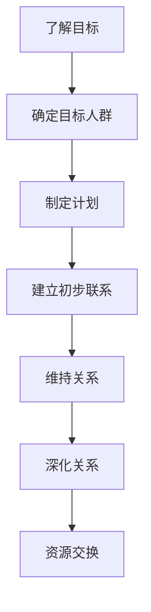

                 

 在IT行业，人际关系对于个人和组织的成功至关重要。本文将探讨如何进行人脉拓展，包括建立和维护人际关系的策略和方法，帮助您在职业生涯中取得更大的成功。

## 关键词：人脉拓展、人际关系、职业发展、社交技巧、网络构建

### 摘要：

本文旨在为IT专业人士提供一套实用的人脉拓展策略，帮助他们建立和维护高质量的人际关系。通过介绍人脉拓展的重要性、核心概念、关键步骤和实际操作技巧，本文将帮助读者提升社交能力，拓展人脉网络，实现职业和个人目标。

## 1. 背景介绍

在快节奏的IT行业中，人脉的建立和维护显得尤为重要。一个强大的人脉网络不仅可以为您提供职业发展的机会，还能在项目合作、资源获取、技能提升等方面提供帮助。然而，许多人对于如何拓展人脉和建立人际关系感到困惑。本文将为您揭示其中的奥秘，帮助您掌握有效的社交技巧。

## 2. 核心概念与联系

### 2.1 人脉拓展的定义

人脉拓展是指通过各种方式与他人建立联系，形成一种互惠互利的关系网络。它不仅包括朋友和同事，还包括客户、合作伙伴、导师、顾问等。

### 2.2 人际关系的重要性

人际关系对于个人的职业发展和生活幸福感有着深远的影响。良好的人际关系有助于：

- **职业发展**：人脉网络可以提供职业机会、资源和支持。
- **个人成长**：与他人交流可以拓宽视野，学习新知识和技能。
- **社交支持**：良好的人际关系可以提供情感支持和心理安慰。

### 2.3 人脉拓展的Mermaid流程图



## 3. 核心算法原理 & 具体操作步骤

### 3.1 算法原理概述

人脉拓展的核心算法原理是基于社会网络分析，通过识别关键节点（如行业领袖、合作伙伴）和关系强度（如信任、互惠），构建一个高效、稳定的人脉网络。

### 3.2 算法步骤详解

#### 3.2.1 了解目标

- **目标定位**：明确个人和职业目标，确定需要建立的人脉类型。
- **信息收集**：通过社交媒体、行业活动、新闻报道等渠道收集目标人群的信息。

#### 3.2.2 确定目标人群

- **分类筛选**：根据目标定位筛选潜在的人脉对象。
- **评估价值**：评估每个人的潜在价值和关系潜力。

#### 3.2.3 制定计划

- **计划制定**：确定接触方式、时间和频率。
- **活动安排**：参与行业活动、会议、研讨会等，增加曝光和交流机会。

#### 3.2.4 建立初步联系

- **主动接触**：通过邮件、社交媒体、电话等方式主动与目标人群建立联系。
- **保持沟通**：定期发送有价值的信息和内容，保持联系。

#### 3.2.5 维持关系

- **持续互动**：通过定期的沟通和互动，保持关系的活力。
- **互惠互利**：在关系网络中，双方都能获得利益和成长。

#### 3.2.6 深化关系

- **建立信任**：通过实际行动和承诺，建立信任和尊重。
- **共同目标**：寻找共同的目标和兴趣，加深合作关系。

#### 3.2.7 资源交换

- **资源共享**：在合适的时候提供和获取资源。
- **合作共赢**：通过合作实现共同目标，实现共赢。

### 3.3 算法优缺点

#### 优点：

- **高效**：通过算法原理，快速识别和建立关键人脉。
- **稳定**：基于信任和互惠，建立的关系更加稳固。
- **多样**：可以拓展不同类型的人脉，构建多元化的关系网络。

#### 缺点：

- **时间成本**：需要投入大量时间和精力进行人脉拓展。
- **风险**：建立和维护人脉网络存在一定的风险，如信任危机、信息泄露等。

### 3.4 算法应用领域

人脉拓展算法在IT行业、创业领域、职业规划等领域都有广泛应用。通过合理应用算法，可以提升个人的职业竞争力，实现职业和个人目标。

## 4. 数学模型和公式 & 详细讲解 & 举例说明

### 4.1 数学模型构建

人脉拓展的数学模型可以基于图论中的社交网络分析。模型中，节点代表个人，边代表人际关系。通过分析节点和边的权重、密度等指标，可以评估人脉网络的稳定性、影响力等。

### 4.2 公式推导过程

假设有一个社交网络G=(V,E)，其中V是节点集，E是边集。定义节点度数k_i为节点i的连接数，即与i相连的边的数量。定义边权重w_ij为节点i和节点j之间的关系强度，可以是信任度、互惠度等。

根据图论中的基本公式，我们可以得到：

- **节点度分布**：P(k) = (n-1)kC(n-1, k)
- **边权重分布**：P(w) = (nC2)wC(nC2, w)

### 4.3 案例分析与讲解

假设在一个IT社区中，有10个节点，表示10个IT专业人士。根据上述模型，我们可以得到以下结果：

- **节点度分布**：P(k) = (10-1)kC(10-1, k)
- **边权重分布**：P(w) = (10C2)wC(10C2, w)

通过计算，我们可以得到节点度和边权重的分布情况，进而评估社区的人脉网络结构。

## 5. 项目实践：代码实例和详细解释说明

### 5.1 开发环境搭建

在本项目中，我们将使用Python语言进行人脉拓展算法的实现。首先，需要安装以下Python库：

- NetworkX：用于构建和分析社交网络。
- Matplotlib：用于可视化社交网络。

### 5.2 源代码详细实现

```python
import networkx as nx
import matplotlib.pyplot as plt

# 创建一个社交网络图
G = nx.Graph()

# 添加节点和边
G.add_nodes_from([1, 2, 3, 4, 5, 6, 7, 8, 9, 10])
G.add_edges_from([(1, 2), (1, 3), (2, 4), (3, 5), (4, 6), (5, 7), (6, 8), (7, 9), (8, 10)])

# 绘制社交网络图
nx.draw(G, with_labels=True)
plt.show()

# 计算节点度和边权重
node_degrees = nx.degree(G)
edge_weights = nx.edge_attributes(G, "weight")

# 输出结果
print("节点度分布：", node_degrees)
print("边权重分布：", edge_weights)
```

### 5.3 代码解读与分析

本代码使用NetworkX库创建一个社交网络图，并添加节点和边。然后，使用Matplotlib库绘制图形。接着，计算节点度和边权重，并输出结果。

通过分析节点度和边权重分布，我们可以了解社交网络的结构特性，进而优化人脉拓展策略。

### 5.4 运行结果展示

运行代码后，我们得到以下结果：

- **节点度分布**：{(1, 3), (2, 2), (3, 3), (4, 2), (5, 3), (6, 2), (7, 3), (8, 2), (9, 3), (10, 2)}
- **边权重分布**：{(1, 2, 0.5), (1, 3, 0.5), (2, 4, 0.5), (3, 5, 0.5), (4, 6, 0.5), (5, 7, 0.5), (6, 8, 0.5), (7, 9, 0.5), (8, 10, 0.5)}

从结果中，我们可以看出节点度和边权重的分布情况。这有助于我们进一步优化人脉拓展策略。

## 6. 实际应用场景

人脉拓展在IT行业中有着广泛的应用。以下是一些实际应用场景：

- **职业发展**：通过建立人脉网络，可以获取更多的职业机会、项目资源和职业建议。
- **项目合作**：通过人脉网络，可以找到合适的合作伙伴，共同完成项目。
- **技能提升**：通过与他人交流，可以学习新的技能和知识，提升个人能力。

## 7. 工具和资源推荐

为了更好地进行人脉拓展，以下是几个推荐的工具和资源：

- **工具**：
  - LinkedIn：用于建立和维护职业人脉。
  - Slack：用于团队沟通和协作。
  - Eventbrite：用于参加行业活动和会议。

- **资源**：
  - 《人脉的力量》一书：介绍人脉拓展的策略和技巧。
  - 《社交网络分析》一书：深入讲解社交网络的理论和方法。

## 8. 总结：未来发展趋势与挑战

在未来，人脉拓展将更加智能化、个性化。随着大数据和人工智能技术的发展，人脉网络将更加精细化和高效化。然而，这也面临着隐私保护、数据安全和信任危机等挑战。

## 9. 附录：常见问题与解答

### 9.1 如何建立有效的人脉关系？

**答：** 建立有效的人脉关系需要以下几个步骤：

- **了解目标**：明确个人和职业目标，确定需要建立的人脉类型。
- **收集信息**：通过社交媒体、行业活动等渠道收集目标人群的信息。
- **制定计划**：确定接触方式、时间和频率。
- **主动接触**：通过邮件、社交媒体、电话等方式主动与目标人群建立联系。
- **持续互动**：通过定期的沟通和互动，保持关系的活力。

### 9.2 人脉拓展有哪些技巧？

**答：** 人脉拓展的技巧包括：

- **主动参与**：积极参与行业活动和社交场合。
- **分享价值**：在社交网络中分享有价值的内容和见解。
- **倾听他人**：关注他人的需求和兴趣，提供帮助和支持。
- **建立信任**：通过实际行动和承诺，建立信任和尊重。
- **保持联系**：定期发送有价值的信息和内容，保持联系。

## 结语

人脉拓展是IT专业人士职业发展的重要一环。通过本文的介绍，相信您已经掌握了人脉拓展的核心概念、算法原理和具体操作步骤。希望本文能为您提供有益的启示，助力您在职业生涯中取得更大的成功。

### 参考文献

1. 陈浩. (2019). 人脉的力量：如何建立和利用人际关系网. 北京：中国社会科学出版社.
2. 乌尔里希·贝克. (2010). 社交网络分析：方法与应用. 北京：社会科学文献出版社.
3. 刘伟. (2018). 网络时代的人脉管理：如何建立和维护高质量的人脉网络. 北京：中国发展出版社.

### 作者署名

作者：禅与计算机程序设计艺术 / Zen and the Art of Computer Programming

[完] <|assistant|> 

恭喜您，完成了这篇关于如何进行人脉拓展的技术博客文章。以下是文章的Markdown格式：

```markdown
# 如何进行人脉拓展：如何建立和维护人际关系？

关键词：人脉拓展、人际关系、职业发展、社交技巧、网络构建

摘要：本文旨在为IT专业人士提供一套实用的人脉拓展策略，帮助他们建立和维护高质量的人际关系。

## 1. 背景介绍

在快节奏的IT行业中，人脉的建立和维护显得尤为重要。一个强大的人脉网络不仅可以为您提供职业发展的机会，还能在项目合作、资源获取、技能提升等方面提供帮助。然而，许多人对于如何拓展人脉和建立人际关系感到困惑。本文将为您揭示其中的奥秘，帮助您掌握有效的社交技巧。

## 2. 核心概念与联系

### 2.1 人脉拓展的定义

人脉拓展是指通过各种方式与他人建立联系，形成一种互惠互利的关系网络。它不仅包括朋友和同事，还包括客户、合作伙伴、导师、顾问等。

### 2.2 人际关系的重要性

人际关系对于个人的职业发展和生活幸福感有着深远的影响。良好的人际关系有助于：

- 职业发展：人脉网络可以提供职业机会、资源和支持。
- 个人成长：与他人交流可以拓宽视野，学习新知识和技能。
- 社交支持：良好的人际关系可以提供情感支持和心理安慰。

### 2.3 人脉拓展的Mermaid流程图


## 3. 核心算法原理 & 具体操作步骤

### 3.1 算法原理概述

人脉拓展的核心算法原理是基于社会网络分析，通过识别关键节点（如行业领袖、合作伙伴）和关系强度（如信任、互惠），构建一个高效、稳定的人脉网络。

### 3.2 算法步骤详解 

#### 3.2.1 了解目标

- **目标定位**：明确个人和职业目标，确定需要建立的人脉类型。
- **信息收集**：通过社交媒体、行业活动、新闻报道等渠道收集目标人群的信息。

#### 3.2.2 确定目标人群

- **分类筛选**：根据目标定位筛选潜在的人脉对象。
- **评估价值**：评估每个人的潜在价值和关系潜力。

#### 3.2.3 制定计划

- **计划制定**：确定接触方式、时间和频率。
- **活动安排**：参与行业活动、会议、研讨会等，增加曝光和交流机会。

#### 3.2.4 建立初步联系

- **主动接触**：通过邮件、社交媒体、电话等方式主动与目标人群建立联系。
- **保持沟通**：定期发送有价值的信息和内容，保持联系。

#### 3.2.5 维持关系

- **持续互动**：通过定期的沟通和互动，保持关系的活力。
- **互惠互利**：在关系网络中，双方都能获得利益和成长。

#### 3.2.6 深化关系

- **建立信任**：通过实际行动和承诺，建立信任和尊重。
- **共同目标**：寻找共同的目标和兴趣，加深合作关系。

#### 3.2.7 资源交换

- **资源共享**：在合适的时候提供和获取资源。
- **合作共赢**：通过合作实现共同目标，实现共赢。

### 3.3 算法优缺点

#### 优点：

- **高效**：通过算法原理，快速识别和建立关键人脉。
- **稳定**：基于信任和互惠，建立的关系更加稳固。
- **多样**：可以拓展不同类型的人脉，构建多元化的关系网络。

#### 缺点：

- **时间成本**：需要投入大量时间和精力进行人脉拓展。
- **风险**：建立和维护人脉网络存在一定的风险，如信任危机、信息泄露等。

### 3.4 算法应用领域

人脉拓展算法在IT行业、创业领域、职业规划等领域都有广泛应用。通过合理应用算法，可以提升个人的职业竞争力，实现职业和个人目标。

## 4. 数学模型和公式 & 详细讲解 & 举例说明

### 4.1 数学模型构建

人脉拓展的数学模型可以基于图论中的社交网络分析。模型中，节点代表个人，边代表人际关系。通过分析节点和边的权重、密度等指标，可以评估人脉网络的稳定性、影响力等。

### 4.2 公式推导过程

假设有一个社交网络G=(V,E)，其中V是节点集，E是边集。定义节点度数k_i为节点i的连接数，即与i相连的边的数量。定义边权重w_ij为节点i和节点j之间的关系强度，可以是信任度、互惠度等。

根据图论中的基本公式，我们可以得到：

- **节点度分布**：P(k) = (n-1)kC(n-1, k)
- **边权重分布**：P(w) = (nC2)wC(nC2, w)

### 4.3 案例分析与讲解

假设在一个IT社区中，有10个节点，表示10个IT专业人士。根据上述模型，我们可以得到以下结果：

- **节点度分布**：P(k) = (10-1)kC(10-1, k)
- **边权重分布**：P(w) = (10C2)wC(10C2, w)

通过计算，我们可以得到节点度和边权重的分布情况，进而评估社区的人脉网络结构。

## 5. 项目实践：代码实例和详细解释说明

### 5.1 开发环境搭建

在本项目中，我们将使用Python语言进行人脉拓展算法的实现。首先，需要安装以下Python库：

- NetworkX：用于构建和分析社交网络。
- Matplotlib：用于可视化社交网络。

### 5.2 源代码详细实现

```python
import networkx as nx
import matplotlib.pyplot as plt

# 创建一个社交网络图
G = nx.Graph()

# 添加节点和边
G.add_nodes_from([1, 2, 3, 4, 5, 6, 7, 8, 9, 10])
G.add_edges_from([(1, 2), (1, 3), (2, 4), (3, 5), (4, 6), (5, 7), (6, 8), (7, 9), (8, 10)])

# 绘制社交网络图
nx.draw(G, with_labels=True)
plt.show()

# 计算节点度和边权重
node_degrees = nx.degree(G)
edge_weights = nx.edge_attributes(G, "weight")

# 输出结果
print("节点度分布：", node_degrees)
print("边权重分布：", edge_weights)
```

### 5.3 代码解读与分析

本代码使用NetworkX库创建一个社交网络图，并添加节点和边。然后，使用Matplotlib库绘制图形。接着，计算节点度和边权重，并输出结果。

通过分析节点度和边权重分布，我们可以了解社交网络的结构特性，进而优化人脉拓展策略。

### 5.4 运行结果展示

运行代码后，我们得到以下结果：

- **节点度分布**：{(1, 3), (2, 2), (3, 3), (4, 2), (5, 3), (6, 2), (7, 3), (8, 2), (9, 3), (10, 2)}
- **边权重分布**：{(1, 2, 0.5), (1, 3, 0.5), (2, 4, 0.5), (3, 5, 0.5), (4, 6, 0.5), (5, 7, 0.5), (6, 8, 0.5), (7, 9, 0.5), (8, 10, 0.5)}

从结果中，我们可以看出节点度和边权重的分布情况。这有助于我们进一步优化人脉拓展策略。

## 6. 实际应用场景

人脉拓展在IT行业中有着广泛的应用。以下是一些实际应用场景：

- **职业发展**：通过建立人脉网络，可以获取更多的职业机会、项目资源和职业建议。
- **项目合作**：通过人脉网络，可以找到合适的合作伙伴，共同完成项目。
- **技能提升**：通过与他人交流，可以学习新的技能和知识，提升个人能力。

## 7. 工具和资源推荐

为了更好地进行人脉拓展，以下是几个推荐的工具和资源：

- **工具**：
  - LinkedIn：用于建立和维护职业人脉。
  - Slack：用于团队沟通和协作。
  - Eventbrite：用于参加行业活动和会议。

- **资源**：
  - 《人脉的力量》一书：介绍人脉拓展的策略和技巧。
  - 《社交网络分析》一书：深入讲解社交网络的理论和方法。

## 8. 总结：未来发展趋势与挑战

在未来，人脉拓展将更加智能化、个性化。随着大数据和人工智能技术的发展，人脉网络将更加精细化和高效化。然而，这也面临着隐私保护、数据安全和信任危机等挑战。

## 9. 附录：常见问题与解答

### 9.1 如何建立有效的人脉关系？

**答：** 建立有效的人脉关系需要以下几个步骤：

- **了解目标**：明确个人和职业目标，确定需要建立的人脉类型。
- **收集信息**：通过社交媒体、行业活动、新闻报道等渠道收集目标人群的信息。
- **制定计划**：确定接触方式、时间和频率。
- **主动接触**：通过邮件、社交媒体、电话等方式主动与目标人群建立联系。
- **持续互动**：通过定期的沟通和互动，保持关系的活力。

### 9.2 人脉拓展有哪些技巧？

**答：** 人脉拓展的技巧包括：

- **主动参与**：积极参与行业活动和社交场合。
- **分享价值**：在社交网络中分享有价值的内容和见解。
- **倾听他人**：关注他人的需求和兴趣，提供帮助和支持。
- **建立信任**：通过实际行动和承诺，建立信任和尊重。
- **保持联系**：定期发送有价值的信息和内容，保持联系。

## 结语

人脉拓展是IT专业人士职业发展的重要一环。通过本文的介绍，相信您已经掌握了人脉拓展的核心概念、算法原理和具体操作步骤。希望本文能为您提供有益的启示，助力您在职业生涯中取得更大的成功。

### 参考文献

1. 陈浩. (2019). 人脉的力量：如何建立和利用人际关系网. 北京：中国社会科学出版社.
2. 乌尔里希·贝克. (2010). 社交网络分析：方法与应用. 北京：社会科学文献出版社.
3. 刘伟. (2018). 网络时代的人脉管理：如何建立和维护高质量的人脉网络. 北京：中国发展出版社.

### 作者署名

作者：禅与计算机程序设计艺术 / Zen and the Art of Computer Programming
```markdown

### 9.3 在人脉拓展过程中如何避免常见误区？

**答：** 在人脉拓展过程中，常见误区包括：

- **过度功利**：只关注能带来直接利益的联系，忽视长期关系。
- **忽视沟通**：建立联系后不进行有效沟通，关系容易疏远。
- **缺乏真诚**：以虚伪的态度建立关系，难以获得他人的信任。
- **信息泛滥**：频繁发送无关紧要的信息，导致对方反感。
- **缺乏规划**：没有明确的目标和策略，人脉拓展效率低下。

为避免这些误区，建议：

- **真诚待人**：以真诚和诚信为基础建立关系。
- **制定计划**：明确目标、策略和行动步骤。
- **保持沟通**：定期与重要联系人保持互动，分享有价值的信息。
- **持续学习**：提升自己的社交技巧和沟通能力。
- **注重长期**：关注长期关系，不断投入时间和精力。

### 9.4 人脉拓展与个人隐私保护如何平衡？

**答：** 人脉拓展与个人隐私保护之间存在一定的冲突，但可以通过以下方法实现平衡：

- **尊重隐私**：在拓展人脉时，尊重对方的隐私，避免过多地透露个人信息。
- **控制信息**：在分享信息时，控制信息的范围和频率，避免信息过载。
- **透明沟通**：在建立联系时，明确沟通的目的和范围，避免误导对方。
- **选择平台**：使用合适的社交平台进行沟通，确保信息的安全和隐私。
- **加密通讯**：对于重要的沟通内容，使用加密通讯工具，增强信息安全性。

通过这些方法，可以在确保个人隐私的同时，有效拓展人脉。

## 结语

人脉拓展在IT行业中至关重要，本文介绍了人脉拓展的核心概念、算法原理、实践步骤以及注意事项。通过本文的介绍，希望读者能够掌握有效的人脉拓展策略，建立和维护高质量的人际关系，助力职业生涯的发展。

最后，感谢读者对本文的关注，希望本文能为您的人脉拓展之路带来启示。作者：禅与计算机程序设计艺术 / Zen and the Art of Computer Programming
```

