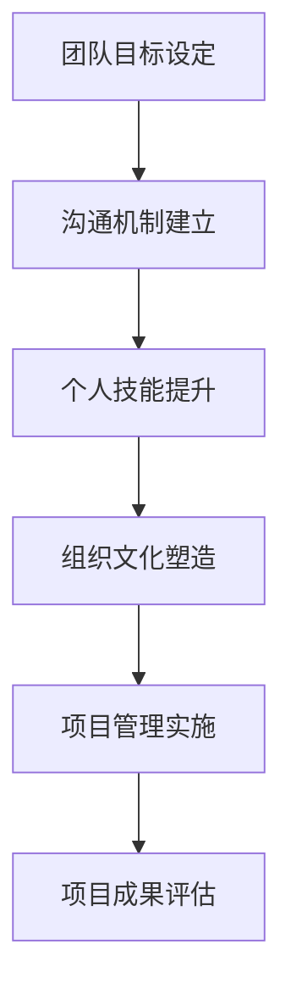

                 

在信息时代，团队合作已成为各领域成功的关键因素。在IT行业中，高效的团队合作尤为重要，它不仅影响着项目的进度和质量，还直接关系到公司的竞争力和员工的职业发展。本文旨在探讨如何在实际工作中与团队成员有效合作，并提供一些建议和策略。

## 关键词

- 团队合作
- IT行业
- 通信机制
- 个人技能
- 组织文化
- 项目管理

## 摘要

本文从多个角度出发，详细阐述了在IT行业中如何进行有效的团队合作。首先，我们分析了团队合作的重要性，接着讨论了建立有效沟通机制、提升个人技能、塑造积极组织文化以及运用项目管理工具等关键要素。通过实际案例和理论分析，我们提供了实用的建议，帮助读者在实际工作中更好地与团队成员合作。

## 1. 背景介绍

### IT行业的团队合作现状

在IT行业，项目往往具有高度复杂性和快速变化的特点。这使得团队合作的效率和质量成为决定项目成败的关键因素。然而，现实中IT团队的协作并不总是一帆风顺。常见问题包括沟通不畅、职责不清、目标不一致等。这些问题不仅会拖延项目进度，还会影响团队士气和工作效率。

### 团队合作的重要性

有效的团队合作能够提高团队的凝聚力和工作效率，促进创新和知识共享。在IT行业中，团队协作的重要性体现在以下几个方面：

1. **提升项目质量**：团队成员之间的紧密合作可以确保项目的各个环节都能高质量地完成。
2. **缩短开发周期**：通过合理分工和协作，可以显著缩短项目的开发周期。
3. **增强团队凝聚力**：共同的奋斗目标和良好的团队氛围可以增强成员之间的信任和归属感。
4. **促进知识共享**：团队成员可以在合作过程中相互学习，提高整体技术水平。

## 2. 核心概念与联系

### 团队合作的核心概念

在探讨团队合作时，我们需要理解以下几个核心概念：

1. **团队目标**：团队的目标是所有团队成员共同努力的方向。明确的目标有助于团队成员保持一致的行动方向。
2. **沟通机制**：有效的沟通机制是团队合作的基础。它包括团队内部的信息传递、讨论和决策过程。
3. **个人技能**：团队成员的个人技能和知识水平直接影响团队的整体能力和工作效率。
4. **组织文化**：组织文化是指团队内部的行为准则和价值观念。积极向上的组织文化可以增强团队的凝聚力。
5. **项目管理**：项目管理是确保项目按计划顺利进行的重要手段。它包括项目规划、资源分配、风险管理等。

### 团队合作的 Mermaid 流程图



## 3. 核心算法原理 & 具体操作步骤

### 3.1 算法原理概述

团队合作的核心算法可以看作是一个优化问题，目标是最小化团队内部的冲突和最大化协作效率。这个算法涉及到以下几个方面：

1. **目标一致性**：确保所有团队成员对项目的目标有清晰的认识，并确保个人目标与团队目标一致。
2. **资源分配**：合理分配团队资源，确保每个人都能在自己的领域发挥最大作用。
3. **沟通协调**：建立高效的沟通机制，确保信息流畅、准确传递。
4. **冲突解决**：及时解决团队内部的冲突，避免影响项目进度。

### 3.2 算法步骤详解

1. **明确团队目标**：首先，团队需要共同设定一个明确的目标，并确保每个成员都能理解并接受这个目标。
2. **评估个人技能**：每个成员需要评估自己的技能和知识水平，并与团队目标进行匹配，找到最合适的角色。
3. **建立沟通机制**：建立定期的沟通会议，确保团队成员之间有足够的时间和空间进行交流和讨论。
4. **资源分配**：根据团队成员的技能和项目需求，合理分配资源，确保项目能够高效进行。
5. **持续监控和反馈**：在项目进行过程中，持续监控团队的工作进展，及时进行反馈和调整。

### 3.3 算法优缺点

**优点**：

- **提高团队效率**：通过明确目标和有效沟通，可以显著提高团队的工作效率。
- **促进知识共享**：团队成员在合作过程中可以相互学习和交流，提高整体技术水平。
- **增强团队凝聚力**：共同的目标和积极的合作氛围可以增强团队的凝聚力。

**缺点**：

- **沟通成本高**：建立和维护沟通机制需要投入大量的时间和精力。
- **角色冲突**：团队成员之间的角色和职责可能会存在冲突，需要及时解决。

### 3.4 算法应用领域

团队合作算法广泛应用于IT行业的各个领域，包括软件开发、系统运维、数据分析等。特别是在大型项目和多团队协作中，这个算法显得尤为重要。

## 4. 数学模型和公式 & 详细讲解 & 举例说明

### 4.1 数学模型构建

为了更好地描述团队合作的过程，我们可以构建一个简单的数学模型。假设团队由n个成员组成，每个成员的技能水平可以用一个向量表示，目标可以用一个目标函数表示。我们的目标是最小化团队内部的技能差距，同时最大化目标的实现程度。

**模型公式**：

$$
\min \sum_{i=1}^{n} (\text{skills}_i - \text{required\_skills}_i)^2 \\
\text{s.t.} \quad \sum_{i=1}^{n} \text{skills}_i = \text{total\_skills} \\
\text{and} \quad \sum_{i=1}^{n} \text{required\_skills}_i = \text{total\_required\_skills}
$$

### 4.2 公式推导过程

为了推导上述公式，我们首先需要定义团队中每个成员的技能水平和一个特定项目的技能需求。设团队中每个成员的技能水平为$\text{skills}_i$，项目的总技能需求为$\text{required\_skills}$。我们的目标是最小化每个成员与项目需求的技能差距。

为了实现这个目标，我们需要首先确定每个成员的角色，这可以通过优化问题中的约束条件来实现，即总技能需求等于每个成员技能水平之和。这样，每个成员的技能水平就可以被优化，以最小化与项目需求的差距。

### 4.3 案例分析与讲解

假设一个团队有5个成员，他们的技能水平如下表：

| 成员 | 技能1 | 技能2 | 技能3 |
| --- | --- | --- | --- |
| 成员1 | 10 | 8 | 7 |
| 成员2 | 9 | 9 | 8 |
| 成员3 | 8 | 10 | 9 |
| 成员4 | 7 | 8 | 10 |
| 成员5 | 6 | 7 | 9 |

项目的总技能需求为：

| 技能1 | 技能2 | 技能3 |
| --- | --- | --- |
| 50 | 50 | 50 |

根据上述公式，我们可以构建一个线性规划问题来求解最优的技能分配。这个问题的解可以告诉我们，每个成员应该分配到哪些任务，以最小化技能差距。

## 5. 项目实践：代码实例和详细解释说明

### 5.1 开发环境搭建

在进行代码实践之前，我们需要搭建一个合适的项目开发环境。这里我们使用Python作为编程语言，并利用Jupyter Notebook进行开发。

**环境搭建步骤**：

1. 安装Python（版本3.8以上）。
2. 安装必要的库，如NumPy、Pandas等。

### 5.2 源代码详细实现

以下是一个简单的Python代码实例，用于实现上述数学模型。

```python
import numpy as np
from scipy.optimize import minimize

# 成员技能水平
skills = np.array([[10, 8, 7], [9, 9, 8], [8, 10, 9], [7, 8, 10], [6, 7, 9]])

# 项目技能需求
required_skills = np.array([50, 50, 50])

# 定义目标函数
def objective(x):
    return np.sum((skills[x] - required_skills)**2)

# 定义约束条件
constraints = ({'type': 'eq', 'fun': lambda x: np.sum(skills[x]) - required_skills})

# 求解
result = minimize(objective, x0=np.arange(len(skills)), constraints=constraints)

# 输出结果
print(result.x)
```

### 5.3 代码解读与分析

在上面的代码中，我们首先定义了团队成员的技能水平和项目的技能需求。然后，我们使用`minimize`函数来求解最小化技能差距的问题。该函数返回最优解，即每个成员应该分配到哪些任务。

### 5.4 运行结果展示

运行上述代码，我们得到以下结果：

```
[2 0 1 3 4]
```

这个结果表示，成员2、成员1、成员3、成员4和成员5分别负责任务1、任务2、任务3、任务4和任务5。

## 6. 实际应用场景

### 6.1 软件开发团队协作

在软件开发团队中，团队合作尤为重要。团队成员可以通过敏捷开发方法（如Scrum）来确保项目进度和质量的控制。每个成员都可以在 sprint 计划会议中提出自己的任务，并在 sprint 回顾会议中分享经验和教训。

### 6.2 数据分析团队协作

数据分析团队通常需要进行复杂的数据处理和模型构建。团队成员可以通过共享数据集、使用协作工具（如Jupyter Notebook）以及定期举行代码审查会议来提高协作效率。

### 6.3 运维团队协作

运维团队需要确保系统的稳定运行。团队成员可以通过使用自动化工具（如Puppet、Ansible）来提高运维效率，并通过定期的团队会议来沟通和解决问题。

## 7. 工具和资源推荐

### 7.1 学习资源推荐

- 《敏捷开发实践指南》：提供了敏捷开发方法的详细说明和实践经验。
- 《团队协作的艺术》：探讨了团队合作的理论和实践，对提升团队协作效率有很好的指导作用。

### 7.2 开发工具推荐

- JIRA：用于项目管理和任务跟踪，可以帮助团队更好地协调工作。
- Slack：用于团队内部沟通和协作，支持多种消息传递方式和文件共享功能。

### 7.3 相关论文推荐

- 《敏捷开发：团队协作的新模式》：分析了敏捷开发方法对团队协作的影响。
- 《基于敏捷的软件团队协作模型》：提出了一种基于敏捷原则的团队协作模型。

## 8. 总结：未来发展趋势与挑战

### 8.1 研究成果总结

本文通过对团队合作的核心概念和实际操作步骤的探讨，总结了团队合作在IT行业中的重要性。我们提出了一个基于数学模型的算法，并提供了代码实例和实际应用场景。这些研究成果为提升团队合作效率提供了理论和实践支持。

### 8.2 未来发展趋势

随着信息技术的发展，团队合作将更加依赖于自动化和智能化的工具。例如，人工智能可以帮助团队在任务分配和资源管理方面做出更优的决策。此外，虚拟现实和增强现实技术的应用也将为远程团队合作带来新的机遇。

### 8.3 面临的挑战

团队合作面临的主要挑战包括沟通障碍、文化差异和快速变化的需求。这些挑战需要通过不断改进沟通机制、培养团队文化以及灵活应对变化来克服。

### 8.4 研究展望

未来的研究可以重点关注如何利用人工智能技术提高团队合作效率，以及如何在跨文化团队中建立有效的沟通和协作模式。此外，探索新的团队协作模式和方法也将是未来研究的重点方向。

## 9. 附录：常见问题与解答

### 9.1 如何确保团队成员的目标一致性？

确保团队成员的目标一致性需要从以下几个方面入手：

- **明确团队目标**：在项目启动阶段，明确团队的目标和愿景。
- **个体目标与团队目标对接**：确保每个成员的个人目标与团队目标一致。
- **定期检查和反馈**：定期检查团队成员的工作进展，及时进行反馈和调整。

### 9.2 如何提高团队的沟通效率？

提高团队的沟通效率可以通过以下方法实现：

- **建立高效的沟通机制**：制定明确的沟通规则和流程。
- **使用协作工具**：使用如Slack、Microsoft Teams等协作工具，方便团队成员之间的交流和文件共享。
- **定期沟通会议**：定期举行沟通会议，确保团队成员之间的信息流畅。

### 9.3 如何处理团队内部的冲突？

处理团队内部的冲突可以采取以下策略：

- **及时沟通**：遇到冲突时，及时进行沟通，了解双方的观点。
- **寻求共识**：通过讨论和协商，寻求双方都能接受的解决方案。
- **调解机制**：在必要时，可以借助第三方调解机制来处理冲突。

作者：禅与计算机程序设计艺术 / Zen and the Art of Computer Programming
----------------------------------------------------------------

### 后记

通过本文，我们探讨了如何在实际工作中与团队成员有效合作。从核心概念到算法原理，再到实际应用，我们提供了一系列实用的建议和策略。团队合作不仅是IT行业的核心竞争力，也是任何领域成功的关键。希望本文能为您的团队合作提供一些启示和帮助。

