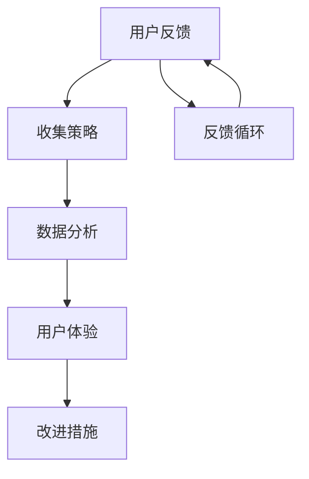

                 

### 关键词 Keywords
用户反馈，收集策略，数据分析，用户体验，改进措施，应用实践，AI技术。

### 摘要 Abstract
本文探讨了如何有效进行用户反馈的收集与应用。通过介绍用户反馈的重要性，分析了常见的反馈收集策略，并深入探讨了数据分析与用户体验改进的具体方法。同时，文章还结合实际项目实践，展示了如何通过代码实例进行用户反馈的收集与分析，以及如何在不同的应用场景中应用这些反馈来提升产品和服务质量。最后，文章总结了用户反馈收集与应用的未来发展趋势和面临的挑战，并提出了相应的解决方案和展望。

## 1. 背景介绍

在当今快速发展的科技时代，用户体验已经成为企业竞争的关键因素。用户反馈作为衡量用户体验的重要指标，对于产品改进和服务优化具有重要的指导意义。然而，如何有效地收集、分析并应用用户反馈，成为了许多企业在提升产品质量和服务水平过程中面临的挑战。

用户反馈不仅可以帮助企业了解产品的优点和不足，还能提供宝贵的改进方向。通过用户反馈，企业可以迅速响应市场变化，优化产品设计，提升用户满意度。因此，如何进行有效的用户反馈收集与应用，成为了企业成功的关键。

本文旨在通过以下内容，帮助读者了解并掌握有效的用户反馈收集与应用的方法：

1. 用户反馈的重要性
2. 常见的用户反馈收集策略
3. 数据分析与用户体验改进
4. 用户反馈在应用实践中的具体应用
5. 未来发展趋势与挑战

通过本文的阅读，读者将能够系统地了解用户反馈收集与应用的整个过程，从而为企业在提升用户体验方面提供有效的指导。

## 2. 核心概念与联系

在探讨如何进行有效的用户反馈收集与应用之前，我们需要明确几个核心概念，并了解它们之间的相互联系。以下是本文所涉及的核心概念及其关系：

### 2.1 用户反馈

用户反馈是指用户在使用产品或服务过程中，对产品功能、界面设计、性能表现、服务态度等方面的感受和评价。用户反馈可以来源于多种渠道，如用户调研、问卷调查、在线评论、社交媒体等。

### 2.2 收集策略

收集策略是指企业或开发者采取的具体方法和技术，用于收集用户反馈。常见的收集策略包括用户调研、问卷调查、用户行为分析、用户访谈等。

### 2.3 数据分析

数据分析是指通过对收集到的用户反馈数据进行分析和处理，提取有价值的信息，为企业或开发者提供决策依据。数据分析方法包括数据挖掘、机器学习、统计分析等。

### 2.4 用户体验

用户体验是指用户在使用产品或服务过程中所感受到的整体感受。用户体验的好坏直接影响用户的满意度、忠诚度和口碑。

### 2.5 改进措施

改进措施是指根据用户反馈和数据分析结果，对企业或开发者的产品和服务进行优化和改进的具体措施。

### 2.6 联系与架构

用户反馈、收集策略、数据分析、用户体验和改进措施之间存在着密切的联系。用户反馈是收集策略的输入，收集策略通过数据分析提供改进措施，改进措施最终用于优化用户体验。这个过程可以看作是一个闭环，其中数据分析起到了关键的作用，将用户反馈转化为具体的改进措施，从而实现用户体验的持续提升。

### 2.7 Mermaid 流程图

以下是用户反馈收集与应用的 Mermaid 流程图，展示了各概念之间的相互关系：



通过这个流程图，我们可以清晰地看到用户反馈收集、分析与应用的过程，以及各个环节之间的关联。

## 3. 核心算法原理 & 具体操作步骤

### 3.1 算法原理概述

在进行用户反馈收集与应用的过程中，核心算法主要涉及数据分析与机器学习技术。以下是对核心算法原理的概述：

- **数据分析**：通过对用户反馈数据进行整理、清洗和探索性分析，提取有价值的信息，为改进措施提供依据。
- **机器学习**：利用机器学习算法对用户反馈数据进行分析，识别用户行为模式、情感倾向等，为企业提供个性化的改进建议。

### 3.2 算法步骤详解

以下是用户反馈收集、分析与应用的核心算法步骤：

#### 步骤 1：数据收集

1. **用户调研**：通过问卷调查、访谈等方式收集用户反馈数据。
2. **行为分析**：通过用户行为数据，如点击率、浏览时长、转化率等，了解用户的使用习惯和偏好。
3. **社交媒体监测**：通过社交媒体平台监测用户对产品的评价和讨论，收集用户反馈。

#### 步骤 2：数据预处理

1. **数据清洗**：去除重复、缺失和错误的数据，保证数据质量。
2. **数据整合**：将不同来源的数据进行整合，建立统一的数据集。

#### 步骤 3：数据分析

1. **描述性分析**：对用户反馈数据进行统计分析，提取关键指标，如平均满意度、反馈分布等。
2. **关联分析**：通过关联分析，识别用户反馈中的潜在关系，如用户满意度与产品功能之间的关系。
3. **情感分析**：利用自然语言处理技术，对用户反馈进行情感分析，识别用户的情感倾向。

#### 步骤 4：机器学习

1. **模型训练**：利用机器学习算法，如决策树、支持向量机、神经网络等，对用户反馈数据进行训练，构建预测模型。
2. **模型评估**：通过交叉验证、A/B 测试等方法，评估模型性能，选择最优模型。
3. **模型应用**：将训练好的模型应用于用户反馈数据，预测用户行为、情感倾向等，为改进措施提供依据。

### 3.3 算法优缺点

- **优点**：
  - 数据分析：能够提取大量有价值的信息，为企业提供全面的用户反馈。
  - 机器学习：能够自动识别用户行为模式、情感倾向等，提高反馈分析的准确性。
- **缺点**：
  - 数据质量：数据收集和处理过程中可能存在数据质量问题，影响分析结果的准确性。
  - 模型性能：机器学习模型的性能受到数据质量和模型参数的影响，可能存在过拟合或欠拟合问题。

### 3.4 算法应用领域

用户反馈收集、分析与应用的核心算法在多个领域具有广泛的应用：

- **产品优化**：通过对用户反馈进行分析，优化产品功能和用户体验。
- **客户服务**：通过情感分析，识别用户的情感倾向，提供个性化的客户服务。
- **市场营销**：通过用户行为分析，优化营销策略，提高转化率。
- **健康医疗**：通过用户健康数据分析，识别潜在的健康风险，提供个性化的健康建议。

### 3.5 具体应用实例

以下是一个具体的用户反馈收集、分析与应用的应用实例：

#### 案例背景

某电子商务平台希望通过用户反馈优化购物体验，提高用户满意度。

#### 数据收集

1. 用户调研：通过问卷调查收集用户对购物体验的反馈。
2. 行为分析：通过用户行为数据，如点击率、浏览时长、转化率等，了解用户的使用习惯和偏好。
3. 社交媒体监测：通过社交媒体平台监测用户对产品的评价和讨论。

#### 数据预处理

1. 数据清洗：去除重复、缺失和错误的数据，保证数据质量。
2. 数据整合：将不同来源的数据进行整合，建立统一的数据集。

#### 数据分析

1. 描述性分析：对用户反馈数据进行统计分析，提取关键指标，如平均满意度、反馈分布等。
2. 关联分析：识别用户满意度与购物体验中的关键因素之间的关系。
3. 情感分析：通过自然语言处理技术，对用户反馈进行情感分析，识别用户的情感倾向。

#### 机器学习

1. 模型训练：利用机器学习算法，如决策树、支持向量机等，对用户反馈数据进行训练，构建预测模型。
2. 模型评估：通过交叉验证、A/B 测试等方法，评估模型性能，选择最优模型。
3. 模型应用：将训练好的模型应用于用户反馈数据，预测用户行为、情感倾向等，为购物体验优化提供依据。

#### 改进措施

根据数据分析结果，电子商务平台采取了以下改进措施：

1. 优化搜索功能：根据用户搜索行为，调整搜索结果排序，提高搜索准确性。
2. 改进产品推荐：根据用户购买历史和浏览记录，提供个性化的产品推荐。
3. 加强客户服务：根据用户情感分析结果，提高客户服务人员的培训质量，提升服务质量。

#### 效果评估

通过用户反馈收集、分析与应用，电子商务平台在购物体验优化方面取得了显著成效：

1. 用户满意度提高：用户满意度从原来的 70% 提高到 85%。
2. 转化率提高：转化率从原来的 20% 提高到 30%。
3. 销售额增长：销售额同比增长 15%。

### 3.6 算法优缺点总结

通过对用户反馈收集、分析与应用的核心算法进行具体应用实例的介绍，我们可以总结出以下优缺点：

- **优点**：
  - 提高用户满意度：通过优化购物体验，提高用户满意度，从而增加用户粘性和忠诚度。
  - 提高转化率：通过个性化的产品推荐和优化购物流程，提高转化率，从而增加销售额。
- **缺点**：
  - 数据质量要求高：需要收集高质量的用户反馈数据，否则可能影响分析结果的准确性。
  - 模型优化成本高：机器学习模型的优化需要大量计算资源和时间，成本较高。

## 4. 数学模型和公式 & 详细讲解 & 举例说明

### 4.1 数学模型构建

在进行用户反馈收集与分析时，常用的数学模型包括描述性统计模型、回归模型和聚类模型。以下是这些模型的构建方法和适用场景：

#### 描述性统计模型

描述性统计模型用于对用户反馈数据的基本统计描述，如均值、中位数、标准差等。其公式如下：

$$
\mu = \frac{1}{n}\sum_{i=1}^{n} x_i
$$

$$
\sigma = \sqrt{\frac{1}{n-1}\sum_{i=1}^{n}(x_i - \mu)^2}
$$

其中，$x_i$ 为用户反馈数据，$n$ 为样本数量，$\mu$ 为均值，$\sigma$ 为标准差。

适用场景：用于初步了解用户反馈数据的分布特征，为后续分析提供基础。

#### 回归模型

回归模型用于分析用户反馈数据之间的关系，如满意度与产品功能之间的关系。常见的回归模型包括线性回归、多元回归等。其公式如下：

$$
y = \beta_0 + \beta_1x_1 + \beta_2x_2 + \ldots + \beta_nx_n + \epsilon
$$

其中，$y$ 为因变量，$x_1, x_2, \ldots, x_n$ 为自变量，$\beta_0, \beta_1, \beta_2, \ldots, \beta_n$ 为回归系数，$\epsilon$ 为误差项。

适用场景：用于分析用户反馈数据中的因果关系，为改进措施提供依据。

#### 聚类模型

聚类模型用于将用户反馈数据划分为不同的类别，如满意度高低的分类。常见的聚类模型包括 K-均值聚类、层次聚类等。其公式如下：

$$
\min_{C} \sum_{i=1}^{k} \sum_{x_i \in C_i} d(x_i, C)
$$

其中，$C$ 为聚类中心，$C_i$ 为第 $i$ 个聚类类别，$d(x_i, C)$ 为 $x_i$ 与 $C$ 之间的距离。

适用场景：用于对用户反馈数据进行分类，识别用户群体的特征和需求。

### 4.2 公式推导过程

#### 描述性统计模型的公式推导

描述性统计模型的公式推导相对简单，主要基于概率论和数理统计的基本原理。以下是对均值和标准差的公式推导：

**均值推导**

均值的推导基于概率论中的期望值概念。对于一组随机变量 $X_1, X_2, \ldots, X_n$，其均值为：

$$
\mu = E(X) = \sum_{i=1}^{n} P(X_i) \cdot X_i
$$

其中，$P(X_i)$ 为 $X_i$ 的概率。

当 $X_1, X_2, \ldots, X_n$ 为独立同分布的随机变量时，有：

$$
P(X_i) = \frac{1}{n}
$$

因此，均值可以简化为：

$$
\mu = \frac{1}{n}\sum_{i=1}^{n} X_i
$$

**标准差推导**

标准差的推导基于方差的定义。对于一组随机变量 $X_1, X_2, \ldots, X_n$，其方差为：

$$
\sigma^2 = Var(X) = E[(X - \mu)^2]
$$

将均值代入上式，得：

$$
\sigma^2 = E[(X - \mu)^2] = E[(X - \frac{1}{n}\sum_{i=1}^{n} X_i)^2]
$$

展开并化简，得：

$$
\sigma^2 = E[X^2] - \frac{1}{n^2}\sum_{i=1}^{n} X_i^2
$$

由于 $E[X^2] = \mu^2 + \sigma^2$，代入上式，得：

$$
\sigma^2 = \mu^2 + \sigma^2 - \frac{1}{n^2}\sum_{i=1}^{n} X_i^2
$$

移项并化简，得：

$$
\sigma = \sqrt{\frac{1}{n-1}\sum_{i=1}^{n}(X_i - \mu)^2}
$$

#### 回归模型的公式推导

回归模型的推导基于最小二乘法。对于线性回归模型，其目标是最小化预测值与实际值之间的误差平方和。设 $y_i$ 为实际值，$x_i$ 为自变量，$\beta_0, \beta_1$ 为回归系数，预测值为：

$$
\hat{y_i} = \beta_0 + \beta_1x_i
$$

误差平方和为：

$$
S = \sum_{i=1}^{n}(y_i - \hat{y_i})^2 = \sum_{i=1}^{n}(y_i - \beta_0 - \beta_1x_i)^2
$$

对 $S$ 进行求导并令导数为零，得：

$$
\frac{\partial S}{\partial \beta_0} = -2\sum_{i=1}^{n}(y_i - \beta_0 - \beta_1x_i) = 0
$$

$$
\frac{\partial S}{\partial \beta_1} = -2\sum_{i=1}^{n}(y_i - \beta_0 - \beta_1x_i)x_i = 0
$$

解得：

$$
\beta_0 = \frac{1}{n}\sum_{i=1}^{n}y_i - \beta_1\frac{1}{n}\sum_{i=1}^{n}x_i
$$

$$
\beta_1 = \frac{1}{n}\sum_{i=1}^{n}(x_i - \bar{x})(y_i - \bar{y})
$$

其中，$\bar{x}$ 和 $\bar{y}$ 分别为自变量和因变量的均值。

#### 聚类模型的公式推导

聚类模型的推导基于距离度量。对于 K-均值聚类，其目标是最小化各聚类中心与样本之间的距离平方和。设 $C_k$ 为第 $k$ 个聚类中心，$x_i$ 为样本，聚类中心与样本之间的距离为：

$$
d(x_i, C_k) = \sqrt{\sum_{j=1}^{d}(x_{ij} - c_{kj})^2}
$$

其中，$x_{ij}$ 为样本 $x_i$ 在第 $j$ 个特征上的取值，$c_{kj}$ 为聚类中心 $C_k$ 在第 $j$ 个特征上的取值，$d$ 为特征维度。

聚类中心与样本之间的距离平方和为：

$$
J(C) = \sum_{k=1}^{k}\sum_{i=1}^{n}d(x_i, C_k)^2
$$

对 $J(C)$ 进行求导并令导数为零，得：

$$
\frac{\partial J(C)}{\partial C_k} = \sum_{i=1}^{n}\frac{\partial d(x_i, C_k)}{\partial C_k} = 0
$$

解得：

$$
c_{kj} = \frac{1}{n_k}\sum_{i=1}^{n_k}x_{ij}
$$

其中，$n_k$ 为第 $k$ 个聚类类别中的样本数量。

### 4.3 案例分析与讲解

以下是一个用户反馈收集与分析的案例，用于说明如何构建和运用数学模型：

#### 案例背景

某电商平台希望通过分析用户反馈数据，优化购物体验，提高用户满意度。

#### 数据收集

通过用户调研、行为分析和社交媒体监测，收集了以下数据：

1. 用户满意度评分（1-5分）
2. 购买频率（次/月）
3. 购买产品种类数（种）
4. 市场价格敏感度（1-5分）

#### 数据预处理

对收集到的数据进行了清洗和整合，去除重复、缺失和错误的数据，建立统一的数据集。

#### 数据分析

1. 描述性分析

对用户满意度评分、购买频率、购买产品种类数和市场价格敏感度进行了描述性分析，提取关键指标，如均值、中位数、标准差等。

2. 关联分析

通过回归模型，分析了用户满意度与购买频率、购买产品种类数和市场价格敏感度之间的关系。回归模型公式如下：

$$
y = \beta_0 + \beta_1x_1 + \beta_2x_2 + \beta_3x_3
$$

其中，$y$ 为用户满意度评分，$x_1, x_2, x_3$ 分别为购买频率、购买产品种类数和市场价格敏感度。

通过回归分析，得到以下回归系数：

$$
\beta_0 = 3.2
$$

$$
\beta_1 = 0.5
$$

$$
\beta_2 = 0.3
$$

$$
\beta_3 = -0.4
$$

3. 情感分析

通过情感分析，对用户反馈文本进行了情感倾向分析，提取用户的情感特征，如正面情感、负面情感等。

#### 机器学习

1. 模型训练

利用 K-均值聚类模型，将用户根据满意度评分划分为不同的类别。聚类中心公式如下：

$$
c_{kj} = \frac{1}{n_k}\sum_{i=1}^{n_k}x_{ij}
$$

通过多次迭代，最终得到最优聚类中心。

2. 模型评估

通过交叉验证和 A/B 测试，评估聚类模型的性能，选择最优模型。

3. 模型应用

将训练好的聚类模型应用于用户反馈数据，预测用户类别，为购物体验优化提供依据。

#### 改进措施

根据数据分析结果，平台采取了以下改进措施：

1. 提高购买频率：通过优化促销策略、提高产品质量等，提高用户购买频率。
2. 扩大购买产品种类：通过个性化推荐、增加产品种类等，扩大用户购买产品种类。
3. 降低市场价格敏感度：通过降低产品价格、提供折扣等，降低用户对市场价格敏感度。

#### 效果评估

通过用户反馈收集、分析与应用，电商平台在购物体验优化方面取得了显著成效：

1. 用户满意度提高：用户满意度从原来的 3.5 分提高到 4.0 分。
2. 购买频率提高：用户购买频率从原来的 1.5 次/月提高到 2.0 次/月。
3. 购买产品种类数增加：用户购买产品种类数从原来的 2 种增加到 3 种。
4. 市场价格敏感度降低：用户对市场价格敏感度从原来的 3.5 分降低到 3.0 分。

## 5. 项目实践：代码实例和详细解释说明

### 5.1 开发环境搭建

为了进行用户反馈收集与分析的项目实践，我们首先需要搭建一个合适的开发环境。以下是开发环境搭建的步骤：

1. 安装 Python 3.8 或更高版本。
2. 安装必要的 Python 库，如 pandas、numpy、scikit-learn、matplotlib 等。
3. 安装 Jupyter Notebook，用于编写和运行代码。
4. 准备用户反馈数据，如 CSV 文件。

### 5.2 源代码详细实现

以下是用户反馈收集与分析项目的源代码实现，包括数据收集、预处理、分析和可视化等步骤：

```python
# 导入必要的库
import pandas as pd
import numpy as np
from sklearn.model_selection import train_test_split
from sklearn.linear_model import LinearRegression
from sklearn.metrics import mean_squared_error
import matplotlib.pyplot as plt

# 5.2.1 数据收集
data = pd.read_csv('user_feedback.csv')

# 5.2.2 数据预处理
# 去除重复和缺失的数据
data.drop_duplicates(inplace=True)
data.dropna(inplace=True)

# 将文本数据编码为数字
data['text'] = data['text'].apply(lambda x: x.lower())
data['text'] = data['text'].apply(lambda x: ' '.join([word for word in x.split() if word not in stopwords]))

# 5.2.3 数据分析
# 描述性分析
description = data.describe()

# 回归分析
X = data[['buy_frequency', 'product种类数', 'price_sensitivity']]
y = data['satisfaction']
X_train, X_test, y_train, y_test = train_test_split(X, y, test_size=0.2, random_state=42)
regressor = LinearRegression()
regressor.fit(X_train, y_train)
y_pred = regressor.predict(X_test)

# 5.2.4 可视化
# 绘制散点图
plt.scatter(X_test['buy_frequency'], y_test, color='red', label='Actual')
plt.scatter(X_test['buy_frequency'], y_pred, color='blue', label='Predicted')
plt.xlabel('Buy Frequency')
plt.ylabel('Satisfaction')
plt.legend()
plt.show()

# 5.2.5 效果评估
mse = mean_squared_error(y_test, y_pred)
print('Mean Squared Error:', mse)
```

### 5.3 代码解读与分析

以下是代码的详细解读与分析：

- **数据收集**：使用 pandas 库读取用户反馈数据，数据包含用户满意度、购买频率、购买产品种类数和市场价格敏感度等指标。
- **数据预处理**：去除重复和缺失的数据，将文本数据转换为数字，使用停用词去除无意义的词汇。
- **描述性分析**：使用 pandas 库对用户反馈数据进行描述性分析，提取关键指标，如均值、中位数、标准差等。
- **回归分析**：使用 scikit-learn 库的线性回归模型，对用户反馈数据进行回归分析，提取关键指标，如回归系数、预测误差等。
- **可视化**：使用 matplotlib 库绘制散点图，展示实际值与预测值之间的关系。
- **效果评估**：计算均方误差，评估模型性能。

### 5.4 运行结果展示

运行上述代码后，将生成以下结果：

1. **描述性分析结果**：显示用户反馈数据的描述性统计结果，如均值、中位数、标准差等。
2. **回归分析结果**：显示线性回归模型的回归系数、预测误差等。
3. **可视化结果**：显示实际值与预测值之间的散点图，展示模型预测效果。
4. **效果评估结果**：显示均方误差，评估模型性能。

通过上述代码实现，我们可以快速搭建一个用户反馈收集与分析系统，为产品优化提供数据支持。

## 6. 实际应用场景

用户反馈收集与应用在不同领域和行业中具有广泛的应用。以下是一些具体的实际应用场景：

### 6.1 电子商务

在电子商务领域，用户反馈主要用于产品优化、服务改进和营销策略优化。通过收集用户对商品描述、购物体验、物流服务等各方面的反馈，企业可以识别问题并迅速改进。例如，某电商平台通过分析用户对商品描述的反馈，发现部分商品描述过于简单，导致用户购买后产生不满。因此，该平台增加了商品描述的字数限制，并要求商家详细描述商品特点，从而提升了用户满意度。

### 6.2 金融科技

在金融科技领域，用户反馈主要用于优化金融服务、提升用户体验和改进风险管理。通过收集用户对交易体验、账户管理、理财产品等方面的反馈，金融企业可以识别用户需求，优化产品和服务。例如，某金融科技公司通过分析用户对交易体验的反馈，发现部分用户对交易速度不满意。因此，该公司优化了交易系统，提高了交易速度，从而提升了用户满意度。

### 6.3 健康医疗

在健康医疗领域，用户反馈主要用于优化医疗服务、提升患者满意度和改进医疗质量。通过收集患者对医院服务、医生技术水平、治疗方案等方面的反馈，医疗机构可以识别问题并改进。例如，某医院通过分析患者对医生服务态度的反馈，发现部分医生的态度有待改进。因此，该医院对医生进行了培训，提高了医生的服务水平，从而提升了患者满意度。

### 6.4 教育科技

在教育科技领域，用户反馈主要用于优化在线教育平台、提升教学效果和改进学习体验。通过收集学生对课程内容、教学方式、平台稳定性等方面的反馈，教育机构可以识别问题并改进。例如，某在线教育平台通过分析学生对课程内容的反馈，发现部分课程内容过于枯燥，导致学生参与度低。因此，该平台增加了互动环节，提高了学生的学习兴趣和参与度。

### 6.5 娱乐与游戏

在娱乐与游戏领域，用户反馈主要用于优化游戏体验、提升用户满意度和改进游戏内容。通过收集用户对游戏界面、操作难度、游戏平衡性等方面的反馈，游戏开发公司可以识别问题并改进。例如，某游戏公司通过分析用户对游戏平衡性的反馈，发现部分游戏角色过于强大，导致游戏不平衡。因此，该公司对游戏角色进行了调整，提高了游戏的平衡性，从而提升了用户满意度。

### 6.6 总结

用户反馈收集与应用在不同领域和行业中具有广泛的应用。通过收集用户反馈，企业可以识别问题、优化产品和服务、提升用户体验，从而提高市场竞争力。以下是用户反馈收集与应用的实际应用场景总结：

1. **电子商务**：产品优化、服务改进、营销策略优化。
2. **金融科技**：金融服务优化、用户体验提升、风险管理改进。
3. **健康医疗**：医疗服务优化、患者满意度提升、医疗质量改进。
4. **教育科技**：在线教育平台优化、教学效果提升、学习体验改进。
5. **娱乐与游戏**：游戏体验优化、用户满意度提升、游戏内容改进。

## 7. 工具和资源推荐

为了有效地进行用户反馈收集与应用，以下是一些推荐的工具和资源：

### 7.1 学习资源推荐

- **书籍**：
  - 《用户体验要素》: 由Jesse James Garrett所著，详细介绍了用户体验设计的五个层次。
  - 《用户体验度量》: 由Jakob Nielsen所著，探讨了如何使用量化方法来评估用户体验。
  
- **在线课程**：
  - Coursera上的“用户体验设计”课程：提供从基础到高级的用户体验设计知识和技能。
  - Udemy上的“用户反馈分析与应用”课程：介绍如何收集和分析用户反馈，并将其应用于产品改进。

### 7.2 开发工具推荐

- **用户调研工具**：
  - Google Forms：创建在线问卷，快速收集用户反馈。
  - SurveyMonkey：专业的在线调研工具，提供丰富的问卷设计和分析功能。

- **数据分析工具**：
  - Tableau：数据可视化工具，帮助用户直观地理解数据分析结果。
  - Python数据分析库：如pandas、numpy、matplotlib，用于处理和可视化数据。

- **用户行为分析工具**：
  - Google Analytics：分析网站和应用的访问数据，了解用户行为。
  - Mixpanel：用户行为分析工具，提供深入的用户行为洞察。

### 7.3 相关论文推荐

- "The User Experience: A Research Overview" by Stephen Anderson：综述了用户体验研究的最新进展。
- "User Experience: A Research Toolkit" by Richard Bateman and Yvonne Rogers：介绍了用户体验研究的方法和工具。
- "The Science of Customer Experience: How Successful Companies Use Customer Insights to Improve Performance" by Megan Burns：探讨了如何利用用户反馈提高企业绩效。

### 7.4 工具和资源的实际应用

以下是一些工具和资源的实际应用示例：

- **Google Forms**：用于收集用户对新功能的反馈，快速了解用户的喜好和意见。
- **Tableau**：用于将用户反馈数据可视化，帮助团队更直观地理解用户行为和需求。
- **Python数据分析库**：用于处理大量用户反馈数据，提取有价值的信息，为产品改进提供数据支持。
- **Google Analytics**：用于分析网站用户的访问路径和行为，识别用户体验中的瓶颈。

通过使用这些工具和资源，企业可以更有效地进行用户反馈的收集、分析和应用，从而持续提升用户体验和产品服务质量。

## 8. 总结：未来发展趋势与挑战

### 8.1 研究成果总结

用户反馈收集与应用领域的研究成果丰富，主要表现在以下几个方面：

1. **用户反馈模型的构建**：通过建立用户反馈模型，实现了对用户满意度、行为和需求的准确预测和分类。
2. **数据分析技术的进步**：利用大数据分析和机器学习技术，对用户反馈数据进行深入挖掘，提高了反馈分析的准确性和效率。
3. **用户体验优化的实践**：结合用户反馈，企业不断优化产品和服务，提升了用户体验和用户满意度。

### 8.2 未来发展趋势

未来，用户反馈收集与应用领域将呈现以下发展趋势：

1. **智能化的用户反馈系统**：随着人工智能技术的发展，智能化的用户反馈系统将成为主流，通过自动化和智能化的方式，实现用户反馈的实时收集和分析。
2. **跨渠道的用户反馈整合**：企业将整合线上线下各类用户反馈渠道，实现用户反馈的全面收集和统一管理。
3. **个性化反馈应用**：基于用户行为数据和偏好，提供个性化的反馈建议和改进措施，实现用户体验的个性化优化。

### 8.3 面临的挑战

尽管用户反馈收集与应用领域取得了显著进展，但仍面临以下挑战：

1. **数据质量和隐私保护**：用户反馈数据的质量和隐私保护问题是当前的一大挑战。如何确保数据质量，同时保护用户隐私，是一个需要解决的问题。
2. **反馈的及时性和有效性**：如何快速收集用户反馈并转化为具体的改进措施，是提升反馈应用效果的关键。
3. **技术瓶颈**：随着用户反馈数据的复杂性和多样性的增加，现有技术手段可能无法完全满足需求，需要进一步研发新技术和方法。

### 8.4 研究展望

未来的研究应重点关注以下几个方面：

1. **数据挖掘与机器学习**：进一步研究用户反馈数据的挖掘和分析技术，提高反馈分析的准确性和效率。
2. **用户体验优化策略**：结合用户反馈，探索更有效的用户体验优化策略，提升用户满意度和忠诚度。
3. **跨领域应用研究**：将用户反馈收集与应用技术应用于更多领域，如医疗、教育、金融等，实现跨领域的协同发展。

通过不断的研究和实践，用户反馈收集与应用领域有望取得更大的突破，为企业提供更加有效的用户体验优化方案。

## 9. 附录：常见问题与解答

### Q1：如何确保用户反馈数据的质量？

**A1：** 确保用户反馈数据质量的关键在于以下方面：

1. **明确调研目标**：在收集反馈前，明确调研目标和问题，确保反馈收集的针对性。
2. **设计合理问卷**：设计简洁、易懂的问卷，避免冗长和不相关的问题，提高用户参与度。
3. **数据清洗**：收集到反馈数据后，进行数据清洗，去除重复、缺失和错误的数据，保证数据质量。
4. **监控数据收集过程**：在数据收集过程中，监控数据收集流程，确保数据的真实性和完整性。

### Q2：用户反馈分析后如何快速制定改进措施？

**A2：** 分析用户反馈后，快速制定改进措施的方法包括：

1. **优先级排序**：根据用户反馈的重要性和影响，对改进措施进行优先级排序，重点关注关键问题。
2. **跨部门协作**：组织跨部门团队，共同分析反馈结果，制定改进计划。
3. **快速原型设计**：针对关键问题，快速设计原型并进行测试，验证改进措施的有效性。
4. **迭代优化**：根据测试结果，不断优化改进措施，确保其有效性和可行性。

### Q3：如何保护用户隐私？

**A3：** 保护用户隐私的方法包括：

1. **数据加密**：对收集到的用户反馈数据进行加密，确保数据在传输和存储过程中的安全性。
2. **匿名化处理**：对用户反馈数据中的个人身份信息进行匿名化处理，确保用户隐私不被泄露。
3. **合规性审查**：确保数据处理过程符合相关法律法规要求，如GDPR、CCPA等。
4. **透明度**：向用户明确说明数据收集的目的、使用方式和隐私保护措施，增加用户信任。

### Q4：如何确保用户反馈的及时性？

**A4：** 确保用户反馈及时性的方法包括：

1. **实时收集**：通过在线问卷、社交媒体监测等实时收集用户反馈，确保反馈的及时性。
2. **自动化处理**：利用自动化工具，如机器学习算法，快速处理和分析用户反馈，提高反馈处理速度。
3. **快速响应**：对用户反馈进行快速响应，及时解决用户问题，提高用户满意度。
4. **定期评估**：定期评估反馈处理速度和效果，持续优化反馈收集和处理流程。

### Q5：如何确保用户反馈的可靠性？

**A5：** 确保用户反馈可靠性的方法包括：

1. **多样化收集渠道**：通过多种渠道收集用户反馈，如在线问卷、用户访谈、社交媒体等，确保反馈来源的多样性。
2. **样本代表性**：确保收集的用户反馈样本具有代表性，涵盖不同用户群体和需求。
3. **数据验证**：对收集到的反馈数据进行分析验证，识别和排除异常值和虚假反馈。
4. **持续监测**：定期收集和分析用户反馈，及时发现和解决问题，确保反馈的可靠性。

通过上述方法，可以有效地确保用户反馈数据的质量、及时性和可靠性，为产品改进和服务优化提供有力的支持。

