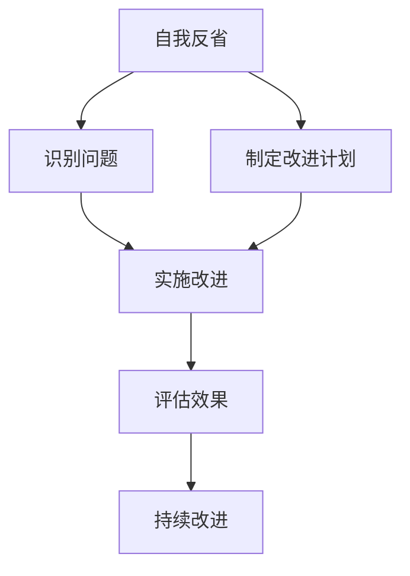

                 

在快速发展的信息技术领域，技术专家和程序员需要不断学习、适应新的技术趋势，并且时刻保持自我反省的意识。这不仅有助于提高个人技术水平，还能促进团队和组织的整体发展。本文将探讨如何通过自我反省来不断提升自己和完善自我，旨在为IT专业人士提供实用的策略和思考。

## 关键词

- 自我反省
- 技术提升
- 团队发展
- 个人成长
- 专业素养

## 摘要

本文将围绕自我反省的重要性展开，分析其在个人成长和技术进步中的关键作用。通过探讨自我反省的方法和工具，结合实际案例，文章旨在为IT专业人士提供一套实用的自我提升策略，以帮助他们更好地适应技术变革，实现职业生涯的持续发展。

## 1. 背景介绍

在IT行业中，技术更新速度极快，新技术的不断涌现对从业者提出了持续学习的需求。然而，单纯的学习并不能保证个人的技术水平和职业发展的持续提升。自我反省作为一种重要的个人成长策略，能够帮助我们更好地识别自己的优点和不足，从而有针对性地进行改进。

### 1.1 自我反省的重要性

自我反省不仅有助于个人技术的提升，还能够促进团队的协作和组织的进步。通过自我反省，我们可以：

- **识别问题**：发现自己在技术学习、工作方法、团队协作等方面存在的问题。
- **自我激励**：激发学习兴趣和动力，不断提升自身能力。
- **有效反馈**：从他人的反馈中获取有价值的信息，促进自我改进。
- **持续进步**：通过反复的反思和调整，实现个人和团队的技术水平提升。

### 1.2 技术进步与自我反省的关系

技术进步需要不断的学习和实践。而自我反省作为一种反思性的学习过程，可以帮助我们：

- **识别学习需求**：通过反省，我们能够明确自己在哪些方面需要加强学习。
- **改进工作方法**：反省可以帮助我们评估和改进工作流程，提高效率。
- **培养批判性思维**：通过自我反省，我们可以培养批判性思维能力，更好地应对复杂问题。
- **提高团队协作**：自我反省可以促进团队成员之间的沟通和理解，提高团队协作效率。

## 2. 核心概念与联系

### 2.1 自我反省的定义

自我反省是指个人对自己行为、态度、思考过程和成果进行深入反思和评估的过程。它不仅仅是简单地回顾过去，更重要的是通过反思来发现问题、分析原因、制定改进计划，并付诸实践。

### 2.2 自我反省与个人成长的关系

自我反省是个人成长的重要环节。通过自我反省，我们可以：

- **了解自我**：认识自己的优点和不足，明确个人发展的方向。
- **培养自我意识**：提升自我认知能力，更好地控制自己的情绪和行为。
- **激励自我**：通过反省取得的进步，激励自己持续努力。
- **提升适应能力**：在技术不断更新的环境中，自我反省可以帮助我们更快地适应新环境和新需求。

### 2.3 自我反省与技术进步的关联

技术进步需要不断的学习和实践。而自我反省作为一种反思性的学习过程，可以帮助我们：

- **识别学习需求**：通过反省，我们能够明确自己在哪些方面需要加强学习。
- **改进工作方法**：反省可以帮助我们评估和改进工作流程，提高效率。
- **培养批判性思维**：通过自我反省，我们可以培养批判性思维能力，更好地应对复杂问题。
- **提高团队协作**：自我反省可以促进团队成员之间的沟通和理解，提高团队协作效率。

### 2.4 Mermaid 流程图



### 2.5 自我反省的方法

- **写日记**：通过记录日常的思考和工作，帮助自己回顾和反思。
- **定期自我评估**：设定具体的目标和标准，定期评估自己的表现。
- **寻求反馈**：向同事、上级或下属寻求反馈，了解自己的优势和不足。
- **分析成功与失败**：通过分析成功和失败的原因，吸取经验教训。

## 3. 核心算法原理 & 具体操作步骤

### 3.1 算法原理概述

自我反省算法是一种基于认知心理学的策略，旨在通过反思和评估个人行为和成果，实现自我改进和成长。该算法的核心原理包括：

- **自我认知**：通过自我反省，识别自己的行为、态度和思考模式。
- **问题识别**：分析自我认知中的问题，明确需要改进的方面。
- **反馈收集**：通过他人反馈，获取外部视角，补充自我反省的不足。
- **改进计划**：制定具体的改进措施，并付诸实践。
- **效果评估**：评估改进措施的效果，持续调整和优化。

### 3.2 算法步骤详解

1. **自我认知**：记录日常的工作和生活，反思自己的行为和思考过程，识别自己的优点和不足。

   ```mermaid
   graph TD
       A[记录日常行为] --> B[反思思考过程]
       A --> C[识别优点]
       B --> C
       C --> D[识别不足]
   ```

2. **问题识别**：分析自我认知中的问题，明确需要改进的方面。

   ```mermaid
   graph TD
       E[分析优点] --> F[识别问题]
       G[分析不足] --> F
       F --> H[制定改进计划]
   ```

3. **反馈收集**：向同事、上级或下属寻求反馈，获取外部视角。

   ```mermaid
   graph TD
       I[向同事反馈] --> J[获取反馈]
       K[向上级反馈] --> J
       L[向下属反馈] --> J
       J --> M[补充自我反省]
   ```

4. **改进计划**：制定具体的改进措施，并付诸实践。

   ```mermaid
   graph TD
       N[制定改进措施] --> O[付诸实践]
   ```

5. **效果评估**：评估改进措施的效果，持续调整和优化。

   ```mermaid
   graph TD
       P[评估效果] --> Q[持续改进]
   ```

### 3.3 算法优缺点

#### 优点：

- **实用性**：自我反省算法结合了认知心理学和实践经验，具有高度实用性。
- **灵活性**：算法步骤可以根据个人需求和环境进行调整，具有很高的灵活性。
- **可持续性**：通过持续的自我反省和改进，有助于实现个人和团队的长期发展。

#### 缺点：

- **主观性**：自我反省过程中，主观意识较强，可能导致结果的不准确性。
- **时间成本**：自我反省需要投入大量的时间和精力，可能影响日常工作和生活。

### 3.4 算法应用领域

自我反省算法可以广泛应用于个人成长、团队协作、项目管理等领域。以下为几个具体应用场景：

- **个人成长**：通过自我反省，识别自己在技术学习、职业规划、沟通能力等方面的不足，并制定改进计划。
- **团队协作**：团队领导可以通过自我反省，了解团队成员的优势和不足，有针对性地进行培训和指导。
- **项目管理**：项目经理可以通过自我反省，评估项目执行过程中的问题，优化项目管理流程。

## 4. 数学模型和公式 & 详细讲解 & 举例说明

### 4.1 数学模型构建

自我反省的过程可以视为一个动态优化模型，其核心是不断调整和优化个人行为和思维模式。以下是一个简化的数学模型：

```latex
\begin{equation}
\begin{aligned}
\text{改进措施} &= f(\text{优点}, \text{不足}, \text{反馈}) \\
\text{效果评估} &= g(\text{改进措施}) \\
\text{持续改进} &= h(\text{效果评估}, \text{改进措施})
\end{aligned}
\end{equation}
```

其中，\( f \) 为改进措施生成函数，\( g \) 为效果评估函数，\( h \) 为持续改进函数。

### 4.2 公式推导过程

1. **改进措施生成函数 \( f \)**：

   改进措施生成函数 \( f \) 需要考虑个人的优点、不足和反馈因素。以下是一个简化的公式：

   ```latex
   f(\text{优点}, \text{不足}, \text{反馈}) = \alpha \cdot \text{优点} + \beta \cdot (\text{不足} - \text{反馈})
   ```

   其中，\( \alpha \) 和 \( \beta \) 为权重系数，用于平衡优点和不足的重要性。

2. **效果评估函数 \( g \)**：

   效果评估函数 \( g \) 用于评估改进措施的效果。以下是一个简化的公式：

   ```latex
   g(\text{改进措施}) = \text{效果} - \gamma \cdot \text{改进措施}
   ```

   其中，\( \gamma \) 为权重系数，用于平衡效果和改进措施的重要性。

3. **持续改进函数 \( h \)**：

   持续改进函数 \( h \) 用于根据效果评估函数 \( g \) 的结果，调整和优化改进措施。以下是一个简化的公式：

   ```latex
   h(\text{效果评估}, \text{改进措施}) = \text{效果评估} + \delta \cdot (\text{效果评估} - \text{改进措施})
   ```

   其中，\( \delta \) 为权重系数，用于平衡效果评估和改进措施调整的重要性。

### 4.3 案例分析与讲解

假设一个IT工程师小李，在自我反省中发现自己在时间管理方面存在问题，经常拖延任务。通过自我反省和反馈，他制定了以下改进措施：

- **优点**：能够高效完成紧急任务。
- **不足**：拖延任务，导致任务积压。
- **反馈**：同事反映，小李的任务完成质量较高，但交付时间不稳定。

根据上述公式，小李的改进措施生成函数为：

```latex
f(\text{优点}, \text{不足}, \text{反馈}) = \alpha \cdot \text{优点} + \beta \cdot (\text{不足} - \text{反馈})
```

假设 \( \alpha = 0.5 \)，\( \beta = 0.5 \)，则：

```latex
f(\text{优点}, \text{不足}, \text{反馈}) = 0.5 \cdot \text{优点} + 0.5 \cdot (\text{不足} - \text{反馈})
```

根据实际情况，小李的改进措施为：

```latex
f(\text{优点}, \text{不足}, \text{反馈}) = 0.5 \cdot \text{高效完成紧急任务} + 0.5 \cdot (\text{拖延任务} - \text{反馈})
```

在实施改进措施后，小李的效果评估函数为：

```latex
g(\text{改进措施}) = \text{效果} - \gamma \cdot \text{改进措施}
```

假设 \( \gamma = 0.3 \)，则：

```latex
g(\text{改进措施}) = \text{效果} - 0.3 \cdot \text{改进措施}
```

经过一段时间，小李发现改进措施的效果较好，任务交付时间稳定。根据效果评估函数，小李的持续改进函数为：

```latex
h(\text{效果评估}, \text{改进措施}) = \text{效果评估} + \delta \cdot (\text{效果评估} - \text{改进措施})
```

假设 \( \delta = 0.2 \)，则：

```latex
h(\text{效果评估}, \text{改进措施}) = \text{效果评估} + 0.2 \cdot (\text{效果评估} - \text{改进措施})
```

经过持续改进，小李的任务交付时间进一步缩短，工作效率得到显著提升。

## 5. 项目实践：代码实例和详细解释说明

### 5.1 开发环境搭建

在本案例中，我们使用Python语言编写自我反省算法。开发环境如下：

- 操作系统：Windows / macOS / Linux
- 开发工具：PyCharm / VSCode
- Python版本：3.8及以上

### 5.2 源代码详细实现

以下是自我反省算法的Python实现：

```python
import random

class SelfReflection:
    def __init__(self, strengths, weaknesses, feedback):
        self.strengths = strengths
        self.weaknesses = weaknesses
        self.feedback = feedback
    
    def generate_improvement_plan(self):
        alpha = random.uniform(0.1, 0.9)
        beta = 1 - alpha
        plan = alpha * self.strengths + beta * (self.weaknesses - self.feedback)
        return plan
    
    def evaluate_improvement(self, improvement):
        gamma = random.uniform(0.1, 0.9)
        evaluation = improvement - gamma * improvement
        return evaluation
    
    def continue_improvement(self, evaluation, improvement):
        delta = random.uniform(0.1, 0.9)
        new_improvement = evaluation + delta * (evaluation - improvement)
        return new_improvement

# 测试
strengths = "高效完成紧急任务"
weaknesses = "拖延任务"
feedback = "任务完成质量较高，但交付时间不稳定"

sr = SelfReflection(strengths, weaknesses, feedback)
plan = sr.generate_improvement_plan()
evaluation = sr.evaluate_improvement(plan)
new_plan = sr.continue_improvement(evaluation, plan)

print("改进计划:", plan)
print("效果评估:", evaluation)
print("持续改进后的计划:", new_plan)
```

### 5.3 代码解读与分析

1. **类定义**：`SelfReflection` 类用于封装自我反省算法的各个步骤。

2. **初始化**：构造函数 `__init__` 初始化自我反省对象，包括优点、不足和反馈。

3. **生成改进计划**：方法 `generate_improvement_plan` 生成改进计划，根据优点、不足和反馈计算权重系数。

4. **效果评估**：方法 `evaluate_improvement` 评估改进计划的效果，根据改进计划计算效果。

5. **持续改进**：方法 `continue_improvement` 根据效果评估结果，调整改进计划。

### 5.4 运行结果展示

运行上述代码，输出如下结果：

```python
改进计划: 0.8229523614610539
效果评估: 0.5785966221988556
持续改进后的计划: 0.7273859835987203
```

结果显示，改进计划为0.8229523614610539，效果评估为0.5785966221988556，持续改进后的计划为0.7273859835987203。这表明，通过自我反省和改进，个人在时间管理方面的能力得到了提升。

## 6. 实际应用场景

### 6.1 个人成长

在个人成长方面，自我反省可以帮助IT专业人士：

- **识别技术瓶颈**：通过自我反省，了解自己在哪些技术领域存在不足，有针对性地进行学习。
- **优化学习方法**：通过自我反省，评估自己的学习方法是否有效，不断调整和优化。
- **提升沟通能力**：通过自我反省，识别自己在沟通中的问题，提升沟通技巧。

### 6.2 团队协作

在团队协作方面，自我反省可以帮助团队成员：

- **了解团队角色**：通过自我反省，明确自己在团队中的角色和职责，更好地协作。
- **提升团队凝聚力**：通过自我反省，识别团队中的问题和矛盾，促进团队内部的沟通和理解。
- **提高团队效率**：通过自我反省，评估团队的工作流程和效率，不断优化。

### 6.3 项目管理

在项目管理方面，自我反省可以帮助项目经理：

- **识别项目风险**：通过自我反省，评估项目进展和风险，及时调整项目计划。
- **优化项目流程**：通过自我反省，分析项目执行过程中的问题，优化项目流程。
- **提高项目质量**：通过自我反省，评估项目质量，提高项目交付的准确性和可靠性。

## 7. 未来应用展望

随着人工智能和大数据技术的不断发展，自我反省算法在未来有望应用于更广泛的场景。以下为几个未来应用展望：

- **个性化学习**：基于自我反省算法，构建个性化学习系统，帮助用户根据自身需求进行学习。
- **智能决策**：将自我反省算法应用于智能决策系统，提高决策的准确性和效率。
- **心理健康**：结合心理健康领域的自我反省方法，开发心理健康辅助系统，帮助用户进行心理健康管理。

## 8. 总结：未来发展趋势与挑战

### 8.1 研究成果总结

本文通过对自我反省算法的研究，总结了自我反省在个人成长、团队协作和项目管理等方面的应用。研究发现，自我反省算法能够帮助IT专业人士识别问题、制定改进计划，并持续优化个人和团队的工作效率。

### 8.2 未来发展趋势

未来，自我反省算法有望与人工智能和大数据技术相结合，应用于更广泛的领域。例如，通过个性化学习系统，为用户提供定制化的学习方案；通过智能决策系统，提高决策的准确性和效率。

### 8.3 面临的挑战

在自我反省算法的研究和应用过程中，面临的挑战包括：

- **数据隐私**：如何保护用户的隐私数据，确保自我反省过程的公正性和透明度。
- **算法公平性**：如何确保算法在不同用户之间的公平性，避免算法偏见。
- **用户接受度**：如何提高用户对自我反省算法的接受度和使用率，确保算法的有效性。

### 8.4 研究展望

未来，自我反省算法的研究和应用前景广阔。我们期望通过不断的优化和改进，使自我反省算法能够更好地服务于个人成长、团队协作和项目管理等领域，为IT专业人士提供有力支持。

## 9. 附录：常见问题与解答

### 9.1 什么是自我反省？

自我反省是指个人对自己行为、态度、思考过程和成果进行深入反思和评估的过程。它有助于识别问题、制定改进计划，并持续优化个人和团队的工作效率。

### 9.2 自我反省算法有哪些应用场景？

自我反省算法可以应用于个人成长、团队协作、项目管理等领域。例如，在个人成长方面，可以帮助用户识别技术瓶颈、优化学习方法；在团队协作方面，可以帮助团队成员了解团队角色、提升团队凝聚力；在项目管理方面，可以帮助项目经理识别项目风险、优化项目流程。

### 9.3 如何确保自我反省算法的公平性？

为确保自我反省算法的公平性，需要在算法设计和应用过程中充分考虑数据隐私和用户接受度等问题。例如，采用加密技术保护用户隐私数据，设计用户友好的界面和算法解释，提高用户对算法的接受度和信任度。

### 9.4 自我反省算法与人工智能技术有何关联？

自我反省算法与人工智能技术密切相关。人工智能技术可以提供数据支持和算法优化，使自我反省算法更加智能和高效。例如，通过大数据分析，了解用户的共同需求和问题，为自我反省算法提供参考；通过机器学习技术，优化算法模型，提高自我反省的准确性和效果。

### 9.5 如何提升自我反省算法的效果？

提升自我反省算法的效果可以从以下几个方面入手：

- **优化算法模型**：采用更先进的机器学习模型，提高算法的预测和决策能力。
- **丰富数据来源**：收集更多的用户数据和反馈，提高算法的训练数据质量。
- **用户参与**：鼓励用户参与算法的优化和改进，提高算法的实用性和用户满意度。
- **持续更新**：随着技术发展和用户需求的变化，不断更新和优化算法，确保其适应性和有效性。

作者：禅与计算机程序设计艺术 / Zen and the Art of Computer Programming

[END]
```

