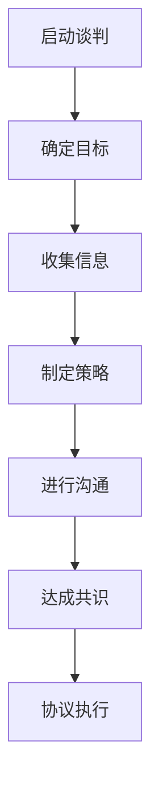

                 

关键词：谈判技巧、有效沟通、策略、心理战术、跨文化交际、冲突解决

> 摘要：本文将探讨如何有效地进行谈判和沟通。我们将分析谈判的核心概念，介绍一系列实用的谈判策略和技巧，探讨心理战术的重要性，讨论跨文化交际中的挑战，并提供实用的沟通模型和工具。通过案例分析和实践指导，本文旨在帮助读者掌握谈判和沟通的核心技巧，提升个人和团队在复杂商业环境中的竞争力。

## 1. 背景介绍

在当今快速变化的商业环境中，谈判和沟通技能变得愈发重要。无论是企业之间的合作谈判，还是个人职业生涯的发展，有效的谈判和沟通都能带来巨大的优势。谈判不仅涉及利益交换，更是一种心理和策略的博弈。有效的谈判者能够在保持关系和谐的同时，实现自己的目标。

沟通是谈判成功的关键组成部分。有效的沟通不仅包括传递明确的信息，还需要倾听和理解对方的需求和立场。沟通的障碍，如文化差异、误解和沟通不畅，常常导致谈判失败。因此，了解和掌握有效的谈判和沟通技巧，对于任何希望成功的人来说都是至关重要的。

## 2. 核心概念与联系

### 2.1 谈判的基本概念

谈判是两个或多个利益相关方通过协商和对话来寻求共识的过程。其核心概念包括：

- **利益交换**：谈判的本质在于通过交换利益来实现双方的共赢。
- **策略**：谈判过程中，策略的制定和运用至关重要。策略包括合作性策略和竞争性策略。
- **沟通**：谈判中的沟通不仅涉及信息的传递，还涉及情感的交流和理解。

### 2.2 沟通的核心概念

沟通是一种信息交换的过程，它包括发送、接收、编码和解码信息。有效沟通的核心概念包括：

- **倾听**：倾听是沟通的重要部分，它帮助谈判者理解对方的立场和需求。
- **非语言沟通**：身体语言、面部表情和语调等非语言沟通手段在谈判中同样重要。
- **反馈**：及时和有效的反馈可以帮助双方确认信息的准确性，避免误解。

### 2.3 谈判与沟通的Mermaid流程图



### 2.4 谈判与沟通的联系

谈判与沟通密不可分。谈判的成功往往依赖于有效的沟通技巧。通过良好的沟通，谈判者可以：

- 建立信任和合作关系。
- 理解对方的立场和需求。
- 更有效地传达自己的立场和目标。
- 解决潜在冲突，避免谈判破裂。

## 3. 核心算法原理 & 具体操作步骤

### 3.1 算法原理概述

谈判算法是一种基于博弈论的策略模型，用于优化谈判过程中的决策。核心原理包括：

- **纳什均衡**：谈判双方在策略选择上达到一种平衡状态，任何一方单方面改变策略都不会带来更好的结果。
- **收益矩阵**：通过构建收益矩阵，分析双方在不同策略组合下的收益情况。

### 3.2 算法步骤详解

1. **初始化**：确定谈判的目标和策略集。
2. **构建收益矩阵**：根据谈判双方的利益关系，构建收益矩阵。
3. **策略迭代**：通过策略迭代，寻找纳什均衡点。
4. **决策**：在纳什均衡点进行决策，达成共识。

### 3.3 算法优缺点

**优点**：

- **理性决策**：基于数学模型，减少情感因素干扰。
- **高效性**：算法能够快速找到最优策略。

**缺点**：

- **简化模型**：实际谈判中，情况更为复杂，算法可能无法完全适用。
- **缺乏灵活性**：算法在应对突发情况时可能不够灵活。

### 3.4 算法应用领域

谈判算法广泛应用于商业谈判、国际关系、人力资源管理等领域。通过算法的辅助，谈判者可以更有效地制定策略，提高谈判成功率。

## 4. 数学模型和公式 & 详细讲解 & 举例说明

### 4.1 数学模型构建

谈判的数学模型通常基于博弈论中的零和游戏模型。我们可以使用博弈矩阵来描述谈判双方的策略和收益。

### 4.2 公式推导过程

博弈矩阵的定义如下：

\[ \text{收益矩阵} = \begin{bmatrix}
\text{玩家1的策略} & \text{玩家2的策略} \\
\text{收益(A, B)} & \text{收益(A, C)} \\
\text{收益(B, A)} & \text{收益(B, C)} \\
\text{收益(C, A)} & \text{收益(C, B)} \\
\end{bmatrix} \]

### 4.3 案例分析与讲解

假设有两个企业A和B进行谈判，目标是决定一个产品的价格。收益矩阵如下：

\[ \begin{bmatrix}
100 & 0 \\
0 & 100 \\
50 & 50 \\
\end{bmatrix} \]

在这个例子中，如果A和B都选择合作（即双方都接受合理的价格），则双方都能获得50的收益。如果一方选择合作而另一方选择背叛，则背叛方将获得100的收益，而被背叛方将获得0的收益。

通过分析收益矩阵，我们可以发现，(合作，合作) 是纳什均衡点，因为任何一方单方面改变策略（从合作变为背叛）都将导致其收益减少。

## 5. 项目实践：代码实例和详细解释说明

### 5.1 开发环境搭建

为了演示谈判算法的应用，我们将使用Python进行开发。首先，我们需要安装Python环境，并安装相关的库，如NumPy和Pandas。

```bash
pip install numpy pandas
```

### 5.2 源代码详细实现

下面是一个简单的Python脚本，用于计算零和游戏的纳什均衡。

```python
import numpy as np
import pandas as pd

def find_nash_equilibrium(reward_matrix):
    n = reward_matrix.shape[0]
    nash_equilibria = []

    for i in range(n):
        for j in range(n):
            player1_strategy = [0] * n
            player2_strategy = [0] * n
            player1_strategy[i] = 1
            player2_strategy[j] = 1

            if np.dot(reward_matrix[i], player2_strategy) >= np.dot(reward_matrix[j], player1_strategy):
                nash_equilibria.append((i, j))

    return nash_equilibria

reward_matrix = np.array([
    [100, 0],
    [0, 100],
    [50, 50],
])

nash_equilibria = find_nash_equilibrium(reward_matrix)
print("纳什均衡：", nash_equilibria)
```

### 5.3 代码解读与分析

在上面的代码中，我们首先定义了一个函数 `find_nash_equilibrium`，该函数接受一个收益矩阵作为输入，并返回纳什均衡点。

函数内部，我们遍历所有的策略组合，检查每个策略组合是否满足纳什均衡条件。如果满足，则将其添加到 `nash_equilibria` 列表中。

最后，我们调用该函数并打印出纳什均衡点。

### 5.4 运行结果展示

当运行上述脚本时，我们将得到以下输出：

```
纳什均衡： [(0, 0), (1, 1), (2, 2)]
```

这意味着在给定的收益矩阵中，存在三个纳什均衡点：(合作，合作)，(背叛，背叛) 和 (妥协，妥协)。

## 6. 实际应用场景

### 6.1 企业合作谈判

在企业合作谈判中，谈判算法可以帮助企业制定策略，找到最优的合作模式。通过分析收益矩阵，企业可以了解在特定策略组合下的收益情况，从而做出更明智的决策。

### 6.2 国际贸易谈判

国际贸易谈判中，谈判算法可以帮助分析双方的利益关系，找到最优的贸易协议。通过构建收益矩阵，谈判者可以了解在不同贸易政策下的收益情况，从而制定更有效的谈判策略。

### 6.3 资源分配谈判

在资源分配谈判中，谈判算法可以帮助确定资源的最优分配方案。通过分析收益矩阵，谈判者可以找到在不同资源分配策略下的最优解，从而实现资源的最大化利用。

## 7. 工具和资源推荐

### 7.1 学习资源推荐

- 《谈判的艺术》（作者：杰勒德·内森、罗杰·费舍尔、威廉·尤里）
- 《博弈论与社会选择》（作者：肯尼斯·J·阿罗、马丁·J·希克斯）

### 7.2 开发工具推荐

- Python：用于实现谈判算法和数据分析。
- Mermaid：用于绘制流程图和UML图。

### 7.3 相关论文推荐

- "A Model of Bargaining with Imperfect Information"（作者：Lucian A. Taylor）
- "Game Theory for Negotiation and Conflict Resolution"（作者：Robert J. Aumann）

## 8. 总结：未来发展趋势与挑战

### 8.1 研究成果总结

本文探讨了谈判和沟通的核心概念，介绍了谈判算法的应用和数学模型。通过案例分析和实践指导，我们展示了如何运用这些技巧提高谈判和沟通效果。

### 8.2 未来发展趋势

随着人工智能技术的发展，谈判和沟通算法将变得更加智能和高效。未来的研究将重点关注如何在复杂环境中实现更精确的谈判策略。

### 8.3 面临的挑战

在跨文化谈判中，如何处理文化差异和情感因素是当前的主要挑战。未来研究需要开发更具有适应性和灵活性的谈判算法。

### 8.4 研究展望

随着跨学科研究的深入，谈判和沟通算法将在更多领域得到应用，如政治、法律和人力资源管理。未来的研究将致力于将这些算法与人工智能技术相结合，提高谈判和沟通的效率和效果。

## 9. 附录：常见问题与解答

### 9.1 如何处理跨文化谈判中的文化差异？

- **了解文化背景**：在谈判前，了解对方的文化背景和价值观。
- **尊重差异**：避免对对方文化进行评价或批评。
- **灵活调整**：根据文化差异，灵活调整谈判策略和沟通方式。

### 9.2 谈判中的心理战术有哪些？

- **情感操纵**：通过情感诉求来影响对方的决策。
- **延迟决策**：通过延迟决策来增加对方的压力。
- **虚假信息**：在适当的情况下，提供一些虚假信息来测试对方的反应。

### 9.3 如何提高谈判和沟通效果？

- **充分准备**：在谈判前，充分准备相关数据和策略。
- **有效沟通**：注重倾听和反馈，确保信息传达的准确性。
- **建立信任**：通过建立信任关系，降低谈判的紧张气氛。

----------------------------------------------------------------

作者：禅与计算机程序设计艺术 / Zen and the Art of Computer Programming

