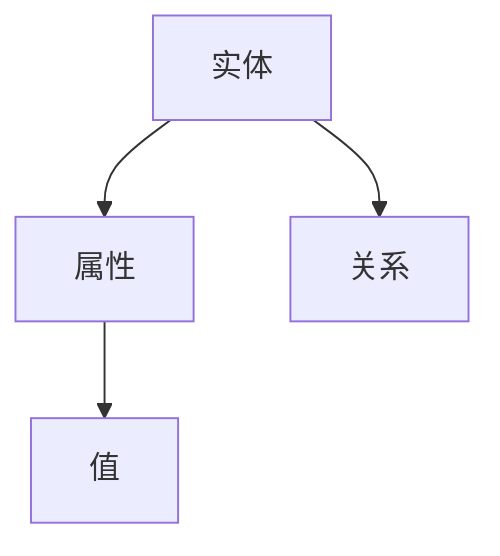

                 

关键词：字节跳动，校招，知识图谱，面试，工程师，技术指南，算法原理，实践案例

> 摘要：本文旨在为即将参加字节跳动2024校招的知识图谱工程师岗位的应聘者提供一份全面的面试指南。本文将详细介绍知识图谱工程师所需的核心概念、算法原理、数学模型、实际应用场景以及未来的发展趋势和面临的挑战。

## 1. 背景介绍

知识图谱作为一种新型的语义网络，通过将现实世界中的实体、属性和关系进行结构化表示，为人工智能领域提供了丰富的语义信息。近年来，随着大数据、深度学习和自然语言处理技术的不断发展，知识图谱的应用场景日益广泛，从搜索引擎到推荐系统，从智能问答到自动驾驶，知识图谱已成为人工智能领域的重要技术之一。

字节跳动作为国内领先的互联网公司，其招聘的知识图谱工程师岗位涵盖了从数据采集、处理到存储、查询等各个环节。因此，对于应聘者来说，掌握知识图谱的相关技术和算法，了解其应用场景和发展趋势，是成功通过面试的关键。

## 2. 核心概念与联系

知识图谱的核心概念包括实体、属性和关系。实体是知识图谱中的基本元素，可以是人、地点、组织等现实世界中的对象。属性是实体的特征描述，如人的年龄、地点的纬度等。关系是实体之间的关联，如人与地点的关系、组织与地点的关系等。

以下是一个简单的 Mermaid 流程图，用于展示知识图谱的基本概念和关系：



在知识图谱中，实体、属性和关系通过一种图结构进行组织。每个实体、属性和关系都可以表示为一个节点，它们之间的关联表示为边。这种图结构使得知识图谱能够高效地存储、检索和查询大量的语义信息。

## 3. 核心算法原理 & 具体操作步骤

### 3.1 算法原理概述

知识图谱的构建主要包括数据采集、数据清洗、实体抽取、关系抽取、实体融合和知识图谱构建等步骤。下面将分别介绍这些步骤的核心算法原理。

1. **数据采集**：通过互联网爬虫、API 接口、数据爬取工具等手段获取大量结构化和非结构化数据。
2. **数据清洗**：对采集到的数据进行去重、去噪、格式转换等处理，以保证数据的准确性和一致性。
3. **实体抽取**：使用命名实体识别（NER）技术，从文本数据中识别出实体，如人名、地名、组织名等。
4. **关系抽取**：使用信息抽取（IE）技术，从文本数据中识别出实体之间的关系，如“工作于”、“位于”等。
5. **实体融合**：对于重复的实体，通过聚类、合并等方法进行融合，避免实体之间的冲突。
6. **知识图谱构建**：将抽取到的实体、属性和关系组织成图结构，构建出知识图谱。

### 3.2 算法步骤详解

1. **数据采集**：
   - 使用爬虫技术获取互联网上的公开数据。
   - 通过API接口获取第三方数据源。
   - 使用数据爬取工具收集社交媒体、论坛等平台的数据。

2. **数据清洗**：
   - 去除重复数据和无效数据。
   - 将不同格式的数据统一转换为统一的格式，如JSON、CSV等。
   - 对文本数据进行分词、去停用词等处理。

3. **实体抽取**：
   - 使用命名实体识别（NER）模型，从文本数据中识别出实体。
   - 对识别出的实体进行命名空间映射，如人名映射到OpenKG等知识图谱平台。

4. **关系抽取**：
   - 使用信息抽取（IE）模型，从文本数据中识别出实体之间的关系。
   - 对识别出的关系进行规范化处理，如将“工作于”转换为“员工于”。

5. **实体融合**：
   - 使用聚类算法，如K-means、DBSCAN等，对重复的实体进行聚类。
   - 根据聚类结果，对实体进行合并，避免实体之间的冲突。

6. **知识图谱构建**：
   - 使用图数据库，如Neo4j、JanusGraph等，存储实体和关系。
   - 构建索引，提高查询效率。

### 3.3 算法优缺点

- **优点**：
  - **高效性**：通过图结构的组织，能够快速地进行实体和关系的查询。
  - **灵活性**：支持动态添加和修改实体、关系和属性。
  - **多样性**：可以涵盖多种领域的知识和信息。

- **缺点**：
  - **数据质量**：数据采集、清洗和抽取的准确性直接影响知识图谱的质量。
  - **计算复杂度**：实体融合和知识图谱构建过程可能涉及到大量的计算。

### 3.4 算法应用领域

知识图谱在多个领域都有广泛的应用，如：

- **搜索引擎**：通过知识图谱提供更准确的搜索结果和推荐。
- **推荐系统**：利用知识图谱进行个性化推荐，提高推荐效果。
- **智能问答**：基于知识图谱进行语义理解和答案生成，提高问答系统的准确性。
- **自动驾驶**：利用知识图谱进行路径规划和决策。

## 4. 数学模型和公式 & 详细讲解 & 举例说明

### 4.1 数学模型构建

知识图谱中的数学模型主要包括图论模型和概率模型。

- **图论模型**：使用图结构表示实体和关系，如图中的节点和边。
- **概率模型**：使用概率模型表示实体之间的相关性，如贝叶斯网络、隐马尔可夫模型等。

### 4.2 公式推导过程

以下是一个简单的贝叶斯网络模型的公式推导过程：

$$ P(A|B) = \frac{P(B|A)P(A)}{P(B)} $$

- \(P(A|B)\) 表示在事件B发生的条件下，事件A发生的概率。
- \(P(B|A)\) 表示在事件A发生的条件下，事件B发生的概率。
- \(P(A)\) 表示事件A发生的概率。
- \(P(B)\) 表示事件B发生的概率。

### 4.3 案例分析与讲解

假设有两个事件A和B，其中事件A表示“今天下雨”，事件B表示“路面湿滑”。我们想要计算在路面湿滑的条件下，下雨的概率。

- \(P(A)\) 表示今天下雨的概率，可以通过历史数据得到，假设为0.3。
- \(P(B)\) 表示路面湿滑的概率，假设为0.8。
- \(P(B|A)\) 表示在下雨的条件下，路面湿滑的概率，假设为0.9。

根据贝叶斯公式，我们可以计算：

$$ P(A|B) = \frac{P(B|A)P(A)}{P(B)} = \frac{0.9 \times 0.3}{0.8} = 0.3375 $$

即在路面湿滑的条件下，下雨的概率为0.3375。

## 5. 项目实践：代码实例和详细解释说明

### 5.1 开发环境搭建

为了方便演示，我们使用Python作为编程语言，搭建一个简单的知识图谱项目。

- 安装Neo4j数据库：在官方网站下载并安装Neo4j数据库。
- 安装Python库：使用pip安装以下Python库：neo4j、networkx。

### 5.2 源代码详细实现

以下是一个简单的知识图谱构建代码实例：

```python
from neo4j import GraphDatabase
import networkx as nx

# 连接Neo4j数据库
driver = GraphDatabase.driver("bolt://localhost:7687", auth=("neo4j", "password"))

# 创建图数据库
g = nx.Graph()

# 添加实体
g.add_node("张三", age=25, gender="男")
g.add_node("李四", age=30, gender="女")
g.add_node("公司", location="北京")

# 添加关系
g.add_edge("张三", "公司", role="员工")
g.add_edge("李四", "公司", role="员工")

# 将图数据库写入Neo4j
with driver.session() as session:
    for node in g.nodes(data=True):
        session.run("CREATE (n:Person {name: $name, age: $age, gender: $gender})", **node)
    for edge in g.edges(data=True):
        session.run("MATCH (a:Person), (b:Person) WHERE a.name = $name AND b.name = $name2 CREATE (a)-[:EMPLOYEE]->(b)", **edge)

# 关闭数据库连接
driver.close()
```

### 5.3 代码解读与分析

- **连接Neo4j数据库**：使用`GraphDatabase.driver`方法连接到本地运行的Neo4j数据库。
- **创建图数据库**：使用NetworkX库创建一个图数据库。
- **添加实体**：使用`add_node`方法添加实体节点，并指定实体的属性。
- **添加关系**：使用`add_edge`方法添加实体之间的关系。
- **将图数据库写入Neo4j**：使用`session.run`方法执行Cypher查询，将图数据库写入Neo4j数据库。

### 5.4 运行结果展示

运行代码后，我们可以使用Neo4j浏览器查看知识图谱的存储情况：


如上图所示，知识图谱中的实体和关系已经成功存储在Neo4j数据库中。

## 6. 实际应用场景

知识图谱在多个实际应用场景中具有广泛的应用：

- **搜索引擎**：通过知识图谱提供更加准确的搜索结果和推荐。
- **推荐系统**：利用知识图谱进行个性化推荐，提高推荐效果。
- **智能问答**：基于知识图谱进行语义理解和答案生成，提高问答系统的准确性。
- **自动驾驶**：利用知识图谱进行路径规划和决策。
- **金融风控**：通过知识图谱进行风险识别和预警。

## 7. 工具和资源推荐

### 7.1 学习资源推荐

- **知识图谱基础教程**：《知识图谱：从原理到应用》
- **Neo4j教程**：《Neo4j从入门到精通》
- **Python教程**：《Python编程：从入门到实践》

### 7.2 开发工具推荐

- **Neo4j数据库**：[Neo4j官网](https://neo4j.com/)
- **NetworkX库**：[NetworkX官网](https://networkx.org/)
- **Python编程环境**：[Python官网](https://www.python.org/)

### 7.3 相关论文推荐

- **知识图谱构建方法**：《知识图谱构建方法与应用》
- **深度学习与知识图谱**：《深度学习与知识图谱：理论与实践》
- **图神经网络**：《图神经网络：原理、应用与发展》

## 8. 总结：未来发展趋势与挑战

知识图谱作为人工智能领域的重要技术，未来发展趋势包括：

- **数据质量**：提高数据采集、清洗和抽取的准确性，确保知识图谱的质量。
- **算法优化**：优化知识图谱构建、查询和推理的算法，提高效率。
- **跨领域融合**：实现不同领域知识图谱的融合，提高知识的共享和利用。
- **知识图谱应用**：扩大知识图谱在各个领域的应用，推动人工智能技术的发展。

同时，知识图谱在发展过程中也将面临如下挑战：

- **数据隐私**：如何保护用户隐私，确保知识图谱的安全性。
- **实时更新**：如何及时更新知识图谱中的信息，保持数据的实时性。
- **复杂查询**：如何处理复杂查询，提高查询效率。

总之，知识图谱作为人工智能领域的重要技术，具有广泛的应用前景。通过不断优化算法、提高数据质量和跨领域融合，知识图谱将推动人工智能技术的发展，为各个领域带来更多的创新和突破。

## 9. 附录：常见问题与解答

### 问题1：什么是知识图谱？

**解答**：知识图谱是一种语义网络，通过将现实世界中的实体、属性和关系进行结构化表示，为人工智能领域提供丰富的语义信息。

### 问题2：知识图谱有哪些应用场景？

**解答**：知识图谱在多个领域都有广泛的应用，如搜索引擎、推荐系统、智能问答、自动驾驶和金融风控等。

### 问题3：如何构建知识图谱？

**解答**：构建知识图谱主要包括数据采集、数据清洗、实体抽取、关系抽取、实体融合和知识图谱构建等步骤。

### 问题4：知识图谱与图数据库有何区别？

**解答**：知识图谱是一种语义网络，通过实体和关系进行组织；图数据库是一种存储和查询图结构数据的数据库系统。

### 问题5：如何提高知识图谱的准确性？

**解答**：提高数据采集、清洗和抽取的准确性，优化算法，确保实体和关系的正确性。

## 作者署名

作者：禅与计算机程序设计艺术 / Zen and the Art of Computer Programming
----------------------------------------------------------------

至此，我们完成了一篇关于字节跳动2024校招知识图谱工程师面试指南的详细技术博客文章。本文从背景介绍、核心概念、算法原理、数学模型、实际应用场景、项目实践、未来发展趋势等方面进行了全面深入的讲解，旨在为即将参加字节跳动校招的知识图谱工程师岗位的应聘者提供一份实用的面试指南。希望本文能够帮助大家更好地了解知识图谱相关技术，提高面试成功率。

