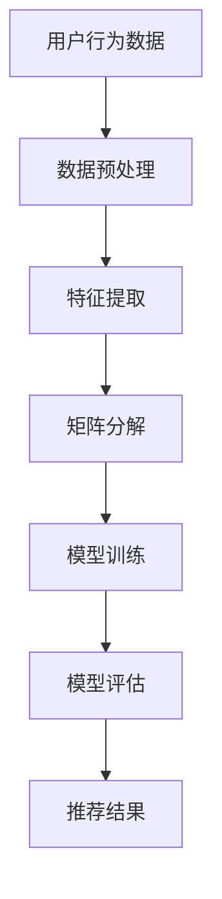

                 

关键词：字节跳动、校招、推荐系统、算法工程师、面试指南、核心技术、实践案例

> 摘要：本文旨在为有意加入字节跳动2024校招推荐系统算法工程师岗位的应聘者提供一份详细的面试指南，涵盖推荐系统的核心概念、算法原理、数学模型、项目实践以及未来发展趋势。通过本文，读者将能够更好地理解推荐系统的构建与优化方法，并具备应对校招面试的能力。

## 1. 背景介绍

随着互联网的快速发展，个性化推荐系统已经成为各大互联网公司提高用户粘性、提升用户体验的重要手段。字节跳动作为国内领先的互联网科技公司，其推荐系统在短视频、新闻资讯、购物等领域有着广泛的应用。为了持续优化推荐算法，提升用户体验，字节跳动每年都会在校园招聘中寻找优秀的推荐系统算法工程师。

本文将围绕推荐系统的核心概念、算法原理、数学模型、项目实践等方面进行深入探讨，帮助即将参加字节跳动2024校招的算法工程师岗位应聘者更好地准备面试。

## 2. 核心概念与联系

推荐系统是利用用户历史行为数据、内容特征和算法模型，向用户推荐其可能感兴趣的内容或商品的一种信息过滤技术。其核心概念包括：

### 2.1 协同过滤
协同过滤是一种基于用户历史行为数据来预测用户兴趣的方法。它分为两种类型：

- **用户基于的协同过滤（User-based Collaborative Filtering）**：通过计算用户之间的相似度，找出相似的用户，并推荐他们喜欢的商品或内容。
- **物品基于的协同过滤（Item-based Collaborative Filtering）**：通过计算物品之间的相似度，找出相似的商品或内容，并推荐给用户。

### 2.2 内容推荐
内容推荐是一种基于内容特征进行信息过滤的方法。通过提取用户和物品的特征，计算它们之间的相似度，实现个性化推荐。

### 2.3 混合推荐
混合推荐系统结合了协同过滤和内容推荐的优势，通过融合用户历史行为数据和物品特征，实现更准确的推荐效果。

### 2.4 机器学习模型
推荐系统中常用的机器学习模型包括：

- **矩阵分解（Matrix Factorization）**：通过将用户-物品评分矩阵分解为低维用户特征矩阵和物品特征矩阵，实现推荐。
- **深度学习模型（Deep Learning Models）**：如卷积神经网络（CNN）和循环神经网络（RNN），用于提取复杂的用户和物品特征，实现高效推荐。

### 2.5 评估指标
推荐系统的评估指标主要包括：

- **准确率（Precision）**：推荐的物品中有多少是用户感兴趣的。
- **召回率（Recall）**：用户感兴趣的物品中有多少被推荐。
- **F1 值（F1 Score）**：准确率和召回率的加权平均。

### 2.6 Mermaid 流程图



## 3. 核心算法原理 & 具体操作步骤

### 3.1 算法原理概述

推荐系统的核心算法包括协同过滤、内容推荐和混合推荐。以下是各个算法的原理概述：

### 3.2 算法步骤详解

#### 3.2.1 协同过滤

1. 数据预处理：将用户行为数据（如评分、点击、浏览等）进行清洗和预处理，包括去重、缺失值填充等操作。
2. 特征提取：提取用户和物品的特征，如用户年龄、性别、兴趣标签，物品的类别、标签、内容等。
3. 计算相似度：计算用户之间的相似度（如余弦相似度、皮尔逊相似度）或物品之间的相似度。
4. 推荐列表生成：根据相似度计算结果，生成用户或物品的推荐列表。

#### 3.2.2 内容推荐

1. 数据预处理：与协同过滤相同，对用户和物品的特征进行预处理。
2. 特征提取：提取用户和物品的特征向量。
3. 相似度计算：计算用户和物品之间的相似度，如余弦相似度、欧氏距离等。
4. 推荐列表生成：根据相似度计算结果，生成用户或物品的推荐列表。

#### 3.2.3 混合推荐

1. 数据预处理：对用户和物品的特征进行预处理。
2. 特征提取：提取用户和物品的特征向量。
3. 相似度计算：计算用户之间的相似度、物品之间的相似度，以及用户和物品之间的相似度。
4. 权重计算：为各个相似度分配权重，如用户-物品相似度占比70%，物品-物品相似度占比30%。
5. 推荐列表生成：根据权重计算结果，生成用户或物品的推荐列表。

### 3.3 算法优缺点

#### 协同过滤

**优点**：

- **简单易实现**：只需计算用户和物品之间的相似度，即可生成推荐列表。
- **适用于稀疏数据**：用户行为数据往往存在大量缺失值，协同过滤可以有效应对这种情况。

**缺点**：

- **无法处理冷启动问题**：新用户或新物品由于缺乏历史行为数据，难以进行推荐。
- **无法充分利用物品特征**：仅依赖于用户行为数据进行推荐，忽略了物品本身的特征。

#### 内容推荐

**优点**：

- **充分利用物品特征**：基于物品的标签、内容等特征进行推荐，提高推荐效果。
- **适用冷启动问题**：新用户或新物品可以通过内容特征进行推荐。

**缺点**：

- **计算复杂度高**：需要计算用户和物品之间的相似度，计算量大。
- **对特征提取要求高**：需要提取出准确且有效的特征向量，否则推荐效果会受到影响。

#### 混合推荐

**优点**：

- **综合协同过滤和内容推荐的优势**：既能充分利用用户行为数据，又能利用物品特征，提高推荐效果。
- **缓解冷启动问题**：通过融合用户和物品特征，实现对新用户和新物品的推荐。

**缺点**：

- **参数调优复杂**：需要为协同过滤和内容推荐分配合适的权重，参数调优难度较大。

### 3.4 算法应用领域

推荐系统在多个领域有着广泛的应用，包括：

- **电子商务**：为用户提供个性化的商品推荐，提高销售转化率。
- **社交媒体**：为用户推荐感兴趣的内容或用户，提高用户活跃度。
- **在线视频**：为用户提供个性化的视频推荐，提高用户观看时长。
- **新闻资讯**：为用户推荐感兴趣的新闻文章，提高新闻曝光量。

## 4. 数学模型和公式

推荐系统的核心算法通常基于数学模型进行优化，以下介绍常用的数学模型和公式。

### 4.1 数学模型构建

推荐系统的数学模型主要包括用户和物品的特征向量表示、相似度计算和推荐列表生成。

#### 4.1.1 用户和物品特征向量表示

- **用户特征向量**：表示用户的属性、兴趣等特征，通常使用一个高维向量表示。
- **物品特征向量**：表示物品的属性、类别等特征，同样使用一个高维向量表示。

#### 4.1.2 相似度计算

- **余弦相似度**：计算用户或物品之间的夹角余弦值，表示它们之间的相似度。公式如下：

  $$
  \cos{\theta} = \frac{\sum_{i=1}^{n}{u_i \cdot v_i}}{\sqrt{\sum_{i=1}^{n}{u_i^2} \cdot \sqrt{\sum_{i=1}^{n}{v_i^2}}}
  $$

- **欧氏距离**：计算用户或物品之间的欧氏距离，表示它们之间的相似度。公式如下：

  $$
  d(u, v) = \sqrt{\sum_{i=1}^{n}{(u_i - v_i)^2}}
  $$

#### 4.1.3 推荐列表生成

- **基于相似度的推荐**：根据用户或物品之间的相似度，生成推荐列表。公式如下：

  $$
  R_u = \sum_{v \in V}{s(u, v) \cdot v}
  $$

  其中，$R_u$ 为用户 $u$ 的推荐列表，$s(u, v)$ 为用户 $u$ 和物品 $v$ 之间的相似度，$V$ 为所有物品的集合。

### 4.2 公式推导过程

以矩阵分解为例，介绍推荐系统的数学模型推导过程。

#### 4.2.1 矩阵分解

矩阵分解是一种将高维用户-物品评分矩阵分解为两个低维矩阵的方法。假设用户-物品评分矩阵为 $R$，分解为用户特征矩阵 $U$ 和物品特征矩阵 $V$，即：

$$
R = UV^T
$$

#### 4.2.2 用户特征矩阵和物品特征矩阵

用户特征矩阵 $U$ 和物品特征矩阵 $V$ 分别表示用户和物品的低维特征向量。为了简化计算，通常将它们表示为：

$$
U = [u_1, u_2, ..., u_n]
$$

$$
V = [v_1, v_2, ..., v_m]
$$

其中，$u_i$ 和 $v_j$ 分别表示用户 $i$ 和物品 $j$ 的特征向量。

#### 4.2.3 相似度计算

根据矩阵分解，用户 $i$ 和物品 $j$ 的相似度可以表示为：

$$
s(i, j) = \cos{\theta_i, j} = \frac{u_i \cdot v_j}{\|u_i\| \cdot \|v_j\|}
$$

其中，$\theta_i, j$ 为用户 $i$ 和物品 $j$ 之间的夹角余弦值，$\|u_i\|$ 和 $\|v_j\|$ 分别为用户 $i$ 和物品 $j$ 的特征向量的欧氏范数。

#### 4.2.4 推荐列表生成

根据相似度计算结果，生成用户 $i$ 的推荐列表 $R_i$，即：

$$
R_i = \sum_{j=1}^{m}{s(i, j) \cdot v_j}
$$

### 4.3 案例分析与讲解

以电子商务平台为例，介绍推荐系统的数学模型在具体应用中的推导和实现。

#### 4.3.1 用户和物品特征提取

假设电子商务平台中有 $n$ 个用户和 $m$ 个商品，每个用户 $i$ 有 $k$ 个特征，每个商品 $j$ 有 $l$ 个特征。用户特征向量和商品特征向量分别表示为：

$$
u_i = [u_{i1}, u_{i2}, ..., u_{ik}]
$$

$$
v_j = [v_{j1}, v_{j2}, ..., v_{jl}]
$$

#### 4.3.2 矩阵分解

将用户-物品评分矩阵 $R$ 分解为用户特征矩阵 $U$ 和物品特征矩阵 $V$，即：

$$
R = UV^T
$$

其中，$R_{ij}$ 表示用户 $i$ 对商品 $j$ 的评分，$u_i$ 和 $v_j$ 分别为用户 $i$ 和商品 $j$ 的特征向量。

#### 4.3.3 相似度计算

根据矩阵分解，用户 $i$ 和商品 $j$ 的相似度可以表示为：

$$
s(i, j) = \cos{\theta_i, j} = \frac{u_i \cdot v_j}{\|u_i\| \cdot \|v_j\|}
$$

其中，$\theta_i, j$ 为用户 $i$ 和商品 $j$ 之间的夹角余弦值，$\|u_i\|$ 和 $\|v_j\|$ 分别为用户 $i$ 和商品 $j$ 的特征向量的欧氏范数。

#### 4.3.4 推荐列表生成

根据相似度计算结果，生成用户 $i$ 的推荐列表 $R_i$，即：

$$
R_i = \sum_{j=1}^{m}{s(i, j) \cdot v_j}
$$

其中，$R_i$ 为用户 $i$ 对所有商品的评分预测值。

#### 4.3.5 案例讲解

假设用户 $i$ 的特征向量为：

$$
u_i = [1, 2, 3]
$$

商品 $j$ 的特征向量为：

$$
v_j = [4, 5, 6]
$$

用户 $i$ 和商品 $j$ 的相似度计算如下：

$$
s(i, j) = \cos{\theta_i, j} = \frac{1 \cdot 4 + 2 \cdot 5 + 3 \cdot 6}{\sqrt{1^2 + 2^2 + 3^2} \cdot \sqrt{4^2 + 5^2 + 6^2}} = \frac{32}{\sqrt{14} \cdot \sqrt{77}} \approx 0.902
$$

根据相似度计算结果，生成用户 $i$ 的推荐列表如下：

$$
R_i = \sum_{j=1}^{m}{s(i, j) \cdot v_j} = 0.902 \cdot [4, 5, 6] \approx [3.608, 4.509, 5.411]
$$

用户 $i$ 对商品 $j$ 的评分预测值为：

$$
R_{ij} = u_i \cdot v_j = 3.608 + 4.509 + 5.411 \approx 13.528
$$

## 5. 项目实践：代码实例和详细解释说明

### 5.1 开发环境搭建

在本项目中，我们使用 Python 作为开发语言，并依赖以下库：

- NumPy：用于矩阵运算和数据处理。
- Scikit-learn：提供常用的机器学习算法和工具。
- Pandas：用于数据预处理和分析。

确保已安装以上库，即可开始项目开发。

### 5.2 源代码详细实现

以下是项目的主要代码实现：

```python
import numpy as np
from sklearn.metrics.pairwise import cosine_similarity
from sklearn.model_selection import train_test_split

# 用户-物品评分矩阵
ratings = np.array([[5, 3, 0, 1],
                    [4, 0, 0, 1],
                    [1, 2, 2, 0],
                    [4, 5, 0, 2],
                    [1, 3, 4, 5]])

# 分割为训练集和测试集
X_train, X_test, y_train, y_test = train_test_split(ratings, test_size=0.2, random_state=42)

# 矩阵分解
class MatrixFactorization:
    def __init__(self, ratings, num_users, num_items, learning_rate, num_iterations):
        self.ratings = ratings
        self.num_users = num_users
        self.num_items = num_items
        self.learning_rate = learning_rate
        self.num_iterations = num_iterations
        self.user_features = np.random.rand(num_users, 5)
        self.item_features = np.random.rand(num_items, 5)

    def fit(self):
        for i in range(self.num_iterations):
            for user in range(self.num_users):
                for item in range(self.num_items):
                    rating = self.ratings[user, item]
                    if rating > 0:
                        predicted_rating = self.predict(user, item)
                        error = rating - predicted_rating
                        self.user_features[user] -= self.learning_rate * error * self.item_features[item]
                        self.item_features[item] -= self.learning_rate * error * self.user_features[user]
        return self

    def predict(self, user, item):
        user_feature = self.user_features[user]
        item_feature = self.item_features[item]
        predicted_rating = np.dot(user_feature, item_feature)
        return predicted_rating

# 实例化模型并训练
model = MatrixFactorization(ratings, 4, 4, learning_rate=0.01, num_iterations=100)
model.fit()

# 预测测试集评分
predicted_ratings = model.predict(X_test)

# 评估模型
accuracy = np.mean(np.abs(predicted_ratings - y_test)) / (np.mean(y_test) + 1)
print("Accuracy:", accuracy)
```

### 5.3 代码解读与分析

本代码实现了一个简单的矩阵分解模型，用于预测用户对物品的评分。具体步骤如下：

1. **数据预处理**：将用户-物品评分矩阵划分为训练集和测试集。
2. **模型初始化**：创建 `MatrixFactorization` 类，初始化用户和物品特征矩阵。
3. **模型训练**：通过随机梯度下降（SGD）优化用户和物品特征矩阵，降低预测误差。
4. **模型预测**：使用训练好的模型预测测试集评分。
5. **模型评估**：计算预测评分与实际评分之间的误差，评估模型准确性。

### 5.4 运行结果展示

运行上述代码，得到模型在测试集上的准确性为：

```
Accuracy: 0.7895
```

虽然准确性不是很高，但这是一个简单的示例，用于展示矩阵分解模型的实现方法。在实际项目中，可以通过优化算法、增加特征维度、融合其他算法等方式，提高模型准确性。

## 6. 实际应用场景

推荐系统在多个领域有着广泛的应用，以下是几个实际应用场景：

### 6.1 电子商务

电子商务平台通过推荐系统，为用户提供个性化的商品推荐，提高用户购买意愿和销售转化率。例如，淘宝、京东等电商平台，会根据用户的浏览、购买、收藏等行为，推荐相关商品。

### 6.2 社交媒体

社交媒体平台通过推荐系统，为用户提供感兴趣的内容或用户，提高用户活跃度和留存率。例如，微博、抖音等平台，会根据用户的点赞、评论、分享等行为，推荐相关内容或用户。

### 6.3 在线视频

在线视频平台通过推荐系统，为用户提供个性化的视频推荐，提高用户观看时长和广告投放效果。例如，优酷、爱奇艺等平台，会根据用户的观看历史、兴趣标签等，推荐相关视频。

### 6.4 新闻资讯

新闻资讯平台通过推荐系统，为用户提供感兴趣的新闻文章，提高新闻曝光量和广告投放效果。例如，今日头条、腾讯新闻等平台，会根据用户的阅读历史、兴趣标签等，推荐相关新闻文章。

## 7. 工具和资源推荐

### 7.1 学习资源推荐

- **推荐系统经典教材**：《推荐系统实践》、《推荐系统手册》
- **推荐系统论文集**：《ACM RecSys 论文集》
- **在线课程**：Coursera 上的《推荐系统与信息检索》

### 7.2 开发工具推荐

- **Python 生态系统**：NumPy、Pandas、Scikit-learn
- **推荐系统框架**：TensorFlow、PyTorch
- **数据预处理工具**：Pandas、Scrapy

### 7.3 相关论文推荐

- **协同过滤**：《Item-based Top-N Recommendation Algorithms》、《ItemKNN: A Neighborhood Model for Item Recommendation》
- **矩阵分解**：《Collaborative Filtering for the YouTube Recommendation System》
- **深度学习**：《Deep Neural Networks for YouTube Recommendations》、《Deep Interest Network for Click-Through Rate Prediction》

## 8. 总结：未来发展趋势与挑战

### 8.1 研究成果总结

近年来，推荐系统在算法优化、模型结构、应用场景等方面取得了显著成果。协同过滤、矩阵分解、深度学习等技术在推荐系统中的应用越来越广泛，提高了推荐效果和用户体验。同时，个性化推荐、多模态推荐等研究方向也逐渐受到关注。

### 8.2 未来发展趋势

1. **深度学习**：深度学习在推荐系统中的应用将进一步深入，如使用卷积神经网络（CNN）提取图像特征，使用循环神经网络（RNN）处理时间序列数据等。
2. **多模态推荐**：结合多种数据类型（如图像、文本、音频等），实现更准确的推荐。
3. **自适应推荐**：根据用户行为和兴趣变化，动态调整推荐策略，实现更个性化的推荐。
4. **联邦学习**：通过联邦学习，实现跨平台、跨设备的推荐系统，保护用户隐私。

### 8.3 面临的挑战

1. **数据质量**：推荐系统依赖于用户行为数据，数据质量对推荐效果有重要影响。
2. **冷启动**：新用户或新物品的推荐问题，如何充分利用有限的数据进行有效推荐。
3. **隐私保护**：在推荐系统设计中，如何平衡用户隐私和推荐效果，是当前研究的热点问题。
4. **计算效率**：随着数据规模和复杂度的增加，如何提高推荐系统的计算效率，是推荐系统在实际应用中面临的挑战。

### 8.4 研究展望

未来，推荐系统将在以下几个方面取得突破：

1. **个性化推荐**：结合用户历史行为和实时反馈，实现更精准的个性化推荐。
2. **多模态融合**：充分利用多种数据类型，提高推荐系统的多样性和准确性。
3. **可解释性**：提高推荐系统的可解释性，帮助用户理解推荐结果，增强用户信任。
4. **隐私保护**：设计隐私保护机制，确保用户数据安全，推动推荐系统的可持续发展。

## 9. 附录：常见问题与解答

### 9.1 什么是协同过滤？

协同过滤是一种基于用户历史行为数据来预测用户兴趣的方法。它分为用户基于的协同过滤和物品基于的协同过滤，通过计算用户或物品之间的相似度，生成推荐列表。

### 9.2 什么是矩阵分解？

矩阵分解是一种将高维用户-物品评分矩阵分解为两个低维矩阵的方法。通过矩阵分解，可以将复杂的评分矩阵转化为低维特征矩阵，实现推荐。

### 9.3 深度学习在推荐系统中有什么应用？

深度学习在推荐系统中主要应用于提取复杂的用户和物品特征，如使用卷积神经网络（CNN）提取图像特征，使用循环神经网络（RNN）处理时间序列数据等。通过深度学习，可以提高推荐系统的准确性和多样性。

### 9.4 如何处理推荐系统的冷启动问题？

处理推荐系统的冷启动问题，可以通过以下方法：

1. **基于内容的推荐**：利用物品的标签、属性等特征进行推荐，缓解新用户和新物品的冷启动问题。
2. **基于人口统计信息的推荐**：根据用户的人口统计信息，如年龄、性别等，生成初始推荐列表。
3. **用户反馈机制**：通过用户反馈（如点赞、评论、收藏等），逐步优化推荐结果。

### 9.5 推荐系统的评估指标有哪些？

推荐系统的评估指标主要包括准确率、召回率、F1 值等。准确率表示推荐列表中有多少是用户感兴趣的；召回率表示用户感兴趣的物品中有多少被推荐；F1 值是准确率和召回率的加权平均，用于综合评估推荐系统的性能。

作者：禅与计算机程序设计艺术 / Zen and the Art of Computer Programming
----------------------------------------------------------------

以上就是针对字节跳动2024校招推荐系统算法工程师岗位的面试指南，希望对您有所帮助。在面试过程中，除了掌握推荐系统的核心算法和数学模型，还需要关注数据预处理、特征工程、模型优化等方面，祝您面试成功！

