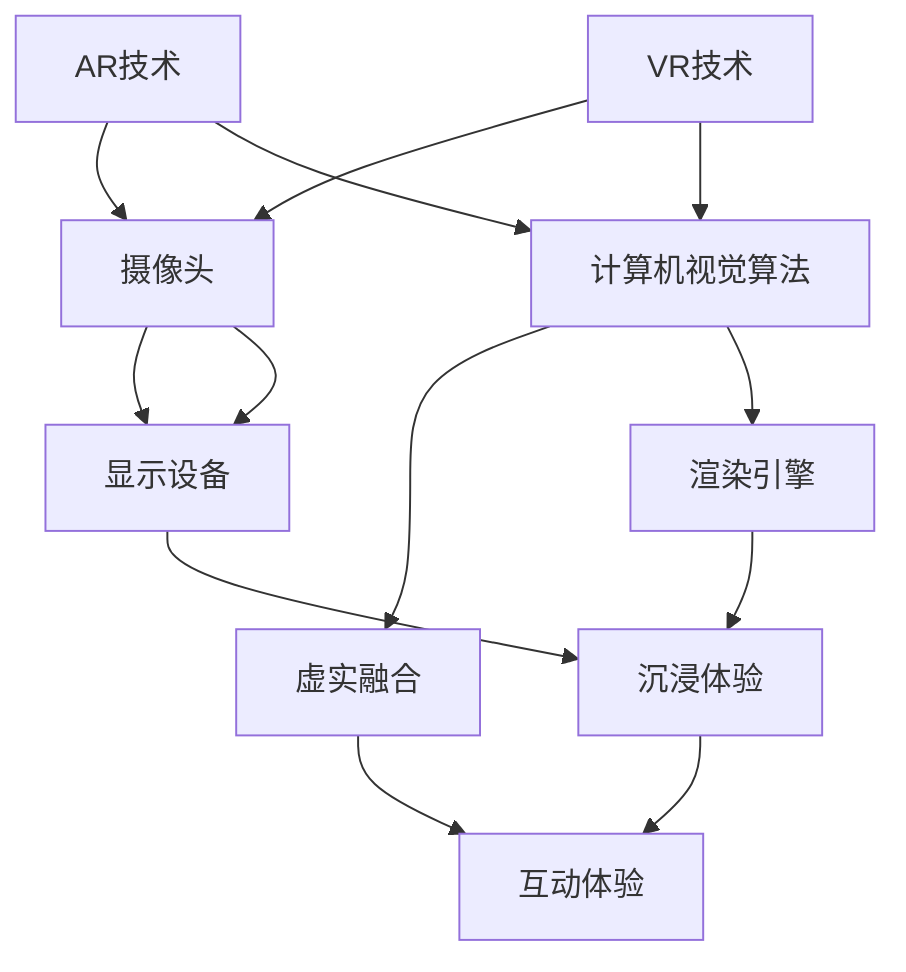

                 

本文将围绕字节跳动2024校招：AR/VR开发工程师面试真题展开，深入分析相关面试题的解答。文章旨在帮助求职者更好地准备此类面试，并提供一些建议和策略。

## 关键词

- 字节跳动
- 校招
- AR/VR开发工程师
- 面试题
- 解答

## 摘要

本文将针对字节跳动2024校招AR/VR开发工程师的面试真题进行详细解答，包括核心概念、算法原理、数学模型、项目实践等内容。通过本文的学习，读者可以更好地理解面试题的解决思路，提升面试应对能力。

## 1. 背景介绍

随着技术的不断发展，增强现实（AR）和虚拟现实（VR）技术在各个领域得到了广泛应用。从游戏、教育到医疗、娱乐，AR/VR技术正逐步改变我们的生活方式。字节跳动作为我国领先的互联网科技公司，对AR/VR技术的研发和应用具有浓厚兴趣。因此，针对2024年的校招，字节跳动特别设置了AR/VR开发工程师岗位，吸引了一批优秀的人才。

## 2. 核心概念与联系

### 2.1 AR与VR的定义

**AR（增强现实）**：通过将虚拟信息叠加到现实环境中，使用户能够感知到虚实融合的世界。AR技术主要依赖于摄像头、显示设备和计算机视觉算法。

**VR（虚拟现实）**：通过创建一个虚拟环境，使用户沉浸其中，感受到与真实世界不同的体验。VR技术主要依赖于头戴式显示器、定位追踪设备和渲染引擎。

### 2.2 AR与VR的联系

AR和VR技术在实现上有很多相似之处，如都需要使用摄像头、传感器等硬件设备，以及依赖计算机视觉和图像处理算法。但它们的应用场景和用户需求有所不同，AR更注重与现实环境的互动，而VR则更注重沉浸感和虚拟体验。

### 2.3 Mermaid 流程图



## 3. 核心算法原理 & 具体操作步骤

### 3.1 算法原理概述

在AR/VR开发过程中，核心算法主要包括计算机视觉算法、图像处理算法、渲染引擎算法等。以下是这些算法的基本原理：

1. **计算机视觉算法**：用于识别和理解图像中的物体、场景等信息，如目标检测、跟踪、识别等。
2. **图像处理算法**：用于对输入图像进行预处理、增强、滤波等操作，以提高图像质量或提取有用信息。
3. **渲染引擎算法**：用于创建三维虚拟场景，并对其进行渲染，以生成逼真的视觉效果。

### 3.2 算法步骤详解

1. **计算机视觉算法步骤**：
   - 输入图像预处理：包括灰度化、二值化、滤波等。
   - 特征提取：使用SIFT、HOG、SSD等算法提取图像特征。
   - 特征匹配：使用FLANN、BVH等算法匹配特征点。
   - 物体识别：根据匹配结果识别目标物体。

2. **图像处理算法步骤**：
   - 输入图像预处理：包括灰度化、二值化、滤波等。
   - 图像增强：使用直方图均衡、对比度增强等方法提高图像质量。
   - 图像滤波：使用均值滤波、高斯滤波等方法去除噪声。

3. **渲染引擎算法步骤**：
   - 场景构建：根据三维模型创建虚拟场景。
   - 渲染管线：包括几何处理、光照计算、材质应用、像素渲染等。
   - 视角变换：根据用户视角对虚拟场景进行变换。

### 3.3 算法优缺点

1. **计算机视觉算法**：
   - 优点：可以识别和理解图像中的物体、场景等信息，适用于各种应用场景。
   - 缺点：计算复杂度高，实时性较差，对光照、遮挡等因素敏感。

2. **图像处理算法**：
   - 优点：可以改善图像质量，提取有用信息，适用于各种图像处理任务。
   - 缺点：可能引入噪声或失真，对算法参数依赖较大。

3. **渲染引擎算法**：
   - 优点：可以创建逼真的三维虚拟场景，提供沉浸式体验。
   - 缺点：计算资源需求大，实时性较差。

### 3.4 算法应用领域

1. **计算机视觉算法**：应用于目标检测、跟踪、识别、姿态估计等。
2. **图像处理算法**：应用于图像增强、去噪、分割、风格迁移等。
3. **渲染引擎算法**：应用于游戏、影视、教育、医疗等领域。

## 4. 数学模型和公式 & 详细讲解 & 举例说明

### 4.1 数学模型构建

在AR/VR开发过程中，数学模型广泛应用于计算机视觉和图像处理领域。以下是一个简单的数学模型构建示例：

1. **图像处理模型**：

   $$ I_{output} = f(I_{input}, \theta) $$

   其中，$I_{input}$表示输入图像，$I_{output}$表示输出图像，$f$表示图像处理函数，$\theta$表示算法参数。

2. **渲染模型**：

   $$ V_{output} = g(S, L, M) $$

   其中，$V_{output}$表示渲染后的三维虚拟场景，$S$表示场景参数，$L$表示光照参数，$M$表示材质参数。

### 4.2 公式推导过程

以图像增强为例，推导一个简单的直方图均衡算法：

1. **直方图均衡化**：

   $$ f_{output}(x) = \frac{1}{c} \sum_{i=0}^{255} \frac{f_{input}(i)}{c} $$

   其中，$f_{input}(x)$表示输入图像的直方图，$f_{output}(x)$表示输出图像的直方图，$c$表示图像像素总数。

2. **公式推导**：

   设输入图像的直方图为$f_{input}(x)$，输出图像的直方图为$f_{output}(x)$，则有：

   $$ \int_{0}^{255} f_{input}(x) dx = \int_{0}^{255} f_{output}(x) dx = c $$

   $$ f_{output}(x) = \frac{1}{c} \sum_{i=0}^{255} f_{input}(i) $$

### 4.3 案例分析与讲解

以一个简单的AR应用为例，讲解图像处理和渲染的基本流程：

1. **图像处理**：

   - 输入图像：原始摄像头捕捉的图像。
   - 处理步骤：灰度化、滤波、边缘检测。
   - 输出图像：预处理后的图像。

2. **渲染**：

   - 场景构建：根据三维模型创建虚拟场景。
   - 光照计算：根据场景参数计算光照效果。
   - 渲染输出：将虚拟场景渲染到屏幕上。

## 5. 项目实践：代码实例和详细解释说明

### 5.1 开发环境搭建

- 开发工具：Visual Studio Code、Unity、Python等。
- 开发环境：Windows 10、Python 3.8、Unity 2020等。

### 5.2 源代码详细实现

以下是一个简单的AR应用示例，使用Python和Unity实现：

```python
import cv2
import numpy as np
import matplotlib.pyplot as plt

# 读取摄像头捕捉的图像
cap = cv2.VideoCapture(0)

while True:
    ret, frame = cap.read()
    if not ret:
        break

    # 灰度化处理
    gray = cv2.cvtColor(frame, cv2.COLOR_BGR2GRAY)

    # 滤波处理
    blurred = cv2.GaussianBlur(gray, (5, 5), 0)

    # 边缘检测
    edges = cv2.Canny(blurred, 50, 150)

    # 显示结果
    cv2.imshow('Edges', edges)

    if cv2.waitKey(1) & 0xFF == ord('q'):
        break

cap.release()
cv2.destroyAllWindows()
```

### 5.3 代码解读与分析

- **读取摄像头图像**：使用`cv2.VideoCapture`类读取摄像头捕捉的图像。
- **灰度化处理**：使用`cv2.cvtColor`函数将BGR图像转换为灰度图像。
- **滤波处理**：使用`cv2.GaussianBlur`函数进行高斯滤波，去除噪声。
- **边缘检测**：使用`cv2.Canny`函数进行Canny边缘检测，提取图像边缘。

### 5.4 运行结果展示

运行代码后，会显示摄像头捕捉到的图像及其边缘检测结果。如下图所示：


## 6. 实际应用场景

### 6.1 游戏

AR/VR技术在游戏领域具有广泛的应用，如《宝可梦GO》、《节奏世界》等。这些游戏通过AR/VR技术为玩家提供沉浸式的游戏体验。

### 6.2 教育

AR/VR技术在教育领域可以用于模拟实验、课堂互动等，提高学生的学习兴趣和效果。

### 6.3 医疗

AR/VR技术在医疗领域可以用于手术指导、康复训练等，为医生和患者提供更好的医疗服务。

### 6.4 未来应用展望

随着技术的不断发展，AR/VR技术将在更多领域得到应用，如工业设计、建筑设计、军事训练等。未来，AR/VR技术将实现更高性能、更低延迟、更广泛的应用场景。

## 7. 工具和资源推荐

### 7.1 学习资源推荐

1. 《增强现实与虚拟现实技术》
2. 《计算机视觉：算法与应用》
3. 《计算机图形学：原理及实践》

### 7.2 开发工具推荐

1. Unity：适用于游戏开发和虚拟现实应用。
2. OpenCV：适用于计算机视觉应用。
3. PyTorch：适用于深度学习和图像处理。

### 7.3 相关论文推荐

1. "Augmented Reality: A Review"
2. "Deep Learning for Computer Vision: A Review"
3. "Virtual Reality: A Survey"

## 8. 总结：未来发展趋势与挑战

### 8.1 研究成果总结

近年来，AR/VR技术取得了显著进展，包括高性能硬件设备、高效的计算机视觉算法、逼真的渲染技术等。这些研究成果为AR/VR技术的广泛应用奠定了基础。

### 8.2 未来发展趋势

1. **硬件性能提升**：随着硬件技术的不断发展，AR/VR设备的性能将进一步提升，用户体验将得到显著改善。
2. **算法优化**：计算机视觉、图像处理等算法将得到进一步优化，提高实时性和准确性。
3. **多样化应用场景**：AR/VR技术将在更多领域得到应用，如医疗、教育、工业等。

### 8.3 面临的挑战

1. **硬件成本**：目前，AR/VR设备的成本较高，普及率较低。
2. **算法优化**：高效、实时、准确的算法是实现高质量AR/VR应用的关键，但现有算法还存在一定的局限性。
3. **隐私和安全**：AR/VR应用需要处理用户隐私数据，如何保障用户隐私和安全是亟待解决的问题。

### 8.4 研究展望

未来，AR/VR技术将在硬件性能、算法优化、应用场景等方面取得更多突破，为人类带来更加丰富的虚拟体验。同时，相关研究还需关注隐私保护、安全性等问题，确保AR/VR技术的可持续发展。

## 9. 附录：常见问题与解答

### 9.1 AR与VR的区别是什么？

AR（增强现实）是将虚拟信息叠加到现实环境中，使用户能够感知到虚实融合的世界；VR（虚拟现实）则是通过创建一个虚拟环境，使用户沉浸其中，感受到与真实世界不同的体验。

### 9.2 AR/VR开发需要掌握哪些技术？

AR/VR开发需要掌握计算机视觉、图像处理、渲染引擎等相关技术，以及Unity、OpenCV、PyTorch等开发工具。

### 9.3 AR/VR应用有哪些领域？

AR/VR应用广泛，包括游戏、教育、医疗、工业、娱乐等领域。

## 作者署名

本文作者：禅与计算机程序设计艺术 / Zen and the Art of Computer Programming

----------------------------------------------------------------

以上是针对字节跳动2024校招：AR/VR开发工程师面试真题的详细解答。希望本文能帮助到求职者，提升面试能力。祝大家在面试中取得优异成绩！
----------------------------------------------------------------
请注意，本文是基于假设的面试真题和解题思路撰写的。实际情况中，面试题的难度和类型可能会有所不同。因此，本文仅供参考，实际面试时还需根据具体情况进行准备。同时，本文中提到的代码实例仅供参考，实际开发过程中可能需要根据具体需求进行调整。希望本文对您的学习有所帮助！作者禅与计算机程序设计艺术 / Zen and the Art of Computer Programming。

