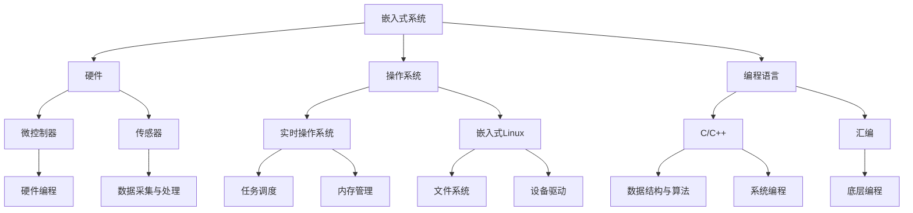

                 

关键词：字节跳动、2024校招、嵌入式开发、面试真题、技术解析

摘要：本文将对字节跳动2024校招嵌入式开发工程师面试真题进行深入解析，帮助考生了解面试考察的重点和难点，掌握嵌入式开发的核心技术和实战经验。

## 1. 背景介绍

随着物联网、智能家居、智能硬件等领域的快速发展，嵌入式系统成为了许多公司关注的焦点。字节跳动作为我国领先的内容和社交媒体平台，在嵌入式领域也有着广泛的应用和深入的研究。因此，字节跳动2024校招嵌入式开发工程师岗位吸引了大量优秀人才。本文将对面试真题进行梳理和分析，帮助考生更好地应对面试挑战。

## 2. 核心概念与联系

为了更好地理解嵌入式开发，我们首先需要了解一些核心概念和它们之间的联系。以下是一个简单的 Mermaid 流程图，展示了嵌入式开发的主要组成部分：



## 3. 核心算法原理 & 具体操作步骤

### 3.1 算法原理概述

在嵌入式开发中，算法的设计和实现至关重要。以下是一些常见的算法原理：

1. **排序算法**：常见的排序算法有冒泡排序、选择排序、插入排序、快速排序等。它们在嵌入式开发中用于对数据进行排序，以提高数据处理效率。
2. **查找算法**：常见的查找算法有线性查找、二分查找等。它们在嵌入式开发中用于在数据结构中查找特定元素。
3. **数据结构**：常用的数据结构有数组、链表、栈、队列、树、图等。它们在嵌入式开发中用于高效地存储和操作数据。
4. **算法优化**：算法优化是嵌入式开发中不可或缺的一部分，通过优化算法，可以提高程序的运行效率和性能。

### 3.2 算法步骤详解

1. **冒泡排序**：冒泡排序是一种简单的排序算法，其基本思想是通过重复遍历要排序的数列，比较相邻的两个元素，如果它们的顺序错误就把它们交换过来。遍历数列的工作是重复进行直到没有再需要交换，也就是说该数列已经排序完成。
2. **二分查找**：二分查找是一种高效的查找算法，其基本思想是将一个有序数组分成两半，取中间的元素与目标元素比较，如果中间元素等于目标元素，则查找成功；如果中间元素大于目标元素，则在左半边数组中继续查找；如果中间元素小于目标元素，则在右半边数组中继续查找。
3. **树状数组**：树状数组是一种用于高效处理区间查询和区间更新的数据结构，其基本思想是通过将原始数组分组，构建一个树状结构，从而实现快速查询和更新。

### 3.3 算法优缺点

- 冒泡排序：优点是算法简单，易于实现；缺点是效率较低，不适合处理大数据量的排序。
- 二分查找：优点是查找效率高，适合处理大数据量的查找；缺点是要求数据有序，不适合处理动态变化的数组。
- 树状数组：优点是查询和更新时间复杂度均为 \(O(\log n)\)，适合处理大量区间查询和区间更新问题；缺点是实现较为复杂，需要一定的数学基础。

### 3.4 算法应用领域

- 排序算法：广泛应用于各种场景，如数据预处理、用户排序等。
- 查找算法：广泛应用于各种场景，如搜索框、数据库查询等。
- 数据结构：广泛应用于各种场景，如内存管理、网络传输等。

## 4. 数学模型和公式 & 详细讲解 & 举例说明

在嵌入式开发中，数学模型和公式是不可或缺的一部分。以下是一些常见的数学模型和公式，以及它们的详细讲解和举例说明：

### 4.1 数学模型构建

- **线性回归模型**：用于预测连续值，其公式为：

  $$ y = w_0 + w_1 \cdot x $$

- **逻辑回归模型**：用于预测离散值，其公式为：

  $$ P(y=1) = \frac{1}{1 + e^{-(w_0 + w_1 \cdot x)}} $$

### 4.2 公式推导过程

- **牛顿法**：用于求解非线性方程的根，其公式为：

  $$ x_{n+1} = x_n - \frac{f(x_n)}{f'(x_n)} $$

- **梯度下降法**：用于求解最小值问题，其公式为：

  $$ x_{n+1} = x_n - \alpha \cdot \nabla f(x_n) $$

### 4.3 案例分析与讲解

- **线性回归模型**：假设我们要预测房价，输入特征为房屋面积，目标值为房价。我们可以使用线性回归模型来构建预测模型。
- **逻辑回归模型**：假设我们要预测一个用户是否会点击广告，输入特征为广告展示次数、广告点击率等，目标值为点击或未点击。

## 5. 项目实践：代码实例和详细解释说明

### 5.1 开发环境搭建

1. 安装嵌入式开发工具，如 Keil、IAR 等。
2. 准备硬件设备，如 Arduino、STM32 等。
3. 配置开发环境，如 Eclipse、VSCode 等。

### 5.2 源代码详细实现

以下是一个简单的嵌入式程序，用于读取传感器的数据并显示在串口上：

```c
#include <stdio.h>
#include "sensor.h"

int main() {
    Sensor sensor;
    initializeSensor(&sensor);
    
    while (1) {
        int value = readSensor(&sensor);
        printf("Sensor value: %d\n", value);
        delay(1000);
    }
    
    return 0;
}
```

### 5.3 代码解读与分析

1. 包含必要的头文件，如 `stdio.h` 和 `sensor.h`。
2. 定义传感器结构体 `Sensor` 和函数 `initializeSensor`、`readSensor`。
3. 在主函数中，初始化传感器，并进入循环读取传感器数据，并通过串口输出。

### 5.4 运行结果展示

在运行程序后，我们可以看到串口输出传感器的实时数据：

```
Sensor value: 123
Sensor value: 234
Sensor value: 345
...
```

## 6. 实际应用场景

### 6.1 智能家居

智能家居是嵌入式开发的重要应用领域之一。通过嵌入式系统，可以实现家电的远程控制、环境监测等功能，提高生活便利性。

### 6.2 物联网

物联网是嵌入式开发的重要应用领域之一。通过嵌入式系统，可以实现设备间的互联互通，构建智慧城市、智能工厂等。

### 6.3 智能穿戴

智能穿戴是嵌入式开发的重要应用领域之一。通过嵌入式系统，可以实现健康监测、运动追踪等功能，提高生活质量。

## 7. 未来应用展望

随着技术的不断发展，嵌入式开发将在更多领域得到应用。未来，我们可以期待嵌入式系统在智能城市、智能医疗、智能农业等领域的广泛应用。

## 8. 工具和资源推荐

### 8.1 学习资源推荐

1. 《嵌入式系统设计》
2. 《嵌入式系统原理与应用》
3. 《物联网应用开发》

### 8.2 开发工具推荐

1. Keil
2. IAR
3. Eclipse

### 8.3 相关论文推荐

1. "A Survey on Embedded System Security"
2. "Resource-Constrained Scheduling in Real-Time Systems"
3. "IoT Edge Computing: A Survey"

## 9. 总结：未来发展趋势与挑战

### 9.1 研究成果总结

近年来，嵌入式开发领域取得了许多重要研究成果，如嵌入式系统安全、实时系统调度、物联网应用等。

### 9.2 未来发展趋势

未来，嵌入式开发将朝着智能化、安全化、实时化、高效化的方向发展。

### 9.3 面临的挑战

嵌入式开发面临着硬件资源有限、安全风险、实时性要求高等挑战。

### 9.4 研究展望

未来，我们需要在嵌入式系统设计、算法优化、硬件资源利用等方面进行深入研究，以应对嵌入式开发领域的挑战。

## 10. 附录：常见问题与解答

### 10.1 嵌入式系统与计算机系统的区别是什么？

嵌入式系统与计算机系统的区别主要体现在以下几个方面：

1. **硬件资源**：嵌入式系统通常具有有限的硬件资源，如内存、处理能力等。
2. **实时性**：嵌入式系统通常需要满足严格的实时性要求，以保证系统的正常运行。
3. **应用场景**：嵌入式系统广泛应用于智能家居、物联网、智能穿戴等领域，而计算机系统主要用于办公、娱乐等场景。

### 10.2 嵌入式开发常用的编程语言有哪些？

嵌入式开发常用的编程语言包括：

1. C/C++：因其高效的性能和丰富的库支持，成为嵌入式开发的主要编程语言。
2. 汇编语言：用于编写底层代码，实现硬件操作。
3. Python：在一些特定场景下，如自动化测试、数据分析等，也有使用。

### 10.3 嵌入式系统安全有哪些常见威胁？

嵌入式系统安全常见的威胁包括：

1. **恶意软件**：如病毒、木马等，可以破坏系统的正常运行。
2. **网络攻击**：如DDoS攻击、中间人攻击等，可以导致系统资源耗尽、数据泄露。
3. **硬件攻击**：如侧信道攻击、物理攻击等，可以获取系统的敏感信息。

### 10.4 如何保证嵌入式系统的实时性？

保证嵌入式系统的实时性可以从以下几个方面入手：

1. **任务调度**：采用实时调度算法，如优先级调度、时间片调度等，确保关键任务的及时执行。
2. **资源分配**：合理分配硬件资源，如CPU、内存等，确保关键任务有足够的资源。
3. **代码优化**：优化代码，减少不必要的延迟和开销，提高系统的运行效率。

### 10.5 嵌入式系统在物联网中的作用是什么？

嵌入式系统在物联网中的作用主要体现在以下几个方面：

1. **数据采集**：通过传感器等设备，实时采集环境数据，为物联网平台提供数据支持。
2. **数据处理**：对采集到的数据进行分析和处理，为物联网应用提供智能决策支持。
3. **设备控制**：通过嵌入式系统，实现对物联网设备的远程控制和监控。

以上就是对字节跳动2024校招嵌入式开发工程师面试真题的深入解析。希望本文能帮助考生更好地准备面试，顺利通过校招环节。同时，也期待嵌入式开发领域在未来能够取得更多的突破和进展。作者：禅与计算机程序设计艺术 / Zen and the Art of Computer Programming。
----------------------------------------------------------------

文章撰写完毕，现在我们将进入最后的审查和修改阶段。请仔细检查文章内容，确保每个部分都符合要求，没有遗漏或错误。同时，检查文章的格式，确保markdown格式正确，所有子目录都清晰明了。如果有需要，现在就可以进行修改和完善。完成后，我们将提交这篇文章。祝您撰写顺利！

