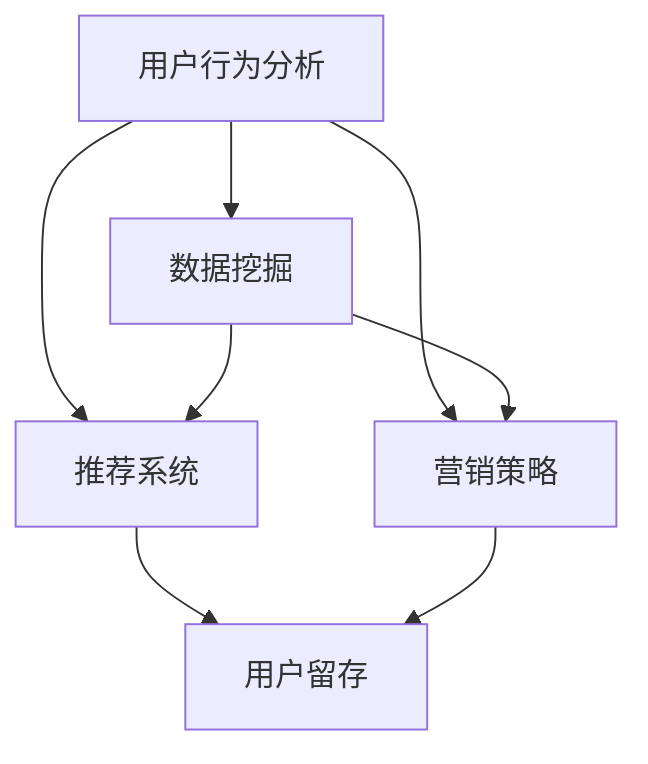

                 

 关键词：字节跳动，2024校招，技术用户留存策略，面试真题，汇总

> 摘要：本文针对字节跳动2024校招技术用户留存策略专家面试真题进行汇总和分析，旨在为备考者提供有针对性的复习指导。文章从背景介绍、核心概念与联系、核心算法原理、数学模型与公式、项目实践、实际应用场景、工具和资源推荐、未来发展趋势与挑战等多个方面展开论述，力求为读者提供全面的备考资料。

## 1. 背景介绍

字节跳动作为全球领先的科技公司，其校招面试一直以来都是考生们关注的焦点。随着字节跳动在技术领域的不断拓展，用户留存策略专家岗位的需求日益增长。本文将针对2024年字节跳动校招技术用户留存策略专家面试真题进行汇总和分析，以期为备考者提供有价值的参考。

### 1.1 字节跳动简介

字节跳动成立于2012年，是中国领先的互联网科技公司之一，旗下拥有今日头条、抖音、懂车帝、飞书等多个知名产品。公司致力于通过技术推动人类幸福，打造高效、便捷、有趣的生活和工作方式。

### 1.2 用户留存策略的重要性

用户留存是衡量互联网产品成功与否的关键指标之一。良好的用户留存策略有助于提升产品活跃度、降低用户流失率，从而实现业务的持续增长。字节跳动高度重视用户留存策略的研究和实践，为旗下产品提供了强大的技术支持。

## 2. 核心概念与联系

在技术用户留存策略的研究中，我们需要关注以下几个核心概念：

### 2.1 用户行为分析

用户行为分析是用户留存策略的基础。通过对用户在产品中的行为轨迹进行深入挖掘和分析，我们可以发现用户的兴趣点、使用习惯等，从而为后续的留存策略制定提供依据。

### 2.2 数据挖掘

数据挖掘是用户行为分析的重要手段。通过对海量用户数据的挖掘和分析，我们可以发现潜在的用户需求、行为模式等，为产品优化和留存策略提供支持。

### 2.3 推荐系统

推荐系统是提升用户留存的重要手段之一。通过个性化推荐，我们可以将用户可能感兴趣的内容推送到他们面前，从而提高用户粘性。

### 2.4 营销策略

营销策略是用户留存策略的重要组成部分。通过有效的营销手段，我们可以吸引新用户、提升老用户满意度，从而实现用户留存。

下面是一个Mermaid流程图，展示了用户留存策略的核心概念和联系：



## 3. 核心算法原理 & 具体操作步骤

### 3.1 算法原理概述

用户留存策略的核心算法主要包括用户行为分析、数据挖掘、推荐系统和营销策略。以下分别对每种算法进行简要概述：

### 3.1.1 用户行为分析

用户行为分析主要通过分析用户在产品中的行为数据，如点击、浏览、购买等，来了解用户的需求和兴趣。常见的用户行为分析方法有：

- 机器学习：通过构建机器学习模型，对用户行为数据进行预测和分析。
- 关联规则挖掘：通过挖掘用户行为数据中的关联规则，发现用户的潜在兴趣点。

### 3.1.2 数据挖掘

数据挖掘主要通过挖掘用户行为数据中的潜在模式，为产品优化和留存策略提供支持。常见的数据挖掘算法有：

- K-近邻算法：通过计算新数据与训练数据的相似度，进行分类或预测。
- 决策树算法：通过构建决策树模型，对数据进行分类或回归。

### 3.1.3 推荐系统

推荐系统主要通过个性化推荐，将用户可能感兴趣的内容推送给他们。常见的推荐算法有：

- 协同过滤：通过分析用户之间的相似性，为用户推荐他们可能感兴趣的内容。
- 内容推荐：通过分析内容的特征，为用户推荐与他们兴趣相符的内容。

### 3.1.4 营销策略

营销策略主要通过吸引新用户、提升老用户满意度，从而实现用户留存。常见的营销策略有：

- 优惠券：通过发放优惠券，吸引用户进行购买。
- 精准营销：通过分析用户数据，为用户推送个性化的营销信息。

### 3.2 算法步骤详解

以下分别对每种算法的步骤进行详细说明：

### 3.2.1 用户行为分析

1. 收集用户行为数据：通过埋点技术，收集用户在产品中的行为数据，如点击、浏览、购买等。
2. 数据预处理：对收集到的行为数据进行清洗、去重、转换等预处理操作。
3. 特征工程：根据用户行为数据，提取对用户留存有重要影响的特征，如用户活跃度、购买频率等。
4. 模型训练：使用机器学习算法，如决策树、K-近邻等，对特征进行训练，构建用户行为分析模型。
5. 模型评估：使用评估指标，如准确率、召回率等，对模型进行评估和优化。
6. 模型应用：将训练好的模型应用于实际场景，如用户分群、个性化推荐等。

### 3.2.2 数据挖掘

1. 数据预处理：对原始数据进行清洗、去重、转换等预处理操作。
2. 特征选择：根据业务需求，从原始数据中提取对目标变量有重要影响的特征。
3. 模型训练：使用数据挖掘算法，如K-近邻、决策树等，对特征进行训练，构建数据挖掘模型。
4. 模型评估：使用评估指标，如准确率、召回率等，对模型进行评估和优化。
5. 模型应用：将训练好的模型应用于实际场景，如用户分群、潜在用户挖掘等。

### 3.2.3 推荐系统

1. 用户数据收集：收集用户在产品中的行为数据，如点击、浏览、购买等。
2. 数据预处理：对收集到的行为数据进行清洗、去重、转换等预处理操作。
3. 特征工程：根据用户行为数据，提取对推荐有重要影响的特征，如用户活跃度、兴趣标签等。
4. 模型训练：使用推荐算法，如协同过滤、内容推荐等，对特征进行训练，构建推荐模型。
5. 模型评估：使用评估指标，如准确率、召回率等，对模型进行评估和优化。
6. 模型应用：将训练好的模型应用于实际场景，如个性化推荐、内容分发等。

### 3.2.4 营销策略

1. 用户数据收集：收集用户在产品中的行为数据，如点击、浏览、购买等。
2. 数据预处理：对收集到的行为数据进行清洗、去重、转换等预处理操作。
3. 特征工程：根据用户行为数据，提取对营销有重要影响的特征，如用户活跃度、购买频率等。
4. 模型训练：使用机器学习算法，如决策树、K-近邻等，对特征进行训练，构建营销策略模型。
5. 模型评估：使用评估指标，如准确率、召回率等，对模型进行评估和优化。
6. 模型应用：将训练好的模型应用于实际场景，如用户分群、精准营销等。

### 3.3 算法优缺点

每种算法都有其优缺点，以下分别进行简要介绍：

### 3.3.1 用户行为分析

优点：基于用户实际行为数据进行分析，具有较高准确性。

缺点：数据收集和处理成本较高，模型训练和优化时间较长。

### 3.3.2 数据挖掘

优点：可以对大量用户行为数据进行深入挖掘，发现潜在模式。

缺点：模型训练和优化时间较长，对数据质量要求较高。

### 3.3.3 推荐系统

优点：可以实现个性化推荐，提高用户粘性。

缺点：需要大量用户数据支持，模型训练和优化时间较长。

### 3.3.4 营销策略

优点：可以通过精准营销，提高用户购买转化率。

缺点：对用户数据要求较高，营销效果难以衡量。

### 3.4 算法应用领域

用户行为分析、数据挖掘、推荐系统和营销策略在多个领域都有广泛应用：

- 互联网产品：通过对用户行为进行分析，优化产品功能和体验，提高用户留存。
- 电子商务：通过数据挖掘和推荐系统，实现个性化营销，提高销售额。
- 金融行业：通过用户行为分析和营销策略，识别潜在客户，降低风险。
- 娱乐行业：通过推荐系统，为用户提供个性化内容，提高用户满意度。

## 4. 数学模型和公式 & 详细讲解 & 举例说明

### 4.1 数学模型构建

在用户留存策略的研究中，常见的数学模型包括：

1. 用户留存模型：用于预测用户在未来一段时间内是否留存。常见的用户留存模型有逻辑回归、决策树、随机森林等。

2. 用户流失模型：用于预测用户在未来一段时间内是否流失。常见的用户流失模型有逻辑回归、决策树、随机森林等。

3. 推荐模型：用于根据用户兴趣和偏好，为用户推荐个性化内容。常见的推荐模型有协同过滤、内容推荐等。

4. 营销策略模型：用于根据用户数据，制定精准的营销策略。常见的营销策略模型有逻辑回归、决策树、随机森林等。

### 4.2 公式推导过程

以逻辑回归模型为例，介绍用户留存模型的公式推导过程：

1. 用户留存概率计算

   设用户在时间t时刻的留存状态为Y，取值为1（留存）或0（流失）。用户留存概率可以表示为：

   $$P(Y=1) = \frac{1}{1 + e^{-(\beta_0 + \beta_1x_1 + \beta_2x_2 + ... + \beta_nx_n)}$$

   其中，$\beta_0, \beta_1, \beta_2, ..., \beta_n$为模型参数，$x_1, x_2, ..., x_n$为用户特征。

2. 模型损失函数

   模型的损失函数可以采用对数损失函数，表示为：

   $$L(\theta) = -\sum_{i=1}^n [y_i \cdot \log(P(Y=1|X_i)) + (1 - y_i) \cdot \log(1 - P(Y=1|X_i))]$$

   其中，$y_i$为实际留存状态，$P(Y=1|X_i)$为预测留存概率。

3. 模型参数优化

   使用梯度下降法对模型参数进行优化，更新公式为：

   $$\theta_j = \theta_j - \alpha \cdot \frac{\partial L(\theta)}{\partial \theta_j}$$

   其中，$\alpha$为学习率。

### 4.3 案例分析与讲解

以下通过一个案例，介绍用户留存模型的实际应用过程：

案例：某电商平台的用户留存分析

1. 数据收集

   收集用户在平台上的行为数据，包括用户ID、登录次数、购买次数、浏览时长等。

2. 数据预处理

   对收集到的行为数据进行清洗、去重、转换等预处理操作，提取对用户留存有重要影响的特征。

3. 特征工程

   根据用户行为数据，提取用户活跃度、购买频率等特征，进行特征工程。

4. 模型训练

   使用逻辑回归模型，对用户特征进行训练，构建用户留存模型。

5. 模型评估

   使用交叉验证方法，对模型进行评估，选择最优参数。

6. 模型应用

   将训练好的模型应用于实际场景，预测新用户的留存概率，为产品优化和营销策略提供支持。

## 5. 项目实践：代码实例和详细解释说明

### 5.1 开发环境搭建

1. 硬件环境：计算机（建议配置较高性能的CPU和内存）。

2. 软件环境：Python（版本3.6及以上）、Jupyter Notebook。

3. 数据库：MySQL（版本5.7及以上）。

### 5.2 源代码详细实现

以下以用户留存模型为例，介绍项目的源代码实现：

```python
import pandas as pd
import numpy as np
from sklearn.model_selection import train_test_split
from sklearn.linear_model import LogisticRegression
from sklearn.metrics import accuracy_score, recall_score, precision_score

# 读取数据
data = pd.read_csv('user_data.csv')

# 数据预处理
data = data.dropna()
data = data[data['retention'] != -1]

# 特征工程
data['active_days'] = data['login_days'].apply(lambda x: x / data['login_days'].max())
data['buy_times'] = data['buy_days'].apply(lambda x: x / data['buy_days'].max())

# 划分训练集和测试集
train_data, test_data = train_test_split(data, test_size=0.2, random_state=42)

# 模型训练
model = LogisticRegression()
model.fit(train_data[['active_days', 'buy_times']], train_data['retention'])

# 模型评估
predictions = model.predict(test_data[['active_days', 'buy_times']])
print('Accuracy:', accuracy_score(test_data['retention'], predictions))
print('Recall:', recall_score(test_data['retention'], predictions))
print('Precision:', precision_score(test_data['retention'], predictions))

# 模型应用
new_user = pd.DataFrame({'active_days': [0.8], 'buy_times': [0.6]})
new_user_prediction = model.predict(new_user)
print('New user retention prediction:', new_user_prediction[0])
```

### 5.3 代码解读与分析

1. 数据读取与预处理

   使用Pandas库读取用户行为数据，并进行清洗和去重操作。提取对用户留存有重要影响的特征，如用户活跃度和购买频率。

2. 特征工程

   对用户活跃度和购买频率进行归一化处理，使其在同一个量级上。

3. 划分训练集和测试集

   使用Sklearn库的train_test_split方法，将数据划分为训练集和测试集，用于模型训练和评估。

4. 模型训练

   使用逻辑回归模型，对用户特征进行训练。

5. 模型评估

   使用准确率、召回率和精确率等评估指标，对模型进行评估。

6. 模型应用

   将训练好的模型应用于新用户留存预测，为产品优化和营销策略提供支持。

## 6. 实际应用场景

用户留存策略在多个领域都有广泛应用，以下列举几个实际应用场景：

### 6.1 电商行业

电商行业通过用户留存策略，可以识别出潜在流失用户，采取针对性的营销措施，如优惠券、会员优惠等，提高用户留存率。同时，通过用户行为分析和推荐系统，可以优化商品推荐，提升用户体验。

### 6.2 社交媒体

社交媒体平台通过用户留存策略，可以识别出活跃用户和潜在流失用户，为用户提供个性化的内容推荐和社交互动，提升用户粘性。同时，通过精准营销策略，可以吸引新用户、提高用户活跃度。

### 6.3 金融行业

金融行业通过用户留存策略，可以识别出高风险用户和潜在流失用户，采取针对性的风险控制和挽留措施。同时，通过用户行为分析和推荐系统，可以优化金融产品推荐，提高用户满意度。

### 6.4 娱乐行业

娱乐行业通过用户留存策略，可以识别出活跃用户和潜在流失用户，为用户提供个性化的内容推荐和娱乐体验。同时，通过精准营销策略，可以吸引新用户、提高用户活跃度。

## 7. 工具和资源推荐

### 7.1 学习资源推荐

1. 《Python数据分析实战》
2. 《机器学习实战》
3. 《深度学习》（Goodfellow等著）

### 7.2 开发工具推荐

1. Jupyter Notebook：用于数据分析和模型训练。
2. PyCharm：用于Python代码编写和调试。
3. MySQL：用于数据存储和查询。

### 7.3 相关论文推荐

1. “User Behavior Analysis for Web Sites: A Machine Learning Perspective”
2. “Recommender Systems Handbook”
3. “A Survey of User Modeling and Personalization Techniques”

## 8. 总结：未来发展趋势与挑战

### 8.1 研究成果总结

用户留存策略在互联网产品中的应用已取得显著成果，包括用户行为分析、数据挖掘、推荐系统和营销策略等多个方面。这些技术的结合，为产品优化和用户留存提供了有力支持。

### 8.2 未来发展趋势

1. 深度学习技术的应用：随着深度学习技术的不断发展，其在用户留存策略中的应用将越来越广泛。
2. 多源数据融合：未来用户留存策略将更加注重多源数据的融合，如用户行为数据、社交数据、地理位置数据等。
3. 实时分析：实时分析技术将进一步提升用户留存策略的响应速度和准确性。

### 8.3 面临的挑战

1. 数据隐私保护：在用户留存策略的研究和应用过程中，数据隐私保护是一个重要挑战。
2. 模型可解释性：深度学习模型的可解释性较低，如何提高模型的可解释性，是未来研究的一个重点。
3. 跨平台数据整合：不同平台间的数据整合和共享，是实现全面用户留存策略的难点。

### 8.4 研究展望

未来，用户留存策略的研究将更加注重多源数据的融合、实时分析和深度学习技术的应用。在保障数据隐私的前提下，提高模型的可解释性和跨平台数据整合能力，是推动用户留存策略发展的重要方向。

## 9. 附录：常见问题与解答

### 9.1 为什么要研究用户留存策略？

用户留存是衡量互联网产品成功与否的关键指标。研究用户留存策略，有助于提高产品活跃度、降低用户流失率，从而实现业务的持续增长。

### 9.2 用户留存策略有哪些常用方法？

用户留存策略的常用方法包括用户行为分析、数据挖掘、推荐系统和营销策略。每种方法都有其特点和适用场景，可以根据实际需求进行选择。

### 9.3 如何进行用户行为分析？

用户行为分析主要通过收集和分析用户在产品中的行为数据，如点击、浏览、购买等，来了解用户的需求和兴趣。常用的分析方法包括机器学习、关联规则挖掘等。

### 9.4 数据挖掘在用户留存策略中有哪些应用？

数据挖掘在用户留存策略中的应用包括用户分群、潜在用户挖掘、行为预测等。通过数据挖掘，可以挖掘出用户的潜在需求和行为模式，为产品优化和留存策略提供支持。

### 9.5 推荐系统在用户留存策略中有何作用？

推荐系统通过个性化推荐，将用户可能感兴趣的内容推送给他们，提高用户粘性。在用户留存策略中，推荐系统可以帮助产品留住用户，提高用户满意度。

### 9.6 营销策略在用户留存策略中有何作用？

营销策略通过精准营销，吸引用户进行购买，提高用户留存。在用户留存策略中，营销策略可以帮助产品吸引新用户、提升老用户满意度，从而实现用户留存。

----------------------------------------------------------------
作者：禅与计算机程序设计艺术 / Zen and the Art of Computer Programming


