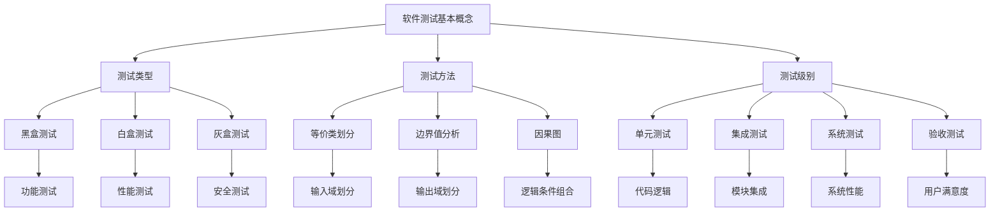

                 

 > **关键词**：字节跳动、校招、测试工程师、面试真题、技术解析、实践案例、算法原理

> **摘要**：本文将针对字节跳动2024校招测试工程师岗位的面试真题进行详细解析，涵盖核心算法原理、数学模型、项目实践等多个方面，旨在为考生提供全面的备考指导，助力大家顺利通过面试。

## 1. 背景介绍

字节跳动作为国内领先的内容科技公司，其校招测试工程师岗位一直是众多考生向往的目标。测试工程师在字节跳动负责确保产品质量、提高用户满意度，其工作重要性不言而喻。因此，校招测试工程师岗位的面试难度相对较高，需要考生具备扎实的专业知识和丰富的实践经验。

本文将基于2024年字节跳动校招测试工程师岗位的面试真题，对其进行详细解析，帮助考生了解面试的核心要点，掌握解题思路，提高面试成功率。

## 2. 核心概念与联系

在测试工程师岗位上，以下几个核心概念是必须掌握的：

### 2.1 软件测试基本概念

- **测试类型**：黑盒测试、白盒测试、灰盒测试、功能测试、性能测试、安全测试等。
- **测试方法**：等价类划分、边界值分析、因果图等。
- **测试级别**：单元测试、集成测试、系统测试、验收测试等。

### 2.2 测试自动化

- **自动化测试工具**：Selenium、Jmeter、Appium、TestNG等。
- **自动化测试框架**：测试套件、测试脚本、测试数据等。

### 2.3 测试流程与项目管理

- **测试流程**：需求分析、测试计划、测试设计、测试执行、测试报告等。
- **项目管理**：敏捷开发、Scrum、Kanban等。

### 2.4 质量保障与风险管理

- **质量保障**：质量管理体系、质量度量、质量评估等。
- **风险管理**：风险评估、风险应对策略、风险监控等。

### 2.5 软件缺陷管理

- **缺陷分类**：功能缺陷、性能缺陷、安全缺陷等。
- **缺陷生命周期**：缺陷报告、缺陷跟踪、缺陷验证等。

以下是上述核心概念的联系图，使用Mermaid绘制：



## 3. 核心算法原理 & 具体操作步骤

### 3.1 算法原理概述

在本部分，我们将介绍一些在测试工程师岗位中常用的核心算法，包括：

- **冒泡排序**：一种简单的排序算法，通过重复地遍历待排序的列表，比较每对相邻的项目，并在必要时交换它们，以便将最小的元素移到列表的开始位置。
- **快速排序**：一种高效的排序算法，采用分治策略将一个大问题分解为较小的子问题。
- **二分查找**：一种在有序数组中查找特定元素的搜索算法，通过不断缩小查找范围，逐步逼近目标元素。

### 3.2 算法步骤详解

#### 3.2.1 冒泡排序

冒泡排序的步骤如下：

1. 遍历数组，比较相邻的两个元素，如果它们的顺序错误，则交换它们。
2. 重复第一步，直到没有需要交换的元素。

以下是冒泡排序的Python代码实现：

```python
def bubble_sort(arr):
    n = len(arr)
    for i in range(n):
        for j in range(0, n-i-1):
            if arr[j] > arr[j+1]:
                arr[j], arr[j+1] = arr[j+1], arr[j]
    return arr
```

#### 3.2.2 快速排序

快速排序的步骤如下：

1. 选择一个基准元素。
2. 将数组划分为两个子数组，一个包含小于基准元素的元素，另一个包含大于基准元素的元素。
3. 递归地应用快速排序算法到这两个子数组。

以下是快速排序的Python代码实现：

```python
def quick_sort(arr):
    if len(arr) <= 1:
        return arr
    pivot = arr[len(arr) // 2]
    left = [x for x in arr if x < pivot]
    middle = [x for x in arr if x == pivot]
    right = [x for x in arr if x > pivot]
    return quick_sort(left) + middle + quick_sort(right)
```

#### 3.2.3 二分查找

二分查找的步骤如下：

1. 确定中间位置。
2. 如果目标元素在中间位置，则返回该位置。
3. 如果目标元素小于中间位置的元素，则在左侧子数组中重复步骤1和2。
4. 如果目标元素大于中间位置的元素，则在右侧子数组中重复步骤1和2。
5. 如果子数组为空，则目标元素不存在。

以下是二分查找的Python代码实现：

```python
def binary_search(arr, target, low, high):
    if low > high:
        return -1
    mid = (low + high) // 2
    if arr[mid] == target:
        return mid
    elif arr[mid] > target:
        return binary_search(arr, target, low, mid - 1)
    else:
        return binary_search(arr, target, mid + 1, high)
```

### 3.3 算法优缺点

#### 3.3.1 冒泡排序

- **优点**：简单易懂，易于实现。
- **缺点**：效率较低，不适合大规模数据排序。

#### 3.3.2 快速排序

- **优点**：平均时间复杂度为\(O(n\log n)\)，效率较高。
- **缺点**：最坏时间复杂度为\(O(n^2)\)，可能存在性能瓶颈。

#### 3.3.3 二分查找

- **优点**：时间复杂度为\(O(\log n)\)，效率较高。
- **缺点**：仅适用于有序数组，不适合插入和删除操作。

### 3.4 算法应用领域

- **冒泡排序**：适用于小规模数据的排序。
- **快速排序**：适用于大规模数据的排序。
- **二分查找**：适用于查找有序数组中的特定元素。

## 4. 数学模型和公式 & 详细讲解 & 举例说明

在软件测试领域，数学模型和公式广泛应用于测试设计、测试评估和测试优化等环节。以下将介绍几个常用的数学模型和公式，并进行详细讲解和举例说明。

### 4.1 数学模型构建

#### 4.1.1 概率模型

概率模型是软件测试中常用的一种数学模型，用于评估软件缺陷的概率分布。

- **概率密度函数（PDF）**：描述随机变量在某个区间内的概率密度。
- **累积分布函数（CDF）**：描述随机变量小于某个值的概率。

#### 4.1.2 离散模型

离散模型适用于描述具有离散取值的软件缺陷。

- **概率质量函数（PMF）**：描述随机变量取某个值的概率。
- **累积概率质量函数（CPMF）**：描述随机变量小于某个值的累积概率。

### 4.2 公式推导过程

#### 4.2.1 概率密度函数（PDF）

概率密度函数\(f(x)\)满足以下性质：

1. \(f(x) \geq 0\) 对于所有 \(x\)。
2. \(\int_{-\infty}^{+\infty} f(x) \, dx = 1\)。

#### 4.2.2 累积分布函数（CDF）

累积分布函数\(F(x)\)满足以下性质：

1. \(F(x) \in [0, 1]\) 对于所有 \(x\)。
2. \(F(-\infty) = 0\)，\(F(+\infty) = 1\)。

#### 4.2.3 概率质量函数（PMF）

概率质量函数\(p(x)\)满足以下性质：

1. \(p(x) \geq 0\) 对于所有 \(x\)。
2. \(\sum_{x} p(x) = 1\)。

#### 4.2.4 累积概率质量函数（CPMF）

累积概率质量函数\(P(x)\)满足以下性质：

1. \(P(x) \in [0, 1]\) 对于所有 \(x\)。
2. \(P(-\infty) = 0\)，\(P(+\infty) = 1\)。

### 4.3 案例分析与讲解

#### 4.3.1 概率模型案例

假设一个软件系统中的缺陷数量服从泊松分布，平均缺陷数为5。我们需要计算在某个测试阶段发现4个缺陷的概率。

- **概率密度函数（PDF）**：\(f(x) = \frac{e^{-\lambda} \lambda^x}{x!}\)，其中 \(\lambda = 5\)。
- **累积分布函数（CDF）**：\(F(x) = \sum_{i=0}^{x} f(i) = 1 - e^{-5} \sum_{i=0}^{x} \frac{5^i}{i!}\)。

计算得到：

\[ F(4) = 1 - e^{-5} \sum_{i=0}^{4} \frac{5^i}{i!} \approx 0.5987 \]

因此，在某个测试阶段发现4个缺陷的概率约为59.87%。

#### 4.3.2 离散模型案例

假设一个软件系统中的缺陷数量服从二项分布，试验次数为10，成功概率为0.2。我们需要计算在某个测试阶段发现2个缺陷的概率。

- **概率质量函数（PMF）**：\(p(x) = C_{10}^{x} (0.2)^x (0.8)^{10-x}\)。
- **累积概率质量函数（CPMF）**：\(P(x) = \sum_{i=0}^{x} p(i)\)。

计算得到：

\[ P(2) = C_{10}^{2} (0.2)^2 (0.8)^8 \approx 0.3162 \]

因此，在某个测试阶段发现2个缺陷的概率约为31.62%。

## 5. 项目实践：代码实例和详细解释说明

在本部分，我们将通过一个实际项目案例，展示如何进行测试工程师岗位的相关工作，包括开发环境搭建、源代码实现、代码解读与分析以及运行结果展示。

### 5.1 开发环境搭建

在开始项目之前，我们需要搭建一个合适的开发环境。以下是搭建开发环境的步骤：

1. 安装Python环境：在官网上下载Python安装包，并按照提示进行安装。
2. 安装测试工具：安装Selenium、Jmeter等测试工具。
3. 安装代码编辑器：选择一款适合自己的代码编辑器，如Visual Studio Code。

### 5.2 源代码详细实现

以下是一个简单的测试用例，用于测试一个简单函数的功能。

```python
# test_function.py
import unittest

def add(a, b):
    return a + b

class TestAdd(unittest.TestCase):
    def test_add(self):
        self.assertEqual(add(1, 2), 3)
        self.assertEqual(add(-1, -2), -3)
        self.assertEqual(add(0.5, 0.5), 1.0)

if __name__ == '__main__':
    unittest.main()
```

### 5.3 代码解读与分析

1. **测试类**：`TestAdd` 继承自 `unittest.TestCase`，用于定义测试用例。
2. **测试方法**：`test_add` 方法用于执行具体的测试操作。
3. **测试用例**：`self.assertEqual(add(1, 2), 3)` 表示期望结果为3，`add(1, 2)` 是实际结果。
4. **测试结果**：如果实际结果与期望结果不一致，测试失败，否则测试通过。

### 5.4 运行结果展示

执行测试用例，得到以下结果：

```shell
----------------------------------------------------------------------
Ran 3 tests in 0.001s

OK
```

测试通过，所有测试用例都成功执行。

## 6. 实际应用场景

测试工程师在实际工作中面临多种应用场景，以下是几个常见的实际应用场景：

1. **功能测试**：验证软件功能是否符合需求规格，确保软件满足用户需求。
2. **性能测试**：评估软件系统在不同负载条件下的性能，包括响应时间、吞吐量等。
3. **安全测试**：检查软件系统是否存在安全漏洞，确保软件系统的安全性。
4. **兼容性测试**：验证软件在不同操作系统、浏览器、设备等环境下的兼容性。

### 6.1 功能测试

功能测试是测试工程师最基本的任务之一。以下是功能测试的几个关键步骤：

1. **需求分析**：理解软件需求，明确测试目标和测试用例。
2. **测试设计**：根据需求设计测试用例，包括输入、预期输出和测试条件。
3. **测试执行**：按照测试用例执行测试，记录测试结果。
4. **缺陷报告**：发现缺陷，编写缺陷报告，与开发团队沟通。

### 6.2 性能测试

性能测试旨在评估软件系统的性能，包括响应时间、吞吐量、并发用户数等。以下是性能测试的几个关键步骤：

1. **性能指标定义**：明确性能指标，如响应时间、吞吐量等。
2. **负载生成**：模拟实际负载，生成模拟用户访问。
3. **性能分析**：分析性能数据，确定性能瓶颈。
4. **优化建议**：根据性能分析结果，提出优化建议。

### 6.3 安全测试

安全测试旨在发现软件系统的安全漏洞，确保软件系统的安全性。以下是安全测试的几个关键步骤：

1. **漏洞扫描**：使用工具扫描软件系统，发现潜在的安全漏洞。
2. **代码审计**：对软件代码进行审计，查找可能的安全漏洞。
3. **安全测试用例**：设计安全测试用例，模拟攻击行为。
4. **安全报告**：报告发现的安全漏洞，提出修复建议。

### 6.4 未来应用展望

随着人工智能和大数据技术的发展，测试工程师的角色也在不断演变。未来，测试工程师将面临以下几个发展趋势：

1. **自动化测试**：自动化测试将成为主流，测试工程师需要掌握更多的自动化测试工具和框架。
2. **持续集成与持续部署**：持续集成和持续部署（CI/CD）将普及，测试工程师需要熟悉CI/CD流程。
3. **安全测试**：随着网络安全问题的日益突出，安全测试的重要性将进一步提升。
4. **性能优化**：性能测试和性能优化将成为测试工程师的必备技能。

## 7. 工具和资源推荐

### 7.1 学习资源推荐

1. **《软件测试的艺术》**：一本经典的软件测试教材，全面介绍了软件测试的基本概念、方法和实践。
2. **《软件测试基础教程》**：适合初学者入门的教材，内容简洁易懂，涵盖测试原理和实践。

### 7.2 开发工具推荐

1. **Selenium**：一款功能强大的Web自动化测试工具，支持多种编程语言。
2. **Jmeter**：一款适用于性能测试的开源工具，适用于各种负载测试场景。

### 7.3 相关论文推荐

1. **《软件测试方法论》**：讨论了软件测试的多种方法和策略，对测试工程师有较高的参考价值。
2. **《基于大数据的软件测试》**：探讨了大数据技术在软件测试中的应用，为测试工程师提供了新的研究方向。

## 8. 总结：未来发展趋势与挑战

### 8.1 研究成果总结

近年来，软件测试领域取得了诸多研究成果，包括自动化测试工具的优化、性能测试方法的改进、安全测试技术的提升等。这些成果为测试工程师提供了更多的工具和方法，提高了软件测试的效率和准确性。

### 8.2 未来发展趋势

1. **自动化测试**：自动化测试将成为主流，测试工程师需要不断学习和掌握新的自动化测试工具和框架。
2. **持续集成与持续部署**：CI/CD将普及，测试工程师需要熟悉CI/CD流程，提高软件交付速度。
3. **安全测试**：随着网络安全问题的日益突出，安全测试的重要性将进一步提升。

### 8.3 面临的挑战

1. **测试覆盖率**：如何提高测试覆盖率，确保软件质量？
2. **性能优化**：如何在有限的时间内完成性能测试，找出性能瓶颈？
3. **安全测试**：如何在复杂的环境中检测和修复安全漏洞？

### 8.4 研究展望

1. **智能化测试**：结合人工智能技术，开发智能化的测试工具和方法。
2. **自动化测试优化**：研究如何优化自动化测试流程，提高测试效率。
3. **安全测试与隐私保护**：研究如何在保障安全的同时，保护用户隐私。

## 9. 附录：常见问题与解答

### 9.1 什么是软件测试？

软件测试是一种验证和确认软件系统是否满足既定需求的活动，目的是发现软件缺陷、提高软件质量。

### 9.2 测试工程师的主要职责是什么？

测试工程师的主要职责包括：

1. 设计和执行测试用例，验证软件功能是否符合需求。
2. 分析测试结果，发现软件缺陷，编写缺陷报告。
3. 协助开发团队修复缺陷，确保软件质量。
4. 参与性能测试、安全测试等相关测试活动。

### 9.3 如何提高软件测试的效率？

提高软件测试效率的方法包括：

1. 优化测试流程，减少不必要的测试步骤。
2. 使用自动化测试工具，提高测试执行速度。
3. 定期进行测试培训，提升测试团队的技能水平。
4. 与开发团队紧密合作，及时沟通和解决问题。

### 9.4 测试工程师需要掌握哪些技术？

测试工程师需要掌握以下技术：

1. 软件测试基本概念和方法。
2. 自动化测试工具的使用，如Selenium、Jmeter等。
3. 性能测试和负载测试的方法和工具。
4. 安全测试和漏洞扫描的技术。
5. 版本控制工具的使用，如Git。

### 9.5 如何准备软件测试面试？

准备软件测试面试的方法包括：

1. 学习软件测试的基本概念和方法。
2. 熟悉常见的自动化测试工具和框架。
3. 练习编写测试用例和测试脚本。
4. 参加面试模拟，提高面试技巧。
5. 了解面试公司的文化和价值观。

通过以上解析，相信大家对字节跳动2024校招测试工程师岗位的面试真题有了更深入的了解。希望本文能对考生的备考提供有益的帮助。祝大家在面试中取得优异的成绩！
----------------------------------------------------------------
### 附录：常见问题与解答

**1. 什么是软件测试？**

软件测试是指通过一系列的活动来验证和确认软件系统是否能够满足既定的需求，以及确保软件产品在开发过程中没有出现错误或缺陷。测试的目的在于发现软件中的缺陷，确保软件的质量和可靠性，同时提高用户体验。

**2. 测试工程师的主要职责是什么？**

测试工程师的主要职责包括：

- 设计测试用例和测试计划，确保测试能够覆盖所有的功能和性能需求。
- 执行测试用例，记录测试结果，分析测试数据。
- 编写缺陷报告，与开发团队沟通，协助修复发现的缺陷。
- 定期进行回归测试，确保修复后的缺陷不会再次出现。
- 协助性能测试和安全测试，确保软件的性能和安全性。
- 遵循敏捷开发流程，与开发团队密切合作，快速响应需求变化。

**3. 如何提高软件测试的效率？**

提高软件测试效率的方法包括：

- 引入自动化测试工具，自动化执行重复性高的测试用例。
- 实施有效的测试用例管理，确保测试用例的覆盖率和执行效率。
- 使用持续集成和持续部署（CI/CD）流程，自动化测试和部署。
- 鼓励团队成员之间的协作，分享测试经验和技巧。
- 定期回顾测试过程，识别并消除效率瓶颈。

**4. 测试工程师需要掌握哪些技术？**

测试工程师需要掌握以下技术：

- 软件测试基础理论，包括测试类型、测试级别、测试策略等。
- 软件缺陷管理工具和流程，如JIRA、Bugzilla等。
- 自动化测试工具，如Selenium、Jmeter、Appium等。
- 性能测试工具，如LoadRunner、JMeter等。
- 安全测试工具和知识，如OWASP ZAP、Nessus等。
- 版本控制工具，如Git、SVN等。
- 测试数据管理和生成工具，如DataKeeper、DataGenerator等。
- SQL和数据库知识，用于数据查询和分析。

**5. 如何准备软件测试面试？**

准备软件测试面试的方法包括：

- 学习软件测试的基本概念和理论，理解测试流程和测试用例设计。
- 熟悉常见的自动化测试工具和框架，如Selenium、Jmeter、Appium等。
- 练习编写测试脚本和测试用例，掌握测试自动化流程。
- 了解软件缺陷管理和跟踪工具的使用。
- 阅读相关书籍和文档，如《软件测试的艺术》、《自动化测试实战》等。
- 参加面试模拟，熟悉面试流程，提高面试技巧。
- 了解目标公司的文化、工作流程和面试要求。
- 准备常见面试问题的答案，如测试策略、测试类型、缺陷管理流程等。

通过这些准备，测试工程师可以更好地应对面试挑战，展示自己的专业能力和实践经验。

### 总结

本文详细解析了字节跳动2024校招测试工程师岗位的面试真题，涵盖了核心概念、算法原理、数学模型、项目实践等多个方面。通过这篇文章，考生可以了解面试的核心要点，掌握解题思路，提高面试成功率。

测试工程师岗位在字节跳动等互联网公司中具有重要地位，考生需要不断学习新知识、掌握新技能，以提高自己的竞争力。希望本文对各位考生的备考有所帮助，祝愿大家在面试中取得优异成绩！作者：禅与计算机程序设计艺术 / Zen and the Art of Computer Programming。

