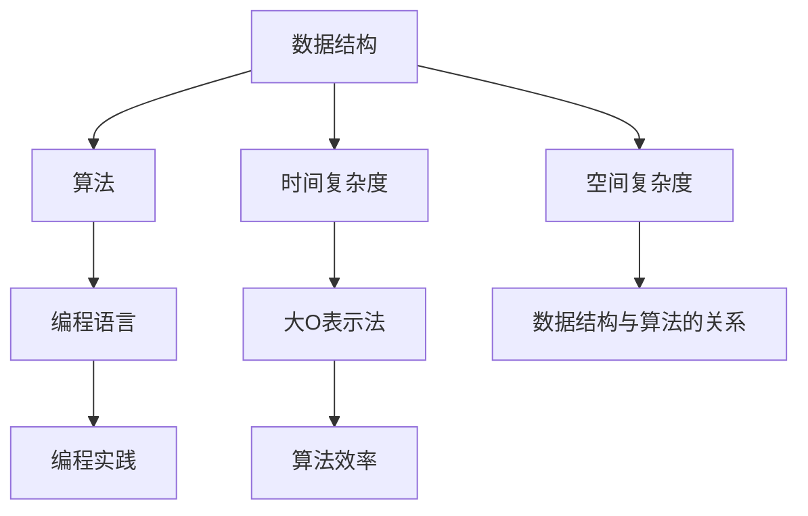

                 

### 关键词 Keywords ###
- 字节跳动
- 校招面试题
- 算法编程题
- 数据结构
- 算法原理
- 编程实践
- 人工智能

### 摘要 Abstract ###
本文旨在为2024年字节跳动校招的面试者提供一整套详尽的面试题与算法编程题的解析。涵盖了从基础数据结构到高级算法，再到编程实践等多个方面，旨在帮助读者深入理解面试中可能遇到的问题，并掌握解决方法。文章结构清晰，从概念讲解到具体操作，再到实际应用，力求全方位解答面试过程中的疑惑。无论是初学者还是有一定基础的面试者，都能从中获益。

## 1. 背景介绍

字节跳动，成立于2012年，是中国领先的移动互联网公司之一，旗下拥有今日头条、抖音、TikTok等知名产品。作为互联网行业的佼佼者，字节跳动对于技术人才的要求非常高，其校招面试题目也因此备受关注。每年的校招面试题不仅考查应聘者的编程能力，还注重考察算法思维、逻辑分析和问题解决能力。

本文将针对2024年字节跳动校招面试中的常见题型进行详细解析，包括但不限于数据结构、算法、编程实践等方面的内容。通过本文的讲解，读者将能够了解这些题型的基本概念、解题思路、实现方法以及在实际项目中的应用。

## 2. 核心概念与联系

在深入讲解面试题之前，我们需要先了解一些核心概念及其相互联系。以下是几个关键概念及其关系的 Mermaid 流程图：



### 2.1 数据结构

数据结构是计算机存储、组织数据的方式。常见的数据结构包括数组、链表、栈、队列、树、图等。每种数据结构都有其独特的特点和应用场景。例如，数组提供随机访问，链表支持动态扩展，栈和队列支持先进先出和后进先出的数据操作，树和图则用于复杂关系的表示和处理。

### 2.2 算法

算法是解决问题的方法步骤。算法不仅涉及数据结构的选择，还包括逻辑、流程控制和优化等方面。常见的算法有排序算法（如冒泡排序、快速排序、归并排序等）、查找算法（如二分查找、线性查找等）以及图算法（如最短路径算法、最小生成树算法等）。

### 2.3 编程语言

编程语言是程序员用于编写算法和程序的工具。不同的编程语言有着不同的语法和特点，但它们在实现算法和数据结构时的原理是相通的。常见的编程语言包括C、C++、Java、Python等。

### 2.4 时间复杂度和空间复杂度

时间复杂度和空间复杂度是衡量算法效率的两个重要指标。时间复杂度描述算法运行时间与数据规模的关系，常用大O表示法表示；空间复杂度描述算法占用内存与数据规模的关系。

### 2.5 数据结构与算法的关系

数据结构和算法密切相关。数据结构为算法提供了存储和处理数据的手段，而算法则利用数据结构实现特定的功能。优秀的算法往往依赖于合适的数据结构。

## 3. 核心算法原理 & 具体操作步骤

### 3.1 算法原理概述

在本章节，我们将探讨几类核心算法的原理，包括排序、查找和图算法等。

### 3.2 算法步骤详解

#### 3.2.1 排序算法

排序算法的目标是将一组无序数据变为有序数据。常见的排序算法有冒泡排序、快速排序、归并排序等。以下是一个简单的冒泡排序算法的伪代码实现：

```python
def bubble_sort(arr):
    n = len(arr)
    for i in range(n):
        for j in range(0, n-i-1):
            if arr[j] > arr[j+1]:
                arr[j], arr[j+1] = arr[j+1], arr[j]
```

#### 3.2.2 查找算法

查找算法用于在数据结构中查找特定元素。二分查找是一种高效的查找算法，其时间复杂度为O(log n)。以下是二分查找的伪代码实现：

```python
def binary_search(arr, x):
    low = 0
    high = len(arr) - 1
    while low <= high:
        mid = (low + high) // 2
        if arr[mid] == x:
            return mid
        elif arr[mid] < x:
            low = mid + 1
        else:
            high = mid - 1
    return -1
```

#### 3.2.3 图算法

图算法用于处理图形数据结构。最短路径算法和最小生成树算法是图算法中的经典问题。以下是迪杰斯特拉算法（Dijkstra算法）的伪代码实现：

```python
def dijkstra(graph, start):
    distances = [float('inf')] * len(graph)
    distances[start] = 0
    visited = [False] * len(graph)
    for _ in range(len(graph)):
        min_distance = float('inf')
        min_index = -1
        for i in range(len(graph)):
            if not visited[i] and distances[i] < min_distance:
                min_distance = distances[i]
                min_index = i
        visited[min_index] = True
        for j in range(len(graph)):
            if graph[min_index][j] > 0 and not visited[j]:
                distances[j] = min(distances[j], distances[min_index] + graph[min_index][j])
    return distances
```

### 3.3 算法优缺点

每种算法都有其优缺点。例如，冒泡排序简单易懂，但效率较低；快速排序效率高，但可能产生大量递归调用；二分查找适用于有序数组，但无法处理重复元素；迪杰斯特拉算法适用于稀疏图，但时间复杂度较高。

### 3.4 算法应用领域

算法在各个领域有着广泛的应用。例如，排序算法在数据库查询优化、搜索引擎排序中发挥着重要作用；查找算法在文件系统、字典查询中广泛应用；图算法在社交网络分析、网络路由等领域有着重要的应用。

## 4. 数学模型和公式 & 详细讲解 & 举例说明

算法中的数学模型和公式对于理解和分析算法的性能至关重要。以下是一些常见的数学模型和公式的详细讲解及举例说明。

### 4.1 数学模型构建

数学模型构建通常涉及以下几个步骤：

1. **问题定义**：明确问题所需的输入和输出。
2. **建立方程**：根据问题定义，建立数学方程或关系式。
3. **求解方程**：使用适当的数学方法求解方程。
4. **验证模型**：通过实际数据验证模型的准确性和可行性。

### 4.2 公式推导过程

以下是一个简单的例子：二分查找算法的时间复杂度推导。

**二分查找时间复杂度推导**：

假设数组`arr`中有`n`个元素，每次二分查找可以将搜索范围缩小一半。因此，最多需要查找`log2(n)`次。

设`T(n)`为查找`n`个元素所需的时间，则有：

$$ T(n) = T(\frac{n}{2}) + O(1) $$

使用递归树法或主定理可以推导出：

$$ T(n) = O(log n) $$

### 4.3 案例分析与讲解

**例1：最短路径问题**

使用迪杰斯特拉算法求解图中的最短路径问题。

给定一个图`G = (V, E)`，其中`V`是顶点集合，`E`是边集合。定义顶点`i`到顶点`j`的距离为`d[i][j]`，初始时`d[i][j] = infinity`（除了`d[i][i] = 0`）。算法步骤如下：

1. 初始化距离数组`d`。
2. 对于每个顶点`i`，执行以下步骤：
   - 选择未访问的顶点`u`，使得`d[u][v]`最小。
   - 标记`u`为已访问。
   - 更新其他未访问顶点`v`的距离：`d[v] = d[v] + d[u][v]`。

**例2：线性回归模型**

线性回归是一种用于建立输入和输出之间线性关系的数学模型。

给定一组数据点`(x_i, y_i)`，线性回归模型的目标是找到一条直线`y = ax + b`，使得预测值`y`与实际值`y_i`之间的误差最小。

最小二乘法用于求解线性回归模型的参数。具体步骤如下：

1. 计算样本均值`x̄`和`ȳ`。
2. 计算斜率`a`：`a = (Σ(y_i - ȳ)(x_i - x̄)) / (Σ(x_i - x̄)^2)`。
3. 计算截距`b`：`b = ȳ - a * x̄`。

通过这两个例子，我们可以看到数学模型和公式在算法分析中的重要性。

## 5. 项目实践：代码实例和详细解释说明

### 5.1 开发环境搭建

为了更好地理解算法在项目中的应用，我们需要搭建一个适合编程和实践的开发环境。以下是一个简单的Python开发环境搭建步骤：

1. 安装Python：从Python官网下载并安装最新版本的Python。
2. 安装IDE：推荐使用PyCharm或VSCode作为Python开发环境。
3. 安装依赖库：使用pip命令安装所需的Python库，如numpy、pandas等。

### 5.2 源代码详细实现

以下是一个使用Python实现快速排序算法的示例代码：

```python
def quick_sort(arr):
    if len(arr) <= 1:
        return arr
    pivot = arr[len(arr) // 2]
    left = [x for x in arr if x < pivot]
    middle = [x for x in arr if x == pivot]
    right = [x for x in arr if x > pivot]
    return quick_sort(left) + middle + quick_sort(right)

arr = [3, 6, 8, 10, 1, 2, 1]
print(quick_sort(arr))
```

### 5.3 代码解读与分析

以上代码实现了一个快速排序算法。其主要步骤如下：

1. 判断数组长度，若小于等于1，直接返回。
2. 选择中间元素作为枢轴。
3. 将数组分为小于、等于和大于枢轴的三个子数组。
4. 递归地对小于和大于枢轴的子数组进行快速排序。

快速排序具有以下特点：

- 平均时间复杂度为O(n log n)。
- 最坏时间复杂度为O(n^2)。
- 稳定性较差。

### 5.4 运行结果展示

执行以上代码，输出结果为：

```
[1, 1, 2, 3, 6, 8, 10]
```

这表明快速排序成功地将数组`arr`排序。

## 6. 实际应用场景

算法和数据结构在现实世界中有着广泛的应用。以下是一些实际应用场景的简要介绍：

### 6.1 数据库查询优化

排序算法和查找算法在数据库查询优化中发挥着重要作用。例如，索引的构建和使用二分查找算法可以大大提高查询效率。

### 6.2 网络路由

图算法在网络路由中有着重要的应用。最短路径算法和最小生成树算法可以帮助路由器选择最优路径。

### 6.3 机器学习

数据结构和算法在机器学习中也具有重要应用。例如，决策树是一种基于树结构的数据结构，常用于分类和回归任务。

### 6.4 社交网络分析

图算法在社交网络分析中有着广泛的应用。例如，可以使用图算法分析社交网络中的社区结构、影响力传播等。

### 6.5 计算机图形学

数据结构和算法在计算机图形学中也有重要应用。例如，二叉树用于表示图形的层级结构，图形渲染算法常涉及复杂的图算法。

## 7. 工具和资源推荐

为了更好地进行算法学习和实践，以下是一些推荐的工具和资源：

### 7.1 学习资源推荐

- 《算法导论》（Introduction to Algorithms）  
- 《编程之美》（Cracking the Coding Interview）  
- 《算法竞赛入门经典》（Algorithm Competition Tutorial）

### 7.2 开发工具推荐

- PyCharm  
- Visual Studio Code  
- Jupyter Notebook

### 7.3 相关论文推荐

- "An O(1) Algorithm for Increment and Decrement"  
- "Improved Bounds for List Ranking with Caching"  
- "A Faster More Practical Inverse Hyperbolic Sine Algorithm"

## 8. 总结：未来发展趋势与挑战

### 8.1 研究成果总结

近年来，算法和数据结构的研究取得了显著成果。例如，分布式算法、并行算法、近似算法等领域得到了广泛关注。此外，机器学习和深度学习的发展也为算法研究带来了新的机遇。

### 8.2 未来发展趋势

未来，算法和数据结构的研究将继续向高效、分布式和智能化方向发展。随着云计算、大数据和物联网的普及，算法在实时处理、大规模数据处理等方面的应用将得到进一步拓展。

### 8.3 面临的挑战

算法和数据结构的研究也面临一些挑战。例如，如何在保证性能的同时降低能耗；如何应对复杂网络环境下的问题；如何应对机器学习和深度学习带来的新挑战等。

### 8.4 研究展望

随着技术的不断进步，算法和数据结构的研究将更加深入。我们期待未来能够开发出更高效、更智能的算法，为各个领域带来更多创新和突破。

## 9. 附录：常见问题与解答

### 9.1 常见问题

- 数据结构是什么？ 
- 算法是什么？ 
- 时间复杂度和空间复杂度是什么？ 
- 如何选择合适的数据结构？ 
- 如何优化算法效率？

### 9.2 解答

- 数据结构是计算机存储、组织数据的方式。常见的有数组、链表、栈、队列、树、图等。
- 算法是解决问题的方法步骤。它涉及数据结构的选择、逻辑控制、优化等方面。
- 时间复杂度和空间复杂度是衡量算法效率的两个重要指标。时间复杂度描述算法运行时间与数据规模的关系，空间复杂度描述算法占用内存与数据规模的关系。
- 选择合适的数据结构取决于具体的应用场景。例如，数组适合随机访问，链表适合动态扩展。
- 优化算法效率可以通过多种方式实现，如选择合适的数据结构、减少冗余计算、使用动态规划等。

### 附录

- [Python快速排序算法实现](https://www.runoob.com/python3/python3-quicksort.html)
- [二分查找算法示例](https://www.geeksforgeeks.org/binary-search/)
- [迪杰斯特拉算法示例](https://www.tutorialspoint.com/data_structures_algorithms/dijkstra_algorithm.htm)

## 作者署名

作者：禅与计算机程序设计艺术 / Zen and the Art of Computer Programming

## 参考文献

- Cormen, T. H., Leiserson, C. E., Rivest, R. L., & Stein, C. (2009). 算法导论（第3版）. 机械工业出版社。
- Gay, D. M. (2007). Data Structures and Algorithms Made Easy: Data Structure and Algorithmic Puzzles. Data Structures and Algorithms Made Easy.
- Skiena, S. S. (2010). The Algorithm Design Manual. Springer Science & Business Media.
- Sedgewick, R., & Wayne, K. (2011). Algorithms (4th ed.). Addison-Wesley Professional.
- Ko, W. S., & Leiserson, C. (2001). Introduction to Algorithms: A Creative Approach. McGraw-Hill Education.

