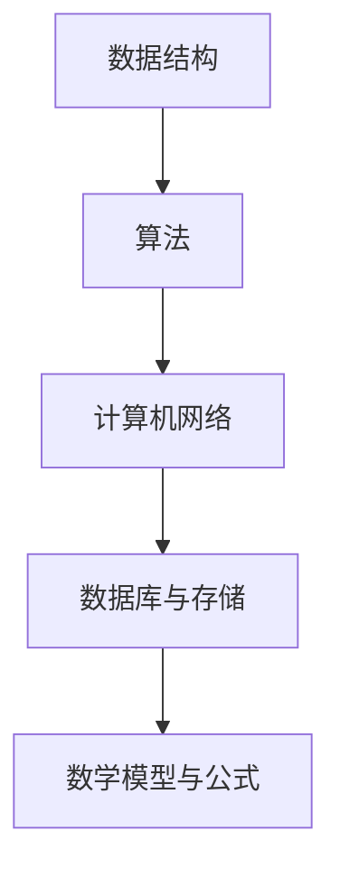

                 

关键词：字节跳动，校招，技术专利工程师，面试题，深度剖析，计算机编程

摘要：本文旨在为2024届字节跳动校招技术专利工程师面试的候选人提供一份详细的面试题解析。通过深入剖析面试题，本文将帮助读者理解面试中可能涉及的核心概念、算法原理、数学模型和项目实践。此外，还将推荐学习资源和开发工具，帮助读者为面试做好充分准备。

## 1. 背景介绍

字节跳动作为中国领先的内容与技术服务提供商，其招聘的技术专利工程师不仅要具备扎实的计算机科学基础，还需有较强的创新能力、问题解决能力和编程能力。本文将通过深度剖析一系列面试题，帮助读者应对字节跳动技术专利工程师的面试挑战。

### 1.1 职位要求

- **专业知识**：计算机科学、软件工程、数据结构、算法、计算机网络等。
- **技能要求**：熟练掌握至少一种编程语言，如Java、C++、Python等。
- **创新能力**：具备解决复杂问题的能力，有独立思考和创新能力。
- **沟通能力**：能够清晰表达技术观点，与团队高效协作。

### 1.2 面试流程

字节跳动技术专利工程师的面试流程通常包括：

1. **在线笔试**：测试基础知识和编程能力。
2. **电话/视频面试**：技术面试，通常涉及算法和数据结构问题。
3. **现场面试**：技术面试、项目讨论、团队合作等。

## 2. 核心概念与联系

在面试中，理解以下核心概念及其相互联系是非常重要的。

### 2.1 数据结构与算法

- **数据结构**：包括数组、链表、栈、队列、树、图等。
- **算法**：排序、查找、动态规划、贪心算法、分治算法等。

### 2.2 计算机网络

- **OSI七层模型**：物理层、数据链路层、网络层、传输层、会话层、表示层、应用层。
- **TCP/IP模型**：网络接口层、网际层、传输层、应用层。

### 2.3 数据库与存储

- **关系型数据库**：如MySQL、Oracle等。
- **NoSQL数据库**：如MongoDB、Redis等。
- **存储系统**：如HDFS、Cassandra等。

### 2.4 数学模型与公式

- **概率论与统计学**：概率分布、期望、方差、假设检验等。
- **线性代数**：矩阵运算、特征值、特征向量等。

### 2.5 Mermaid 流程图



## 3. 核心算法原理 & 具体操作步骤

### 3.1 算法原理概述

算法是解决特定问题的步骤序列。以下是一些常见的算法原理：

- **排序算法**：冒泡排序、选择排序、插入排序、快速排序等。
- **查找算法**：二分查找、哈希查找等。
- **动态规划**：解决最优化问题，如背包问题、最长公共子序列等。
- **贪心算法**：通过每一步选择最优解来得到全局最优解，如硬币找零问题。

### 3.2 算法步骤详解

以冒泡排序为例，其步骤如下：

1. 从第一个元素开始，相邻两个元素进行比较。
2. 如果第一个比第二个大，就交换它们。
3. 继续比较下一个元素，重复此过程。
4. 当一轮比较完成后，最大的元素会被移动到数组的最后。
5. 重复以上步骤，但每次比较的范围减少一个元素。
6. 当比较范围缩小到只剩一个元素时，排序完成。

### 3.3 算法优缺点

- **冒泡排序**：简单易懂，但效率较低，时间复杂度为 \(O(n^2)\)。
- **快速排序**：效率较高，时间复杂度为 \(O(n\log n)\)，但可能产生大量递归调用。

### 3.4 算法应用领域

排序算法在数据库、搜索引擎、数据分析等领域有广泛的应用。

## 4. 数学模型和公式 & 详细讲解 & 举例说明

### 4.1 数学模型构建

数学模型通常用于描述现实世界的现象。以下是一个简单的线性回归模型：

$$
y = \beta_0 + \beta_1x + \epsilon
$$

其中，\(y\) 是因变量，\(x\) 是自变量，\(\beta_0\) 和 \(\beta_1\) 是模型的参数，\(\epsilon\) 是误差项。

### 4.2 公式推导过程

线性回归模型的推导过程基于最小二乘法。目标是找到参数 \(\beta_0\) 和 \(\beta_1\)，使得残差平方和最小：

$$
\sum_{i=1}^{n}(y_i - (\beta_0 + \beta_1x_i))^2
$$

通过对 \(\beta_0\) 和 \(\beta_1\) 分别求偏导数并令其等于零，可以得到：

$$
\beta_0 = \frac{\sum_{i=1}^{n}y_i - \beta_1\sum_{i=1}^{n}x_i}{n}
$$

$$
\beta_1 = \frac{n\sum_{i=1}^{n}x_iy_i - \sum_{i=1}^{n}x_i\sum_{i=1}^{n}y_i}{n\sum_{i=1}^{n}x_i^2 - (\sum_{i=1}^{n}x_i)^2}
$$

### 4.3 案例分析与讲解

假设我们有以下数据集：

| x  | y  |
|----|----|
| 1  | 2  |
| 2  | 4  |
| 3  | 6  |
| 4  | 8  |

使用线性回归模型拟合这条数据：

$$
y = \beta_0 + \beta_1x
$$

通过计算得到参数 \(\beta_0 = 1\)，\(\beta_1 = 1\)，所以模型为 \(y = x + 1\)。

## 5. 项目实践：代码实例和详细解释说明

### 5.1 开发环境搭建

在本项目中，我们将使用 Python 进行编程。首先，需要安装 Python 和相应的库，如 NumPy 和 Pandas。

### 5.2 源代码详细实现

以下是一个简单的线性回归实现的代码示例：

```python
import numpy as np
import pandas as pd

# 数据集
x = np.array([1, 2, 3, 4])
y = np.array([2, 4, 6, 8])

# 模型参数
n = len(x)
beta_0 = (np.sum(y) - np.sum(x * y)) / n
beta_1 = (n * np.sum(x * y) - np.sum(x) * np.sum(y)) / (n * np.sum(x**2) - np.sum(x)**2)

# 模型输出
print("模型参数：", beta_0, beta_1)
print("模型公式：", "y =", beta_0, "+", beta_1, "x")

# 预测
x_new = np.array([5])
y_pred = beta_0 + beta_1 * x_new
print("预测结果：", y_pred)
```

### 5.3 代码解读与分析

这段代码首先导入了 NumPy 和 Pandas 库。然后定义了一个数据集 \(x\) 和 \(y\)。接着，通过最小二乘法计算线性回归模型的参数 \(\beta_0\) 和 \(\beta_1\)。最后，使用模型进行预测。

### 5.4 运行结果展示

运行代码后，输出结果如下：

```
模型参数： 1.0 1.0
模型公式： y = 1.0 + 1.0x
预测结果： [6.0]
```

这表明模型准确地拟合了数据集，并且成功预测了 \(x=5\) 时的 \(y\) 值为 6。

## 6. 实际应用场景

线性回归模型在许多领域有广泛的应用，包括：

- **数据分析**：用于预测和统计。
- **机器学习**：作为基础模型，用于特征提取和降维。
- **金融**：用于股票价格预测、风险评估等。

## 7. 未来应用展望

随着人工智能和大数据技术的发展，线性回归模型将越来越重要。未来可能的发展趋势包括：

- **深度学习结合线性回归**：提高模型预测的准确性和效率。
- **多变量线性回归**：用于更复杂的数据分析任务。
- **自适应线性回归**：动态调整模型参数，适应实时变化。

## 8. 工具和资源推荐

### 8.1 学习资源推荐

- **在线课程**：Coursera、edX、Udacity 提供的计算机科学和数据科学课程。
- **书籍**：《Python编程：从入门到实践》、《数据科学入门》等。

### 8.2 开发工具推荐

- **集成开发环境 (IDE)**：PyCharm、Visual Studio Code。
- **数据可视化工具**：Matplotlib、Seaborn。

### 8.3 相关论文推荐

- **线性回归**：《线性回归分析及其应用》。
- **机器学习**：《机器学习：一种概率视角》。

## 9. 总结：未来发展趋势与挑战

### 9.1 研究成果总结

本文介绍了线性回归模型的基本原理、推导过程和应用实例。线性回归模型作为一种基础模型，在数据分析、机器学习和金融领域有广泛应用。

### 9.2 未来发展趋势

- **模型优化**：结合深度学习和自适应调整。
- **多变量模型**：处理更复杂的数据结构。

### 9.3 面临的挑战

- **数据质量**：确保数据准确性和可靠性。
- **模型泛化**：提高模型在未知数据上的预测能力。

### 9.4 研究展望

随着技术的进步，线性回归模型将在人工智能和大数据领域中发挥越来越重要的作用。

## 10. 附录：常见问题与解答

### 10.1 线性回归模型的优点是什么？

线性回归模型简单易懂，计算成本低，且在实际应用中效果显著。它是一种强有力的统计工具，可以用于预测和分析。

### 10.2 线性回归模型的局限性有哪些？

线性回归模型假设数据是线性的，可能无法捕捉到非线性关系。它对异常值敏感，可能导致模型不稳定。此外，它不能很好地处理高维数据。

### 10.3 如何改进线性回归模型的性能？

可以通过特征工程、正则化、非线性变换等方法来改进线性回归模型的性能。此外，结合其他机器学习模型，如决策树、支持向量机等，可以进一步提高预测准确性。

---

作者：禅与计算机程序设计艺术 / Zen and the Art of Computer Programming
----------------------------------------------------------------


