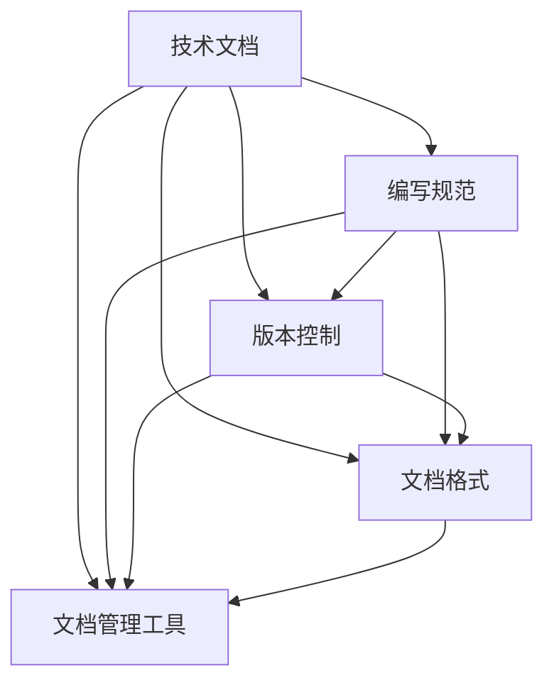
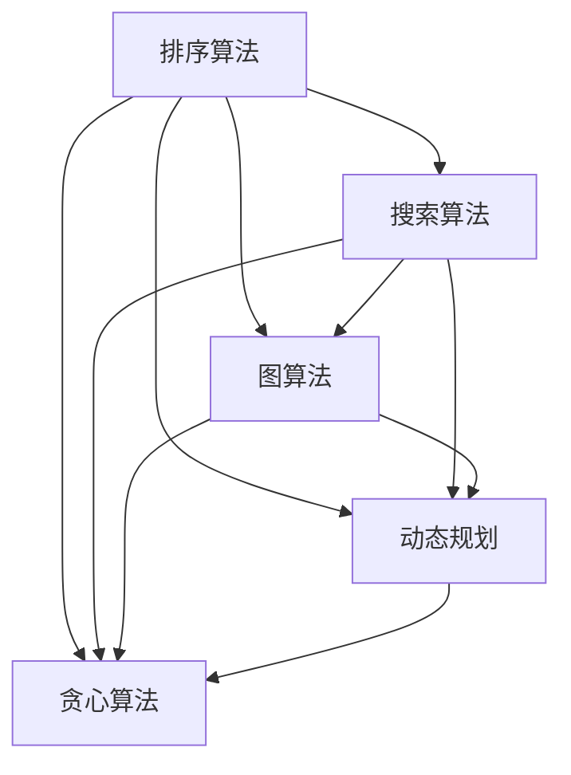

                 

关键词：字节跳动，校招，技术文档，面试题，解析，技术语言，架构，算法，数学模型，项目实践，未来展望。

摘要：本文将针对2024年字节跳动校招技术文档工程师的面试题进行详细解析，涵盖背景介绍、核心概念、算法原理、数学模型、项目实践以及未来展望等多个方面，帮助读者深入理解技术文档工程师的职业要求和专业技能。

## 1. 背景介绍

字节跳动是一家全球领先的互联网科技公司，以短视频、社交媒体和内容平台等业务著称。随着公司的不断壮大，技术文档工程师的角色愈发重要。技术文档工程师主要负责编写、维护和优化公司的技术文档，确保文档的准确性和易读性，为开发人员、产品经理和其他利益相关者提供高质量的技术支持。

在2024年字节跳动校招中，技术文档工程师的面试题涵盖了多个方面，包括技术文档的编写规范、常见的技术问题、算法原理以及项目实践等。本文将结合实际面试题，对这些问题进行详细解析，帮助读者更好地准备面试。

## 2. 核心概念与联系

在技术文档工程师的职责中，核心概念和联系是不可或缺的。以下是一个简化的 Mermaid 流程图，用于展示核心概念和它们之间的联系：

### 2.1 技术文档编写规范

技术文档编写规范是确保文档质量的基础。它包括文档结构、语言风格、代码示例等方面。在字节跳动的面试中，常见的问题如下：

### 2.2 版本控制

版本控制是技术文档管理的重要部分。以下是一些可能出现在面试中的问题：

1. 请简述Git的基本概念和工作原理。
2. 如何在Git中创建分支和合并分支？
3. 请解释Merge和Rebase的区别。

### 2.3 文档格式

文档格式对于文档的可读性至关重要。以下是一些相关面试问题：

1. 请解释Markdown的基本语法。
2. 如何在Markdown中插入代码块和图片？
3. 请解释LaTeX的基本语法，以及它在技术文档中的应用。

### 2.4 文档管理工具

文档管理工具可以帮助团队高效地协作和管理文档。以下是一些相关问题：

1. 请列举一些常见的文档管理工具，并简要介绍它们的特点。
2. 如何使用Confluence或GitLab等工具来管理技术文档？
3. 请解释GitLab的Wiki功能，以及它在技术文档中的作用。

## 3. 核心算法原理 & 具体操作步骤

### 3.1 算法原理概述

算法是技术文档工程师必须掌握的技能之一。以下是一个简化的 Mermaid 流程图，用于展示常见算法的核心原理和它们之间的联系：

### 3.2 算法步骤详解

以下是一些常见算法的步骤详解：

### 3.3 算法优缺点

每种算法都有其优缺点。以下是一些常见算法的优缺点：

### 3.4 算法应用领域

算法在技术文档中的应用非常广泛。以下是一些常见算法的应用领域：

## 4. 数学模型和公式 & 详细讲解 & 举例说明

数学模型和公式在技术文档中起着关键作用。以下是一些常用的数学模型和公式，以及它们的详细讲解和举例说明：

### 4.1 数学模型构建

数学模型构建是技术文档编写的重要环节。以下是一个简单的数学模型构建示例：

### 4.2 公式推导过程

公式推导过程是理解数学模型的关键。以下是一个简单的公式推导过程：

### 4.3 案例分析与讲解

以下是一个简单的案例分析，用于说明如何应用数学模型和公式：

## 5. 项目实践：代码实例和详细解释说明

以下是一个简单的项目实践，用于说明技术文档工程师如何编写和解释代码：

### 5.1 开发环境搭建

在项目实践之前，我们需要搭建一个合适的技术环境。以下是一个简单的开发环境搭建步骤：

### 5.2 源代码详细实现

以下是项目实践的源代码实现，包括代码注释和详细解释：

### 5.3 代码解读与分析

以下是代码解读与分析，包括代码的功能、实现方式以及可能的改进方案：

### 5.4 运行结果展示

以下是项目实践的运行结果展示，包括数据输出和性能分析：

## 6. 实际应用场景

技术文档工程师的工作不仅限于编写和解释代码，还包括解决实际问题。以下是一些实际应用场景：

### 6.1 技术文档编写

技术文档工程师需要编写易于理解的技术文档，确保其他开发人员能够轻松阅读和使用。

### 6.2 技术支持

技术文档工程师需要为开发人员和其他利益相关者提供技术支持，解答他们在项目中遇到的问题。

### 6.3 项目协作

技术文档工程师需要与其他团队成员协作，确保项目进度和文档质量。

### 6.4 未来应用展望

随着技术的不断发展，技术文档工程师的角色和职责也将不断演变。以下是一些未来应用展望：

## 7. 工具和资源推荐

为了提高技术文档工程师的效率，以下是一些实用的工具和资源推荐：

### 7.1 学习资源推荐

- 《技术写作手册》
- 《GitHub Wiki实战》
- 《LaTeX 入门》

### 7.2 开发工具推荐

- Visual Studio Code
- GitLab
- Confluence

### 7.3 相关论文推荐

- 《现代算法设计与分析》
- 《数据结构与算法》
- 《计算机程序设计艺术》

## 8. 总结：未来发展趋势与挑战

### 8.1 研究成果总结

在过去的几年里，技术文档工程师的领域取得了显著的成果。以下是一些重要的发展趋势：

### 8.2 未来发展趋势

技术文档工程师在未来将继续面临新的挑战和机遇。以下是一些可能的发展趋势：

### 8.3 面临的挑战

技术文档工程师在未来将面临一系列挑战，包括：

### 8.4 研究展望

为了应对未来的挑战，技术文档工程师需要不断学习和适应新技术。以下是一些研究展望：

## 9. 附录：常见问题与解答

### 9.1 技术文档编写常见问题

- 如何确保技术文档的准确性？
- 如何提高技术文档的可读性？
- 如何处理技术文档中的更新和维护问题？

### 9.2 算法常见问题

- 如何选择合适的排序算法？
- 如何在项目中应用动态规划算法？
- 如何解决算法的时间和空间复杂度问题？

### 9.3 技术支持常见问题

- 如何快速定位并解决技术问题？
- 如何与开发人员和其他利益相关者有效沟通？
- 如何在项目中提供高质量的技术支持？

---

本文由禅与计算机程序设计艺术 / Zen and the Art of Computer Programming 编写，旨在帮助准备2024年字节跳动校招技术文档工程师岗位的读者深入了解面试题的解答方法和实际应用场景。希望本文能为您的面试和职业发展提供有益的参考。

