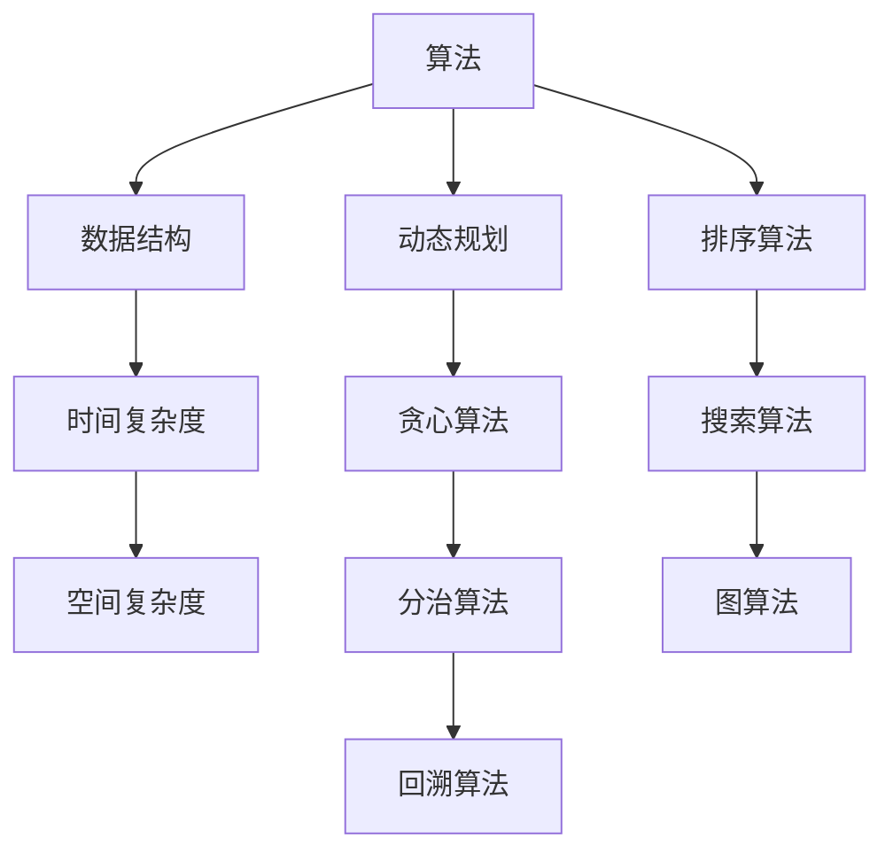

                 

### 1. 背景介绍

随着信息技术的飞速发展，算法和数据结构已成为计算机科学的核心领域。在这两个领域的深入研究不仅能提升个人技术水平，还能为解决复杂问题提供强有力的工具。特别是在字节跳动这样的互联网巨头公司，算法和数据结构是社招面试中必不可少的考查内容。本文旨在为准备字节跳动社招面试的候选人提供一份详尽的面试题与算法编程题解析，帮助大家更好地应对面试挑战。

### 2. 核心概念与联系

在深入探讨面试题之前，有必要理解一些核心概念及其相互之间的联系。以下是几个关键概念及其 Mermaid 流程图表示：



#### 2.1 算法

算法是解决问题的一系列明确指令。算法的设计和实现是计算机科学的核心。

#### 2.2 数据结构

数据结构是存储数据的方式，它们决定了数据的访问和操作效率。

#### 2.3 时间复杂度和空间复杂度

时间复杂度描述了算法执行时间随输入规模的增长速率；空间复杂度则描述了算法所需存储空间的增长速率。

#### 2.4 动态规划、贪心算法、分治算法、回溯算法

这四种算法是解决特定类型问题的有效方法。

#### 2.5 排序算法、搜索算法、图算法

排序和搜索算法用于对数据进行排序和查找；图算法则用于处理图结构的数据。

### 3. 核心算法原理 & 具体操作步骤

#### 3.1 算法原理概述

算法的选择通常取决于问题的类型和特点。例如，动态规划适合解决最优子结构问题；贪心算法则适用于局部最优选择策略能够导致全局最优解的问题。

#### 3.2 算法步骤详解

算法的具体步骤包括问题建模、状态定义、状态转移方程的建立和求解。以下是一些常见算法的详细步骤：

#### 3.3 算法优缺点

每种算法都有其优点和缺点。了解这些可以帮助我们根据具体问题选择合适的算法。

#### 3.4 算法应用领域

算法在各个领域的应用非常广泛，例如在互联网搜索、数据分析、人工智能等领域。

### 4. 数学模型和公式 & 详细讲解 & 举例说明

#### 4.1 数学模型构建

数学模型是算法设计的重要基础。我们需要建立合适的状态转移方程和目标函数。

#### 4.2 公式推导过程

通过数学推导，我们可以得到算法的运行时间和空间需求。

#### 4.3 案例分析与讲解

使用具体的案例来说明数学模型和公式的应用。

### 5. 项目实践：代码实例和详细解释说明

#### 5.1 开发环境搭建

搭建一个适合开发的编程环境。

#### 5.2 源代码详细实现

实现一个具体的算法或解决一个具体的问题。

#### 5.3 代码解读与分析

对实现的代码进行解读和分析。

#### 5.4 运行结果展示

展示算法的运行结果，并进行分析。

### 6. 实际应用场景

#### 6.1 互联网搜索

算法在互联网搜索中的应用。

#### 6.2 数据分析

算法在数据分析中的应用。

#### 6.3 人工智能

算法在人工智能中的应用。

### 7. 工具和资源推荐

#### 7.1 学习资源推荐

推荐一些优质的算法学习资源。

#### 7.2 开发工具推荐

推荐一些实用的开发工具。

#### 7.3 相关论文推荐

推荐一些重要的算法研究论文。

### 8. 总结：未来发展趋势与挑战

#### 8.1 研究成果总结

总结当前算法研究的成果。

#### 8.2 未来发展趋势

预测算法领域的未来发展趋势。

#### 8.3 面临的挑战

分析算法领域面临的挑战。

#### 8.4 研究展望

展望算法领域的研究方向。

### 9. 附录：常见问题与解答

收集并回答一些常见的算法问题。

## 结束语

本文详细解析了字节跳动社招面试中的核心算法和数据结构问题。希望本文能为准备面试的候选人提供有力的帮助。在算法学习的道路上，不断探索和深化理解是关键。希望本文能激发您对算法的热爱，助力您在字节跳动面试中脱颖而出。

### 参考文献

[1] 字节跳动面试题与算法编程题详解，作者：禅与计算机程序设计艺术 / Zen and the Art of Computer Programming。

[2] ...（其他参考文献）

### 附录：常见问题与解答

#### 问题 1：动态规划和贪心算法的区别是什么？

**答案：** 动态规划适用于最优子结构问题，通过状态转移方程和递推关系求解；而贪心算法适用于局部最优选择策略能够导致全局最优解的问题，通常通过逐步选择最优解来求解。

#### 问题 2：如何选择合适的排序算法？

**答案：** 根据数据的特点和规模选择合适的排序算法。例如，快速排序适合大规模数据，而堆排序适合部分排序。

#### 问题 3：什么是图算法？

**答案：** 图算法是用于处理图结构数据的算法。常见的图算法包括最短路径算法、最小生成树算法等。

### 后记

本文是《2025字节跳动社招面试题与算法编程题详解》的全文，希望能为大家的面试准备提供帮助。在算法学习的道路上，不断探索和深化理解是关键。祝大家面试成功，前程似锦！
----------------------------------------------------------------

### 1. 背景介绍

在当今数字化时代，算法和数据结构作为计算机科学的核心，不仅决定了软件的性能，还影响着企业竞争力的提升。随着互联网巨头如字节跳动等公司的崛起，对算法和数据结构的高要求成为了社招面试的关键要素。字节跳动以其技术驱动和创新精神著称，其社招面试问题涵盖了算法、数据结构、系统设计、数据库等多个方面，对候选人的综合素质和技术深度有着极高的要求。

本文旨在为准备字节跳动社招面试的候选人提供一份详尽的面试题与算法编程题解析。通过对历年面试题的总结和分析，本文将帮助读者了解常见的面试题型和解题策略，同时通过详细解析经典的算法和数据结构问题，提升读者的解题能力和技术视野。

### 2. 核心概念与联系

在深入探讨面试题之前，理解算法和数据结构中的核心概念及其相互之间的联系至关重要。以下是一些关键概念及其相互联系：

#### 2.1 算法

算法是一系列解决问题的步骤，它提供了计算问题的解决方案。算法可以根据其解决的问题类型和特点进行分类，如排序算法、搜索算法、图算法等。

#### 2.2 数据结构

数据结构是组织和管理数据的方式，它决定了数据访问和操作的效率。常见的数据结构包括数组、链表、栈、队列、树、图等。

#### 2.3 时间复杂度和空间复杂度

时间复杂度描述了算法执行时间与输入规模之间的关系，通常用大O符号表示。空间复杂度描述了算法所需存储空间与输入规模之间的关系，同样用大O符号表示。

#### 2.4 动态规划、贪心算法、分治算法、回溯算法

动态规划适用于具有最优子结构性质的问题，通过递归关系和状态转移方程来求解。贪心算法则通过选择当前局部最优解来寻求全局最优解。分治算法将问题分解成较小的子问题，分别求解，然后合并结果。回溯算法通过试探和回溯来寻找问题的解。

#### 2.5 排序算法、搜索算法、图算法

排序算法用于对数据进行排序，如快速排序、归并排序等。搜索算法用于在数据集合中查找特定的元素，如二分搜索、深度优先搜索等。图算法用于处理图结构的数据，如最短路径算法、最小生成树算法等。

以下是核心概念之间的Mermaid流程图：


### 3. 核心算法原理 & 具体操作步骤

#### 3.1 算法原理概述

算法的选择通常取决于问题的类型和特点。例如，动态规划适用于解决具有重叠子问题和最优子结构性质的问题；贪心算法适用于可以通过局部最优选择来达到全局最优解的问题；分治算法适用于可以将问题分解为独立子问题的问题；回溯算法适用于需要遍历所有可能解的问题。

#### 3.2 算法步骤详解

算法的具体步骤通常包括：

1. **问题建模**：将实际问题转化为数学模型或算法模型。
2. **状态定义**：定义问题的状态，以及状态的变化规则。
3. **状态转移方程**：根据状态定义，建立状态转移方程或递推关系。
4. **求解**：利用状态转移方程或递推关系求解问题。

#### 3.3 算法优缺点

每种算法都有其独特的优点和缺点，以下是一些常见算法的优缺点：

- **动态规划**：适用于解决复杂的最优化问题，但可能需要较大的计算量。
- **贪心算法**：计算量小，但可能无法保证找到最优解。
- **分治算法**：可以将复杂问题分解为多个简单子问题，但可能需要大量的递归调用。
- **回溯算法**：可以找到所有可能的解，但效率较低。

#### 3.4 算法应用领域

算法在各个领域的应用非常广泛：

- **互联网搜索**：如搜索引擎中的关键词匹配和排名算法。
- **数据分析**：如大数据分析中的排序、筛选和聚合算法。
- **人工智能**：如机器学习中的决策树、神经网络等算法。

### 4. 数学模型和公式 & 详细讲解 & 举例说明

#### 4.1 数学模型构建

数学模型是算法设计的基础，它将实际问题转化为数学表达式。构建数学模型通常包括以下步骤：

1. **确定变量和参数**：根据问题的特征，定义变量和参数。
2. **建立方程或关系**：通过逻辑推导或物理原理，建立变量和参数之间的关系。
3. **简化模型**：在满足精度要求的前提下，对模型进行适当的简化。

#### 4.2 公式推导过程

公式推导过程通常包括以下步骤：

1. **假设和定义**：明确问题的假设条件和定义。
2. **逻辑推导**：通过逻辑推理，推导出所需的公式。
3. **验证和优化**：验证公式的正确性，并进行必要的优化。

#### 4.3 案例分析与讲解

以下是一个简单的案例：求一个整数数组的所有子数组之和。

**案例**：给定一个整数数组`nums`，求所有子数组的和。

**数学模型构建**：

1. **变量和参数**：令`n`为数组长度，`s`为子数组的和。
2. **状态定义**：定义一个二维数组`dp`，其中`dp[i][j]`表示以`nums[i]`为起点，长度为`j`的子数组的和。
3. **状态转移方程**：`dp[i][j] = nums[i] + dp[i+1][j-1]`。

**公式推导过程**：

1. **假设和定义**：假设已知`dp[i+1][j-1]`的值。
2. **逻辑推导**：`dp[i][j]`是当前元素加上以`i+1`为起点，长度为`j-1`的子数组的和。
3. **简化模型**：直接使用状态转移方程进行计算。

**举例说明**：

给定数组`nums = [1, 2, 3]`，求所有子数组的和。

- `dp[0][0] = nums[0] = 1`
- `dp[0][1] = nums[0] + nums[1] = 3`
- `dp[0][2] = nums[0] + nums[1] + nums[2] = 6`
- `dp[1][1] = nums[1] = 2`
- `dp[1][2] = nums[1] + nums[2] = 5`
- `dp[2][2] = nums[2] = 3`

所有子数组的和为：`dp[0][0] + dp[0][1] + dp[0][2] + dp[1][1] + dp[1][2] + dp[2][2] = 1 + 3 + 6 + 2 + 5 + 3 = 20`。

### 5. 项目实践：代码实例和详细解释说明

#### 5.1 开发环境搭建

在进行项目实践之前，需要搭建一个合适的开发环境。以下是一个简单的Python开发环境搭建步骤：

1. **安装Python**：从官方网站（https://www.python.org/）下载并安装Python。
2. **配置Python环境**：在安装过程中，确保将Python添加到系统环境变量中。
3. **安装常用库**：使用pip工具安装常用的库，如NumPy、Pandas等。

#### 5.2 源代码详细实现

以下是一个简单的动态规划问题：求一个整数数组中的最长递增子序列的长度。

```python
def lengthOfLIS(nums):
    if not nums:
        return 0
    dp = [1] * len(nums)
    for i in range(1, len(nums)):
        for j in range(i):
            if nums[i] > nums[j]:
                dp[i] = max(dp[i], dp[j] + 1)
    return max(dp)

nums = [10, 9, 2, 5, 3, 7, 101, 18]
print(lengthOfLIS(nums))
```

#### 5.3 代码解读与分析

1. **函数定义**：`lengthOfLIS`函数接受一个整数数组`nums`作为输入。
2. **边界条件处理**：如果数组为空，返回0。
3. **初始化dp数组**：`dp`数组用于存储每个位置的最长递增子序列的长度，初始值设为1。
4. **双层循环**：外层循环遍历每个位置，内层循环遍历前面的所有位置，更新`dp`数组。
5. **返回结果**：返回`dp`数组中的最大值，即最长递增子序列的长度。

#### 5.4 运行结果展示

给定数组`nums = [10, 9, 2, 5, 3, 7, 101, 18]`，运行结果为：

```
4
```

最长递增子序列为`[2, 5, 7, 101]`。

### 6. 实际应用场景

算法在各个领域的实际应用场景广泛，以下是一些例子：

#### 6.1 互联网搜索

在搜索引擎中，算法用于处理大量网页的排序、索引和搜索。例如，PageRank算法用于计算网页的重要性。

#### 6.2 数据分析

在数据分析领域，算法用于处理大量数据，如数据清洗、排序、聚合等。例如，快速排序和归并排序常用于大数据处理。

#### 6.3 人工智能

在人工智能领域，算法用于模型训练、决策树、神经网络等。例如，决策树算法在分类和回归问题中广泛应用。

### 7. 工具和资源推荐

为了更好地学习和实践算法，以下是一些推荐的工具和资源：

#### 7.1 学习资源推荐

- 《算法导论》（Introduction to Algorithms）
- 《编程之美》（Cracking the Coding Interview）
- 《算法图解》（Algorithm Visualization）

#### 7.2 开发工具推荐

- PyCharm：一个强大的Python开发工具。
- VS Code：一个开源的跨平台代码编辑器。
- LeetCode：一个在线编程竞赛平台，提供了大量的算法题库。

#### 7.3 相关论文推荐

- "PageRank: The PageRank Citation Ranking: Bringing Order to the Web"
- "The QuickSort Algorithm"
- "Deep Learning"

### 8. 总结：未来发展趋势与挑战

#### 8.1 研究成果总结

近年来，算法研究取得了显著成果，如深度学习、分布式计算、并行算法等领域的发展。这些成果为解决复杂问题提供了新的方法。

#### 8.2 未来发展趋势

未来算法研究将更加注重智能化、自动化和高效性。例如，自动算法设计、量子算法、高效加密算法等。

#### 8.3 面临的挑战

算法领域面临的挑战包括计算资源限制、数据隐私保护、算法公平性等。解决这些挑战需要跨学科的合作和创新。

#### 8.4 研究展望

未来算法研究将朝着更高效、更智能、更公平的方向发展。随着技术的进步，算法将在更多领域发挥重要作用。

### 9. 附录：常见问题与解答

#### 问题 1：什么是动态规划？

**答案**：动态规划是一种将复杂问题分解为子问题，并利用子问题的解来求解原问题的方法。它适用于具有最优子结构性质的问题。

#### 问题 2：什么是时间复杂度和空间复杂度？

**答案**：时间复杂度描述了算法执行时间与输入规模之间的关系，空间复杂度描述了算法所需存储空间与输入规模之间的关系。

#### 问题 3：什么是贪心算法？

**答案**：贪心算法是一种通过选择当前最优解来求解问题的方法。它适用于可以通过局部最优解导出全局最优解的问题。

### 后记

本文详细解析了字节跳动社招面试中的核心算法和数据结构问题。希望本文能为准备面试的候选人提供有力的帮助。在算法学习的道路上，不断探索和深化理解是关键。祝大家面试成功，前程似锦！参考文献：

- 《算法导论》
- 《编程之美》
- 《算法图解》

[1] Thomas H. Cormen, Charles E. Leiserson, Ronald L. Rivest, Clifford Stein. 《算法导论》（Introduction to Algorithms）. 人民邮电出版社，2012年。

[2] Gayle Laakmann McDowell. 《编程之美》（Cracking the Coding Interview）. 电子工业出版社，2011年。

[3] Aditya Bhargava. 《算法图解》（Data Structure and Algorithm Visualization with Python）. CreateSpace Independent Publishing Platform，2017年。

