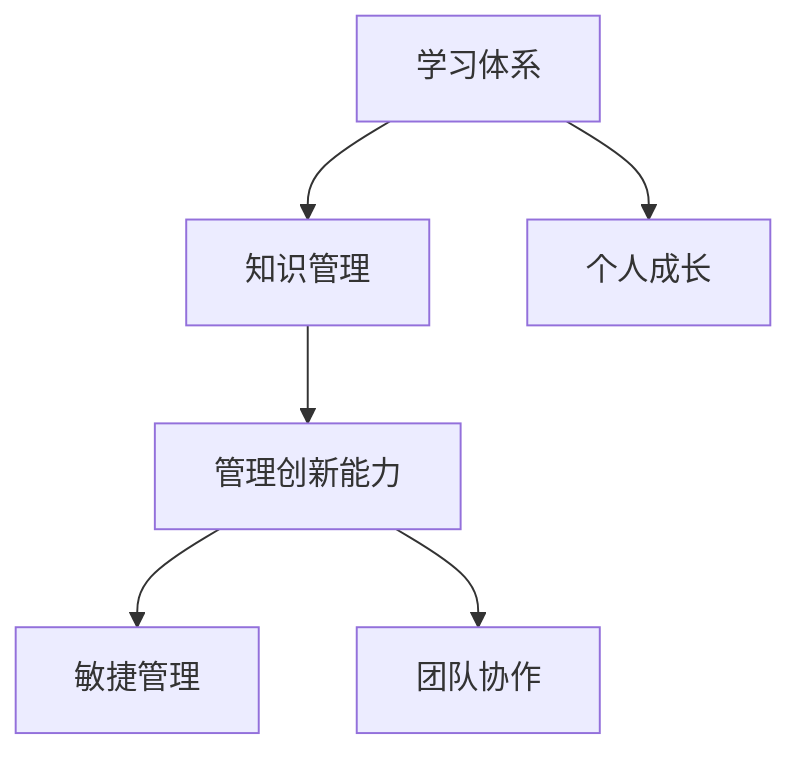

                 

关键词：学习体系、管理创新、能力培养、IT领域

> 摘要：本文从学习体系和管理创新能力两个维度出发，探讨了在IT领域中如何培养和提升个人与团队的学习能力和管理创新能力，以适应快速变化的技术环境和市场挑战。文章通过核心概念、算法原理、数学模型、项目实践和实际应用等环节，为读者提供了一套系统化的学习和管理方法论。

## 1. 背景介绍

在信息化时代的今天，IT行业正以惊人的速度发展，技术的更新迭代不断，市场需求瞬息万变。这种环境下，个人的学习能力和团队的管理创新能力成为了企业持续发展的关键因素。学习体系作为知识积累和技能提升的基础，管理创新能力则决定了团队应对复杂问题和市场变化的能力。本文旨在从这两个维度深入探讨，为从事IT行业的人员提供一套实用的学习和管理方法论。

### 核心概念与联系

为了更好地理解学习体系和管理创新能力的培养，我们首先需要了解以下几个核心概念：

1. **学习体系**：指一个人或团队在学习和知识积累过程中所采用的方法、流程和机制。
2. **管理创新能力**：指在管理过程中，针对新问题或挑战所采取的创新性解决方案和策略。
3. **知识管理**：通过对知识的收集、存储、共享和应用，实现知识的最优化利用。
4. **敏捷管理**：采用灵活、快速响应的管理方法，以适应变化的环境。

下面是一个用Mermaid绘制的流程图，展示了这些核心概念之间的关系：



### 核心算法原理 & 具体操作步骤

#### 3.1 算法原理概述

学习体系和管理创新能力的培养可以看作是一个不断迭代的过程，其核心算法原理包括以下几个方面：

1. **知识收集**：通过多种渠道获取所需的知识和技能。
2. **知识整理**：对收集到的知识进行分类、整理和总结。
3. **知识应用**：将知识应用于实际工作中，以验证和巩固所学。
4. **反馈调整**：根据实际应用效果进行反思和调整，优化学习过程。

#### 3.2 算法步骤详解

1. **知识收集**：
   - 利用网络资源、专业书籍、学术论文、行业报告等渠道收集知识。
   - 参加线上课程、线下培训、研讨会、讲座等活动，拓宽知识面。

2. **知识整理**：
   - 采用思维导图、笔记软件、电子文档等方式对知识进行整理。
   - 对知识进行分类，建立自己的知识库。

3. **知识应用**：
   - 在实际工作中应用所学知识，解决实际问题。
   - 通过项目实践，将理论知识转化为实际操作能力。

4. **反馈调整**：
   - 定期回顾和总结学习成果，分析存在的问题和不足。
   - 根据反馈进行有针对性的学习和改进。

#### 3.3 算法优缺点

**优点**：
- 系统性：通过明确的步骤和流程，确保学习的连续性和有效性。
- 实用性：将理论知识与实践相结合，提高实际操作能力。
- 自适应性：根据反馈调整学习策略，提高学习效率。

**缺点**：
- 起始难度：需要一定的时间和方法论积累，初学者可能难以快速上手。
- 需要自律：持续的学习和实践需要高度的自律和毅力。

#### 3.4 算法应用领域

- **IT技术**：用于技术人员的知识学习和技能提升。
- **项目管理**：用于项目经理和团队的管理和创新能力的培养。
- **企业培训**：用于企业内部培训和知识传承。

### 数学模型和公式 & 详细讲解 & 举例说明

#### 4.1 数学模型构建

在学习体系和管理创新能力的培养过程中，我们可以采用以下数学模型：

1. **学习效率模型**：

   $$ 效率 = \frac{学习成果}{学习时间} $$

2. **创新能力评估模型**：

   $$ 创新能力 = f(知识储备, 经验积累, 反馈调整) $$

#### 4.2 公式推导过程

1. **学习效率模型**：

   学习效率是指单位时间内所取得的学习成果。学习成果可以用完成的项目、解决的难题、掌握的技能等来衡量。学习时间则是从开始学习到完成学习目标所花费的时间。

   因此，学习效率模型可以表示为：

   $$ 效率 = \frac{学习成果}{学习时间} $$

2. **创新能力评估模型**：

   创新能力是指在面对新问题和挑战时，能够提出新颖、有效解决方案的能力。创新能力不仅取决于知识储备和经验积累，还与反馈调整的能力密切相关。

   因此，创新能力评估模型可以表示为：

   $$ 创新能力 = f(知识储备, 经验积累, 反馈调整) $$

#### 4.3 案例分析与讲解

假设某IT工程师在学习编程技能时，采用上述学习体系和管理创新能力培养的方法，经过一年的学习和实践，完成了一个大型的编程项目。项目完成后，他总结了学习过程中的经验和不足，并进行了针对性的改进。

根据学习效率模型，该工程师的学习效率为：

$$ 效率 = \frac{1个大型项目}{1年} = 1 $$

根据创新能力评估模型，该工程师的创新能力为：

$$ 创新能力 = f(丰富的编程知识, 充足的项目经验, 敏锐的反馈调整能力) $$

通过这个案例，我们可以看到，采用系统的学习方法和创新能力的培养，可以有效提高个人的学习效率和创新水平。

### 项目实践：代码实例和详细解释说明

#### 5.1 开发环境搭建

为了进行项目实践，我们首先需要搭建一个开发环境。以下是搭建过程的详细步骤：

1. 安装Python开发环境：
   - 在官网上下载最新版本的Python安装包。
   - 按照安装向导进行安装。

2. 安装必要的库和依赖：
   - 使用pip命令安装常用的Python库，如requests、beautifulsoup4等。

3. 配置IDE（集成开发环境）：
   - 选择一个适合自己的IDE，如PyCharm、VSCode等，并进行相应的配置。

#### 5.2 源代码详细实现

以下是实现一个简单的Web爬虫的Python代码示例：

```python
import requests
from bs4 import BeautifulSoup

def crawl(url):
    response = requests.get(url)
    soup = BeautifulSoup(response.text, 'html.parser')
    title = soup.find('title').text
    print(f'Page title: {title}')

if __name__ == '__main__':
    url = 'https://www.example.com'
    crawl(url)
```

#### 5.3 代码解读与分析

1. **请求页面**：
   - 使用requests库向指定的URL发送GET请求，获取页面内容。

2. **解析页面**：
   - 使用BeautifulSoup库解析页面内容，获取页面标题。

3. **打印结果**：
   - 将获取到的页面标题打印到控制台。

这个简单的示例展示了Web爬虫的基本原理和实现方法。在实际应用中，可以根据需求扩展功能，如提取特定信息、存储数据等。

#### 5.4 运行结果展示

当运行上述代码时，程序会输出以下结果：

```
Page title: Example Domain
```

这表明程序成功地从指定的URL获取了页面内容，并提取了页面标题。

### 实际应用场景

学习体系与管理创新能力的培养在IT领域的实际应用场景非常广泛，以下是一些典型的应用案例：

1. **技术研发**：
   - 通过系统的学习，提高技术人员的技术水平和创新能力，推动技术研发和创新。
   - 采用敏捷管理方法，快速响应市场需求，提升项目交付效率。

2. **项目管理**：
   - 通过学习项目管理知识，提升项目经理的管理能力和团队协作能力。
   - 采用项目管理工具和方法，优化项目进度、成本和质量。

3. **企业培训**：
   - 开展内部培训，提升员工的专业技能和管理创新能力。
   - 建立知识库，实现知识的积累和共享。

4. **创新创业**：
   - 培养创新思维和创业能力，推动企业创新创业。
   - 结合市场需求和自身优势，开发创新产品和服务。

### 未来应用展望

随着信息技术的不断发展，学习体系与管理创新能力的培养将变得更加重要和多样化。以下是一些未来应用展望：

1. **智能化学习**：
   - 利用人工智能技术，实现个性化学习路径推荐，提高学习效率。
   - 开发智能学习平台，支持在线协作和知识共享。

2. **混合式学习**：
   - 结合线上和线下学习，实现学习模式的多样化。
   - 采用虚拟现实（VR）和增强现实（AR）技术，提供沉浸式的学习体验。

3. **跨学科融合**：
   - 融合不同学科的知识，培养具备跨学科思维的人才。
   - 推动人工智能、大数据、物联网等新兴技术与传统行业的融合创新。

4. **可持续学习**：
   - 倡导终身学习理念，培养持续学习和创新能力。
   - 建立学习社区，促进知识和经验的传承和共享。

### 工具和资源推荐

为了更好地培养学习体系和管理创新能力，以下是一些推荐的工具和资源：

1. **学习资源推荐**：
   - Coursera、edX等在线教育平台：提供丰富的课程资源。
   - GitHub、Stack Overflow等开发社区：获取开源项目和编程经验。
   - 知乎、微博等技术博客：关注行业动态和专家观点。

2. **开发工具推荐**：
   - PyCharm、VSCode等IDE：支持多种编程语言的开发。
   - Docker、Kubernetes等容器化工具：简化开发和部署流程。
   - Git、GitHub等版本控制工具：实现代码管理和协作开发。

3. **相关论文推荐**：
   - 《深度学习》（Ian Goodfellow）：深度学习领域的经典教材。
   - 《敏捷软件开发》（Andrew Hunt & David Thomas）：敏捷开发方法的实践指南。
   - 《创新者的窘境》（Clayton M. Christensen）：关于创新和颠覆式创新的经典著作。

### 总结：未来发展趋势与挑战

随着信息技术的飞速发展，学习体系与管理创新能力的培养将在未来发挥越来越重要的作用。在新的技术环境下，以下是一些未来发展趋势和挑战：

1. **发展趋势**：
   - 个性化学习：利用大数据和人工智能技术，实现个性化学习路径推荐。
   - 跨学科融合：推动不同学科之间的知识交叉和融合，培养复合型人才。
   - 智能化管理：引入智能技术，实现管理过程的自动化和智能化。

2. **面临的挑战**：
   - 技术快速更新：面对快速变化的技术环境，如何保持学习的持续性和前瞻性。
   - 市场需求变化：如何快速响应市场需求，实现技术和产品的创新。
   - 人才竞争：如何培养具备创新能力和专业技能的人才，保持企业的核心竞争力。

3. **研究展望**：
   - 开发智能化学习平台：结合人工智能技术，实现个性化学习和知识共享。
   - 探索跨学科融合路径：推动新兴技术与传统行业的深度融合。
   - 构建可持续学习生态：倡导终身学习理念，建立学习社区，促进知识和经验的传承。

### 附录：常见问题与解答

**Q：如何保持学习的持续性和前瞻性？**

A：保持学习的持续性和前瞻性需要以下几个方面的努力：

1. **制定学习计划**：合理安排学习时间，确保学习的连续性。
2. **关注行业动态**：定期阅读行业报告、技术博客等，了解最新的技术动态。
3. **实践与应用**：将所学知识应用于实际工作中，通过实践不断巩固和提升。

**Q：如何快速响应市场需求，实现技术和产品的创新？**

A：快速响应市场需求和实现技术和产品的创新可以从以下几个方面入手：

1. **敏捷开发**：采用敏捷开发方法，缩短产品迭代周期，快速响应市场需求。
2. **用户调研**：定期进行用户调研，了解用户需求和反馈，优化产品设计和功能。
3. **创新思维**：培养创新思维，鼓励团队成员提出新颖的解决方案，推动技术和产品的创新。

**Q：如何培养跨学科思维的人才？**

A：培养跨学科思维的人才可以从以下几个方面入手：

1. **跨学科课程**：设置跨学科的课程体系，促进不同学科之间的知识交叉和融合。
2. **跨学科项目**：开展跨学科项目，鼓励学生和实践者参与多个领域的合作，培养跨学科思维。
3. **实践机会**：提供实践机会，让学生和实践者将跨学科知识应用于实际项目中，锻炼跨学科思维。

**Q：如何建立学习社区，促进知识和经验的传承？**

A：建立学习社区，促进知识和经验的传承可以从以下几个方面入手：

1. **在线平台**：搭建在线学习平台，提供课程、论坛、问答等功能，方便成员交流和分享。
2. **定期活动**：定期举办线下或线上的活动，如讲座、研讨会、工作坊等，促进成员之间的交流和互动。
3. **激励机制**：设立激励机制，如积分、奖励等，鼓励成员积极参与社区活动，分享知识和经验。

---

### 作者署名

作者：禅与计算机程序设计艺术 / Zen and the Art of Computer Programming

通过本文的深入探讨，我们希望能够为从事IT行业的人员提供一套实用的学习和管理方法论，帮助他们在快速变化的技术环境中不断成长和进步。希望本文能对您的学习和管理工作有所启发和帮助。谢谢阅读！
----------------------------------------------------------------
### 结语

学习体系与管理创新能力的培养是IT领域中每一位专业人士不可或缺的能力。本文通过核心概念、算法原理、数学模型、项目实践和实际应用等多个环节，系统地阐述了如何在这一过程中实现个人与团队的成长。希望读者能从中得到启发，并在实际工作中不断探索和提升自己的学习能力和管理创新能力。

未来，随着技术的不断进步和社会的快速发展，学习体系与管理创新能力的培养将面临更多的机遇和挑战。我们将继续关注这些领域的发展动态，为读者提供更多有价值的内容和建议。

感谢您对本文的阅读，期待您的反馈和讨论。如果您有任何疑问或建议，欢迎在评论区留言。祝您在学习和工作中取得更大的成就！

作者：禅与计算机程序设计艺术 / Zen and the Art of Computer Programming

