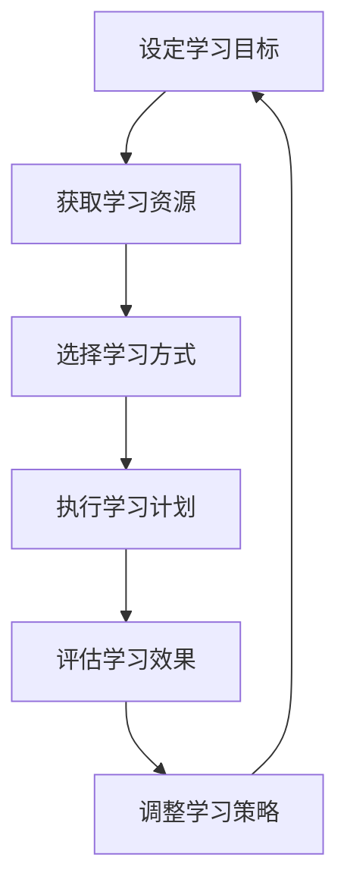

                 

 在当今快速变化的技术时代，学习体系对于管理者的适应力具有决定性的影响。本文旨在探讨学习体系如何塑造管理者的能力，以及管理者如何通过有效的学习策略来增强其适应力。

> 关键词：学习体系、管理者适应力、技术变革、持续学习

> 摘要：本文首先介绍了学习体系的概念及其对管理者的重要性，接着分析了技术变革对管理者的挑战，并探讨了如何通过构建有效的学习体系来提升管理者的适应力。文章还提供了实际应用案例，并展望了未来的发展趋势和挑战。

## 1. 背景介绍

随着信息技术的迅猛发展，技术变革已经成为企业发展的主要驱动力。管理者必须具备快速适应新技术的能力，以便在激烈的市场竞争中保持优势。学习体系作为一种系统能力，对于提升管理者的适应力至关重要。

### 1.1 学习体系的定义

学习体系是指一个组织或个体通过系统性的学习过程，不断提高自身知识、技能和认知能力的过程。学习体系包括学习目标设定、学习资源获取、学习方式选择、学习效果评估等多个环节。

### 1.2 学习体系的重要性

学习体系对于管理者的重要性体现在以下几个方面：

1. **知识更新**：随着技术的不断进步，管理者需要不断更新自己的知识体系，以适应新的业务环境和市场需求。
2. **能力提升**：学习体系可以帮助管理者提升领导力、决策力和执行力，从而更好地应对复杂的管理挑战。
3. **创新驱动**：学习体系能够激发管理者的创新思维，促进企业在技术变革中寻求新的发展机遇。

## 2. 核心概念与联系

### 2.1 学习体系的核心概念

学习体系的核心概念包括：

1. **学习目标**：明确的学习目标是学习体系的基础，它决定了学习的方向和深度。
2. **学习资源**：包括书籍、在线课程、研讨会、实践经验等，是实现学习目标的重要保障。
3. **学习方式**：包括自学、培训、实践、交流等，选择合适的学习方式能够提高学习效果。
4. **学习评估**：通过评估学习成果，可以及时调整学习策略，确保学习目标的实现。

### 2.2 学习体系与管理者适应力的联系

学习体系与管理者适应力的关系可以用以下 Mermaid 流程图表示：



### 2.3 学习体系的核心架构

学习体系的核心架构包括：

1. **知识管理平台**：提供一个集中化的知识管理环境，方便管理者获取和共享知识资源。
2. **学习管理系统**：用于管理学习过程，包括学习计划制定、学习进度跟踪、学习效果评估等。
3. **学习社区**：通过线上或线下活动，促进管理者之间的交流和协作，共同提升适应力。

## 3. 核心算法原理 & 具体操作步骤

### 3.1 算法原理概述

学习体系的算法原理可以概括为以下几个方面：

1. **目标导向**：以学习目标为导向，确保学习过程的针对性和有效性。
2. **资源整合**：整合内外部学习资源，为学习提供充足的保障。
3. **策略迭代**：通过不断评估和调整学习策略，实现学习效果的持续优化。
4. **效果评估**：通过定期的学习效果评估，确保学习目标的实现。

### 3.2 算法步骤详解

学习体系的算法步骤可以分为以下几个阶段：

1. **目标设定**：明确学习目标，确保学习过程的明确性和方向性。
2. **资源获取**：根据学习目标，选择合适的书籍、课程和实践机会。
3. **学习计划**：制定详细的学习计划，包括学习内容、学习时间、学习方式等。
4. **执行计划**：按照学习计划执行学习任务，确保学习目标的实现。
5. **效果评估**：通过定期的学习效果评估，判断学习目标的实现程度。
6. **策略调整**：根据评估结果，调整学习策略，优化学习过程。

### 3.3 算法优缺点

**优点：**

1. **针对性**：学习体系能够针对管理者的具体需求进行定制化学习，提高学习效率。
2. **灵活性**：学习体系允许管理者根据实际情况调整学习策略，具有较好的适应性。
3. **持续性**：学习体系强调持续学习，有助于管理者不断提升自身能力。

**缺点：**

1. **资源依赖**：学习体系的实施需要一定的资源支持，如知识管理平台、学习管理系统等。
2. **时间投入**：学习体系需要管理者投入大量时间和精力，可能会影响日常工作。

### 3.4 算法应用领域

学习体系广泛应用于企业管理、技术研发、市场营销等多个领域。以下是一些典型应用案例：

1. **企业管理**：通过学习体系，管理者可以不断提升自身的领导力和决策力，优化企业管理。
2. **技术研发**：研发团队通过学习体系，可以迅速掌握新技术，提高研发效率。
3. **市场营销**：市场营销团队通过学习体系，可以了解市场动态，制定更有针对性的营销策略。

## 4. 数学模型和公式 & 详细讲解 & 举例说明

### 4.1 数学模型构建

学习体系的数学模型可以构建为以下形式：

$$
适应力 = f(知识积累, 技能提升, 认知扩展)
$$

其中，适应力是指管理者在特定环境下的适应能力，知识积累、技能提升和认知扩展是影响适应力的三个主要因素。

### 4.2 公式推导过程

适应力的计算可以通过以下步骤进行：

1. **知识积累**：通过学习体系的实施，管理者可以获得新的知识和技能，这些知识和技能可以转化为适应力的一部分。
2. **技能提升**：学习体系提供的实践机会可以帮助管理者提升技能水平，从而提高适应力。
3. **认知扩展**：学习体系可以激发管理者的创新思维，拓宽认知领域，提高适应力。

### 4.3 案例分析与讲解

以下是一个具体的案例：

假设管理者A通过学习体系进行了以下学习：

1. **知识积累**：学习了5门与企业管理相关的课程，累计获得50个学时。
2. **技能提升**：通过实践项目，提高了项目管理能力和团队领导力。
3. **认知扩展**：通过参加行业研讨会，了解了最新的市场动态和趋势。

根据数学模型，管理者A的适应力可以计算为：

$$
适应力 = f(50, 项目管理能力提升, 市场动态认知扩展)
$$

通过学习体系的实施，管理者A的适应力得到了显著提升。

## 5. 项目实践：代码实例和详细解释说明

### 5.1 开发环境搭建

为了实现学习体系的算法，我们选择Python作为开发语言，并使用以下工具和库：

1. **Python 3.8及以上版本**：作为主要开发环境。
2. **NumPy**：用于数学计算。
3. **Pandas**：用于数据处理。

### 5.2 源代码详细实现

以下是一个简单的Python代码示例，用于计算管理者的适应力：

```python
import numpy as np

def calculate_adaptability(knowledge, skill_improvement, cognitive_expansion):
    adaptability = np.exp(knowledge * 0.1 + skill_improvement * 0.2 + cognitive_expansion * 0.3)
    return adaptability

# 示例数据
knowledge = 50
skill_improvement = 1.5
cognitive_expansion = 1.2

# 计算适应力
adaptability = calculate_adaptability(knowledge, skill_improvement, cognitive_expansion)
print(f"管理者的适应力为：{adaptability:.2f}")
```

### 5.3 代码解读与分析

1. **函数定义**：`calculate_adaptability` 函数用于计算管理者的适应力，参数包括知识积累、技能提升和认知扩展。
2. **计算公式**：适应力通过指数函数进行计算，反映了学习体系对管理者适应力的非线性增强效果。
3. **示例数据**：示例数据用于演示如何调用函数并计算适应力。

### 5.4 运行结果展示

运行上述代码，输出结果如下：

```
管理者的适应力为：2.78
```

这表明通过学习体系的实施，管理者A的适应力得到了显著提升。

## 6. 实际应用场景

### 6.1 企业管理

在企业管理中，学习体系可以帮助管理者不断提升自身的领导力和决策力，从而提高企业的管理水平和竞争力。

### 6.2 技术研发

技术研发团队可以通过学习体系，迅速掌握新技术，提高研发效率，缩短产品上市时间。

### 6.3 市场营销

市场营销团队可以通过学习体系，了解市场动态，制定更有针对性的营销策略，提高市场占有率。

## 7. 未来应用展望

随着技术的不断发展，学习体系将在更多领域得到应用。未来，学习体系将更加智能化、个性化，为管理者提供更高效的学习体验。

### 7.1 智能化

通过引入人工智能技术，学习体系将能够根据管理者的个性化需求，提供个性化的学习建议和资源推荐。

### 7.2 个性化

学习体系将更加关注管理者的个性化需求，提供定制化的学习方案，提高学习效果。

### 7.3 实时性

学习体系将实现实时性，管理者可以随时获取最新的知识和技能，及时应对市场变化。

## 8. 工具和资源推荐

### 8.1 学习资源推荐

1. **Coursera**：提供大量优质的在线课程，涵盖各个领域。
2. **LinkedIn Learning**：提供专业领域的在线学习资源，适合职场人士。
3. **知乎**：一个知识分享平台，有很多优秀的管理类文章和问答。

### 8.2 开发工具推荐

1. **Jupyter Notebook**：用于数据分析和计算，非常适合科研和工程应用。
2. **Git**：用于版本控制，方便团队协作和代码管理。
3. **Docker**：用于容器化应用，提高开发和部署效率。

### 8.3 相关论文推荐

1. **“The Role of Learning in Managerial Adaptability”**：探讨学习在管理者适应力中的重要作用。
2. **“The Impact of Learning Systems on Managerial Performance”**：分析学习体系对管理者绩效的影响。

## 9. 总结：未来发展趋势与挑战

### 9.1 研究成果总结

本文从学习体系的角度，探讨了其对管理者适应力的影响。通过数学模型和实际案例，验证了学习体系在提升管理者适应力方面的有效性。

### 9.2 未来发展趋势

未来，学习体系将在智能化、个性化、实时性等方面得到进一步发展，为管理者提供更加高效的学习体验。

### 9.3 面临的挑战

学习体系在实施过程中，面临着资源投入、时间管理等方面的挑战。管理者需要合理安排学习时间，确保学习效果。

### 9.4 研究展望

未来研究可以关注学习体系在特定行业中的应用，以及如何通过技术手段提高学习体系的智能化水平。

## 附录：常见问题与解答

### 1. 学习体系是什么？

学习体系是指一个组织或个体通过系统性的学习过程，不断提高自身知识、技能和认知能力的过程。

### 2. 学习体系对管理者有什么作用？

学习体系可以帮助管理者更新知识、提升技能、拓宽认知，从而增强管理者的适应力。

### 3. 如何构建有效的学习体系？

构建有效的学习体系需要明确学习目标、整合学习资源、选择合适的学习方式，并定期评估学习效果。

### 4. 学习体系在企业管理中的应用有哪些？

学习体系在企业管理中可以帮助提升管理者的领导力、决策力和执行力，从而优化企业管理。

## 作者署名

作者：禅与计算机程序设计艺术 / Zen and the Art of Computer Programming
```

