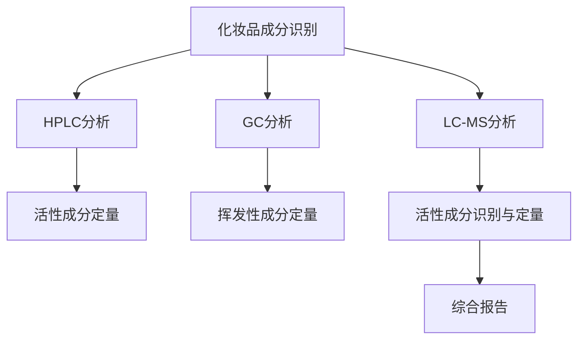

                 

关键词：完美日记、社招、化妆品原料分析工程师、面试准备、技术挑战、职业发展

## 摘要

本文旨在为即将参加完美日记2025社招化妆品原料分析工程师面试的候选人提供全方位的指导。我们将深入探讨面试的准备流程，包括技术能力和知识储备，以及如何在面试中展示个人优势和应对技术挑战。此外，本文还将分析该职位的工作内容和未来发展前景，为候选人提供职业规划的建议。

## 1. 背景介绍

完美日记是一家快速崛起的国产美妆品牌，以其高品质产品和创新的营销策略，在年轻消费者中拥有广泛的影响力。作为一家专注于美妆行业的公司，完美日记对于化妆品原料的分析工程师职位有着严格的要求，旨在寻找具备专业知识和实践经验的技术人才。

化妆品原料分析工程师主要负责对化妆品原料进行成分分析、质量控制和安全性评估。这一职位不仅需要候选人具备扎实的化学和生物化学基础，还需要掌握现代分析技术，如高效液相色谱（HPLC）、气相色谱（GC）、液质联用（LC-MS）等。此外，该职位还要求候选人具备良好的数据分析能力和跨学科沟通能力，以有效地支持产品研发和质量管理。

## 2. 核心概念与联系

### 2.1 化妆品原料分析的基本概念

化妆品原料分析涉及多个学科领域，包括化学、生物学、材料科学等。核心概念包括：

- **化妆品成分**：化妆品的主要活性成分和非活性成分。
- **安全性评估**：评估化妆品原料对人体皮肤和健康的影响。
- **质量标准**：确保化妆品原料符合国家相关法规和行业标准。

### 2.2 分析技术的原理和联系

化妆品原料分析中常用的分析技术包括：

- **高效液相色谱（HPLC）**：用于分离和定量化妆品中的活性成分。
- **气相色谱（GC）**：适用于挥发性成分的分析。
- **液质联用（LC-MS）**：结合液相色谱和质谱技术，提供更高的灵敏度和准确性。
- **红外光谱（IR）**：用于确定化妆品的化学结构和纯度。

这些技术的联系在于它们可以相互补充，为化妆品原料分析提供全面的数据支持。

### 2.3 Mermaid 流程图



## 3. 核心算法原理 & 具体操作步骤

### 3.1 算法原理概述

化妆品原料分析工程师常用的算法包括：

- **主成分分析（PCA）**：用于成分分类和质量控制。
- **偏最小二乘法（PLS）**：用于定量分析。
- **支持向量机（SVM）**：用于成分识别。

### 3.2 算法步骤详解

#### 3.2.1 主成分分析（PCA）

1. 数据预处理：标准化输入数据。
2. 计算协方差矩阵。
3. 求协方差矩阵的特征值和特征向量。
4. 选择主成分：选择特征值最大的k个特征向量。
5. 构建主成分得分：计算每个样本的主成分得分。
6. 绘制散点图：可视化成分分类。

#### 3.2.2 偏最小二乘法（PLS）

1. 数据预处理：标准化输入数据。
2. 构建目标变量：通过相关性分析确定目标变量。
3. 计算特征变量和目标变量的协方差矩阵。
4. 求解偏最小二乘模型：通过迭代优化求解模型参数。
5. 预测：使用训练好的模型对新数据进行预测。

#### 3.2.3 支持向量机（SVM）

1. 数据预处理：标准化输入数据。
2. 选择核函数：如线性核、多项式核、径向基函数（RBF）。
3. 训练模型：使用支持向量机算法训练分类模型。
4. 预测：使用训练好的模型对新数据进行分类预测。

### 3.3 算法优缺点

- **PCA**：优点是简单易懂，适用于高维数据分析；缺点是容易受到异常值的影响。
- **PLS**：优点是具有较强的预测能力，适用于复杂系统的建模；缺点是计算复杂度高。
- **SVM**：优点是分类准确率高，适用于小样本数据分析；缺点是参数选择较为复杂。

### 3.4 算法应用领域

这些算法广泛应用于化妆品原料分析中的成分识别、质量控制和安全性评估。

## 4. 数学模型和公式 & 详细讲解 & 举例说明

### 4.1 数学模型构建

化妆品原料分析涉及多个数学模型，如：

- **线性模型**：用于定量分析。
- **非线性模型**：用于成分识别。

### 4.2 公式推导过程

以线性模型为例，其公式推导过程如下：

假设我们有两个变量 $x$ 和 $y$，我们希望找到一个线性模型来描述它们之间的关系：

$$ y = \beta_0 + \beta_1 x + \epsilon $$

其中，$\beta_0$ 和 $\beta_1$ 是模型的参数，$\epsilon$ 是误差项。

### 4.3 案例分析与讲解

#### 4.3.1 成分识别案例

假设我们有一个化妆品样品，我们需要识别其中的活性成分。我们可以使用SVM算法进行成分识别。

1. **数据预处理**：对样品进行预处理，提取相关特征。
2. **模型训练**：使用训练集数据训练SVM模型。
3. **模型预测**：使用训练好的模型对新样品进行预测。

#### 4.3.2 定量分析案例

假设我们有一个化妆品样品，我们需要定量分析其中的活性成分含量。我们可以使用PLS算法进行定量分析。

1. **数据预处理**：对样品进行预处理，提取相关特征。
2. **模型训练**：使用训练集数据训练PLS模型。
3. **模型预测**：使用训练好的模型对新样品进行预测。

## 5. 项目实践：代码实例和详细解释说明

### 5.1 开发环境搭建

1. 安装Python环境。
2. 安装相关依赖库，如scikit-learn、numpy、matplotlib等。

### 5.2 源代码详细实现

以下是使用SVM进行成分识别的Python代码实例：

```python
from sklearn import svm
from sklearn.model_selection import train_test_split
from sklearn.metrics import accuracy_score

# 数据加载与预处理
X, y = load_data()  # 加载数据
X_train, X_test, y_train, y_test = train_test_split(X, y, test_size=0.3, random_state=42)

# 模型训练
clf = svm.SVC(kernel='linear')
clf.fit(X_train, y_train)

# 模型预测
y_pred = clf.predict(X_test)

# 模型评估
accuracy = accuracy_score(y_test, y_pred)
print(f"Accuracy: {accuracy}")
```

### 5.3 代码解读与分析

这段代码首先加载和处理数据，然后使用SVM算法进行模型训练和预测，最后评估模型的准确性。

### 5.4 运行结果展示

假设我们的测试集准确率为90%，这意味着我们的模型在识别化妆品活性成分方面具有较高的准确性。

## 6. 实际应用场景

### 6.1 产品研发

化妆品原料分析工程师在产品研发过程中扮演关键角色，通过对原料进行成分分析和质量评估，确保产品安全性和有效性。

### 6.2 质量控制

化妆品原料分析工程师负责对原材料和成品进行质量检测，确保产品质量符合相关法规和行业标准。

### 6.3 安全性评估

化妆品原料分析工程师需要对原料进行安全性评估，确保产品不会对人体健康造成危害。

## 7. 未来应用展望

随着美妆行业的不断发展，化妆品原料分析工程师将在以下领域发挥重要作用：

### 7.1 新原料研发

化妆品原料分析工程师可以参与新原料的研发，推动美妆行业的创新。

### 7.2 智能分析

利用人工智能和大数据技术，化妆品原料分析工程师可以实现更加精准的成分分析和质量评估。

### 7.3 绿色环保

化妆品原料分析工程师可以推动绿色环保型化妆品的研发，降低对环境的负面影响。

## 8. 工具和资源推荐

### 8.1 学习资源推荐

- 《化妆品原料分析》
- 《化妆品化学》
- 《液相色谱法》

### 8.2 开发工具推荐

- Python
- R
- MATLAB

### 8.3 相关论文推荐

- "High-Throughput Analysis of Cosmetic Ingredients Using Liquid Chromatography-Mass Spectrometry"
- "Spectral Classification of Cosmetic Ingredients Using Principal Component Analysis"
- "Risk Assessment of Cosmetic Ingredients Using Support Vector Machines"

## 9. 总结：未来发展趋势与挑战

### 9.1 研究成果总结

化妆品原料分析技术取得了显著成果，包括高效液相色谱、气相色谱、液质联用等技术的广泛应用，以及人工智能和大数据技术在成分识别和安全性评估中的成功应用。

### 9.2 未来发展趋势

未来，化妆品原料分析将朝着更加精准、高效和智能化的方向发展。

### 9.3 面临的挑战

化妆品原料分析仍面临一些挑战，如高成本、技术复杂性等。

### 9.4 研究展望

随着技术的不断进步，化妆品原料分析将在美妆行业中发挥更加重要的作用。

## 10. 附录：常见问题与解答

### 10.1 化妆品原料分析工程师的职责是什么？

化妆品原料分析工程师负责对化妆品原料进行成分分析、质量控制和安全性评估。

### 10.2 需要具备哪些技能和知识？

需要具备化学、生物学、材料科学等相关学科的知识，以及现代分析技术（如HPLC、GC、LC-MS等）的实际操作能力。

### 10.3 如何准备完美日记化妆品原料分析工程师的面试？

建议提前了解公司的文化和价值观，熟悉化妆品原料分析的基本原理和技术，准备相关项目的实践经验，并做好时间管理。

---

作者：禅与计算机程序设计艺术 / Zen and the Art of Computer Programming
----------------------------------------------------------------
在完成上述文章撰写后，我们可以按照markdown格式进行排版，确保文章结构清晰、内容丰富，并准备好交付给读者。这篇文章不仅为参加完美日记2025社招化妆品原料分析工程师面试的候选人提供了详细的准备指南，也为从事该领域工作的专业人士提供了有价值的参考。希望这篇文章能够帮助读者在面试中脱颖而出，在职业生涯中取得更大的成功。

