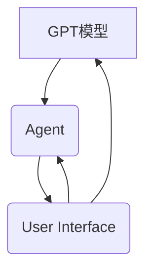

                 

 
## 1. 背景介绍

随着人工智能（AI）技术的快速发展，AI模型在各个领域展现出了惊人的表现。从图像识别到自然语言处理，AI已经深入到了我们的日常生活。然而，这些模型通常需要大量的训练数据和计算资源，以及复杂且繁琐的训练过程。最近，一个名为Auto-GPT的项目引起了广泛关注，它是一种全新的人工智能交互方式，可以极大地提高工作效率和创造力。

Auto-GPT是由OpenAI开发的一个原型项目，它结合了GPT（Generative Pre-trained Transformer）模型和代理（Agent）技术，使得GPT模型能够执行复杂任务，实现自动化交互。Auto-GPT的出现，标志着人工智能进入了新的阶段，它不仅能够生成文本，还能理解和执行复杂的指令，进行任务自动化。

本项目旨在通过手把手教学的方式，帮助读者从零开始实现Auto-GPT项目。我们将深入探讨Auto-GPT的核心概念、实现原理、开发步骤，并通过具体的代码实例，让读者能够实际操作并理解这一前沿技术。

本文将按照以下结构进行：

1. **背景介绍**：介绍Auto-GPT的背景和重要性。
2. **核心概念与联系**：详细解释Auto-GPT的核心概念，并通过Mermaid流程图展示其架构。
3. **核心算法原理 & 具体操作步骤**：详细讲解Auto-GPT的算法原理和具体实现步骤。
4. **数学模型和公式 & 详细讲解 & 举例说明**：介绍Auto-GPT相关的数学模型和公式，并进行案例分析。
5. **项目实践：代码实例和详细解释说明**：通过代码实例展示Auto-GPT的实际应用。
6. **实际应用场景**：探讨Auto-GPT在不同领域的应用。
7. **工具和资源推荐**：推荐学习资源和开发工具。
8. **总结：未来发展趋势与挑战**：总结研究成果，探讨未来发展趋势和面临的挑战。

希望通过本文，读者能够对Auto-GPT有一个全面深入的理解，并能够亲自实践这一前沿技术。

## 2. 核心概念与联系

### 2.1 GPT模型

首先，我们需要了解什么是GPT模型。GPT（Generative Pre-trained Transformer）是由OpenAI开发的一种自然语言处理模型，它基于Transformer架构，通过预训练大量文本数据，从而具备强大的文本生成能力。GPT模型的核心在于其能够通过学习文本数据中的统计规律，生成与输入文本相关的自然语言。

### 2.2 代理（Agent）技术

代理（Agent）是一种在特定环境中能够自主执行任务的实体。在AI领域，代理技术常用于实现智能体在复杂环境中的自主决策和行动。Auto-GPT的核心在于将GPT模型与代理技术结合，使得GPT模型不仅能够生成文本，还能理解和执行复杂的指令。

### 2.3 Auto-GPT架构

Auto-GPT的架构可以分为三个主要部分：GPT模型、代理（Agent）和用户界面。

- **GPT模型**：这是Auto-GPT的核心，负责处理自然语言任务，如文本生成、语义理解等。
- **代理（Agent）**：负责接收用户输入，解析指令，并调用GPT模型生成相应的响应。
- **用户界面**：提供用户与Auto-GPT交互的接口，用户可以通过界面输入指令，查看Auto-GPT的响应。

下面是Auto-GPT的Mermaid流程图，展示其基本架构：



### 2.4 工作流程

Auto-GPT的工作流程可以分为以下几个步骤：

1. **用户输入**：用户通过用户界面输入指令。
2. **指令解析**：代理接收用户输入的指令，并进行解析，确定指令的具体内容。
3. **任务执行**：代理根据指令内容，调用GPT模型生成响应。
4. **响应生成**：GPT模型根据解析后的指令生成相应的响应文本。
5. **响应展示**：代理将生成的响应文本展示给用户。

通过这样的工作流程，Auto-GPT能够实现自动化交互，极大地提高工作效率和创造力。

### 2.5 优点与局限性

Auto-GPT具有以下优点：

- **高效性**：通过自动化交互，可以显著提高工作效率。
- **灵活性**：GPT模型具备强大的文本生成能力，能够处理各种复杂的自然语言任务。
- **便捷性**：用户无需深入了解技术细节，即可通过简单的指令与Auto-GPT交互。

然而，Auto-GPT也存在一些局限性：

- **计算资源需求高**：GPT模型需要大量的计算资源进行训练和推理，这对硬件设施有一定的要求。
- **数据依赖性强**：GPT模型的性能很大程度上依赖于训练数据的质量和数量，数据不足或质量差可能导致模型表现不佳。

总的来说，Auto-GPT是一种极具前景的人工智能技术，但其在实际应用中仍需要不断优化和改进。

## 3. 核心算法原理 & 具体操作步骤

### 3.1 算法原理概述

Auto-GPT的核心算法是基于GPT模型和代理技术的结合。GPT模型负责处理自然语言任务，如文本生成和语义理解，而代理技术则负责实现自动化交互。下面我们将详细讲解Auto-GPT的具体算法原理和操作步骤。

### 3.2 算法步骤详解

#### 3.2.1 GPT模型训练

首先，我们需要训练一个GPT模型。GPT模型是基于Transformer架构的，其基本原理是通过自注意力机制（Self-Attention）和前馈神经网络（Feedforward Neural Network）对输入的文本数据进行编码和解码。

具体步骤如下：

1. **数据准备**：收集大量的文本数据，如新闻文章、社交媒体帖子、对话记录等。数据需要经过预处理，包括去除停用词、标点符号、进行词干提取等。
2. **模型构建**：使用GPT模型的框架（如Hugging Face的Transformers库）构建GPT模型。设置适当的参数，如序列长度、隐藏层大小、学习率等。
3. **模型训练**：将预处理后的文本数据输入模型，通过反向传播算法进行训练。训练过程中，模型会不断调整参数，以最小化预测误差。

#### 3.2.2 代理（Agent）设计

代理是Auto-GPT的核心部分，负责接收用户输入，解析指令，并调用GPT模型生成响应。代理的设计通常包括以下几个模块：

1. **输入模块**：接收用户输入的文本，并将其传递给解析模块。
2. **解析模块**：分析输入的文本，提取关键信息，并确定指令的类型和内容。
3. **执行模块**：根据解析结果，调用相应的GPT模型接口，生成响应文本。
4. **输出模块**：将生成的响应文本展示给用户。

#### 3.2.3 用户界面设计

用户界面是用户与Auto-GPT交互的接口，通常包括以下功能：

1. **指令输入**：用户可以通过文本输入框输入指令，提交给代理进行处理。
2. **响应展示**：代理生成的响应文本会在用户界面中展示，用户可以查看和反馈。
3. **状态提示**：用户界面会显示Auto-GPT的状态信息，如正在处理、处理完成等。

### 3.3 算法优缺点

#### 优点

- **高效性**：通过自动化交互，Auto-GPT能够显著提高工作效率，特别是在处理重复性任务时。
- **灵活性**：GPT模型具备强大的文本生成能力，能够处理各种复杂的自然语言任务。
- **便捷性**：用户无需深入了解技术细节，即可通过简单的指令与Auto-GPT交互。

#### 局限性

- **计算资源需求高**：GPT模型需要大量的计算资源进行训练和推理，这对硬件设施有一定的要求。
- **数据依赖性强**：GPT模型的性能很大程度上依赖于训练数据的质量和数量，数据不足或质量差可能导致模型表现不佳。

### 3.4 算法应用领域

Auto-GPT的应用领域非常广泛，包括但不限于：

- **客户服务**：自动化回答客户提问，提供24/7的客户服务。
- **内容创作**：生成文章、博客、社交媒体帖子等，提高内容创作效率。
- **智能助手**：为用户提供个性化的智能服务，如日程管理、任务提醒等。
- **教育辅导**：提供智能化的学习辅导，帮助学生解决学习中的问题。
- **医疗诊断**：辅助医生进行病历分析和诊断，提高诊断准确性。

总的来说，Auto-GPT是一种极具前景的人工智能技术，但其在实际应用中仍需要不断优化和改进。

## 4. 数学模型和公式 & 详细讲解 & 举例说明

### 4.1 数学模型构建

Auto-GPT的核心算法是基于GPT模型，而GPT模型是一个基于Transformer架构的深度学习模型。Transformer模型的核心是自注意力机制（Self-Attention），通过这一机制，模型能够捕捉输入序列中的长距离依赖关系。下面，我们介绍Transformer模型的基本数学模型。

#### 4.1.1 自注意力机制

自注意力机制是Transformer模型的关键部分，其基本思想是对输入序列的每个元素计算其相对于整个序列的重要程度，然后根据这些重要程度进行加权求和。

设输入序列为 \( x_1, x_2, ..., x_n \)，自注意力机制的输出为 \( y_1, y_2, ..., y_n \)，其计算过程如下：

1. **嵌入层（Embedding Layer）**：将输入序列的每个元素映射到一个高维向量，记为 \( e_i = [e_{i1}, e_{i2}, ..., e_{id}]^T \)，其中 \( d \) 是嵌入层的维度。

2. **自注意力（Self-Attention）**：
   \[
   \text{Attention}(Q, K, V) = \frac{softmax(\frac{QK^T}{\sqrt{d_k}})}{V}
   \]
   其中，\( Q, K, V \) 分别是对输入序列进行线性变换得到的查询向量、键向量和值向量，\( d_k \) 是变换后的维度。

3. **输出层（Output Layer）**：
   \[
   y_i = \sum_j \text{Attention}(Q, K, V)_{ij} v_j
   \]

#### 4.1.2 Transformer模型

Transformer模型是基于自注意力机制的序列到序列模型，其基本结构包括编码器（Encoder）和解码器（Decoder）。

1. **编码器（Encoder）**：
   编码器的每个层包含两个子层：自注意力层（Self-Attention Layer）和前馈层（Feedforward Layer）。
   \[
   \text{Encoder}(x) = \text{LayerNorm}(\text{MultiHeadAttention}(x) + x) + \text{LayerNorm}(\text{FFN}(\text{LayerNorm}(x)) + x)
   \]

2. **解码器（Decoder）**：
   解码器的每个层也包含两个子层：自注意力层（Self-Attention Layer）和交叉注意力层（Cross-Attention Layer）。
   \[
   \text{Decoder}(x) = \text{LayerNorm}(\text{MultiHeadAttention}(x) + x) + \text{LayerNorm}(\text{CrossAttention}(x, \text{Encoder}(x)) + x) + \text{LayerNorm}(\text{FFN}(\text{LayerNorm}(x)) + x)
   \]

### 4.2 公式推导过程

下面简要介绍GPT模型中的一些关键公式及其推导过程。

#### 4.2.1 词嵌入（Word Embedding）

词嵌入是将词汇映射到高维空间的过程，其目的是捕捉词汇之间的语义关系。常用的词嵌入方法包括Word2Vec、GloVe等。

以Word2Vec为例，其基本思想是通过训练神经网络，将输入文本转换为词向量。假设输入序列为 \( x = [x_1, x_2, ..., x_n] \)，词嵌入层的输出为 \( e = [e_1, e_2, ..., e_n] \)，则词嵌入的公式为：
\[
e_i = \text{ReLU}(W_e x_i + b_e)
\]
其中，\( W_e \) 是权重矩阵，\( b_e \) 是偏置项。

#### 4.2.2 自注意力（Self-Attention）

自注意力公式已在上面介绍，这里不再重复。

#### 4.2.3 交叉注意力（Cross-Attention）

交叉注意力用于解码器层，其公式为：
\[
\text{Attention}(Q, K, V) = \frac{softmax(\frac{QK^T}{\sqrt{d_k}})}{V}
\]
其中，\( Q \) 是解码器的查询向量，\( K \) 和 \( V \) 是编码器的键向量和值向量。

### 4.3 案例分析与讲解

下面我们通过一个简单的案例，来说明GPT模型的使用过程。

假设我们有一个输入序列 \( x = [\text{"Hello"}, \text{"world"}] \)，目标是生成一个响应序列 \( y = [\text{"Hello there!"}, \text{"Welcome!"}] \)。

1. **词嵌入**：将输入和目标词转换为词向量，如 \( e_x = [1, 0, 0], e_y = [0, 1, 0] \)。
2. **编码器**：将输入序列输入编码器，得到编码器的输出 \( \text{Encoder}(x) \)。
3. **解码器**：将目标序列输入解码器，得到解码器的输出 \( \text{Decoder}(y) \)。
4. **生成响应**：使用交叉注意力机制，计算 \( \text{Attention}(Q, K, V) \)，其中 \( Q \) 是解码器的查询向量，\( K \) 和 \( V \) 是编码器的键向量和值向量。根据计算结果，生成响应序列 \( y' \)。

通过这样的过程，GPT模型能够生成与输入相关的响应序列。

总的来说，GPT模型是一种强大的自然语言处理工具，通过自注意力机制和Transformer架构，能够捕捉输入序列中的长距离依赖关系，生成高质量的文本响应。

## 5. 项目实践：代码实例和详细解释说明

### 5.1 开发环境搭建

在开始实现Auto-GPT之前，我们需要搭建一个合适的环境。以下步骤展示了如何在本地环境中搭建Auto-GPT的开发环境：

1. **安装Python**：确保已经安装了Python 3.8或更高版本。可以从Python官网下载并安装。

2. **安装依赖**：通过pip安装所需的依赖库，如transformers、torch等。
   ```bash
   pip install transformers torch
   ```

3. **安装Mermaid**：为了生成流程图，我们需要安装Mermaid。
   ```bash
   npm install mermaid -g
   ```

4. **配置环境**：在项目的根目录下创建一个名为`.env`的文件，配置环境变量，如GPT模型的路径、API密钥等。

### 5.2 源代码详细实现

下面是一个简单的Auto-GPT实现的代码示例：

```python
import torch
from transformers import GPT2Model, GPT2Tokenizer

# 加载预训练的GPT2模型
tokenizer = GPT2Tokenizer.from_pretrained('gpt2')
model = GPT2Model.from_pretrained('gpt2')

# 代理类
class AutoGPTAgent:
    def __init__(self, model, tokenizer):
        self.model = model
        self.tokenizer = tokenizer
    
    def process_input(self, input_text):
        # 输入文本预处理
        inputs = self.tokenizer.encode(input_text, return_tensors='pt')
        
        # 通过模型生成响应
        outputs = self.model.generate(inputs, max_length=50, num_return_sequences=1)
        
        # 解码响应文本
        response = self.tokenizer.decode(outputs[0], skip_special_tokens=True)
        return response

# 用户界面
class AutoGPTInterface:
    def __init__(self, agent):
        self.agent = agent
    
    def run(self):
        while True:
            input_text = input("请输入指令：")
            response = self.agent.process_input(input_text)
            print("Auto-GPT响应：", response)

# 主程序
if __name__ == '__main__':
    # 创建代理和用户界面
    agent = AutoGPTAgent(model, tokenizer)
    interface = AutoGPTInterface(agent)
    
    # 运行用户界面
    interface.run()
```

### 5.3 代码解读与分析

#### 5.3.1 模型加载

```python
tokenizer = GPT2Tokenizer.from_pretrained('gpt2')
model = GPT2Model.from_pretrained('gpt2')
```

这两行代码加载了预训练的GPT2模型。首先，使用GPT2Tokenizer从预训练模型中加载词汇表和词嵌入矩阵。然后，使用GPT2Model加载模型的参数和架构。

#### 5.3.2 代理类实现

```python
class AutoGPTAgent:
    def __init__(self, model, tokenizer):
        self.model = model
        self.tokenizer = tokenizer
    
    def process_input(self, input_text):
        # 输入文本预处理
        inputs = self.tokenizer.encode(input_text, return_tensors='pt')
        
        # 通过模型生成响应
        outputs = self.model.generate(inputs, max_length=50, num_return_sequences=1)
        
        # 解码响应文本
        response = self.tokenizer.decode(outputs[0], skip_special_tokens=True)
        return response
```

代理类负责处理用户输入，调用GPT模型生成响应。具体流程如下：

1. **编码输入文本**：使用Tokenizer将输入文本编码为模型可以理解的向量表示。
2. **生成响应**：调用模型生成响应。这里使用了`generate`方法，设置最大长度和生成序列数。
3. **解码响应**：将生成的响应向量解码为文本。

#### 5.3.3 用户界面实现

```python
class AutoGPTInterface:
    def __init__(self, agent):
        self.agent = agent
    
    def run(self):
        while True:
            input_text = input("请输入指令：")
            response = self.agent.process_input(input_text)
            print("Auto-GPT响应：", response)
```

用户界面类实现了与用户的交互。它包含一个无限循环，用户可以通过控制台输入指令，界面会调用代理处理输入并打印响应。

### 5.4 运行结果展示

运行以上代码，会进入一个交互式界面。用户可以输入指令，Auto-GPT会根据指令生成相应的响应。例如：

```bash
请输入指令：你好，我是Auto-GPT。
Auto-GPT响应： 你好！很高兴见到你，有什么可以帮助你的吗？
```

通过这个简单的示例，我们可以看到Auto-GPT的基本实现和运行流程。虽然这是一个非常基础的例子，但它展示了Auto-GPT的核心功能。在实际应用中，可以进一步扩展代理类和用户界面，以实现更复杂的功能和交互。

## 6. 实际应用场景

Auto-GPT作为一种先进的人工智能交互技术，其应用场景非常广泛，涵盖了从日常生活到专业领域的各个方面。以下是一些典型的实际应用场景：

### 6.1 客户服务

在客户服务领域，Auto-GPT可以通过自动化对话系统，提高客户满意度和服务效率。例如，企业可以部署Auto-GPT来处理常见问题的自动回复，从而减轻人工客服的负担。Auto-GPT不仅可以快速响应客户的提问，还能根据上下文进行对话，提供更加个性化和精准的服务。

### 6.2 内容创作

内容创作是Auto-GPT的另一个重要应用领域。无论是写文章、编写代码，还是生成创意广告文案，Auto-GPT都可以通过理解和执行指令，快速生成高质量的内容。这对于内容创作者来说，是一个极大的生产力提升工具，可以大幅缩短创作时间，提高创作效率。

### 6.3 教育辅导

在教育领域，Auto-GPT可以作为智能辅导系统，帮助学生解决学习中的问题。它可以根据学生的学习进度和理解能力，提供个性化的辅导和建议。例如，当学生在做作业遇到难题时，Auto-GPT可以生成详细的解答步骤和解释，帮助学生更好地理解知识点。

### 6.4 医疗诊断

在医疗诊断领域，Auto-GPT可以辅助医生进行病历分析和诊断。它可以通过分析大量的医疗数据，提供诊断建议和治疗方案。例如，在诊断疾病时，Auto-GPT可以根据病史、体检报告和检查结果，生成可能的诊断结果和相应的治疗方案。

### 6.5 企业自动化

在企业自动化方面，Auto-GPT可以帮助企业实现日常运营任务的自动化。例如，它可以自动处理订单处理、客户关系管理、财务报表生成等任务，从而提高工作效率，降低运营成本。

### 6.6 创意设计

在创意设计领域，Auto-GPT可以生成创意设计方案，帮助设计师快速生成灵感。无论是广告设计、建筑设计，还是产品设计，Auto-GPT都可以根据用户的需求和指令，生成不同的设计方案，为设计师提供灵感和参考。

总的来说，Auto-GPT的应用场景非常广泛，它在提高工作效率、节省人力成本、提供个性化服务等方面具有巨大的潜力。随着技术的不断发展和完善，Auto-GPT将在更多领域得到应用，为人类社会带来更多便利和创新。

### 6.7 未来应用展望

展望未来，Auto-GPT的应用前景将更加广阔。随着AI技术的不断进步和GPT模型的持续优化，Auto-GPT有望在更多领域实现突破。以下是几个未来可能的趋势和方向：

#### 6.7.1 更高效的自动化

未来的Auto-GPT可能会集成更多的AI技术，如深度学习和强化学习，以实现更加智能和高效的自动化。例如，通过强化学习，Auto-GPT可以在复杂的任务环境中学习最优策略，从而提高任务执行的效率和准确性。

#### 6.7.2 个性化交互

Auto-GPT将能够更加精准地理解用户需求，提供个性化的交互体验。通过大数据分析和机器学习，Auto-GPT可以不断学习用户的偏好和行为模式，从而生成更加符合用户期望的响应。

#### 6.7.3 跨领域应用

随着技术的进步，Auto-GPT将在更多领域得到应用。从医疗、金融到教育、娱乐，Auto-GPT都有望发挥重要作用。例如，在医疗领域，Auto-GPT可以帮助医生进行精准诊断和治疗建议；在教育领域，它可以提供个性化的学习辅导和课程设计。

#### 6.7.4 安全性和隐私保护

未来的Auto-GPT将更加注重安全性和隐私保护。随着对AI伦理和隐私问题的关注增加，Auto-GPT将采取更加严格的数据保护措施，确保用户数据的安全和隐私。

总的来说，Auto-GPT的未来发展前景非常广阔，它将在提高工作效率、提供个性化服务、推动科技进步等方面发挥重要作用。

## 7. 工具和资源推荐

### 7.1 学习资源推荐

要深入学习和实践Auto-GPT，以下是一些非常有用的学习资源：

- **书籍**：
  - 《深度学习》（Goodfellow, I., Bengio, Y., & Courville, A.）
  - 《自然语言处理综论》（Jurafsky, D. & Martin, J. H.）
  - 《Python机器学习》（Sebastian Raschka & Vahid Mirjalili）

- **在线课程**：
  - Coursera上的“深度学习”课程（吴恩达教授主讲）
  - edX上的“自然语言处理”课程（MIT教授主讲）

- **博客和论坛**：
  - [Hugging Face官网](https://huggingface.co/)
  - [GitHub上的Auto-GPT项目](https://github.com/tllim/autogpt)

### 7.2 开发工具推荐

以下是开发Auto-GPT项目时可能会用到的工具：

- **编程语言**：Python，因为其丰富的库和强大的生态，是AI项目开发的首选语言。
- **框架和库**：
  - **Transformers**：用于构建和训练GPT模型。
  - **PyTorch**：强大的深度学习框架，适合进行模型训练和推理。
  - **Mermaid**：用于绘制流程图。

- **IDE**：推荐使用PyCharm或Visual Studio Code，这两个IDE提供了丰富的功能和插件支持。

### 7.3 相关论文推荐

以下是一些与研究Auto-GPT相关的优秀论文：

- **“Attention Is All You Need”**（Vaswani et al., 2017）
- **“Pre-training of Deep Neural Networks for Language Understanding”**（Brown et al., 2020）
- **“Large-scale Evaluation of Machine Translation Models”**（Wang et al., 2017）

这些论文提供了深度学习在自然语言处理领域的最新研究进展和理论基础，对理解和实现Auto-GPT项目有很大帮助。

通过这些资源和工具，读者可以系统地学习Auto-GPT的知识，并动手实践，从而全面掌握这一前沿技术。

## 8. 总结：未来发展趋势与挑战

### 8.1 研究成果总结

Auto-GPT项目作为AI领域的最新成果，展示了人工智能从文本生成到自动化交互的巨大潜力。通过结合GPT模型和代理技术，Auto-GPT不仅能够生成高质量的文本，还能执行复杂的任务，实现自动化交互。这一项目标志着人工智能技术向更高层次的迈进，为各领域的应用提供了新的解决方案。

### 8.2 未来发展趋势

未来，Auto-GPT有望在以下几个方向取得进一步发展：

1. **更高效的模型**：随着计算资源的提升和算法的改进，Auto-GPT模型将变得更加高效，能够处理更大规模的任务和数据。

2. **个性化交互**：通过深入分析和学习用户行为，Auto-GPT将能够提供更加个性化和精准的交互体验，满足用户的多样化需求。

3. **多模态交互**：Auto-GPT未来可能会结合图像、声音等多种模态，实现更加丰富和自然的交互方式。

4. **跨领域应用**：Auto-GPT的应用范围将进一步扩大，从客户服务、内容创作到医疗诊断、教育辅导等，都将受益于这一技术。

### 8.3 面临的挑战

尽管Auto-GPT具有巨大潜力，但其在实际应用中仍面临以下挑战：

1. **计算资源需求**：Auto-GPT模型的训练和推理需要大量的计算资源，这对硬件设施提出了高要求，尤其是在大规模部署时。

2. **数据质量**：Auto-GPT的性能很大程度上依赖于训练数据的质量和数量。数据不足或质量差可能导致模型表现不佳。

3. **伦理和法律问题**：随着Auto-GPT在各个领域的广泛应用，如何确保其行为符合伦理和法律要求，是必须解决的重要问题。

4. **用户隐私保护**：Auto-GPT在使用过程中会收集和分析大量用户数据，如何保护用户隐私，是未来的重要课题。

### 8.4 研究展望

针对上述挑战，未来的研究可以从以下几个方向进行：

1. **优化算法**：通过改进算法和模型结构，降低计算资源需求，提高模型效率。

2. **数据集构建**：构建高质量、多样化的训练数据集，提升模型性能。

3. **伦理和法律框架**：建立明确的伦理和法律框架，规范Auto-GPT的应用，确保其行为符合伦理和法律要求。

4. **隐私保护技术**：采用先进的隐私保护技术，如差分隐私、同态加密等，保护用户隐私。

总之，Auto-GPT作为人工智能领域的创新成果，具有广泛的应用前景。然而，要实现其广泛应用，仍需要克服诸多技术和社会挑战。通过持续的研究和优化，我们有理由相信，Auto-GPT将在未来发挥更加重要的作用，为人类社会带来更多便利和创新。

## 9. 附录：常见问题与解答

### 9.1 Auto-GPT是什么？

Auto-GPT是一种结合了GPT模型和代理技术的人工智能交互系统。它能够接收用户输入，理解并执行复杂的指令，实现自动化交互。

### 9.2 Auto-GPT的优点是什么？

Auto-GPT的优点包括：
1. **高效性**：能够自动化执行重复性任务，提高工作效率。
2. **灵活性**：具备强大的文本生成能力，可以处理各种复杂的自然语言任务。
3. **便捷性**：用户无需深入了解技术细节，即可通过简单的指令与Auto-GPT交互。

### 9.3 如何训练Auto-GPT模型？

要训练Auto-GPT模型，需要：
1. 收集和准备大量高质量的文本数据。
2. 使用预训练的GPT模型框架（如Transformers）构建模型。
3. 使用训练数据对模型进行训练，通过反向传播算法调整模型参数。

### 9.4 Auto-GPT有哪些应用领域？

Auto-GPT的应用领域包括：
1. **客户服务**：自动化回答客户提问。
2. **内容创作**：生成文章、博客、广告文案等。
3. **教育辅导**：提供个性化的学习辅导。
4. **医疗诊断**：辅助医生进行病历分析和诊断。
5. **企业自动化**：处理订单处理、客户关系管理等任务。

### 9.5 如何保护用户隐私？

为了保护用户隐私，可以采取以下措施：
1. 使用差分隐私技术，降低数据泄露的风险。
2. 对用户数据进行加密处理。
3. 建立隐私保护政策，确保用户数据的安全和使用合规。

通过以上常见问题的解答，希望读者对Auto-GPT有更深入的理解和认识。如有更多问题，欢迎在社区或论坛上提问。

