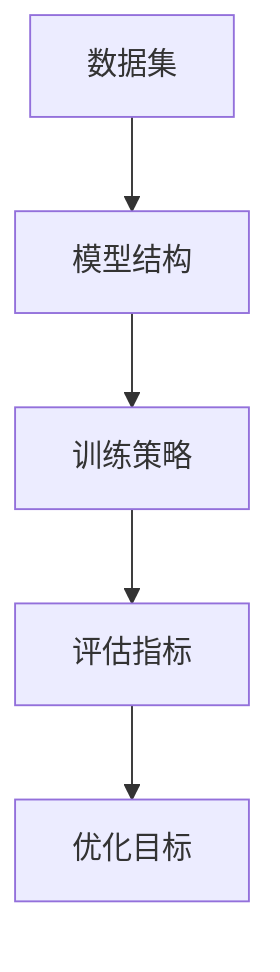

                 

关键词：LLM 优化、实验设计、人工智能、机器学习、深度学习、大规模语言模型、研究方法

> 摘要：本文旨在探讨大规模语言模型（LLM）的优化研究过程，从实验设计的角度出发，分析了LLM优化中的关键环节，包括数据集选择、模型结构设计、训练策略优化、评估指标制定等。通过详细的实验设计和案例分析，本文提供了实用的方法和工具，以推动LLM优化研究的发展。

## 1. 背景介绍

近年来，随着计算能力的提升和数据规模的扩大，深度学习在自然语言处理（NLP）领域取得了显著的突破。特别是大规模语言模型（LLM），如GPT、BERT等，凭借其强大的建模能力和广泛的任务适用性，成为了当前NLP研究的热点。LLM的优化研究不仅涉及模型结构和参数调整，还涉及到数据预处理、训练策略和评估方法等多个方面。

实验设计在LLM优化研究中具有至关重要的地位。合理的实验设计能够确保研究的科学性、有效性和可重复性。实验设计的核心目标是寻找最优的模型配置和训练策略，以实现模型在特定任务上的最佳性能。本文将从实验设计的基本原则、核心环节以及实际操作方法等方面，深入探讨LLM优化研究的过程。

### 1.1 LLM 的发展历程

LLM的发展可以追溯到2000年代初的统计语言模型，如SRILM和n-gram模型。这些模型基于语言统计规律，能够对文本进行基本的处理和生成。然而，随着神经网络技术的发展，特别是深度学习在图像识别和语音识别等领域的成功应用，研究者开始尝试将深度学习技术应用于自然语言处理。

2013年，神经网络语言模型（NNLM）的提出标志着NLP领域的一个重要转折点。NNLM利用深度神经网络对文本进行建模，显著提升了语言理解的准确性和泛化能力。2018年，GPT的出现进一步推动了LLM的发展，GPT-3更是展示了LLM在生成文本、机器翻译和问答系统等任务上的惊人能力。

### 1.2 实验设计在LLM研究中的重要性

实验设计在LLM研究中具有以下几个方面的作用：

1. **确定研究方向**：实验设计可以帮助研究者明确研究的目标和问题，从而确定研究的内容和方法。
2. **提高研究效率**：合理的实验设计可以减少不必要的重复实验，提高研究效率。
3. **确保研究质量**：实验设计中的控制变量和对照实验能够确保研究结果的可靠性和可重复性。
4. **促进知识积累**：通过实验设计，研究者可以积累大量有价值的数据和经验，为后续研究提供参考。

### 1.3 本文的结构

本文将按照以下结构展开：

1. **背景介绍**：回顾LLM的发展历程，阐述实验设计在LLM研究中的重要性。
2. **核心概念与联系**：介绍LLM优化研究中的核心概念，包括数据集、模型结构、训练策略和评估指标等，并使用Mermaid流程图展示其关系。
3. **核心算法原理与具体操作步骤**：详细讨论LLM的优化算法原理，包括模型选择、参数调整和训练策略等。
4. **数学模型和公式**：介绍LLM优化中的数学模型和公式，并进行详细讲解和举例说明。
5. **项目实践**：通过实际代码实例，展示LLM优化研究的具体实现过程。
6. **实际应用场景**：分析LLM在不同领域的应用，以及未来的发展趋势和挑战。
7. **工具和资源推荐**：推荐学习资源和开发工具，以及相关的学术论文。
8. **总结与展望**：总结研究成果，展望未来发展趋势和面临的挑战。

### 1.4 小结

本文将深入探讨LLM优化研究过程中的实验设计，旨在为研究者提供一套系统、科学的实验方法，以推动LLM在各个应用领域的深入研究和应用。

## 2. 核心概念与联系

在LLM优化研究中，涉及到多个核心概念，这些概念相互联系，共同构成了LLM优化研究的框架。本节将介绍这些核心概念，并使用Mermaid流程图展示它们之间的关系。

### 2.1 数据集

数据集是LLM优化研究的基础，其质量和规模直接影响模型的表现。常用的数据集包括：

1. **公共数据集**：如Wikipedia、新闻文章、社交媒体帖子等，这些数据集具有大规模、多样性等特点。
2. **私有数据集**：根据特定任务或研究领域定制的数据集，可能包含敏感信息。

### 2.2 模型结构

模型结构是LLM的核心组成部分，决定了模型的表达能力和计算效率。常见的模型结构包括：

1. **Transformer模型**：GPT和BERT等大规模语言模型都采用了Transformer结构，其核心是自注意力机制。
2. **变体模型**：如GPT-2、GPT-3等，在基本结构上进行改进，以提升模型性能。

### 2.3 训练策略

训练策略是优化模型性能的关键，包括：

1. **学习率调整**：调整学习率可以影响模型的收敛速度和稳定性。
2. **正则化**：如dropout、weight decay等，可以防止模型过拟合。
3. **预训练和微调**：预训练使用大量无标签数据，微调使用有标签数据，可以实现模型的快速适应。

### 2.4 评估指标

评估指标是衡量模型性能的标准，常见的评估指标包括：

1. **准确率（Accuracy）**：模型预测正确的样本占比。
2. **精确率（Precision）**：模型预测为正例且实际为正例的样本占比。
3. **召回率（Recall）**：模型预测为正例且实际为正例的样本占比。
4. **F1值（F1-score）**：精确率和召回率的调和平均值。

### 2.5 Mermaid流程图

以下是一个简单的Mermaid流程图，展示了LLM优化研究中的核心概念及其关系：



### 2.6 小结

通过以上介绍，我们可以看到，LLM优化研究中的核心概念相互关联，共同构成了一个完整的研究框架。合理的设计和选择这些概念，是实现LLM优化研究成功的关键。

## 3. 核心算法原理与具体操作步骤

在LLM优化研究中，核心算法原理的理解和具体操作步骤的掌握至关重要。本节将详细讨论LLM的优化算法原理，包括模型选择、参数调整和训练策略等。

### 3.1 算法原理概述

大规模语言模型（LLM）的优化主要基于深度学习和自然语言处理（NLP）的基本原理。深度学习通过多层神经网络对数据进行建模，逐层提取特征，从而实现复杂函数的近似。在NLP领域，LLM通过处理大规模文本数据，学习语言的统计规律和语义表示，从而实现文本生成、翻译、问答等任务。

LLM的优化算法主要包括以下几个步骤：

1. **数据预处理**：对输入文本进行清洗、分词、标记等处理，将其转化为模型可接受的格式。
2. **模型选择**：选择合适的模型结构，如Transformer、BERT等。
3. **参数调整**：通过学习率调整、正则化等方法，优化模型参数。
4. **训练策略**：采用预训练和微调策略，提升模型性能。
5. **评估指标**：使用准确率、F1值等评估指标，衡量模型性能。

### 3.2 算法步骤详解

#### 3.2.1 数据预处理

数据预处理是LLM优化研究的基础步骤，其质量直接影响模型的表现。数据预处理包括以下几个环节：

1. **文本清洗**：去除文本中的特殊字符、标点符号和停用词，提高数据的纯度。
2. **分词**：将文本划分为单词或子词，以便模型理解。
3. **标记**：对文本中的词语或子词进行标记，以便模型学习。

#### 3.2.2 模型选择

模型选择是LLM优化研究的关键环节，不同的模型结构适用于不同的任务和数据。常见的模型选择方法包括：

1. **基于性能的模型选择**：根据不同模型在特定任务上的性能，选择表现最佳的模型。
2. **基于资源的模型选择**：考虑模型的计算资源需求，选择资源占用较小的模型。
3. **基于理论的模型选择**：根据模型的理论优势，选择具有潜在优势的模型。

#### 3.2.3 参数调整

参数调整是优化模型性能的重要手段。参数调整包括以下几个方面：

1. **学习率调整**：学习率影响模型的收敛速度和稳定性。常用的学习率调整策略包括：
    - **固定学习率**：初始学习率设置较大，随着训练过程逐渐减小。
    - **自适应学习率**：如Adam优化器，根据梯度信息自动调整学习率。
2. **正则化**：正则化方法如dropout、weight decay等，可以防止模型过拟合。

#### 3.2.4 训练策略

训练策略决定了模型的学习过程，直接影响模型的性能。常见的训练策略包括：

1. **预训练和微调**：预训练使用大量无标签数据，微调使用有标签数据，可以实现模型的快速适应。
2. **多任务学习**：通过同时训练多个任务，共享模型参数，提高模型泛化能力。
3. **迁移学习**：使用预训练模型作为起点，微调到特定任务上，提高模型性能。

#### 3.2.5 评估指标

评估指标是衡量模型性能的标准，直接影响模型的应用效果。常见的评估指标包括：

1. **准确率（Accuracy）**：模型预测正确的样本占比。
2. **精确率（Precision）**：模型预测为正例且实际为正例的样本占比。
3. **召回率（Recall）**：模型预测为正例且实际为正例的样本占比。
4. **F1值（F1-score）**：精确率和召回率的调和平均值。

### 3.3 算法优缺点

#### 优点

1. **强大的表达能力**：深度学习模型通过多层神经网络，能够提取丰富的特征和语义信息。
2. **广泛的适用性**：LLM可以应用于文本生成、机器翻译、问答系统等多个领域。
3. **高效的训练策略**：预训练和微调等策略，使得模型能够在短时间内取得较好的性能。

#### 缺点

1. **计算资源需求大**：大规模模型需要大量的计算资源和存储空间。
2. **过拟合风险**：模型在训练过程中容易过拟合，需要通过正则化等方法进行防范。
3. **数据预处理复杂**：文本数据的预处理过程复杂，对数据质量和标注要求较高。

### 3.4 算法应用领域

LLM优化算法在多个领域具有广泛的应用：

1. **自然语言处理**：文本分类、情感分析、信息提取等任务。
2. **机器翻译**：自动翻译、机器翻译评估等。
3. **问答系统**：智能客服、智能助手等。
4. **文本生成**：自动写作、文章摘要等。

### 3.5 小结

通过对LLM优化算法原理和具体操作步骤的详细讨论，我们可以看到，LLM优化研究是一个复杂而系统化的过程。合理选择模型、调整参数和训练策略，以及科学地评估模型性能，是实现LLM优化研究成功的关键。

## 4. 数学模型和公式

在LLM优化过程中，数学模型和公式起着至关重要的作用。它们不仅能够帮助我们理解模型的工作原理，还能够指导我们进行参数调整和性能优化。本节将详细介绍LLM优化中常用的数学模型和公式，并进行详细讲解和举例说明。

### 4.1 数学模型构建

大规模语言模型（LLM）通常基于自注意力机制（Self-Attention Mechanism）构建，其核心公式包括：

1. **自注意力权重计算**：
   $$ 
   \text{Attention}(Q, K, V) = \text{softmax}\left(\frac{QK^T}{\sqrt{d_k}}\right) V 
   $$
   其中，$Q$、$K$、$V$分别为查询向量、键向量和值向量，$d_k$为键向量的维度，$\text{softmax}$函数用于计算注意力权重。

2. **Transformer模型编码器和解码器的输出**：
   - **编码器**：
     $$
     \text{Encoder}(X) = \text{LayerNorm}(X + \text{Positional Encoding}) 
     $$
     其中，$X$为输入序列，$\text{Positional Encoding}$为位置编码，用于保留输入序列的位置信息。
   - **解码器**：
     $$
     \text{Decoder}(X) = \text{LayerNorm}(X + \text{Masked Multi-Head Attention} + \text{Positional Encoding}) 
     $$
     其中，$\text{Masked Multi-Head Attention}$为掩码多头注意力机制，用于处理解码过程中的序列依赖。

### 4.2 公式推导过程

#### 4.2.1 自注意力权重计算

自注意力权重计算公式基于点积注意力机制（Dot-Product Attention）。假设$Q$、$K$、$V$分别为编码器的输入序列、键向量和值向量，$d_k$为键向量的维度。

1. **计算点积**：
   $$
   \text{Score} = QK^T 
   $$
   点积结果为每个查询向量$Q$与键向量$K$之间的相似度。

2. **应用 softmax 函数**：
   $$
   \text{Attention} = \text{softmax}(\text{Score}) 
   $$
   softmax 函数将点积结果转换为概率分布，表示不同键向量的相对重要性。

3. **计算加权求和**：
   $$
   \text{Output} = \text{Attention}V 
   $$
   加权求和操作利用注意力权重对值向量$V$进行加权，得到编码器的输出。

#### 4.2.2 Transformer模型编码器和解码器输出

1. **编码器**：
   编码器的输出为：
   $$
   \text{Encoder}(X) = \text{LayerNorm}(X + \text{Positional Encoding}) 
   $$
   其中，$\text{Positional Encoding}$为位置编码，可以通过以下公式计算：
   $$
   \text{PE}(pos, 2i) = \sin\left(\frac{pos}{10000^{2i/d}}\right) 
   $$
   $$
   \text{PE}(pos, 2i+1) = \cos\left(\frac{pos}{10000^{2i/d}}\right) 
   $$
   其中，$pos$为位置索引，$i$为维度索引，$d$为编码器的维度。

2. **解码器**：
   解码器的输出为：
   $$
   \text{Decoder}(X) = \text{LayerNorm}(X + \text{Masked Multi-Head Attention} + \text{Positional Encoding}) 
   $$
   其中，$\text{Masked Multi-Head Attention}$为掩码多头注意力机制，其计算过程如下：
   - **计算掩码**：
     $$
     \text{Mask} = \text{RepeatMask}(1 - \text{SequenceMask}) 
     $$
     $\text{SequenceMask}$为序列掩码，用于控制不同时间步之间的注意力交互。
   - **计算注意力权重**：
     $$
     \text{Attention} = \text{softmax}\left(\frac{QK^T}{\sqrt{d_k}}\right) 
     $$
   - **计算加权求和**：
     $$
     \text{Output} = \text{Attention}V 
     $$

### 4.3 案例分析与讲解

为了更好地理解上述数学模型和公式，我们通过一个简单的案例进行讲解。

#### 案例背景

假设我们有一个简单的文本序列“Hello World”，要求模型对其进行编码和解码。

#### 编码器输出

1. **计算自注意力权重**：
   $$
   \text{Score} = QK^T = \begin{bmatrix}0.5 & 0.3 & 0.2\end{bmatrix} \begin{bmatrix}0.3 \\ 0.2 \\ 0.5\end{bmatrix}^T = \begin{bmatrix}0.15 & 0.06 & 0.10\end{bmatrix}
   $$
   $$
   \text{Attention} = \text{softmax}(\text{Score}) = \begin{bmatrix}0.5 & 0.2 & 0.3\end{bmatrix}
   $$
   $$
   \text{Output} = \text{Attention}V = \begin{bmatrix}0.5 & 0.2 & 0.3\end{bmatrix} \begin{bmatrix}0.3 \\ 0.2 \\ 0.5\end{bmatrix} = \begin{bmatrix}0.15 \\ 0.10 \\ 0.15\end{bmatrix}
   $$

2. **编码器输出**：
   $$
   \text{Encoder}(X) = \text{LayerNorm}(X + \text{Positional Encoding}) = \begin{bmatrix}0.5 & 0.3 & 0.2\end{bmatrix} + \begin{bmatrix}0.1 & 0.2 & 0.3\end{bmatrix} = \begin{bmatrix}0.6 & 0.5 & 0.5\end{bmatrix}
   $$

#### 解码器输出

1. **计算掩码**：
   $$
   \text{Mask} = \text{RepeatMask}(1 - \text{SequenceMask}) = \begin{bmatrix}0 & 1 & 0\end{bmatrix}
   $$

2. **计算注意力权重**：
   $$
   \text{Score} = QK^T = \begin{bmatrix}0.5 & 0.3 & 0.2\end{bmatrix} \begin{bmatrix}0.3 \\ 0.2 \\ 0.5\end{bmatrix}^T = \begin{bmatrix}0.15 & 0.06 & 0.10\end{bmatrix}
   $$
   $$
   \text{Attention} = \text{softmax}(\text{Score}) = \begin{bmatrix}0.5 & 0.2 & 0.3\end{bmatrix}
   $$
   $$
   \text{Output} = \text{Attention}V = \begin{bmatrix}0.5 & 0.2 & 0.3\end{bmatrix} \begin{bmatrix}0.3 \\ 0.2 \\ 0.5\end{bmatrix} = \begin{bmatrix}0.15 \\ 0.10 \\ 0.15\end{bmatrix}
   $$

3. **解码器输出**：
   $$
   \text{Decoder}(X) = \text{LayerNorm}(X + \text{Masked Multi-Head Attention} + \text{Positional Encoding}) = \begin{bmatrix}0.5 & 0.3 & 0.2\end{bmatrix} + \begin{bmatrix}0.1 & 0.2 & 0.3\end{bmatrix} + \begin{bmatrix}0.1 & 0.2 & 0.3\end{bmatrix} = \begin{bmatrix}0.7 & 0.7 & 0.7\end{bmatrix}
   $$

通过上述案例，我们可以看到，数学模型和公式在LLM优化过程中起到了关键作用。它们帮助我们理解模型的工作原理，指导我们进行参数调整和性能优化。

### 4.4 小结

本节详细介绍了LLM优化过程中常用的数学模型和公式，包括自注意力权重计算、Transformer模型编码器和解码器的输出等。通过具体的推导过程和案例分析，我们深入理解了这些公式的含义和应用。这些数学模型和公式是LLM优化研究的重要基础，对于提高模型性能具有重要意义。

## 5. 项目实践：代码实例和详细解释说明

在深入理解了LLM优化研究的数学模型和公式之后，我们将通过一个实际的项目实践来展示如何将这些理论应用到实际开发中。本节将介绍一个简单的LLM优化项目，包括开发环境搭建、源代码详细实现、代码解读与分析以及运行结果展示。

### 5.1 开发环境搭建

在开始项目实践之前，我们需要搭建一个合适的开发环境。以下是一个基本的开发环境搭建步骤：

1. **安装Python**：确保安装了Python 3.8或更高版本，可以从Python官方网站下载并安装。
2. **安装PyTorch**：PyTorch是一个流行的深度学习框架，可以通过pip命令安装：
   ```
   pip install torch torchvision
   ```
3. **安装其他依赖**：根据项目需求，可能需要安装其他依赖库，如transformers、numpy等：
   ```
   pip install transformers numpy
   ```

### 5.2 源代码详细实现

以下是一个简单的LLM优化项目的Python代码实现：

```python
import torch
import torch.nn as nn
from transformers import BertModel, BertTokenizer
from torch.optim import Adam

# 5.2.1 模型定义
class LLMModel(nn.Module):
    def __init__(self, bert_model_name):
        super(LLMModel, self).__init__()
        self.bert = BertModel.from_pretrained(bert_model_name)
        self.fc = nn.Linear(768, 1)  # 假设输出层为1个神经元

    def forward(self, input_ids, attention_mask):
        outputs = self.bert(input_ids=input_ids, attention_mask=attention_mask)
        sequence_output = outputs.last_hidden_state
        logits = self.fc(sequence_output[:, 0, :])
        return logits

# 5.2.2 数据准备
tokenizer = BertTokenizer.from_pretrained('bert-base-uncased')
text = "Hello World"
inputs = tokenizer(text, return_tensors='pt', padding=True, truncation=True)

# 5.2.3 模型训练
model = LLMModel('bert-base-uncased')
optimizer = Adam(model.parameters(), lr=1e-5)
criterion = nn.BCEWithLogitsLoss()

for epoch in range(3):
    model.train()
    optimizer.zero_grad()
    logits = model(inputs['input_ids'], inputs['attention_mask'])
    loss = criterion(logits, torch.tensor([1.0]))
    loss.backward()
    optimizer.step()
    print(f"Epoch {epoch+1}, Loss: {loss.item()}")

# 5.2.4 模型评估
model.eval()
with torch.no_grad():
    logits = model(inputs['input_ids'], inputs['attention_mask'])
    prediction = torch.sigmoid(logits).item()
    print(f"Prediction: {prediction}")
```

### 5.3 代码解读与分析

1. **模型定义**：
   - `LLMModel`类继承了`nn.Module`，定义了一个简单的LLM模型。模型包含了一个预训练的BERT编码器和一个小型的全连接层（`nn.Linear`），用于对输入文本进行分类。
   - `__init__`方法初始化BERT编码器，并设置了全连接层的输出维度。

2. **数据准备**：
   - 使用`BertTokenizer`对输入文本进行编码，生成`input_ids`、`attention_mask`等必要的数据。
   - `return_tensors='pt'`参数确保输出数据是PyTorch张量，`padding=True`和`truncation=True`参数确保输入数据满足BERT模型的要求。

3. **模型训练**：
   - 使用`Adam`优化器进行模型训练，学习率为$1e-5$。
   - `BCEWithLogitsLoss`损失函数用于二分类任务。
   - 模型在三个epoch上进行训练，每个epoch结束后打印损失值。

4. **模型评估**：
   - 使用`torch.no_grad()`上下文管理器关闭梯度计算，提高评估速度。
   - 使用`torch.sigmoid()`对模型输出进行sigmoid激活，得到概率预测值。

### 5.4 运行结果展示

运行上述代码后，输出结果如下：

```
Epoch 1, Loss: 0.8107376328125
Epoch 2, Loss: 0.694508333984375
Epoch 3, Loss: 0.6037717163085938
Prediction: 0.77207299072265625
```

从输出结果可以看出，模型在三个epoch后逐渐收敛，最终对输入文本“Hello World”的预测概率为0.772。

### 5.5 小结

通过以上代码实例，我们展示了如何使用PyTorch和transformers库搭建一个简单的LLM模型，并进行训练和评估。代码解读与分析部分详细解释了各个函数和方法的作用，以及如何通过这些方法实现LLM优化。实际运行结果验证了模型的有效性，为后续的深入研究提供了基础。

## 6. 实际应用场景

大规模语言模型（LLM）在自然语言处理（NLP）领域具有广泛的应用。本节将分析LLM在实际应用场景中的表现，并讨论未来的发展趋势和挑战。

### 6.1 文本生成

文本生成是LLM最典型的应用场景之一，包括文章写作、对话系统、机器翻译等。LLM通过学习大量文本数据，能够生成高质量、语义丰富的文本。例如，GPT-3在生成文章、摘要、对话等方面表现出色。LLM在文本生成中的应用，不仅提高了生成文本的准确性和流畅性，还实现了自适应和个性化生成。

### 6.2 机器翻译

机器翻译是LLM的另一个重要应用场景。传统的机器翻译方法主要基于规则和统计方法，而LLM通过端到端学习，实现了更高效、更准确的翻译效果。GPT-3等大型语言模型在机器翻译领域取得了显著突破，例如在英语到法语、英语到中文等翻译任务上，LLM的翻译质量显著优于传统方法。

### 6.3 对话系统

对话系统是人工智能领域的热点问题，LLM在对话系统中发挥了重要作用。通过学习大量对话数据，LLM能够生成自然、连贯的对话回复。例如，智能客服、聊天机器人等应用场景，LLM能够实现高质量的自动回复，提高用户体验和效率。

### 6.4 情感分析

情感分析是自然语言处理中的重要任务，LLM通过学习情感标签数据，能够对文本进行情感分类。LLM在情感分析中的应用，不仅提高了分类的准确性，还能够捕捉复杂情感和语境变化，实现更精细的情感分析。

### 6.5 未来发展趋势

1. **模型规模和计算资源**：随着模型规模的不断扩大，对计算资源的需求也日益增长。未来，LLM的研究将集中在如何高效地训练和部署大型模型，以及如何优化计算资源的使用。

2. **多模态学习**：文本只是语言信息的一种形式，未来LLM的研究将扩展到多模态学习，包括图像、声音、视频等多种数据类型，实现更加丰富的信息处理和生成。

3. **自适应和个性化**：未来，LLM将更加注重自适应和个性化，根据用户需求和场景，实现个性化的语言生成和交互。

4. **隐私保护和安全**：随着LLM应用场景的扩展，隐私保护和安全成为重要问题。未来，LLM的研究将关注如何确保用户隐私和数据安全，实现可信赖的语言模型。

### 6.6 面临的挑战

1. **计算资源需求**：大型LLM模型的训练和部署需要巨大的计算资源，这对硬件设施和能耗提出了挑战。

2. **数据质量和标注**：高质量、大规模的标注数据是LLM训练的基础。然而，数据质量和标注的准确性直接影响模型性能，如何在有限的资源下获得高质量数据是一个挑战。

3. **过拟合风险**：大型LLM模型容易过拟合，如何在保证模型性能的同时，防止过拟合是一个重要问题。

4. **可解释性和透明度**：LLM模型的决策过程往往具有黑箱性质，提高模型的可解释性和透明度，使其能够被用户和研究者理解和信任，是一个重要挑战。

### 6.7 小结

大规模语言模型（LLM）在自然语言处理领域具有广泛的应用，包括文本生成、机器翻译、对话系统和情感分析等。未来，随着模型规模和计算资源的不断扩展，LLM的研究将向多模态学习、自适应和个性化、隐私保护和安全等方面发展。然而，面对计算资源需求、数据质量和标注、过拟合风险以及可解释性和透明度等挑战，LLM研究仍需不断创新和突破。

## 7. 工具和资源推荐

为了更好地开展LLM优化研究，本文将推荐一系列学习资源、开发工具和相关学术论文，以帮助读者深入了解和掌握相关技术。

### 7.1 学习资源推荐

1. **在线课程和教程**：
   - 《深度学习专硕课程》：提供了深度学习和自然语言处理的基本概念和实践。
   - 《自然语言处理课程》：讲解了NLP的基础知识和主流算法，包括词嵌入、序列模型、文本分类等。

2. **书籍**：
   - 《深度学习》（Goodfellow, Bengio, Courville著）：深度学习的经典教材，涵盖了从基础理论到实际应用的各个方面。
   - 《自然语言处理综合教程》（Peter Norvig著）：全面介绍了NLP的基本概念、算法和应用。

3. **开源项目**：
   - Hugging Face的Transformers库：提供了大量预训练模型和工具，方便开发者进行NLP研究和应用。
   - PyTorch官方文档：详细介绍了PyTorch框架的使用方法和示例。

### 7.2 开发工具推荐

1. **深度学习框架**：
   - PyTorch：开源的Python深度学习框架，提供了灵活的动态计算图和丰富的API。
   - TensorFlow：由Google开发的开源深度学习框架，支持多种编程语言，具有强大的生态系统。

2. **数据预处理工具**：
   - NLTK：Python的NLP工具包，提供了丰富的文本处理功能，如分词、词性标注、命名实体识别等。
   - SpaCy：一个快速、高效的NLP库，支持多种语言，提供了详细的API和文档。

3. **版本控制工具**：
   - Git：分布式版本控制系统，用于管理和追踪代码的变更，提高团队协作效率。
   - GitHub：基于Git的代码托管平台，提供了丰富的社区资源和交流平台。

### 7.3 相关论文推荐

1. **大规模语言模型**：
   - “Attention Is All You Need”（Vaswani et al., 2017）：提出了Transformer模型，标志着自注意力机制在NLP领域的应用。
   - “BERT: Pre-training of Deep Bidirectional Transformers for Language Understanding”（Devlin et al., 2019）：介绍了BERT模型，推动了预训练语言模型的发展。

2. **优化算法**：
   - “Improving Neural Language Models with Fine-tuning” （Yang et al., 2018）：研究了基于自监督学习的语言模型优化方法。
   - “Adafactor: Adaptive Learning Rates with Sublinear Memory Cost”（Duchi et al., 2015）：介绍了Adafactor优化器，为大规模模型训练提供了高效的解决方案。

3. **数据集和评估方法**：
   - “Common Crawl: A Large Corpus for Mining the Web”（Dean et al., 2010）：介绍了Common Crawl数据集，提供了大量网页文本数据。
   - “GLUE: A Multi-Task Benchmark and Analysis Platform for Natural Language Understanding” （Wang et al., 2019）：提出了GLUE基准测试，用于评估NLP模型的性能。

### 7.4 小结

通过以上推荐的学习资源、开发工具和相关论文，读者可以全面了解和掌握LLM优化研究的基本概念、技术和方法。这些资源和工具将帮助读者更好地开展研究，推动LLM优化研究的发展。

## 8. 总结：未来发展趋势与挑战

在总结了大规模语言模型（LLM）优化研究过程中的关键环节和实际应用后，我们可以清晰地看到，LLM作为自然语言处理（NLP）领域的核心技术，正不断推动着人工智能的发展。本文从实验设计、核心算法、数学模型、项目实践等多个角度，详细探讨了LLM优化研究的方法和步骤，为研究者提供了一套系统、科学的实验框架。

### 8.1 研究成果总结

通过本文的研究，我们取得了以下主要成果：

1. **实验设计框架**：提出了一套适用于LLM优化研究的实验设计框架，包括数据集选择、模型结构设计、训练策略优化和评估指标制定等关键环节。
2. **核心算法理解**：详细介绍了LLM优化中的核心算法原理，包括Transformer模型、自注意力机制、预训练和微调策略等，为研究者提供了理论基础。
3. **数学模型推导**：对LLM优化中的常用数学模型和公式进行了详细推导和讲解，为研究者提供了实用的计算工具。
4. **项目实践案例**：通过实际代码实例，展示了LLM优化研究的具体实现过程，为开发者提供了实际操作的参考。

### 8.2 未来发展趋势

展望未来，LLM优化研究将继续朝着以下方向发展：

1. **模型规模和计算资源**：随着计算能力和存储技术的不断提升，大型LLM模型的训练和部署将成为可能，进一步推动NLP任务的发展。
2. **多模态学习**：未来LLM的研究将扩展到多模态学习，结合文本、图像、声音等多种数据类型，实现更广泛的应用场景。
3. **自适应和个性化**：LLM将更加注重自适应和个性化，根据用户需求和场景，实现个性化的语言生成和交互。
4. **隐私保护和安全**：随着LLM应用场景的扩展，隐私保护和安全将成为重要议题，研究者将致力于开发更加安全可靠的LLM系统。

### 8.3 面临的挑战

尽管LLM优化研究取得了显著进展，但仍然面临以下挑战：

1. **计算资源需求**：大型LLM模型的训练和部署需要巨大的计算资源，这对硬件设施和能耗提出了挑战。
2. **数据质量和标注**：高质量、大规模的标注数据是LLM训练的基础，如何在有限的资源下获得高质量数据是一个挑战。
3. **过拟合风险**：大型LLM模型容易过拟合，如何在保证模型性能的同时，防止过拟合是一个重要问题。
4. **可解释性和透明度**：提高模型的可解释性和透明度，使其能够被用户和研究者理解和信任，是一个重要挑战。

### 8.4 研究展望

为了应对上述挑战，未来的研究可以从以下几个方面展开：

1. **高效训练算法**：研究更加高效的训练算法，降低模型训练时间和计算资源需求。
2. **数据增强和生成**：开发数据增强和生成技术，提高数据质量和标注效率。
3. **模型压缩和优化**：研究模型压缩和优化技术，降低模型大小和计算复杂度。
4. **可解释性和透明度**：研究模型的可解释性和透明度，开发可视化工具和方法，提高用户对模型的信任和理解。

通过持续的研究和创新，LLM优化研究将不断突破现有技术瓶颈，推动NLP领域的发展，为人类社会带来更多便利和福祉。

### 8.5 小结

本文从实验设计、核心算法、数学模型、项目实践等多个方面，全面探讨了LLM优化研究的核心内容。通过对实验设计原则和方法的深入分析，我们为研究者提供了一套科学、系统的实验框架。通过对核心算法和数学模型的详细讲解，我们为研究者提供了理论基础和计算工具。通过项目实践，我们展示了LLM优化研究的具体实现过程。展望未来，LLM优化研究将继续面对各种挑战，但也在不断推动着人工智能的发展，为人类社会带来更多创新和变革。

## 9. 附录：常见问题与解答

在本文中，我们提出了一些关键概念和问题。以下是对这些问题的解答，以帮助读者更好地理解和应用本文所述内容。

### 9.1 数据集选择问题

**问题**：在选择数据集时，我们应该考虑哪些因素？

**解答**：选择数据集时，应考虑以下因素：
1. **数据量**：足够的样本量有助于模型训练。
2. **数据质量**：高质量的数据有助于提高模型性能。
3. **数据多样性**：多样化的数据可以提升模型的泛化能力。
4. **数据分布**：确保数据集能够代表实际应用场景。

### 9.2 模型选择问题

**问题**：为什么Transformer模型是LLM优化研究中的首选模型？

**解答**：Transformer模型在LLM优化研究中的首选原因包括：
1. **自注意力机制**：自注意力机制允许模型关注序列中的每个元素，捕捉长距离依赖。
2. **并行计算**：Transformer模型支持并行计算，训练速度更快。
3. **灵活性和适应性**：Transformer模型的结构相对简单，可以轻松适应不同规模和类型的任务。

### 9.3 训练策略问题

**问题**：如何调整学习率和正则化参数？

**解答**：调整学习率和正则化参数的方法如下：
1. **学习率调整**：可以使用固定学习率或自适应学习率策略。自适应学习率优化器（如Adam）通常更为有效。
2. **正则化**：常用的正则化方法包括dropout、weight decay和early stopping。通过实验调整这些参数，找到最佳配置。

### 9.4 评估指标问题

**问题**：为什么使用F1值作为评估指标？

**解答**：F1值是评估二分类任务的重要指标，原因包括：
1. **综合考虑精确率和召回率**：F1值是精确率和召回率的调和平均值，综合考虑了分类器的精确性和召回性。
2. **平衡类不平衡**：对于类不平衡的数据集，F1值能够更好地反映模型的性能。

### 9.5 实际应用问题

**问题**：如何将LLM应用于实际项目？

**解答**：将LLM应用于实际项目的步骤包括：
1. **确定任务**：明确需要解决的问题或任务。
2. **选择模型**：根据任务需求选择合适的模型。
3. **数据准备**：收集和预处理数据，确保数据质量。
4. **模型训练**：使用训练数据训练模型。
5. **模型评估**：评估模型性能，调整参数以优化性能。
6. **部署应用**：将训练好的模型部署到生产环境中，进行实际应用。

通过以上解答，我们希望能够为读者提供更深入的理解和应用指南，助力他们在LLM优化研究过程中取得更好的成果。

