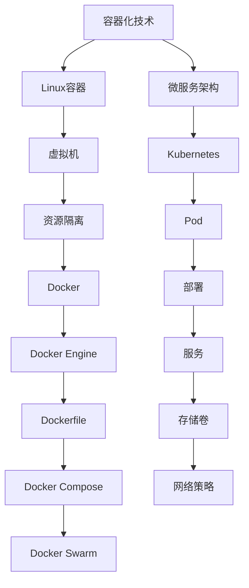

                 

关键词：容器化技术、Docker、Kubernetes、微服务、云原生、持续集成、持续交付

## 摘要

本文旨在深入探讨容器化技术的应用，重点介绍Docker和Kubernetes这两个在现代软件开发和运维中至关重要的工具。通过分析容器化的基本概念和原理，本文将详细解释Docker的工作机制，包括其架构和核心技术。接着，我们将探讨如何使用Docker来创建、运行和管理容器。随后，本文将深入Kubernetes的世界，介绍其核心概念和架构，并展示如何使用Kubernetes来部署和管理容器化应用。此外，文章还将涵盖持续集成和持续交付（CI/CD）在容器化环境中的实践，并提供相关的项目实践和实际应用场景。最后，本文将总结容器化技术的发展趋势和面临的挑战，为读者提供工具和资源的推荐。

## 1. 背景介绍

在进入容器化技术之前，我们首先需要了解其背景和由来。容器化技术是一种轻量级虚拟化技术，它通过将应用程序及其运行环境打包成一个独立的容器，实现应用的隔离和移植。这种技术不仅解决了传统虚拟机在资源占用和性能上的问题，还极大地简化了软件部署和运维过程。

容器化技术的兴起可以追溯到2000年代初，当时Linux容器（LXC）的出现为容器化技术奠定了基础。然而，真正的革命性进展是在2013年Docker的诞生。Docker提供了一个易于使用和扩展的容器平台，使得容器化技术迅速普及。随后，Kubernetes作为一个开源的容器编排工具，进一步提升了容器化应用的部署和管理效率。

在现代软件开发中，容器化技术已成为一种标准实践。它不仅使得开发人员能够更加高效地构建、测试和部署应用程序，还为运维团队提供了更灵活的部署和管理方式。容器化技术使得微服务架构成为可能，促进了软件开发的模块化和可扩展性。

## 2. 核心概念与联系

### 2.1 容器和虚拟机的区别

容器和虚拟机（VM）在隔离性和资源管理方面有着本质的区别。虚拟机通过模拟硬件来提供完整的操作系统环境，每个虚拟机都有自己的操作系统、文件系统和网络接口。这种完整的隔离带来了较高的资源开销和性能损失。而容器则基于宿主机的操作系统运行，通过cgroup和namespace来实现资源隔离和隔离环境，从而避免了冗余的操作系统开销。

### 2.2 Docker的架构

Docker的架构由四部分组成：Docker Engine、Dockerfile、Docker Compose和Docker Swarm。

- **Docker Engine**：Docker Engine是Docker的核心组件，负责创建、运行和管理容器。它通过cgroup和namespace实现了容器的隔离，并提供了一个统一的接口来管理容器。
- **Dockerfile**：Dockerfile是一个文本文件，用于定义容器的构建过程。通过一系列的命令，Dockerfile可以指定基础镜像、安装依赖、设置环境变量等。
- **Docker Compose**：Docker Compose是一个用于定义和运行多容器应用的工具。通过一个YAML文件，Docker Compose可以一次性部署多个容器，并管理它们的生命周期。
- **Docker Swarm**：Docker Swarm是Docker提供的集群管理工具，可以将多个Docker Engine实例组合成一个高可用的集群。Docker Swarm提供了与Kubernetes相似的管理功能，但更加简单易用。

### 2.3 Kubernetes的核心概念

Kubernetes是一个开源的容器编排平台，用于自动化容器化应用程序的部署、扩展和管理。Kubernetes的核心概念包括：

- **Pod**：Pod是Kubernetes中的最小部署单元，它包含一个或多个容器，共享资源和网络命名空间。
- **部署（Deployment）**：Deployment用于管理Pod的创建和更新，确保应用程序按照预期运行。它提供了滚动更新、回滚等高级功能。
- **服务（Service）**：Service用于将集群内部的不同Pod连接起来，提供负载均衡和访问策略。它通过虚拟IP（VIP）或DNS名称来访问Pod。
- **存储卷（Persistent Volume, PV）**：存储卷是Kubernetes提供的持久化存储解决方案，允许容器持久化数据。
- **网络策略（Network Policy）**：网络策略用于控制Pod之间的网络通信，提供细粒度的网络安全。

### 2.4 容器化技术与微服务架构的联系

容器化技术为微服务架构的实现提供了坚实的基础。微服务架构将应用程序分解为多个独立的服务，每个服务运行在自己的容器中。容器化技术确保了服务的隔离性和可移植性，使得每个服务可以独立开发、测试和部署。同时，Kubernetes为这些服务提供了自动化的部署和管理，确保它们在分布式环境中高效运行。

### 2.5 Mermaid 流程图

以下是容器化技术核心概念的Mermaid流程图：



## 3. 核心算法原理 & 具体操作步骤

### 3.1 算法原理概述

容器化技术的核心算法原理主要包括：

- **cgroup**：cgroup是Linux内核的一个功能，用于对进程和资源进行分组控制。Docker通过cgroup实现对容器资源的限制和隔离。
- **namespace**：namespace是Linux内核提供的一种隔离机制，用于隔离进程的命名空间和文件系统。Docker利用namespace实现容器的隔离环境。
- **镜像（Image）**：镜像是一个只读的模板，用于创建容器。Docker通过镜像来定义容器运行时的环境。

### 3.2 算法步骤详解

#### 3.2.1 创建Docker镜像

创建Docker镜像的过程主要包括以下步骤：

1. **编写Dockerfile**：Dockerfile是一个文本文件，定义了如何构建Docker镜像。以下是一个简单的Dockerfile示例：

   ```dockerfile
   FROM ubuntu:18.04
   RUN apt-get update && apt-get install -y nginx
   EXPOSE 80
   ```

2. **构建Docker镜像**：使用以下命令构建Docker镜像：

   ```bash
   docker build -t my-nginx .
   ```

   `-t`标志用于指定镜像的标签，`.`表示Dockerfile所在的路径。

3. **查看Docker镜像**：使用以下命令查看已构建的Docker镜像：

   ```bash
   docker images
   ```

#### 3.2.2 运行Docker容器

运行Docker容器的过程主要包括以下步骤：

1. **启动Docker容器**：使用以下命令启动Docker容器：

   ```bash
   docker run -d -p 8080:80 my-nginx
   ```

   `-d`标志表示后台运行容器，`-p`标志用于将容器的80端口映射到宿主机的8080端口。

2. **查看Docker容器**：使用以下命令查看正在运行的Docker容器：

   ```bash
   docker ps
   ```

3. **进入Docker容器**：使用以下命令进入Docker容器：

   ```bash
   docker exec -it <容器ID> /bin/bash
   ```

   `<容器ID>`需要替换为实际的容器ID。

### 3.3 算法优缺点

#### 优点

- **轻量级**：容器化技术相比虚拟机具有更低的资源开销，使得容器在资源使用方面更加高效。
- **隔离性**：容器通过cgroup和namespace实现了良好的隔离性，确保了应用程序的稳定运行。
- **可移植性**：容器打包了应用程序及其运行环境，使得应用程序可以在不同的环境中轻松移植和部署。

#### 缺点

- **安全性**：容器虽然实现了隔离，但依然面临一定的安全风险，例如容器逃逸等问题。
- **复杂度**：容器化技术的引入增加了部署和运维的复杂度，需要学习和掌握相关的工具和概念。

### 3.4 算法应用领域

容器化技术广泛应用于以下几个方面：

- **微服务架构**：容器化技术使得微服务架构的实现变得更加简单和高效，每个服务可以独立部署和管理。
- **持续集成和持续交付（CI/CD）**：容器化技术简化了CI/CD流程，使得应用程序可以更快地交付。
- **云原生应用**：容器化技术与云原生应用紧密结合，为云原生环境提供了良好的支持。

## 4. 数学模型和公式 & 详细讲解 & 举例说明

### 4.1 数学模型构建

在容器化技术中，我们可以构建以下数学模型来描述资源利用率：

- **资源利用率（Utilization）**：资源利用率是容器使用的资源与其总资源的比值，可以用以下公式表示：

  $$ Utilization = \frac{Used\_Resource}{Total\_Resource} $$

- **容器规模（Container Size）**：容器规模是指容器占用的资源总量，可以用以下公式表示：

  $$ Container\_Size = CPU\_Usage + Memory\_Usage + Storage\_Usage $$

### 4.2 公式推导过程

资源利用率的推导过程如下：

1. **定义资源利用率**：资源利用率是容器使用的资源与其总资源的比值。

2. **定义容器规模**：容器规模是指容器占用的资源总量。

3. **将容器规模分解**：容器规模可以分解为CPU使用率、内存使用率和存储使用率。

4. **推导资源利用率公式**：将容器规模代入资源利用率的定义中，得到资源利用率的公式。

### 4.3 案例分析与讲解

以下是一个容器资源利用率的案例：

假设一个容器总共使用了2核CPU、4GB内存和100GB存储，而其总资源量为4核CPU、8GB内存和200GB存储。根据资源利用率公式，我们可以计算出该容器的资源利用率：

- **CPU利用率**：$$ Utilization_{CPU} = \frac{2}{4} = 0.5 $$
- **内存利用率**：$$ Utilization_{Memory} = \frac{4}{8} = 0.5 $$
- **存储利用率**：$$ Utilization_{Storage} = \frac{100}{200} = 0.5 $$

因此，该容器的总资源利用率为0.5。

## 5. 项目实践：代码实例和详细解释说明

### 5.1 开发环境搭建

在进行Docker和Kubernetes的项目实践之前，我们需要搭建一个合适的环境。以下是搭建步骤：

1. **安装Docker**：在Ubuntu系统上安装Docker，可以使用以下命令：

   ```bash
   sudo apt-get update
   sudo apt-get install docker-ce docker-ce-cli containerd.io
   ```

2. **安装Kubernetes**：安装Kubernetes可以通过Kubeadm进行。以下是一个简化的安装步骤：

   ```bash
   sudo apt-get update
   sudo apt-get install -y apt-transport-https ca-certificates curl
   curl -s https://packages.cloud.google.com/apt/doc/apt-key.gpg | sudo apt-key add -
   cat <<EOF | sudo tee /etc/apt/sources.list.d/kubernetes.list
   deb https://apt.kubernetes.io/ kubernetes-xenial main
   EOF
   sudo apt-get update
   sudo apt-get install -y kubelet kubeadm kubectl
   sudo apt-mark hold kubelet kubeadm kubectl
   ```

3. **启动Kubernetes集群**：使用以下命令启动Kubernetes集群：

   ```bash
   sudo kubeadm init --pod-network-cidr=10.244.0.0/16
   ```

4. **配置kubectl**：配置kubectl以管理Kubernetes集群：

   ```bash
   mkdir -p $HOME/.kube
   sudo cp -i /etc/kubernetes/admin.conf $HOME/.kube/config
   sudo chown $(id -u):$(id -g) $HOME/.kube/config
   ```

5. **安装网络插件**：安装Flannel网络插件，以实现集群内的容器通信：

   ```bash
   kubectl apply -f https://raw.githubusercontent.com/flannel-io/flannel/master/Documentation/kube-flannel.yml
   ```

### 5.2 源代码详细实现

以下是一个简单的Spring Boot应用程序的Dockerfile和Kubernetes部署文件。

#### Dockerfile

```dockerfile
FROM openjdk:11-jdk-slim
ARG JAR_FILE=target/*.jar
COPY ${JAR_FILE} app.jar
EXPOSE 8080
ENTRYPOINT ["java","-Djava.security.egd=file:/dev/./urandom","-jar","/app.jar"]
```

#### Kubernetes部署文件（deployment.yaml）

```yaml
apiVersion: apps/v1
kind: Deployment
metadata:
  name: spring-boot-app
spec:
  replicas: 3
  selector:
    matchLabels:
      app: spring-boot-app
  template:
    metadata:
      labels:
        app: spring-boot-app
    spec:
      containers:
      - name: spring-boot-container
        image: spring-boot-app:latest
        ports:
        - containerPort: 8080
---
apiVersion: v1
kind: Service
metadata:
  name: spring-boot-service
spec:
  selector:
    app: spring-boot-app
  ports:
    - protocol: TCP
      port: 80
      targetPort: 8080
  type: LoadBalancer
```

### 5.3 代码解读与分析

#### Dockerfile

- **FROM**指令：指定基础镜像，这里使用OpenJDK 11作为基础镜像。
- **ARG**指令：定义变量JAR_FILE，用于存放Spring Boot应用程序的JAR文件。
- **COPY**指令：将JAR文件复制到容器中。
- **EXPOSE**指令：暴露容器的8080端口。
- **ENTRYPOINT**指令：定义容器的入口点，启动Spring Boot应用程序。

#### Kubernetes部署文件

- **Deployment**：定义了Spring Boot应用程序的部署策略，包括副本数量、选择器和模板。
- **Service**：定义了Spring Boot应用程序的服务，通过负载均衡器将流量分发到后端的容器。

### 5.4 运行结果展示

1. **构建Docker镜像**：

   ```bash
   docker build -t spring-boot-app .
   ```

2. **部署Spring Boot应用程序**：

   ```bash
   kubectl apply -f deployment.yaml
   ```

3. **查看部署状态**：

   ```bash
   kubectl get pods
   ```

   输出结果：

   ```bash
   NAME                        READY   STATUS    RESTARTS   AGE
   spring-boot-app-6c4d7c7b4-5x6cn   1/1     Running   0          5s
   spring-boot-app-6c4d7c7b4-h5kgn   1/1     Running   0          5s
   spring-boot-app-6c4d7c7b4-tq8q4   1/1     Running   0          5s
   ```

4. **访问Spring Boot应用程序**：

   如果使用的是Kubernetes集群内部网络，可以使用以下命令访问Spring Boot应用程序：

   ```bash
   kubectl get svc
   ```

   输出结果中找到Spring Boot服务的Cluster IP，然后使用以下命令访问：

   ```bash
   curl <Cluster IP>:80
   ```

   如果使用的是LoadBalancer类型的服务，可以直接通过外部访问IP地址访问Spring Boot应用程序。

## 6. 实际应用场景

容器化技术在实际应用中有着广泛的应用场景，以下是一些典型的实际应用场景：

### 6.1 持续集成和持续交付（CI/CD）

容器化技术使得持续集成和持续交付（CI/CD）变得更加简单和高效。通过将应用程序及其运行环境打包成容器，开发团队可以快速构建、测试和部署应用程序。以下是一个典型的CI/CD流程：

1. **提交代码**：开发人员将代码提交到版本控制系统中。
2. **触发构建**：CI工具（如Jenkins、GitLab CI等）检测到代码提交后，触发构建过程。
3. **构建镜像**：CI工具使用Dockerfile构建应用程序的Docker镜像。
4. **测试镜像**：CI工具运行自动化测试，确保应用程序的稳定性和质量。
5. **部署镜像**：测试通过后，CI工具将Docker镜像推送到容器镜像仓库中。
6. **部署应用程序**：CI工具使用Kubernetes或其他容器编排工具部署应用程序到生产环境。

### 6.2 微服务架构

容器化技术为微服务架构的实现提供了坚实的基础。通过将应用程序分解为多个独立的服务，每个服务运行在自己的容器中，开发团队可以实现更加灵活和可扩展的应用程序。以下是一个典型的微服务架构应用场景：

1. **服务分解**：将大型应用程序分解为多个小型服务，每个服务负责不同的业务功能。
2. **容器化服务**：使用Docker将每个服务打包成独立的容器。
3. **部署服务**：使用Kubernetes或其他容器编排工具部署服务到集群中。
4. **服务发现和路由**：使用服务发现和路由工具（如Consul、Eureka等）实现服务之间的发现和通信。
5. **监控和日志**：使用监控和日志工具（如Prometheus、ELK Stack等）收集应用程序的监控数据和日志，以便进行性能优化和故障排除。

### 6.3 云原生应用

容器化技术使得云原生应用成为可能。云原生应用是指为云环境而优化的应用程序，具有高度可扩展性和可移植性。以下是一个典型的云原生应用场景：

1. **容器化应用**：使用Docker将应用程序及其依赖打包成容器。
2. **容器编排**：使用Kubernetes或其他容器编排工具管理容器集群，确保应用程序的高可用性和可扩展性。
3. **服务网格**：使用服务网格（如Istio、Linkerd等）实现容器间的通信和安全。
4. **无状态服务**：设计应用程序为无状态服务，以便于在容器集群中动态扩展和缩放。
5. **自动化运维**：使用自动化运维工具（如Ansible、Terraform等）管理基础设施和应用程序。

## 7. 未来应用展望

### 7.1 自动化与智能化

随着容器化技术的不断发展，未来的容器编排和管理将更加自动化和智能化。人工智能和机器学习技术将被广泛应用于容器化环境中，以提高资源利用率、优化性能和降低运维成本。例如，智能调度算法可以根据容器的工作负载动态调整资源分配，从而实现更高效的资源利用。

### 7.2 多云和混合云

随着企业对多云和混合云的需求日益增长，容器化技术将成为多云和混合云环境中管理应用程序的关键工具。通过容器化技术，企业可以在不同云环境中轻松部署和管理应用程序，实现跨云的一致性。未来，容器化技术将支持更多云服务提供商的生态系统，为企业提供更大的灵活性和可扩展性。

### 7.3 容器安全

容器安全将成为未来容器化技术发展的重要方向。随着容器技术的广泛应用，容器安全风险也逐渐凸显。未来的容器化技术将更加注重安全性，包括容器镜像的扫描、容器网络的安全隔离、容器逃逸的防护等。容器安全解决方案将更加完善，为企业提供更加全面的安全保障。

## 8. 工具和资源推荐

### 8.1 学习资源推荐

- **《Docker实战》**：这本书是Docker入门和进阶的最佳指南，涵盖了Docker的各个方面，包括基础概念、容器编排和自动化部署。
- **《Kubernetes权威指南》**：这本书深入介绍了Kubernetes的核心概念、架构和实战应用，是学习Kubernetes的必备读物。
- **《容器化微服务架构》**：这本书详细介绍了容器化技术如何支持微服务架构，包括设计原则、最佳实践和案例分析。

### 8.2 开发工具推荐

- **Docker Desktop**：Docker官方提供的桌面应用程序，用于本地开发、测试和运行Docker容器。
- **Kubernetes Dashboard**：Kubernetes提供的Web界面，用于可视化和管理Kubernetes集群。
- **Kubectl**：Kubernetes提供的命令行工具，用于与Kubernetes集群进行交互。

### 8.3 相关论文推荐

- **“Docker: Lightweight Virtualization for Development, Test, and Production”**：这篇论文详细介绍了Docker的技术原理和优势。
- **“Kubernetes: A System for Automating Deployment, Scaling, and Operations of Containerized Applications”**：这篇论文深入分析了Kubernetes的设计理念和技术实现。

## 9. 总结：未来发展趋势与挑战

### 9.1 研究成果总结

容器化技术在过去几年中取得了显著的研究成果，已经成为现代软件开发和运维的标配。Docker和Kubernetes作为容器化技术的核心工具，不断发展和完善，为开发者提供了更加高效和可靠的部署和管理方式。同时，容器化技术在微服务架构、持续集成和持续交付、云原生应用等领域得到了广泛应用，取得了良好的效果。

### 9.2 未来发展趋势

未来，容器化技术将继续向自动化、智能化和多云化方向发展。人工智能和机器学习技术将进一步提高容器化环境中的资源利用率和运维效率。多云和混合云环境将成为容器化技术的重要应用场景，容器化技术将支持更多云服务提供商的生态系统。此外，容器化技术在安全性方面的研究和应用也将得到更多关注。

### 9.3 面临的挑战

尽管容器化技术取得了显著成果，但仍然面临一些挑战。首先，容器化技术的复杂性使得学习和掌握相关工具和概念变得更加困难。其次，容器安全风险逐渐凸显，需要加强容器镜像的扫描、容器网络的隔离和容器逃逸的防护。此外，容器化技术在企业级应用中的大规模部署和运维仍然面临一些挑战，需要进一步优化和改进。

### 9.4 研究展望

未来的容器化技术研究将集中在以下几个方面：

- **自动化与智能化**：进一步优化容器编排和管理算法，提高资源利用率和运维效率。
- **安全性**：加强容器安全研究和解决方案，提高容器化环境的安全性和可靠性。
- **多云和混合云**：支持更多云服务提供商的生态系统，实现跨云的一致性和可移植性。
- **企业级应用**：优化容器化技术在企业级应用中的大规模部署和运维，提高生产环境中的可靠性和稳定性。

## 10. 附录：常见问题与解答

### 10.1 Docker和虚拟机的区别是什么？

Docker是一种轻量级虚拟化技术，它通过cgroup和namespace实现了进程和资源的隔离。相比之下，虚拟机通过模拟硬件来提供完整的操作系统环境，包括独立的文件系统和网络接口。虚拟机在隔离性和性能方面较为强大，但资源占用较高。而容器化技术具有更低的资源开销和更好的性能。

### 10.2 Kubernetes的主要功能是什么？

Kubernetes是一个开源的容器编排平台，主要功能包括：

- **部署和管理容器**：Kubernetes可以自动部署和管理容器，包括创建、更新和删除。
- **服务发现和负载均衡**：Kubernetes提供了服务发现和负载均衡功能，确保应用程序的高可用性和性能。
- **存储卷和持久化数据**：Kubernetes支持存储卷和持久化数据，确保容器中的数据不会在容器重启或删除时丢失。
- **网络策略和网络安全**：Kubernetes提供了网络策略和网络安全功能，确保容器之间的安全通信。

### 10.3 如何在Docker容器中运行多个应用程序？

在Docker容器中可以运行多个应用程序，可以通过以下两种方式实现：

- **多容器容器**：使用Docker Compose或Kubernetes部署多个容器，每个容器运行不同的应用程序。
- **单容器容器**：在Dockerfile中使用`CMD`指令指定多个命令，或者使用`exec`命令动态启动多个进程。

### 10.4 Kubernetes集群的扩展策略有哪些？

Kubernetes集群的扩展策略包括：

- **水平扩展**：通过增加集群中的节点数量来扩展集群规模，适用于处理大量请求的场景。
- **垂直扩展**：通过增加节点的资源容量（如CPU、内存等）来扩展集群性能，适用于提升单个节点的处理能力。
- **滚动更新**：在更新应用程序时逐步替换旧节点，确保集群的高可用性和稳定性。

### 10.5 如何确保容器化应用程序的安全性？

确保容器化应用程序的安全性可以从以下几个方面入手：

- **容器镜像扫描**：在部署容器前对镜像进行扫描，确保镜像中没有已知的安全漏洞。
- **容器网络隔离**：使用网络策略限制容器之间的通信，确保容器之间的安全性。
- **容器权限管理**：对容器的权限进行严格控制，防止容器获得过高的权限。
- **容器日志和监控**：实时监控容器的日志和性能指标，及时发现和处理安全事件。

通过上述措施，可以显著提高容器化应用程序的安全性。希望这篇文章对您了解容器化技术、Docker和Kubernetes有所帮助。在未来的实践中，不断探索和掌握这些技术，将为您的软件开发和运维带来更大的便利和效益。祝愿您在容器化技术的道路上越走越远，不断取得新的成就！

### 作者署名

本文作者为【禅与计算机程序设计艺术 / Zen and the Art of Computer Programming】。感谢您的阅读，期待与您在技术领域共同探讨和进步！
----------------------------------------------------------------

