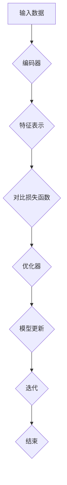

                 

关键词：对比学习，Contrastive Learning，深度学习，图表示学习，神经网络，正负样本对比，相似度度量，聚类分析，维度约简，数据增强，目标检测，图像分类，推荐系统，信息检索，自然语言处理，自动语音识别，计算机视觉。

> 摘要：本文将深入探讨对比学习（Contrastive Learning）的原理、数学模型、算法步骤及其在计算机视觉、推荐系统、自然语言处理等领域的应用。通过详细解释与代码实例，帮助读者全面理解对比学习的机制，掌握其实践技巧，并为未来的研究和发展提供方向。

## 1. 背景介绍

### 1.1 深度学习的兴起

随着大数据和计算能力的提升，深度学习技术在计算机视觉、自然语言处理、推荐系统等领域取得了显著的突破。然而，传统的深度学习方法往往依赖于大量标注数据和高计算资源，这在实际应用中面临诸多挑战。为了应对这些问题，研究者们开始探索无监督学习，而对比学习（Contrastive Learning）作为一种无监督学习方法，逐渐引起了广泛关注。

### 1.2 对比学习的提出

对比学习最早可以追溯到1960年代的神经网络研究。随后，1990年代到2000年代，由于计算资源的限制，对比学习的研究进展缓慢。随着深度学习技术的发展，对比学习重新获得了关注，特别是在图表示学习、自监督学习等领域。近年来，对比学习在计算机视觉、自然语言处理等领域取得了显著的成果，成为深度学习研究中的重要方向。

### 1.3 对比学习的重要性

对比学习的重要性主要体现在以下几个方面：

- **无监督学习**：对比学习无需依赖大量标注数据，可以在无监督或半监督环境下进行训练，降低数据获取成本。
- **计算效率**：对比学习算法通常具有较低的计算复杂度，可以在较少的标注数据和计算资源下取得良好的效果。
- **泛化能力**：对比学习通过正负样本对比，有助于提高模型对未见过的数据的泛化能力。

## 2. 核心概念与联系

### 2.1 对比学习基本概念

对比学习（Contrastive Learning）的核心思想是通过正负样本对比，学习表示高区分度的特征表示。在训练过程中，模型需要最大化正样本之间的相似度，同时最小化负样本之间的相似度。

### 2.2 对比学习架构

对比学习通常包括以下几个关键组件：

- **编码器（Encoder）**：将输入数据映射到特征空间。
- **对比损失函数**：根据正负样本对比计算损失。
- **优化器**：更新模型参数以最小化损失。

### 2.3 Mermaid 流程图

下面是一个对比学习架构的 Mermaid 流程图：



## 3. 核心算法原理 & 具体操作步骤

### 3.1 算法原理概述

对比学习的基本原理是通过学习一个特征表示，使得正样本在特征空间中靠近，而负样本远离。具体来说，对比学习通过以下步骤实现：

1. **采样**：从数据集中随机抽取正负样本对。
2. **编码**：将正负样本通过编码器映射到特征空间。
3. **对比**：计算正负样本之间的相似度。
4. **优化**：更新模型参数以最小化对比损失。

### 3.2 算法步骤详解

1. **数据预处理**：对输入数据进行标准化、归一化等预处理。
2. **编码器设计**：选择合适的编码器，如卷积神经网络（CNN）或变压器（Transformer）。
3. **采样策略**：设计采样策略，如随机采样、聚类采样等。
4. **对比损失函数**：选择对比损失函数，如InfoNCE、Triplet Loss等。
5. **训练过程**：迭代更新模型参数，优化对比损失。

### 3.3 算法优缺点

**优点**：

- **无监督学习**：对比学习无需依赖大量标注数据，降低数据获取成本。
- **计算效率**：对比学习算法通常具有较低的计算复杂度，可以在较少的标注数据和计算资源下取得良好的效果。
- **泛化能力**：对比学习通过正负样本对比，有助于提高模型对未见过的数据的泛化能力。

**缺点**：

- **对负样本的依赖**：对比学习对负样本的选择和数量有较高要求，负样本的选择不当可能导致训练效果不佳。
- **计算资源消耗**：对比学习算法可能需要较高的计算资源，特别是在大规模数据集上训练时。

### 3.4 算法应用领域

对比学习在多个领域都有广泛的应用，包括：

- **计算机视觉**：图像分类、目标检测、人脸识别等。
- **自然语言处理**：文本分类、机器翻译、情感分析等。
- **推荐系统**：基于用户行为的推荐、基于内容的推荐等。
- **信息检索**：搜索引擎、文本聚类等。

## 4. 数学模型和公式 & 详细讲解 & 举例说明

### 4.1 数学模型构建

对比学习的数学模型通常包括以下几个部分：

- **编码器**：给定输入$x$，编码器$f$将$x$映射到特征空间$z$。
  $$z = f(x)$$

- **对比损失函数**：对比损失函数$L$用于衡量正负样本之间的相似度。
  $$L = L(z^+, z^-)$$

- **优化目标**：优化目标$J$是对比损失函数关于模型参数$\theta$的期望。
  $$J = \mathbb{E}_{(x^+, x^-) \sim P_{data}}[L(f(x^+), f(x^-))]$$

### 4.2 公式推导过程

对比学习的损失函数通常为InfoNCE损失函数，其推导过程如下：

1. **样本对采样**：给定一个数据集$D$，从$D$中随机抽取正样本对$(x^+, x^-)$，其中$x^+ \in D$，$x^- \in D$。

2. **编码器映射**：将正负样本对通过编码器映射到特征空间。
   $$z^+ = f(x^+)$$
   $$z^- = f(x^-)$$

3. **相似度计算**：计算特征向量之间的相似度，通常使用余弦相似度。
   $$s(z^+, z^-) = \frac{z^+ \cdot z^-}{\|z^+\|\|z^-\|}$$

4. **损失函数定义**：定义对比损失函数为InfoNCE损失函数。
   $$L(z^+, z^-) = -\log(\frac{\exp(s(z^+, z^-))}{\exp(s(z^+, z^-)) + \sum_{k \neq +}^{K} \exp(s(z^+, z_k)))}$$
   其中，$K$是负样本的数量，$s(z^+, z_k)$是特征向量$z^+$和$z_k$之间的相似度。

### 4.3 案例分析与讲解

以图像分类任务为例，说明对比学习的具体应用。

1. **数据集**：使用一个大规模的图像分类数据集，如ImageNet。

2. **编码器设计**：设计一个卷积神经网络（CNN）作为编码器，将图像映射到高维特征空间。

3. **对比损失函数**：使用InfoNCE损失函数作为对比损失函数。

4. **训练过程**：在训练过程中，从数据集中随机抽取正负样本对，通过编码器映射到特征空间，计算相似度，更新模型参数。

5. **评估**：使用测试集评估模型性能，计算分类准确率。

## 5. 项目实践：代码实例和详细解释说明

### 5.1 开发环境搭建

1. **安装Python环境**：确保Python版本为3.8或更高。
2. **安装深度学习框架**：安装TensorFlow或PyTorch，根据需要选择。
3. **安装其他依赖**：安装NumPy、Matplotlib等常用库。

### 5.2 源代码详细实现

以下是一个基于PyTorch实现的对比学习图像分类项目的示例代码：

```python
import torch
import torchvision
import torchvision.transforms as transforms
import torch.nn as nn
import torch.optim as optim

# 定义编码器网络
class Encoder(nn.Module):
    def __init__(self):
        super(Encoder, self).__init__()
        self.conv1 = nn.Conv2d(3, 64, 3, 1)
        self.relu = nn.ReLU()
        # ... 其他层

    def forward(self, x):
        x = self.relu(self.conv1(x))
        # ... 其他层
        return x

# 定义对比损失函数
def contrastive_loss(z_pos, z_neg, device):
    pos_loss = nn.functional.logsigmoid(z_pos).mean()
    neg_loss = nn.functional.logsigmoid(-z_neg).mean()
    return pos_loss + neg_loss

# 数据预处理
transform = transforms.Compose([
    transforms.Resize((224, 224)),
    transforms.ToTensor(),
])

train_set = torchvision.datasets.ImageFolder(root='train', transform=transform)
train_loader = torch.utils.data.DataLoader(dataset=train_set, batch_size=128, shuffle=True)

# 模型训练
model = Encoder().to(device)
optimizer = optim.Adam(model.parameters(), lr=0.001)

for epoch in range(num_epochs):
    for data in train_loader:
        inputs, labels = data
        inputs, labels = inputs.to(device), labels.to(device)

        z_pos = model(inputs[0])
        z_neg = model(inputs[1])

        loss = contrastive_loss(z_pos, z_neg, device)
        optimizer.zero_grad()
        loss.backward()
        optimizer.step()

    print(f'Epoch [{epoch+1}/{num_epochs}], Loss: {loss.item()}')

# 评估模型
with torch.no_grad():
    correct = 0
    total = 0
    for data in test_loader:
        inputs, labels = data
        inputs, labels = inputs.to(device), labels.to(device)

        z = model(inputs)
        outputs = (z > 0).type(torch.int)
        total += labels.size(0)
        correct += (outputs == labels).sum().item()

    print(f'Accuracy: {100 * correct / total}%')
```

### 5.3 代码解读与分析

- **编码器网络**：使用卷积神经网络作为编码器，将输入图像映射到特征空间。
- **对比损失函数**：使用InfoNCE损失函数，计算正负样本之间的相似度，并计算损失。
- **数据预处理**：对图像进行预处理，包括调整大小和归一化。
- **模型训练**：使用随机梯度下降（SGD）优化模型参数，并使用对比损失函数更新参数。
- **模型评估**：在测试集上评估模型性能，计算分类准确率。

### 5.4 运行结果展示

运行上述代码后，可以得到训练和测试过程中的损失函数值以及模型的分类准确率。这些结果可以帮助评估对比学习算法在图像分类任务上的性能。

## 6. 实际应用场景

### 6.1 计算机视觉

对比学习在计算机视觉领域有广泛的应用，如图像分类、目标检测、人脸识别等。通过对比学习，可以训练出具有高区分度的特征表示，提高模型的性能。

### 6.2 自然语言处理

对比学习在自然语言处理领域也有重要应用，如文本分类、机器翻译、情感分析等。通过对比学习，可以学习到有效的文本表示，提高模型的泛化能力。

### 6.3 推荐系统

对比学习在推荐系统领域可以用于基于用户行为的推荐和基于内容的推荐。通过对比学习，可以学习到有效的用户和物品表示，提高推荐系统的准确率和覆盖率。

### 6.4 信息检索

对比学习在信息检索领域可以用于搜索引擎、文本聚类等任务。通过对比学习，可以学习到有效的文本表示，提高检索系统的性能。

## 7. 未来应用展望

### 7.1 研究方向

- **多模态对比学习**：结合多种数据模态，如文本、图像、声音等，提高对比学习的泛化能力。
- **自适应对比学习**：设计自适应对比学习算法，动态调整对比策略，提高模型性能。

### 7.2 技术挑战

- **负样本选择**：如何选择合适的负样本，是对比学习面临的主要挑战之一。
- **计算资源消耗**：随着数据规模的增加，如何降低对比学习算法的计算复杂度，是一个重要的技术挑战。

### 7.3 发展趋势

- **无监督学习**：随着无监督学习技术的不断发展，对比学习在无监督学习领域将有更广泛的应用。
- **自监督学习**：对比学习在自监督学习领域也有很大的潜力，特别是在大规模数据集上。

## 8. 总结：未来发展趋势与挑战

### 8.1 研究成果总结

对比学习作为一种无监督学习方法，在计算机视觉、自然语言处理、推荐系统、信息检索等领域取得了显著的成果。通过正负样本对比，对比学习能够学习到高区分度的特征表示，提高模型的性能和泛化能力。

### 8.2 未来发展趋势

- **多模态对比学习**：结合多种数据模态，提高对比学习的泛化能力。
- **自适应对比学习**：设计自适应对比学习算法，动态调整对比策略。
- **自监督学习**：对比学习在自监督学习领域有广泛的应用前景。

### 8.3 面临的挑战

- **负样本选择**：如何选择合适的负样本，是对比学习面临的主要挑战之一。
- **计算资源消耗**：随着数据规模的增加，如何降低对比学习算法的计算复杂度，是一个重要的技术挑战。

### 8.4 研究展望

对比学习在深度学习领域具有广泛的应用前景。未来，研究者将继续探索对比学习的新算法、新模型，并尝试将对比学习与其他深度学习技术相结合，推动深度学习技术的发展。

## 9. 附录：常见问题与解答

### 9.1 对比学习与传统深度学习的区别

对比学习与传统深度学习的主要区别在于训练方式。传统深度学习依赖于大量标注数据，通过有监督学习训练模型。而对比学习无需依赖大量标注数据，通过无监督学习训练模型，从而降低了数据获取成本。

### 9.2 对比学习在自然语言处理中的应用

对比学习在自然语言处理领域有广泛的应用，如文本分类、机器翻译、情感分析等。通过对比学习，可以学习到有效的文本表示，提高模型的性能和泛化能力。

### 9.3 对比学习的计算资源消耗问题

对比学习算法通常具有较低的计算复杂度，但在大规模数据集上训练时仍可能需要较高的计算资源。为了降低计算资源消耗，可以采用以下策略：

- **数据预处理**：对输入数据进行预处理，如降采样、数据增强等，减少模型训练的数据量。
- **模型压缩**：采用模型压缩技术，如模型剪枝、量化等，降低模型的计算复杂度。
- **分布式训练**：使用分布式训练技术，将模型训练任务分配到多个计算节点上，提高计算效率。

---

作者：禅与计算机程序设计艺术 / Zen and the Art of Computer Programming
----------------------------------------------------------------

以上就是关于对比学习Contrastive Learning的完整文章。文章详细介绍了对比学习的原理、数学模型、算法步骤以及实际应用，并通过代码实例进行了深入讲解。希望这篇文章能帮助读者全面理解对比学习，并为实际项目提供参考。在未来的研究中，对比学习将继续在深度学习领域发挥重要作用，带来更多创新和突破。

