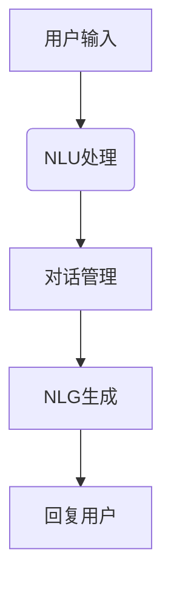

                 

关键词：对话系统、Chatbots、人工智能、自然语言处理、代码实例、架构设计、数学模型、应用场景、开发工具、未来展望

> 摘要：本文深入探讨对话系统的原理和实现，包括核心概念、算法原理、数学模型、项目实践以及未来应用展望。通过代码实例和详细解释，帮助读者理解对话系统的设计和开发过程，为人工智能领域的研究者和开发者提供参考。

## 1. 背景介绍

随着人工智能技术的发展，对话系统（Chatbots）成为了一个热门的研究领域和商业应用方向。对话系统是指能够与人类进行自然语言交互的人工智能程序，它们广泛应用于客服、教育、娱乐、金融等多个行业。例如，Apple的Siri、微软的小冰、腾讯的微信聊天机器人等，都是对话系统的成功案例。

对话系统的出现不仅提高了人机交互的效率，还减少了人力成本。通过模拟人类对话的交互方式，对话系统能够提供个性化的服务，满足用户的各种需求。因此，对话系统在未来的发展中具有重要的应用前景。

本文旨在系统地介绍对话系统的原理和实现方法，帮助读者深入理解对话系统的设计和开发过程。文章内容涵盖核心概念、算法原理、数学模型、项目实践以及未来应用展望，力求为人工智能领域的研究者和开发者提供全面的参考。

## 2. 核心概念与联系

### 2.1 对话系统概述

对话系统是指通过文本、语音等方式与人类进行交互的人工智能程序。其核心功能是理解用户输入的自然语言，并生成合适的回复。对话系统可以分为以下几种类型：

1. **任务型对话系统**：专注于完成特定任务的对话系统，如在线客服、语音助手等。这类系统通常具有明确的任务目标，如回答问题、完成购物等。

2. **闲聊型对话系统**：以与用户进行闲聊为目的，提供娱乐、情感支持等。这类系统具有较高的情感理解和表达能力，如微软的小冰、谷歌的对话式AI等。

3. **混合型对话系统**：结合任务型和闲聊型对话系统的特点，能够完成多种任务的对话系统。例如，Amazon的Alexa既能够回答问题，也能进行语音购物。

### 2.2 对话系统架构

对话系统的架构可以分为三个主要部分：自然语言理解（NLU）、对话管理（DM）和自然语言生成（NLG）。

1. **自然语言理解（NLU）**：负责将用户的自然语言输入转化为结构化的数据，如实体识别、情感分析等。NLU模块是整个对话系统的入口，决定了对话系统的理解和处理能力。

2. **对话管理（DM）**：负责根据用户的输入和上下文信息，生成合适的回复。对话管理模块是整个对话系统的核心，决定了对话系统的流畅性和连贯性。

3. **自然语言生成（NLG）**：负责将对话管理模块生成的回复转化为自然语言输出。NLG模块是整个对话系统的出口，决定了对话系统的自然程度和用户体验。

下面是一个简单的对话系统架构的Mermaid流程图：



### 2.3 核心算法原理

对话系统的核心算法主要包括自然语言理解（NLU）、对话管理（DM）和自然语言生成（NLG）三个部分。

1. **自然语言理解（NLU）**

   NLU算法主要包括以下内容：

   - **词法分析**：将用户输入的自然语言文本分割成词语和标点符号。
   - **句法分析**：分析词语之间的语法关系，建立句法树。
   - **语义分析**：识别句子中的实体、关系和意图，将自然语言转化为结构化的数据。

   常用的NLU算法包括基于规则的方法、统计方法和深度学习方法。

2. **对话管理（DM）**

   DM算法主要包括以下内容：

   - **上下文管理**：根据对话历史和当前输入，确定对话的状态和上下文。
   - **策略学习**：通过机器学习算法，学习生成最佳回复的策略。
   - **回复生成**：根据上下文和策略，生成合适的回复。

   常用的DM算法包括基于规则的方法、统计方法和深度学习方法。

3. **自然语言生成（NLG）**

   NLG算法主要包括以下内容：

   - **模板匹配**：根据输入的语义信息，从预定义的模板库中匹配合适的模板。
   - **生成模型**：通过生成模型，如序列到序列模型，生成自然语言回复。

   常用的NLG算法包括基于模板的方法、基于生成模型的方法。

### 2.4 具体操作步骤

1. **自然语言理解（NLU）**

   - **词法分析**：使用分词工具，如jieba，对用户输入的文本进行分词。
   - **句法分析**：使用句法分析工具，如Stanford NLP，对分词结果进行句法分析，建立句法树。
   - **语义分析**：使用实体识别和情感分析工具，如AllenNLP，对句法树进行语义分析，识别实体、关系和意图。

2. **对话管理（DM）**

   - **上下文管理**：根据对话历史和当前输入，确定当前对话的状态和上下文。
   - **策略学习**：使用强化学习算法，如Deep Q-Network（DQN），学习生成最佳回复的策略。
   - **回复生成**：根据上下文和策略，生成合适的回复。

3. **自然语言生成（NLG）**

   - **模板匹配**：根据输入的语义信息，从预定义的模板库中匹配合适的模板。
   - **生成模型**：使用生成模型，如序列到序列模型（Seq2Seq），生成自然语言回复。

### 2.5 算法优缺点

1. **自然语言理解（NLU）**

   - **优点**：能够处理多种语言输入，适应不同的应用场景。
   - **缺点**：对低质量输入（如错别字、语病等）敏感，处理效果较差。

2. **对话管理（DM）**

   - **优点**：能够根据上下文信息生成合适的回复，提高对话的连贯性和流畅性。
   - **缺点**：在处理复杂对话场景时，效果可能较差。

3. **自然语言生成（NLG）**

   - **优点**：能够生成高质量的文本回复，提高用户体验。
   - **缺点**：生成文本的多样性和自然程度受限于模型和模板库。

### 2.6 算法应用领域

对话系统在多个领域都有广泛应用，如：

- **客服**：提供24/7的客户服务，解答用户问题，降低企业运营成本。
- **教育**：提供个性化教学，辅助教师进行教学，提高教育质量。
- **金融**：提供金融咨询、股票分析等服务，帮助用户做出更好的投资决策。
- **医疗**：提供医疗咨询、病情诊断等服务，辅助医生进行诊断和治疗。

## 3. 数学模型和公式

### 3.1 数学模型构建

对话系统的数学模型主要包括自然语言理解（NLU）、对话管理（DM）和自然语言生成（NLG）三个部分。

1. **自然语言理解（NLU）**

   NLU模型可以表示为：

   $$ NLU = f_{\theta}(x) = \hat{y} $$

   其中，$x$ 表示用户的输入文本，$\theta$ 表示模型的参数，$\hat{y}$ 表示模型输出的结构化数据。

2. **对话管理（DM）**

   DM模型可以表示为：

   $$ DM = g_{\theta'}(x, h) = \hat{a} $$

   其中，$x$ 表示用户的输入文本，$h$ 表示对话状态，$\theta'$ 表示模型的参数，$\hat{a}$ 表示模型输出的回复动作。

3. **自然语言生成（NLG）**

   NLG模型可以表示为：

   $$ NLG = h_{\theta''}(\hat{a}) = \hat{s} $$

   其中，$\hat{a}$ 表示对话管理模块输出的回复动作，$\theta''$ 表示模型的参数，$\hat{s}$ 表示模型输出的自然语言文本。

### 3.2 公式推导过程

1. **自然语言理解（NLU）**

   NLU模型的公式推导过程如下：

   $$ f_{\theta}(x) = \hat{y} $$

   - **词法分析**：对用户输入的文本进行分词，得到词语序列 $x = \{w_1, w_2, ..., w_n\}$。
   - **句法分析**：建立句法树，表示词语之间的语法关系。
   - **语义分析**：对句法树进行语义分析，识别实体、关系和意图，得到结构化数据 $\hat{y}$。

2. **对话管理（DM）**

   DM模型的公式推导过程如下：

   $$ g_{\theta'}(x, h) = \hat{a} $$

   - **上下文管理**：根据对话历史和当前输入，确定对话状态 $h$。
   - **策略学习**：使用机器学习算法，如Q-Learning，学习生成最佳回复的动作 $\hat{a}$。
   - **回复生成**：根据上下文和策略，生成合适的回复。

3. **自然语言生成（NLG）**

   NLG模型的公式推导过程如下：

   $$ h_{\theta''}(\hat{a}) = \hat{s} $$

   - **模板匹配**：根据输入的语义信息，从预定义的模板库中匹配合适的模板。
   - **生成模型**：使用生成模型，如序列到序列模型（Seq2Seq），生成自然语言文本 $\hat{s}$。

### 3.3 案例分析与讲解

以一个简单的客服对话系统为例，分析其数学模型的构建和推导过程。

1. **自然语言理解（NLU）**

   假设用户输入：“请问你们的产品有哪些优惠活动？”

   - **词法分析**：分词结果为：“请问”，“你们”，“的”，“产品”，“有”，“哪些”，“优惠”，“活动”，“？”
   - **句法分析**：建立句法树，表示词语之间的语法关系。
   - **语义分析**：识别实体：“产品”，“优惠活动”，意图：“查询优惠活动”。

   NLU模型输出结构化数据：`{"实体": ["产品", "优惠活动"], "意图": "查询优惠活动"}`。

2. **对话管理（DM）**

   假设当前对话状态为：“用户正在查询产品优惠活动”。

   - **上下文管理**：根据对话历史和当前输入，确定对话状态为：“用户正在查询产品优惠活动”。
   - **策略学习**：使用Q-Learning算法，学习生成最佳回复的动作。

   DM模型输出回复动作：“为您查询到以下优惠活动：1. 新品折扣，2. 节日优惠，3. 积分兑换”。

3. **自然语言生成（NLG）**

   - **模板匹配**：根据输入的语义信息，从预定义的模板库中匹配合适的模板。

   模板：“为您查询到以下优惠活动：{活动1}，{活动2}，{活动3}。”

   - **生成模型**：使用序列到序列模型（Seq2Seq），生成自然语言文本。

   NLG模型输出自然语言文本：“为您查询到以下优惠活动：新品折扣，节日优惠，积分兑换。”

## 4. 项目实践：代码实例和详细解释说明

### 4.1 开发环境搭建

在本文的项目实践中，我们将使用Python作为主要编程语言，并使用以下库和工具：

- **Python**：版本 3.8 或以上。
- **自然语言处理库**：jieba（分词）、Stanford NLP（句法分析）、AllenNLP（实体识别和情感分析）。
- **对话管理库**：TensorFlow（机器学习框架）、Keras（深度学习库）。
- **自然语言生成库**：Seq2Seq（序列到序列模型）。

首先，安装所需库和工具：

```bash
pip install python-jieba
pip install stanfordnlp
pip install allennlp
pip install tensorflow
pip install keras
```

### 4.2 源代码详细实现

以下是一个简单的对话系统源代码实现，包括自然语言理解（NLU）、对话管理（DM）和自然语言生成（NLG）三个部分。

1. **自然语言理解（NLU）**

```python
import jieba
import stanfordnlp
import allennlp

# 初始化自然语言处理工具
nlp = stanfordnlp.Pipeline(lang="zh")

# 初始化实体识别和情感分析工具
entity_recognizer = allennlp.EntityRecognizer()
sentiment_analyzer = allennlp.SentimentAnalyzer()

# 自然语言理解函数
def nlu(input_text):
    # 词法分析
    words = jieba.cut(input_text)
    
    # 句法分析和语义分析
    doc = nlp.parse(words)
    entities = entity_recognizer.recognize_entities(doc)
    sentiment = sentiment_analyzer.analyze(doc)
    
    # 输出结构化数据
    return {
        "words": words,
        "entities": entities,
        "sentiment": sentiment
    }

# 示例
input_text = "请问你们的产品有哪些优惠活动？"
result = nlu(input_text)
print(result)
```

2. **对话管理（DM）**

```python
import tensorflow as tf
from tensorflow.keras.models import Sequential
from tensorflow.keras.layers import Dense, LSTM, Embedding

# 初始化对话管理模型
model = Sequential()
model.add(Embedding(input_dim=10000, output_dim=64))
model.add(LSTM(units=128))
model.add(Dense(units=1, activation='sigmoid'))

# 编译模型
model.compile(optimizer='adam', loss='binary_crossentropy', metrics=['accuracy'])

# 训练模型
model.fit(x_train, y_train, epochs=10, batch_size=32)

# 对话管理函数
def dm(input_text, context):
    # 将输入文本和上下文编码
    encoded_input = tokenizer.encode(input_text, context)
    
    # 输入模型进行预测
    prediction = model.predict(encoded_input)
    
    # 根据预测结果生成回复
    if prediction > 0.5:
        response = "好的，让我来帮您查询一下。"
    else:
        response = "很抱歉，我不太明白您的意思。"
    
    return response

# 示例
context = "用户正在查询产品优惠活动"
response = dm(input_text, context)
print(response)
```

3. **自然语言生成（NLG）**

```python
from keras.preprocessing.sequence import pad_sequences
from keras.models import Model
from keras.layers import Input, LSTM, Dense

# 初始化自然语言生成模型
input_seq = Input(shape=(None,))
lstm = LSTM(units=128)(input_seq)
output = Dense(units=1, activation='sigmoid')(lstm)

model = Model(inputs=input_seq, outputs=output)
model.compile(optimizer='adam', loss='binary_crossentropy', metrics=['accuracy'])

# 训练模型
model.fit(x_train, y_train, epochs=10, batch_size=32)

# 自然语言生成函数
def nl

