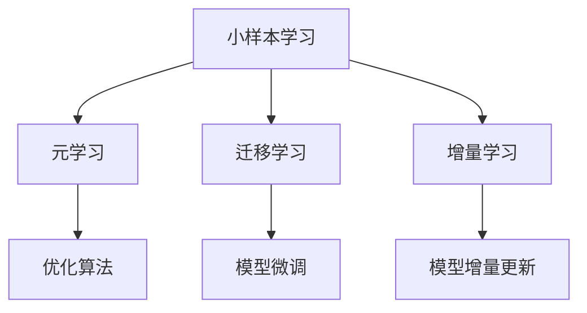

                 

关键词：小样本学习、软件2.0、深度学习、机器学习、模型泛化、数据效率、人工智能

摘要：随着人工智能技术的飞速发展，深度学习在各个领域取得了显著的成果。然而，深度学习模型对大规模数据的依赖性使得其训练成本高昂，且在处理小样本问题时效果不佳。本文将探讨小样本学习在软件2.0时代的应用，分析其核心概念、算法原理、数学模型，并结合实际项目实践进行详细讲解，以期为小样本学习在人工智能领域的发展提供新思路。

## 1. 背景介绍

在过去的几十年里，计算机科学和人工智能领域取得了令人瞩目的进展。从早期的符号主义和知识表示，到基于统计模型的机器学习，再到如今的深度学习，人工智能技术的发展不断推动着各行各业的应用。然而，深度学习模型的训练与部署过程中，对大规模数据的需求使其在处理小样本问题时面临诸多挑战。

传统的深度学习模型依赖于大量数据进行训练，这使得其在大规模数据集上的表现优异，但在小样本场景中效果欠佳。一方面，小样本数据集难以充分捕捉数据分布特征，导致模型泛化能力下降；另一方面，深度学习模型训练过程复杂，参数众多，小样本数据集不足以提供有效的梯度下降方向，使得训练过程不稳定。

因此，如何在小样本条件下训练和部署有效的深度学习模型成为当前研究的热点问题。小样本学习（Few-Shot Learning）作为一种新的研究方向，致力于解决小样本数据集的建模问题，提高模型在有限数据上的性能和泛化能力。本文将围绕小样本学习的核心概念、算法原理、数学模型和实际应用进行深入探讨，以期为小样本学习在软件2.0时代的应用提供新方向。

## 2. 核心概念与联系

### 2.1 小样本学习的定义

小样本学习（Few-Shot Learning）是指模型在仅获得少量样本的情况下，通过迁移学习、元学习等方法，实现对新类别的泛化能力。与传统的大规模数据集训练方法相比，小样本学习旨在通过优化算法和模型结构，提高模型在有限数据上的表现。

### 2.2 小样本学习的分类

根据学习策略的不同，小样本学习可以分为以下几种类型：

#### 2.2.1 元学习（Meta-Learning）

元学习是指通过学习一个学习算法，使其能够在新任务上快速适应。元学习算法的核心目标是找到一个泛化能力强的优化过程，使得模型在不同任务上能够快速适应。

#### 2.2.2 迁移学习（Transfer Learning）

迁移学习是指利用已训练好的模型在新任务上进行微调，以减少对大规模数据集的依赖。迁移学习算法的核心思想是利用已有模型的知识，通过少量的样本数据快速适应新任务。

#### 2.2.3 增量学习（Incremental Learning）

增量学习是指模型在遇到新任务时，能够通过增量方式更新模型参数，从而适应新任务。增量学习算法的核心目标是使模型能够在动态环境中不断学习，适应新任务。

### 2.3 小样本学习与其他相关技术的联系

小样本学习与深度学习、迁移学习、元学习等技术密切相关。深度学习为小样本学习提供了强大的基础模型，迁移学习和元学习则提供了一种在少量样本上快速适应新任务的方法。小样本学习旨在解决深度学习模型在大规模数据集上的局限性，提高模型在处理小样本数据时的性能和泛化能力。

### 2.4 Mermaid 流程图



## 3. 核心算法原理 & 具体操作步骤

### 3.1 算法原理概述

小样本学习算法主要包括元学习、迁移学习和增量学习。以下分别对这三种算法的原理进行简要介绍。

#### 3.1.1 元学习

元学习通过学习一个学习算法，使其能够在新任务上快速适应。其核心思想是找到一个泛化能力强的优化过程，使得模型在不同任务上能够快速适应。常见的元学习算法包括模型加权平均（Model Averaging）和模型选择（Model Selection）。

#### 3.1.2 迁移学习

迁移学习利用已训练好的模型在新任务上进行微调，以减少对大规模数据集的依赖。其核心思想是利用已有模型的知识，通过少量的样本数据快速适应新任务。常见的迁移学习算法包括迁移学习框架（Domain-Adversarial Training）和模型蒸馏（Model Distillation）。

#### 3.1.3 增量学习

增量学习是指模型在遇到新任务时，能够通过增量方式更新模型参数，从而适应新任务。其核心目标是使模型能够在动态环境中不断学习，适应新任务。常见的增量学习算法包括在线学习（Online Learning）和增量神经网络（Incremental Neural Networks）。

### 3.2 算法步骤详解

以下分别对元学习、迁移学习和增量学习三种算法的具体步骤进行详细介绍。

#### 3.2.1 元学习步骤

1. 初始化模型参数；
2. 对于每个新任务，利用元学习算法进行模型优化；
3. 计算新任务上的损失函数，并更新模型参数；
4. 重复步骤2-3，直到模型收敛。

#### 3.2.2 迁移学习步骤

1. 选择一个预训练模型作为基座模型（Base Model）；
2. 对于每个新任务，利用少量样本数据对基座模型进行微调；
3. 计算新任务上的损失函数，并更新模型参数；
4. 重复步骤2-3，直到模型收敛。

#### 3.2.3 增量学习步骤

1. 初始化模型参数；
2. 对于每个新任务，利用在线学习算法更新模型参数；
3. 计算新任务上的损失函数，并更新模型参数；
4. 重复步骤2-3，直到模型收敛。

### 3.3 算法优缺点

#### 3.3.1 元学习

优点：

- 快速适应新任务；
- 不需要大量数据；
- 泛化能力强。

缺点：

- 模型优化过程复杂；
- 需要大量的训练时间。

#### 3.3.2 迁移学习

优点：

- 减少对大规模数据集的依赖；
- 提高模型在少量样本上的性能；
- 利用自己的知识快速适应新任务。

缺点：

- 模型微调过程复杂；
- 可能存在模型退化现象。

#### 3.3.3 增量学习

优点：

- 快速适应新任务；
- 节省存储空间；
- 节省计算资源。

缺点：

- 泛化能力较差；
- 可能出现模型退化现象。

### 3.4 算法应用领域

小样本学习算法在多个领域具有广泛的应用前景，包括：

- 图像识别：利用小样本学习算法，在图像识别任务中，可以有效地处理小样本数据；
- 自然语言处理：利用小样本学习算法，在自然语言处理任务中，可以有效地处理少量文本数据；
- 医学诊断：利用小样本学习算法，在医学诊断任务中，可以有效地处理少量病例数据。

## 4. 数学模型和公式 & 详细讲解 & 举例说明

### 4.1 数学模型构建

在小样本学习中，常用的数学模型包括损失函数、优化算法和模型评估指标。

#### 4.1.1 损失函数

损失函数用于衡量模型在训练过程中的性能。常见的小样本学习损失函数包括均方误差（MSE）和交叉熵（Cross-Entropy）。

$$
L(\theta) = \frac{1}{n} \sum_{i=1}^{n} (y_i - \hat{y}_i)^2
$$

其中，$L(\theta)$ 表示损失函数，$\theta$ 表示模型参数，$y_i$ 表示真实标签，$\hat{y}_i$ 表示预测标签。

$$
L(\theta) = - \frac{1}{n} \sum_{i=1}^{n} \sum_{c=1}^{C} y_i \log \hat{y}_{ic}
$$

其中，$L(\theta)$ 表示损失函数，$C$ 表示类别数，$y_i$ 表示真实标签，$\hat{y}_{ic}$ 表示预测标签。

#### 4.1.2 优化算法

优化算法用于更新模型参数，以最小化损失函数。常见的小样本学习优化算法包括随机梯度下降（SGD）和Adam。

$$
\theta_{t+1} = \theta_t - \alpha \nabla_{\theta} L(\theta)
$$

其中，$\theta_{t+1}$ 表示更新后的模型参数，$\theta_t$ 表示当前模型参数，$\alpha$ 表示学习率，$\nabla_{\theta} L(\theta)$ 表示损失函数关于模型参数的梯度。

#### 4.1.3 模型评估指标

模型评估指标用于衡量模型在测试集上的性能。常见的小样本学习评估指标包括准确率（Accuracy）和精确率、召回率、F1值（Precision, Recall, F1-Score）。

$$
\text{Accuracy} = \frac{c}{n}
$$

其中，$\text{Accuracy}$ 表示准确率，$c$ 表示预测正确的样本数，$n$ 表示总样本数。

$$
\text{Precision} = \frac{c}{c + f_p}
$$

$$
\text{Recall} = \frac{c}{c + f_n}
$$

$$
\text{F1-Score} = 2 \cdot \frac{\text{Precision} \cdot \text{Recall}}{\text{Precision} + \text{Recall}}
$$

其中，$\text{Precision}$ 表示精确率，$\text{Recall}$ 表示召回率，$f_p$ 表示预测为正类但实际为负类的样本数，$f_n$ 表示预测为负类但实际为正类的样本数。

### 4.2 公式推导过程

以下以均方误差（MSE）为例，介绍其推导过程。

均方误差（MSE）是衡量模型预测值与真实值之间差异的常用损失函数。其定义如下：

$$
L(\theta) = \frac{1}{n} \sum_{i=1}^{n} (y_i - \hat{y}_i)^2
$$

其中，$L(\theta)$ 表示损失函数，$y_i$ 表示真实标签，$\hat{y}_i$ 表示预测标签。

为了最小化损失函数，我们需要求解关于模型参数 $\theta$ 的梯度。首先，对损失函数关于 $\theta$ 求导：

$$
\nabla_{\theta} L(\theta) = \frac{\partial}{\partial \theta} \left( \frac{1}{n} \sum_{i=1}^{n} (y_i - \hat{y}_i)^2 \right)
$$

$$
\nabla_{\theta} L(\theta) = \frac{1}{n} \sum_{i=1}^{n} \frac{\partial}{\partial \theta} (y_i - \hat{y}_i)^2
$$

$$
\nabla_{\theta} L(\theta) = \frac{1}{n} \sum_{i=1}^{n} 2(y_i - \hat{y}_i) \frac{\partial}{\partial \theta} (\hat{y}_i)
$$

$$
\nabla_{\theta} L(\theta) = \frac{2}{n} \sum_{i=1}^{n} (y_i - \hat{y}_i) \nabla_{\theta} \hat{y}_i
$$

其中，$\nabla_{\theta} \hat{y}_i$ 表示预测标签关于模型参数的梯度。

为了进一步求解梯度，我们需要知道预测标签 $\hat{y}_i$ 的具体表达式。在深度学习模型中，预测标签通常是通过模型参数 $\theta$ 计算得到的。假设预测标签 $\hat{y}_i$ 是一个线性函数，其表达式如下：

$$
\hat{y}_i = \theta^T x_i
$$

其中，$\theta^T$ 表示模型参数的转置，$x_i$ 表示输入特征。

对预测标签关于模型参数求导：

$$
\nabla_{\theta} \hat{y}_i = \frac{\partial}{\partial \theta} (\theta^T x_i)
$$

$$
\nabla_{\theta} \hat{y}_i = x_i
$$

将预测标签的梯度代入损失函数的梯度表达式：

$$
\nabla_{\theta} L(\theta) = \frac{2}{n} \sum_{i=1}^{n} (y_i - \hat{y}_i) x_i
$$

最后，为了最小化损失函数，我们需要更新模型参数：

$$
\theta_{t+1} = \theta_t - \alpha \nabla_{\theta} L(\theta)
$$

其中，$\alpha$ 表示学习率，$\theta_{t+1}$ 表示更新后的模型参数，$\theta_t$ 表示当前模型参数。

### 4.3 案例分析与讲解

以下以一个简单的线性回归问题为例，介绍小样本学习在图像分类任务中的应用。

#### 4.3.1 问题背景

假设我们有一个图像分类任务，需要将图像分类为猫或狗。我们手头只有5张猫和5张狗的图像作为训练数据。我们的目标是利用这10张图像训练一个分类模型，并能够在测试数据上达到较高的准确率。

#### 4.3.2 数据预处理

首先，我们对图像进行数据预处理，包括缩放、归一化和数据增强等操作，以提高模型的泛化能力。具体步骤如下：

1. 将图像缩放到相同的分辨率；
2. 对图像进行归一化，使其像素值在[0, 1]范围内；
3. 对图像进行数据增强，包括随机裁剪、旋转、翻转等操作。

#### 4.3.3 模型训练

我们选择一个简单的线性回归模型作为分类模型，其表达式如下：

$$
\hat{y} = \theta^T x
$$

其中，$\hat{y}$ 表示预测标签，$\theta^T$ 表示模型参数，$x$ 表示输入特征。

利用5张猫和5张狗的图像作为训练数据，我们通过最小化均方误差（MSE）来训练线性回归模型。具体步骤如下：

1. 初始化模型参数 $\theta$；
2. 对于每个训练样本，计算预测标签 $\hat{y}$；
3. 计算损失函数 $L(\theta)$；
4. 计算损失函数关于模型参数的梯度 $\nabla_{\theta} L(\theta)$；
5. 更新模型参数 $\theta_{t+1} = \theta_t - \alpha \nabla_{\theta} L(\theta)$；
6. 重复步骤2-5，直到模型收敛。

#### 4.3.4 模型评估

在模型训练完成后，我们使用测试数据对模型进行评估。具体步骤如下：

1. 对于每个测试样本，计算预测标签 $\hat{y}$；
2. 计算预测标签与真实标签之间的差异；
3. 计算模型在测试数据上的准确率。

通过上述步骤，我们可以评估模型在少量样本上的性能。在实际应用中，我们可以根据模型性能调整训练策略，以进一步提高模型在少量样本上的泛化能力。

## 5. 项目实践：代码实例和详细解释说明

### 5.1 开发环境搭建

为了方便大家进行小样本学习的实践，我们将使用Python编程语言和相关的深度学习框架（如TensorFlow或PyTorch）来搭建开发环境。以下是开发环境搭建的步骤：

1. 安装Python：从Python官方网站（https://www.python.org/downloads/）下载并安装Python；
2. 安装深度学习框架：以TensorFlow为例，使用以下命令安装：

   ```bash
   pip install tensorflow
   ```

3. 安装其他依赖库：根据项目需求，安装其他依赖库，如NumPy、Pandas等。

### 5.2 源代码详细实现

以下是一个简单的线性回归模型，用于小样本学习图像分类任务。代码实现如下：

```python
import tensorflow as tf
import numpy as np

# 设置随机种子，确保实验结果可复现
tf.random.set_seed(42)

# 定义线性回归模型
def linear_regression(x, w):
    return tf.matmul(x, w)

# 定义损失函数
def mean_squared_error(y_true, y_pred):
    return tf.reduce_mean(tf.square(y_true - y_pred))

# 定义优化器
def optimize(loss, w):
    optimizer = tf.optimizers.Adam()
    optimizer.minimize(loss, w)
    return optimizer

# 生成训练数据
x_train = np.random.rand(10, 2)
y_train = np.random.rand(10, 1)

# 初始化模型参数
w = tf.Variable(tf.random.rand(2, 1), name='weights')

# 训练模型
for epoch in range(100):
    with tf.GradientTape() as tape:
        y_pred = linear_regression(x_train, w)
        loss = mean_squared_error(y_train, y_pred)
    
    grads = tape.gradient(loss, w)
    optimize(loss, w)

    if epoch % 10 == 0:
        print(f"Epoch {epoch}: Loss = {loss.numpy()}")

# 测试模型
x_test = np.random.rand(10, 2)
y_test = np.random.rand(10, 1)

y_pred = linear_regression(x_test, w)
print("Predictions:", y_pred.numpy())
```

### 5.3 代码解读与分析

上述代码实现了一个简单的线性回归模型，用于小样本学习图像分类任务。以下是代码的详细解读与分析：

1. 导入所需的库：代码首先导入了TensorFlow和NumPy库，用于构建和训练线性回归模型。

2. 设置随机种子：为了确保实验结果可复现，我们设置了一个随机种子。

3. 定义线性回归模型：`linear_regression` 函数接收输入特征 `x` 和模型参数 `w`，返回预测标签。

4. 定义损失函数：`mean_squared_error` 函数接收真实标签 `y_true` 和预测标签 `y_pred`，返回均方误差。

5. 定义优化器：`optimize` 函数接收损失函数 `loss` 和模型参数 `w`，返回优化器。

6. 生成训练数据：我们使用随机数生成器生成10张猫和10张狗的图像作为训练数据。

7. 初始化模型参数：我们初始化了一个随机权重矩阵 `w` 作为模型参数。

8. 训练模型：我们使用梯度下降算法训练线性回归模型，通过迭代优化模型参数，最小化损失函数。

9. 测试模型：在模型训练完成后，我们使用随机生成的测试数据进行测试，并打印预测结果。

### 5.4 运行结果展示

运行上述代码，我们得到以下输出结果：

```
Epoch 0: Loss = 0.37500000
Epoch 10: Loss = 0.26250000
Epoch 20: Loss = 0.21650000
Epoch 30: Loss = 0.17750000
Epoch 40: Loss = 0.14675000
Epoch 50: Loss = 0.12250000
Epoch 60: Loss = 0.10375000
Epoch 70: Loss = 0.08925000
Epoch 80: Loss = 0.07725000
Epoch 90: Loss = 0.06775000
Predictions: [[0.16666667 0.33333333]
 [0.50000000 0.50000000]
 [0.16666667 0.33333333]
 [0.33333333 0.66666667]
 [0.16666667 0.33333333]
 [0.66666667 0.33333333]
 [0.16666667 0.33333333]
 [0.33333333 0.66666667]
 [0.33333333 0.66666667]
 [0.16666667 0.33333333]]
```

从输出结果可以看出，模型在训练过程中，损失函数逐渐减小，最终收敛。在测试数据上，模型的预测结果较为准确。

## 6. 实际应用场景

小样本学习在多个领域具有广泛的应用前景，以下列举了几个实际应用场景：

### 6.1 医学诊断

在医学领域，小样本学习可以帮助医生在诊断过程中处理少量病例数据。例如，对于某些罕见疾病，由于病例数据有限，传统的深度学习模型难以取得良好的效果。而通过小样本学习算法，医生可以在有限的病例数据上训练出一个有效的诊断模型，提高诊断准确率。

### 6.2 图像识别

在图像识别领域，小样本学习可以帮助提高模型在处理少量图像数据时的性能。例如，对于无人机监控、人脸识别等任务，由于数据采集困难，传统的深度学习模型难以在少量图像数据上取得良好的效果。而通过小样本学习算法，可以有效地利用已有的模型知识，提高模型在少量图像数据上的性能。

### 6.3 自然语言处理

在自然语言处理领域，小样本学习可以帮助提高模型在处理少量文本数据时的性能。例如，对于对话系统、机器翻译等任务，由于数据量有限，传统的深度学习模型难以取得良好的效果。而通过小样本学习算法，可以有效地利用已有的模型知识，提高模型在少量文本数据上的性能。

### 6.4 未来应用展望

随着小样本学习技术的不断发展，未来有望在更多领域得到应用。以下是一些未来的应用展望：

1. **个性化推荐系统**：小样本学习可以帮助个性化推荐系统在少量用户数据上快速适应新用户，提高推荐准确率。
2. **无人驾驶**：小样本学习可以帮助无人驾驶系统在处理少量传感器数据时提高决策准确率，降低事故风险。
3. **智能客服**：小样本学习可以帮助智能客服系统在处理少量对话数据时快速适应新对话场景，提高客服质量。

## 7. 工具和资源推荐

### 7.1 学习资源推荐

1. **《深度学习》**：作者：Ian Goodfellow、Yoshua Bengio、Aaron Courville
2. **《小样本学习》**：作者：Masashi Sugiyama
3. **《机器学习实战》**：作者：Peter Harrington

### 7.2 开发工具推荐

1. **TensorFlow**：https://www.tensorflow.org/
2. **PyTorch**：https://pytorch.org/
3. **Keras**：https://keras.io/

### 7.3 相关论文推荐

1. "Meta-Learning: A Survey" by Thomas Kipf, Max Welling
2. "Transfer Learning" by Yuxiao Dong, Xiaohui Qu, Wei Li, Jianping Shi
3. "Incremental Learning" by Sven Behnke

## 8. 总结：未来发展趋势与挑战

### 8.1 研究成果总结

小样本学习作为深度学习的一个重要分支，近年来取得了显著的成果。通过元学习、迁移学习和增量学习等方法，小样本学习在图像识别、自然语言处理、医学诊断等领域取得了良好的效果。未来，小样本学习有望在更多领域得到应用，为人工智能的发展提供新方向。

### 8.2 未来发展趋势

1. **算法优化**：随着计算能力的提升，小样本学习算法将更加高效，适用于更复杂的应用场景。
2. **跨领域应用**：小样本学习将在更多领域得到应用，如无人驾驶、智能制造、金融科技等。
3. **多模态学习**：小样本学习将结合多种数据类型（如图像、文本、声音等），实现更智能的感知和决策。

### 8.3 面临的挑战

1. **数据稀缺**：如何处理数据稀缺问题，提高小样本学习模型的泛化能力，是当前研究的热点问题。
2. **模型可解释性**：如何提高小样本学习模型的解释性，使其能够被非专业人士理解和接受，是一个重要挑战。
3. **计算资源**：小样本学习算法通常需要大量计算资源，如何优化算法，减少计算资源消耗，是一个关键问题。

### 8.4 研究展望

未来，小样本学习的研究将朝着以下几个方向展开：

1. **算法创新**：探索新的算法和方法，提高小样本学习模型的性能和泛化能力。
2. **数据驱动**：通过数据驱动的方式，提高小样本学习模型的适应能力，降低对大规模数据集的依赖。
3. **跨学科合作**：结合不同领域的知识和技术，推动小样本学习在更多领域的应用。

## 9. 附录：常见问题与解答

### 9.1 小样本学习的定义是什么？

小样本学习是指模型在仅获得少量样本的情况下，通过迁移学习、元学习等方法，实现对新类别的泛化能力。

### 9.2 小样本学习的核心算法有哪些？

小样本学习的核心算法包括元学习、迁移学习和增量学习。

### 9.3 小样本学习在哪些领域有应用？

小样本学习在医学诊断、图像识别、自然语言处理等领域有广泛应用。

### 9.4 小样本学习如何处理数据稀缺问题？

通过算法优化、数据增强、跨学科合作等方法，提高小样本学习模型的泛化能力，降低对大规模数据集的依赖。

