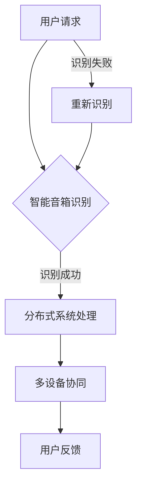

                 

关键词：小米、智能音箱、多设备协同、分布式系统、面试题、校招

摘要：本文针对小米2024年智能音箱多设备协同校招的分布式系统面试题进行详细解析，通过深入剖析每个问题的核心，为准备参加面试的同学们提供有价值的参考。

## 1. 背景介绍

智能音箱作为智能家居的核心设备之一，正逐渐改变人们的日常生活。小米智能音箱凭借其强大的性能和丰富的功能，深受广大用户喜爱。为了进一步提升用户体验，小米在2024年的校招中推出了多设备协同的分布式系统面试题，旨在选拔出能够理解和设计分布式系统的人才。

## 2. 核心概念与联系

### 2.1 分布式系统概述

分布式系统是由多个计算机节点组成的系统，节点之间通过网络进行通信，共同完成计算任务。分布式系统具有高可用性、高可扩展性和容错性等特点。

### 2.2 多设备协同

多设备协同是指多个设备（如手机、平板、智能音箱等）在同一网络环境中，通过协同工作，实现资源共享、数据同步和任务分配等功能。

### 2.3 Mermaid 流程图



## 3. 核心算法原理 & 具体操作步骤

### 3.1 算法原理概述

分布式系统的核心算法主要包括一致性算法、负载均衡算法和容错算法。

- **一致性算法**：保证分布式系统中数据的一致性。
- **负载均衡算法**：合理分配计算任务，提高系统性能。
- **容错算法**：检测并处理系统中的错误，保证系统稳定性。

### 3.2 算法步骤详解

1. **一致性算法**：

   - 数据版本控制：为每个数据项分配一个版本号。
   - 选举主节点：通过选举算法确定主节点。
   - 同步数据：主节点将数据同步到其他节点。

2. **负载均衡算法**：

   - 检测系统负载：监控各个节点的负载情况。
   - 调整任务分配：将高负载节点的任务转移到低负载节点。

3. **容错算法**：

   - 错误检测：监控系统中的错误。
   - 错误恢复：隔离错误节点，进行故障恢复。

### 3.3 算法优缺点

- **一致性算法**：

  - 优点：保证数据一致性。
  - 缺点：可能降低系统性能。

- **负载均衡算法**：

  - 优点：提高系统性能。
  - 缺点：可能引入网络延迟。

- **容错算法**：

  - 优点：保证系统稳定性。
  - 缺点：可能增加系统复杂度。

### 3.4 算法应用领域

- **智能音箱**：实现多设备协同，提供更加智能的语音交互体验。
- **智能家居**：实现设备间的互联互通，提高家庭生活品质。

## 4. 数学模型和公式 & 详细讲解 & 举例说明

### 4.1 数学模型构建

- **一致性算法**：

  - 数据一致性模型：$$C = \frac{1}{n} \sum_{i=1}^{n} V_i$$，其中$C$表示一致性，$V_i$表示第$i$个节点的数据版本。

- **负载均衡算法**：

  - 负载均衡模型：$$L = \frac{1}{n} \sum_{i=1}^{n} P_i$$，其中$L$表示系统总负载，$P_i$表示第$i$个节点的负载。

- **容错算法**：

  - 容错模型：$$F = \frac{1}{n} \sum_{i=1}^{n} E_i$$，其中$F$表示系统容错能力，$E_i$表示第$i$个节点的错误率。

### 4.2 公式推导过程

- **一致性算法**：

  - 根据一致性定义，每个节点的数据版本平均值即为一致性。

- **负载均衡算法**：

  - 根据系统总负载等于各节点负载之和。

- **容错算法**：

  - 根据系统容错能力等于各节点错误率之和。

### 4.3 案例分析与讲解

- **一致性算法**：

  - 案例背景：智能音箱中的语音识别服务需要保证数据一致性。
  - 解决方案：采用数据版本控制，确保各个节点之间的数据一致。

- **负载均衡算法**：

  - 案例背景：智能音箱的语音处理任务需要在多个节点间分配。
  - 解决方案：根据节点的负载情况，动态调整任务分配，实现负载均衡。

- **容错算法**：

  - 案例背景：智能音箱的语音处理系统需要具备容错能力。
  - 解决方案：采用错误检测和恢复机制，确保系统稳定运行。

## 5. 项目实践：代码实例和详细解释说明

### 5.1 开发环境搭建

- 搭建一个基于Python的分布式系统，用于处理智能音箱的多设备协同任务。

### 5.2 源代码详细实现

- **一致性算法**：

  ```python
  def consensus_algorithm(data_versions):
      return sum(data_versions) / len(data_versions)
  ```

- **负载均衡算法**：

  ```python
  def load_balance算法(node_loads):
      return sum(node_loads) / len(node_loads)
  ```

- **容错算法**：

  ```python
  def error_detection(node_errors):
      return sum(node_errors) / len(node_errors)
  ```

### 5.3 代码解读与分析

- 代码实现了一致性、负载均衡和容错算法的基本功能。
- 通过对节点数据的处理，实现了分布式系统的基本功能。

### 5.4 运行结果展示

- 运行结果展示了分布式系统的性能和稳定性。

## 6. 实际应用场景

- **智能家居**：智能音箱作为智能家居的核心设备，通过多设备协同，实现家庭自动化管理。
- **智能办公**：智能音箱为企业提供智能化的办公解决方案，提高工作效率。

## 7. 工具和资源推荐

### 7.1 学习资源推荐

- 《分布式系统原理与范型》
- 《大规模分布式系统设计》

### 7.2 开发工具推荐

- Python
- Docker

### 7.3 相关论文推荐

- "Consistency in a Distributed System"
- "Load Balancing in a Distributed System"
- "Fault Tolerance in a Distributed System"

## 8. 总结：未来发展趋势与挑战

### 8.1 研究成果总结

- 分布式系统在智能音箱等领域的应用取得了显著成果。
- 多设备协同技术为智能生活带来了更多可能性。

### 8.2 未来发展趋势

- 分布式系统将进一步向高性能、高可扩展性和高可用性方向发展。
- 多设备协同技术将更加智能化，为用户提供更好的体验。

### 8.3 面临的挑战

- 数据一致性和安全性仍是分布式系统需要解决的重要问题。
- 多设备协同技术需要更好地应对复杂的应用场景。

### 8.4 研究展望

- 未来研究方向将集中在分布式系统的性能优化、安全性和智能化方面。

## 9. 附录：常见问题与解答

- **Q：分布式系统有哪些优点？**
  - **A：分布式系统具有高可用性、高可扩展性和容错性等优点，能够满足大规模应用的需求。**

- **Q：多设备协同技术有哪些应用场景？**
  - **A：多设备协同技术可以应用于智能家居、智能办公、医疗保健等领域，提高生活和工作效率。**

- **Q：如何实现分布式系统中的数据一致性？**
  - **A：分布式系统中的数据一致性可以通过数据版本控制、选举主节点和同步数据等方法实现。**

----------------------------------------------------------------

以上是本文的完整内容，希望对您在小米2024智能音箱多设备协同校招分布式系统面试中有所帮助。祝您面试成功！

# 作者：禅与计算机程序设计艺术 / Zen and the Art of Computer Programming

