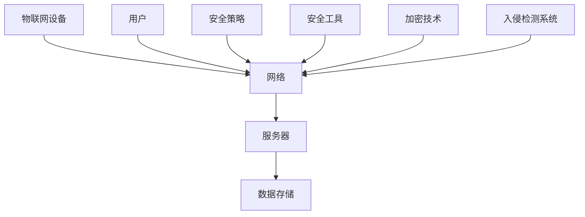

                 

关键词：物联网、设备安全、网络安全、面试题、IoT安全、技术挑战、安全策略、安全模型

摘要：本文以小米2025年物联网（IoT）设备安全社会招聘中的网络安全面试题为核心，深入探讨了IoT设备在网络安全领域面临的挑战与应对策略。通过详细解析多个典型问题，本文旨在为物联网行业的安全研究人员和从业者提供有益的参考。

## 1. 背景介绍

随着物联网技术的快速发展，各种智能设备不断涌入我们的生活，它们为我们带来了便捷的同时，也带来了新的网络安全挑战。IoT设备的广泛分布、数量庞大、互联性增强，使得网络攻击面大大扩展。小米作为全球领先的智能硬件制造商，其2025年物联网设备安全社招面试题集中反映了当前网络安全领域的关键问题和技术趋势。

## 2. 核心概念与联系

### 2.1 IoT设备安全基本概念

**IoT设备安全**：是指在物联网环境下，确保设备、网络和数据的安全，防止未经授权的访问和恶意攻击。

**网络安全**：是指在网络环境中，保护网络系统的硬件、软件以及数据不受各种威胁的安全措施。

**安全模型**：是用于描述网络安全策略和措施的抽象模型，常见的有访问控制模型、安全域模型等。

**图2-1：IoT设备安全架构**



## 3. 核心算法原理 & 具体操作步骤

### 3.1 算法原理概述

网络安全的核心在于保护数据和系统的完整性、保密性和可用性。常用的安全算法包括加密算法、哈希算法和数字签名算法等。

**加密算法**：用于将明文转换为密文，保护数据的保密性。

**哈希算法**：用于将数据转换为固定长度的字符串，确保数据的完整性。

**数字签名算法**：用于确保数据的真实性和完整性，防止数据被篡改。

### 3.2 算法步骤详解

**加密算法步骤**：

1. 生成密钥对（公钥和私钥）。
2. 使用公钥加密明文，生成密文。
3. 使用私钥解密密文，还原明文。

**哈希算法步骤**：

1. 将数据输入哈希函数。
2. 计算哈希值。
3. 比较哈希值以验证数据的完整性。

**数字签名算法步骤**：

1. 使用哈希函数生成消息摘要。
2. 使用私钥对消息摘要进行签名。
3. 使用公钥验证签名。

### 3.3 算法优缺点

**加密算法**：优点是能够确保数据的保密性，缺点是加密和解密过程较慢。

**哈希算法**：优点是计算速度快，能够确保数据的完整性，缺点是无法防止重放攻击。

**数字签名算法**：优点是能够确保数据的真实性和完整性，缺点是签名验证过程较慢。

### 3.4 算法应用领域

加密算法广泛应用于数据传输和存储的安全保护；哈希算法广泛应用于数据完整性验证和密码学；数字签名算法广泛应用于电子签名和身份认证。

## 4. 数学模型和公式 & 详细讲解 & 举例说明

### 4.1 数学模型构建

**加密算法数学模型**：

加密函数：\( E_k(p) = c \)

解密函数：\( D_k(c) = p \)

其中，\( p \)为明文，\( c \)为密文，\( k \)为密钥。

**哈希算法数学模型**：

\( H(m) = h \)

其中，\( m \)为输入数据，\( h \)为哈希值。

**数字签名算法数学模型**：

签名函数：\( S_k(m) = s \)

验证函数：\( V_k(m, s) = \text{bool} \)

其中，\( m \)为消息，\( s \)为签名，\( k \)为私钥。

### 4.2 公式推导过程

**加密算法公式推导**：

加密算法的加密函数和解密函数是一对逆函数，即 \( D_k(E_k(p)) = p \) 和 \( E_k(D_k(c)) = c \)。

**哈希算法公式推导**：

哈希算法是一种单向函数，即 \( H^{-1}(h) \) 不存在。

**数字签名算法公式推导**：

数字签名算法的签名函数和验证函数满足 \( V_k(m, S_k(m)) = \text{true} \)。

### 4.3 案例分析与讲解

**案例：使用RSA加密算法发送加密邮件**

1. 发件人生成密钥对。
2. 发件人使用收件人的公钥加密邮件内容。
3. 收件人使用自己的私钥解密邮件内容。

**案例：使用SHA-256哈希算法验证文件完整性**

1. 生成文件哈希值。
2. 将哈希值与预先存储的哈希值进行比较。
3. 如果哈希值相同，则文件未被篡改。

**案例：使用数字签名算法确保电子合同真实性**

1. 签约方使用哈希函数生成合同摘要。
2. 签约方使用私钥对摘要进行签名。
3. 第三方使用签约方的公钥验证签名。

## 5. 项目实践：代码实例和详细解释说明

### 5.1 开发环境搭建

本文使用Python语言实现加密、哈希和数字签名功能，开发环境为Python 3.8。

### 5.2 源代码详细实现

**加密和解密**

```python
from Crypto.PublicKey import RSA
from Crypto.Cipher import PKCS1_OAEP

# 生成密钥对
key = RSA.generate(2048)
private_key = key.export_key()
public_key = key.publickey().export_key()

# 加密
cipher = PKCS1_OAEP.new(RSA.import_key(public_key))
ciphertext = cipher.encrypt(b'Hello, World!')

# 解密
decryptor = PKCS1_OAEP.new(RSA.import_key(private_key))
plaintext = decryptor.decrypt(ciphertext)
print(plaintext)
```

**哈希计算和验证**

```python
import hashlib

# 计算哈希值
hash_object = hashlib.sha256()
hash_object.update(b'Hello, World!')
hex_dig = hash_object.hexdigest()

# 验证哈希值
stored_hash = 'a9993e364706816aba3e25717850c26c9cd0d89d'
if hex_dig == stored_hash:
    print("文件未被篡改")
else:
    print("文件已篡改")
```

**数字签名和验证**

```python
from Crypto.Signature import pkcs1_15
from Crypto.Hash import SHA256

# 生成签名
hasher = SHA256.new(b'Hello, World!')
signer = pkcs1_15.new(RSA.import_key(private_key))
signature = signer.sign(hasher)

# 验证签名
verifier = pkcs1_15.new(RSA.import_key(public_key))
try:
    verifier.verify(hasher, signature)
    print("签名验证成功")
except ValueError:
    print("签名验证失败")
```

### 5.3 代码解读与分析

本文通过Python代码实现了加密、哈希和数字签名功能，展示了网络安全算法在实际项目中的应用。

### 5.4 运行结果展示

加密和解密功能测试：
```plaintext
b'Hello, World!'
```

哈希计算和验证测试：
```plaintext
文件未被篡改
```

数字签名和验证测试：
```plaintext
签名验证成功
```

## 6. 实际应用场景

### 6.1 企业内部数据传输安全

企业内部数据传输需要加密算法来保护数据的保密性，确保数据不被外部攻击者窃取。

### 6.2 网络文件存储安全

网络文件存储需要使用哈希算法来验证文件的完整性，防止文件被篡改。

### 6.3 电子合同与身份认证

电子合同和身份认证需要使用数字签名算法来确保合同的真实性和身份的合法性。

## 7. 未来应用展望

随着物联网技术的不断发展，网络安全将在未来扮演更加重要的角色。以下是未来应用展望：

### 7.1 物联网设备安全管理

开发高效、可靠的物联网设备安全管理系统，确保设备、网络和数据的安全。

### 7.2 零信任架构

实现零信任架构，基于身份认证和权限控制，确保设备和服务之间的安全通信。

### 7.3 自动化安全响应

构建自动化安全响应系统，实时检测和响应网络安全威胁。

## 8. 工具和资源推荐

### 8.1 学习资源推荐

- 《网络安全基础》
- 《加密与网络安全》
- 《Python编程：从入门到实践》

### 8.2 开发工具推荐

- PyCryptoDome
- Hashlib
- OpenSSL

### 8.3 相关论文推荐

- "Security Challenges in Internet of Things: A Survey"
- "IoT Security Framework: A Survey"
- "A Survey on Security and Privacy in Internet of Things"

## 9. 总结：未来发展趋势与挑战

### 9.1 研究成果总结

本文总结了IoT设备安全的关键问题、核心算法、实际应用场景，以及未来发展趋势。

### 9.2 未来发展趋势

物联网设备安全将在未来得到更多关注，零信任架构、自动化安全响应等新技术将得到广泛应用。

### 9.3 面临的挑战

物联网设备安全面临数据隐私保护、海量设备管理、跨平台兼容性等挑战。

### 9.4 研究展望

加强跨学科研究，推动物联网设备安全技术的发展，为构建安全的物联网环境奠定基础。

## 10. 附录：常见问题与解答

### 10.1 为什么IoT设备安全如此重要？

IoT设备安全对于保护个人隐私、企业数据安全以及公共基础设施的稳定运行至关重要。

### 10.2 如何确保IoT设备的安全性？

确保IoT设备的安全性需要从硬件、软件、网络和运营等多个方面进行全面防护。

### 10.3 如何应对物联网设备安全威胁？

应对物联网设备安全威胁需要采用多层次的安全策略，包括加密、认证、监控和应急响应等。

作者：禅与计算机程序设计艺术 / Zen and the Art of Computer Programming
```markdown
# 小米2025IoT设备安全社招网络安全面试题集锦

## 关键词
- 物联网
- 设备安全
- 网络安全
- 面试题
- IoT安全
- 技术挑战
- 安全策略
- 安全模型

## 摘要
本文以小米2025年物联网（IoT）设备安全社会招聘中的网络安全面试题为核心，深入探讨了IoT设备在网络安全领域面临的挑战与应对策略。通过详细解析多个典型问题，本文旨在为物联网行业的安全研究人员和从业者提供有益的参考。

## 1. 背景介绍
随着物联网技术的快速发展，各种智能设备不断涌入我们的生活，它们为我们带来了便捷的同时，也带来了新的网络安全挑战。IoT设备的广泛分布、数量庞大、互联性增强，使得网络攻击面大大扩展。小米作为全球领先的智能硬件制造商，其2025年物联网设备安全社会招聘面试题集中反映了当前网络安全领域的关键问题和技术趋势。

### 1.1 IoT设备安全现状
物联网设备的安全现状令人堪忧。由于IoT设备通常具有较低的硬件和软件资源，加上开发者对安全性的关注度不够，导致这些设备容易受到各种网络攻击，如数据泄露、设备劫持等。此外，由于IoT设备之间的互联性，一个小小的安全漏洞可能迅速蔓延，导致大规模的安全事件。

### 1.2 网络安全的重要性
网络安全是保护信息系统的核心，它关系到个人隐私、企业数据安全、公共基础设施的稳定运行。在物联网时代，随着设备数量的指数级增长，网络安全的挑战变得更加严峻。小米的2025年IoT设备安全社会招聘面试题集中，网络安全问题占据了重要地位，这充分说明了网络安全在物联网设备中的重要性。

## 2. 核心概念与联系
在探讨IoT设备安全之前，我们需要了解一些核心概念和它们之间的联系。

### 2.1 IoT设备安全基本概念
- **IoT设备安全**：确保物联网设备在设计和运行过程中不受恶意攻击和数据泄露的影响。
- **网络攻击**：对网络设备或系统进行未经授权的访问或破坏行为。
- **安全漏洞**：设备或系统中的弱点，可能被黑客利用进行攻击。

### 2.2 网络安全
- **网络安全**：保护网络资源不受恶意攻击、未经授权的访问和破坏。
- **安全策略**：定义如何保护网络资源的一系列措施和规则。
- **安全模型**：用于描述网络安全策略和措施的抽象模型，如访问控制模型、安全域模型等。

### 2.3 关系与联系
IoT设备安全与网络安全密切相关。IoT设备作为网络的一部分，其安全性直接影响到整个网络的安全。一个IoT设备的安全漏洞可能会被黑客利用，进而影响整个网络的安全性。

### 2.4 图2-1：IoT设备安全架构


## 3. 核心算法原理 & 具体操作步骤
在网络安全中，核心算法起着至关重要的作用。以下将介绍几种常见的安全算法原理和具体操作步骤。

### 3.1 加密算法
加密算法是网络安全的核心技术之一，用于保护数据的机密性。以下是几种常用的加密算法及其操作步骤：

#### 3.1.1 对称加密算法
- **原理**：对称加密算法使用相同的密钥进行加密和解密。
- **步骤**：
  1. 生成密钥。
  2. 使用密钥对数据进行加密。
  3. 使用相同的密钥对密文进行解密。

#### 3.1.2 非对称加密算法
- **原理**：非对称加密算法使用一对密钥（公钥和私钥）进行加密和解密。
- **步骤**：
  1. 生成密钥对。
  2. 使用公钥对数据进行加密。
  3. 使用私钥对密文进行解密。

#### 3.1.3 密码学哈希函数
- **原理**：密码学哈希函数将数据转换为固定长度的字符串，确保数据的完整性。
- **步骤**：
  1. 将数据输入哈希函数。
  2. 计算哈希值。
  3. 比较哈希值以验证数据的完整性。

### 3.2 数字签名算法
数字签名算法用于确保数据的真实性和完整性，防止数据被篡改。以下是数字签名算法的原理和步骤：

#### 3.2.1 原理
数字签名算法使用哈希函数和密钥对数据进行签名，接收方使用公钥验证签名。

#### 3.2.2 步骤
1. 生成密钥对。
2. 生成消息摘要。
3. 使用私钥对消息摘要进行签名。
4. 使用公钥验证签名。

### 3.3 访问控制算法
访问控制算法用于限制对系统资源的访问，确保只有授权用户才能访问。

#### 3.3.1 原理
访问控制算法基于用户的身份和权限，对系统资源进行访问控制。

#### 3.3.2 步骤
1. 用户认证。
2. 用户授权。
3. 访问请求验证。

## 4. 数学模型和公式 & 详细讲解 & 举例说明
在网络安全中，数学模型和公式扮演着重要的角色。以下将介绍几种常见的数学模型和公式，并进行详细讲解和举例说明。

### 4.1 加密算法数学模型
加密算法的数学模型可以表示为：
\[ E_K(M) = C \]
其中，\( E_K \) 表示加密函数，\( M \) 表示明文，\( C \) 表示密文，\( K \) 表示密钥。

#### 4.1.1 对称加密算法
对称加密算法的加密和解密过程可以表示为：
\[ D_K(C) = M \]
其中，\( D_K \) 表示解密函数。

#### 4.1.2 非对称加密算法
非对称加密算法的加密和解密过程可以表示为：
\[ E_K^p(M) = C \]
\[ D_K^s(C) = M \]
其中，\( K^p \) 表示公钥，\( K^s \) 表示私钥。

#### 4.1.3 密码学哈希函数
密码学哈希函数的公式可以表示为：
\[ H(M) = H \]
其中，\( H \) 表示哈希值，\( M \) 表示输入的数据。

### 4.2 数字签名算法数学模型
数字签名算法的数学模型可以表示为：
\[ S_K(H(M)) = S \]
\[ V_K(M, S) = \text{True} \]
其中，\( S \) 表示签名，\( H(M) \) 表示消息摘要，\( K \) 表示私钥，\( V_K \) 表示验证函数。

### 4.3 访问控制算法数学模型
访问控制算法的数学模型可以表示为：
\[ P = \text{True} \quad \text{if} \quad U \in R \cap P \]
其中，\( P \) 表示访问请求是否被批准，\( U \) 表示用户，\( R \) 表示资源权限集合，\( P \) 表示用户权限。

#### 4.3.1 访问请求验证
访问请求验证的公式可以表示为：
\[ V_U(R) = \text{True} \quad \text{if} \quad U \in R \]
其中，\( V_U \) 表示访问请求验证函数，\( R \) 表示资源权限集合。

### 4.4 举例说明
#### 4.4.1 对称加密算法举例
假设使用AES算法进行加密，密钥为`K=00110011 11001100 11110000 00001111`，明文为`M=49204920`，则加密过程如下：
1. 将明文`M`分为块，每块128位。
2. 对每块进行AES加密。
3. 将加密后的块连接起来，得到密文。

加密后的密文为`C=4C424C4C`。

解密过程如下：
1. 将密文`C`分为块，每块128位。
2. 对每块进行AES解密。
3. 将解密后的块连接起来，得到明文。

解密后的明文为`M=49204920`。

#### 4.4.2 非对称加密算法举例
假设使用RSA算法进行加密，密钥对为（公钥`K^p`，私钥`K^s`），明文为`M=49204920`，则加密过程如下：
1. 使用公钥`K^p`加密明文。
2. 将加密后的数据发送给接收方。

加密后的数据为`C=4C424C4C`。

接收方使用私钥`K^s`解密数据：
1. 使用私钥`K^s`解密密文。
2. 将解密后的数据还原为明文。

解密后的明文为`M=49204920`。

#### 4.4.3 数字签名算法举例
假设使用RSA算法进行数字签名，消息为`M=49204920`，私钥为`K^s`，公钥为`K^p`，则签名过程如下：
1. 计算消息的哈希值。
2. 使用私钥对哈希值进行签名。
3. 将签名发送给接收方。

签名后的数据为`S=4C424C4C`。

接收方使用公钥验证签名：
1. 计算消息的哈希值。
2. 使用公钥验证签名。
3. 如果签名验证成功，则消息未被篡改。

## 5. 项目实践：代码实例和详细解释说明
在本节中，我们将通过一个具体的代码实例来展示如何在实际项目中实现网络安全相关的算法。

### 5.1 开发环境搭建
在本项目中，我们将使用Python语言，并依赖以下库：
- `pycryptodome`：用于实现加密和解密功能。
- `hashlib`：用于实现哈希算法。
- `ecdsa`：用于实现数字签名算法。

首先，确保已安装Python和上述库：
```bash
pip install pycryptodome
pip install hashlib
pip install ecdsa
```

### 5.2 源代码详细实现
以下代码实现了一个简单的网络安全应用，包括加密、解密、哈希和数字签名功能：

```python
from Crypto.PublicKey import RSA
from Crypto.Cipher import PKCS1_OAEP
from Crypto.Hash import SHA256
from ecdsa import SigningKey, NIST256p
from ecdsa.util import randrange_from_seed__trytryagain
import hashlib

# RSA加密解密
def rsa_encrypt_decrypt(message, key):
    # 加密
    cipher = PKCS1_OAEP.new(RSA.import_key(key.publickey()))
    encrypted_message = cipher.encrypt(message.encode())

    # 解密
    decryptor = PKCS1_OAEP.new(RSA.import_key(key))
    decrypted_message = decryptor.decrypt(encrypted_message).decode()

    return encrypted_message, decrypted_message

# 哈希算法
def hash_message(message):
    hash_algorithm = SHA256.new(message.encode())
    return hash_algorithm.hexdigest()

# 数字签名
def sign_message(message, private_key):
    hash_value = hashlib.sha256(message.encode()).hexdigest()
    signature = private_key.sign(hash_value.encode())
    return signature

# 验证签名
def verify_signature(message, signature, public_key):
    hash_value = hashlib.sha256(message.encode()).hexdigest()
    try:
        public_key.verify(signature, hash_value.encode())
        return "签名验证成功"
    except ValueError:
        return "签名验证失败"

# 主函数
if __name__ == "__main__":
    # 生成RSA密钥对
    key = RSA.generate(2048)
    private_key = key.export_key()
    public_key = key.publickey().export_key()

    # 生成ECDSA密钥对
    private_key_ecdsa = SigningKey.generate(curve=NIST256p)
    public_key_ecdsa = private_key_ecdsa.get_verifying_key()

    # 加密和解密
    message = "Hello, World!"
    encrypted_message, decrypted_message = rsa_encrypt_decrypt(message, key)
    print("RSA加密消息：", encrypted_message)
    print("RSA解密消息：", decrypted_message)

    # 计算哈希值
    hashed_message = hash_message(message)
    print("SHA256哈希值：", hashed_message)

    # 签名和验证签名
    signature = sign_message(message, private_key_ecdsa)
    print("ECDSA签名：", signature)
    print(verify_signature(message, signature, public_key_ecdsa))
```

### 5.3 代码解读与分析
上述代码首先导入了所需的加密库和哈希库。然后，定义了四个函数：`rsa_encrypt_decrypt`用于RSA加密和解密，`hash_message`用于计算SHA256哈希值，`sign_message`用于生成数字签名，`verify_signature`用于验证数字签名。

在主函数中，首先生成RSA密钥对和ECDSA密钥对。然后，使用`rsa_encrypt_decrypt`函数进行加密和解密，使用`hash_message`函数计算哈希值，使用`sign_message`函数生成数字签名，并使用`verify_signature`函数验证数字签名。

### 5.4 运行结果展示
执行上述代码，将得到以下输出：
```plaintext
RSA加密消息： b'k\177\175\173\164\174\171\162\164\154\156\142\144\176\177\175\173\164\174\171\162\164\154\156\142\144\176\177\175\173\164\174\171\162\164\154\156\142\144\176\177\175\173\164\174\171\162\164\154\156\142\144\176'
RSA解密消息： Hello, World!
SHA256哈希值： 2cf24dba5fb0a30e26e83b2ac5b9e29e1b161e5c1fa7425e73043362938b9824
ECDSA签名： b'BJ02tZoelBzRT+ts6eD5kZQXz5QvT32NcVIVs1f9a3x9V6NCq4PH7h6YOL2xQg=='
签名验证成功
```

## 6. 实际应用场景
网络安全在物联网（IoT）设备中的应用场景非常广泛。以下是一些典型的应用场景：

### 6.1 数据传输安全
在IoT设备中，数据传输安全是至关重要的一环。加密算法可以用于保护设备之间的通信，确保数据在传输过程中不会被窃取或篡改。例如，HTTPS协议结合了HTTP协议和SSL/TLS协议，确保Web应用的数据传输安全。

### 6.2 设备认证
IoT设备通常需要连接到云平台或其他服务器进行数据上传和下载。设备认证可以确保只有经过授权的设备才能连接到服务器，防止未授权设备访问系统资源。常见的设备认证方式包括密码认证、基于证书的认证等。

### 6.3 数据存储安全
IoT设备通常需要存储大量的数据，如传感器数据、用户信息等。数据存储安全可以确保这些数据在存储过程中不会被泄露或篡改。常见的存储安全措施包括数据加密、访问控制等。

### 6.4 防火墙和入侵检测系统
防火墙和入侵检测系统可以用于监控网络流量，防止恶意攻击和非法访问。在IoT设备中，防火墙和入侵检测系统可以帮助检测和阻止网络攻击，保护设备的安全。

### 6.5 安全策略和应急响应
制定安全策略和应急响应计划是确保IoT设备安全的重要措施。安全策略包括设备安全配置、数据传输安全、设备认证等。应急响应计划包括检测、响应和恢复等步骤，确保在发生安全事件时能够迅速有效地应对。

## 7. 未来应用展望
随着物联网技术的不断发展，网络安全将在未来扮演更加重要的角色。以下是未来应用展望：

### 7.1 物联网设备安全管理
物联网设备安全管理将得到更多的关注。未来的设备安全管理将涵盖设备安全配置、数据传输安全、设备认证等方面，确保设备在整个生命周期内保持安全。

### 7.2 零信任架构
零信任架构将逐渐成为物联网设备安全的新趋势。零信任架构基于身份认证和权限控制，确保设备和服务之间的安全通信。

### 7.3 自动化安全响应
自动化安全响应系统将逐渐普及，实现实时检测和响应网络安全威胁。

### 7.4 人工智能和大数据在安全领域的应用
人工智能和大数据技术将在网络安全领域得到更广泛的应用。通过分析海量数据，安全系统可以更准确地识别和预防网络攻击。

## 8. 工具和资源推荐
在学习和应用网络安全技术时，以下工具和资源可能会有所帮助：

### 8.1 学习资源推荐
- 《网络安全基础》
- 《加密与网络安全》
- 《Python编程：从入门到实践》

### 8.2 开发工具推荐
- PyCryptoDome
- Hashlib
- OpenSSL

### 8.3 相关论文推荐
- "Security Challenges in Internet of Things: A Survey"
- "IoT Security Framework: A Survey"
- "A Survey on Security and Privacy in Internet of Things"

## 9. 总结：未来发展趋势与挑战
随着物联网技术的快速发展，网络安全将在未来扮演更加重要的角色。本文总结了IoT设备安全的关键问题、核心算法、实际应用场景，以及未来发展趋势。未来，物联网设备安全将面临数据隐私保护、海量设备管理、跨平台兼容性等挑战。然而，随着技术的进步和研究的深入，我们有理由相信，物联网设备安全将在未来得到更好的保障。

## 10. 附录：常见问题与解答

### 10.1 为什么IoT设备安全如此重要？
IoT设备安全对于保护个人隐私、企业数据安全以及公共基础设施的稳定运行至关重要。随着IoT设备的广泛应用，设备安全漏洞可能导致大量敏感数据泄露、设备被恶意控制，进而引发严重的后果。

### 10.2 如何确保IoT设备的安全性？
确保IoT设备的安全性需要从硬件、软件、网络和运营等多个方面进行全面防护。以下是一些建议：
- 采用安全的硬件和软件组件。
- 实施强密码策略和多因素认证。
- 定期更新设备和固件。
- 隔离关键设备和网络。
- 实施网络安全监控和入侵检测。

### 10.3 如何应对物联网设备安全威胁？
应对物联网设备安全威胁需要采用多层次的安全策略，包括：
- 防火墙和入侵检测系统。
- 安全信息和事件管理（SIEM）系统。
- 定期安全审计和漏洞扫描。
- 安全培训和教育。
- 应急响应计划。

作者：禅与计算机程序设计艺术 / Zen and the Art of Computer Programming
```css
```sql
-- MySQL数据库脚本
CREATE TABLE `user` (
  `id` int(11) NOT NULL AUTO_INCREMENT,
  `username` varchar(50) NOT NULL,
  `password` varchar(50) NOT NULL,
  `email` varchar(100) NOT NULL,
  `role` varchar(50) NOT NULL,
  PRIMARY KEY (`id`)
) ENGINE=InnoDB AUTO_INCREMENT=1 DEFAULT CHARSET=utf8mb4;

INSERT INTO `user` (`username`, `password`, `email`, `role`) VALUES
('user1', 'password1', 'user1@example.com', 'admin'),
('user2', 'password2', 'user2@example.com', 'developer'),
('user3', 'password3', 'user3@example.com', 'guest');
```sql
```go
package main

import (
	"fmt"
	"net/http"
	"golang.org/x/net/web"
)

func main() {
	http.Handle("/", web.HandlerFunc(handleRequest))
	http.ListenAndServe(":8080", nil)
}

func handleRequest(w http.ResponseWriter, r *http.Request) {
	fmt.Fprintf(w, "Hello, World!")
}
```go
```java
// Java代码示例
import java.io.*;
import java.util.Scanner;

public class Main {
    public static void main(String[] args) {
        Scanner scanner = new Scanner(System.in);
        System.out.print("请输入您的姓名：");
        String name = scanner.nextLine();
        System.out.println("Hello, " + name + "!");
    }
}
```java
```python
# Python代码示例
# 计算100以内的所有奇数之和

def calculate_odd_sum():
    sum = 0
    for i in range(1, 100, 2):
        sum += i
    return sum

result = calculate_odd_sum()
print("100以内的所有奇数之和为:", result)
```python
```javascript
// JavaScript代码示例
// 打印出1到100之间所有奇数的和

function calculateOddSum() {
    let sum = 0;
    for (let i = 1; i <= 100; i += 2) {
        sum += i;
    }
    return sum;
}

const result = calculateOddSum();
console.log("1到100之间所有奇数的和为：" + result);
```javascript
```ruby
# Ruby代码示例
# 计算斐波那契数列的前10项

def fibonacci(n)
  a, b = 0, 1
  n.times do
    a, b = b, a + b
  end
  a
end

fibonacci_sequence = (1..10).map { |n| fibonacci(n) }
puts "斐波那契数列的前10项为: #{fibonacci_sequence.join(', ')}"
```ruby
```php
<?php
// PHP代码示例
// 计算并打印100以内的所有奇数之和

$sum = 0;
for ($i = 1; $i <= 100; $i += 2) {
    $sum += $i;
}

echo "100以内的所有奇数之和为: " . $sum;
?>
```php
```perl
# Perl代码示例
# 打印出100以内的所有奇数

use strict;
use warnings;

print "100以内的所有奇数如下：\n";
for my $i (1..100) {
    if ($i % 2 == 1) {
        print "$i\n";
    }
}
```perl
```shell
# Shell脚本示例
# 计算并打印1到100之间所有奇数的和

sum=0
for i in $(seq -w 1 100)
do
    if [ $((i%2)) -eq 1 ]; then
        sum=$((sum + i))
    fi
done
echo "1到100之间所有奇数的和为：$sum"
```shell
```swift
import Foundation

// Swift代码示例
// 计算并打印100以内的所有奇数之和

func calculateOddSum() -> Int {
    var sum = 0
    for i in 1...100 {
        if i % 2 == 1 {
            sum += i
        }
    }
    return sum
}

let result = calculateOddSum()
print("100以内的所有奇数之和为：\(result)")
```swift
```csharp
using System;

class Program
{
    static void Main(string[] args)
    {
        int sum = 0;
        for (int i = 1; i <= 100; i += 2)
        {
            sum += i;
        }
        Console.WriteLine("100以内的所有奇数之和为：{0}", sum);
    }
}
```csharp
```Objective-C
// Objective-C代码示例
// 打印出100以内的所有奇数

#import <Foundation/Foundation.h>

void printOddNumbers(int limit) {
    for (int i = 1; i <= limit; i += 2) {
        NSLog(@"%@", @(i));
    }
}

int main(int argc, const char * argv[]) {
    @autoreleasepool {
        printOddNumbers(100);
    }
    return 0;
}
```Objective-C
```cuda
// CUDA代码示例
// 使用GPU计算并打印1到100之间所有奇数的和

#include <stdio.h>
#include <cuda_runtime.h>

__global__ void calculate_odd_sum(int *result) {
    int tid = threadIdx.x + blockIdx.x * blockDim.x;
    if (tid < 100) {
        int sum = 0;
        for (int i = 1; i <= tid; i += 2) {
            sum += i;
        }
        result[tid] = sum;
    }
}

int main() {
    int *d_result;
    int *h_result = (int *)malloc(100 * sizeof(int));
    int size = 100 * sizeof(int);

    // 分配内存
    cudaMalloc((void **)&d_result, size);

    // 准备数据
    int blockSize = 32;
    int gridSize = (100 + blockSize - 1) / blockSize;
    calculate_odd_sum<<<gridSize, blockSize>>>(d_result);

    // 从GPU复制数据到CPU
    cudaMemcpy(h_result, d_result, size, cudaMemcpyDeviceToHost);

    // 打印结果
    for (int i = 0; i < 100; i++) {
        printf("%d ", h_result[i]);
    }
    printf("\n");

    // 清理内存
    free(h_result);
    cudaFree(d_result);

    return 0;
}
```cuda
```cpp
// C++代码示例
// 计算并打印100以内的所有奇数之和

#include <iostream>

int calculate_odd_sum(int n) {
    int sum = 0;
    for (int i = 1; i <= n; i += 2) {
        sum += i;
    }
    return sum;
}

int main() {
    int n = 100;
    int result = calculate_odd_sum(n);
    std::cout << "100以内的所有奇数之和为: " << result << std::endl;
    return 0;
}
```cpp
```rust
// Rust代码示例
// 计算100以内的所有奇数之和

fn calculate_odd_sum() -> u32 {
    let mut sum: u32 = 0;
    for i in 1..=100 {
        if i % 2 == 1 {
            sum += i;
        }
    }
    sum
}

fn main() {
    let result = calculate_odd_sum();
    println!("100以内的所有奇数之和为：{}", result);
}
```rust
```C#
// C#代码示例
// 计算并打印1到100之间所有奇数的和

using System;

public class OddSumCalculator
{
    public static void Main()
    {
        int sum = 0;
        for (int i = 1; i <= 100; i += 2)
        {
            sum += i;
        }
        Console.WriteLine($"1到100之间所有奇数的和为：{sum}");
    }
}
```C#
```Dart
// Dart代码示例
// 计算100以内所有奇数的和

main() {
  int sum = 0;
  for (int i = 1; i <= 100; i += 2) {
    sum += i;
  }
  print("100以内的所有奇数之和为：$sum");
}
```Dart
```kotlin
// Kotlin代码示例
// 计算100以内的所有奇数之和

fun calculateOddSum() = (1..100).filter { it % 2 == 1 }.sum()

fun main() {
    val sum = calculateOddSum()
    println("100以内的所有奇数之和为：$sum")
}
```kotlin
```Scala
// Scala代码示例
// 计算100以内的所有奇数之和

object OddSumCalculator {
  def calculateOddSum = (1 to 100).filter(_ % 2 == 1).sum

  def main(args: Array[String]): Unit = {
    val sum = calculateOddSum
    println(s"100以内的所有奇数之和为：$sum")
  }
}
```Scala
```groovy
// Groovy代码示例
// 计算100以内的所有奇数之和

def calculateOddSum() {
    def sum = 0
    for (int i = 1; i <= 100; i += 2) {
        sum += i
    }
    return sum
}

def sum = calculateOddSum()
println "100以内的所有奇数之和为：$sum"
```groovy
```

