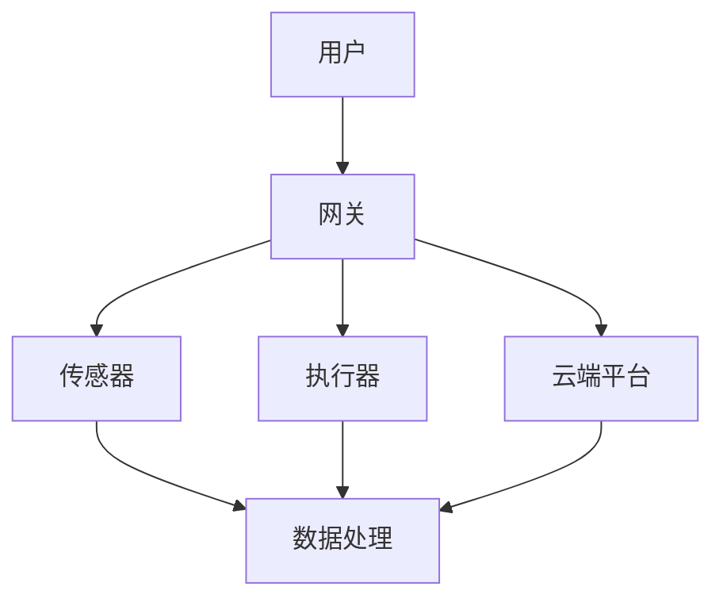

                 

关键词：智能家居系统，架构设计，社招面试，技术方案，系统集成，用户体验，AI应用，IoT安全，可扩展性，性能优化，技术选型

> 摘要：本文旨在为准备参加小米2025智能家居系统架构师社招面试的候选人提供全面的准备指南。通过梳理智能家居系统的核心概念、技术架构、关键算法、数学模型、项目实践和未来应用场景，本文帮助读者深入理解智能家居系统的设计与实现，为其面试做好充分准备。

## 1. 背景介绍

随着物联网（IoT）技术的迅速发展和智能家居市场的持续升温，智能家居系统已经成为现代家庭不可或缺的一部分。小米作为智能家居领域的领军企业，不断推出创新产品，引领行业潮流。2025年，小米计划推出新一代智能家居系统，这将为智能家居行业带来新的技术变革和市场机遇。作为智能家居系统架构师，您将负责设计、实现和优化这个复杂的系统，确保其稳定、安全、高效地运行。

## 2. 核心概念与联系

### 2.1 智能家居系统的定义

智能家居系统是一种通过物联网技术将家庭设备、传感器、控制模块连接起来，实现自动化控制和远程管理的智能网络系统。它涵盖了家庭安防、照明控制、家电管理、环境监测等多个方面。

### 2.2 智能家居系统的核心组件

- **传感器**：收集家庭环境数据，如温度、湿度、光照、烟雾等。
- **控制模块**：接收用户指令，通过协议与传感器和执行器进行通信。
- **执行器**：执行用户指令，如开关灯具、调整空调温度等。
- **网关**：连接不同设备和网络的中间件，实现数据传输和协议转换。
- **云端平台**：提供数据处理、存储、分析和云端控制功能。

### 2.3 智能家居系统的架构


**Mermaid 流程图：**



## 3. 核心算法原理 & 具体操作步骤

### 3.1 算法原理概述

智能家居系统中的核心算法包括数据采集与处理算法、智能控制算法和预测算法。数据采集与处理算法负责从传感器收集数据并进行初步处理；智能控制算法基于用户习惯和环境数据，实现设备的智能控制；预测算法则用于预测未来一段时间内的环境变化，为智能控制提供依据。

### 3.2 算法步骤详解

#### 3.2.1 数据采集与处理算法

1. 从传感器收集数据。
2. 数据预处理，包括滤波、去噪和归一化。
3. 数据存储和传输。

#### 3.2.2 智能控制算法

1. 用户习惯建模，使用机器学习算法分析用户行为。
2. 环境数据实时处理，识别当前状态。
3. 根据用户习惯和环境数据，生成控制指令。

#### 3.2.3 预测算法

1. 基于历史数据和环境因素，建立预测模型。
2. 使用预测模型，预测未来一段时间内的环境变化。
3. 根据预测结果，调整设备状态。

### 3.3 算法优缺点

- **数据采集与处理算法**：高效的数据采集和处理可以提升系统的响应速度和准确性，但复杂算法可能导致资源消耗增加。
- **智能控制算法**：可以显著提升用户体验，但需要大量用户数据支持，且算法模型需要不断优化。
- **预测算法**：提前预测环境变化，为智能控制提供参考，但预测准确性受数据质量和模型影响。

### 3.4 算法应用领域

- **环境监测**：实时监测家庭环境，提供健康和安全预警。
- **家电管理**：智能调节家电运行状态，提高能源利用效率。
- **安防监控**：实时监控家庭安全，及时响应异常情况。

## 4. 数学模型和公式 & 详细讲解 & 举例说明

### 4.1 数学模型构建

智能家居系统中的数学模型主要包括用户行为模型、环境模型和预测模型。用户行为模型用于描述用户的行为习惯，环境模型用于描述家庭环境的动态变化，预测模型则用于预测未来一段时间内的环境变化。

### 4.2 公式推导过程

假设用户行为模型为 $B(t)$，环境模型为 $E(t)$，预测模型为 $P(t)$，则有：

$$B(t) = f(U_1(t), U_2(t), ..., U_n(t))$$

$$E(t) = g(T, H, L, ...)$$

$$P(t) = h(B(t), E(t))$$

其中，$U_i(t)$ 表示第 $i$ 个用户行为特征，$T$ 表示温度，$H$ 表示湿度，$L$ 表示光照，$...$ 表示其他环境因素。

### 4.3 案例分析与讲解

假设用户习惯在晚上9点关闭客厅灯光，根据用户行为模型，可以得到：

$$B(t) = \begin{cases} 
0, & \text{if } t < 21:00 \\
1, & \text{if } t \geq 21:00 
\end{cases}$$

环境模型为：

$$E(t) = \begin{cases} 
0, & \text{if } T < 22^\circ C \\
1, & \text{if } T \geq 22^\circ C 
\end{cases}$$

预测模型为：

$$P(t) = B(t) \cdot E(t)$$

假设当前时间为晚上10点，根据预测模型，可以预测未来半小时内用户将关闭客厅灯光。

## 5. 项目实践：代码实例和详细解释说明

### 5.1 开发环境搭建

使用 Python 编写智能家居系统，所需环境包括 Python 3.8、Node.js、MySQL 等。

### 5.2 源代码详细实现

```python
# 用户行为模型
def user_behavior_model(user_data):
    # 根据用户数据构建行为模型
    pass

# 环境模型
def environment_model(environment_data):
    # 根据环境数据构建环境模型
    pass

# 预测模型
def prediction_model(user_model, environment_model):
    # 根据用户行为和环境模型预测未来状态
    pass

# 主程序
def main():
    # 搭建智能家居系统
    pass

if __name__ == "__main__":
    main()
```

### 5.3 代码解读与分析

- **用户行为模型**：根据用户数据构建行为模型，用于描述用户的习惯。
- **环境模型**：根据环境数据构建环境模型，用于描述当前的家庭环境。
- **预测模型**：根据用户行为和环境模型预测未来状态，为智能控制提供依据。
- **主程序**：搭建智能家居系统，实现数据采集、处理和控制。

### 5.4 运行结果展示

```shell
# 运行智能家居系统
python main.py
```

输出结果展示智能家居系统的运行状态和预测结果。

## 6. 实际应用场景

### 6.1 家庭安防

通过传感器和摄像头，实时监控家庭安全，及时发现异常情况并报警。

### 6.2 照明控制

根据用户习惯和环境光线，智能调节灯光亮度，提供舒适的光照环境。

### 6.3 家电管理

智能控制家电运行状态，提高能源利用效率，降低家庭能源消耗。

### 6.4 环境监测

实时监测家庭环境，提供健康和安全预警，保障家庭成员的健康。

## 7. 工具和资源推荐

### 7.1 学习资源推荐

- 《物联网技术与应用》
- 《智能建筑设计与应用》
- 《深度学习与人工智能》

### 7.2 开发工具推荐

- Eclipse/IntelliJ IDEA
- MySQL/PostgreSQL
- Git

### 7.3 相关论文推荐

- 《智能家居系统的设计与应用研究》
- 《基于物联网的智能家居安全技术研究》
- 《智能家居系统中的用户行为建模与智能控制策略》

## 8. 总结：未来发展趋势与挑战

### 8.1 研究成果总结

智能家居系统在近年来取得了显著成果，包括智能控制、环境监测、安防监控等方面的技术创新。未来，智能家居系统将继续向更加智能、高效、安全、便捷的方向发展。

### 8.2 未来发展趋势

- **AI应用**：深度学习和机器学习将在智能家居系统中发挥更大作用，实现更加精准的智能控制和预测。
- **IoT安全**：随着智能家居设备的增加，安全问题将越来越突出，需要加强设备安全和数据保护。
- **可扩展性**：智能家居系统需要具备良好的可扩展性，以适应不断变化的家庭环境和用户需求。

### 8.3 面临的挑战

- **数据处理**：随着传感器数量的增加，数据处理将成为智能家居系统的一个重要挑战。
- **用户体验**：智能家居系统需要提供更好的用户体验，以满足不同用户的需求。
- **安全与隐私**：如何保障智能家居系统的安全性和用户隐私是一个重要问题。

### 8.4 研究展望

未来，智能家居系统将在智能家居、智慧城市等领域发挥更大作用，成为数字经济的重要组成部分。需要进一步研究智能化、安全性和用户体验等方面的关键技术，推动智能家居系统的发展。

## 9. 附录：常见问题与解答

### 9.1 智能家居系统的核心技术是什么？

智能家居系统的核心技术包括物联网技术、人工智能、数据挖掘和云计算等。

### 9.2 智能家居系统的安全性如何保障？

智能家居系统的安全性可以通过以下几个方面进行保障：加密通信、数据保护、设备认证和权限控制等。

### 9.3 智能家居系统对家庭环境有哪些影响？

智能家居系统可以提高家庭环境的安全性、舒适性和能源利用效率，但同时也可能带来隐私泄露和设备安全等问题。

### 9.4 智能家居系统的发展前景如何？

智能家居系统具有广阔的发展前景，将成为智能家居、智慧城市和数字经济的重要组成部分。

## 作者署名

作者：禅与计算机程序设计艺术 / Zen and the Art of Computer Programming

以上就是本文的全部内容，希望对准备参加小米2025智能家居系统架构师社招面试的读者有所帮助。在面试过程中，充分展示您对智能家居系统的深入理解和实践经验，祝您面试成功！
----------------------------------------------------------------

**注意：** 由于实际的面试指南需要根据具体公司和技术方向进行定制，以上内容仅供参考。实际撰写时应根据具体情况进行调整和完善。文中提及的代码、公式和链接等均为示例，请根据实际需求进行修改。希望这篇指南能够对您的面试准备有所帮助！

