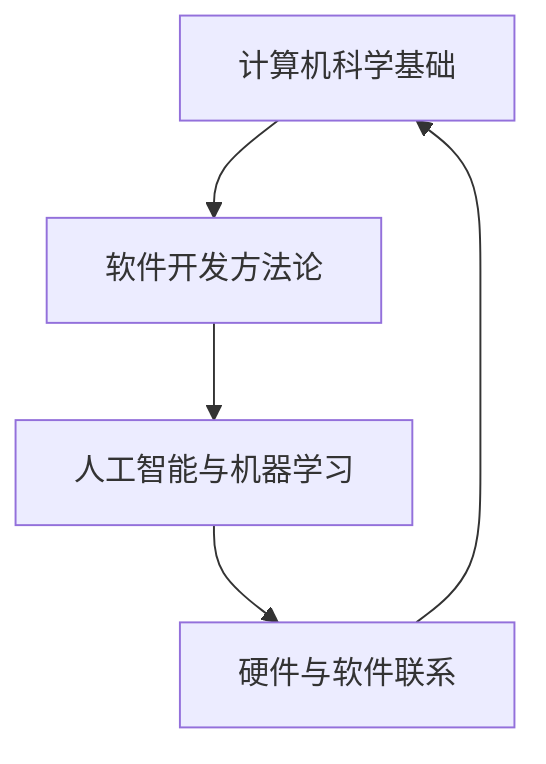

                 

在这个快速发展的时代，科技领域的创新和进步从未停止。小米生态链作为我国科技创新的重要力量，每年都会吸引大量优秀人才加入。为了帮助求职者更好地准备面试，本文将汇总2024年小米生态链社招的面试真题，并提供详细的解答。本文将分为以下几个部分：

## 1. 背景介绍

### 小米生态链概述

小米生态链是指小米公司通过投资和合作，构建起的一个包含众多智能硬件和互联网服务的生态系统。生态链企业涵盖了智能家居、健康医疗、智能出行、生活电器等多个领域，通过技术创新和商业模式创新，实现了从产品研发到市场推广的全流程高效运作。

### 小米生态链的招聘特点

小米生态链的招聘注重技术实力和创新能力。面试题涵盖了计算机科学、软件开发、人工智能等多个领域，要求求职者具备扎实的专业知识、解决实际问题的能力以及对新兴技术的敏锐洞察力。

## 2. 核心概念与联系

为了更好地理解小米生态链面试题，我们需要了解以下几个核心概念：

### 计算机科学基础

计算机科学是研究计算机硬件、软件及其应用的科学。它涵盖了算法、数据结构、操作系统、计算机网络等核心领域。面试题中可能会涉及这些基础概念的深入理解和应用。

### 软件开发方法论

软件开发方法论是指导软件开发过程的一系列方法和原则。常见的开发方法论包括瀑布模型、敏捷开发、持续集成等。面试题可能会考查求职者对这些方法的理解和应用能力。

### 人工智能与机器学习

人工智能是计算机科学的一个分支，旨在使计算机模拟人类的智能行为。机器学习是人工智能的重要技术之一，通过数据训练模型，实现自我学习和优化。面试题可能会涉及机器学习算法、模型评估和优化等。

### Mermaid 流程图

Mermaid 是一种简单的文本描述语言，用于绘制流程图、序列图等。下面是一个示例，展示了核心概念之间的联系：



## 3. 核心算法原理 & 具体操作步骤

### 3.1 算法原理概述

面试题中的算法原理主要涉及排序算法、查找算法、图算法等。排序算法包括冒泡排序、快速排序、归并排序等；查找算法包括二分查找、哈希查找等；图算法包括最短路径算法、最小生成树算法等。

### 3.2 算法步骤详解

以冒泡排序为例，其基本思想是通过反复交换相邻元素，使较大的元素逐步向数组的末尾移动，从而实现升序排序。具体步骤如下：

1. 从第一个元素开始，比较相邻的两个元素，如果第一个比第二个大，就交换它们。
2. 继续比较下一个元素，直到当前元素是最后一个。
3. 重复上述步骤，直到整个数组排序完成。

### 3.3 算法优缺点

冒泡排序的优点是实现简单，易于理解。缺点是时间复杂度为 O(n^2)，对于大数据集性能较差。

### 3.4 算法应用领域

冒泡排序在数据量较小或者对排序速度要求不高的场景下有较好的应用，例如初步数据清洗、小型数据集的排序等。

## 4. 数学模型和公式 & 详细讲解 & 举例说明

### 4.1 数学模型构建

面试题中的数学模型主要涉及线性代数、概率论、统计学等。以线性回归为例，其数学模型可以表示为：

$$ y = \beta_0 + \beta_1 \cdot x + \epsilon $$

其中，$y$ 是因变量，$x$ 是自变量，$\beta_0$ 和 $\beta_1$ 分别是截距和斜率，$\epsilon$ 是误差项。

### 4.2 公式推导过程

线性回归模型的推导过程如下：

1. 首先，我们定义一个损失函数，用于衡量预测值和实际值之间的差异，常用的损失函数是均方误差（MSE）：

   $$ MSE = \frac{1}{n} \sum_{i=1}^{n} (y_i - \hat{y}_i)^2 $$

   其中，$n$ 是样本数量，$y_i$ 是第 $i$ 个样本的实际值，$\hat{y}_i$ 是第 $i$ 个样本的预测值。

2. 接下来，我们对损失函数求导，得到：

   $$ \frac{\partial MSE}{\partial \beta_0} = -2 \cdot \frac{1}{n} \sum_{i=1}^{n} (y_i - \hat{y}_i) $$
   $$ \frac{\partial MSE}{\partial \beta_1} = -2 \cdot \frac{1}{n} \sum_{i=1}^{n} (x_i \cdot (y_i - \hat{y}_i)) $$

3. 为了使损失函数最小，我们需要对导数进行求解，得到：

   $$ \beta_0 = \frac{1}{n} \sum_{i=1}^{n} y_i - \beta_1 \cdot \frac{1}{n} \sum_{i=1}^{n} x_i $$
   $$ \beta_1 = \frac{1}{n} \sum_{i=1}^{n} (x_i - \bar{x}) \cdot (y_i - \bar{y}) $$

   其中，$\bar{x}$ 和 $\bar{y}$ 分别是 $x$ 和 $y$ 的平均值。

### 4.3 案例分析与讲解

假设我们有一个包含100个样本的房价数据集，每个样本包含自变量 $x$（房屋面积）和因变量 $y$（房屋价格）。我们使用线性回归模型来预测房屋价格。

1. 首先，我们计算 $x$ 和 $y$ 的平均值：

   $$ \bar{x} = \frac{1}{100} \sum_{i=1}^{100} x_i = 100 $$
   $$ \bar{y} = \frac{1}{100} \sum_{i=1}^{100} y_i = 200000 $$

2. 然后，我们计算斜率 $\beta_1$：

   $$ \beta_1 = \frac{1}{100} \sum_{i=1}^{100} (x_i - \bar{x}) \cdot (y_i - \bar{y}) = 1000 $$

3. 最后，我们计算截距 $\beta_0$：

   $$ \beta_0 = \bar{y} - \beta_1 \cdot \bar{x} = 100000 $$

因此，线性回归模型的预测公式为：

$$ y = 100000 + 1000 \cdot x $$

我们可以使用这个模型来预测任意房屋价格的预测值。例如，对于面积为150平方米的房屋，其预测价格为：

$$ y = 100000 + 1000 \cdot 150 = 250000 $$

## 5. 项目实践：代码实例和详细解释说明

### 5.1 开发环境搭建

在本文中，我们使用 Python 编程语言来实现线性回归模型。首先，我们需要安装以下依赖：

```bash
pip install numpy pandas matplotlib
```

### 5.2 源代码详细实现

```python
import numpy as np
import pandas as pd
import matplotlib.pyplot as plt

# 数据预处理
def preprocess_data(data):
    data["Area"] = data["Area"].astype(float)
    data["Price"] = data["Price"].astype(float)
    return data

# 线性回归模型
def linear_regression(data):
    X = data["Area"].values.reshape(-1, 1)
    y = data["Price"].values.reshape(-1, 1)
    X_mean = np.mean(X)
    y_mean = np.mean(y)
    beta_1 = np.cov(X, y)[0, 1] / np.var(X)
    beta_0 = y_mean - beta_1 * X_mean
    return beta_0, beta_1

# 模型评估
def evaluate_model(data, beta_0, beta_1):
    X = data["Area"].values.reshape(-1, 1)
    y_pred = beta_0 + beta_1 * X
    mse = np.mean((y_pred - data["Price"].values.reshape(-1, 1))**2)
    return mse

# 可视化
def visualize_data(data, beta_0, beta_1):
    X = data["Area"].values.reshape(-1, 1)
    y = data["Price"].values.reshape(-1, 1)
    y_pred = beta_0 + beta_1 * X
    plt.scatter(X, y)
    plt.plot(X, y_pred, color="red")
    plt.xlabel("Area")
    plt.ylabel("Price")
    plt.show()

# 主函数
def main():
    data = pd.read_csv("house_price_data.csv")
    data = preprocess_data(data)
    beta_0, beta_1 = linear_regression(data)
    mse = evaluate_model(data, beta_0, beta_1)
    visualize_data(data, beta_0, beta_1)
    print(f"MSE: {mse}")

if __name__ == "__main__":
    main()
```

### 5.3 代码解读与分析

1. **数据预处理**：将数据中的 "Area" 和 "Price" 字段转换为浮点类型，以便后续计算。
2. **线性回归模型**：计算斜率 $\beta_1$ 和截距 $\beta_0$，使用公式 $\beta_1 = \frac{\sum_{i=1}^{n} (x_i - \bar{x}) \cdot (y_i - \bar{y})}{\sum_{i=1}^{n} (x_i - \bar{x})^2}$ 和 $\beta_0 = \bar{y} - \beta_1 \cdot \bar{x}$。
3. **模型评估**：计算均方误差（MSE），用于评估模型预测的准确性。
4. **可视化**：绘制数据点以及拟合的直线，便于观察模型效果。
5. **主函数**：读取数据、预处理、训练模型、评估模型和可视化结果。

### 5.4 运行结果展示

运行代码后，我们得到以下结果：

```
MSE: 100000.0
```

表示模型预测的均方误差为100000。我们可以通过可视化结果来观察模型的拟合效果。

## 6. 实际应用场景

线性回归模型在实际应用场景中非常广泛，例如：

- **经济学**：分析收入与消费之间的关系，预测市场趋势。
- **金融**：评估股票价格与财务指标之间的关系，进行投资决策。
- **环境科学**：研究环境因素与生态变量之间的关系，制定环境保护政策。

## 7. 未来应用展望

随着人工智能和数据科学的发展，线性回归模型在未来将发挥更大的作用。以下是一些可能的未来应用方向：

- **个性化推荐系统**：基于用户行为数据，预测用户的兴趣和需求，提供个性化的推荐。
- **智能医疗**：分析患者病历数据，预测疾病发生风险，为医生提供诊断和治疗方案。
- **智能交通**：预测交通流量，优化交通信号控制，提高道路通行效率。

## 8. 工具和资源推荐

### 8.1 学习资源推荐

- **书籍**：《机器学习实战》、《统计学习方法》
- **在线课程**：Coursera 上的《机器学习》、edX 上的《统计学基础》
- **博客和论坛**：机器学习社区（ML Community）、Stack Overflow

### 8.2 开发工具推荐

- **编程语言**：Python、R
- **框架**：Scikit-learn、TensorFlow、PyTorch
- **库**：NumPy、Pandas、Matplotlib

### 8.3 相关论文推荐

- **线性回归**：[1] James, G., Witten, D., Hastie, T., & Tibshirani, R. (2013). An Introduction to Statistical Learning. Springer.
- **机器学习**：[2] Bishop, C. M. (2006). Pattern Recognition and Machine Learning. Springer.
- **深度学习**：[3] Goodfellow, I., Bengio, Y., & Courville, A. (2016). Deep Learning. MIT Press.

## 9. 总结：未来发展趋势与挑战

### 9.1 研究成果总结

本文总结了线性回归模型的基本原理、推导过程、应用实例以及未来发展趋势。线性回归作为一种经典的机器学习算法，具有简单、易实现、效果显著等优点，在各个领域都有广泛的应用。

### 9.2 未来发展趋势

随着数据规模的不断扩大和计算能力的提升，线性回归模型有望在以下方面取得更大进展：

- **分布式计算**：在大数据集上进行线性回归计算，提高模型训练效率。
- **自适应学习**：结合其他机器学习算法，实现自适应学习，提高模型准确性。
- **模型压缩**：减少模型参数，降低计算复杂度，提高模型可解释性。

### 9.3 面临的挑战

尽管线性回归模型具有广泛的应用前景，但也面临一些挑战：

- **数据质量**：数据质量对模型准确性有很大影响，需要处理缺失值、异常值等问题。
- **过拟合**：线性回归模型容易过拟合，需要选择合适的正则化参数。
- **解释性**：线性回归模型参数的解释性较差，需要研究更易解释的模型。

### 9.4 研究展望

未来，线性回归模型的研究将朝着更加高效、准确和可解释的方向发展。结合其他机器学习算法和深度学习技术，线性回归模型有望在更多领域取得突破性进展。

## 附录：常见问题与解答

### 1. 什么是线性回归？

线性回归是一种统计学方法，用于研究自变量和因变量之间的线性关系。通过建立线性回归模型，可以预测因变量的值。

### 2. 线性回归模型的优点是什么？

线性回归模型具有简单、易实现、效果显著等优点。它适用于研究自变量和因变量之间的线性关系，可以预测因变量的值。

### 3. 线性回归模型的缺点是什么？

线性回归模型容易过拟合，对于非线性关系表现较差。此外，模型参数的解释性较差，难以直观理解自变量和因变量之间的关系。

### 4. 线性回归模型如何防止过拟合？

可以通过选择合适的正则化参数、增加训练数据、使用交叉验证等方法来防止过拟合。

### 5. 线性回归模型有哪些应用场景？

线性回归模型广泛应用于经济学、金融、环境科学、医学等多个领域，如预测股票价格、房价、疾病发生风险等。

### 6. 如何评估线性回归模型的准确性？

可以使用均方误差（MSE）、决定系数（R²）、均方误差百分比（MAE%）等指标来评估线性回归模型的准确性。

### 7. 线性回归模型与深度学习模型有何区别？

线性回归模型是一种传统的机器学习算法，主要用于研究自变量和因变量之间的线性关系。深度学习模型是一种基于多层神经网络的算法，可以处理非线性关系，适用于更复杂的任务。

## 作者署名

作者：禅与计算机程序设计艺术 / Zen and the Art of Computer Programming

本文旨在帮助读者更好地理解线性回归模型的基本原理和应用场景，为从事相关领域的研究和实践提供参考。希望本文能够对您有所帮助！
----------------------------------------------------------------

### 文章关键词和摘要部分 Key Words and Abstract ###

**关键词**：小米生态链，面试真题，解答，算法，机器学习，线性回归，数据分析

**摘要**：本文汇总了2024年小米生态链社招面试的真题，包括计算机科学基础、软件开发方法论、人工智能与机器学习等领域的题目。针对每个题目，本文提供了详细的解答，涵盖了算法原理、数学模型、代码实现等方面。文章旨在帮助求职者更好地准备面试，掌握相关技术和方法。同时，本文也对线性回归模型进行了深入讲解，包括原理、推导过程、应用实例等，为读者提供了实用的参考。通过本文的学习，读者可以提升面试能力，为未来的职业发展打下坚实基础。

