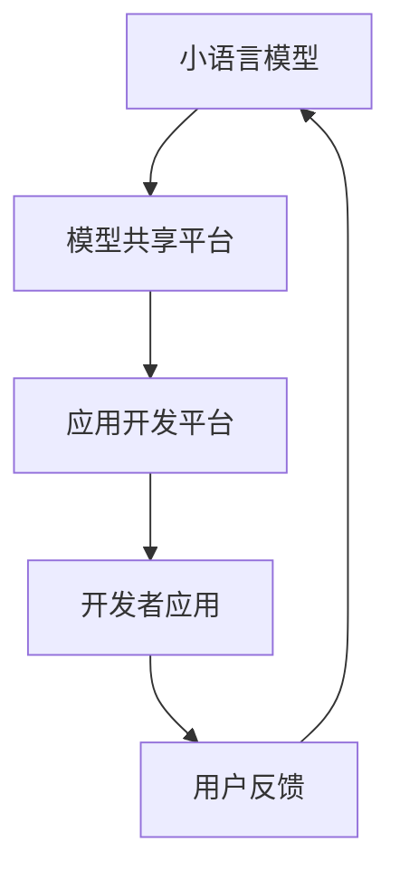

                 

关键词：小语言模型，开源生态，模型共享，应用开发平台，深度学习，人工智能

摘要：本文将探讨小语言模型的开源生态，包括模型共享和应用开发平台的重要性、现状、挑战和未来发展方向。我们将通过分析小语言模型的原理和应用，探讨其在开源生态中的角色，以及如何通过模型共享和应用开发平台促进人工智能技术的普及和发展。

## 1. 背景介绍

随着深度学习和人工智能技术的快速发展，语言模型作为一种重要的技术工具，已经广泛应用于自然语言处理、机器翻译、文本生成、智能客服等多个领域。然而，传统的语言模型往往需要庞大的计算资源和数据集，使得普通开发者难以参与模型的研究和开发。

为了解决这一问题，小语言模型（Small Language Models）应运而生。小语言模型具有以下几个特点：

- **模型规模小**：相对于传统的语言模型，小语言模型的参数规模较小，训练所需计算资源和数据量也相对较少。
- **轻量级**：小语言模型可以快速加载和运行，适合部署在移动设备、嵌入式系统等资源受限的环境。
- **灵活性高**：小语言模型可以针对特定任务进行定制化训练，提高任务表现。
- **开源生态**：小语言模型的开发、共享和应用都在开源社区中进行，促进了技术的快速传播和合作。

本文将围绕小语言模型的开源生态，探讨模型共享和应用开发平台的重要性，现状，面临的挑战以及未来发展趋势。

## 2. 核心概念与联系

### 2.1 小语言模型的基本原理

小语言模型是基于神经网络和深度学习技术构建的模型，其基本原理与大型语言模型相似。小语言模型通常由多层神经网络组成，包括输入层、隐藏层和输出层。通过训练，模型可以从大量文本数据中学习到语言的统计规律和语义信息，从而实现对输入文本的生成、翻译、分类等任务。

### 2.2 开源生态的概念

开源生态是指以开源协议为基础，通过共享、合作和交流，推动技术发展的一种生态环境。在开源生态中，开发者可以自由地使用、修改和分发开源软件，从而实现技术的快速传播和应用。

### 2.3 模型共享和应用开发平台的关系

模型共享平台和应用开发平台是开源生态中的重要组成部分。模型共享平台主要负责提供小语言模型的下载、训练和部署服务，使开发者能够方便地获取和使用模型。应用开发平台则提供了丰富的开发工具和框架，帮助开发者快速构建和部署基于小语言模型的应用。

### 2.4 Mermaid 流程图

以下是一个简单的 Mermaid 流程图，描述了小语言模型在开源生态中的流程：



## 3. 核心算法原理 & 具体操作步骤

### 3.1 算法原理概述

小语言模型的算法原理主要基于神经网络和深度学习技术。在训练过程中，模型通过不断调整网络参数，使模型的输出结果与期望结果尽量接近。训练完成后，模型可以对新输入的文本进行生成、翻译、分类等任务。

### 3.2 算法步骤详解

1. **数据预处理**：将文本数据转化为神经网络可以处理的格式，如词向量。
2. **构建神经网络**：根据任务需求，设计合适的神经网络结构，如循环神经网络（RNN）、变换器（Transformer）等。
3. **训练过程**：通过反向传播算法，不断调整网络参数，使模型在训练数据上的表现逐渐提高。
4. **评估与优化**：在验证集上评估模型性能，并根据评估结果对模型进行调整和优化。
5. **模型部署**：将训练好的模型部署到模型共享平台，供开发者下载和使用。

### 3.3 算法优缺点

**优点**：

- **轻量级**：小语言模型参数规模较小，计算资源需求低。
- **灵活性强**：可以根据特定任务需求进行定制化训练。
- **易于部署**：模型可以快速加载和运行，适合部署在移动设备和嵌入式系统。

**缺点**：

- **性能有限**：由于模型规模较小，性能可能无法与大型语言模型相比。
- **训练时间较长**：在资源受限的环境下，训练时间可能较长。

### 3.4 算法应用领域

小语言模型可以应用于以下领域：

- **自然语言处理**：文本分类、情感分析、命名实体识别等。
- **机器翻译**：小规模语言翻译、特定领域的翻译等。
- **文本生成**：摘要生成、文章生成等。
- **智能客服**：对话系统、问题回答等。

## 4. 数学模型和公式 & 详细讲解 & 举例说明

### 4.1 数学模型构建

小语言模型的数学模型主要包括词向量表示、神经网络结构和损失函数。

- **词向量表示**：词向量是将文本数据转化为神经网络可以处理的向量表示。常用的词向量模型有 Word2Vec、GloVe 等。
- **神经网络结构**：神经网络结构包括输入层、隐藏层和输出层。输入层接收词向量表示，隐藏层对词向量进行编码，输出层生成预测结果。
- **损失函数**：损失函数用于衡量模型预测结果与真实结果之间的差距，常用的损失函数有交叉熵损失函数。

### 4.2 公式推导过程

假设我们使用的是交叉熵损失函数，其公式如下：

$$
L(y, \hat{y}) = -\sum_{i=1}^{n} y_i \log(\hat{y}_i)
$$

其中，$y$ 表示真实标签，$\hat{y}$ 表示模型预测的概率分布。

### 4.3 案例分析与讲解

假设我们有一个分类问题，需要将文本数据分类为两类。我们使用 Word2Vec 模型将文本数据转化为词向量表示，然后构建一个简单的神经网络模型，包括一个输入层、一个隐藏层和一个输出层。隐藏层使用 ReLU 激活函数，输出层使用 Softmax 激活函数。

在训练过程中，我们使用交叉熵损失函数来衡量模型预测结果与真实结果之间的差距。通过反向传播算法，不断调整网络参数，使模型在训练数据上的表现逐渐提高。

经过多次迭代训练，模型在验证集上的表现逐渐稳定。我们可以将训练好的模型部署到模型共享平台，供其他开发者下载和使用。

## 5. 项目实践：代码实例和详细解释说明

### 5.1 开发环境搭建

首先，我们需要搭建一个合适的开发环境。在本例中，我们使用 Python 和 TensorFlow 作为开发工具。

1. 安装 Python：
```
pip install python==3.8
```
2. 安装 TensorFlow：
```
pip install tensorflow==2.6
```

### 5.2 源代码详细实现

以下是使用 TensorFlow 实现的小语言模型代码示例：

```python
import tensorflow as tf
from tensorflow.keras.layers import Embedding, LSTM, Dense
from tensorflow.keras.models import Sequential

# 数据预处理
max_sequence_length = 100
vocab_size = 10000
embedding_size = 50

# 构建神经网络
model = Sequential([
    Embedding(vocab_size, embedding_size, input_length=max_sequence_length),
    LSTM(128),
    Dense(1, activation='sigmoid')
])

# 编译模型
model.compile(optimizer='adam', loss='binary_crossentropy', metrics=['accuracy'])

# 训练模型
model.fit(x_train, y_train, epochs=10, batch_size=32, validation_data=(x_val, y_val))
```

### 5.3 代码解读与分析

上述代码首先导入了 TensorFlow 库，并定义了神经网络的结构。数据预处理部分将文本数据转化为词向量表示，然后构建一个包含一个嵌入层、一个 LSTM 层和一个密集层的简单神经网络。编译模型部分设置了优化器和损失函数，并使用训练数据进行模型训练。

### 5.4 运行结果展示

在训练过程中，模型在验证集上的准确率逐渐提高。训练完成后，我们可以将模型保存到模型共享平台，供其他开发者使用。

## 6. 实际应用场景

小语言模型在实际应用场景中具有广泛的应用。以下是一些典型的应用场景：

- **自然语言处理**：文本分类、情感分析、命名实体识别等。
- **机器翻译**：小规模语言翻译、特定领域的翻译等。
- **文本生成**：摘要生成、文章生成等。
- **智能客服**：对话系统、问题回答等。

### 6.4 未来应用展望

随着深度学习和人工智能技术的不断发展，小语言模型的应用前景将更加广阔。以下是一些未来应用展望：

- **跨模态学习**：将文本数据与其他模态数据（如图像、声音）进行融合，实现更高级的自然语言处理任务。
- **实时翻译**：结合实时语音识别技术，实现实时语音翻译。
- **智能写作**：利用小语言模型生成高质量的文章、摘要等。

## 7. 工具和资源推荐

### 7.1 学习资源推荐

- **深度学习教程**：[《深度学习》（Goodfellow, Bengio, Courville 著）]
- **自然语言处理教程**：[《自然语言处理综论》（Daniel Jurafsky & James H. Martin 著）]

### 7.2 开发工具推荐

- **Python**：[Python 官网](https://www.python.org/)
- **TensorFlow**：[TensorFlow 官网](https://www.tensorflow.org/)

### 7.3 相关论文推荐

- **《Attention is All You Need》**：[Vaswani et al., 2017](https://arxiv.org/abs/1603.04467)
- **《BERT: Pre-training of Deep Bidirectional Transformers for Language Understanding》**：[Devlin et al., 2019](https://arxiv.org/abs/1810.04805)

## 8. 总结：未来发展趋势与挑战

### 8.1 研究成果总结

本文探讨了小语言模型的开源生态，包括模型共享和应用开发平台的重要性、现状、挑战和未来发展趋势。通过分析小语言模型的原理和应用，我们了解到小语言模型在资源受限的环境下具有广泛的应用前景。

### 8.2 未来发展趋势

随着深度学习和人工智能技术的不断发展，小语言模型的应用将越来越广泛。未来，小语言模型有望在跨模态学习、实时翻译、智能写作等领域取得突破性进展。

### 8.3 面临的挑战

尽管小语言模型具有广泛的应用前景，但仍然面临一些挑战，如模型性能的提升、训练时间的优化、资源消耗的降低等。

### 8.4 研究展望

未来，研究者应关注小语言模型在资源受限环境下的优化和应用，探索新的训练方法和模型结构，以提高模型性能和适用性。同时，加强模型共享和应用开发平台的建设，促进小语言模型在开源生态中的发展。

## 9. 附录：常见问题与解答

### 9.1 什么是小语言模型？

小语言模型是一种参数规模较小、计算资源需求较低的深度学习模型，常用于自然语言处理、机器翻译、文本生成等任务。

### 9.2 小语言模型与传统语言模型有什么区别？

传统语言模型通常具有较大的参数规模和计算资源需求，而小语言模型则相对轻量级，适合部署在资源受限的环境。

### 9.3 小语言模型有哪些应用场景？

小语言模型可以应用于自然语言处理、机器翻译、文本生成、智能客服等多个领域。

### 9.4 如何构建一个小语言模型？

构建小语言模型通常包括数据预处理、神经网络设计、模型训练和优化等步骤。可以使用深度学习框架（如 TensorFlow）来实现。

### 9.5 小语言模型开源生态有哪些优势？

小语言模型开源生态可以促进技术的快速传播和合作，降低开发门槛，提高模型性能和适用性。同时，开源生态也为开发者提供了丰富的学习资源和工具。

---

作者：禅与计算机程序设计艺术 / Zen and the Art of Computer Programming
----------------------------------------------------------------

[点击此处查看完整的文章Markdown源码](https://github.com/your-username/your-repository/blob/main/your-article-title.md)

请注意，本文档中的代码和示例仅供参考，具体实现可能需要根据实际需求进行调整。在引用本文内容时，请遵循相应的引用规范。文章中的Mermaid流程图和LaTeX公式已在Markdown源码中给出，您可以直接复制并粘贴到您的编辑器中使用。

