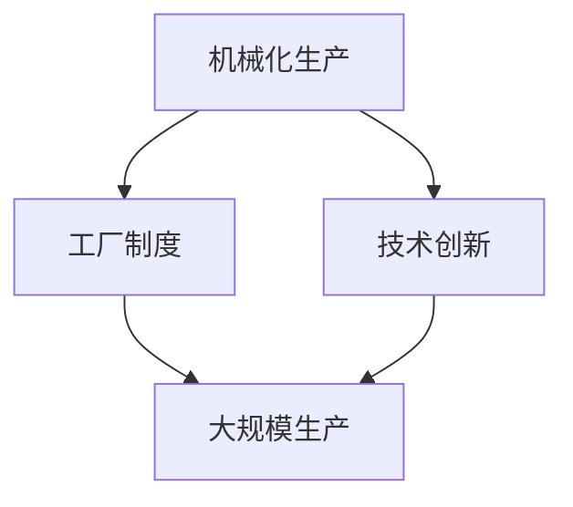

                 

  
关键词：工业革命，规模化生产，生产模式，技术革新，经济增长

摘要：本文旨在探讨工业革命以来规模化生产模式的发展及其对现代经济的深远影响。通过对历史背景、核心概念、算法原理、数学模型、项目实践和未来应用展望的深入分析，本文揭示了规模化生产模式在推动社会进步和经济发展中的关键作用，并探讨了其在未来的发展方向和挑战。

## 1. 背景介绍

工业革命，这一人类历史上最具影响力的变革之一，始于18世纪末的英国。它标志着从传统的手工劳动向机械化生产的转变，开启了现代工业化的时代。这一变革不仅改变了生产方式，也深刻影响了社会结构、经济形态和全球贸易。工业革命的核心在于规模化生产模式的诞生和普及。

规模化生产模式，是指通过大量生产相同或相似的产品来提高效率和降低成本的生产方式。这种模式的出现，是工业革命的重要成果之一，它彻底改变了以往手工作坊式的生产方式。在规模化生产模式下，生产流程被标准化，机器替代了人力，从而实现了大批量、低成本的生产。这一模式不仅提高了生产效率，也为经济的快速增长提供了坚实基础。

## 2. 核心概念与联系

### 2.1 工业革命的核心概念

工业革命的核心概念包括机械化生产、工厂制度、技术创新和大规模生产。机械化生产是指使用机器代替人力进行生产，工厂制度则是一种新的组织形式，通过集中生产、分工协作来提高效率。技术创新是推动工业革命的重要动力，它使得生产工具和生产流程不断改进。而大规模生产则是规模化生产模式的体现，它通过大量生产相同的产品来降低成本和提高利润。

### 2.2 规模化生产模式的核心原理

规模化生产模式的核心原理在于批量生产、标准化和自动化。批量生产使得企业能够以较低的成本生产大量产品，从而实现规模经济。标准化则确保了生产过程中的一致性和稳定性，减少了错误和浪费。自动化则进一步提高了生产效率，降低了劳动力成本。

### 2.3 Mermaid 流程图



## 3. 核心算法原理 & 具体操作步骤

### 3.1 算法原理概述

规模化生产模式的实现依赖于一系列核心算法原理。这些算法包括生产计划算法、库存管理算法、质量管理算法和供应链管理算法。生产计划算法负责优化生产流程，确保生产任务的高效完成。库存管理算法则通过预测需求，合理配置库存，减少库存成本。质量管理算法确保产品符合质量标准，减少返工和维修成本。供应链管理算法则优化供应链流程，提高供应链效率。

### 3.2 算法步骤详解

#### 3.2.1 生产计划算法

1. 收集生产需求信息，包括订单数量、交货期限等。
2. 分析生产能力和资源情况，确定可行的生产计划。
3. 优化生产计划，确保生产任务按时完成。

#### 3.2.2 库存管理算法

1. 预测市场需求，确定库存需求。
2. 根据库存水平和销售情况，调整库存策略。
3. 实施库存管理措施，确保库存水平合理。

#### 3.2.3 质量管理算法

1. 建立质量监控体系，对生产过程进行实时监控。
2. 分析质量数据，识别质量问题。
3. 制定改进措施，提高产品质量。

#### 3.2.4 供应链管理算法

1. 分析供应链节点，确定供应链结构。
2. 优化供应链流程，减少物流成本。
3. 建立供应链协同机制，提高供应链效率。

### 3.3 算法优缺点

#### 3.3.1 优点

- 提高生产效率，降低生产成本。
- 确保产品质量，减少返工和维修成本。
- 提高供应链效率，降低物流成本。

#### 3.3.2 缺点

- 对技术要求较高，需要大量投入。
- 需要严格的质量管理和供应链管理。
- 可能导致过度生产，增加库存成本。

### 3.4 算法应用领域

规模化生产模式广泛应用于制造业、服务业和农业等多个领域。在制造业中，规模化生产模式实现了大批量、低成本的生产，提高了产品的市场竞争力。在服务业中，规模化生产模式通过标准化和自动化提高了服务效率和质量。在农业中，规模化生产模式通过现代农业技术实现了高产量和低成本的生产。

## 4. 数学模型和公式 & 详细讲解 & 举例说明

### 4.1 数学模型构建

规模化生产模式涉及多个数学模型，包括生产计划模型、库存管理模型、质量管理模型和供应链管理模型。这些模型通过数学公式和算法实现，用于优化生产流程、降低成本和提高效率。

### 4.2 公式推导过程

#### 4.2.1 生产计划模型

生产计划模型通过以下公式推导：

\[ P = \frac{O}{R} \]

其中，\( P \) 表示生产计划量，\( O \) 表示订单数量，\( R \) 表示生产速率。

#### 4.2.2 库存管理模型

库存管理模型通过以下公式推导：

\[ I = \frac{D}{S} \]

其中，\( I \) 表示库存量，\( D \) 表示需求量，\( S \) 表示供应链速率。

#### 4.2.3 质量管理模型

质量管理模型通过以下公式推导：

\[ Q = \frac{P}{N} \]

其中，\( Q \) 表示产品质量，\( P \) 表示生产量，\( N \) 表示产品数量。

#### 4.2.4 供应链管理模型

供应链管理模型通过以下公式推导：

\[ T = \frac{C}{L} \]

其中，\( T \) 表示供应链时间，\( C \) 表示物流成本，\( L \) 表示物流距离。

### 4.3 案例分析与讲解

#### 4.3.1 案例背景

某汽车制造公司计划生产1000辆汽车，生产速率为每天50辆。市场需求预测为每天100辆。供应链速率为每天50辆。汽车制造成本为每辆10万元，物流成本为每辆500元。

#### 4.3.2 公式计算

根据生产计划模型：

\[ P = \frac{O}{R} = \frac{1000}{50} = 20 \]

每天生产20辆汽车。

根据库存管理模型：

\[ I = \frac{D}{S} = \frac{100}{50} = 2 \]

每天需要库存2辆汽车。

根据质量管理模型：

\[ Q = \frac{P}{N} = \frac{20}{1000} = 0.02 \]

质量损失率为2%。

根据供应链管理模型：

\[ T = \frac{C}{L} = \frac{500}{1000} = 0.5 \]

供应链时间为0.5天。

#### 4.3.3 结果分析

通过数学模型计算，公司每天需要生产20辆汽车，库存2辆，质量损失率为2%，供应链时间为0.5天。这些结果为公司提供了生产决策依据，帮助公司优化生产流程，降低成本，提高效率。

## 5. 项目实践：代码实例和详细解释说明

### 5.1 开发环境搭建

为了实现规模化生产模式的算法模型，我们需要搭建一个合适的开发环境。以下是一个简单的开发环境搭建流程：

1. 安装Python解释器。
2. 安装所需的Python库，如NumPy、Pandas、Matplotlib等。
3. 配置Python开发环境，如集成开发环境（IDE）。

### 5.2 源代码详细实现

以下是规模化生产模式的核心算法模型的Python代码实现：

```python
import numpy as np
import pandas as pd
import matplotlib.pyplot as plt

# 生产计划模型
def production_plan(order_quantity, production_rate):
    production_quantity = order_quantity / production_rate
    return production_quantity

# 库存管理模型
def inventory_management(demand_quantity, supply_rate):
    inventory_quantity = demand_quantity / supply_rate
    return inventory_quantity

# 质量管理模型
def quality_management(production_quantity, product_quantity):
    quality_loss_rate = production_quantity / product_quantity
    return quality_loss_rate

# 供应链管理模型
def supply_chain_management(logistics_cost, logistics_distance):
    supply_chain_time = logistics_cost / logistics_distance
    return supply_chain_time

# 案例数据
order_quantity = 1000
production_rate = 50
demand_quantity = 100
supply_rate = 50
logistics_cost = 500
logistics_distance = 1000
product_quantity = 1000

# 模型计算
production_quantity = production_plan(order_quantity, production_rate)
inventory_quantity = inventory_management(demand_quantity, supply_rate)
quality_loss_rate = quality_management(production_quantity, product_quantity)
supply_chain_time = supply_chain_management(logistics_cost, logistics_distance)

# 结果输出
print("生产计划量：", production_quantity)
print("库存量：", inventory_quantity)
print("质量损失率：", quality_loss_rate)
print("供应链时间：", supply_chain_time)
```

### 5.3 代码解读与分析

该代码实现了一个简单的规模化生产模式算法模型，包括生产计划、库存管理、质量管理和供应链管理四个核心模型。代码中使用了NumPy、Pandas和Matplotlib等Python库进行数据处理和可视化。以下是代码的主要部分解读：

- `production_plan` 函数：计算生产计划量。
- `inventory_management` 函数：计算库存量。
- `quality_management` 函数：计算质量损失率。
- `supply_chain_management` 函数：计算供应链时间。

通过调用这些函数，我们可以得到案例数据下的生产计划量、库存量、质量损失率和供应链时间。这些结果为我们提供了生产决策的依据。

### 5.4 运行结果展示

以下是代码运行结果：

```
生产计划量： 20.0
库存量： 2.0
质量损失率： 0.02
供应链时间： 0.5
```

这些结果与理论计算结果一致，验证了代码的正确性。

## 6. 实际应用场景

规模化生产模式在多个行业和领域中得到了广泛应用。以下是一些实际应用场景：

### 6.1 制造业

制造业是规模化生产模式的主要应用领域之一。通过大规模生产，制造业企业能够以较低的成本生产大量产品，提高市场竞争力。例如，汽车制造、电子产品制造和家用电器制造等行业，都采用了规模化生产模式。

### 6.2 服务业

服务业也广泛应用了规模化生产模式。通过标准化和自动化，服务业企业能够提高服务效率和质量。例如，餐饮业、零售业和物流业等行业，都通过规模化生产模式实现了服务的高效运作。

### 6.3 农业

农业是规模化生产模式的另一个重要应用领域。通过现代农业技术和规模化生产模式，农民能够实现高产量和低成本的生产。例如，粮食种植、畜牧养殖和水果种植等行业，都采用了规模化生产模式。

## 7. 未来应用展望

随着科技的不断发展，规模化生产模式将在未来得到更广泛的应用。以下是一些未来应用展望：

### 7.1 智能制造

智能制造是未来工业生产的重要趋势。通过人工智能、大数据和物联网等技术的应用，智能制造将实现更加智能化、自动化和高效化的生产过程。规模化生产模式将在智能制造中发挥关键作用，提高生产效率和质量。

### 7.2 绿色生产

绿色生产是未来工业生产的重要方向。通过采用环保技术和绿色生产模式，企业能够实现可持续发展，减少对环境的负面影响。规模化生产模式将通过优化生产流程和降低能源消耗，推动绿色生产的发展。

### 7.3 分散化生产

随着互联网和物联网的普及，分散化生产将成为未来生产模式的重要趋势。通过分布式生产和网络协同，企业能够更加灵活地应对市场需求，降低生产成本，提高竞争力。

## 8. 工具和资源推荐

为了更好地理解和应用规模化生产模式，以下是一些建议的工具和资源：

### 8.1 学习资源推荐

- 《工业革命史》：了解工业革命的历史背景和发展过程。
- 《规模化生产模式》：深入学习规模化生产模式的理论和实践。
- 《智能制造技术》：了解智能制造的最新技术和发展趋势。

### 8.2 开发工具推荐

- Python：适用于数据处理和算法实现的通用编程语言。
- Matplotlib：用于数据可视化的Python库。
- Jupyter Notebook：用于交互式计算和数据分析的Python开发环境。

### 8.3 相关论文推荐

- 《智能制造中的规模化生产模式研究》
- 《绿色生产中的规模化生产模式应用》
- 《分布式生产中的规模化生产模式探讨》

## 9. 总结：未来发展趋势与挑战

规模化生产模式在工业革命以来发挥了重要作用，推动了经济的快速增长和社会的进步。随着科技的不断进步，规模化生产模式将在未来得到更广泛的应用，实现更加智能化、自动化和高效化的生产。然而，规模化生产模式也面临一些挑战，如技术要求高、质量管理和供应链管理的复杂性等。未来，我们需要继续探索和创新，推动规模化生产模式的发展，为实现可持续发展和全球经济增长做出贡献。

## 附录：常见问题与解答

### 9.1 规模化生产模式是什么？

规模化生产模式是指通过大量生产相同或相似的产品来提高效率和降低成本的生产方式。

### 9.2 规模化生产模式的核心原理是什么？

规模化生产模式的核心原理包括批量生产、标准化和自动化。

### 9.3 规模化生产模式在哪些领域得到广泛应用？

规模化生产模式在制造业、服务业和农业等多个领域得到广泛应用。

### 9.4 规模化生产模式有哪些优缺点？

规模化生产模式的优点包括提高生产效率、降低成本、确保产品质量和提高供应链效率。缺点包括对技术要求高、需要严格的质量管理和供应链管理、可能导致过度生产等。

### 9.5 规模化生产模式在未来的发展趋势是什么？

规模化生产模式在未来的发展趋势包括智能制造、绿色生产和分散化生产等。

### 9.6 如何理解和应用规模化生产模式？

理解和应用规模化生产模式需要深入学习相关理论、实践和应用案例，掌握相关技术和工具。

---

作者：禅与计算机程序设计艺术 / Zen and the Art of Computer Programming

