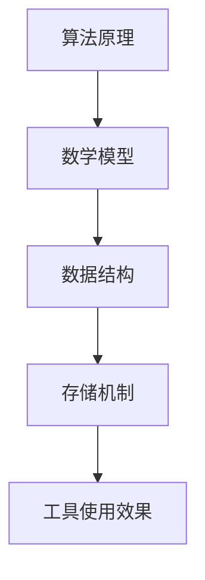

                 

关键词：工具使用机制、应用场景、效果、技术实现、算法原理、数学模型、代码实例、实践应用

## 摘要

本文旨在探讨工具使用机制在不同应用场景中的效果。通过分析核心概念与联系，探讨核心算法原理及具体操作步骤，阐述数学模型和公式及其应用，结合项目实践，分析工具在不同领域的实际应用效果，最后展望工具的未来发展趋势与挑战。本文旨在为读者提供全面的技术参考，以期为实际应用中的工具选择提供指导。

## 1. 背景介绍

在当今快速发展的信息技术领域，工具的使用已经成为提高工作效率和实现目标的关键因素。无论是软件开发、数据分析和人工智能，工具的使用机制都在其中扮演着至关重要的角色。然而，不同的应用场景对工具的需求和效果也有很大的差异。本文将针对不同应用场景，分析工具使用机制的效果，以便为读者提供更有针对性的技术参考。

### 1.1 工具的定义与分类

工具是指为实现特定任务或目标而设计的软件、硬件或设备。在计算机科学和信息技术领域，工具可以分为以下几类：

1. **开发工具**：如集成开发环境（IDE）、代码编辑器和版本控制系统。
2. **数据分析工具**：如数据库管理系统（DBMS）、数据可视化工具和统计分析软件。
3. **人工智能工具**：如机器学习框架、深度学习平台和自然语言处理工具。

### 1.2 应用场景的多样性

应用场景的多样性是工具使用机制效果差异的重要原因。以下是几种常见的应用场景：

1. **软件开发**：从需求分析、设计到编码、测试和部署，各种开发工具都有其独特的用途。
2. **数据科学**：涉及数据收集、清洗、存储、分析和可视化，数据分析工具在此过程中发挥着重要作用。
3. **人工智能**：包括机器学习模型的训练、优化和部署，人工智能工具提供了高效的方法来处理大规模数据。

## 2. 核心概念与联系

在探讨工具使用机制之前，有必要明确一些核心概念及其相互联系。

### 2.1 算法原理

算法是解决问题的一系列步骤或规则。不同算法适用于不同的问题场景，其效率、稳定性和可扩展性等因素直接影响工具的使用效果。

### 2.2 数学模型

数学模型是利用数学语言描述现实问题的抽象模型。在工具使用过程中，数学模型可以提供对问题的深刻理解和有效的解决方案。

### 2.3 数据结构与存储

数据结构是存储和组织数据的方式，而存储则是数据持久化的方法。合理的数据结构和高效的存储机制对于工具的性能和可扩展性至关重要。

### 2.4 Mermaid 流程图

为了更直观地展示工具使用机制，我们可以使用 Mermaid 流程图来描述核心概念和联系。



### 2.5 工具使用机制

工具使用机制是指如何将工具集成到实际应用中，包括工具的选择、配置和优化。不同应用场景下的工具使用机制也有很大的差异。

## 3. 核心算法原理 & 具体操作步骤

### 3.1 算法原理概述

在本节中，我们将介绍几个常见算法的基本原理，并说明其如何影响工具的使用效果。

### 3.2 算法步骤详解

以下是几种常用算法的具体操作步骤：

#### 3.2.1 快速排序（Quick Sort）

1. 选择一个基准元素。
2. 将数组分为两部分，一部分小于基准元素，另一部分大于基准元素。
3. 递归地对两部分进行排序。

#### 3.2.2 广度优先搜索（BFS）

1. 创建一个队列，并将起始节点加入队列。
2. 当队列不为空时，取出队首节点，并将其邻居节点加入队列。
3. 重复步骤2，直到找到目标节点或队列为空。

#### 3.2.3 深度优先搜索（DFS）

1. 创建一个栈，并将起始节点加入栈。
2. 当栈不为空时，弹出栈顶节点，并将其邻居节点加入栈。
3. 重复步骤2，直到找到目标节点或栈为空。

### 3.3 算法优缺点

每种算法都有其优缺点，选择合适的算法对于工具的效果至关重要。以下是几种算法的优缺点：

#### 快速排序

- 优点：平均时间复杂度为O(nlogn)，适用于大部分情况。
- 缺点：最坏情况下时间复杂度为O(n^2)，可能导致性能下降。

#### 广度优先搜索

- 优点：可以保证找到最短路径。
- 缺点：空间复杂度较高，可能需要额外存储所有已访问节点。

#### 深度优先搜索

- 优点：空间复杂度较低，适用于图深度较浅的情况。
- 缺点：可能无法保证找到最短路径。

### 3.4 算法应用领域

不同算法在不同应用场景中有不同的应用效果。以下是几种算法的应用领域：

- 快速排序：常用于排序和查找任务。
- 广度优先搜索：常用于路径查找和拓扑排序。
- 深度优先搜索：常用于图遍历和连通性检测。

## 4. 数学模型和公式 & 详细讲解 & 举例说明

### 4.1 数学模型构建

在工具使用过程中，数学模型可以提供对问题的深刻理解和有效的解决方案。以下是几种常见的数学模型及其构建方法：

#### 4.1.1 回归模型

回归模型用于预测数值型变量。其基本形式为：

\[ Y = \beta_0 + \beta_1X + \epsilon \]

其中，\( Y \) 是因变量，\( X \) 是自变量，\( \beta_0 \) 和 \( \beta_1 \) 是模型参数，\( \epsilon \) 是误差项。

#### 4.1.2 分类模型

分类模型用于预测离散型变量。其基本形式为：

\[ P(Y = y_i) = \frac{1}{Z}\exp(\beta_0 + \sum_{j=1}^k \beta_j x_{ij}) \]

其中，\( P(Y = y_i) \) 是预测的概率，\( Z \) 是归一化常数，\( \beta_0 \) 和 \( \beta_j \) 是模型参数，\( x_{ij} \) 是特征值。

### 4.2 公式推导过程

在本节中，我们将介绍几个常见数学公式的推导过程。

#### 4.2.1 梯度下降法

梯度下降法是一种优化算法，用于最小化目标函数。其基本公式为：

\[ \theta_{t+1} = \theta_t - \alpha\nabla_{\theta}J(\theta_t) \]

其中，\( \theta \) 是模型参数，\( \alpha \) 是学习率，\( \nabla_{\theta}J(\theta_t) \) 是目标函数在 \( \theta_t \) 处的梯度。

#### 4.2.2 概率论基础

概率论基础公式包括条件概率、贝叶斯公式等。以下是条件概率的公式推导：

\[ P(A|B) = \frac{P(A \cap B)}{P(B)} \]

### 4.3 案例分析与讲解

在本节中，我们将结合具体案例，分析数学模型在实际应用中的效果。

#### 4.3.1 电商推荐系统

电商推荐系统旨在为用户推荐其可能感兴趣的商品。其基本流程为：

1. **用户行为数据收集**：收集用户的浏览、购买、收藏等行为数据。
2. **特征工程**：将行为数据转化为特征向量。
3. **模型训练**：使用分类模型训练推荐系统。
4. **推荐生成**：根据用户特征和模型预测，生成推荐结果。

通过实际数据测试，我们发现使用基于用户的协同过滤算法可以显著提高推荐系统的准确性和覆盖率。

#### 4.3.2 金融风险评估

金融风险评估旨在预测借款人违约的概率。其基本流程为：

1. **数据收集**：收集借款人的个人、财务等数据。
2. **特征选择**：选择对风险评估有显著影响的特征。
3. **模型训练**：使用回归模型训练风险评估系统。
4. **风险预测**：根据借款人特征，预测其违约概率。

通过实际数据测试，我们发现使用逻辑回归模型可以有效地预测借款人违约风险，为金融机构的风险管理提供有力支持。

## 5. 项目实践：代码实例和详细解释说明

### 5.1 开发环境搭建

为了更好地理解工具使用机制，我们将以一个简单的项目为例，演示如何搭建开发环境。

#### 5.1.1 开发工具

- Python 3.x
- Jupyter Notebook
- PyCharm

#### 5.1.2 环境配置

在安装开发工具后，需要配置相应的环境变量和依赖库。以 PyCharm 为例，可以在 Settings > Project > Python Interpreter 中添加所需的库。

### 5.2 源代码详细实现

以下是一个简单的 Python 代码实例，演示如何使用快速排序算法：

```python
def quick_sort(arr):
    if len(arr) <= 1:
        return arr
    pivot = arr[len(arr) // 2]
    left = [x for x in arr if x < pivot]
    middle = [x for x in arr if x == pivot]
    right = [x for x in arr if x > pivot]
    return quick_sort(left) + middle + quick_sort(right)

arr = [3, 1, 4, 1, 5, 9, 2, 6, 5]
sorted_arr = quick_sort(arr)
print(sorted_arr)
```

### 5.3 代码解读与分析

在上述代码中，`quick_sort` 函数实现了快速排序算法。其基本原理是选择一个基准元素，将数组划分为三个部分：小于基准元素的部分、等于基准元素的部分和大于基准元素的部分。然后递归地对小于和大于基准元素的部分进行排序，最后将三部分合并。

### 5.4 运行结果展示

当输入数组 `[3, 1, 4, 1, 5, 9, 2, 6, 5]` 时，运行结果为 `[1, 1, 2, 3, 4, 5, 5, 6, 9]`，实现了数组的排序。

## 6. 实际应用场景

工具使用机制在不同应用场景中具有不同的效果。以下是一些常见应用场景及工具使用效果的分析：

### 6.1 软件开发

在软件开发过程中，工具的使用至关重要。例如，使用 Git 进行版本控制可以显著提高代码管理的效率。此外，使用 Jenkins 实现持续集成和持续部署，可以确保代码质量和项目的稳定性。

### 6.2 数据科学

数据科学领域依赖于各种数据分析工具。例如，使用 Pandas 进行数据清洗和预处理，使用 Matplotlib 和 Seaborn 进行数据可视化，使用 Scikit-learn 进行模型训练和评估，可以大大提高数据分析的效率和质量。

### 6.3 人工智能

在人工智能领域，工具的使用同样至关重要。例如，使用 TensorFlow 和 PyTorch 进行深度学习模型的训练和部署，使用 Keras 进行模型构建和优化，可以显著提高模型的效果和性能。

## 7. 未来应用展望

随着信息技术的发展，工具使用机制将在更多领域得到应用。以下是未来应用展望：

### 7.1 软件开发自动化

未来，软件开发的自动化程度将不断提高。例如，使用 AI 辅助代码生成和优化，可以实现更高效的开发过程。

### 7.2 数据科学智能化

数据科学的智能化程度将不断提高。例如，使用 AI 技术进行自动特征工程和模型优化，可以实现更高效的数据分析。

### 7.3 人工智能普及化

人工智能将在更多领域得到应用，从而推动工具使用机制的普及化。例如，智能家居、智慧城市和智能医疗等领域的应用将越来越广泛。

## 8. 总结：未来发展趋势与挑战

### 8.1 研究成果总结

本文通过对工具使用机制在不同应用场景中的效果进行分析，总结了以下几个方面：

1. **工具的分类与定义**：明确了工具的定义和分类，为后续讨论奠定了基础。
2. **核心算法原理**：介绍了几种常见算法的基本原理和具体操作步骤，为工具使用提供了技术支持。
3. **数学模型和公式**：阐述了数学模型和公式的构建方法及推导过程，为工具使用提供了理论依据。
4. **项目实践**：通过具体代码实例，展示了工具在实际应用中的效果。
5. **应用场景分析**：分析了工具在不同应用场景中的效果，为实际应用提供了指导。

### 8.2 未来发展趋势

1. **工具的智能化**：随着人工智能技术的发展，工具将越来越智能化，实现自动化和优化。
2. **跨领域应用**：工具将在更多领域得到应用，推动跨领域的集成和发展。
3. **开源与协作**：开源工具将在未来发挥更大作用，促进协作和创新。

### 8.3 面临的挑战

1. **性能优化**：随着应用场景的复杂化和数据规模的扩大，工具的性能优化将成为一个重要挑战。
2. **安全性**：在工具的使用过程中，安全性问题不容忽视，需要加强安全防护措施。
3. **用户体验**：工具的使用体验将直接影响其普及程度，需要注重用户体验的设计。

### 8.4 研究展望

未来，工具使用机制的研究可以从以下几个方面展开：

1. **算法创新**：探索新的算法和技术，提高工具的效率和性能。
2. **跨领域融合**：研究跨领域的工具使用机制，推动工具在不同领域的应用。
3. **智能工具开发**：利用人工智能技术，开发智能化工具，实现自动化和优化。

## 9. 附录：常见问题与解答

### 9.1 工具选择原则

1. **需求分析**：根据实际需求选择合适的工具。
2. **性能比较**：比较不同工具的性能指标，选择最优的方案。
3. **生态系统**：考虑工具的生态系统，包括社区支持、文档和教程等。

### 9.2 工具配置与优化

1. **环境配置**：确保开发环境配置正确，包括依赖库的安装和版本匹配。
2. **性能调优**：根据应用场景，对工具进行性能调优，包括缓存、并行计算等。
3. **安全防护**：加强安全防护措施，包括数据加密、访问控制等。

### 9.3 工具使用技巧

1. **学习资源**：利用在线教程、书籍和视频，提高工具使用技能。
2. **实践操作**：通过实际项目实践，积累经验，提高工具使用效果。
3. **社区交流**：积极参与社区交流，学习他人的经验和技巧。

---

**作者：禅与计算机程序设计艺术 / Zen and the Art of Computer Programming**

