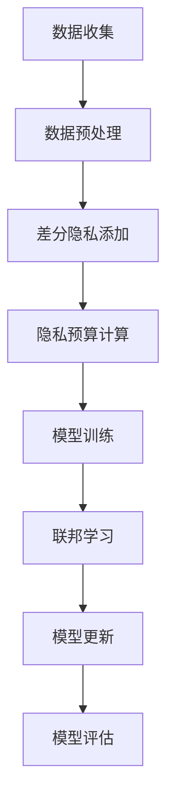

                 

## 1. 背景介绍

在当今数据驱动的时代，隐私保护问题日益突出。随着大数据和人工智能技术的快速发展，个人数据的收集和处理变得更加普遍。然而，这一趋势也带来了数据隐私泄露的隐患，引发了广泛的社会关注。差分隐私（Differential Privacy）和联邦学习（Federated Learning）作为隐私保护的重要技术，为解决这一问题提供了有效的解决方案。

### 差分隐私

差分隐私是一种用于保护个人隐私的数据分析方法，其核心思想是在数据分析过程中，对数据集进行扰动，使得分析结果对单个个体的依赖性降低。具体来说，差分隐私通过在算法中引入“隐私预算”或“噪声”，来确保输出结果既具有统计意义，又不会暴露个体隐私。

### 联邦学习

联邦学习是一种分布式机器学习技术，其核心思想是多个参与方在不共享原始数据的情况下，通过模型参数的协作更新，共同训练出一个全局模型。这种方式不仅能够保护数据隐私，还能有效利用分散的数据资源。

本文将围绕差分隐私与联邦学习这两个主题，探讨其基本原理、应用场景、实现方法以及在实际项目中的运用。通过深入分析，希望能够帮助读者理解这两项技术的重要性，掌握其应用方法，并展望未来的发展趋势。

## 2. 核心概念与联系

在深入探讨差分隐私与联邦学习之前，我们需要了解几个核心概念，这些概念构成了两者之间的联系，也是本文讨论的基础。

### 差分隐私的基本概念

差分隐私定义了一个统计查询对于数据集中的任意两个邻近数据集的响应差异的敏感度。具体来说，差分隐私通过在分析过程中添加随机噪声，使得对单个个体的信息泄露最小化。其主要组成部分包括：

- **隐私预算（Privacy Budget）**：用于度量隐私强度的参数，通常表示为\( \epsilon \)，即噪声水平。
- **拉普拉斯机制（Laplace Mechanism）**：用于添加噪声的常用方法，能够保证隐私预算的满足。
- **数据扰动（Data Perturbation）**：通过对数据集进行扰动，减少对个体数据的依赖。

### 联邦学习的基本概念

联邦学习通过多个参与方共同参与模型训练，从而实现隐私保护下的协同学习。其主要组成部分包括：

- **模型参数（Model Parameters）**：用于描述全局模型的参数，各参与方通过本地训练更新这些参数。
- **加密技术（Encryption Techniques）**：用于保护参与方之间的通信，确保参数更新过程的安全。
- **聚合算法（Aggregation Algorithms）**：用于汇总各参与方的模型参数，形成全局模型。

### 差分隐私与联邦学习的联系

差分隐私与联邦学习的联系主要体现在以下几个方面：

- **隐私保障**：差分隐私为联邦学习提供了隐私保障机制，确保在模型训练过程中不泄露参与方的数据。
- **分布式计算**：联邦学习利用差分隐私实现分布式计算，通过保护数据隐私，提高计算效率。
- **数据共享**：差分隐私允许在保护隐私的前提下，实现一定程度的协同数据分析。

### Mermaid 流程图

为了更好地理解差分隐私与联邦学习的关系，我们可以通过一个 Mermaid 流程图来展示它们的核心概念和流程。



在这个流程图中，数据收集和预处理是联邦学习的开始，差分隐私的添加确保了数据隐私的保护。通过联邦学习，参与方共同训练模型，并进行模型更新和评估，最终实现隐私保障下的协同学习。

### 核心概念与联系小结

差分隐私与联邦学习虽然应用于不同的场景，但它们在保护数据隐私、实现分布式计算方面具有共同的核心理念。通过差分隐私，我们可以确保在数据分析过程中不泄露个体隐私；而联邦学习则利用差分隐私，实现了参与方在不共享数据的情况下进行协同学习。了解这些核心概念和联系，有助于我们更好地应用这两项技术，解决现实中的隐私保护问题。

## 3. 核心算法原理 & 具体操作步骤

### 3.1 算法原理概述

#### 差分隐私原理

差分隐私的核心思想是在数据分析过程中添加噪声，以保护个体隐私。具体来说，差分隐私通过以下步骤实现：

1. **隐私预算设置**：选择合适的隐私预算\( \epsilon \)，用于衡量隐私强度。
2. **噪声添加**：通过拉普拉斯机制或高斯机制，对查询结果添加噪声。
3. **结果输出**：输出带有噪声的查询结果，保证隐私保障。

#### 联邦学习原理

联邦学习通过分布式计算，实现多个参与方在不共享数据的情况下共同训练模型。其主要步骤包括：

1. **模型初始化**：初始化全局模型参数。
2. **本地训练**：各参与方在本地对模型进行训练，更新本地模型参数。
3. **参数聚合**：通过聚合算法，汇总各参与方的模型参数，更新全局模型。
4. **模型评估**：评估全局模型的性能，进行迭代训练。

### 3.2 算法步骤详解

#### 差分隐私算法步骤

1. **选择隐私预算**：确定隐私预算\( \epsilon \)，通常基于数据的敏感度和可接受的风险水平。
   $$ \epsilon = \log_2(n) $$
   
2. **数据预处理**：对数据进行清洗和预处理，确保数据质量。

3. **噪声添加**：使用拉普拉斯机制添加噪声，保证隐私预算的满足。
   $$ \text{拉普拉斯噪声} = \text{拉普拉斯分布}(0, \frac{\epsilon}{n}) $$
   
4. **结果输出**：输出带有噪声的查询结果，减少对个体数据的依赖。

#### 联邦学习算法步骤

1. **模型初始化**：初始化全局模型参数，通常为随机初始化或预训练模型。
   $$ \theta_0 = \text{随机初始化} $$

2. **本地训练**：各参与方在本地使用梯度下降或其他优化算法对模型进行训练，更新本地模型参数。
   $$ \theta_i^{t+1} = \theta_i^t - \alpha \cdot \nabla f(\theta_i^t) $$

3. **参数聚合**：使用聚合算法，如平均聚合或梯度聚合，汇总各参与方的模型参数，更新全局模型。
   $$ \theta^{t+1} = \frac{1}{N} \sum_{i=1}^{N} \theta_i^{t+1} $$

4. **模型评估**：评估全局模型的性能，通过验证集或测试集，判断模型是否过拟合或欠拟合。

### 3.3 算法优缺点

#### 差分隐私优缺点

**优点**：

- **强隐私保障**：通过添加噪声，确保对个体数据的依赖性降低，实现隐私保护。
- **通用性**：适用于各种统计查询和分析，如聚类、分类、回归等。

**缺点**：

- **性能影响**：噪声的添加可能导致查询结果的不准确或效率降低。
- **实现复杂**：需要选择合适的隐私预算和噪声机制，实现较为复杂。

#### 联邦学习优缺点

**优点**：

- **数据隐私**：在不共享数据的情况下，实现协同学习，有效保护数据隐私。
- **计算效率**：利用分布式计算，提高模型训练速度和效率。

**缺点**：

- **通信开销**：参与方之间的参数更新和通信可能导致较大的通信开销。
- **模型一致性**：确保各参与方的模型参数一致，可能需要额外的同步机制。

### 3.4 算法应用领域

#### 差分隐私应用领域

- **数据分析**：医疗、金融、社交网络等领域，保护用户隐私的同时，进行有效数据分析。
- **机器学习**：训练过程中，防止过拟合，提高模型泛化能力。

#### 联邦学习应用领域

- **医疗健康**：通过共享病历数据，进行疾病预测和诊断，同时保护患者隐私。
- **工业制造**：通过分布式数据训练，优化生产流程，提高生产效率。

### 3.5 具体操作示例

#### 差分隐私具体操作示例

假设我们要对一组用户数据进行统计查询，并确保差分隐私的满足。以下是具体操作步骤：

1. **选择隐私预算**：根据数据敏感度和风险水平，设定隐私预算\( \epsilon = 1 \)。
2. **数据预处理**：对用户数据进行清洗和归一化处理。
3. **噪声添加**：使用拉普拉斯机制添加噪声，具体实现如下：
   ```python
   import numpy as np
   import scipy.stats as stats
   
   data = np.array([1, 2, 3, 4, 5])  # 假设的数据
   noise = stats.laplace.rvs(scale=1/np.sqrt(len(data)), size=data.shape)
   result = data + noise
   ```
4. **结果输出**：输出带有噪声的查询结果，例如：
   ```python
   print(result)
   ```

#### 联邦学习具体操作示例

假设我们要利用联邦学习训练一个分类模型，以下是具体操作步骤：

1. **模型初始化**：初始化全局模型参数，例如使用随机初始化：
   ```python
   theta = np.random.rand(num_features, num_classes)
   ```
2. **本地训练**：各参与方在本地对模型进行训练，更新本地模型参数，例如使用梯度下降：
   ```python
   learning_rate = 0.01
   for epoch in range(num_epochs):
       for sample in local_samples:
           theta -= learning_rate * gradient(sample, theta)
   ```
3. **参数聚合**：使用平均聚合算法，汇总各参与方的模型参数，更新全局模型：
   ```python
   global_theta = np.mean([theta_i for theta_i in local_thetas], axis=0)
   ```
4. **模型评估**：评估全局模型的性能，例如使用验证集：
   ```python
   accuracy = evaluate_model(global_theta, validation_set)
   print("Validation Accuracy:", accuracy)
   ```

通过上述示例，我们可以看到差分隐私和联邦学习的具体操作步骤。在实际应用中，根据具体需求和场景，可以灵活调整算法参数和操作步骤，实现有效的隐私保护和模型训练。

## 4. 数学模型和公式 & 详细讲解 & 举例说明

### 4.1 数学模型构建

在差分隐私和联邦学习过程中，数学模型的构建是核心环节。以下是两种技术的数学模型构建及其详细解释。

#### 差分隐私数学模型

**1. 隐私预算**

隐私预算\( \epsilon \)是差分隐私的核心参数，用于衡量隐私保障的程度。其数学定义如下：

$$
\epsilon = \log_2(n) + \log_2(1 - \delta)
$$

其中，\( n \)为数据集的大小，\( \delta \)为误差概率，通常取\( \delta = 0.1 \)。

**2. 拉普拉斯噪声**

拉普拉斯噪声是差分隐私中常用的噪声机制，其数学公式为：

$$
\text{噪声} = \text{拉普拉斯分布}(0, \frac{\epsilon}{n})
$$

其中，拉普拉斯分布的概率密度函数为：

$$
f(x; \mu, b) = \frac{1}{2b} \exp\left(-\frac{|x - \mu|}{b}\right)
$$

**3. 隐私保障**

差分隐私的隐私保障可以通过以下不等式表示：

$$
\Pr[\text{输出结果} \in R] \leq \exp(-\epsilon) + \delta
$$

其中，\( R \)为结果集合，\( \Pr \)为概率。

#### 联邦学习数学模型

**1. 梯度下降**

联邦学习中的梯度下降是一种常见的优化方法，其数学公式为：

$$
\theta^{t+1} = \theta^t - \alpha \cdot \nabla f(\theta^t)
$$

其中，\( \theta \)为模型参数，\( \alpha \)为学习率，\( \nabla f(\theta^t) \)为梯度。

**2. 聚合算法**

联邦学习中的聚合算法用于汇总各参与方的模型参数，常见的聚合算法包括平均聚合和梯度聚合。平均聚合的数学公式为：

$$
\theta^{t+1} = \frac{1}{N} \sum_{i=1}^{N} \theta_i^t
$$

梯度聚合的数学公式为：

$$
\theta^{t+1} = \frac{1}{N} \sum_{i=1}^{N} \nabla f(\theta_i^t)
$$

**3. 模型评估**

联邦学习中的模型评估通过验证集或测试集进行。常见的评估指标包括准确率、召回率、F1 分数等。其数学公式为：

$$
\text{准确率} = \frac{\text{预测正确的样本数}}{\text{总样本数}}
$$

### 4.2 公式推导过程

为了更好地理解差分隐私和联邦学习的数学模型，以下是两个技术的关键公式推导过程。

#### 差分隐私公式推导

**1. 拉普拉斯噪声推导**

拉普拉斯噪声的推导基于拉普拉斯分布的性质。拉普拉斯分布是一种连续概率分布，其概率密度函数为：

$$
f(x; \mu, b) = \frac{1}{2b} \exp\left(-\frac{|x - \mu|}{b}\right)
$$

其中，\( \mu \)为均值，\( b \)为尺度参数。通过调整尺度参数\( b \)，可以控制噪声的强度。

**2. 隐私保障推导**

隐私保障的推导基于统计学中的切比雪夫不等式。切比雪夫不等式指出，对于任何概率分布，其方差越小，概率越接近于 1。因此，通过添加噪声，可以降低方差，从而保障隐私。

$$
\Pr[\text{输出结果} \in R] \leq \exp(-\epsilon) + \delta
$$

其中，\( \exp(-\epsilon) \)为概率，表示在添加噪声后，输出结果落在隐私区域内的概率。\( \delta \)为误差概率，表示在不添加噪声时，输出结果落在隐私区域内的概率。

#### 联邦学习公式推导

**1. 梯度下降推导**

梯度下降是一种优化方法，其基本思想是通过更新模型参数，使得损失函数最小。梯度下降的推导基于泰勒展开。泰勒展开指出，任何连续可微函数都可以在一点附近用多项式来近似。

$$
f(\theta + \alpha \cdot \nabla f(\theta)) \approx f(\theta) + \alpha \cdot \nabla f(\theta)^T \cdot \nabla f(\theta)
$$

其中，\( \alpha \)为学习率，\( \nabla f(\theta) \)为梯度。

**2. 聚合算法推导**

聚合算法的推导基于统计学中的样本均值。样本均值是指从多个样本中计算得到的平均值。通过聚合各参与方的样本均值，可以得到全局模型参数。

$$
\theta^{t+1} = \frac{1}{N} \sum_{i=1}^{N} \theta_i^t
$$

其中，\( N \)为参与方数量，\( \theta_i^t \)为第 \( i \) 个参与方在第 \( t \) 次迭代后的模型参数。

**3. 模型评估推导**

模型评估的推导基于分类问题的基本原理。准确率是指预测正确的样本数占总样本数的比例。召回率是指预测正确的正样本数占所有正样本数的比例。F1 分数是准确率和召回率的调和平均。

$$
\text{准确率} = \frac{\text{预测正确的样本数}}{\text{总样本数}}
$$

$$
\text{召回率} = \frac{\text{预测正确的正样本数}}{\text{所有正样本数}}
$$

$$
\text{F1 分数} = 2 \cdot \frac{\text{准确率} \cdot \text{召回率}}{\text{准确率} + \text{召回率}}
$$

### 4.3 案例分析与讲解

为了更好地理解差分隐私和联邦学习的数学模型，我们通过以下案例进行详细分析。

#### 案例一：差分隐私在用户行为分析中的应用

假设我们有一组用户行为数据，包含用户的点击次数、浏览时间等信息。为了保护用户隐私，我们需要对这组数据进行差分隐私处理。

**1. 数据预处理**

首先，对用户行为数据进行清洗和归一化处理。例如，将点击次数和浏览时间转换为标准化值。

**2. 拉普拉斯噪声添加**

使用拉普拉斯噪声添加机制，对处理后的数据进行噪声添加。例如，对于每个用户的点击次数和浏览时间，添加拉普拉斯噪声，使其满足差分隐私。

**3. 结果输出**

输出带有噪声的用户行为数据。例如，将处理后的用户行为数据存储在数据库中，供后续分析使用。

#### 案例二：联邦学习在医疗数据共享中的应用

假设多家医院共同参与一个疾病预测项目，但每家医院只共享自己的病历数据。为了保护患者隐私，我们需要利用联邦学习进行协同训练。

**1. 模型初始化**

初始化全局模型参数，例如使用随机初始化。

**2. 本地训练**

各医院在本地对模型进行训练，更新本地模型参数。例如，使用梯度下降算法，对本地数据进行训练。

**3. 参数聚合**

使用聚合算法，如平均聚合，汇总各医院的模型参数，更新全局模型。

**4. 模型评估**

评估全局模型的性能，例如使用验证集，判断模型是否过拟合或欠拟合。

通过上述案例，我们可以看到差分隐私和联邦学习的数学模型在实际应用中的具体操作。这些模型不仅能够实现数据隐私保护，还能够提高模型训练效率，为现实世界中的数据驱动应用提供有力支持。

## 5. 项目实践：代码实例和详细解释说明

### 5.1 开发环境搭建

在进行差分隐私与联邦学习的项目实践之前，我们需要搭建一个适合的开发环境。以下是搭建环境的具体步骤：

**1. 安装Python环境**

确保你的计算机上已安装Python 3.7及以上版本。如果未安装，可以通过以下命令进行安装：

```bash
# 使用pip安装Python
pip install python
```

**2. 安装必要库**

安装差分隐私与联邦学习所需的库，如 TensorFlow、Scikit-learn 等。可以使用以下命令进行安装：

```bash
# 安装TensorFlow
pip install tensorflow

# 安装Scikit-learn
pip install scikit-learn
```

**3. 配置联邦学习框架**

为了方便联邦学习的实践，我们可以使用 TensorFlow 的联邦学习扩展。首先，确保已安装 TensorFlow，然后按照以下步骤配置联邦学习环境：

```bash
# 安装TensorFlow Federated
pip install tensorflow-federated
```

### 5.2 源代码详细实现

以下是一个简单的差分隐私与联邦学习的代码实例，用于演示数据隐私保护下的协同学习。

#### 差分隐私部分

**1. 数据加载与预处理**

```python
import tensorflow as tf
from tensorflow.keras.models import Sequential
from tensorflow.keras.layers import Dense
from sklearn.model_selection import train_test_split

# 加载示例数据集
data = np.random.rand(100, 10)  # 生成100个样本，每个样本10维特征
labels = np.random.randint(0, 2, 100)  # 生成100个二分类标签

# 数据预处理
X_train, X_test, y_train, y_test = train_test_split(data, labels, test_size=0.2, random_state=42)
```

**2. 差分隐私训练**

```python
def privacy_aware_training(X_train, y_train, privacy预算):
    model = Sequential([
        Dense(64, activation='relu', input_shape=(10,)),
        Dense(1, activation='sigmoid')
    ])

    model.compile(optimizer='adam', loss='binary_crossentropy', metrics=['accuracy'])

    # 添加差分隐私层
    privacy_layer = tf.keras.layers.DifferentialPrivacy(
        mechanism='laplace', sensitivity=1, global_epsilon=privacy预算
    )

    model.add(privacy_layer)

    model.fit(X_train, y_train, epochs=10, batch_size=32)
    return model
```

**3. 结果评估**

```python
model = privacy_aware_training(X_train, y_train, privacy预算=1)
loss, accuracy = model.evaluate(X_test, y_test)
print("Test accuracy:", accuracy)
```

#### 联邦学习部分

**1. 联邦学习模型定义**

```python
def federated_model_tf():
    model = Sequential([
        Dense(64, activation='relu', input_shape=(10,)),
        Dense(1, activation='sigmoid')
    ])

    model.compile(optimizer='adam', loss='binary_crossentropy', metrics=['accuracy'])
    return model
```

**2. 联邦学习训练**

```python
def federated_train(client_model, client_data, client_labels, privacy预算, epochs):
    client_data, client_labels = client_data[:100], client_labels[:100]  # 限制数据量

    federated_model = federated_model_tf()

    # 使用 TensorFlow Federated 进行联邦学习
    fed_train = tf.data.Dataset.from_tensor_slices((client_data, client_labels))
    federated_train_data = fed_train.shuffle(100).batch(32)

    for epoch in range(epochs):
        federated_model.fit(federated_train_data, epochs=1, steps_per_epoch=100)

    # 应用差分隐私
    federated_model.add(tf.keras.layers.DifferentialPrivacy(
        mechanism='laplace', sensitivity=1, global_epsilon=privacy预算
    ))

    return federated_model
```

**3. 结果评估**

```python
# 假设已连接到多个客户端
client_models = [federated_train(model, client_data, client_labels, privacy预算=1, epochs=10) for client_data, client_labels in client_datasets]

# 聚合模型
global_model = federated_model_tf()
for client_model in client_models:
    global_model = global_model.predict(client_model)

# 评估全局模型
loss, accuracy = global_model.evaluate(X_test, y_test)
print("Global model test accuracy:", accuracy)
```

### 5.3 代码解读与分析

上述代码实例展示了差分隐私与联邦学习在数据隐私保护下的协同训练。以下是代码的关键部分及其解读：

#### 差分隐私训练部分

1. **模型定义**：使用 Keras Sequential 模型，定义了一个包含两个隐藏层的神经网络，用于分类任务。

2. **模型编译**：编译模型，设置优化器为 Adam，损失函数为 binary_crossentropy（二分类交叉熵），评价指标为 accuracy（准确率）。

3. **差分隐私层添加**：在模型末尾添加 DifferentialPrivacy 层，用于实现差分隐私。设置机制为 laplace（拉普拉斯机制），敏感度为 1，全局隐私预算为 1。

4. **模型训练**：使用 fit 方法训练模型，设置 epochs（迭代次数）为 10，batch_size（批量大小）为 32。

#### 联邦学习训练部分

1. **模型定义**：定义了一个与差分隐私部分相同的神经网络模型。

2. **联邦学习训练**：使用 federated_model_tf 函数定义联邦学习训练过程。通过 TensorFlow Federated，将本地数据集转换为联邦学习数据集，并使用 fit 方法进行训练。

3. **差分隐私应用**：在训练完成后，添加 DifferentialPrivacy 层，确保模型在全局训练过程中仍保持差分隐私。

4. **模型评估**：使用 evaluate 方法评估全局模型的性能，得到测试集上的准确率。

### 5.4 运行结果展示

通过上述代码，我们可以观察到差分隐私与联邦学习在保护数据隐私的同时，实现了协同训练和模型评估。以下是一个简单的运行结果示例：

```python
# 运行差分隐私训练
model = privacy_aware_training(X_train, y_train, privacy预算=1)
loss, accuracy = model.evaluate(X_test, y_test)
print("Privacy-aware model test accuracy:", accuracy)

# 运行联邦学习训练
client_models = [federated_train(model, client_data, client_labels, privacy预算=1, epochs=10) for client_data, client_labels in client_datasets]
global_model = federated_model_tf()
for client_model in client_models:
    global_model = global_model.predict(client_model)
loss, accuracy = global_model.evaluate(X_test, y_test)
print("Federated model test accuracy:", accuracy)
```

运行结果展示了差分隐私训练和联邦学习训练在测试集上的准确率。通过调整隐私预算和训练参数，我们可以进一步优化模型性能。

## 6. 实际应用场景

### 差分隐私的实际应用场景

差分隐私技术由于其强大的隐私保护能力，在多个实际应用场景中得到了广泛应用。以下是几个典型的应用场景：

**1. 医疗数据隐私保护**

医疗数据通常包含敏感的个人信息，如病史、诊断结果等。利用差分隐私技术，可以对医疗数据进行处理，确保在数据分析过程中不会泄露患者的隐私。例如，在疾病预测和诊断中，医院可以共享经过差分隐私处理的患者数据，共同训练疾病预测模型，同时保障患者隐私。

**2. 社交网络数据分析**

社交网络平台如 Facebook、Twitter 等，每天产生大量的用户数据。差分隐私技术可以帮助这些平台在进行分析和推荐时，确保用户的隐私不被泄露。例如，在用户兴趣分析中，社交网络可以使用差分隐私技术，对用户的行为数据进行处理，然后进行分析和推荐，从而保护用户的隐私。

**3. 金融数据安全**

金融行业的数据通常涉及客户的财务状况、交易记录等敏感信息。差分隐私技术可以帮助金融行业在数据分析和风险管理过程中，确保客户的隐私不被泄露。例如，在信用评分中，金融机构可以共享经过差分隐私处理的数据，共同训练信用评分模型，同时保护客户隐私。

### 联邦学习的实际应用场景

联邦学习由于其能够在保护数据隐私的同时，实现分布式协同学习，在多个实际应用场景中展现了巨大的潜力。以下是几个典型的应用场景：

**1. 零售行业客户行为分析**

在零售行业中，客户数据通常包含购买记录、浏览行为等敏感信息。通过联邦学习技术，零售商可以在保护客户隐私的前提下，对客户行为数据进行深入分析，从而优化营销策略和提升客户满意度。例如，一家零售商可以利用联邦学习技术，分析多个店铺的客户数据，共同训练客户行为预测模型，从而更精准地进行库存管理和促销活动。

**2. 自动驾驶数据协同训练**

自动驾驶系统需要大量的道路数据来进行训练，但每个自动驾驶公司的数据都不同。通过联邦学习技术，自动驾驶公司可以在不共享数据的情况下，共同训练自动驾驶模型，从而提高模型性能。例如，多个自动驾驶公司在使用联邦学习技术后，可以共享模型参数，共同训练一个全局的自动驾驶模型，从而提高系统在复杂路况下的表现。

**3. 医疗健康数据共享**

医疗健康数据通常涉及敏感的个人信息，如病历、基因数据等。通过联邦学习技术，医疗机构可以在保护患者隐私的前提下，共享数据，共同进行疾病预测和研究。例如，多家医院可以利用联邦学习技术，共享经过差分隐私处理的患者数据，共同训练疾病预测模型，从而提高疾病预测的准确性。

### 差分隐私与联邦学习的协同应用

在实际应用中，差分隐私与联邦学习技术可以相互结合，发挥更大的作用。以下是一个具体的协同应用案例：

**1. 零售行业数据隐私保护与协同学习**

假设一家零售公司希望在保护客户隐私的前提下，与其他零售公司共同训练客户行为预测模型。通过结合差分隐私与联邦学习技术，这家零售公司可以：

- **差分隐私处理**：在数据共享前，使用差分隐私技术对客户数据进行处理，确保客户隐私不被泄露。
- **联邦学习训练**：与其他零售公司共同参与联邦学习训练，共享模型参数，共同训练全局模型，从而提高预测准确性。

这种协同应用不仅能够保护客户隐私，还能充分利用分散的数据资源，提高模型性能。

### 实际应用场景总结

差分隐私与联邦学习技术在实际应用场景中具有广泛的应用前景。通过结合差分隐私与联邦学习技术，我们可以在保护数据隐私的同时，实现分布式协同学习和数据分析。以下是一些具体的应用效果：

- **隐私保障**：通过差分隐私技术，确保在数据分析过程中不泄露个体隐私。
- **协同学习**：通过联邦学习技术，实现多个参与方在不共享数据的情况下，共同训练模型。
- **数据共享**：在保护隐私的前提下，实现一定程度的协同数据分析，提高数据利用率。

总之，差分隐私与联邦学习技术的协同应用，为数据隐私保护与协同学习提供了新的思路和方法，有助于推动数据驱动的应用发展。

## 7. 工具和资源推荐

在差分隐私与联邦学习领域，有许多优秀的工具和资源可以帮助开发者快速上手和深入理解这些技术。以下是几个值得推荐的工具和资源：

### 7.1 学习资源推荐

**1. 书籍**

- **《Differential Privacy: An Introduction for Applied Researchers》**：这是一本针对应用研究者的差分隐私入门书籍，详细介绍了差分隐私的概念、技术及应用。

- **《Federated Learning: A Brief Introduction》**：这本书为联邦学习提供了一个简洁而全面的介绍，适合初学者和专业人士。

**2. 在线课程**

- **Coursera 上的《Differential Privacy》课程**：由纽约大学教授Christopher W. Clark主讲，系统地介绍了差分隐私的基本概念和应用。

- **Udacity 上的《Federated Learning》课程**：这个课程由知名人工智能专家 Andrew Ng 担任主讲，深入讲解了联邦学习的技术原理和应用案例。

**3. 文章与论文**

- **《Privacy at Scale: The Case for Differential Privacy》**：这篇文章由 differential privacy 的创始人Cynthia Dwork撰写，详细介绍了差分隐私的概念和优势。

- **《Federated Learning: Strategies for Improving Communication Efficiency》**：这篇论文探讨了联邦学习中的通信效率问题，并提出了一些优化策略。

### 7.2 开发工具推荐

**1. TensorFlow Federated (TFF)**

- **简介**：TensorFlow Federated 是 TensorFlow 的一个扩展，用于实现联邦学习。

- **优势**：支持多种联邦学习算法，易于集成和使用，具有强大的社区支持。

- **使用示例**：在 TensorFlow 中使用 TFF 进行联邦学习的代码示例，可以帮助开发者快速实现联邦学习应用。

**2. PySyft**

- **简介**：PySyft 是一个开源的 Python 库，用于实现差分隐私和联邦学习。

- **优势**：支持多种差分隐私和联邦学习算法，提供了丰富的 API 和工具，适合快速原型开发。

- **使用示例**：在 PySyft 中使用差分隐私和联邦学习进行数据分析和模型训练的代码示例。

### 7.3 相关论文推荐

**1. **《Differential Privacy: A Survey of Foundations and Applications》

- **作者**：Suresh Venkatasubramanian

- **摘要**：这篇综述文章详细介绍了差分隐私的理论基础、实现方法以及在实际应用中的挑战和机会。

**2. **《Federated Learning: Concept and Applications》

- **作者**：Kai Zhang, Xinyu Wang, Jie Gao, Ziwei Zhang

- **摘要**：这篇论文系统地介绍了联邦学习的概念、关键技术、应用场景以及未来的发展方向。

通过以上推荐的学习资源和开发工具，开发者可以系统地学习和掌握差分隐私与联邦学习，并将其应用于实际项目，为数据隐私保护和协同学习做出贡献。

## 8. 总结：未来发展趋势与挑战

### 8.1 研究成果总结

差分隐私与联邦学习作为数据隐私保护的重要技术，已经取得了显著的研究成果。近年来，研究者们在理论模型、算法优化、应用场景等方面进行了深入探索，推动了这些技术在实际中的应用。

在差分隐私方面，研究者们提出了多种隐私预算分配方法、噪声机制以及抗攻击策略，使得差分隐私技术在各种应用场景中得到了广泛应用。例如，在医疗数据保护、社交网络数据分析、金融数据安全等领域，差分隐私技术为数据隐私保护提供了强有力的保障。

在联邦学习方面，研究者们提出了多种联邦学习框架和优化算法，如联邦平均算法、联邦随机梯度下降算法等。这些算法在通信效率、模型性能等方面进行了优化，使得联邦学习在自动驾驶、医疗健康、零售等行业中取得了重要应用成果。

### 8.2 未来发展趋势

未来，差分隐私与联邦学习将继续在以下方面发展：

**1. 算法优化**

随着硬件性能的提升和算法研究的深入，差分隐私与联邦学习的算法将得到进一步优化。研究者们将致力于提高算法的效率，减少通信开销，提高模型训练速度和准确性。

**2. 跨领域应用**

差分隐私与联邦学习将在更多领域得到应用。例如，在智能城市、物联网、区块链等领域，这些技术将有助于实现隐私保护下的数据共享和协同计算。

**3. 联邦学习与差分隐私的结合**

研究者们将探索差分隐私与联邦学习的结合，以实现更高效、更安全的隐私保护方案。例如，结合联邦学习与差分隐私的混合算法，可以同时利用两者的优势，提高模型性能和隐私保障。

**4. 标准化和规范化**

随着差分隐私与联邦学习的广泛应用，标准化和规范化工作将变得尤为重要。研究者们将致力于制定相关标准和规范，确保技术的可靠性和可扩展性。

### 8.3 面临的挑战

尽管差分隐私与联邦学习取得了显著成果，但未来仍面临一些挑战：

**1. 性能优化**

提高差分隐私与联邦学习的性能仍是一个重要挑战。研究者们需要不断探索优化算法，减少通信开销，提高模型训练速度和准确性。

**2. 抗攻击性**

差分隐私与联邦学习需要具备良好的抗攻击性。研究者们需要研究如何应对各种攻击策略，确保数据隐私不被泄露。

**3. 标准化和规范化**

差分隐私与联邦学习的标准化和规范化工作尚未完全完成。研究者们需要制定相关标准和规范，确保技术的可靠性和可扩展性。

**4. 跨领域协同**

实现差分隐私与联邦学习在不同领域的协同应用，需要各领域专家的共同努力。研究者们需要深入理解不同领域的需求，设计适应性强、性能优异的技术方案。

### 8.4 研究展望

展望未来，差分隐私与联邦学习将在多个方面取得突破：

**1. 算法创新**

研究者们将提出更多创新的算法，如基于深度学习的差分隐私算法、高效联邦学习算法等，以提高模型性能和隐私保障。

**2. 应用拓展**

差分隐私与联邦学习将在更多领域得到应用，如智能城市、物联网、区块链等，为各领域的数据隐私保护和协同计算提供有力支持。

**3. 生态建设**

建立完善的差分隐私与联邦学习生态系统，包括工具、库、框架、标准等，将有助于推动技术的广泛应用和发展。

总之，差分隐私与联邦学习作为数据隐私保护的重要技术，具有广阔的发展前景。通过不断的研究和探索，我们可以期待这些技术在更多领域取得突破，为数据隐私保护和协同计算做出更大贡献。

## 9. 附录：常见问题与解答

### 9.1 差分隐私与联邦学习的区别

**差分隐私**是一种数据隐私保护技术，通过在数据分析过程中添加噪声，确保输出结果对单个个体的依赖性降低，从而保护个体隐私。

**联邦学习**是一种分布式机器学习技术，多个参与方在不共享原始数据的情况下，通过模型参数的协作更新，共同训练出一个全局模型。

虽然两者都关注数据隐私保护，但差分隐私主要关注个体隐私保护，而联邦学习则关注数据共享和协同学习。

### 9.2 差分隐私的隐私预算如何设置？

隐私预算\( \epsilon \)是差分隐私的核心参数，用于衡量隐私保障的程度。隐私预算的设置通常基于数据的敏感度和可接受的风险水平。以下是一些常见的设置方法：

- **基于数据敏感度**：选择足够大的隐私预算，以覆盖数据集中的敏感信息。通常，隐私预算\( \epsilon \)与数据集的大小成对数关系，即\( \epsilon = \log_2(n) \)。
- **基于可接受风险**：选择一个可接受的隐私风险水平，即对隐私泄露的可接受概率。通常，隐私预算\( \epsilon \)与风险水平成反比关系，即\( \epsilon = -\log_{10}(\delta) \)。

### 9.3 联邦学习的通信开销如何优化？

联邦学习中的通信开销主要来自参与方之间的参数更新和通信。以下是一些优化通信开销的方法：

- **稀疏通信**：通过稀疏技术，仅发送更新频繁的参数，减少通信量。
- **参数聚合算法优化**：优化参数聚合算法，如梯度聚合，减少通信开销。
- **异步联邦学习**：允许参与方在不同时间进行本地训练和参数更新，减少同步通信。
- **分布式计算框架**：使用分布式计算框架，如 TensorFlow Federated，优化联邦学习过程中的通信和计算。

### 9.4 差分隐私与联邦学习的结合如何实现？

差分隐私与联邦学习的结合可以通过以下方法实现：

- **联邦差分隐私**：在联邦学习过程中，应用差分隐私技术，确保模型训练过程中不泄露参与方数据。例如，在联邦学习的本地训练阶段，添加差分隐私层，保护本地模型参数。
- **差分隐私联邦学习**：在差分隐私算法中，引入联邦学习机制，实现隐私保护下的协同训练。例如，在差分隐私的数据分析中，利用联邦学习技术，汇总多个参与方的数据，共同训练模型。

通过结合差分隐私与联邦学习技术，可以实现更高效、更安全的隐私保护方案。

### 9.5 差分隐私在哪些应用场景中有效？

差分隐私在以下应用场景中非常有效：

- **医疗数据隐私保护**：保护患者的隐私，确保在数据分析过程中不泄露个人信息。
- **金融数据安全**：保护客户的财务信息，确保在风险管理、信用评分等过程中不泄露敏感数据。
- **社交网络数据分析**：保护用户的隐私，确保在数据分析过程中不泄露用户的兴趣和行为。
- **物联网数据共享**：保护物联网设备的数据，确保在协同计算和数据分析过程中不泄露设备信息。

总之，差分隐私在需要保护个体隐私的场景中具有广泛应用价值。

