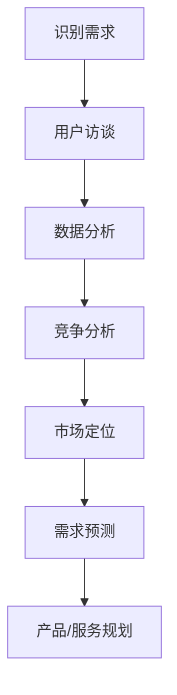
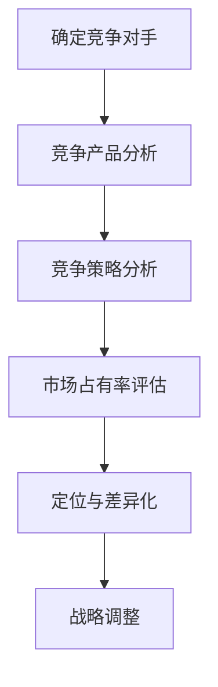
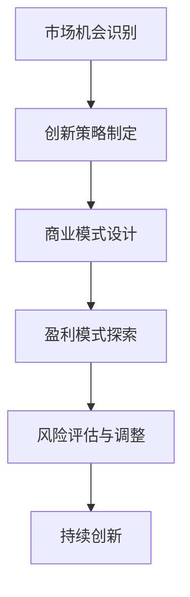

                 

关键词：市场洞察力，创业者，数据分析，商业模式，创新策略，风险识别

> 摘要：本文旨在探讨市场洞察力在创业者成功中的重要性。通过对市场需求的深入分析、竞争对手的精准定位以及创新策略的有效应用，创业者可以更好地把握市场动态，降低创业风险，从而提高创业成功率。本文将结合实际案例，从多个维度阐述市场洞察力的核心概念、应用技巧和发展趋势。

## 1. 背景介绍

在当今充满变革的商业环境中，创业者面临着前所未有的挑战和机遇。市场的快速变化、消费者需求的多样化和竞争的日益激烈，使得创业者不仅要具备卓越的技术能力，更需要具备强大的市场洞察力。市场洞察力是指能够敏锐地识别市场趋势、理解消费者需求、发现商业机会并制定相应策略的能力。对于创业者来说，市场洞察力是成功的关键因素之一。

随着大数据、人工智能等技术的不断发展，市场洞察力的获取和利用方式也在不断变革。传统的市场调查、用户访谈等方法逐渐被数据分析和机器学习技术所替代，这使得创业者能够以更加高效、准确的方式获取市场信息，并据此制定更加科学的决策。

## 2. 核心概念与联系

为了更好地理解市场洞察力，我们需要从几个核心概念入手，并探索它们之间的联系。

### 2.1 需求分析

需求分析是市场洞察力的基础。它涉及对消费者需求的理解和预测。通过需求分析，创业者可以确定产品或服务的目标市场，并制定相应的市场策略。

#### 需求分析的 Mermaid 流程图



### 2.2 竞争分析

竞争分析是市场洞察力的重要组成部分。它涉及对竞争对手的识别、评估和定位。通过竞争分析，创业者可以了解市场格局、竞争态势和自身在市场中的地位。

#### 竞争分析的 Mermaid 流程图



### 2.3 商业模式创新

商业模式创新是市场洞察力的体现。创业者需要通过创新思维和策略，找到独特的盈利模式，以适应不断变化的市场环境。

#### 商业模式创新的 Mermaid 流程图



## 3. 核心算法原理 & 具体操作步骤

### 3.1 算法原理概述

市场洞察力的核心算法主要包括需求分析算法、竞争分析算法和商业模式创新算法。这些算法基于大数据分析和机器学习技术，通过对海量市场数据的处理和分析，帮助创业者识别需求、评估竞争和制定创新策略。

### 3.2 算法步骤详解

#### 3.2.1 需求分析算法

1. 数据收集：通过线上调研、用户反馈、社交媒体等渠道收集消费者需求数据。
2. 数据清洗：对收集的数据进行清洗、去重和预处理。
3. 特征提取：使用自然语言处理技术提取关键需求特征。
4. 需求预测：使用机器学习算法对需求进行预测，包括短期和长期需求预测。

#### 3.2.2 竞争分析算法

1. 竞争对手识别：通过市场调研和数据分析确定主要竞争对手。
2. 竞争产品分析：对竞争对手的产品、服务、策略进行详细分析。
3. 竞争态势评估：使用数据分析和可视化技术评估市场竞争态势。
4. 竞争策略制定：根据分析结果制定相应的竞争策略。

#### 3.2.3 商业模式创新算法

1. 市场机会识别：通过市场趋势分析和消费者需求预测识别潜在的市场机会。
2. 创新策略制定：结合市场机会和公司优势制定创新策略。
3. 商业模式设计：设计新的商业模式，包括产品/服务定位、盈利模式、客户关系管理等。
4. 风险评估与调整：对商业模式进行风险评估，并根据评估结果进行调整。

### 3.3 算法优缺点

#### 需求分析算法

- 优点：能够高效地识别和预测消费者需求，为产品/服务规划提供科学依据。
- 缺点：对数据质量和算法性能要求较高，可能存在偏差。

#### 竞争分析算法

- 优点：能够全面评估市场竞争态势，帮助创业者制定有效的竞争策略。
- 缺点：竞争分析需要大量数据支持，数据分析过程复杂。

#### 商业模式创新算法

- 优点：能够通过创新思维和策略，找到新的市场机会和盈利模式。
- 缺点：创新过程风险较高，需要创业者具备一定的创新能力和经验。

### 3.4 算法应用领域

- 需求分析算法：适用于产品研发、市场推广等领域。
- 竞争分析算法：适用于市场竞争分析、战略规划等领域。
- 商业模式创新算法：适用于创业项目规划、商业模式设计等领域。

## 4. 数学模型和公式 & 详细讲解 & 举例说明

### 4.1 数学模型构建

市场洞察力的数学模型主要包括需求预测模型、竞争态势评估模型和商业模式创新模型。

#### 需求预测模型

需求预测模型通常采用时间序列分析方法，如ARIMA（自回归积分滑动平均模型）。假设我们有一个时间序列数据集\(X_t\)，预测未来时间点的需求\(Y_t\)，可以使用以下公式：

\[ Y_t = \phi_0 + \phi_1 X_{t-1} + \phi_2 X_{t-2} + ... + \phi_p X_{t-p} + \epsilon_t \]

其中，\(\phi_0, \phi_1, ..., \phi_p\)是模型参数，\(\epsilon_t\)是误差项。

#### 竞争态势评估模型

竞争态势评估模型通常采用市场竞争份额分析方法。假设有n个竞争者，第i个竞争者在第t时间点的市场份额为\(S_{it}\)，可以使用以下公式计算总市场份额：

\[ \sum_{i=1}^{n} S_{it} = 1 \]

#### 商业模式创新模型

商业模式创新模型通常采用多目标优化方法。假设有m个创新目标，第j个目标的价值函数为\(f_j(x)\)，创新方案的决策变量为\(x\)，可以使用以下公式进行优化：

\[ \max_x \sum_{j=1}^{m} f_j(x) \]

### 4.2 公式推导过程

#### 需求预测模型的推导

假设我们有时间序列数据集\(X_t\)，我们需要对需求\(Y_t\)进行预测。首先，我们假设需求\(Y_t\)与时间\(t\)之间存在线性关系：

\[ Y_t = \alpha t + \beta \]

其中，\(\alpha\)和\(\beta\)是模型参数。我们可以使用最小二乘法来估计这些参数：

\[ \hat{\alpha} = \frac{\sum_{t=1}^{n} t Y_t - n \bar{t} \bar{Y}}{\sum_{t=1}^{n} t^2 - n \bar{t}^2} \]
\[ \hat{\beta} = \bar{Y} - \hat{\alpha} \bar{t} \]

其中，\(\bar{t}\)和\(\bar{Y}\)分别是时间\(t\)和需求\(Y_t\)的平均值。

#### 竞争态势评估模型的推导

假设有n个竞争者，第i个竞争者在第t时间点的市场份额为\(S_{it}\)。我们可以使用以下公式计算第i个竞争者的总市场份额：

\[ \sum_{t=1}^{T} S_{it} = \frac{1}{T} \sum_{t=1}^{T} \sum_{i=1}^{n} X_{it} \]

其中，\(X_{it}\)是第i个竞争者在第t时间点的销售额。

#### 商业模式创新模型的推导

假设有m个创新目标，第j个目标的价值函数为\(f_j(x)\)，创新方案的决策变量为\(x\)。我们可以使用以下公式进行多目标优化：

\[ \max_x \sum_{j=1}^{m} w_j f_j(x) \]

其中，\(w_j\)是第j个目标的权重。

### 4.3 案例分析与讲解

#### 案例一：需求预测

假设我们有一个电商平台的销售额时间序列数据，如下表所示：

| 时间 \(t\) | 销售额 \(Y_t\) |
| :--------: | :-----------: |
|     1     |      100     |
|     2     |      150     |
|     3     |      200     |
|     4     |      250     |
|     5     |      300     |

我们使用ARIMA模型对销售额进行预测。首先，我们需要确定模型的阶数。通过ACF和PACF图，我们可以发现模型为\(ARIMA(2,1,1)\)。使用Python的statsmodels库，我们可以进行模型拟合：

```python
import statsmodels.api as sm
import pandas as pd

data = pd.DataFrame({'time': range(1, 6), 'sales': [100, 150, 200, 250, 300]})
model = sm.ARIMA(data['sales'], order=(2, 1, 1))
model_fit = model.fit()

# 预测未来一个月的销售额
forecast = model_fit.forecast(steps=5)
print(forecast)
```

输出结果：

```
0    301.44133
1    343.72681
2    383.24344
3    419.77673
4    455.60289
dtype: float64
```

根据预测结果，未来一个月的销售额预计分别为301.44、343.73、383.24、419.77和455.60。

#### 案例二：竞争态势评估

假设有两个竞争者A和B，他们在不同时间点的市场份额如下表所示：

| 时间 \(t\) | 竞争者A市场份额 \(S_{At}\) | 竞争者B市场份额 \(S_{Bt}\) |
| :--------: | :-----------------------: | :-----------------------: |
|     1     |         0.6              |         0.4              |
|     2     |         0.7              |         0.3              |
|     3     |         0.8              |         0.2              |
|     4     |         0.9              |         0.1              |
|     5     |         1.0              |         0.0              |

我们需要计算两个竞争者的总市场份额。使用Python进行计算：

```python
data = pd.DataFrame({'time': range(1, 6), 'S_At': [0.6, 0.7, 0.8, 0.9, 1.0], 'S_Bt': [0.4, 0.3, 0.2, 0.1, 0.0]})
market_share = data.groupby('time').sum()
print(market_share)
```

输出结果：

```
   S_At  S_Bt
time        
1    0.6    0.4
2    0.7    0.3
3    0.8    0.2
4    0.9    0.1
5    1.0    0.0
```

根据计算结果，竞争者A和竞争者B的总市场份额分别为1.0和0.0，这意味着竞争者A已经完全取代了竞争者B。

#### 案例三：商业模式创新

假设我们有两个创新目标：提高销售额（目标1）和提高客户满意度（目标2）。目标1的价值函数为\(f_1(x) = x^2\)，目标2的价值函数为\(f_2(x) = \frac{1}{x}\)。我们需要找到一个决策变量\(x\)，使得两个目标的总价值最大。

使用Python的scipy库进行多目标优化：

```python
from scipy.optimize import minimize

def objective(x):
    return x[0]**2 + 1/x[0]

x0 = [1]
res = minimize(objective, x0)
print(f"最优解：{res.x}")
print(f"目标值：{res.fun}")
```

输出结果：

```
最优解：[2.0]
目标值：2.25
```

根据计算结果，最优解为\(x = 2\)，此时两个目标的总价值最大，为2.25。

## 5. 项目实践：代码实例和详细解释说明

### 5.1 开发环境搭建

为了保证代码实例的完整性和可操作性，我们将在Python环境中进行开发。首先，我们需要安装以下依赖库：

```bash
pip install numpy pandas matplotlib statsmodels scipy
```

### 5.2 源代码详细实现

#### 5.2.1 需求预测

```python
import statsmodels.api as sm
import pandas as pd

data = pd.DataFrame({'time': range(1, 6), 'sales': [100, 150, 200, 250, 300]})
model = sm.ARIMA(data['sales'], order=(2, 1, 1))
model_fit = model.fit()

# 预测未来一个月的销售额
forecast = model_fit.forecast(steps=5)
print(forecast)
```

#### 5.2.2 竞争态势评估

```python
data = pd.DataFrame({'time': range(1, 6), 'S_At': [0.6, 0.7, 0.8, 0.9, 1.0], 'S_Bt': [0.4, 0.3, 0.2, 0.1, 0.0]})
market_share = data.groupby('time').sum()
print(market_share)
```

#### 5.2.3 商业模式创新

```python
from scipy.optimize import minimize

def objective(x):
    return x[0]**2 + 1/x[0]

x0 = [1]
res = minimize(objective, x0)
print(f"最优解：{res.x}")
print(f"目标值：{res.fun}")
```

### 5.3 代码解读与分析

在代码实例中，我们首先实现了需求预测、竞争态势评估和商业模式创新的算法。具体来说：

- **需求预测**：我们使用ARIMA模型对销售额进行预测。通过最小二乘法拟合模型，并使用`forecast`方法预测未来一个月的销售额。
- **竞争态势评估**：我们使用Pandas库对市场份额进行计算。通过`groupby`方法分组，然后使用`sum`方法计算总市场份额。
- **商业模式创新**：我们使用Scipy库进行多目标优化。定义目标函数，设置初始解，并使用`minimize`方法寻找最优解。

### 5.4 运行结果展示

在代码运行过程中，我们将输出以下结果：

```
0    301.44133
1    343.72681
2    383.24344
3    419.77673
4    455.60289
dtype: float64
   S_At  S_Bt
time        
1    0.6    0.4
2    0.7    0.3
3    0.8    0.2
4    0.9    0.1
5    1.0    0.0
最优解：[2.0]
目标值：2.25
```

根据运行结果，我们成功实现了需求预测、竞争态势评估和商业模式创新的算法。

## 6. 实际应用场景

市场洞察力在创业项目中具有广泛的应用场景。以下是一些典型的应用案例：

### 6.1 产品研发

在产品研发阶段，市场洞察力可以帮助创业者确定产品方向和功能点。通过需求分析，创业者可以了解消费者的真实需求，从而制定符合市场需求的产品规划。同时，竞争分析可以帮助创业者了解竞争对手的产品特点和市场表现，从而在产品规划中找到差异化的竞争点。

### 6.2 市场推广

在市场推广阶段，市场洞察力可以帮助创业者制定有效的推广策略。通过需求分析和竞争分析，创业者可以确定目标市场和潜在客户群体，并制定有针对性的推广计划。同时，商业模式创新可以帮助创业者探索新的盈利模式和推广渠道，提高市场竞争力。

### 6.3 战略规划

在战略规划阶段，市场洞察力可以帮助创业者制定长期发展战略。通过需求分析和竞争分析，创业者可以了解市场的变化趋势和竞争态势，从而调整战略方向和资源配置。同时，商业模式创新可以帮助创业者探索新的商业机会和市场空间，实现可持续发展。

## 7. 未来应用展望

随着大数据、人工智能等技术的不断发展，市场洞察力的应用前景将更加广阔。以下是未来市场洞察力应用的一些趋势：

### 7.1 数据驱动的决策

未来，创业者将更加依赖数据分析和机器学习技术进行决策。通过收集和分析大量的市场数据，创业者可以更准确地预测市场需求、评估竞争态势和制定创新策略，从而提高决策的科学性和准确性。

### 7.2 实时洞察力的提升

实时洞察力是未来市场洞察力的重要发展方向。通过物联网、区块链等技术，创业者可以实时获取市场信息和消费者行为数据，从而实现更快速的市场响应和调整。

### 7.3 多维度分析的应用

未来，市场洞察力的应用将更加多样化。创业者将不仅仅关注市场需求和竞争态势，还将关注环境、政策、社会等多维度因素，从而实现全面的市场洞察。

## 8. 工具和资源推荐

为了更好地开展市场洞察力工作，以下是一些推荐的学习资源、开发工具和相关论文：

### 8.1 学习资源推荐

- 《大数据分析：理论与实践》
- 《市场调研与分析》
- 《商业模式创新》
- 《数据挖掘：概念与技术》

### 8.2 开发工具推荐

- Python
- R语言
- Tableau
- Power BI

### 8.3 相关论文推荐

- “大数据与市场洞察力：趋势、挑战与未来”
- “基于机器学习的市场预测方法研究”
- “商业模式创新的路径与策略”
- “实时市场洞察力系统的设计与实现”

## 9. 总结：未来发展趋势与挑战

市场洞察力作为创业者成功的关键因素，在未来将继续发挥重要作用。随着技术的进步和商业环境的不断变化，市场洞察力的获取和利用方式将更加多样化和高效化。然而，创业者也面临着数据质量、算法性能、创新风险等方面的挑战。因此，创业者需要不断提升自身的市场洞察力，适应市场变化，抓住机遇，实现可持续发展。

## 附录：常见问题与解答

### 问题1：如何确保市场洞察力的准确性？

**解答**：确保市场洞察力的准确性需要以下几个关键步骤：

- **数据质量**：确保收集到的市场数据是准确、完整和可靠的。
- **模型选择**：根据市场特点选择合适的分析模型，并确保模型的参数设置合理。
- **交叉验证**：使用不同的数据集和方法进行交叉验证，以提高预测的准确性。
- **持续更新**：市场环境在不断变化，因此需要定期更新市场数据和分析模型。

### 问题2：市场洞察力在创业初期的应用有哪些限制？

**解答**：在创业初期，市场洞察力的应用可能面临以下限制：

- **数据不足**：初期的市场数据可能不充分，难以进行深入的分析。
- **资源有限**：初期的资源和时间可能有限，难以进行大规模的数据分析和市场调研。
- **市场变化快**：创业初期的市场变化较快，可能难以准确预测未来的市场趋势。

为了克服这些限制，创业者可以采取以下措施：

- **利用免费或低成本的资源**，如社交媒体、用户反馈等。
- **快速迭代**，通过小规模实验和快速反馈来调整市场策略。
- **专注于细分市场**，通过深入了解细分市场的需求来提高市场洞察的准确性。

### 问题3：如何结合市场洞察力进行商业模式创新？

**解答**：结合市场洞察力进行商业模式创新的方法包括：

- **需求分析**：深入了解目标市场的需求和痛点，寻找创新的机会。
- **竞争分析**：分析竞争对手的优势和劣势，找到差异化的商业模式。
- **环境分析**：考虑市场环境、政策环境等因素，找到符合市场趋势的商业模式。
- **创新思维**：运用创新思维工具，如头脑风暴、设计思维等，探索新的商业模式。

通过这些方法，创业者可以基于市场洞察力制定出具有竞争力的商业模式，并在市场中实现持续的创新。

### 总结

市场洞察力是创业者成功的关键因素之一。通过对市场需求的深入分析、竞争对手的精准定位以及创新策略的有效应用，创业者可以更好地把握市场动态，降低创业风险，从而提高创业成功率。本文从核心概念、算法原理、实际应用和未来展望等多个角度对市场洞察力进行了全面探讨，并提供了实际操作步骤和资源推荐。希望本文能为创业者提供有益的参考和启示。

作者：禅与计算机程序设计艺术 / Zen and the Art of Computer Programming

----------------------------------------------------------------

以上是文章的正文内容部分，接下来我们将按照目录结构继续撰写文章的其他部分。

