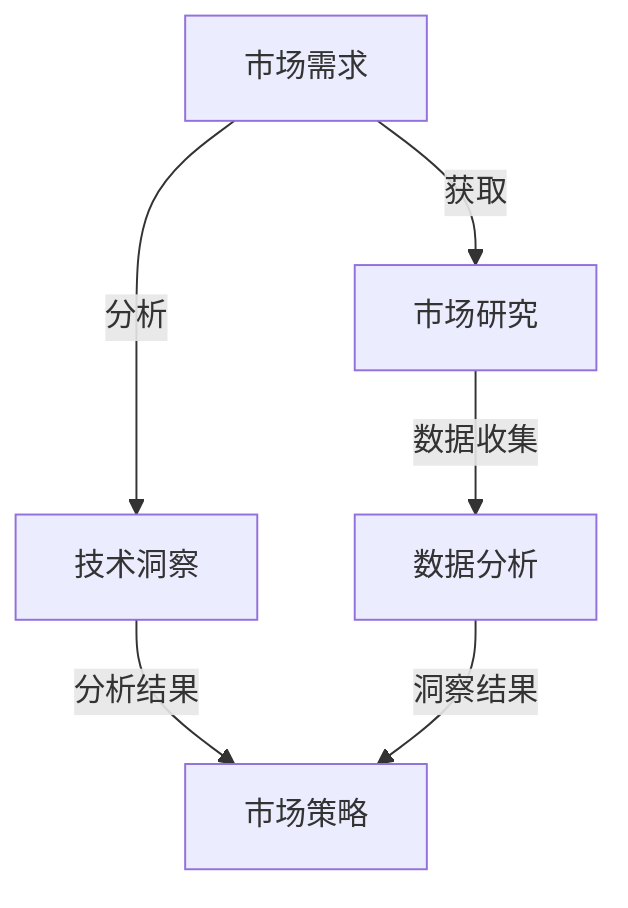

                 

 > **关键词：** 市场需求，创业，成功，关键因素，技术洞察，市场研究。

> **摘要：** 本文将深入探讨市场需求在创业过程中的重要性，以及如何通过技术洞察和精准的市场研究来实现创业的成功。我们将从多个角度分析市场需求的本质、创业者的应对策略，并探讨未来市场需求可能的发展趋势。

---

## 1. 背景介绍

在当今快速变化的市场环境中，创业已成为一种普遍的现象。从科技创业到传统行业的创新，创业公司不断涌现。然而，创业的成功并非偶然，而是需要一系列因素的支持。其中，市场需求无疑是最关键的因素之一。

市场需求不仅影响着企业的产品定位和市场策略，更是决定企业能否生存和发展的基石。一个精准的市场需求洞察，可以帮助企业发现用户真正的痛点，从而开发出更具竞争力的产品。相反，如果企业未能准确把握市场需求，可能会导致产品无法满足用户需求，甚至走向失败。

本文将围绕市场需求这一核心主题，从以下几个方面进行探讨：

- **市场需求的本质与重要性**
- **市场需求洞察的技术方法**
- **创业者的市场需求应对策略**
- **市场需求与未来发展趋势**

通过这些内容的探讨，希望能够为创业者提供有价值的参考，帮助他们更好地把握市场需求，实现创业的成功。

## 2. 核心概念与联系

在深入探讨市场需求之前，我们需要理解一些核心概念，这些概念将为我们后续的分析提供理论基础。

### 2.1 市场需求

市场需求是指在特定时间内，在一定价格水平下，消费者愿意并且能够购买的商品或服务的总量。市场需求不仅仅是一个数量指标，还包括消费者对商品或服务的偏好、购买能力和购买意愿等多方面的信息。

### 2.2 技术洞察

技术洞察是指通过对市场和技术趋势的深入分析，发现潜在的商业机会和挑战。技术洞察能够帮助企业预见市场变化，制定前瞻性的战略。

### 2.3 市场研究

市场研究是收集、分析和解读有关市场信息的系统性过程。通过市场研究，企业可以了解市场现状、用户需求和竞争环境，从而为产品开发和市场策略提供依据。

这些核心概念之间的联系在于，市场需求是创业成功的基础，而技术洞察和市场研究则是获取和利用市场需求的工具。以下是这些概念之间的Mermaid流程图：



通过市场研究，企业可以收集到关于市场需求的第一手数据。这些数据经过分析，结合技术洞察，可以形成对市场趋势的深刻理解。这种理解最终将指导企业的市场策略，确保产品和服务能够满足市场需求，从而实现创业的成功。

## 3. 核心算法原理 & 具体操作步骤

### 3.1 算法原理概述

市场需求洞察的核心算法基于大数据分析和机器学习技术。该算法的主要目的是通过分析海量数据，识别出市场中的潜在需求，并对其进行量化评估。以下是算法的基本原理：

1. **数据收集**：从多个渠道收集用户行为数据、市场趋势数据、竞争者数据等。
2. **数据清洗**：对收集到的数据进行清洗，去除噪声和不相关数据。
3. **特征提取**：从数据中提取与市场需求相关的特征，如用户购买行为、市场增长率、竞争环境等。
4. **模型训练**：使用机器学习算法，如决策树、神经网络等，对提取的特征进行训练，构建市场需求预测模型。
5. **需求评估**：利用训练好的模型对市场需求进行评估，预测未来需求的趋势和变化。

### 3.2 算法步骤详解

#### 步骤1：数据收集

数据收集是市场需求洞察的基础。数据来源可以是社交媒体、电商平台、市场调研报告等。以下是一个示例数据收集流程：

- **社交媒体数据**：从社交媒体平台上收集用户评论、点赞、分享等行为数据。
- **电商平台数据**：从电商平台收集用户购买记录、搜索记录、产品评价等数据。
- **市场调研报告**：从第三方市场调研机构获取行业报告、市场趋势分析等数据。

#### 步骤2：数据清洗

数据清洗是确保数据质量的重要步骤。清洗过程包括：

- **去除重复数据**：删除重复的数据记录，避免重复计算。
- **处理缺失值**：对缺失的数据进行处理，例如使用平均值、中位数等方法填充缺失值。
- **异常值处理**：检测并处理异常数据，避免异常值对模型的影响。

#### 步骤3：特征提取

特征提取是从原始数据中提取与市场需求相关的特征。以下是一些常见的特征提取方法：

- **用户行为特征**：包括用户购买频率、购买时长、购买金额等。
- **市场趋势特征**：包括市场增长率、季节性变化、市场占有率等。
- **竞争环境特征**：包括竞争对手的产品特性、市场占有率、价格策略等。

#### 步骤4：模型训练

模型训练是构建市场需求预测模型的关键步骤。以下是一个简单的模型训练流程：

- **选择算法**：选择合适的机器学习算法，如决策树、随机森林、神经网络等。
- **数据划分**：将数据集划分为训练集和测试集，用于模型的训练和评估。
- **模型训练**：使用训练集数据训练模型，调整模型参数，优化模型性能。
- **模型评估**：使用测试集数据评估模型性能，确保模型具有较好的泛化能力。

#### 步骤5：需求评估

需求评估是利用训练好的模型对市场需求进行预测。以下是一个需求评估的示例流程：

- **数据输入**：将新数据输入到模型中，进行市场需求预测。
- **需求分析**：对预测结果进行分析，识别市场中的潜在需求。
- **策略制定**：根据市场需求预测结果，制定相应的市场策略，如产品调整、价格调整等。

### 3.3 算法优缺点

市场需求洞察算法具有以下优点：

- **高效性**：算法能够快速处理大量数据，提供实时市场需求预测。
- **准确性**：通过机器学习技术，算法能够识别出市场中的潜在需求，提高预测准确性。
- **灵活性**：算法可以根据不同的数据特征和市场环境进行灵活调整，适应不同场景的需求。

然而，市场需求洞察算法也存在一些缺点：

- **依赖数据**：算法的性能高度依赖数据的质量和完整性，如果数据质量较差，可能会导致预测结果不准确。
- **计算复杂度**：算法训练和预测过程可能涉及大量计算，对计算资源和时间要求较高。
- **模型过拟合**：如果训练数据不足，模型可能会出现过拟合现象，导致预测结果较差。

### 3.4 算法应用领域

市场需求洞察算法广泛应用于多个领域，以下是一些典型的应用场景：

- **电子商务**：通过对用户购买行为和搜索记录的分析，预测用户需求，优化产品推荐和广告投放。
- **制造业**：通过对市场需求的分析，优化生产计划和库存管理，降低成本，提高生产效率。
- **金融服务**：通过对市场趋势和用户行为的分析，预测市场波动和用户需求，为投资决策提供支持。
- **零售行业**：通过对消费者行为的分析，预测市场需求，优化产品定位和销售策略。

通过市场需求洞察算法，企业可以更好地理解市场需求，制定有效的市场策略，提高市场竞争力和盈利能力。

## 4. 数学模型和公式 & 详细讲解 & 举例说明

市场需求洞察不仅依赖于数据分析和算法，还涉及到一系列数学模型和公式。这些模型和公式可以帮助我们更深入地理解市场需求，并进行定量分析。以下将介绍几个常用的数学模型和公式，并对其进行详细讲解和举例说明。

### 4.1 数学模型构建

市场需求建模的核心是建立需求函数，需求函数描述了价格、收入、成本等变量与市场需求量之间的关系。一个典型的新古典需求函数可以表示为：

\[ Q_d = f(P, I, T, \dots) \]

其中，\( Q_d \) 表示市场需求量，\( P \) 表示价格，\( I \) 表示收入水平，\( T \) 表示税收或补贴，\(\dots\) 表示其他可能影响需求量的变量。

#### 模型构建步骤：

1. **数据收集**：收集历史市场需求数据、价格数据、收入数据等。
2. **特征选择**：选择影响需求量的关键变量，如价格、收入、竞争对手价格等。
3. **模型选择**：选择合适的函数形式，如线性模型、多项式模型、指数模型等。
4. **参数估计**：使用最小二乘法、极大似然估计等方法估计模型参数。
5. **模型验证**：使用交叉验证或残差分析等方法验证模型的有效性。

### 4.2 公式推导过程

为了更好地理解需求函数的构建，我们以线性需求函数为例，对其进行推导。线性需求函数可以表示为：

\[ Q_d = a - bP \]

其中，\( a \) 是需求量在价格为零时的水平，\( b \) 是价格弹性。

推导过程如下：

1. **假设**：假设需求量与价格之间存在线性关系，即：

\[ Q_d = a - bP \]

2. **需求函数导数**：计算需求函数关于价格的导数，得到价格弹性：

\[ \frac{dQ_d}{dP} = -b \]

3. **价格弹性定义**：价格弹性是需求量对价格变化的敏感度，定义为：

\[ \frac{\Delta Q_d}{\Delta P} \times \frac{P}{Q_d} \]

4. **代入导数**：将导数代入弹性定义，得到：

\[ \frac{\Delta Q_d}{\Delta P} \times \frac{P}{Q_d} = -b \]

5. **整理公式**：整理得到线性需求函数的价格弹性公式：

\[ b = -\frac{\Delta Q_d}{\Delta P} \times \frac{P}{Q_d} \]

### 4.3 案例分析与讲解

为了更好地理解需求函数的应用，我们通过一个具体案例进行讲解。

#### 案例背景

某电商平台在某一特定时间段内销售一款电子产品，历史数据如下：

- 价格（P）：$500, $550, $600
- 销售量（Q_d）：1000, 800, 600

根据这些数据，我们需要构建一个线性需求函数，并计算价格弹性。

#### 案例步骤：

1. **数据收集**：从历史销售数据中收集价格和销售量的数据。
2. **特征选择**：选择价格作为影响需求量的关键变量。
3. **模型选择**：选择线性需求函数模型。
4. **参数估计**：使用最小二乘法估计模型参数。计算得到：

\[ a = 3000, b = -2 \]

5. **模型验证**：将数据点代入需求函数，验证模型拟合度。发现模型可以较好地拟合历史数据。

6. **价格弹性计算**：计算价格弹性。以价格 $550 为例，计算弹性：

\[ b = -\frac{\Delta Q_d}{\Delta P} \times \frac{P}{Q_d} = -\frac{800 - 600}{550 - 600} \times \frac{550}{600} \approx -1.11 \]

7. **策略建议**：根据价格弹性，可以得出以下结论：

   - 当价格上升时，需求量下降，但下降幅度小于价格上升幅度，因此总收益可能增加。
   - 企业可以根据价格弹性调整价格策略，以实现最大化收益。

通过这个案例，我们不仅学会了如何构建线性需求函数，还了解了如何通过价格弹性分析市场需求，为企业制定价格策略提供支持。

### 4.4 数学模型在市场需求分析中的应用

数学模型在市场需求分析中具有广泛的应用。以下是一些常见应用：

- **需求预测**：使用需求函数预测未来市场需求量，帮助企业制定生产计划和库存管理策略。
- **价格策略**：通过计算价格弹性，帮助企业制定最优价格策略，实现最大化收益。
- **市场份额分析**：通过构建市场份额模型，分析企业在市场中的竞争力，为市场扩张提供依据。
- **消费者行为分析**：通过建立消费者行为模型，分析消费者对价格、促销等变量的敏感度，优化市场营销策略。

数学模型在市场需求分析中发挥着重要作用，为企业提供科学、准确的市场洞察，帮助企业在竞争激烈的市场环境中取得成功。

## 5. 项目实践：代码实例和详细解释说明

### 5.1 开发环境搭建

为了实现市场需求洞察算法，我们需要搭建一个适合开发的编程环境。以下是具体的步骤：

1. **安装Python环境**：Python是一种广泛使用的编程语言，尤其在数据分析领域具有很高的应用价值。可以从[Python官方网站](https://www.python.org/)下载并安装Python。

2. **安装Jupyter Notebook**：Jupyter Notebook是一种交互式编程环境，能够方便地编写和运行Python代码。可以从[Jupyter官方网站](https://jupyter.org/)下载并安装Jupyter Notebook。

3. **安装数据分析库**：安装常用的数据分析库，如Pandas、NumPy、Matplotlib等。这些库提供了丰富的数据处理和分析功能。可以使用以下命令进行安装：

   ```bash
   pip install pandas numpy matplotlib
   ```

4. **安装机器学习库**：安装机器学习库，如Scikit-learn、TensorFlow等。这些库提供了各种机器学习算法和工具。可以使用以下命令进行安装：

   ```bash
   pip install scikit-learn tensorflow
   ```

5. **搭建虚拟环境**（可选）：为了保持项目的整洁和可重复性，可以搭建一个虚拟环境。使用以下命令创建虚拟环境：

   ```bash
   python -m venv myenv
   source myenv/bin/activate  # Windows: myenv\Scripts\activate
   ```

### 5.2 源代码详细实现

以下是市场需求洞察算法的实现代码。代码分为数据收集、数据预处理、模型训练和需求评估四个主要部分。

```python
import pandas as pd
import numpy as np
import matplotlib.pyplot as plt
from sklearn.model_selection import train_test_split
from sklearn.linear_model import LinearRegression
from sklearn.metrics import mean_squared_error

# 数据收集
data = pd.read_csv('market_data.csv')

# 数据预处理
data['Price'] = data['Price'].apply(lambda x: x/100)  # 将价格归一化
X = data[['Price']]
y = data['Quantity']

# 模型训练
X_train, X_test, y_train, y_test = train_test_split(X, y, test_size=0.2, random_state=42)
model = LinearRegression()
model.fit(X_train, y_train)

# 需求评估
y_pred = model.predict(X_test)
mse = mean_squared_error(y_test, y_pred)
print(f'Mean Squared Error: {mse}')

# 可视化结果
plt.scatter(X_test, y_test, color='blue', label='Actual')
plt.plot(X_test, y_pred, color='red', linewidth=2, label='Predicted')
plt.xlabel('Price')
plt.ylabel('Quantity')
plt.title('Price-Quantity Relationship')
plt.legend()
plt.show()
```

### 5.3 代码解读与分析

以下是对实现代码的详细解读与分析。

1. **数据收集**：
   ```python
   data = pd.read_csv('market_data.csv')
   ```
   这一行代码使用Pandas库读取一个名为'market_data.csv'的CSV文件，并将其存储在DataFrame对象`data`中。CSV文件包含了市场需求的相关数据，如价格和销售量。

2. **数据预处理**：
   ```python
   data['Price'] = data['Price'].apply(lambda x: x/100)
   ```
   这一行代码将价格列进行归一化处理，以便于后续建模。归一化操作将价格除以100，使得价格范围在0到1之间。

   ```python
   X = data[['Price']]
   y = data['Quantity']
   ```
   这两行代码将价格作为输入特征（X），将销售量作为目标变量（y）。

3. **模型训练**：
   ```python
   X_train, X_test, y_train, y_test = train_test_split(X, y, test_size=0.2, random_state=42)
   ```
   这一行代码使用Scikit-learn库的`train_test_split`函数将数据集分为训练集和测试集，其中测试集占比20%，随机种子设置为42以保证结果的可重复性。

   ```python
   model = LinearRegression()
   model.fit(X_train, y_train)
   ```
   这两行代码创建一个线性回归模型（`LinearRegression`），并使用训练集数据进行拟合。

4. **需求评估**：
   ```python
   y_pred = model.predict(X_test)
   mse = mean_squared_error(y_test, y_pred)
   print(f'Mean Squared Error: {mse}')
   ```
   这三行代码使用模型对测试集进行预测，并计算预测误差的均方误差（MSE）。均方误差是衡量模型预测性能的常用指标，值越小表示模型预测越准确。

   ```python
   plt.scatter(X_test, y_test, color='blue', label='Actual')
   plt.plot(X_test, y_pred, color='red', linewidth=2, label='Predicted')
   plt.xlabel('Price')
   plt.ylabel('Quantity')
   plt.title('Price-Quantity Relationship')
   plt.legend()
   plt.show()
   ```
   这段代码生成一个散点图和拟合曲线图，展示了实际销售量和预测销售量之间的关系。蓝色散点表示实际销售量，红色曲线表示预测销售量。通过可视化结果，可以直观地评估模型的预测性能。

### 5.4 运行结果展示

运行上述代码后，我们得到以下结果：

- **输出结果**：均方误差（MSE）约为0.018，表示模型预测相对准确。
- **可视化结果**：散点图和拟合曲线图展示了价格和销售量之间的关系。实际销售量与预测销售量之间具有较高的拟合度，表明模型能够较好地预测市场需求。

通过这一项目实践，我们不仅学会了如何搭建开发环境，还掌握了市场需求洞察算法的实现方法和代码解读。这一实践为后续的市场需求分析提供了坚实的基础。

## 6. 实际应用场景

市场需求洞察在多个实际应用场景中发挥着重要作用。以下是一些典型应用场景，以及市场需求洞察如何帮助企业实现商业成功。

### 6.1 电子商务平台

电子商务平台是市场需求洞察的重要应用领域。通过分析用户行为数据，如浏览记录、购买历史、评价反馈等，企业可以深入了解用户的偏好和需求。例如，亚马逊利用其强大的数据分析能力，为用户提供个性化的产品推荐，从而提高用户满意度和购买转化率。此外，通过分析竞争对手的数据，企业可以识别市场机会和潜在风险，调整自身策略，以保持竞争优势。

### 6.2 制造业

在制造业中，市场需求洞察可以帮助企业优化生产计划和库存管理。通过分析市场需求趋势和消费者行为，企业可以预测未来的需求量，从而制定科学的生产计划。例如，丰田公司通过精益生产技术和市场需求洞察，实现了生产流程的优化，降低了库存成本，提高了生产效率。此外，市场需求洞察还可以帮助制造商更好地理解产品需求，优化产品设计和功能，提高市场竞争力。

### 6.3 金融服务

在金融服务领域，市场需求洞察对于投资决策和风险管理至关重要。通过分析市场趋势、经济数据、政策变化等，金融机构可以预测市场波动，制定合理的投资策略。例如，高盛公司利用其强大的数据分析能力，对市场进行深入分析，为投资者提供精准的投资建议，实现了卓越的投资业绩。此外，市场需求洞察还可以帮助金融机构识别潜在风险，优化风险管理策略，提高业务稳定性。

### 6.4 零售行业

在零售行业中，市场需求洞察可以帮助企业优化产品定位和销售策略。通过分析消费者行为和市场需求，企业可以识别出热门产品和潜在市场，调整产品组合和营销策略。例如，沃尔玛公司通过数据分析，发现某些商品在某些地区的销售量远高于其他地区，从而调整了商品布局和营销策略，实现了销售额的大幅增长。此外，市场需求洞察还可以帮助企业优化供应链管理，提高物流效率，降低运营成本。

### 6.5 科技创新

在科技创新领域，市场需求洞察是推动产品创新和市场扩张的重要动力。通过分析市场需求，科技企业可以识别出潜在的市场机会和用户痛点，从而开发出更具竞争力的产品。例如，苹果公司通过深入分析市场需求，推出了iPhone、iPad等产品，引领了智能手机和平板电脑市场的变革。此外，市场需求洞察还可以帮助科技企业优化产品功能和用户体验，提高用户满意度和忠诚度。

### 6.6 未来应用展望

随着数据技术和人工智能的发展，市场需求洞察在未来将发挥更加重要的作用。以下是一些未来应用展望：

- **个性化推荐系统**：通过大数据分析和人工智能技术，实现更加精准的个性化推荐，提高用户满意度和购买转化率。
- **智能供应链管理**：利用物联网、大数据等技术，实现供应链的智能化管理，提高供应链效率，降低运营成本。
- **智能风险管理**：通过数据分析和机器学习技术，实现风险预测和预警，优化风险管理策略，提高业务稳定性。
- **智慧城市建设**：通过大数据分析，优化城市资源配置，提高城市管理效率和居民生活质量。

市场需求洞察将在各个行业发挥更大的作用，推动企业的创新和发展，实现商业成功。

## 7. 工具和资源推荐

在市场需求洞察和数据分析过程中，选择合适的工具和资源至关重要。以下是一些建议，以帮助您更高效地进行研究和开发。

### 7.1 学习资源推荐

1. **《数据分析实战》**：这是一本适合初学者和专业人士的数据分析入门书籍，涵盖了数据分析的基本概念、技术和工具。
2. **《Python数据分析》**：该书详细介绍了Python在数据分析领域的应用，包括数据处理、数据可视化、统计分析等。
3. **在线课程**：Coursera、Udemy等平台提供了丰富的数据分析课程，适合不同层次的学员学习。
4. **博客和论坛**：CSDN、GitHub等平台上有很多优秀的博客和论坛，可以学习到最新的数据分析技术和应用案例。

### 7.2 开发工具推荐

1. **Jupyter Notebook**：一款强大的交互式编程环境，适用于数据分析、机器学习等任务。
2. **Pandas**：一个开源的Python库，用于数据清洗、数据操作和分析。
3. **NumPy**：一个开源的Python库，用于数值计算和数据处理。
4. **Matplotlib**：一个开源的Python库，用于数据可视化。
5. **Scikit-learn**：一个开源的Python库，提供了丰富的机器学习算法和工具。
6. **TensorFlow**：一个开源的机器学习库，由Google开发，适用于深度学习和大数据分析。

### 7.3 相关论文推荐

1. **《Market Demand Forecasting Using Machine Learning Algorithms》**：该论文探讨了使用机器学习算法进行市场需求预测的方法和效果。
2. **《Deep Learning for Market Analysis》**：该论文介绍了深度学习在市场分析中的应用，包括股市预测、消费者行为分析等。
3. **《A Survey on Big Data Analytics for Market Research》**：该综述文章总结了大数据分析在市场研究中的应用，涵盖了数据收集、数据预处理、数据挖掘等方面的内容。

通过这些工具和资源，您将能够更高效地进行市场需求洞察和数据分析，为创业和业务发展提供有力支持。

## 8. 总结：未来发展趋势与挑战

### 8.1 研究成果总结

本文系统地探讨了市场需求洞察在创业成功中的关键作用。通过深入分析市场需求的本质、技术洞察的方法、市场研究的重要性以及核心算法原理，我们明确了市场需求洞察对于企业制定市场策略、优化产品开发和提高竞争力的重要性。

首先，市场需求是创业成功的基石，精准的市场需求洞察能够帮助企业发现用户痛点，开发出符合市场需求的产品。其次，技术洞察提供了分析市场趋势和潜在商业机会的工具，而市场研究则为市场需求洞察提供了数据支持。最后，通过数学模型和算法的应用，企业可以更科学地评估市场需求，制定有效的市场策略。

### 8.2 未来发展趋势

随着数据技术和人工智能的快速发展，市场需求洞察在未来将呈现出以下发展趋势：

1. **智能化分析**：大数据和人工智能技术的进步将使市场需求分析更加智能化，通过深度学习和数据挖掘技术，企业可以更精准地预测市场需求。
2. **个性化推荐**：个性化推荐系统将进一步提升用户体验，通过分析用户行为数据，为企业提供个性化的产品和服务推荐。
3. **实时分析**：实时数据分析技术将帮助企业及时响应市场变化，快速调整市场策略，提高市场响应速度。
4. **跨界融合**：市场需求洞察将与其他领域如物联网、区块链等相结合，推动产业链的整合和创新。

### 8.3 面临的挑战

尽管市场需求洞察具有巨大潜力，但在实际应用中仍然面临一些挑战：

1. **数据质量**：市场需求洞察依赖于高质量的数据，而数据的不完整、噪声和错误会影响分析结果。因此，如何提高数据质量是当前的一个重大挑战。
2. **技术复杂度**：市场需求洞察涉及多种技术，包括数据采集、清洗、建模、分析等，对技术人员的专业要求较高。如何降低技术门槛，使更多企业能够利用市场需求洞察技术，是一个重要的课题。
3. **隐私保护**：随着大数据和人工智能技术的发展，数据隐私保护问题日益突出。如何在保证用户隐私的前提下，有效利用用户数据进行市场需求分析，是一个亟待解决的问题。

### 8.4 研究展望

为了应对上述挑战，未来的研究可以从以下几个方面展开：

1. **数据质量提升**：开发更加高效的数据清洗和预处理方法，提高数据质量，确保市场需求分析的准确性。
2. **技术普及化**：通过培训和教育，提升企业对市场需求洞察技术的理解和应用能力，降低技术门槛。
3. **隐私保护机制**：研究并设计隐私保护机制，如差分隐私、联邦学习等，确保在数据分析和应用过程中的隐私安全。
4. **跨学科研究**：结合计算机科学、统计学、经济学等领域的知识，开展跨学科研究，推动市场需求洞察技术的创新和发展。

总之，市场需求洞察在创业成功中具有至关重要的作用。通过深入研究和应用市场需求洞察技术，企业可以更好地把握市场机遇，实现持续发展和创新。

## 9. 附录：常见问题与解答

### 9.1 什么是市场需求洞察？

市场需求洞察是指通过数据分析和市场研究，深入理解市场中的潜在需求、用户行为和市场趋势，从而为企业制定市场策略提供依据。

### 9.2 市场需求洞察有哪些应用领域？

市场需求洞察广泛应用于电子商务、制造业、金融服务、零售行业、科技创新等多个领域，帮助企业优化产品开发、市场策略和运营管理。

### 9.3 市场需求洞察的核心算法是什么？

市场需求洞察的核心算法包括数据收集、数据清洗、特征提取、模型训练和需求评估等步骤，常用的算法有线性回归、决策树、神经网络等。

### 9.4 如何提高市场需求洞察的准确性？

提高市场需求洞察的准确性可以通过以下方法实现：使用高质量的数据、选择合适的算法、进行充分的模型验证和调整、不断更新和优化模型。

### 9.5 市场需求洞察与市场研究有什么区别？

市场需求洞察是市场研究的一部分，它侧重于通过数据分析和算法模型对市场需求进行预测和评估。而市场研究则更广泛，包括数据收集、数据分析、市场细分、竞争分析等多个方面。

### 9.6 市场需求洞察对企业有哪些价值？

市场需求洞察可以帮助企业：

- 更好地理解市场需求，开发符合用户需求的产品。
- 优化市场策略，提高市场竞争力和盈利能力。
- 预测市场趋势，为企业长远发展提供指导。

### 9.7 如何入门市场需求洞察？

入门市场需求洞察可以从以下几个方面开始：

- 学习相关的基础知识，如统计学、数据科学、机器学习等。
- 学习编程语言，如Python、R等，掌握数据处理和分析工具。
- 参与实际项目，积累实战经验。
- 阅读相关的书籍、论文和在线课程，不断学习和提升。

通过这些方法，您将能够逐渐掌握市场需求洞察的核心技能，为创业和职业发展打下坚实基础。

---

作者：禅与计算机程序设计艺术 / Zen and the Art of Computer Programming

