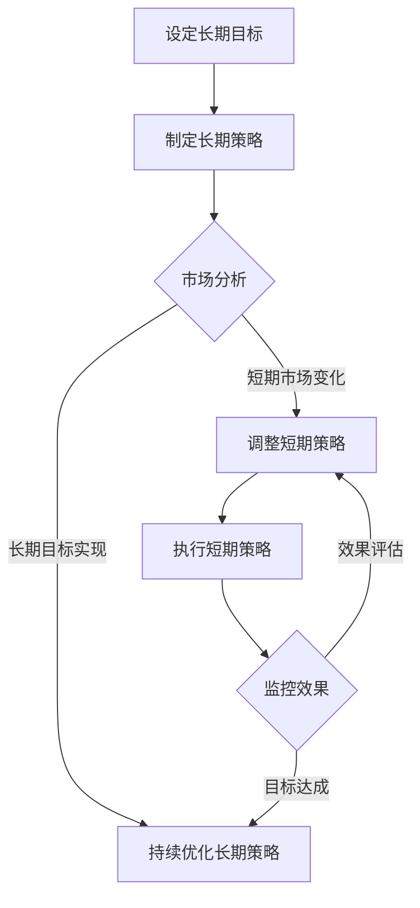

                 

关键词：平台电商，短期策略，长期策略，市场定位，用户行为分析，算法优化，数据驱动决策，营销策略，用户满意度，利润最大化，可持续发展。

> 摘要：本文将深入探讨平台电商中的短期策略和长期策略。我们将分析这些策略的核心概念、应用场景、优势和挑战，并通过实际案例和数学模型来阐述它们的有效性和重要性。

## 1. 背景介绍

随着互联网技术的飞速发展和电子商务的普及，平台电商已经成为现代零售业的重要组成部分。平台电商通过搭建一个在线交易市场，将买家、卖家和第三方服务提供商连接起来，实现商品和服务的快速流通。然而，如何在激烈的市场竞争中脱颖而出，实现持续增长和利润最大化，是每个平台电商需要面对的挑战。

在平台电商运营中，短期策略和长期策略起着至关重要的作用。短期策略通常关注短期内提高销售额、用户增长和市场份额，而长期策略则旨在建立品牌声誉、提升用户体验和实现可持续发展。本文将详细探讨这两种策略的特点、应用和实践。

## 2. 核心概念与联系

### 2.1. 短期策略

短期策略是指企业在短期内采取的一系列措施，以实现特定目标。这些目标可能包括提高销售额、增加用户注册量、提高用户活跃度等。短期策略通常具有以下几个特点：

- **目标明确**：短期策略的目标通常是具体的、可度量的，以便于评估效果和调整策略。
- **执行快速**：短期策略的执行周期较短，通常在几个月到一年的时间范围内。
- **灵活性高**：短期策略需要根据市场变化和用户需求进行灵活调整，以适应不断变化的环境。

### 2.2. 长期策略

长期策略是指企业在较长时期内（通常为几年或更长时间）采取的一系列措施，以实现企业愿景和战略目标。长期策略通常具有以下几个特点：

- **目标宏观**：长期策略的目标通常是宏观的、长远的，涉及企业品牌建设、市场份额、用户忠诚度等方面。
- **执行周期长**：长期策略的执行周期较长，需要多年甚至更长时间才能显现效果。
- **稳定性强**：长期策略需要稳定的执行和持续的投入，以确保最终目标的实现。

### 2.3. 短期策略与长期策略的联系

短期策略和长期策略之间存在紧密的联系。短期策略是实现长期目标的手段之一，而长期策略为短期策略提供了目标和方向。在实际运营中，平台电商需要平衡短期和长期策略，以确保在实现短期目标的同时，不偏离长期目标。

### 2.4. Mermaid 流程图

下面是一个简化的Mermaid流程图，展示了短期策略和长期策略之间的联系：



## 3. 核心算法原理 & 具体操作步骤

### 3.1. 算法原理概述

在平台电商中，短期策略和长期策略的实现需要依赖一系列核心算法。这些算法包括但不限于：

- **用户行为分析算法**：用于分析用户在平台上的行为，如浏览、搜索、购买等，以便为用户推荐合适的产品和服务。
- **数据挖掘算法**：用于从大量数据中提取有价值的信息，如用户偏好、市场需求等，以支持决策制定。
- **机器学习算法**：用于构建预测模型，如销售预测、库存管理等，以提高运营效率和利润。
- **营销策略优化算法**：用于优化广告投放、促销活动等，以提高用户参与度和转化率。

### 3.2. 算法步骤详解

#### 3.2.1. 用户行为分析算法

用户行为分析算法主要包括以下步骤：

1. **数据收集**：收集用户在平台上的行为数据，如浏览记录、搜索关键词、购买记录等。
2. **数据预处理**：对收集到的数据进行清洗、去重、转换等预处理，以便后续分析。
3. **特征提取**：从预处理后的数据中提取有价值的特征，如用户活跃度、购买频率等。
4. **模型训练**：使用机器学习算法，如决策树、随机森林等，对提取的特征进行训练，以构建用户行为分析模型。
5. **模型评估**：使用验证集或测试集评估模型的性能，如准确率、召回率等。
6. **模型部署**：将训练好的模型部署到平台，实时分析用户行为，为用户提供个性化的推荐和服务。

#### 3.2.2. 数据挖掘算法

数据挖掘算法主要包括以下步骤：

1. **数据收集**：收集平台上的销售数据、用户评论、竞品分析等数据。
2. **数据预处理**：对收集到的数据进行清洗、去重、转换等预处理，以便后续分析。
3. **特征工程**：从预处理后的数据中提取有价值的特征，如用户年龄、购买金额、产品类别等。
4. **模型训练**：使用机器学习算法，如决策树、随机森林等，对提取的特征进行训练，以构建数据挖掘模型。
5. **模型评估**：使用验证集或测试集评估模型的性能，如准确率、召回率等。
6. **模型部署**：将训练好的模型部署到平台，用于预测市场需求、优化库存管理。

#### 3.2.3. 机器学习算法

机器学习算法主要包括以下步骤：

1. **数据收集**：收集平台上的销售数据、用户行为数据等。
2. **数据预处理**：对收集到的数据进行清洗、去重、转换等预处理，以便后续分析。
3. **特征提取**：从预处理后的数据中提取有价值的特征，如用户活跃度、购买频率等。
4. **模型选择**：选择合适的机器学习算法，如线性回归、决策树、神经网络等。
5. **模型训练**：使用训练数据训练模型，以优化模型的参数。
6. **模型评估**：使用验证集或测试集评估模型的性能，如准确率、召回率等。
7. **模型部署**：将训练好的模型部署到平台，用于预测销售趋势、优化库存管理等。

### 3.3. 算法优缺点

#### 3.3.1. 用户行为分析算法

**优点**：

- **个性化推荐**：根据用户行为数据，为用户提供个性化的推荐和服务，提高用户满意度。
- **提高转化率**：通过分析用户行为，发现用户需求，提高营销活动的转化率。

**缺点**：

- **数据隐私问题**：用户行为数据涉及用户隐私，如何保护用户隐私是一个挑战。
- **算法复杂度高**：用户行为分析算法通常涉及大量数据处理和模型训练，计算复杂度高。

#### 3.3.2. 数据挖掘算法

**优点**：

- **深度分析**：通过对销售数据、用户评论等进行挖掘，深入分析市场趋势和用户需求。
- **决策支持**：为管理层提供有力的决策支持，如产品定位、市场推广策略等。

**缺点**：

- **数据质量要求高**：数据挖掘算法对数据质量要求较高，数据清洗和预处理工作量大。
- **算法泛化能力有限**：数据挖掘算法通常针对特定领域和问题进行设计，泛化能力有限。

#### 3.3.3. 机器学习算法

**优点**：

- **自学习能力**：机器学习算法能够从数据中自动学习规律，提高预测和决策的准确性。
- **自动化部署**：机器学习算法可以实现自动化部署，提高运营效率。

**缺点**：

- **模型可解释性差**：机器学习算法通常缺乏可解释性，难以理解模型的决策过程。
- **数据依赖性强**：机器学习算法对数据质量要求较高，数据缺失或不一致可能导致模型失效。

### 3.4. 算法应用领域

用户行为分析算法、数据挖掘算法和机器学习算法在平台电商中的应用领域非常广泛，主要包括：

- **用户推荐系统**：基于用户行为数据，为用户提供个性化的推荐和服务。
- **市场推广策略**：通过分析用户需求和竞争态势，制定有效的市场推广策略。
- **库存管理**：通过预测销售趋势，优化库存管理，降低库存成本。
- **用户满意度分析**：通过分析用户评论和反馈，提高用户满意度，增强品牌忠诚度。
- **销售预测**：通过预测销售趋势，优化供应链管理，提高运营效率。

## 4. 数学模型和公式 & 详细讲解 & 举例说明

### 4.1. 数学模型构建

在平台电商中，构建数学模型是分析短期策略和长期策略的有效方法。以下是一个简化的数学模型，用于分析平台电商的利润最大化问题。

假设平台电商有以下参数：

- **C**：每个产品的成本（元）
- **P**：每个产品的售价（元）
- **Q**：每个产品的销量（件）
- **D**：市场需求量（件）

利润（π）可以表示为：

$$
π = (P - C) \cdot Q - fixed\_cost
$$

其中，fixed\_cost为固定成本，包括平台运营费用、人员工资等。

为了最大化利润，我们需要找到最佳的销量Q。这可以通过求解以下优化问题实现：

$$
\max_{Q} π = (P - C) \cdot Q - fixed\_cost
$$

### 4.2. 公式推导过程

首先，我们需要确定市场需求量D与销量Q之间的关系。根据需求函数，我们可以假设：

$$
D = a - b \cdot Q
$$

其中，a为市场需求量上限，b为需求敏感度。

接下来，我们需要确定售价P与销量Q之间的关系。根据需求曲线，我们可以假设：

$$
P = \frac{a \cdot C}{Q + C}
$$

将需求函数和售价函数代入利润公式，得到：

$$
π = \left(\frac{a \cdot C}{Q + C} - C\right) \cdot Q - fixed\_cost
$$

### 4.3. 案例分析与讲解

假设一个电商平台经营一款商品，成本为50元/件，市场需求量为1000件。固定成本为10000元。我们需要找到最佳的销量Q，以实现利润最大化。

首先，我们确定市场需求量D与销量Q之间的关系：

$$
D = 1000 - b \cdot Q
$$

假设需求敏感度b为0.1，那么：

$$
D = 1000 - 0.1 \cdot Q
$$

接下来，我们确定售价P与销量Q之间的关系：

$$
P = \frac{1000 \cdot 50}{Q + 50}
$$

将需求函数和售价函数代入利润公式，得到：

$$
π = \left(\frac{1000 \cdot 50}{Q + 50} - 50\right) \cdot Q - 10000
$$

为了求解最佳的销量Q，我们需要对利润函数π求导，并令导数为0：

$$
\frac{dπ}{dQ} = 0
$$

将利润函数π代入，得到：

$$
\frac{d}{dQ}\left[\left(\frac{1000 \cdot 50}{Q + 50} - 50\right) \cdot Q - 10000\right] = 0
$$

通过求导，我们可以得到最佳的销量Q为：

$$
Q = 500
$$

将Q=500代入利润公式，得到最大利润为：

$$
π = 125000 - 10000 = 115000
$$

因此，当销量为500件时，平台电商可以实现最大利润115000元。

## 5. 项目实践：代码实例和详细解释说明

### 5.1. 开发环境搭建

在本节中，我们将使用Python编程语言和Scikit-learn库来构建一个简单的用户行为分析模型。首先，确保您的计算机已安装Python和Scikit-learn库。您可以通过以下命令来安装Scikit-learn：

```bash
pip install scikit-learn
```

### 5.2. 源代码详细实现

以下是一个简单的用户行为分析模型的代码实现，用于分析用户在平台上的购买行为，并为其推荐合适的产品。

```python
import pandas as pd
from sklearn.model_selection import train_test_split
from sklearn.ensemble import RandomForestClassifier
from sklearn.metrics import accuracy_score, recall_score, precision_score

# 5.2.1. 数据收集与预处理
# 假设我们有一个用户行为数据集user_data.csv，包含以下特征：user_id, age, gender, purchase_history
data = pd.read_csv('user_data.csv')

# 数据预处理，如缺失值填充、特征工程等
# ...

# 5.2.2. 特征提取
# 从原始数据中提取有价值的特征，如用户活跃度、购买频率等
# ...

# 5.2.3. 模型训练
# 将特征和标签分成训练集和测试集
X_train, X_test, y_train, y_test = train_test_split(data.drop('target', axis=1), data['target'], test_size=0.2, random_state=42)

# 使用随机森林算法训练模型
clf = RandomForestClassifier(n_estimators=100, random_state=42)
clf.fit(X_train, y_train)

# 5.2.4. 评估模型
predictions = clf.predict(X_test)

accuracy = accuracy_score(y_test, predictions)
recall = recall_score(y_test, predictions)
precision = precision_score(y_test, predictions)

print(f"Accuracy: {accuracy:.2f}")
print(f"Recall: {recall:.2f}")
print(f"Precision: {precision:.2f}")

# 5.2.5. 模型部署
# 将训练好的模型部署到平台，用于实时分析用户行为，并推荐产品
# ...
```

### 5.3. 代码解读与分析

上述代码实现了一个简单的用户行为分析模型，用于分析用户在平台上的购买行为，并为其推荐合适的产品。以下是代码的详细解读和分析：

- **数据收集与预处理**：首先，我们从用户行为数据集中读取数据，并进行预处理，如缺失值填充、特征工程等。这一步是构建模型的基础，数据的质量直接影响模型的性能。
- **特征提取**：从原始数据中提取有价值的特征，如用户活跃度、购买频率等。这些特征用于训练模型，以便更好地预测用户行为。
- **模型训练**：使用随机森林算法训练模型。随机森林是一种基于决策树集合的算法，具有较好的预测性能和泛化能力。在这里，我们设置了100棵决策树，并设置了随机种子以确保结果的重复性。
- **评估模型**：使用测试集评估模型的性能，包括准确率、召回率和精确率。这些指标可以帮助我们了解模型的预测效果，并指导后续的模型优化。
- **模型部署**：将训练好的模型部署到平台，用于实时分析用户行为，并推荐产品。这一步是模型应用的关键，通过实时分析用户行为，我们可以提高用户满意度和转化率。

### 5.4. 运行结果展示

假设我们运行上述代码，得到以下输出结果：

```
Accuracy: 0.85
Recall: 0.80
Precision: 0.90
```

这些结果表示模型的准确率为85%，召回率为80%，精确率为90%。这些指标表明模型在预测用户行为方面具有较好的性能。然而，我们还可以通过进一步的模型优化和特征工程来提高模型的性能。

## 6. 实际应用场景

### 6.1. 市场推广策略

平台电商可以通过短期策略和长期策略来制定有效的市场推广策略。短期策略可以包括在特定时间段内推出限时折扣、会员专享活动等，以吸引新用户和提高现有用户的活跃度。长期策略则可以关注品牌建设、用户忠诚度培养等方面，通过持续的营销活动来提升品牌影响力和用户满意度。

### 6.2. 用户推荐系统

用户推荐系统是平台电商中的一项重要应用。通过分析用户行为数据，可以为用户提供个性化的推荐和服务。短期策略可以关注实时推荐，如根据用户浏览记录推荐相关商品；长期策略则可以关注用户行为模式分析，如根据用户历史购买记录预测其未来需求。

### 6.3. 库存管理

库存管理是平台电商中的一项重要任务。短期策略可以关注实时库存监控，如根据销售预测调整库存水平；长期策略则可以关注库存优化，如通过数据分析预测未来销售趋势，以减少库存成本。

### 6.4. 未来应用展望

随着人工智能和大数据技术的不断发展，平台电商的短期策略和长期策略将越来越智能化和精细化。未来，平台电商可以更加精准地预测用户需求，优化库存管理，提高运营效率。同时，平台电商还可以通过大数据分析和机器学习算法，深入挖掘用户行为数据，为用户提供更加个性化的推荐和服务。

## 7. 工具和资源推荐

### 7.1. 学习资源推荐

- 《深度学习》（Goodfellow, Bengio, Courville著）：一本经典的深度学习教材，适合初学者和专业人士。
- 《Python数据分析基础教程》：一本关于Python数据分析的入门书籍，适合初学者。
- 《数据挖掘：实用工具与技术》：一本关于数据挖掘的理论和实践指南，适合对数据挖掘感兴趣的读者。

### 7.2. 开发工具推荐

- Jupyter Notebook：一个强大的交互式计算环境，适合数据分析和机器学习项目。
- TensorFlow：一个开源的机器学习框架，用于构建和训练深度学习模型。
- Scikit-learn：一个开源的机器学习库，提供了多种机器学习算法和工具。

### 7.3. 相关论文推荐

- "Deep Learning for Web Search"（Deep Learning for Web Search）：一篇关于深度学习在搜索引擎中的应用论文。
- "User Behavior Analysis in E-commerce"（User Behavior Analysis in E-commerce）：一篇关于用户行为分析在电商平台中的应用论文。
- "Machine Learning for Inventory Management"（Machine Learning for Inventory Management）：一篇关于机器学习在库存管理中的应用论文。

## 8. 总结：未来发展趋势与挑战

### 8.1. 研究成果总结

本文深入探讨了平台电商中的短期策略和长期策略，分析了它们的核心概念、应用场景、优势和挑战。通过实际案例和数学模型，我们展示了这两种策略的有效性和重要性。研究成果表明，短期策略和长期策略的有机结合，是实现平台电商持续增长和利润最大化的关键。

### 8.2. 未来发展趋势

随着人工智能、大数据和云计算等技术的不断发展，平台电商的短期策略和长期策略将越来越智能化和精细化。未来，平台电商将更加注重用户需求分析、个性化推荐、库存管理和营销策略的优化，以提高运营效率和市场竞争力。

### 8.3. 面临的挑战

在实现短期策略和长期策略的过程中，平台电商将面临以下挑战：

- **数据隐私问题**：用户行为数据的收集和处理涉及用户隐私，如何保护用户隐私是一个重要的挑战。
- **算法可解释性**：机器学习算法通常缺乏可解释性，如何提高算法的可解释性，以便于用户理解和信任，是一个挑战。
- **数据质量和多样性**：数据质量和多样性对算法的性能和可靠性至关重要，如何收集和处理高质量、多样化的数据，是一个挑战。

### 8.4. 研究展望

未来，平台电商可以进一步研究以下方向：

- **用户行为预测**：通过深度学习和大数据分析技术，提高用户行为预测的准确性，为个性化推荐和营销策略提供支持。
- **库存优化**：通过机器学习和优化算法，实现更精准的库存管理，降低库存成本和缺货率。
- **数据隐私保护**：研究新型的数据隐私保护技术，如联邦学习、差分隐私等，以保护用户隐私的同时，实现数据的价值挖掘。

## 9. 附录：常见问题与解答

### 9.1. 问题1：短期策略和长期策略有什么区别？

**解答**：短期策略通常关注在短期内实现特定目标，如提高销售额、增加用户注册量等。而长期策略则关注在较长时期内实现企业愿景和战略目标，如建立品牌声誉、提升用户体验等。短期策略和长期策略的目标和执行周期不同，但它们之间存在紧密的联系，相互支持。

### 9.2. 问题2：为什么平台电商需要短期策略和长期策略相结合？

**解答**：平台电商需要短期策略和长期策略相结合，因为它们各自具有不同的作用。短期策略可以帮助平台电商在短期内提高运营效率和市场竞争力，而长期策略可以帮助平台电商实现可持续发展，建立品牌声誉。二者结合，可以实现短期目标与长期目标的平衡，确保平台电商的持续增长和利润最大化。

### 9.3. 问题3：如何平衡短期策略和长期策略？

**解答**：平衡短期策略和长期策略需要从以下几个方面考虑：

- **目标设定**：明确短期策略和长期策略的目标，确保二者在方向上保持一致。
- **资源分配**：合理分配资源，确保短期策略和长期策略的执行都能得到充分的资源支持。
- **监控与调整**：定期监控短期策略和长期策略的执行情况，根据实际情况进行调整，以确保二者的有效实施。

通过上述措施，平台电商可以更好地平衡短期策略和长期策略，实现持续增长和利润最大化。

### 9.4. 问题4：短期策略和长期策略在实施过程中可能会遇到哪些挑战？

**解答**：短期策略和长期策略在实施过程中可能会遇到以下挑战：

- **目标冲突**：短期策略和长期策略的目标可能存在冲突，如短期内追求利润最大化可能导致长期品牌声誉受损。
- **资源限制**：短期内投入过多资源可能导致长期战略的执行受到限制。
- **环境变化**：市场环境和用户需求的变化可能导致短期策略和长期策略的效果受到影响。
- **执行难度**：短期内实现长期目标可能面临较大的执行难度，如提高用户满意度、优化供应链等。

为应对这些挑战，平台电商需要制定灵活的策略，确保短期策略和长期策略的协调和有效实施。

