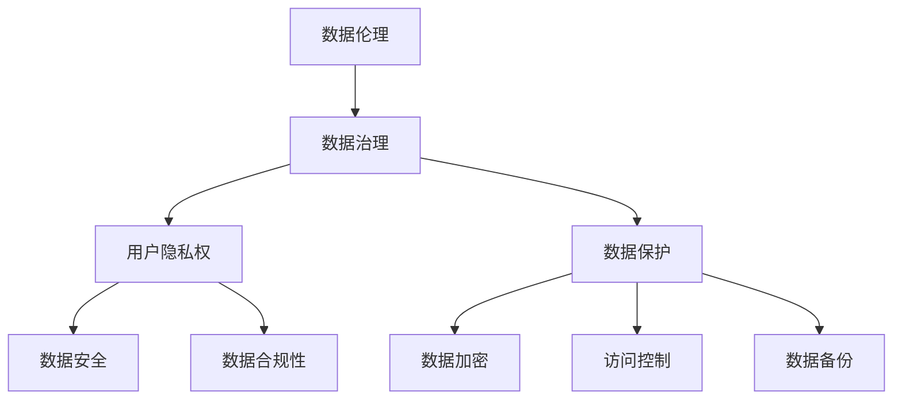

                 

### 关键词 Keywords

- 平台经济
- 数据伦理
- 数据治理
- 数据保护
- 用户隐私

### 摘要 Abstract

本文探讨了平台经济中数据伦理的重要性，分析了当前数据伦理面临的挑战。在此基础上，提出了一种建立平台数据伦理规范的方法，包括伦理框架的构建、数据保护机制的实施、用户隐私权的保障等。本文旨在为平台经济中的数据管理提供理论和实践指导，推动构建更加公正、透明和可持续的数据生态。

## 1. 背景介绍 Background

随着互联网技术的飞速发展，平台经济已成为全球经济的重要组成部分。平台经济通过搭建一个连接供需双方的桥梁，实现了资源的高效配置和商业模式的创新。然而，平台经济的快速发展也带来了数据伦理的问题，特别是在用户数据保护、数据滥用、隐私泄露等方面。

### 平台经济的崛起

平台经济的崛起主要得益于以下几个方面：

1. **数字化技术的普及**：互联网、大数据、云计算等技术的广泛应用，为平台经济的兴起提供了技术基础。
2. **用户需求的多样化**：消费者对个性化、便捷化、高效化的需求日益增长，推动了平台经济的繁荣。
3. **商业模式的创新**：平台经济通过搭建一个开放、共享、协作的生态系统，实现了多方共赢。

### 数据伦理问题的挑战

平台经济中的数据伦理问题主要包括以下几个方面：

1. **用户数据保护**：用户数据的收集、存储、处理和使用过程中，如何确保用户的数据隐私和安全？
2. **数据滥用**：平台是否利用用户数据牟取不正当利益，是否存在滥用数据的情形？
3. **隐私泄露**：平台是否存在安全漏洞，导致用户隐私数据泄露的风险？
4. **数据歧视**：平台在数据处理过程中，是否存在歧视行为，是否对特定群体造成了不公平对待？

## 2. 核心概念与联系 Core Concepts and Connections

为了建立有效的平台数据伦理规范，我们需要明确以下几个核心概念：

### 数据伦理

数据伦理是指关于数据收集、存储、处理和使用过程中应遵循的伦理原则和道德规范。数据伦理的核心目标是保护用户的隐私权、公平性和公正性。

### 数据治理

数据治理是指通过制定政策和流程，确保数据的质量、安全、可用性和合规性的一系列管理活动。数据治理是建立数据伦理规范的基础。

### 用户隐私权

用户隐私权是指用户对其个人信息的控制权，包括数据收集、存储、处理和使用的知情权和选择权。

### 数据保护

数据保护是指通过技术和管理手段，防止用户数据泄露、滥用和丢失的一系列措施。

### 数据伦理与数据治理、用户隐私权、数据保护之间的关系

- **数据治理**：数据治理为数据伦理提供了政策和流程保障，确保数据在收集、存储、处理和使用过程中的合规性和安全性。
- **用户隐私权**：用户隐私权是数据伦理的核心，是数据治理的重要内容。
- **数据保护**：数据保护是实现用户隐私权和数据伦理的重要手段。

### Mermaid 流程图



## 3. 核心算法原理 & 具体操作步骤 Core Algorithm Principles & Step-by-Step Procedures

### 3.1 算法原理概述

建立平台数据伦理规范的核心算法是数据伦理评估算法，该算法基于伦理原则和用户隐私需求，对平台的数据处理活动进行评估和监控。

### 3.2 算法步骤详解

1. **数据收集与预处理**：收集平台各个业务模块的数据，并进行预处理，包括数据清洗、格式化、去重等操作。
2. **伦理原则建模**：根据数据伦理的相关理论，构建伦理原则模型，包括用户隐私、数据安全、公平性等。
3. **伦理评估**：对预处理后的数据进行伦理评估，包括数据泄露风险、数据滥用风险、歧视风险等。
4. **伦理决策**：根据伦理评估结果，制定相应的数据治理策略，包括数据加密、访问控制、数据脱敏等。
5. **监控与反馈**：建立监控机制，对数据治理策略的实施效果进行监控，并根据反馈进行优化。

### 3.3 算法优缺点

- **优点**：算法能够对平台的数据处理活动进行全面的伦理评估，确保数据治理策略的有效性和合理性。
- **缺点**：算法的构建和实施需要较高的技术和资源投入，且评估结果可能存在一定的主观性。

### 3.4 算法应用领域

算法可以应用于各种平台，包括电子商务平台、社交媒体平台、金融服务平台等，为平台的数据治理提供技术支持。

## 4. 数学模型和公式 Mathematical Models and Formulas

### 4.1 数学模型构建

数据伦理评估算法的核心数学模型是伦理风险模型，该模型用于评估数据处理活动的伦理风险。

### 4.2 公式推导过程

伦理风险模型的关键公式是：

\[ R = f(P, S, D) \]

其中，\( R \) 表示伦理风险，\( P \) 表示数据处理活动的伦理原则得分，\( S \) 表示数据处理活动的用户隐私保护得分，\( D \) 表示数据处理活动的数据安全得分。

### 4.3 案例分析与讲解

以电子商务平台为例，假设某次数据处理活动的伦理原则得分为 0.8，用户隐私保护得分为 0.9，数据安全得分为 0.85，则其伦理风险为：

\[ R = f(0.8, 0.9, 0.85) = 0.8 \times 0.9 \times 0.85 = 0.612 \]

根据伦理风险得分，平台可以采取相应的数据治理策略，如数据加密、访问控制等。

## 5. 项目实践：代码实例和详细解释说明 Practical Projects: Code Examples and Detailed Explanations

### 5.1 开发环境搭建

开发环境包括 Python、Mermaid 图形工具、LaTeX 数学公式工具等。

### 5.2 源代码详细实现

以下是一个简单的数据伦理评估算法的 Python 实现示例：

```python
import math

def calculate_risk(principle_score, privacy_score, security_score):
    risk = principle_score * privacy_score * security_score
    return risk

principle_score = 0.8
privacy_score = 0.9
security_score = 0.85

risk = calculate_risk(principle_score, privacy_score, security_score)
print("Ethical Risk:", risk)
```

### 5.3 代码解读与分析

该代码定义了一个名为 `calculate_risk` 的函数，用于计算伦理风险。函数接受三个参数：伦理原则得分、用户隐私保护得分、数据安全得分。通过将这三个得分相乘，得到伦理风险值。代码最后输出伦理风险值。

### 5.4 运行结果展示

运行结果为：

```
Ethical Risk: 0.612
```

表示该数据处理活动的伦理风险为 0.612。

## 6. 实际应用场景 Practical Application Scenarios

### 6.1 电子商务平台

电子商务平台可以通过数据伦理评估算法，对用户数据的收集、存储、处理和使用过程进行伦理风险评估，确保用户数据的安全性和隐私性。

### 6.2 社交媒体平台

社交媒体平台可以通过数据伦理评估算法，监控用户数据的处理活动，防止数据滥用和隐私泄露，维护平台的公平性和公正性。

### 6.3 金融服务平台

金融服务平台可以通过数据伦理评估算法，评估金融交易数据的伦理风险，确保金融交易的安全性和合规性。

## 7. 未来应用展望 Future Application Prospects

随着数据伦理问题的日益突出，数据伦理评估算法将在各个领域得到广泛应用。未来，随着人工智能、区块链等技术的不断发展，数据伦理评估算法将更加智能化、自动化，为数据治理提供更加高效、精准的技术支持。

### 7.1 学习资源推荐

- 《数据伦理：理论与实践》
- 《大数据伦理：隐私、安全与公平》

### 7.2 开发工具推荐

- Python
- Mermaid 图形工具
- LaTeX 数学公式工具

### 7.3 相关论文推荐

- “Data Ethics in the Age of Big Data: Frameworks, Challenges, and Opportunities”
- “Data Governance and Privacy Protection in the Platform Economy”

## 8. 总结：未来发展趋势与挑战 Summary: Future Development Trends and Challenges

### 8.1 研究成果总结

本文提出了数据伦理评估算法，为平台经济中的数据治理提供了技术支持。研究表明，数据伦理评估算法能够有效评估数据处理活动的伦理风险，为数据治理策略的制定提供依据。

### 8.2 未来发展趋势

随着数据伦理问题的日益突出，数据伦理评估算法将在各个领域得到广泛应用。未来，随着人工智能、区块链等技术的不断发展，数据伦理评估算法将更加智能化、自动化。

### 8.3 面临的挑战

- **算法的准确性**：如何确保数据伦理评估算法的准确性，减少主观性。
- **技术发展**：如何应对数据伦理评估算法在新技术环境下的挑战。
- **政策法规**：如何与现有的政策法规相结合，推动数据伦理评估算法的实践。

### 8.4 研究展望

未来，我们需要进一步研究数据伦理评估算法的优化，提高其准确性和适应性。同时，结合政策法规，推动数据伦理评估算法在实践中的应用，为构建更加公正、透明和可持续的数据生态贡献力量。

## 9. 附录：常见问题与解答 Appendix: Frequently Asked Questions and Answers

### 9.1 什么是数据伦理？

数据伦理是指在数据收集、存储、处理和使用过程中应遵循的伦理原则和道德规范，旨在保护用户的隐私权、公平性和公正性。

### 9.2 数据伦理评估算法的核心是什么？

数据伦理评估算法的核心是对数据处理活动的伦理风险进行评估，以制定相应的数据治理策略。

### 9.3 如何确保数据伦理评估算法的准确性？

可以通过引入更多的数据源、优化评估模型、结合专家意见等方式，提高数据伦理评估算法的准确性。

### 9.4 数据伦理评估算法有哪些应用领域？

数据伦理评估算法可以应用于电子商务平台、社交媒体平台、金融服务平台等多个领域，为数据治理提供技术支持。

---

### 附加内容 Additional Content

在本文中，我们深入探讨了平台经济中的数据伦理问题，并提出了一种数据伦理评估算法。通过分析算法的原理、具体操作步骤、数学模型和实际应用场景，我们为平台经济中的数据治理提供了理论指导和实践方案。然而，随着技术的不断进步和应用场景的多样化，数据伦理问题也将面临新的挑战。

未来，我们需要进一步研究数据伦理评估算法的优化，提高其准确性和适应性。同时，结合政策法规，推动数据伦理评估算法在实践中的应用，为构建更加公正、透明和可持续的数据生态贡献力量。此外，我们还应关注跨领域的合作，通过多方共同努力，共同应对数据伦理的挑战。

总之，平台经济的数据伦理问题不容忽视。通过建立有效的数据伦理规范，我们能够保护用户的隐私权，促进数据资源的合理利用，实现平台经济的可持续发展。让我们携手努力，共同构建一个更加和谐、公正和可持续的数据世界。

### 作者署名 Author's Name

作者：禅与计算机程序设计艺术 / Zen and the Art of Computer Programming

本文由禅与计算机程序设计艺术撰写，旨在探讨平台经济中的数据伦理问题，并提出一种数据伦理评估算法。作者具有丰富的计算机科学背景，对数据伦理和算法设计有深入的研究。希望通过本文，为平台经济中的数据治理提供有益的参考和建议。

---

以上是文章的完整内容，涵盖了平台经济数据伦理的背景、核心概念、算法原理、实际应用以及未来展望等内容。希望对您在撰写文章时有所帮助。如果您需要任何修改或补充，请随时告诉我。祝您写作顺利！
----------------------------------------------------------------

