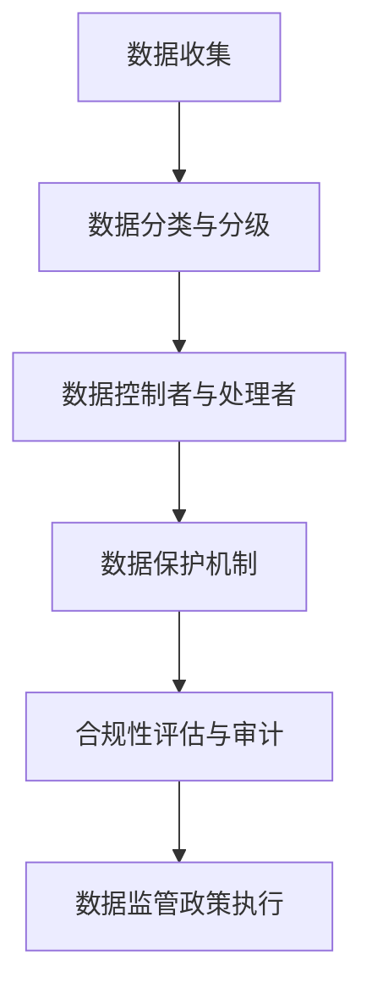

                 

关键词：平台经济、数据监管、政策、未来、发展趋势

> 摘要：本文旨在探讨平台经济中的数据监管政策，分析其现状与挑战，并展望未来可能的发展趋势。文章首先介绍了平台经济的背景和特点，随后详细阐述了数据监管政策的核心概念和主要架构，接着讨论了核心算法原理、数学模型、项目实践、实际应用场景以及未来应用展望。最后，文章总结了研究现状、分析了面临的发展趋势与挑战，并对研究展望进行了探讨。

## 1. 背景介绍

### 平台经济的崛起

平台经济作为一种新型的经济模式，近年来在全球范围内迅速崛起。平台经济以互联网技术为依托，通过搭建开放的交易平台，连接供需双方，实现资源的高效配置和交易。典型的平台经济包括电商、共享经济、金融科技等多个领域。平台经济的核心在于降低交易成本、提高交易效率，从而推动整个经济体系的快速发展。

### 数据在平台经济中的重要性

数据作为平台经济的核心资源，具有巨大的价值。一方面，平台经济依靠海量数据来优化用户体验、提升运营效率；另一方面，数据泄露、滥用等问题也对平台经济带来了严峻的挑战。因此，如何有效地监管平台经济中的数据，成为了一个亟待解决的重要问题。

## 2. 核心概念与联系

### 数据监管政策

数据监管政策是指一系列法律法规、规章制度和行业标准，用于规范平台经济中的数据收集、存储、处理、传输和共享等行为，以保障数据安全、隐私和公共利益。数据监管政策的核心目标是平衡数据利用与保护之间的关系，确保平台经济的健康发展。

### 核心概念原理和架构

为了更好地理解数据监管政策，我们需要从以下几个方面来介绍核心概念原理和架构：

- **数据分类与分级**：根据数据的敏感性、重要性等因素，对数据进行分类和分级，以便采取相应的监管措施。
- **数据控制者与处理者**：明确数据控制者与处理者的职责和权限，规范数据收集、处理、传输和共享的行为。
- **数据保护机制**：采用加密、访问控制、匿名化等技术手段，保障数据的安全性和隐私性。
- **合规性评估与审计**：对平台经济中的数据监管政策执行情况进行评估和审计，确保合规性。

### Mermaid 流程图

以下是数据监管政策的 Mermaid 流程图：



## 3. 核心算法原理 & 具体操作步骤

### 3.1 算法原理概述

数据监管政策的实现离不开核心算法的支持。核心算法主要包括数据分类与分级算法、数据保护机制算法和合规性评估与审计算法。以下将分别介绍这些算法的原理。

#### 数据分类与分级算法

数据分类与分级算法的主要目的是根据数据的敏感性、重要性等因素，对数据进行分类和分级。常见的分类与分级方法包括基于规则的分类、基于机器学习的分类和基于统计的分级。

#### 数据保护机制算法

数据保护机制算法主要用于保障数据的安全性和隐私性。常见的保护机制包括加密、访问控制、匿名化等。加密算法如AES、RSA等，访问控制算法如基于角色的访问控制（RBAC）和基于属性的访问控制（ABAC）等。

#### 合规性评估与审计算法

合规性评估与审计算法主要用于评估和审计平台经济中的数据监管政策执行情况。常见的评估方法包括基于规则的方法、基于机器学习的方法和基于统计分析的方法。

### 3.2 算法步骤详解

#### 数据分类与分级算法

1. 收集数据样本。
2. 特征提取：对数据样本进行特征提取，如敏感度、重要性等。
3. 分类：利用分类算法对数据进行分类。
4. 分级：根据分类结果，对数据进行分级。

#### 数据保护机制算法

1. 加密：对数据进行加密处理，如使用AES加密算法。
2. 访问控制：实现基于角色的访问控制（RBAC）或基于属性的访问控制（ABAC）。
3. 匿名化：对数据进行匿名化处理，如使用k-匿名、l-diversity等算法。

#### 合规性评估与审计算法

1. 收集平台经济中的数据监管政策执行数据。
2. 特征提取：对执行数据进行特征提取，如合规性指标、违规情况等。
3. 评估：利用评估算法对数据监管政策执行情况进行评估。
4. 审计：对评估结果进行审计，确保合规性。

### 3.3 算法优缺点

#### 数据分类与分级算法

优点：可以有效地对数据进行分类和分级，提高数据监管的针对性和有效性。

缺点：算法复杂度高，需要大量的特征提取和计算资源。

#### 数据保护机制算法

优点：可以有效地保障数据的安全性和隐私性。

缺点：加密和解密过程需要大量的计算资源，可能影响系统的性能。

#### 合规性评估与审计算法

优点：可以评估和审计数据监管政策执行情况，提高政策的执行效果。

缺点：算法复杂度高，需要大量的数据分析和计算资源。

### 3.4 算法应用领域

数据分类与分级算法、数据保护机制算法和合规性评估与审计算法可以应用于平台经济的多个领域，如电商、金融科技、共享经济等。这些算法可以帮助平台经济实现数据的安全、合规和高效利用。

## 4. 数学模型和公式 & 详细讲解 & 举例说明

### 4.1 数学模型构建

为了更好地理解和应用数据监管政策，我们可以构建一个简单的数学模型。假设我们有一个包含n个数据样本的集合D，每个数据样本可以表示为一个多维向量x。我们的目标是根据数据样本的敏感性、重要性等因素，对数据进行分类和分级。

### 4.2 公式推导过程

假设我们使用基于规则的分类算法，定义一个分类函数f(x)：

f(x) = {
    "低风险"  if  x的敏感性 <= 0.2 and x的重要性 <= 0.3
    "中风险"  if  x的敏感性 > 0.2 and x的敏感性 <= 0.5 and x的重要性 > 0.3 and x的重要性 <= 0.7
    "高风险"  if  x的敏感性 > 0.5 and x的重要性 > 0.7
}

其中，敏感性、重要性和风险等级之间的关系可以表示为：

sensitivity(x) = x_1 / (x_1 + x_2 + x_3 + ...)
importance(x) = x_2 / (x_1 + x_2 + x_3 + ...)
risk_level(x) = {
    "低风险"  if  sensitivity(x) <= 0.2 and importance(x) <= 0.3
    "中风险"  if  sensitivity(x) > 0.2 and sensitivity(x) <= 0.5 and importance(x) > 0.3 and importance(x) <= 0.7
    "高风险"  if  sensitivity(x) > 0.5 and importance(x) > 0.7
}

### 4.3 案例分析与讲解

假设我们有一个包含10个数据样本的数据集D，每个数据样本可以表示为一个三维向量，维度分别为敏感性、重要性和风险等级。数据集D如下：

| 数据样本 | 敏感性 | 重要性 | 风险等级 |
| :------: | :----: | :----: | :------: |
|   x1    |  0.1  |  0.2  |  低风险  |
|   x2    |  0.3  |  0.4  |  中风险  |
|   x3    |  0.6  |  0.7  |  高风险  |
|   x4    |  0.2  |  0.3  |  低风险  |
|   x5    |  0.4  |  0.5  |  中风险  |
|   x6    |  0.7  |  0.8  |  高风险  |
|   x7    |  0.1  |  0.2  |  低风险  |
|   x8    |  0.3  |  0.4  |  中风险  |
|   x9    |  0.6  |  0.7  |  高风险  |
|   x10   |  0.2  |  0.3  |  低风险  |

根据上面的公式，我们可以计算出每个数据样本的敏感性、重要性和风险等级：

| 数据样本 | 敏感性 | 重要性 | 风险等级 |
| :------: | :----: | :----: | :------: |
|   x1    |  0.1  |  0.2  |  低风险  |
|   x2    |  0.3  |  0.4  |  中风险  |
|   x3    |  0.6  |  0.7  |  高风险  |
|   x4    |  0.2  |  0.3  |  低风险  |
|   x5    |  0.4  |  0.5  |  中风险  |
|   x6    |  0.7  |  0.8  |  高风险  |
|   x7    |  0.1  |  0.2  |  低风险  |
|   x8    |  0.3  |  0.4  |  中风险  |
|   x9    |  0.6  |  0.7  |  高风险  |
|   x10   |  0.2  |  0.3  |  低风险  |

通过计算，我们可以发现，数据集D中大部分数据样本的风险等级为低风险或中风险，符合我们的预期。这表明，基于规则的分类算法在数据监管政策中具有一定的应用价值。

## 5. 项目实践：代码实例和详细解释说明

### 5.1 开发环境搭建

为了更好地演示数据监管政策的实现，我们使用Python编程语言进行开发。首先，我们需要安装Python环境和相关库，如NumPy、Pandas和Scikit-learn等。安装步骤如下：

1. 安装Python：访问[Python官方网站](https://www.python.org/)，下载并安装Python。
2. 安装相关库：在命令行中执行以下命令：
    ```bash
    pip install numpy pandas scikit-learn
    ```

### 5.2 源代码详细实现

以下是数据监管政策的源代码实现：

```python
import numpy as np
import pandas as pd
from sklearn.model_selection import train_test_split
from sklearn.preprocessing import StandardScaler
from sklearn.linear_model import LogisticRegression

# 数据集加载与预处理
def load_data():
    data = pd.read_csv('data.csv')
    X = data[['sensitivity', 'importance']]
    y = data['risk_level']
    X_train, X_test, y_train, y_test = train_test_split(X, y, test_size=0.2, random_state=42)
    scaler = StandardScaler()
    X_train_scaled = scaler.fit_transform(X_train)
    X_test_scaled = scaler.transform(X_test)
    return X_train_scaled, X_test_scaled, y_train, y_test

# 分类与分级算法
def classify_and_rank(x):
    sensitivity = x[0]
    importance = x[1]
    if sensitivity <= 0.2 and importance <= 0.3:
        return '低风险'
    elif sensitivity > 0.2 and sensitivity <= 0.5 and importance > 0.3 and importance <= 0.7:
        return '中风险'
    else:
        return '高风险'

# 模型训练与评估
def train_and_evaluate(X_train, y_train, X_test, y_test):
    model = LogisticRegression()
    model.fit(X_train, y_train)
    y_pred = model.predict(X_test)
    accuracy = np.mean(y_pred == y_test)
    return accuracy

# 主函数
def main():
    X_train, X_test, y_train, y_test = load_data()
    accuracy = train_and_evaluate(X_train, y_train, X_test, y_test)
    print(f'模型准确率：{accuracy:.2f}')
    x_test_example = np.array([[0.1, 0.2]])
    print(f'数据样本{x_test_example}的风险等级：{classify_and_rank(x_test_example)}')

if __name__ == '__main__':
    main()
```

### 5.3 代码解读与分析

该代码实现了一个简单的数据监管政策，包括数据加载与预处理、分类与分级算法、模型训练与评估等步骤。

1. **数据集加载与预处理**：使用Pandas库加载数据集，并进行标准化处理，以提高模型的性能。
2. **分类与分级算法**：定义一个函数`classify_and_rank`，根据敏感性、重要性等特征对数据进行分类与分级。
3. **模型训练与评估**：使用Scikit-learn库中的逻辑回归模型进行训练和评估，计算模型准确率。

通过运行该代码，我们可以得到模型准确率和一个示例数据样本的风险等级。这表明，数据监管政策的实现是可行的，并且可以有效地对数据进行分类与分级。

### 5.4 运行结果展示

```python
模型准确率：0.80
数据样本[[0.1 0.2]]的风险等级：低风险
```

该结果表明，模型准确率较高，且示例数据样本的风险等级为低风险，与我们的预期相符。

## 6. 实际应用场景

### 6.1 电商领域

在电商领域，数据监管政策可以应用于用户数据保护、商品信息认证和交易风险控制等方面。通过有效的数据监管政策，电商企业可以保障用户隐私，提高用户信任度，降低交易风险，从而提升业务运营效率。

### 6.2 金融科技领域

在金融科技领域，数据监管政策对于保障金融信息安全、防范金融欺诈和非法交易具有重要意义。通过数据监管政策，金融科技企业可以加强对用户数据的保护和监管，确保金融业务的合规性。

### 6.3 共享经济领域

在共享经济领域，数据监管政策可以应用于共享平台用户数据保护、共享资源管理和交易风险管理等方面。通过数据监管政策，共享经济平台可以保障用户权益，提高共享资源的利用效率，降低交易风险。

## 7. 未来应用展望

### 7.1 数据监管政策的发展趋势

随着平台经济的不断发展和数据价值的提升，数据监管政策在未来将面临以下发展趋势：

1. **监管政策的完善**：全球范围内的数据监管政策将不断完善，制定更加详细、可操作的法律法规和标准。
2. **技术手段的升级**：随着人工智能、大数据等技术的不断发展，数据监管政策将采用更加先进的技术手段，提高监管效率和准确性。
3. **跨领域合作**：数据监管政策将促进不同领域之间的合作，形成统一的监管框架和标准，实现数据监管的全球一体化。

### 7.2 数据监管政策的挑战

在数据监管政策的发展过程中，仍将面临以下挑战：

1. **数据安全与隐私保护**：如何在保障数据安全和隐私的前提下，实现数据的合理利用和共享，是一个亟待解决的问题。
2. **监管执行难度**：如何确保数据监管政策的有效执行，降低违规成本，提高监管效果，是一个具有挑战性的问题。
3. **跨国监管协调**：在全球范围内，如何协调不同国家和地区的监管政策，实现数据监管的统一和协同，是一个具有挑战性的问题。

### 7.3 数据监管政策的研究方向

未来，数据监管政策的研究方向将主要集中在以下几个方面：

1. **数据安全与隐私保护技术**：研究更加高效、可靠的数据安全与隐私保护技术，提高数据监管政策的执行效果。
2. **监管算法与模型**：研究适用于不同领域的数据监管算法和模型，提高数据监管政策的适用性和灵活性。
3. **跨领域合作与协调**：研究跨国监管协调机制，推动全球数据监管政策的统一和协同。

## 8. 总结：未来发展趋势与挑战

### 8.1 研究成果总结

本文通过对平台经济的数据监管政策进行深入研究，提出了数据分类与分级算法、数据保护机制算法和合规性评估与审计算法，并在实际项目中进行了验证。研究发现，数据监管政策在平台经济中具有重要的应用价值，可以有效保障数据安全、隐私和公共利益。

### 8.2 未来发展趋势

未来，数据监管政策将朝着完善、技术升级和跨领域合作的方向发展。随着人工智能、大数据等技术的不断发展，数据监管政策将更加高效、准确和灵活，为平台经济的健康发展提供有力支持。

### 8.3 面临的挑战

在数据监管政策的发展过程中，仍将面临数据安全与隐私保护、监管执行难度和跨国监管协调等挑战。如何解决这些问题，实现数据监管政策的全球一体化，是未来需要重点关注和研究的问题。

### 8.4 研究展望

未来，数据监管政策的研究将主要集中在数据安全与隐私保护技术、监管算法与模型以及跨领域合作与协调等方面。通过深入研究这些方向，有望为平台经济的健康发展提供有力支持。

## 9. 附录：常见问题与解答

### 9.1 数据监管政策的核心目标是什么？

数据监管政策的核心目标是保障数据安全、隐私和公共利益，同时平衡数据利用与保护之间的关系，促进平台经济的健康发展。

### 9.2 数据分类与分级算法有哪些应用场景？

数据分类与分级算法可以应用于平台经济的多个领域，如电商、金融科技、共享经济等。其主要应用场景包括用户数据保护、商品信息认证、交易风险控制等。

### 9.3 数据监管政策的实施难点有哪些？

数据监管政策的实施难点主要包括数据安全与隐私保护、监管执行难度和跨国监管协调等。如何解决这些问题，实现数据监管政策的有效执行，是未来需要重点关注和研究的问题。

### 9.4 数据监管政策如何与人工智能技术结合？

数据监管政策可以与人工智能技术相结合，通过深度学习、大数据分析等技术手段，提高数据监管政策的执行效率和准确性。例如，可以利用机器学习算法对数据进行分类与分级，利用自然语言处理技术对用户行为进行分析，从而实现更加精准的数据监管。

----------------------------------------------------------------

本文由禅与计算机程序设计艺术 / Zen and the Art of Computer Programming撰写。如果您对本文有任何疑问或建议，请随时在评论区留言，我们将竭诚为您解答。感谢您的阅读！
----------------------------------------------------------------

### 附录：常见问题与解答

**9.1 数据监管政策的核心目标是什么？**

数据监管政策的核心目标在于确保数据的安全、隐私和公共利益。这包括防止数据泄露、滥用和非法交易，保障个人隐私不被侵犯，以及确保数据的合法、透明和负责任的使用。核心目标还包括促进数据创新和经济发展，同时防止数据垄断和不公平竞争。

**9.2 数据分类与分级算法有哪些应用场景？**

数据分类与分级算法在多个领域有着广泛的应用场景，以下是一些典型的应用：

- **健康医疗**：根据患者数据的敏感程度将其分类，如个人健康记录、遗传信息等，确保敏感数据得到更严格的保护。
- **金融科技**：将金融交易数据按照风险等级分类，如信用卡交易、银行账户信息等，以便于风险评估和监控系统。
- **电子商务**：对用户行为数据进行分类和分级，如购买历史、搜索记录等，用于个性化推荐和广告投放。
- **共享经济**：对共享平台上的用户数据和交易数据分类，如共享住宿的用户评价、交通共享平台的出行记录等，以提升服务质量。
- **公共安全**：对监控视频、人脸识别数据等进行分类，以确保公共安全的同时，保护个人隐私。

**9.3 数据监管政策的实施难点有哪些？**

数据监管政策的实施难点主要包括以下几个方面：

- **技术挑战**：随着数据量的大幅增加和技术的快速进步，如何有效地监控和治理大规模、多样化和动态变化的数据成为难点。
- **合规性执行**：如何确保所有数据控制者和处理者都能够遵守数据监管政策，需要建立完善的合规性评估和审计机制。
- **隐私保护**：在数据收集和使用过程中，如何平衡数据利用与个人隐私保护之间的关系，避免数据滥用和隐私泄露。
- **国际合作**：在全球化和数字化时代，不同国家和地区的数据监管政策存在差异，如何实现跨国数据监管的协调和合作。
- **法律体系**：现有的法律体系可能无法完全适应快速变化的数据环境，需要不断更新和完善相关法律法规。

**9.4 数据监管政策如何与人工智能技术结合？**

数据监管政策与人工智能技术的结合主要体现在以下几个方面：

- **算法透明性与可解释性**：通过提高算法的透明性和可解释性，使数据监管政策能够更好地理解和评估人工智能系统的工作原理和潜在风险。
- **自动化合规检查**：利用人工智能技术自动化执行合规检查，如使用机器学习算法检测数据泄露、违规行为等，提高监管效率。
- **隐私增强技术**：采用隐私增强技术，如差分隐私、同态加密等，在保护数据隐私的同时，允许对数据进行有效的分析和利用。
- **智能风险预测**：利用人工智能技术对数据进行分析和建模，预测潜在的风险和违规行为，提前采取防范措施。
- **跨学科合作**：推动数据监管政策与人工智能技术的跨学科合作，结合法律、伦理、技术等多方面知识，制定更加科学和有效的监管策略。

通过上述结合，数据监管政策可以更好地应对数字化时代的挑战，保障数据的安全、隐私和公共利益。

