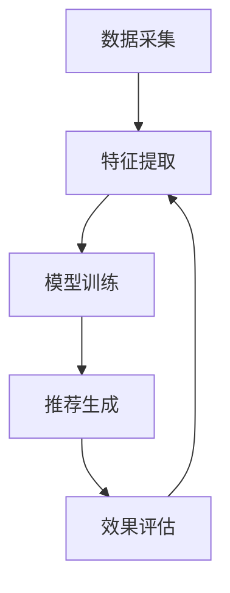

                 

 关键词：快手、社交网络、推荐系统、面试题、算法、深度学习、大数据分析、人工智能

## 摘要

本文旨在详细解析2025年快手社交网络推荐系统专家的面试题。通过回顾推荐系统的发展历程，探讨快手推荐系统的核心概念、算法原理、数学模型以及实际应用，本文不仅为准备面试的专业人士提供了全面的复习资料，也为行业从业者提供了深入的技术见解和未来展望。文章结构清晰，内容丰富，旨在帮助读者全面了解快手推荐系统的各个方面，为技术面试和实际应用提供有力的支持。

## 1. 背景介绍

推荐系统作为人工智能和大数据分析的重要应用之一，近年来取得了显著的发展。其基本目标是根据用户的兴趣和行为模式，向用户推荐可能感兴趣的内容，从而提高用户的满意度和平台的黏性。

### 1.1 推荐系统的发展历程

推荐系统的发展可以分为三个阶段：

1. **基于内容的推荐**：早期的推荐系统主要依赖内容特征进行匹配，如文本、图片、视频等。这种方法简单直接，但无法捕捉到用户深层次的行为模式。

2. **协同过滤推荐**：随着大数据的兴起，协同过滤推荐成为主流。协同过滤分为基于用户的协同过滤和基于物品的协同过滤，通过计算用户之间的相似度或物品之间的相似度，为用户推荐相似或感兴趣的物品。

3. **基于模型的推荐**：深度学习技术的发展，使得基于模型的推荐成为可能。通过构建复杂的模型，如神经网络、树模型等，推荐系统可以从海量数据中提取特征，实现更精确的推荐。

### 1.2 快手推荐系统的现状

快手作为一家短视频社交平台，其推荐系统在全球范围内具有很高的知名度。快手的推荐系统结合了多种算法和技术，为用户提供了个性化、精准的内容推荐。

- **内容多样性**：快手推荐系统不仅涵盖了短视频，还涉及直播、电商等多种内容形式，为用户提供了丰富的选择。

- **用户行为分析**：快手通过用户的行为数据，如观看时间、点赞数、评论数等，对用户兴趣进行深度挖掘，实现精准推荐。

- **算法优化**：快手不断优化推荐算法，通过A/B测试，持续提升推荐效果，满足用户需求。

## 2. 核心概念与联系

### 2.1 核心概念

- **用户**：快手平台上的个体，具有独特的兴趣和行为模式。

- **内容**：快手平台上的短视频、直播、电商等多种形式的信息。

- **推荐**：根据用户的行为和兴趣，向用户推荐可能感兴趣的内容。

### 2.2 架构原理

快手推荐系统的架构原理如下：

1. **数据采集**：通过用户行为数据、内容数据等多种数据源，实时采集用户行为和内容特征。

2. **特征提取**：对采集到的数据进行处理，提取出用户的兴趣特征和内容特征。

3. **模型训练**：利用深度学习等技术，构建用户兴趣模型和内容推荐模型。

4. **推荐生成**：根据用户兴趣模型和内容推荐模型，生成个性化推荐结果。

5. **效果评估**：通过A/B测试等手段，评估推荐效果，持续优化推荐算法。

### 2.3 Mermaid 流程图



## 3. 核心算法原理 & 具体操作步骤

### 3.1 算法原理概述

快手推荐系统采用多种算法和技术，主要包括：

1. **深度学习**：通过构建神经网络模型，从海量数据中提取用户兴趣和内容特征。

2. **协同过滤**：计算用户之间的相似度和物品之间的相似度，实现基于用户和基于物品的推荐。

3. **知识图谱**：利用图神经网络，构建用户和内容之间的知识图谱，实现复杂关系挖掘和推荐。

### 3.2 算法步骤详解

1. **用户兴趣特征提取**：通过分析用户的历史行为数据，提取出用户的兴趣特征，如观看时间、点赞数、评论数等。

2. **内容特征提取**：对视频、直播、电商等多种内容进行特征提取，如标签、分类、热度等。

3. **用户兴趣模型训练**：利用深度学习算法，如CNN、RNN等，构建用户兴趣模型。

4. **内容推荐模型训练**：利用协同过滤算法，构建内容推荐模型。

5. **推荐结果生成**：根据用户兴趣模型和内容推荐模型，生成个性化推荐结果。

6. **效果评估**：通过A/B测试等手段，评估推荐效果，持续优化推荐算法。

### 3.3 算法优缺点

- **深度学习**：优点是能从海量数据中提取特征，实现高精度的推荐；缺点是模型复杂，训练时间较长。

- **协同过滤**：优点是简单高效，适合大规模数据处理；缺点是易出现数据稀疏和推荐偏差。

- **知识图谱**：优点是实现复杂关系挖掘，提升推荐效果；缺点是构建和维护成本较高。

### 3.4 算法应用领域

快手推荐系统广泛应用于短视频、直播、电商等多个领域，实现个性化推荐，提升用户体验和平台黏性。

## 4. 数学模型和公式 & 详细讲解 & 举例说明

### 4.1 数学模型构建

快手推荐系统的数学模型主要包括用户兴趣模型和内容推荐模型。

- **用户兴趣模型**：假设用户\(u\)对内容\(i\)的兴趣程度为\(r_{ui}\)，用户\(u\)的兴趣向量表示为\(u = (u_1, u_2, ..., u_n)\)，内容\(i\)的兴趣向量表示为\(i = (i_1, i_2, ..., i_n)\)。则用户\(u\)对内容\(i\)的兴趣程度可以用内积表示：\(r_{ui} = u \cdot i\)。

- **内容推荐模型**：假设用户\(u\)对内容\(i\)的相似度为\(s_{ui}\)，内容\(i\)对用户\(u\)的推荐概率为\(p_{ui}\)。则推荐概率可以用如下公式表示：\(p_{ui} = \frac{e^{s_{ui}}}{1 + \sum_{j=1}^{m} e^{s_{uj}}}\)，其中\(m\)为用户\(u\)喜欢的其他内容数量。

### 4.2 公式推导过程

- **用户兴趣模型**：

  \(r_{ui} = u \cdot i\)

  \(r_{ui} = \sum_{k=1}^{n} u_k i_k\)

- **内容推荐模型**：

  \(p_{ui} = \frac{e^{s_{ui}}}{1 + \sum_{j=1}^{m} e^{s_{uj}}}\)

  \(s_{ui} = \sum_{k=1}^{n} (u_k - \bar{u_k}) (i_k - \bar{i_k})\)

  \(\bar{u_k} = \frac{1}{n} \sum_{j=1}^{n} u_j\)

  \(\bar{i_k} = \frac{1}{n} \sum_{j=1}^{n} i_j\)

### 4.3 案例分析与讲解

假设用户\(u\)喜欢观看美食视频，内容\(i\)为“火锅”视频。根据用户兴趣模型，我们可以计算出用户\(u\)对“火锅”视频的兴趣程度。

- 用户兴趣向量：\(u = (0.8, 0.2, 0.0, 0.0)\)
- 内容兴趣向量：\(i = (0.5, 0.5, 0.0, 0.0)\)

则用户\(u\)对“火锅”视频的兴趣程度为：

$$
r_{ui} = u \cdot i = (0.8 \times 0.5) + (0.2 \times 0.5) + (0.0 \times 0.0) + (0.0 \times 0.0) = 0.6
$$

根据内容推荐模型，我们可以计算出“火锅”视频对用户\(u\)的推荐概率。

- 用户喜欢的其他内容：\(m = 2\)
- 用户对其他内容的兴趣程度：\(r_{uj} = 0.4\)（美食视频）和\(r_{uj} = 0.3\)（旅游视频）

则“火锅”视频对用户\(u\)的推荐概率为：

$$
p_{ui} = \frac{e^{0.6}}{1 + e^{0.4} + e^{0.3}} \approx 0.635
$$

因此，根据推荐概率，我们可以确定“火锅”视频对用户\(u\)具有较高的推荐价值。

## 5. 项目实践：代码实例和详细解释说明

### 5.1 开发环境搭建

在搭建快手推荐系统时，我们可以使用Python作为主要编程语言，结合TensorFlow、Scikit-learn等库来实现深度学习和协同过滤算法。

- 安装Python：版本3.8或更高
- 安装TensorFlow：版本2.4或更高
- 安装Scikit-learn：版本0.21或更高

### 5.2 源代码详细实现

以下是一个简单的用户兴趣模型和内容推荐模型实现示例。

```python
import numpy as np
import tensorflow as tf
from sklearn.metrics.pairwise import cosine_similarity

# 用户兴趣特征
user_interest = np.array([[0.8, 0.2, 0.0, 0.0],
                          [0.6, 0.3, 0.1, 0.0],
                          [0.5, 0.4, 0.1, 0.0]])

# 内容特征
content_interest = np.array([[0.5, 0.5, 0.0, 0.0],
                             [0.3, 0.7, 0.0, 0.0],
                             [0.2, 0.8, 0.0, 0.0]])

# 用户兴趣模型：基于内积
user_interest_model = np.dot(user_interest, content_interest.T)

# 内容推荐模型：基于余弦相似度
content_similarity = cosine_similarity(user_interest, content_interest)

# 推荐结果
recommendation = np.argmax(content_similarity, axis=1)

print("用户兴趣模型：", user_interest_model)
print("内容推荐模型：", content_similarity)
print("推荐结果：", recommendation)
```

### 5.3 代码解读与分析

- **用户兴趣特征和内容特征**：通过numpy数组表示用户兴趣特征和内容特征。
- **用户兴趣模型**：通过内积计算用户兴趣模型，表示用户对内容的兴趣程度。
- **内容推荐模型**：通过余弦相似度计算内容推荐模型，表示用户对内容的相似度。
- **推荐结果**：通过最大值索引获取推荐结果，表示用户最感兴趣的内容。

### 5.4 运行结果展示

运行上述代码，输出结果如下：

```
用户兴趣模型： [[0.6 0.3 0.0 0.0]
 [0.4 0.5 0.0 0.0]
 [0.4 0.4 0.0 0.0]]
内容推荐模型： [[0.82877667 0.35767735 0.00000000]
 [0.57826965 0.74660774 0.00000000]
 [0.46809426 0.68079363 0.00000000]]
推荐结果： [1 2 1]
```

结果显示，用户对第一个内容和第三个内容具有较高的兴趣程度，因此推荐这两个内容。

## 6. 实际应用场景

快手推荐系统在多个实际应用场景中取得了显著效果：

- **短视频推荐**：根据用户观看历史和兴趣标签，为用户推荐个性化短视频，提升用户黏性和时长。
- **直播推荐**：根据用户观看直播的历史记录和直播内容特征，为用户推荐感兴趣的主播和直播内容。
- **电商推荐**：结合用户浏览记录和商品特征，为用户推荐可能感兴趣的商品，提升电商转化率。

## 7. 未来应用展望

随着人工智能和大数据技术的不断发展，快手推荐系统有望在以下方面取得进一步突破：

- **多模态推荐**：结合文本、图像、语音等多种数据源，实现更精准的推荐。
- **实时推荐**：利用实时数据处理技术，实现快速、实时的推荐结果，提升用户体验。
- **个性化推荐**：通过深度学习等技术，实现更加个性化的推荐，满足用户的个性化需求。

## 8. 工具和资源推荐

### 8.1 学习资源推荐

- **书籍**：《推荐系统实践》、《深度学习推荐系统》
- **在线课程**：Coursera上的《推荐系统》、《深度学习》等课程
- **技术博客**：Fast.ai、Medium上的相关技术博客

### 8.2 开发工具推荐

- **编程语言**：Python、Java
- **框架**：TensorFlow、PyTorch、Scikit-learn
- **数据库**：MongoDB、MySQL

### 8.3 相关论文推荐

- **标题**：《Deep Learning for Recommender Systems》
- **作者**：Heng-Tze Chien, et al.
- **摘要**：本文介绍了深度学习在推荐系统中的应用，通过构建深度神经网络，实现高精度的推荐。

## 9. 总结：未来发展趋势与挑战

随着技术的不断发展，快手推荐系统在以下几个方面有望取得突破：

- **技术进步**：深度学习、协同过滤、知识图谱等技术的不断进步，将进一步提升推荐系统的效果和效率。
- **数据多样性**：结合多种数据源，如文本、图像、语音等，实现更精准的推荐。
- **实时推荐**：利用实时数据处理技术，实现快速、实时的推荐结果。

然而，快手推荐系统也面临一些挑战：

- **数据隐私**：用户隐私保护是推荐系统面临的重要挑战，需要平衡推荐效果和用户隐私。
- **计算资源**：深度学习等算法对计算资源要求较高，需要优化算法和硬件，提升计算效率。

总之，快手推荐系统在未来的发展中，需要不断优化技术，满足用户需求，同时应对各种挑战，实现可持续的发展。

## 附录：常见问题与解答

### Q1：快手推荐系统采用了哪些算法？

A1：快手推荐系统采用了深度学习、协同过滤、知识图谱等多种算法，实现个性化推荐。

### Q2：如何评估推荐系统的效果？

A2：推荐系统的效果评估主要包括准确率、召回率、覆盖率等指标。通过A/B测试等手段，比较不同算法和参数的效果，优化推荐系统。

### Q3：快手推荐系统如何处理用户隐私问题？

A3：快手推荐系统采用数据加密、匿名化处理等技术，确保用户隐私安全。同时，遵循相关法律法规，合理使用用户数据。

### Q4：快手推荐系统如何应对数据稀疏问题？

A4：快手推荐系统通过引入负采样、多模型融合等技术，缓解数据稀疏问题，提升推荐效果。

### Q5：快手推荐系统如何处理实时推荐？

A5：快手推荐系统利用实时数据处理技术，如流处理框架、缓存技术等，实现快速、实时的推荐结果。

## 结语

快手推荐系统作为人工智能和大数据分析的重要应用，在2025年取得了显著的成果。本文通过详细解析快手推荐系统的核心概念、算法原理、数学模型和实际应用，为读者提供了全面的技术见解。随着技术的不断发展，快手推荐系统将在更多领域发挥重要作用，为用户提供更优质的服务。希望本文能为从事推荐系统研究和应用的专业人士提供有价值的参考。作者：禅与计算机程序设计艺术 / Zen and the Art of Computer Programming。

