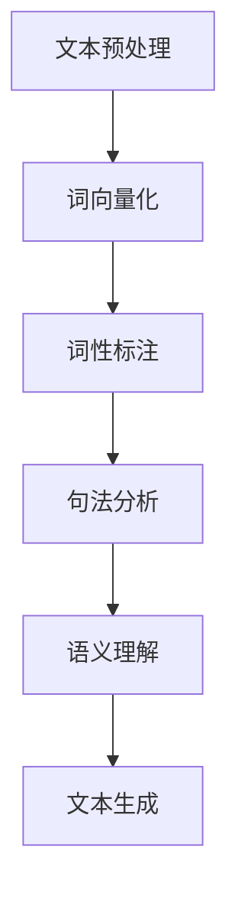

                 

关键词：自然语言处理，面试指南，百度，AI，算法原理，项目实践

> 摘要：本文旨在为准备参加2025年百度社招的自然语言处理工程师岗位的求职者提供全面的面试指南。从核心概念、算法原理、项目实践到实际应用场景，本文将深入剖析自然语言处理的各个方面，帮助读者更好地应对面试挑战。

## 1. 背景介绍

自然语言处理（Natural Language Processing，NLP）是人工智能（Artificial Intelligence，AI）领域的一个重要分支，旨在使计算机能够理解、生成和回应人类语言。随着大数据和深度学习技术的飞速发展，NLP在文本挖掘、机器翻译、语音识别、情感分析等领域取得了显著成果。百度作为全球领先的人工智能公司之一，其对NLP技术的重视程度可见一斑。此次社招自然语言处理工程师岗位，旨在进一步扩充百度在NLP领域的研发力量。

## 2. 核心概念与联系

为了更好地理解NLP，我们需要先了解一些核心概念和它们之间的关系。以下是一个简化的Mermaid流程图，展示了NLP中的关键组成部分。

### 2.1 文本预处理

文本预处理是NLP的基础步骤，包括文本的清洗、分词、去除停用词等。它为后续的词向量化、词性标注、句法分析和语义理解提供了干净的文本数据。

### 2.2 词向量化

词向量化是将文本中的词语转换成向量表示的过程。常见的词向量化模型有Word2Vec、GloVe等，它们通过捕捉词语的上下文信息，实现了对语义的编码。

### 2.3 词性标注

词性标注是对文本中的每个词赋予一个词性标签，如名词、动词、形容词等。这有助于理解句子的结构和意义。

### 2.4 句法分析

句法分析是对文本进行语法分析，包括词组识别、句法解析、依存分析等。通过句法分析，我们可以更好地理解句子的结构和含义。

### 2.5 语义理解

语义理解是NLP的最终目标，它旨在理解文本中的语义信息，包括实体识别、关系提取、情感分析等。语义理解是实现智能问答、文本生成等应用的关键。

### 2.6 文本生成

文本生成是NLP的一个应用领域，它包括机器翻译、自动摘要、文本生成对抗网络（TG

