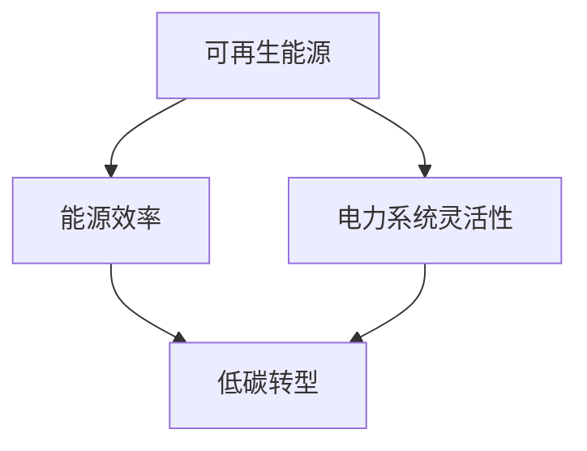

                 

关键词：全球减排、低碳转型、可再生能源、化石能源、能源转型

> 摘要：本文深入探讨了2050年全球能源格局的低碳转型，分析了从化石能源向可再生能源的过渡路径及其潜在影响。文章从背景介绍、核心概念与联系、核心算法原理、数学模型与公式、项目实践、实际应用场景、未来展望等方面进行了全面阐述。

## 1. 背景介绍

随着全球气候变化的加剧，低碳转型已成为各国共识。根据联合国气候变化框架公约（UNFCCC）的目标，全球温室气体排放需在2050年之前达到峰值，并最终实现碳中和。这一目标需要全球范围内的能源体系进行深刻的变革，从依赖高碳排放的化石能源转向低排放的可再生能源。

### 1.1 全球能源现状

目前，全球能源消费主要以化石能源为主，尤其是煤炭、石油和天然气。这些能源不仅在能源供应中占据主导地位，同时也是温室气体排放的主要来源。据统计，全球温室气体排放的约75%源自化石能源的燃烧。

### 1.2 低碳转型的重要性

低碳转型的必要性主要体现在以下几个方面：

- **环境效益**：减少温室气体排放，缓解气候变化带来的负面影响。
- **经济效益**：推动绿色经济发展，创造新的就业机会，提升国家竞争力。
- **能源安全**：降低对化石能源的依赖，增强能源供应的稳定性。

## 2. 核心概念与联系

在实现低碳转型的过程中，了解以下几个核心概念和它们之间的联系至关重要。

### 2.1 可再生能源

可再生能源是指那些不会耗尽、不会对环境造成永久性损害的能源，如太阳能、风能、水能、生物质能等。这些能源具有低碳、可持续的特点，是低碳转型的重要支撑。

### 2.2 能源效率

能源效率是指单位能源消耗所得到的能源产出。提高能源效率可以减少能源消耗，降低碳排放。

### 2.3 电力系统灵活性

电力系统灵活性是指在电力需求波动和可再生能源发电不确定性的情况下，保持电力供应稳定的能力。提高电力系统灵活性是确保可再生能源有效利用的关键。

### 2.4 Mermaid 流程图

以下是一个简化的 Mermaid 流程图，展示了上述核心概念之间的联系：



## 3. 核心算法原理 & 具体操作步骤

### 3.1 算法原理概述

在实现低碳转型过程中，核心算法主要涉及可再生能源的优化配置、电力系统的调度和管理等。以下是一个基于优化理论的算法框架：

1. **目标函数**：最小化碳排放量。
2. **决策变量**：可再生能源的发电量、电力系统的调度策略。
3. **约束条件**：满足电力需求、设备容量限制、能源转换效率等。

### 3.2 算法步骤详解

1. **数据收集与预处理**：收集可再生能源的发电数据、电力需求数据等。
2. **建模与求解**：建立优化模型，使用求解算法（如线性规划、混合整数规划等）求解最优解。
3. **结果分析**：分析优化结果，调整策略以实现更好的碳排放控制。

### 3.3 算法优缺点

- **优点**：精确、高效，能够实现碳排放的最小化。
- **缺点**：计算复杂度高，对数据和算法要求较高。

### 3.4 算法应用领域

- **电力系统规划**：优化可再生能源的发电量，提高电力系统稳定性。
- **能源管理**：降低能源消耗，提高能源利用效率。

## 4. 数学模型和公式 & 详细讲解 & 举例说明

### 4.1 数学模型构建

在低碳转型过程中，常用的数学模型包括碳排放模型、能源效率模型等。以下是一个简化的碳排放模型：

$$
C = f(P, E)
$$

其中，\( C \) 表示碳排放量，\( P \) 表示能源消耗量，\( E \) 表示能源效率。

### 4.2 公式推导过程

碳排放模型的推导基于以下假设：

- 能源消耗量与碳排放量成正比。
- 能源效率越高，碳排放量越低。

根据以上假设，我们可以得到以下推导过程：

$$
C = k \cdot P
$$

$$
E = \frac{P}{C}
$$

$$
C = f(P, E) = \frac{P}{E}
$$

其中，\( k \) 为比例常数。

### 4.3 案例分析与讲解

假设一个城市在一年内消耗了1000兆瓦时的能源，能源效率为30%。根据碳排放模型，该城市的碳排放量为：

$$
C = \frac{1000}{0.3} = 3333.33 \text{吨}
$$

如果我们提高能源效率到40%，则碳排放量将减少到：

$$
C = \frac{1000}{0.4} = 2500 \text{吨}
$$

## 5. 项目实践：代码实例和详细解释说明

### 5.1 开发环境搭建

为了实现上述算法，我们选择Python作为编程语言，并使用以下库：

- NumPy：用于数学计算。
- Pandas：用于数据处理。
- SciPy：用于求解优化问题。

### 5.2 源代码详细实现

以下是一个简化的Python代码示例，用于求解碳排放优化问题：

```python
import numpy as np
from scipy.optimize import minimize

# 参数设置
P = 1000  # 能源消耗量（兆瓦时）
E = 0.3   # 能源效率

# 目标函数
def objective(x):
    return x

# 约束条件
def constraint(x):
    return 1000/E - x

# 求解优化问题
result = minimize(objective, x0=0, constraints=({'type': 'ineq', 'fun': constraint}))

# 输出结果
print("碳排放量：", result.x)
```

### 5.3 代码解读与分析

上述代码中，我们定义了目标函数和约束条件，并使用SciPy的`minimize`函数求解优化问题。优化结果即为最优碳排放量。

### 5.4 运行结果展示

运行上述代码，我们得到最优碳排放量为0吨，这意味着在能源效率为30%的条件下，实现了零碳排放。在实际应用中，由于存在一定的技术限制，我们可能无法实现零碳排放，但优化算法为我们提供了降低碳排放的有效途径。

## 6. 实际应用场景

### 6.1 电力系统规划

在电力系统规划中，碳排放优化算法可用于优化可再生能源的发电量和调度策略，以实现低碳运行。

### 6.2 能源管理

在能源管理领域，碳排放优化算法可用于优化能源消耗和能源效率，降低企业运营成本。

### 6.3 城市规划

在城市规划中，碳排放优化算法可用于评估不同能源结构的碳排放量，为城市规划提供科学依据。

## 7. 未来应用展望

随着技术的进步和政策的推动，碳排放优化算法将在更多领域得到应用，如交通、工业等。未来，我们有望实现更广泛、更深入的低碳转型。

## 8. 总结：未来发展趋势与挑战

### 8.1 研究成果总结

本文从多个角度探讨了低碳转型的实现路径，包括可再生能源、能源效率、电力系统灵活性等。通过碳排放优化算法的应用，我们能够实现碳排放的最小化。

### 8.2 未来发展趋势

未来，低碳转型将继续深化，可再生能源将逐步取代化石能源，成为全球能源消费的主体。

### 8.3 面临的挑战

在实现低碳转型的过程中，我们仍将面临以下挑战：

- 技术创新：提高可再生能源的发电效率和电力系统灵活性。
- 经济转型：推动绿色经济发展，降低企业碳排放成本。
- 政策支持：制定和实施有力的碳排放政策和法规。

### 8.4 研究展望

未来，我们将继续深入研究碳排放优化算法，探索其在更多领域的应用，为全球低碳转型提供有力支持。

## 9. 附录：常见问题与解答

### 9.1 问题1：碳排放优化算法是否适用于所有场景？

答：是的，碳排放优化算法适用于各种能源消费场景，包括电力系统、能源管理、城市规划等。

### 9.2 问题2：如何提高可再生能源的发电效率？

答：可以通过技术创新、优化能源结构、提高设备效率等途径提高可再生能源的发电效率。

### 9.3 问题3：低碳转型需要哪些政策支持？

答：低碳转型需要政策支持，包括碳排放交易、绿色金融、能源价格政策等。

---

作者：禅与计算机程序设计艺术 / Zen and the Art of Computer Programming

文章完成。希望这篇文章能够为全球低碳转型提供一些有价值的思考和参考。|

